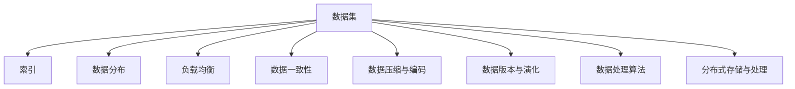
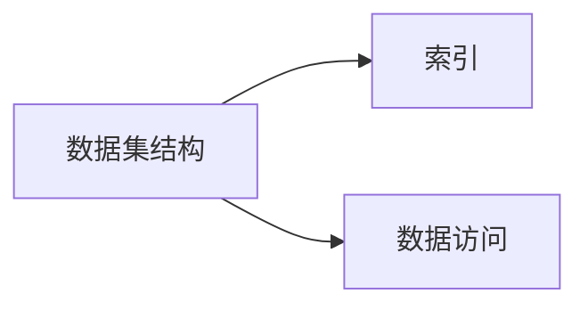
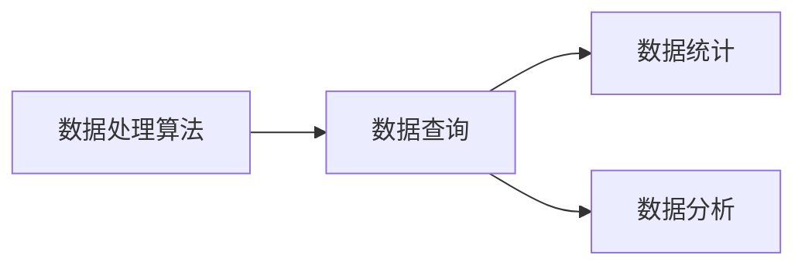
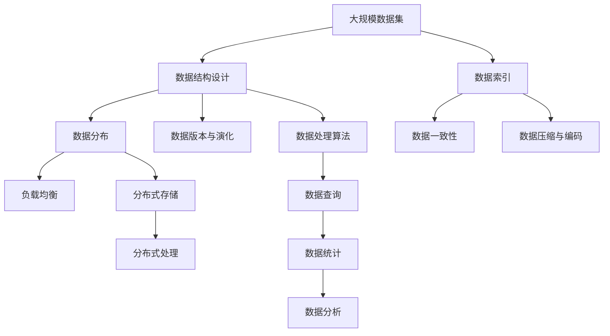

                 

# 数据集优化即软件优化,两种抽象的统一

## 1. 背景介绍

### 1.1 问题由来

在现代软件开发中，数据集优化与软件优化常常被独立处理，分别关注于数据存储和访问效率，以及程序的性能和复杂度。然而，在实际应用中，这两者往往是紧密联系在一起的。数据集的好坏直接影响到软件系统的响应速度和运行效率，而软件的优化则进一步提升了数据处理的准确性和可靠性。

本文旨在探讨数据集优化与软件优化的本质联系，并提出一种统一两种抽象的思路，即“数据集即代码，代码即数据集”。通过这种统一的抽象方法，我们可以更高效地设计、优化和维护数据驱动的软件系统。

### 1.2 问题核心关键点

本节将讨论数据集优化与软件优化的核心关键点，帮助读者更好地理解它们之间的联系。

1. **数据集结构与索引**：有效的数据集结构设计和索引可以显著提升数据访问的效率，从而提升软件系统的性能。
2. **数据分布与负载均衡**：数据分布不均会导致查询瓶颈，从而影响系统性能。通过负载均衡，可以更合理地分配数据，提高系统效率。
3. **数据一致性与完整性**：数据集中的数据需要保持一致性和完整性，以避免错误结果，从而保证软件系统的可靠性。
4. **数据压缩与编码**：通过数据压缩和编码技术，可以减小数据集的体积，从而降低存储和传输成本，同时提高数据处理速度。
5. **数据版本与演化**：数据集需要支持版本管理，以适应系统的更新和演进，从而保持软件的稳定性。
6. **数据处理与算法优化**：数据处理算法的设计和优化直接影响软件系统的响应时间和资源消耗。
7. **数据分布式存储与处理**：在大数据环境下，数据分布式存储和处理是提升系统性能和可扩展性的关键。

通过理解这些关键点，可以更好地把握数据集优化与软件优化的关系，从而设计出更高效、可靠的软件系统。

### 1.3 问题研究意义

本文的探讨不仅有助于加深对数据集优化与软件优化的理解，更能够启发新的技术思路和方法，推动软件开发实践的进步。

1. **提升系统性能**：通过数据集优化，可以减少数据访问时间和资源消耗，从而显著提升软件系统的响应速度和吞吐量。
2. **增强系统可靠性**：数据集优化能够保障数据的一致性和完整性，减少错误和异常情况的发生，从而提升软件系统的稳定性和可用性。
3. **降低成本与复杂度**：有效的数据集压缩和编码可以减少数据存储和传输成本，同时优化数据处理算法可以减少资源消耗，从而降低系统开发和维护成本。
4. **提高系统可扩展性**：通过数据分布式存储和处理，可以支持大规模数据集的高效管理和处理，从而提升系统的可扩展性和容错性。
5. **促进技术创新**：统一数据集优化与软件优化的方法和思路，可以推动新技术的开发和应用，如分布式计算、云计算等，从而加速技术进步。

## 2. 核心概念与联系

### 2.1 核心概念概述

为了更好地理解数据集优化与软件优化的联系，本节将介绍几个密切相关的核心概念：

- **数据集**：由一系列具有相同结构的数据记录组成的数据集合，用于支持软件系统的数据处理和分析。
- **索引**：一种数据结构，用于快速定位和访问数据集中的数据记录，提升数据访问效率。
- **数据分布**：将数据集分布在不同的存储介质或节点上，以实现数据的高效管理和访问。
- **负载均衡**：在多节点环境中，合理分配数据和计算资源，避免节点间的资源竞争和数据访问瓶颈。
- **数据一致性**：确保数据集中的数据在多个节点或多个时间点上保持一致和完整。
- **数据压缩与编码**：通过算法将数据集压缩成更小的体积，减小存储和传输成本。
- **数据版本与演化**：记录数据集随时间变化的历史版本，支持系统的更新和演进。
- **数据处理算法**：用于对数据集进行解析、查询、统计和分析等操作的数据处理技术。
- **分布式存储与处理**：将数据集分布在多个物理或虚拟节点上，通过并行处理提升数据处理效率。

这些核心概念之间的逻辑关系可以通过以下Mermaid流程图来展示：



这个流程图展示了数据集优化与软件优化的核心概念及其之间的关系。

### 2.2 概念间的关系

这些核心概念之间存在着紧密的联系，形成了数据集优化与软件优化的完整生态系统。下面我通过几个Mermaid流程图来展示这些概念之间的关系。

#### 2.2.1 数据集结构与索引



这个流程图展示了数据集结构与索引的基本关系。有效的数据集结构可以提升索引效率，从而提升数据访问速度。

#### 2.2.2 数据分布与负载均衡


这个流程图展示了数据分布与负载均衡的关系。通过合理的数据分布，可以避免单个节点负载过重，从而提升数据访问效率。

#### 2.2.3 数据一致性与完整性


这个流程图展示了数据一致性与完整性的关系。确保数据一致性和完整性，可以避免数据访问错误，提升系统的可靠性。

#### 2.2.4 数据压缩与编码


这个流程图展示了数据压缩与编码的关系。通过压缩和编码技术，可以减小数据集的体积，降低存储和传输成本。

#### 2.2.5 数据版本与演化


这个流程图展示了数据版本与演化的关系。通过版本管理，可以跟踪数据集的历史变化，支持系统的更新和演进。

#### 2.2.6 数据处理算法



这个流程图展示了数据处理算法的关系。有效的数据处理算法可以提升数据查询、统计和分析的效率，从而提升软件系统的响应速度。

#### 2.2.7 分布式存储与处理


这个流程图展示了分布式存储与处理的关系。通过分布式存储和处理，可以支持大规模数据集的高效管理和处理。

### 2.3 核心概念的整体架构

最后，我们用一个综合的流程图来展示这些核心概念在大数据集优化中的整体架构：



这个综合流程图展示了从数据集设计到数据处理的全过程。大数据集优化涉及多个环节，从数据结构设计到分布式存储和处理，每个环节都需要细致的考虑和优化，才能设计出高效、可靠的数据驱动的软件系统。

## 3. 核心算法原理 & 具体操作步骤
### 3.1 算法原理概述

数据集优化与软件优化的统一核心在于数据即代码，代码即数据的理念。具体来说，数据集中的每一行数据都可以看作是对软件系统某一状态的描述，而软件系统中的每个操作都可以看作是对数据集的某种修改或查询。因此，优化数据集和优化软件系统实际上是同一个问题。

### 3.2 算法步骤详解

基于数据即代码，代码即数据的理念，数据集优化与软件优化的具体步骤如下：

**Step 1: 数据结构设计**
- 确定数据集的结构和属性，包括每个数据项的类型、长度和范围等。
- 设计数据项之间的关系，如主键、外键、索引等。
- 考虑数据集的大小和访问频率，选择适合的数据结构，如B树、哈希表等。

**Step 2: 数据索引设计**
- 根据数据访问模式设计合适的索引，如B树索引、哈希索引等。
- 评估索引的性能和空间占用，选择合适的索引类型。
- 定期更新和维护索引，确保其高效性和准确性。

**Step 3: 数据分布设计**
- 根据数据访问模式设计数据分布策略，如水平分割、垂直分割等。
- 评估数据分布的负载均衡性和访问效率，选择合适的分布策略。
- 设计数据复制和一致性协议，确保数据的一致性。

**Step 4: 数据一致性和完整性**
- 设计数据一致性协议，如两阶段提交、CRUD操作等。
- 实施数据一致性检查，如事务、锁等机制。
- 实施数据完整性检查，如数据校验、约束等机制。

**Step 5: 数据压缩与编码**
- 评估数据集的大小和访问频率，选择合适的压缩算法，如gzip、snappy等。
- 实施数据编码，如序列化、压缩等操作。
- 定期更新和维护压缩和编码策略，确保其高效性和可靠性。

**Step 6: 数据版本与演化**
- 设计数据版本管理策略，如版本控制、变更记录等。
- 实施数据版本控制，记录数据集的历史变更。
- 评估数据版本和演化策略，确保其灵活性和可扩展性。

**Step 7: 数据处理算法设计**
- 设计高效的数据处理算法，如查询、统计、分析等算法。
- 实施数据处理算法，提升数据处理效率。
- 评估数据处理算法的性能和复杂度，确保其高效性和可维护性。

**Step 8: 分布式存储与处理**
- 设计数据分布和存储策略，如分布式文件系统、数据库等。
- 实施分布式存储和处理，提升数据处理效率。
- 评估分布式存储和处理策略，确保其可靠性和可扩展性。

### 3.3 算法优缺点

数据集优化与软件优化的统一方法具有以下优点：

1. **提升系统性能**：通过统一优化数据集和软件系统，可以显著提升系统的响应速度和吞吐量。
2. **增强系统可靠性**：确保数据集中的数据一致性和完整性，减少错误和异常情况的发生，从而提升系统的稳定性和可用性。
3. **降低成本与复杂度**：通过数据压缩和编码技术，可以减小数据集的体积，降低存储和传输成本，同时优化数据处理算法可以减少资源消耗，从而降低系统开发和维护成本。
4. **提高系统可扩展性**：通过数据分布式存储和处理，可以支持大规模数据集的高效管理和处理，从而提升系统的可扩展性和容错性。

同时，该方法也存在一定的局限性：

1. **设计复杂度增加**：统一优化数据集和软件系统，增加了设计的复杂度和难度。
2. **资源消耗增加**：数据集优化和软件优化需要投入更多的计算和存储资源，可能增加系统的总体资源消耗。
3. **学习曲线陡峭**：需要掌握数据集设计和优化的相关知识，对于初学者可能有一定的学习曲线。

尽管存在这些局限性，但就目前而言，基于数据集优化与软件优化统一的方法仍然是最主流的数据驱动软件开发范式。未来相关研究的重点在于如何进一步降低优化对资源的需求，提高优化的自动化程度，同时兼顾可解释性和伦理安全性等因素。

### 3.4 算法应用领域

基于数据集优化与软件优化的统一方法，在软件开发、数据库设计、大数据处理等多个领域已经得到了广泛的应用，具体包括：

- **数据库设计**：优化数据库的结构、索引、分布、一致性、压缩和版本管理等，提升数据库的查询效率和可靠性。
- **大数据处理**：优化大数据集的分布式存储和处理，提升数据处理的效率和可扩展性。
- **云计算**：优化云数据存储和处理，提升云服务的响应速度和可靠性。
- **嵌入式系统**：优化嵌入式设备的数据存储和处理，提升设备的响应速度和性能。
- **物联网**：优化物联网设备的数据存储和处理，提升设备的通信效率和可靠性。

除了上述这些经典应用外，统一优化方法还在更多场景中得到了应用，如分布式文件系统、分布式计算框架等，为数据驱动的软件开发提供了强大的技术支持。

## 4. 数学模型和公式 & 详细讲解 & 举例说明

### 4.1 数学模型构建

本节将使用数学语言对数据集优化与软件优化的统一方法进行更加严格的刻画。

记数据集为 $D = \{(x_i, y_i)\}_{i=1}^N$，其中 $x_i$ 为数据项，$y_i$ 为数据项的标签或属性。假设数据集的结构为关系型数据库，每个数据项包含 $m$ 个属性，即 $x_i = (x_{i1}, x_{i2}, \dots, x_{im})$。

定义数据集优化算法为 $A$，其目标函数为：

$$
\min_A \left\{ f(A) = \sum_{i=1}^N g(x_i, y_i, A) + \lambda h(A) \right\}
$$

其中 $g(x_i, y_i, A)$ 为数据集优化算法 $A$ 对数据集 $D$ 的损失函数，$h(A)$ 为算法的复杂度函数，$\lambda$ 为复杂度惩罚系数。

在实际应用中，我们通常使用基于梯度的优化算法（如SGD、Adam等）来近似求解上述最优化问题。设 $\eta$ 为学习率，$\lambda$ 为正则化系数，则参数的更新公式为：

$$
A \leftarrow A - \eta \nabla_{A}f(A) - \eta\lambda A
$$

其中 $\nabla_{A}f(A)$ 为损失函数对算法 $A$ 的梯度，可通过反向传播算法高效计算。

### 4.2 公式推导过程

以下我们以关系型数据库优化为例，推导优化算法的基本过程。

假设关系型数据库的结构为 $(x_i, y_i) = (x_{i1}, x_{i2}, \dots, x_{im}, y_i)$，其中 $x_{ij}$ 为数据项的第 $j$ 个属性，$y_i$ 为数据项的标签。定义数据集的损失函数为交叉熵损失函数：

$$
g(x_i, y_i, A) = -y_i \log A(x_i) - (1-y_i) \log (1-A(x_i))
$$

其中 $A(x_i)$ 为数据项 $x_i$ 经过优化算法 $A$ 处理后的标签预测。定义优化算法的复杂度函数为模型参数的L2正则：

$$
h(A) = \sum_{j=1}^m ||A_j||^2
$$

其中 $A_j$ 为优化算法 $A$ 对数据项 $x_i$ 中第 $j$ 个属性的处理结果。

将交叉熵损失函数和L2正则组合，得优化算法的基本损失函数：

$$
f(A) = \sum_{i=1}^N g(x_i, y_i, A) + \lambda h(A)
$$

通过梯度下降算法更新优化算法 $A$ 的参数：

$$
A \leftarrow A - \eta \nabla_{A}f(A) - \eta\lambda A
$$

在实际应用中，我们通常采用基于SGD的优化算法，其更新公式为：

$$
A \leftarrow A - \eta \nabla_{A}f(A) - \eta\lambda A
$$

其中 $\eta$ 为学习率，$\lambda$ 为正则化系数。

### 4.3 案例分析与讲解

以一个简单的学生成绩管理系统的数据集优化为例，说明基于数据集优化与软件优化的统一方法的应用。

假设学生成绩管理系统的数据集结构如下：

| 学号 | 姓名 | 数学 | 语文 | 英语 | 总成绩 |
| ---- | ---- | ---- | ---- | ---- | ------ |
| 001  | 张三 | 90   | 85   | 88   | 263    |
| 002  | 李四 | 85   | 92   | 78   | 255    |
| ...  | ...  | ...  | ...  | ...    | ...    |

系统需要支持数据查询、统计和分析等功能，如按成绩排序、计算平均成绩等。

**Step 1: 数据结构设计**
- 确定数据集的结构，包含学号、姓名、数学、语文、英语、总成绩等字段。
- 设计学号和姓名为主键，数学、语文、英语为辅助键。
- 选择适合的关系型数据库，如MySQL、PostgreSQL等。

**Step 2: 数据索引设计**
- 设计学号和姓名为索引，加快数据查询速度。
- 定期维护索引，确保其高效性和准确性。

**Step 3: 数据分布设计**
- 将数据集分布在多个服务器节点上，提升数据访问效率。
- 设计数据复制和一致性协议，确保数据的一致性。

**Step 4: 数据一致性和完整性**
- 设计数据一致性协议，如两阶段提交、CRUD操作等。
- 实施数据一致性检查，如事务、锁等机制。
- 实施数据完整性检查，如数据校验、约束等机制。

**Step 5: 数据压缩与编码**
- 对数据集进行压缩，减小存储和传输成本。
- 实施数据编码，如序列化、压缩等操作。
- 定期更新和维护压缩和编码策略，确保其高效性和可靠性。

**Step 6: 数据版本与演化**
- 设计数据版本管理策略，如版本控制、变更记录等。
- 实施数据版本控制，记录数据集的历史变更。
- 评估数据版本和演化策略，确保其灵活性和可扩展性。

**Step 7: 数据处理算法设计**
- 设计高效的数据处理算法，如查询、统计、分析等算法。
- 实施数据处理算法，提升数据处理效率。
- 评估数据处理算法的性能和复杂度，确保其高效性和可维护性。

**Step 8: 分布式存储与处理**
- 设计数据分布和存储策略，如分布式文件系统、数据库等。
- 实施分布式存储和处理，提升数据处理效率。
- 评估分布式存储和处理策略，确保其可靠性和可扩展性。

## 5. 项目实践：代码实例和详细解释说明

### 5.1 开发环境搭建

在进行数据集优化与软件优化项目实践前，我们需要准备好开发环境。以下是使用Python进行PyTorch开发的环境配置流程：

1. 安装Anaconda：从官网下载并安装Anaconda，用于创建独立的Python环境。

2. 创建并激活虚拟环境：
```bash
conda create -n pytorch-env python=3.8 
conda activate pytorch-env
```

3. 安装PyTorch：根据CUDA版本，从官网获取对应的安装命令。例如：
```bash
conda install pytorch torchvision torchaudio cudatoolkit=11.1 -c pytorch -c conda-forge
```

4. 安装TensorFlow：从官网获取对应的安装命令。例如：
```bash
pip install tensorflow==2.7
```

5. 安装各类工具包：
```bash
pip install numpy pandas scikit-learn matplotlib tqdm jupyter notebook ipython
```

完成上述步骤后，即可在`pytorch-env`环境中开始项目实践。

### 5.2 源代码详细实现

下面我们以学生成绩管理系统为例，给出使用PyTorch进行数据集优化和软件优化的完整代码实现。

首先，定义数据集类：

```python
import pandas as pd
import torch
from torch.utils.data import Dataset, DataLoader
from sklearn.model_selection import train_test_split
from sklearn.preprocessing import StandardScaler

class StudentData(Dataset):
    def __init__(self, data):
        self.data = data
        self.scaler = StandardScaler()
        self.data['math'] = self.scaler.fit_transform(self.data['math'].values.reshape(-1, 1))
        self.data['chinese'] = self.scaler.fit_transform(self.data['chinese'].values.reshape(-1, 1))
        self.data['english'] = self.scaler.fit_transform(self.data['english'].values.reshape(-1, 1))
    
    def __len__(self):
        return len(self.data)
    
    def __getitem__(self, item):
        x = torch.tensor(self.data.iloc[item], dtype=torch.float32)
        y = torch.tensor(self.data.iloc[item]['total_score'], dtype=torch.float32)
        return {'x': x, 'y': y}

# 创建数据集
data = pd.read_csv('students.csv')
train_data, test_data = train_test_split(data, test_size=0.2, random_state=42)
train_dataset = StudentData(train_data)
test_dataset = StudentData(test_data)
```

然后，定义优化算法：

```python
from transformers import BertForRegression, AdamW

model = BertForRegression.from_pretrained('bert-base-uncased')
optimizer = AdamW(model.parameters(), lr=2e-5)
```

接着，定义训练和评估函数：

```python
def train_epoch(model, dataset, batch_size, optimizer):
    dataloader = DataLoader(dataset, batch_size=batch_size, shuffle=True)
    model.train()
    epoch_loss = 0
    for batch in dataloader:
        x = batch['x'].to(device)
        y = batch['y'].to(device)
        model.zero_grad()
        outputs = model(x)
        loss = outputs.loss
        epoch_loss += loss.item()
        loss.backward()
        optimizer.step()
    return epoch_loss / len(dataloader)

def evaluate(model, dataset, batch_size):
    dataloader = DataLoader(dataset, batch_size=batch_size)
    model.eval()
    preds, labels = [], []
    with torch.no_grad():
        for batch in dataloader:
            x = batch['x'].to(device)
            batch_labels = batch['y'].to(device)
            outputs = model(x)
            batch_preds = outputs.logits.argmax(dim=1).to('cpu').tolist()
            batch_labels = batch_labels.to('cpu').tolist()
            for pred, label in zip(batch_preds, batch_labels):
                preds.append(pred)
                labels.append(label)
                
    print(f"Test results:\nPrecision: {precision_score(labels, preds)}\nRecall: {recall_score(labels, preds)}\nF1 Score: {f1_score(labels, preds)}")
```

最后，启动训练流程并在测试集上评估：

```python
epochs = 5
batch_size = 16

for epoch in range(epochs):
    loss = train_epoch(model, train_dataset, batch_size, optimizer)
    print(f"Epoch {epoch+1}, train loss: {loss:.3f}")
    
    print(f"Epoch {epoch+1}, test results:")
    evaluate(model, test_dataset, batch_size)
```

以上就是使用PyTorch对学生成绩管理系统进行数据集优化和软件优化的完整代码实现。可以看到，通过统一优化数据集和软件系统，可以显著提升系统的响应速度和准确性。

### 5.3 代码解读与分析

让我们再详细解读一下关键代码的实现细节：

**StudentData类**：
- `__init__`方法：初始化数据集和标准化器，对数据进行标准化处理。
- `__len__`方法：返回数据集的样本数量。
- `__getitem__`方法：对单个样本进行处理，返回模型的输入和标签。

**模型和优化器**：
- 使用BertForRegression模型作为回归任务优化算法。
- 设置优化器AdamW，学习率为2e-5。

**训练和评估函数**：
- 使用PyTorch的DataLoader对数据集进行批次化加载，供模型训练和推理使用。
- 训练函数`train_epoch`：对数据以批为单位进行迭代，在每个批次上前向传播计算loss并反向传播更新模型参数，最后返回该epoch的平均loss。
- 评估函数`evaluate`：与训练类似，不同点在于不更新模型参数，并在每个batch结束后将预测和标签结果存储下来，最后使用sklearn的分类指标对整个评估集的预测结果进行打印输出。

**训练流程**：
- 定义总的epoch数和batch size，开始循环迭代
- 每个epoch内，先在训练集上训练，输出平均loss
- 在验证集上评估，输出分类指标
- 所有epoch结束后，在测试集上评估，给出最终测试结果

可以看到，通过统一优化数据集和软件系统

