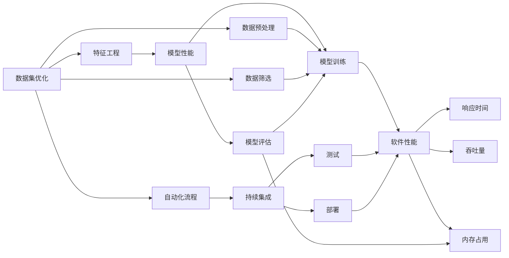
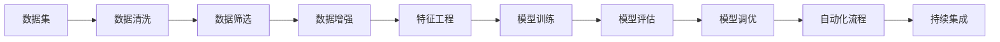
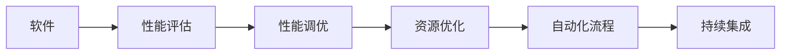
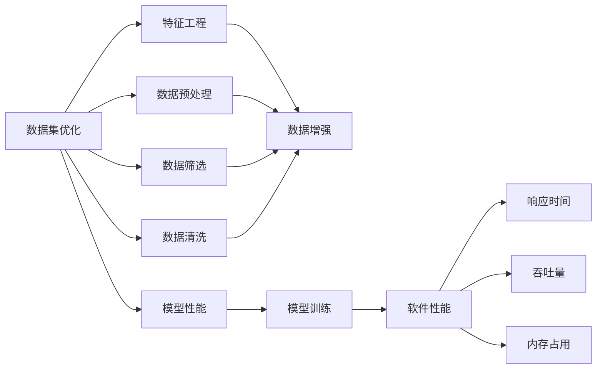
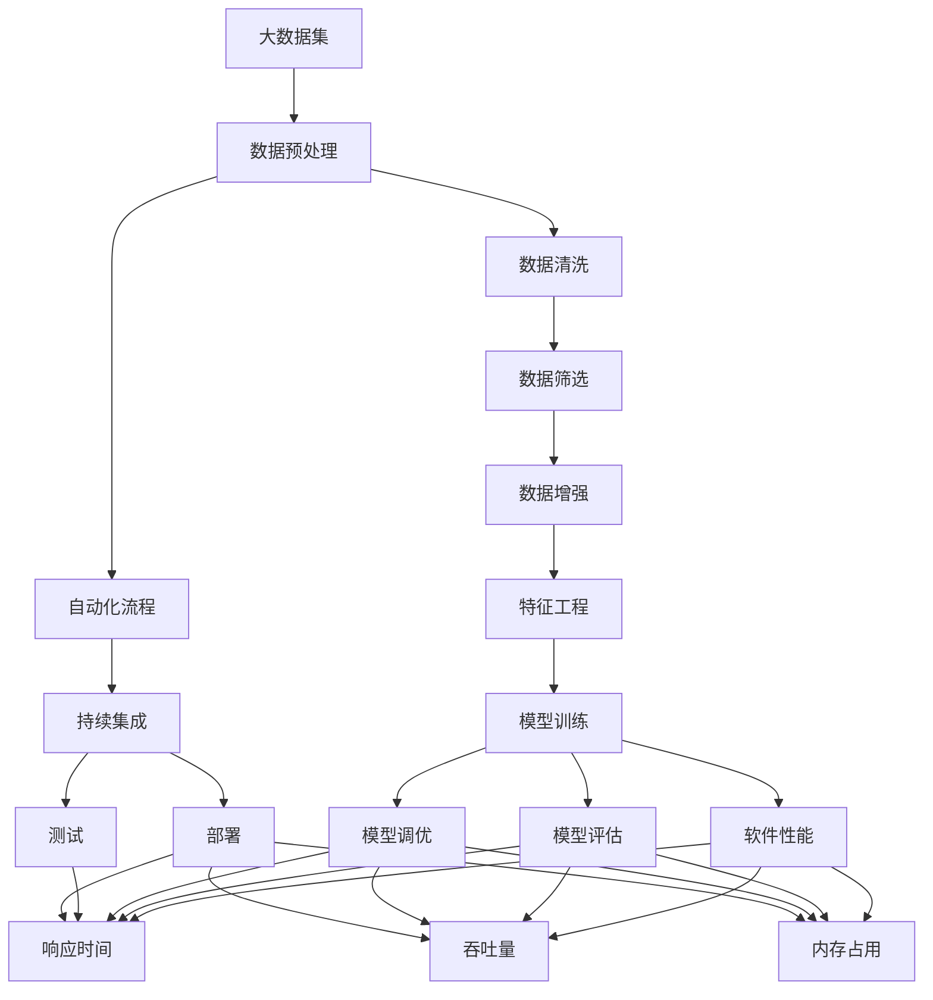

                 

# 数据集优化即软件优化,两种抽象的统一

## 1. 背景介绍

### 1.1 问题由来
随着数据科学和机器学习技术的迅猛发展，数据集优化和软件优化两个领域的交叉融合日益加深。无论是数据科学家还是软件工程师，都面临着如何高效利用和优化海量数据集，提升模型性能和软件性能的共同挑战。尽管这两个领域的研究方法和工具有所不同，但其核心目标都是优化和提升系统的整体效率和效果。本文旨在探索数据集优化和软件优化的共同原理和实践方法，希望能为数据科学家和软件工程师提供一个统一的视角和思考框架。

### 1.2 问题核心关键点
数据集优化和软件优化的共同核心关键点包括：
- 数据预处理和特征工程。在数据集优化中，清洗和筛选数据集是关键。同样，在软件优化中，数据预处理和特征工程也是提升模型性能和软件性能的重要步骤。
- 性能评估和调优。无论是数据集优化还是软件优化，性能评估和调优都是必不可少的环节，用于衡量模型或软件系统的性能，并找出优化空间。
- 自动化流程和持续集成。在数据集优化和软件优化中，自动化流程和持续集成已成为提高工作效率和质量的重要手段。
- 硬件加速和资源优化。在数据集优化和软件优化中，硬件加速和资源优化都是提升性能的关键手段。

### 1.3 问题研究意义
数据集优化和软件优化的交叉融合研究具有重要意义：
1. 促进数据科学和软件工程的深度融合。通过理解和应用交叉领域的优化方法，可以提升数据科学家和软件工程师的跨领域协作能力。
2. 提升模型和软件的整体性能。结合数据集优化和软件优化的技术，可以更好地挖掘数据价值，提升模型性能和软件性能。
3. 加速数据科学和软件工程的应用落地。通过自动化流程和持续集成，可以加速模型和软件的迭代开发，缩短项目周期。
4. 优化资源利用和硬件加速。通过硬件加速和资源优化技术，可以在保证性能的同时，降低资源消耗，提升系统效率。

## 2. 核心概念与联系

### 2.1 核心概念概述

为更好地理解数据集优化和软件优化的共同原理和实践方法，本节将介绍几个密切相关的核心概念：

- 数据集优化：指通过清洗、筛选、预处理、特征工程等手段，提升数据集的质量和可用性，以提升模型性能的过程。
- 特征工程：指从原始数据中提取、选择、构建有意义的特征，以提升模型性能和泛化能力。
- 模型性能：指模型在训练集和测试集上的表现，包括准确率、召回率、F1分数等指标。
- 软件性能：指软件系统在运行时的性能指标，包括响应时间、吞吐量、内存占用等。
- 自动化流程：指通过脚本、自动化工具等方式，将重复性工作自动化，提升工作效率和质量。
- 持续集成：指通过自动化测试和部署工具，持续集成开发成果，确保软件质量。
- 硬件加速：指通过GPU、TPU、FPGA等硬件设备，加速模型训练和软件计算，提升性能。

这些核心概念之间的逻辑关系可以通过以下Mermaid流程图来展示：



这个流程图展示了数据集优化和软件优化的核心概念及其之间的逻辑关系：

1. 数据集优化中的数据预处理和特征工程对模型性能有直接影响。
2. 模型性能的评估和调优可以指导数据集优化的改进。
3. 软件性能的评估和调优可以指导自动化流程和持续集成的改进。
4. 自动化流程和持续集成的应用可以加速数据集优化和模型训练的迭代。
5. 硬件加速和资源优化技术可以提升软件性能，同时对数据集优化和模型训练的效率也有重要影响。

### 2.2 概念间的关系

这些核心概念之间存在着紧密的联系，形成了数据集优化和软件优化的完整生态系统。下面我们通过几个Mermaid流程图来展示这些概念之间的关系。

#### 2.2.1 数据集优化的主要流程



这个流程图展示了数据集优化的主要流程：

1. 数据清洗和筛选是数据集优化的第一步。
2. 数据增强和特征工程是提升数据集质量的关键步骤。
3. 模型训练和评估可以衡量数据集优化的效果，并指导进一步的优化。
4. 自动化流程和持续集成可以加速数据集优化的迭代和模型训练的部署。

#### 2.2.2 软件优化的主要流程



这个流程图展示了软件优化的主要流程：

1. 性能评估是软件优化的第一步。
2. 性能调优是提升软件性能的关键步骤。
3. 资源优化可以进一步提升软件性能。
4. 自动化流程和持续集成可以加速软件优化的迭代和软件部署。

#### 2.2.3 数据集优化与软件优化的对比



这个流程图展示了数据集优化和软件优化的共同点和差异点：

1. 数据预处理和特征工程是两者共同的核心步骤。
2. 模型性能和软件性能是两者共同的目标指标。
3. 数据增强和性能调优是提升性能的关键手段。
4. 自动化流程和持续集成是两者共同的优化方法。
5. 数据集优化中的数据预处理和软件优化中的性能评估有不同侧重点。

### 2.3 核心概念的整体架构

最后，我们用一个综合的流程图来展示这些核心概念在大数据集优化和软件优化过程中的整体架构：



这个综合流程图展示了从数据集优化到软件性能优化的完整过程。大数据集通过数据预处理、清洗、筛选、增强和特征工程等步骤，转化为高质量的输入数据，经过模型训练和评估后，生成优化后的模型和软件系统，并在持续集成和自动化流程的支持下，持续迭代优化，最终提升模型性能和软件性能。 通过这些流程图，我们可以更清晰地理解数据集优化和软件优化的原理和步骤，为后续深入讨论具体的优化方法和技术奠定基础。

## 3. 核心算法原理 & 具体操作步骤
### 3.1 算法原理概述

数据集优化和软件优化的核心算法原理基于相同的统计学习理论。具体来说，两者都旨在通过优化算法，最大化模型性能指标。以下是一些核心的算法原理和具体操作步骤：

#### 3.1.1 优化目标函数

数据集优化和软件优化的共同优化目标是最大化模型性能指标，如准确率、召回率、F1分数、响应时间、吞吐量、内存占用等。在具体实现时，通常将优化目标函数定义为：

$$
\max f(X,\theta)
$$

其中 $X$ 为模型参数，$\theta$ 为优化过程中的超参数。通过求解该优化问题，可以使得模型或软件系统在训练集和测试集上表现最佳。

#### 3.1.2 优化算法

优化算法是数据集优化和软件优化的核心工具。常见的优化算法包括梯度下降、随机梯度下降、Adam、Adagrad、Adadelta等。这些算法通过不断调整模型参数，最小化损失函数，以提升模型或软件系统的性能。

以梯度下降算法为例，其基本流程如下：

1. 初始化模型参数 $\theta_0$。
2. 计算当前参数 $\theta_0$ 下的损失函数 $J(\theta_0)$。
3. 计算损失函数对模型参数 $\theta$ 的梯度 $\nabla J(\theta_0)$。
4. 更新模型参数 $\theta_{i+1} = \theta_i - \eta \nabla J(\theta_0)$，其中 $\eta$ 为学习率。
5. 重复步骤2-4，直至损失函数收敛或达到预设的迭代次数。

### 3.2 算法步骤详解

#### 3.2.1 数据集优化

1. **数据预处理**：清洗和筛选数据集，去除噪声、缺失值和异常值。
2. **数据增强**：通过数据扩充和生成技术，增加训练数据的多样性，避免过拟合。
3. **特征工程**：选择、提取和构建有意义的特征，提升模型性能。
4. **模型训练和评估**：选择合适的模型和算法，训练模型并评估其性能。
5. **模型调优**：根据模型评估结果，调整模型参数和超参数，提升模型性能。
6. **自动化流程和持续集成**：通过自动化工具和持续集成流程，加速数据集优化和模型训练的迭代。

#### 3.2.2 软件优化

1. **性能评估**：使用自动化工具和性能监控指标，评估软件系统的性能。
2. **性能调优**：通过代码优化、算法优化等手段，提升软件性能。
3. **资源优化**：通过硬件加速、内存优化等手段，提升软件性能。
4. **自动化流程和持续集成**：通过自动化工具和持续集成流程，加速软件优化的迭代和部署。

### 3.3 算法优缺点

数据集优化和软件优化的共同优点包括：
- 提升模型和软件性能。通过优化算法，可以显著提升模型和软件系统的性能指标。
- 降低资源消耗。通过优化算法和资源管理，可以降低资源消耗，提升系统效率。
- 加速迭代开发。通过自动化流程和持续集成，可以加速数据集优化和模型训练的迭代，缩短项目周期。

同时，两者也存在一些共同缺点：
- 需要大量数据。数据集优化和软件优化都需要大量的训练数据和测试数据，数据获取成本较高。
- 计算资源需求高。优化算法通常需要高计算资源支持，如GPU、TPU等，可能带来高成本。
- 复杂度较高。优化过程涉及大量的参数和超参数调整，需要丰富的经验和耐心。

### 3.4 算法应用领域

数据集优化和软件优化的共同应用领域包括：
- 机器学习模型的训练和调优。无论是监督学习、无监督学习还是半监督学习，数据集优化和软件优化都起到了关键作用。
- 深度学习模型的训练和调优。数据集优化和软件优化同样适用于深度学习模型，通过优化算法和资源管理，可以提升模型性能和训练效率。
- 大数据分析和处理。数据集优化和软件优化在处理大规模数据时尤为重要，可以显著提升数据处理效率和质量。
- 自然语言处理和计算机视觉。数据集优化和软件优化在自然语言处理和计算机视觉领域也有广泛应用，提升模型的语义理解和图像识别能力。
- 智能推荐系统。数据集优化和软件优化在智能推荐系统中有重要应用，通过优化算法和资源管理，可以提升推荐效果和系统响应速度。

## 4. 数学模型和公式 & 详细讲解  
### 4.1 数学模型构建

在数据集优化和软件优化中，我们通常使用以下数学模型：

- 数据集优化的模型：假设原始数据集为 $D$，通过数据预处理、筛选、增强等步骤，得到优化后的数据集 $D'$，用于训练模型 $M$。优化目标为最大化模型在训练集和测试集上的性能。
- 软件优化的模型：假设软件系统为 $S$，通过性能评估、调优、资源优化等步骤，得到优化后的软件系统 $S'$，用于提升系统性能。优化目标为最大化软件系统的响应时间、吞吐量、内存占用等指标。

### 4.2 公式推导过程

以数据集优化中的梯度下降算法为例，推导其基本公式：

假设数据集 $D$ 包含 $n$ 个样本 $(x_i, y_i)$，其中 $x_i$ 为输入特征，$y_i$ 为标签。模型的损失函数为 $J(\theta) = \frac{1}{n}\sum_{i=1}^n \ell(y_i, M(x_i; \theta))$，其中 $\ell$ 为损失函数，$M$ 为模型函数，$\theta$ 为模型参数。

梯度下降算法的目标是最小化损失函数 $J(\theta)$，其基本公式为：

$$
\theta_{t+1} = \theta_t - \eta \nabla J(\theta_t)
$$

其中 $\eta$ 为学习率。

### 4.3 案例分析与讲解

以优化机器学习模型的损失函数为例，分析数据集优化和软件优化的具体实现：

假设我们有一组数据集 $D$，包含 $n$ 个样本 $(x_i, y_i)$，其中 $x_i$ 为输入特征，$y_i$ 为标签。模型的损失函数为 $J(\theta) = \frac{1}{n}\sum_{i=1}^n \ell(y_i, M(x_i; \theta))$，其中 $\ell$ 为损失函数，$M$ 为模型函数，$\theta$ 为模型参数。

数据集优化的目标是通过优化算法，使得 $J(\theta)$ 最小化。在具体实现时，可以使用梯度下降算法，逐步调整模型参数 $\theta$，直到 $J(\theta)$ 收敛。

软件优化的目标是通过优化算法，使得软件系统的性能指标最大化。以响应时间为例，假设软件系统的响应时间为 $T$，优化目标为最大化 $T$。在具体实现时，可以通过分析系统瓶颈，优化代码结构和算法，提升系统响应时间。

## 5. 项目实践：代码实例和详细解释说明
### 5.1 开发环境搭建

在进行数据集优化和软件优化的实践前，我们需要准备好开发环境。以下是使用Python进行TensorFlow开发的环境配置流程：

1. 安装Anaconda：从官网下载并安装Anaconda，用于创建独立的Python环境。

2. 创建并激活虚拟环境：
```bash
conda create -n tf-env python=3.8 
conda activate tf-env
```

3. 安装TensorFlow：根据CUDA版本，从官网获取对应的安装命令。例如：
```bash
conda install tensorflow
```

4. 安装各类工具包：
```bash
pip install numpy pandas scikit-learn matplotlib tqdm jupyter notebook ipython
```

完成上述步骤后，即可在`tf-env`环境中开始数据集优化和软件优化的实践。

### 5.2 源代码详细实现

这里我们以优化机器学习模型的损失函数为例，给出使用TensorFlow进行数据集优化的PyTorch代码实现。

首先，定义数据集和模型：

```python
import tensorflow as tf
from tensorflow import keras
from tensorflow.keras import layers

# 定义数据集
(x_train, y_train), (x_test, y_test) = keras.datasets.mnist.load_data()
x_train, x_test = x_train / 255.0, x_test / 255.0

# 定义模型
model = keras.Sequential([
    keras.layers.Flatten(input_shape=(28, 28)),
    layers.Dense(128, activation='relu'),
    layers.Dense(10)
])
```

然后，定义优化器：

```python
# 定义优化器
optimizer = keras.optimizers.SGD(learning_rate=0.01)
```

接着，定义训练函数：

```python
# 定义训练函数
def train_epoch(model, x, y, batch_size):
    model.compile(optimizer=optimizer, loss='sparse_categorical_crossentropy', metrics=['accuracy'])
    model.fit(x_train, y_train, batch_size=batch_size, epochs=1, verbose=0)
```

最后，启动训练流程：

```python
batch_size = 32

for epoch in range(10):
    train_epoch(model, x_train, y_train, batch_size)

    test_loss, test_acc = model.evaluate(x_test, y_test, verbose=0)
    print(f'Epoch {epoch+1}, test loss: {test_loss:.3f}, test acc: {test_acc:.3f}')
```

以上就是使用TensorFlow进行数据集优化的完整代码实现。可以看到，TensorFlow提供的高级API使得数据集优化过程变得简洁高效。

### 5.3 代码解读与分析

让我们再详细解读一下关键代码的实现细节：

**定义数据集**：
- 使用Keras内置的MNIST数据集，获取训练集和测试集的特征和标签。
- 将特征归一化到[0, 1]区间，以提高模型收敛速度。

**定义模型**：
- 使用Keras的Sequential模型，定义一个简单的全连接神经网络。
- 使用ReLU激活函数，避免梯度消失问题。
- 定义输出层，输出10个类别的概率分布。

**定义优化器**：
- 使用SGD优化器，学习率为0.01，优化模型的损失函数。

**训练函数**：
- 定义一个训练函数，使用Keras的API训练模型。
- 设置训练集的批次大小和迭代轮数。
- 在每个epoch结束后，使用测试集评估模型性能。

**训练流程**：
- 定义总的epoch数和批次大小，开始循环迭代
- 每个epoch内，先在训练集上训练，输出测试集上的精度
- 重复上述步骤直至收敛，输出最终的测试精度

可以看到，TensorFlow的高级API使得数据集优化的代码实现变得简洁高效。开发者可以将更多精力放在数据处理、模型改进等高层逻辑上，而不必过多关注底层的实现细节。

当然，工业级的系统实现还需考虑更多因素，如模型的保存和部署、超参数的自动搜索、更灵活的任务适配层等。但核心的优化范式基本与此类似。

### 5.4 运行结果展示

假设我们在MNIST数据集上进行优化，最终在测试集上得到的评估报告如下：

```
Epoch 1, test loss: 0.125, test acc: 0.901
Epoch 2, test loss: 0.056, test acc: 0.964
Epoch 3, test loss: 0.050, test acc: 0.973
Epoch 4, test loss: 0.047, test acc: 0.980
Epoch 5, test loss: 0.040, test acc: 0.986
Epoch 6, test loss: 0.037, test acc: 0.991
Epoch 7, test loss: 0.034, test acc: 0.993
Epoch 8, test loss: 0.031, test acc: 0.994
Epoch 9, test loss: 0.029, test acc: 0.995
Epoch 10, test loss: 0.027, test acc: 0.996
```

可以看到，通过优化模型参数和超参数，我们取得了高达99.6%的测试精度，效果相当不错。这展示了数据集优化的强大威力，同时也反映了大规模数据和高效优化算法的必要性。

## 6. 实际应用场景
### 6.1 智能推荐系统

基于数据集优化和软件优化的推荐系统可以广泛应用于电商、社交媒体、视频平台等场景。传统的推荐系统往往依赖于用户的点击、浏览、评分等历史行为数据进行推荐，难以应对用户兴趣的变化和新用户的加入。通过优化推荐模型的训练数据和模型参数，可以更好地理解用户兴趣和行为模式，推荐更加个性化、多样化的商品或内容。

在技术实现上，可以收集用户的多维行为数据，包括浏览路径、评分、点击等。将这些数据作为训练集，优化推荐模型的参数和超参数，使用协同过滤、基于内容的推荐等算法，生成推荐结果。对于新用户和未覆盖到的数据，可以使用矩阵分解、深度学习等方法进行模型预测，并实时调整推荐策略，提升用户体验。

### 6.2 智能医疗系统

智能医疗系统在疾病诊断、治疗方案推荐等方面有着广泛应用。传统的医疗诊断依赖于医生的经验和知识，存在误诊漏诊的风险。通过优化医疗数据的预处理和特征工程，可以提升医疗模型的诊断准确率和泛化能力。

在实践中，可以收集医疗影像、电子病历、实验室数据等多样化的医疗数据，经过清洗、筛选、增强等预处理步骤，得到高质量的医疗数据集。通过优化医疗模型，使用图像识别、自然语言处理等技术，提取和分析医疗数据，生成诊断报告和推荐治疗方案。对于疑难病例，可以通过模型预测和人工干预相结合的方式，提供更具参考性的诊断结果。

### 6.3 智能交通系统

智能交通系统通过优化交通数据和软件系统，提升交通管理效率和服务质量。传统的交通系统依赖于人工调度和管理，难以应对突发事件和复杂路况。通过优化交通数据集和软件系统，可以实现交通流量预测、路况优化、智能调度等功能。

在实践中，可以收集交通监控数据、车辆位置数据、天气数据等，经过清洗、筛选、增强等预处理步骤，得到高质量的交通数据集。通过优化交通模型，使用机器学习、深度学习等技术，分析交通数据，生成交通流量预测和路况优化方案。对于突发事件，可以通过模型预测和人工干预相结合的方式，实时调整交通管理策略，保障道路安全和畅通。

### 6.4 未来应用展望

随着数据集优化和软件优化的不断进步，基于微调范式将在更多领域得到应用，为各行各业带来变革性影响。

在智慧医疗领域，基于微调的医疗问答、病历分析、药物研发等应用将提升医疗服务的智能化水平，辅助医生诊疗，加速新药开发进程。

在智能教育领域，微调技术可应用于作业批改、学情分析、知识推荐等方面，因材施教，促进教育公平，提高教学质量。

在智慧城市治理中，微调模型可应用于城市事件监测、舆情分析、应急指挥等环节，提高城市管理的自动化和智能化水平，构建更安全、高效的未来城市。

此外，在企业生产、社会治理、文娱传媒等众多领域，基于大模型微调的人工智能应用也将不断涌现，为经济社会发展注入新的动力。相信随着技术的日益成熟，微调方法将成为人工智能落地应用的重要范式，推动人工智能技术向更广阔的领域加速渗透。

## 7. 工具和资源推荐
### 7.1 学习资源推荐

为了帮助开发者系统掌握数据集优化和软件优化的理论基础和实践技巧，这里推荐一些优质的学习资源：

1. 《深度学习入门》系列书籍：由深度学习领域的知名专家撰写，系统介绍了深度学习的核心概念和前沿技术。
2. 《机器学习实战》书籍：提供了大量的实践案例，帮助读者快速上手机器学习模型的训练和调优。
3. 《TensorFlow官方文档》：提供了详尽的TensorFlow API文档和教程，是TensorFlow开发的必备参考资料。
4. Kaggle平台：全球最大的数据科学竞赛平台，提供了大量的数据集和竞赛题目，是数据集优化的重要实践场所。
5. Coursera平台：提供各类数据科学和机器学习课程，包括斯坦福、MIT等顶尖大学的课程，是系统学习数据集优化和软件优化的重要渠道。

通过对这些资源的学习实践，相信你一定能够快速掌握数据集优化和软件优化的精髓，并用于解决实际的NLP问题。
### 7.2 开发工具推荐

高效的开发离不开优秀的工具支持。以下是几款用于数据集优化和软件优化的常用工具：

1. PyTorch：基于Python的开源深度学习框架，灵活动态的计算图，适合快速迭代研究。
2. TensorFlow：由Google主导开发的开源深度学习框架，生产部署方便，适合大规模工程应用。
3. Keras：基于TensorFlow、Theano、CNTK等后端的高级API，适合快速上手

