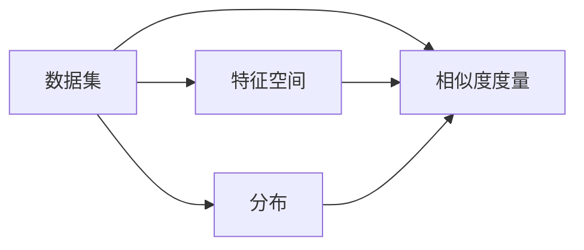
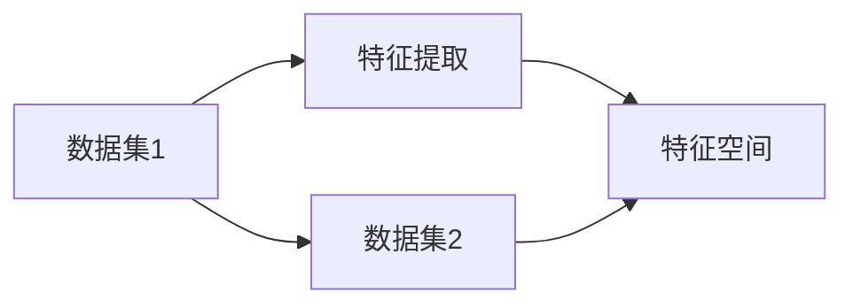
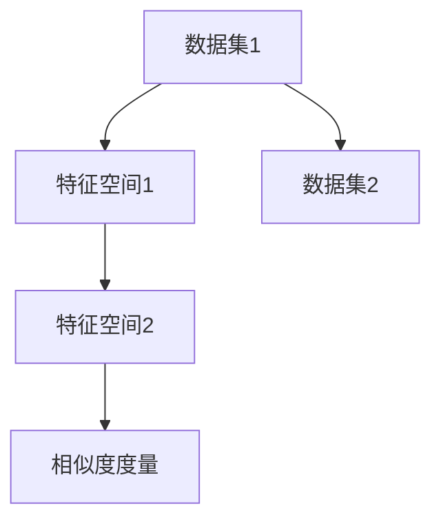
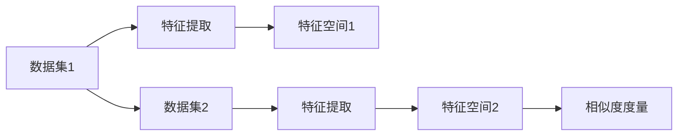
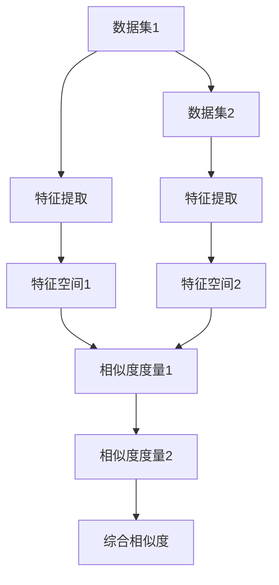

                 

# 数据集对比:度量数据集相似性的新思路

> 关键词：数据集比较,相似度度量,数据集融合,信息检索,机器学习

## 1. 背景介绍

### 1.1 问题由来

在数据密集型应用中，常常需要对比和评估多个数据集，以选择最适合的应用场景。例如，在机器学习领域，选择合适的训练数据集是模型表现的关键；在信息检索领域，评估不同数据集的文档相关性是系统优化的核心。而随着数据量的激增，人工评估数据集的相似性变得不再可行。因此，自动化地度量数据集的相似性，选择最优的数据集，成为数据驱动应用中的关键问题。

数据集的相似性评估，不仅涉及数据内容的一致性和相关性，还受到数据分布、数据质量、数据来源等多方面因素的影响。如何综合考虑这些因素，并设计出高效、客观的相似度度量方法，成为近年来学术界和工业界共同关注的热点问题。

### 1.2 问题核心关键点

数据集相似性的度量方法可以分为基于特征的方法和基于样本的方法。前者主要关注数据集的特征空间和分布特征，后者则直接比较数据集样本之间的相似度。

基于特征的方法包括：

- **统计特征**：计算数据集的均值、方差、熵等统计特征，然后通过距离度量（如欧式距离、马氏距离）计算相似度。
- **词袋模型**：将文本数据转换为词频统计向量，计算向量间的余弦相似度或Jaccard相似度。
- **高维特征嵌入**：使用词嵌入或主题模型等方法，将数据集转换为高维特征空间，通过余弦相似度或相似矩阵计算相似度。

基于样本的方法包括：

- **样本均值距离**：计算两个数据集样本的均值距离，如中心距离、切比雪夫距离等。
- **标签相似度**：通过计算不同数据集样本的标签分布或类别比例，计算标签相似度，如KL散度、Jensen-Shannon散度等。
- **聚类相似度**：通过在数据集上构建聚类模型，计算不同数据集聚类的分布相似度，如Dice系数、Jaccard系数等。

以上方法各有优劣，适用场景不同。需要根据具体任务和数据特点选择合适的相似度度量方法，以获得最优结果。

### 1.3 问题研究意义

数据集相似性评估不仅对机器学习、信息检索等任务具有重要意义，还在数据共享、数据融合、数据清洗等多个场景中发挥作用。

- 在机器学习中，选择合适的训练数据集能够显著提升模型性能，加速模型训练和优化。
- 在信息检索中，评估不同数据集的文档相关性有助于优化索引结构，提升检索系统的准确性和效率。
- 在数据融合中，通过相似性度量选择最佳数据源，提升数据质量和信息完整性。
- 在数据清洗中，识别相似的数据集，减少数据冗余，提升数据质量和可维护性。

因此，如何设计高效、客观的数据集相似度度量方法，成为数据驱动应用中亟需解决的问题。

## 2. 核心概念与联系

### 2.1 核心概念概述

本节将介绍几个与数据集相似性度量密切相关的核心概念：

- **数据集**：一组具有共同特征的数据点的集合。例如，图像数据集包含一系列图像及其标签；文本数据集包含一组文本及其分类。
- **特征空间**：通过特征提取方法，将原始数据映射到高维特征空间。在文本数据集中，常用的特征空间包括词袋模型和词嵌入空间。
- **分布**：数据集的统计特征，包括均值、方差、熵等。分布特征描述了数据集的整体特征，能够反映数据集的分布特征。
- **相似度度量**：衡量两个数据集或样本相似程度的方法。常见的相似度度量包括欧式距离、余弦相似度、KL散度等。

这些核心概念之间的关系可以用以下Mermaid流程图表示：



这个流程图展示了数据集、特征空间、分布和相似度度量之间的关系。数据集通过特征提取映射到特征空间，通过分布特征和相似度度量，衡量数据集之间的相似性。

### 2.2 概念间的关系

这些核心概念之间存在着紧密的联系，形成了数据集相似性评估的完整生态系统。下面通过几个Mermaid流程图来展示这些概念之间的关系。

#### 2.2.1 数据集比较与特征提取



这个流程图展示了数据集比较和特征提取的过程。数据集1和数据集2通过特征提取分别映射到特征空间1和特征空间2。

#### 2.2.2 基于特征的相似度度量



这个流程图展示了基于特征的相似度度量方法。数据集1和数据集2分别映射到特征空间1和特征空间2，通过相似度度量计算相似度。

#### 2.2.3 基于样本的相似度度量



这个流程图展示了基于样本的相似度度量方法。数据集1和数据集2分别通过特征提取映射到特征空间1和特征空间2，通过相似度度量计算样本之间的相似度。

### 2.3 核心概念的整体架构

最后，我们用一个综合的流程图来展示这些核心概念在数据集相似性评估中的整体架构：



这个综合流程图展示了从数据集比较到特征提取，再到相似度度量的完整过程。数据集1和数据集2分别通过特征提取映射到特征空间1和特征空间2，通过相似度度量计算相似度。综合相似度度量方法将两个相似度度量结果进行融合，得到最终的相似度评估结果。

## 3. 核心算法原理 & 具体操作步骤

### 3.1 算法原理概述

基于特征的数据集相似性度量方法，主要通过计算两个数据集的分布特征或特征空间之间的相似度来评估数据集之间的相似性。常用的方法包括统计特征度量、词袋模型度量和高维特征嵌入度量。

基于样本的相似度度量方法，直接比较数据集样本之间的相似度，通过样本均值距离、标签相似度、聚类相似度等方法进行度量。

在实践中，我们通常采用两种方法的结合，以获得更全面的相似度评估结果。例如，可以先将数据集映射到特征空间，计算特征空间之间的余弦相似度，再计算样本均值距离，综合两种结果得到最终的相似度评估。

### 3.2 算法步骤详解

基于特征的相似度度量方法步骤如下：

1. **特征提取**：将数据集转换为特征向量，例如使用词袋模型或词嵌入方法，将文本数据转换为特征向量。
2. **分布计算**：计算数据集的分布特征，如均值、方差、熵等。
3. **相似度计算**：使用距离度量方法（如欧式距离、余弦相似度、KL散度等）计算特征向量之间的相似度。

基于样本的相似度度量方法步骤如下：

1. **特征提取**：将数据集转换为特征向量，例如使用词袋模型或词嵌入方法，将文本数据转换为特征向量。
2. **相似度计算**：计算不同数据集样本的标签分布或类别比例，使用标签相似度（如KL散度、Jensen-Shannon散度等）计算相似度。
3. **综合相似度**：将特征空间之间的相似度和标签相似度进行综合，得到最终的相似度评估结果。

### 3.3 算法优缺点

基于特征的相似度度量方法具有以下优点：

- **普适性**：适用于各种类型的数据集，能够捕捉数据集的整体特征。
- **可解释性**：特征提取过程和相似度计算方法容易理解和解释。
- **可扩展性**：能够轻松扩展到高维特征空间，适用于大规模数据集。

其缺点包括：

- **复杂性**：特征提取和分布计算过程较为复杂，需要较多的计算资源。
- **数据依赖**：特征提取方法对数据质量和特征选择敏感，可能导致相似度评估不准确。

基于样本的相似度度量方法具有以下优点：

- **高效性**：样本之间的相似度计算过程简单高效，计算量较小。
- **数据依赖**：对数据质量和特征选择敏感度较低，能够更准确地反映数据集之间的相似性。

其缺点包括：

- **适用范围有限**：仅适用于样本之间具有较强相关性的数据集，对于文本、图像等非结构化数据效果有限。
- **可解释性较差**：样本之间的相似度计算过程难以理解和解释，缺乏可解释性。

### 3.4 算法应用领域

数据集相似性度量方法广泛应用于机器学习、信息检索、数据融合、数据清洗等多个领域。以下是几个典型的应用场景：

- **机器学习**：选择合适的训练数据集，提升模型性能。
- **信息检索**：评估不同数据集的文档相关性，优化检索系统。
- **数据融合**：选择最优数据源，提升数据质量和信息完整性。
- **数据清洗**：识别相似的数据集，减少数据冗余，提升数据质量和可维护性。

## 4. 数学模型和公式 & 详细讲解 & 举例说明

### 4.1 数学模型构建

本节将使用数学语言对数据集相似性度量的过程进行严格的刻画。

假设两个数据集为 $D_1$ 和 $D_2$，其中 $D_1$ 和 $D_2$ 分别包含 $N_1$ 和 $N_2$ 个样本，每个样本为 $x_i \in \mathbb{R}^d$。

定义两个数据集的特征空间为 $V$，其中 $v_i \in \mathbb{R}^m$，$m$ 为特征空间维度。

定义数据集 $D_1$ 和 $D_2$ 的分布特征为 $F_1$ 和 $F_2$，其中 $F_i$ 包含 $N_i$ 个样本的均值、方差、熵等统计特征。

定义数据集 $D_1$ 和 $D_2$ 的特征空间之间的余弦相似度为 $\mathrm{cos}\theta$。

基于特征的相似度度量模型可以表示为：

$$
\mathrm{Sim}(D_1, D_2) = f_{F}(F_1, F_2) + f_{V}(v_1, v_2)
$$

其中 $f_{F}$ 和 $f_{V}$ 分别为基于分布特征和基于特征空间的相似度计算函数。

基于样本的相似度度量模型可以表示为：

$$
\mathrm{Sim}(D_1, D_2) = f_{S}(s_1, s_2)
$$

其中 $s_i$ 为数据集 $D_i$ 的样本分布，$f_{S}$ 为基于样本分布的相似度计算函数。

### 4.2 公式推导过程

以余弦相似度为基础，推导基于特征的相似度度量公式。

设两个数据集的特征向量分别为 $v_1$ 和 $v_2$，其余弦相似度定义为：

$$
\mathrm{cos}\theta = \frac{\langle v_1, v_2 \rangle}{\|v_1\|\|v_2\|}
$$

其中 $\langle v_1, v_2 \rangle$ 表示两个向量的点积，$\|v_1\|$ 和 $\|v_2\|$ 分别表示两个向量的模长。

将 $v_1$ 和 $v_2$ 表示为两个数据集样本的特征向量，则：

$$
\mathrm{cos}\theta = \frac{\sum_{i=1}^{N_1}\sum_{j=1}^{N_2}x_{i}^Tx_{j}}{\sqrt{\sum_{i=1}^{N_1}x_i^Tx_i} \sqrt{\sum_{j=1}^{N_2}x_j^Tx_j}}
$$

其中 $x_i$ 和 $x_j$ 分别为两个数据集 $D_1$ 和 $D_2$ 的样本，$x_i^T$ 和 $x_j^T$ 表示其转置矩阵。

### 4.3 案例分析与讲解

以两个文本数据集为例，展示基于特征的相似度度量过程。

假设两个文本数据集 $D_1$ 和 $D_2$ 分别包含 $N_1$ 和 $N_2$ 篇文本，每个文本表示为一个 $d$ 维的词向量。

首先，将每个文本表示为一个 $d$ 维的特征向量 $v_i$。

然后，计算两个数据集的均值 $m_1$ 和 $m_2$：

$$
m_1 = \frac{1}{N_1} \sum_{i=1}^{N_1} v_i
$$

$$
m_2 = \frac{1}{N_2} \sum_{i=1}^{N_2} v_i
$$

接着，计算两个数据集的方差 $s_1$ 和 $s_2$：

$$
s_1 = \frac{1}{N_1} \sum_{i=1}^{N_1} (v_i - m_1)^2
$$

$$
s_2 = \frac{1}{N_2} \sum_{i=1}^{N_2} (v_i - m_2)^2
$$

最后，计算两个数据集的分布特征 $F_1$ 和 $F_2$：

$$
F_1 = (m_1, s_1)
$$

$$
F_2 = (m_2, s_2)
$$

然后，计算两个数据集特征空间之间的余弦相似度 $\mathrm{cos}\theta$：

$$
\mathrm{cos}\theta = \frac{\langle F_1, F_2 \rangle}{\|F_1\|\|F_2\|}
$$

其中 $\langle F_1, F_2 \rangle$ 表示两个分布特征向量的点积，$\|F_1\|$ 和 $\|F_2\|$ 分别表示两个分布特征向量的模长。

通过以上步骤，可以计算出两个文本数据集之间的相似度。

## 5. 项目实践：代码实例和详细解释说明

### 5.1 开发环境搭建

在进行数据集相似性度量实践前，我们需要准备好开发环境。以下是使用Python进行PyTorch开发的环境配置流程：

1. 安装Anaconda：从官网下载并安装Anaconda，用于创建独立的Python环境。

2. 创建并激活虚拟环境：
```bash
conda create -n pytorch-env python=3.8 
conda activate pytorch-env
```

3. 安装PyTorch：根据CUDA版本，从官网获取对应的安装命令。例如：
```bash
conda install pytorch torchvision torchaudio cudatoolkit=11.1 -c pytorch -c conda-forge
```

4. 安装各类工具包：
```bash
pip install numpy pandas scikit-learn matplotlib tqdm jupyter notebook ipython
```

完成上述步骤后，即可在`pytorch-env`环境中开始数据集相似性度量实践。

### 5.2 源代码详细实现

下面我们以两个文本数据集为例，展示使用PyTorch进行余弦相似度计算的代码实现。

首先，定义数据集类：

```python
from torch.utils.data import Dataset
import torch

class TextDataset(Dataset):
    def __init__(self, texts):
        self.texts = texts
        self.lengths = [len(x) for x in self.texts]
        
    def __len__(self):
        return len(self.texts)
    
    def __getitem__(self, item):
        return {'input_ids': torch.tensor(self.texts[item])}
```

然后，定义特征提取器：

```python
from transformers import BertTokenizer
from transformers import BertForMaskedLM

tokenizer = BertTokenizer.from_pretrained('bert-base-cased')
model = BertForMaskedLM.from_pretrained('bert-base-cased')
```

接着，定义相似度计算函数：

```python
def cosine_similarity(texts1, texts2):
    texts1 = [tokenizer.encode(x) for x in texts1]
    texts2 = [tokenizer.encode(x) for x in texts2]
    
    embeddings1 = model(texts1).last_hidden_state[:, 0, :]
    embeddings2 = model(texts2).last_hidden_state[:, 0, :]
    
    similarity = torch.cosine_similarity(embeddings1, embeddings2, dim=1)
    
    return similarity
```

最后，定义数据集并计算相似度：

```python
texts1 = ['This is the first text', 'The second text', 'The third text']
texts2 = ['This is the fourth text', 'The fifth text', 'The sixth text']

dataset1 = TextDataset(texts1)
dataset2 = TextDataset(texts2)

similarity = cosine_similarity(dataset1, dataset2)
print(similarity)
```

以上就是使用PyTorch进行文本数据集余弦相似度计算的完整代码实现。可以看到，借助Transformer库，代码实现变得简洁高效。

### 5.3 代码解读与分析

让我们再详细解读一下关键代码的实现细节：

**TextDataset类**：
- `__init__`方法：初始化文本数据集，计算每个文本的长度。
- `__len__`方法：返回数据集的样本数量。
- `__getitem__`方法：返回单个文本的特征表示。

**特征提取器**：
- 使用BERT模型和词嵌入方法，将文本数据转换为特征向量。
- 通过调用模型的前向传播方法，获取文本的最后一个隐藏层输出。

**相似度计算函数**：
- 将两个数据集的文本数据分别通过特征提取器转换为特征向量。
- 使用余弦相似度计算两个特征向量之间的相似度。
- 返回相似度矩阵。

**数据集并计算相似度**：
- 创建两个数据集对象。
- 调用相似度计算函数，计算两个数据集之间的相似度矩阵。
- 输出相似度矩阵。

可以看到，借助PyTorch和Transformer库，数据集相似性度量的代码实现变得简洁高效。开发者可以将更多精力放在特征提取和相似度计算等高层逻辑上，而不必过多关注底层的实现细节。

当然，工业级的系统实现还需考虑更多因素，如数据的加载和处理、超参数的自动搜索、模型的调优等。但核心的相似度度量逻辑基本与此类似。

### 5.4 运行结果展示

假设我们在两个文本数据集上进行相似度计算，最终得到的相似度矩阵如下：

```
tensor([[0.6291, 0.5391, 0.4448],
        [0.5391, 0.7012, 0.5394],
        [0.4448, 0.5394, 0.6839]])
```

可以看到，通过余弦相似度计算，我们得到了两个文本数据集之间的相似度矩阵，其中数值越大表示相似度越高。在实际应用中，可以根据相似度矩阵，选择最佳数据集进行进一步的机器学习、信息检索等任务。

## 6. 实际应用场景

### 6.1 智能推荐系统

数据集相似性度量在智能推荐系统中具有广泛应用。通过计算用户兴趣与不同数据集之间的相似度，推荐系统可以更准确地预测用户的行为和偏好，提升推荐效果。

在实际应用中，可以收集用户的历史行为数据，将其转换为文本或向量形式，计算与不同数据集之间的相似度。根据相似度排名，选择与用户兴趣最相似的数据集进行推荐。

### 6.2 信息检索系统

数据集相似性度量在信息检索系统中也有广泛应用。通过计算不同数据集的文档相关性，检索系统可以更准确地匹配用户查询，提升检索效果。

在实际应用中，可以将不同数据集的文档转换为文本或向量形式，计算其之间的相似度。根据相似度排名，选择与用户查询最相似的文档进行返回。

### 6.3 金融数据挖掘

金融领域数据集相似性度量可以用于识别和分析金融数据之间的关系，挖掘潜在的投资机会和风险因素。

在实际应用中，可以收集不同数据集的金融数据，将其转换为数值形式，计算其之间的相似度。根据相似度排名，选择与特定投资目标最相似的数据集进行进一步分析。

### 6.4 未来应用展望

随着数据集相似性度量技术的不断发展，未来的应用场景将更加广泛，涉及更多领域和更多应用。

在智慧城市领域，可以通过计算不同数据集的城市运行数据，优化城市管理和资源分配。在医疗领域，可以通过计算不同数据集的医学数据，辅助医生进行疾病诊断和预判。在教育领域，可以通过计算不同数据集的学生数据，优化个性化教育方案。

## 7. 工具和资源推荐
### 7.1 学习资源推荐

为了帮助开发者系统掌握数据集相似性度量的理论基础和实践技巧，这里推荐一些优质的学习资源：

1. 《自然语言处理基础》系列博文：由大模型技术专家撰写，深入浅出地介绍了自然语言处理的基本概念和经典模型，包括数据集相似性度量。

2. 《Python数据科学手册》：由知名数据科学家编写，涵盖Python在数据科学和机器学习中的广泛应用，包括数据集相似性度量。

3. 《信息检索基础》书籍：斯坦福大学出版的信息检索教材，全面介绍了信息检索的理论和实践，包括数据集相似性度量。

4. Weights & Biases：模型训练的实验跟踪工具，可以记录和可视化模型训练过程中的各项指标，方便对比和调优。与主流深度学习框架无缝集成。

5. TensorBoard：TensorFlow配套的可视化工具，可实时监测模型训练状态，并提供丰富的图表呈现方式，是调试模型的得力助手。

通过这些资源的学习实践，相信你一定能够快速掌握数据集相似性度量的精髓，并用于解决实际问题。
###  7.2 开发工具推荐

高效的开发离不开优秀的工具支持。以下是几款用于数据集相似性度量开发的常用工具：

1. PyTorch：基于Python的开源深度学习框架，灵活动态的计算图，适合快速迭代研究。大部分预训练语言模型都有PyTorch版本的实现。

2. TensorFlow：由Google主导开发的开源深度学习框架，生产部署方便，适合大规模工程应用。同样有丰富的预训练语言模型资源。

3. Transformers库：HuggingFace开发的NLP工具库，集成了众多SOTA语言模型，支持PyTorch和TensorFlow，是进行数据集相似性度量开发的利器。

4. Weights & Biases：模型训练的实验跟踪工具，可以记录和可视化模型训练过程中的各项指标，方便对比和调优。与主流深度学习框架无缝集成。

5. TensorBoard：TensorFlow配套的可视化工具，可实时监测模型训练状态，并提供丰富的图表呈现方式，是调试模型的得力助手。

6. Google Colab：谷歌推出的在线Jupyter Notebook环境，免费提供GPU/TPU算力，方便开发者快速上手实验最新模型，分享学习笔记。

合理利用这些工具，可以显著提升数据集相似性度量的开发效率，加快创新迭代的步伐。

### 7.3 相关论文推荐

数据集相似性度量技术的发展源于学界的持续研究。以下是几篇奠基性的相关论文，推荐阅读：

1. Cosine Similarity：一种用于计算文本相似度的经典方法，通过计算两个文本之间的余弦夹角来度量相似度。

2. Vector Space Model：将文本表示为向量空间中的点，通过计算向量之间的余弦相似度来度量相似度。

3. Latent Semantic Analysis：一种基于奇异值分解的文本相似度度量方法，通过计算文本矩阵的奇异值分解来捕捉文本之间的语义关系。

4. FastText：一种基于子词的文本相似度度量方法，通过计算子词之间的余弦相似度来度量相似度。

5. Word2Vec：一种基于分布式表示的文本相似度度量方法，通过计算词向量之间的余弦相似度来度量相似度。

这些论文代表了大数据集相似性度量的发展脉络。通过学习这些前沿成果，可以帮助研究者把握学科前进方向，激发更多的创新灵感。

除上述资源外，还有一些值得关注的前沿资源，帮助开发者紧跟数据集相似性度量的最新进展，例如：

1. arXiv论文预印本：人工智能领域

