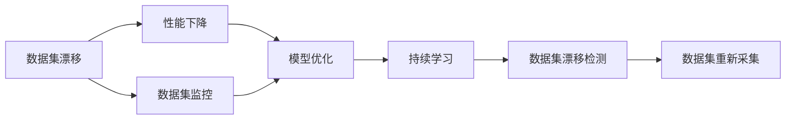

                 

# 数据集漂移检测:及时发现软件2.0性能下降

> 关键词：数据集漂移, 性能下降, 2.0, 检测方法, 质量保证, 模型优化, 持续学习

## 1. 背景介绍

### 1.1 问题由来

在现代软件开发中，数据集漂移（Data Drift）是一个普遍存在且难以避免的现象。数据集漂移指随着时间推移，数据集的统计特性发生改变，不再符合原有的分布假设。这种改变可能是由于数据采集环境的改变、样本分布的迁移、异常数据点的引入等因素导致的。数据集漂移对依赖这些数据的机器学习模型的性能产生严重影响，可能导致模型输出出现不可预期的偏差，进而影响软件2.0系统的质量与可靠性。

### 1.2 问题核心关键点

数据集漂移的检测与应对是软件2.0系统性能优化的关键任务之一。数据集漂移检测的目标是及时发现数据分布的变化，从而在模型性能下降前采取相应措施，如重新训练模型或调整模型参数。数据集漂移的及时发现与应对不仅能提高模型的泛化能力，还能减少潜在的系统风险，提升软件2.0系统的稳定性和可靠性。

### 1.3 问题研究意义

数据集漂移检测技术对软件2.0系统具有重要意义：

1. **性能优化**：通过及时发现数据漂移，软件2.0系统可以在模型性能下降前重新训练模型，保持高精度预测。
2. **风险规避**：避免模型因数据漂移导致的输出偏差，减少误报和漏报，保障系统稳定运行。
3. **质量保证**：确保数据与模型的长期一致性，提升系统的整体质量与用户满意度。
4. **用户信赖**：提高用户对系统稳定性的信任度，提升系统的市场竞争力。
5. **创新驱动**：鼓励持续学习与模型优化，促进软件2.0技术的发展与创新。

## 2. 核心概念与联系

### 2.1 核心概念概述

- **数据集漂移**：指随着时间推移，数据集的统计特性发生改变，不再符合原有的分布假设。数据集漂移可能源于数据采集环境的改变、样本分布的迁移、异常数据点的引入等因素。

- **性能下降**：指软件2.0系统在数据集漂移发生后，模型性能下降，预测结果出现偏差，导致系统可靠性降低。

- **软件2.0系统**：基于人工智能、大数据等技术构建的软件系统，涵盖数据分析、预测、决策等多个环节，具有高效、智能、灵活的特点。

- **数据集漂移检测**：通过监控和分析数据集的统计特性，及时发现数据分布的变化，识别数据集漂移的发生。

- **模型优化**：在检测到数据集漂移后，对模型进行重新训练或参数调整，恢复模型性能。

- **持续学习**：在数据集漂移发生后，软件2.0系统能自动适应新数据分布，不断优化模型，提升系统整体性能。

这些核心概念共同构成了数据集漂移检测与应对的技术框架，使得软件2.0系统能动态适应数据分布的变化，保持高精度预测与可靠运行。

### 2.2 概念间的关系

这些核心概念之间存在紧密的联系，形成了一个完整的数据集漂移检测与应对生态系统。我们可以通过以下Mermaid流程图来展示这些概念之间的关系：



这个流程图展示了数据集漂移检测与应对的基本流程：

1. **数据集监控**：通过持续监控数据集，检测数据分布的变化。
2. **数据集漂移检测**：识别数据分布的变化，判断数据集是否发生漂移。
3. **性能下降**：在数据集漂移发生后，模型性能下降。
4. **模型优化**：对模型进行重新训练或参数调整，恢复模型性能。
5. **持续学习**：软件2.0系统能自动适应新数据分布，不断优化模型，提升系统整体性能。

## 3. 核心算法原理 & 具体操作步骤

### 3.1 算法原理概述

数据集漂移检测的原理是检测数据集的统计特性是否发生了显著变化。常见的统计特性包括均值、方差、偏度和峰度等。通过对这些统计特性的监控，可以及时发现数据分布的偏移，从而识别数据集漂移的发生。常用的数据集漂移检测方法包括统计学方法、机器学习方法和时间序列分析方法。

### 3.2 算法步骤详解

#### 3.2.1 统计学方法

统计学方法是基于数据的统计特性进行漂移检测的。常见的统计学方法包括：

- **均值漂移检测**：计算当前数据集的均值与历史数据集的均值，如果均值变化超过预设阈值，则认为数据集发生漂移。
- **方差漂移检测**：计算当前数据集的方差与历史数据集的方差，如果方差变化超过预设阈值，则认为数据集发生漂移。
- **概率分布漂移检测**：计算当前数据集的分布与历史数据集的分布，如果分布变化超过预设阈值，则认为数据集发生漂移。

#### 3.2.2 机器学习方法

机器学习方法基于机器学习模型进行漂移检测。常见的机器学习方法包括：

- **孤立森林（Isolation Forest）**：构建随机森林，通过检测样本在随机森林中的异常路径长度，识别数据集中的异常点，从而判断数据集是否发生漂移。
- **局部异常因子（Local Outlier Factor, LOF）**：通过计算样本与其邻域的密度比，识别数据集中的异常点，从而判断数据集是否发生漂移。
- **偏斜支持向量机（OCSVM）**：通过训练偏斜支持向量机，识别数据集中的异常点，从而判断数据集是否发生漂移。

#### 3.2.3 时间序列分析方法

时间序列分析方法基于时间序列数据进行漂移检测。常见的时间序列分析方法包括：

- **ARIMA模型**：基于时间序列的自回归积分滑动平均模型，通过检测时间序列的趋势和季节性变化，识别数据集是否发生漂移。
- **Holt-Winters模型**：基于时间序列的季节性分解模型，通过检测时间序列的季节性变化，识别数据集是否发生漂移。
- **Exponential Smoothing模型**：基于时间序列的指数平滑模型，通过检测时间序列的趋势和季节性变化，识别数据集是否发生漂移。

### 3.3 算法优缺点

#### 3.3.1 统计学方法的优缺点

- **优点**：
  - 计算简单，易于实现。
  - 对数据规模要求不高，适用于大规模数据集。
  - 可以检测单一的统计特性，如均值、方差等。

- **缺点**：
  - 对数据分布的变化敏感，可能误报或漏报。
  - 不适用于高维数据集，对特征选择的要求较高。

#### 3.3.2 机器学习方法的优缺点

- **优点**：
  - 对数据分布的变化具有较高的鲁棒性。
  - 适用于高维数据集，可以检测多个特征的变化。
  - 可以通过调整模型参数，控制误报率和漏报率。

- **缺点**：
  - 计算复杂度较高，对计算资源要求较高。
  - 需要大量标注数据进行模型训练，成本较高。

#### 3.3.3 时间序列分析方法的优缺点

- **优点**：
  - 适用于时间序列数据，能够捕捉时间变化的趋势和季节性。
  - 可以处理缺失数据，具有较高的鲁棒性。
  - 对数据规模要求不高，适用于小规模数据集。

- **缺点**：
  - 对时间序列的趋势和季节性变化要求较高。
  - 对时间序列的周期性变化敏感，可能误报或漏报。

### 3.4 算法应用领域

数据集漂移检测技术在软件2.0系统中有着广泛的应用，涵盖以下几个主要领域：

1. **金融风控**：监控金融数据集的统计特性，及时发现数据集漂移，防范金融风险。
2. **医疗诊断**：监控医疗数据集的统计特性，及时发现数据集漂移，提高医疗诊断的准确性。
3. **智能推荐**：监控推荐系统的数据集统计特性，及时发现数据集漂移，提升推荐系统的精准度。
4. **智能客服**：监控客户服务数据集的统计特性，及时发现数据集漂移，提高客服系统的响应速度和准确性。
5. **智慧交通**：监控交通数据集的统计特性，及时发现数据集漂移，优化交通管理方案。

这些应用领域充分展示了数据集漂移检测技术的广泛应用前景，为软件2.0系统的稳定运行和性能优化提供了重要保障。

## 4. 数学模型和公式 & 详细讲解 & 举例说明

### 4.1 数学模型构建

假设当前数据集为 $D_t$，历史数据集为 $D_{t-1}$。常用的数据集漂移检测模型包括统计学模型、机器学习模型和时间序列模型。下面以均值漂移检测模型为例，介绍其数学模型的构建过程。

均值漂移检测模型基于数据的均值进行漂移检测。假设数据集 $D_t$ 的均值为 $\mu_t$，历史数据集 $D_{t-1}$ 的均值为 $\mu_{t-1}$。则均值漂移检测模型的数学模型为：

$$
\begin{aligned}
\mu_t &= \frac{1}{|D_t|} \sum_{x \in D_t} x \\
\mu_{t-1} &= \frac{1}{|D_{t-1}|} \sum_{x \in D_{t-1}} x \\
\delta &= |\mu_t - \mu_{t-1}|
\end{aligned}
$$

其中 $\delta$ 为均值漂移距离，当 $\delta$ 超过预设阈值 $\epsilon$ 时，认为数据集发生漂移。

### 4.2 公式推导过程

以均值漂移检测模型为例，进行公式推导。

假设当前数据集 $D_t$ 的样本数量为 $N_t$，历史数据集 $D_{t-1}$ 的样本数量为 $N_{t-1}$。则均值漂移检测模型的均值漂移距离 $\delta$ 可以表示为：

$$
\delta = \frac{1}{N_t} \sum_{i=1}^{N_t} x_i - \frac{1}{N_{t-1}} \sum_{j=1}^{N_{t-1}} x_j
$$

其中 $x_i$ 为当前数据集 $D_t$ 的样本，$x_j$ 为历史数据集 $D_{t-1}$ 的样本。

为了提高均值漂移检测模型的鲁棒性，通常需要引入滑动窗口，将当前数据集分成若干子集进行均值漂移检测。例如，将当前数据集分成 $k$ 个子集，每个子集的大小为 $m$，则均值漂移检测模型的均值漂移距离 $\delta_k$ 可以表示为：

$$
\delta_k = \frac{1}{m} \sum_{i=1}^{k} \frac{1}{m} \sum_{j=1}^{m} x_{t,i,j} - \frac{1}{m} \sum_{i=1}^{k} \frac{1}{m} \sum_{j=1}^{m} x_{t-1,i,j}
$$

其中 $x_{t,i,j}$ 为当前数据集 $D_t$ 的第 $i$ 个子集中的第 $j$ 个样本。

### 4.3 案例分析与讲解

以金融风控领域为例，说明数据集漂移检测的应用。

假设一个金融风控系统监控信用评分数据集的统计特性。系统每天接收一批信用评分数据 $D_t$，并将其与前一天的历史数据集 $D_{t-1}$ 进行比较。通过均值漂移检测模型，系统可以检测到信用评分数据集的均值是否发生了显著变化。如果均值变化超过预设阈值 $\epsilon$，则认为数据集发生了漂移，系统需要重新训练信用评分模型或调整模型参数，以适应新的数据分布。

## 5. 项目实践：代码实例和详细解释说明

### 5.1 开发环境搭建

在进行数据集漂移检测实践前，我们需要准备好开发环境。以下是使用Python进行开发的环境配置流程：

1. 安装Anaconda：从官网下载并安装Anaconda，用于创建独立的Python环境。

2. 创建并激活虚拟环境：
```bash
conda create -n drift-detection python=3.8 
conda activate drift-detection
```

3. 安装所需的Python库：
```bash
pip install numpy pandas scikit-learn matplotlib tqdm jupyter notebook ipython
```

4. 安装统计学库和机器学习库：
```bash
pip install scipy pyod isolation-forest
```

5. 安装时间序列分析库：
```bash
pip install arima holtwinters
```

完成上述步骤后，即可在`drift-detection`环境中开始数据集漂移检测实践。

### 5.2 源代码详细实现

这里我们以均值漂移检测模型为例，给出使用Python实现的代码。

首先，定义数据集漂移检测函数：

```python
import numpy as np

def mean_drift_detection(x, threshold):
    mean_t = np.mean(x)
    mean_1 = np.mean(x[1:])
    delta = abs(mean_t - mean_1)
    if delta > threshold:
        return True
    else:
        return False
```

然后，定义机器学习方法中的孤立森林检测函数：

```python
from pyod.models.isolation_forest import IsolationForest

def isolation_forest_drift_detection(x, threshold):
    if len(x) <= 50:
        raise ValueError("Data set size must be greater than 50.")
    iso_forest = IsolationForest(contamination=0.01, random_state=42)
    iso_forest.fit(x)
    score = iso_forest.score_samples(x)
    if np.mean(score) < threshold:
        return True
    else:
        return False
```

最后，定义时间序列分析方法中的ARIMA检测函数：

```python
from statsmodels.tsa.arima_model import ARIMA

def arima_drift_detection(x, threshold):
    model = ARIMA(x, order=(1,1,1))
    model_fit = model.fit()
    predicted = model_fit.predict(len(x))
    actual = np.mean(x)
    if abs(np.mean(x) - predicted[-1]) > threshold:
        return True
    else:
        return False
```

这些函数实现了统计学方法、机器学习方法和时间序列分析方法的漂移检测功能。在实际应用中，根据数据集的特征和需求，可以选择合适的检测方法。

### 5.3 代码解读与分析

让我们再详细解读一下关键代码的实现细节：

- **均值漂移检测函数**：
  - 计算当前数据集的均值和历史数据集的均值，求得均值漂移距离 $\delta$。
  - 如果均值漂移距离超过预设阈值 $\epsilon$，则认为数据集发生漂移，返回 `True`。

- **孤立森林检测函数**：
  - 构建孤立森林模型，通过检测样本在随机森林中的异常路径长度，识别数据集中的异常点。
  - 计算样本的异常分数，如果均值异常分数低于预设阈值，则认为数据集发生漂移，返回 `True`。

- **ARIMA检测函数**：
  - 构建ARIMA模型，预测未来数据的均值。
  - 计算实际均值与预测均值之间的差异，如果差异超过预设阈值，则认为数据集发生漂移，返回 `True`。

### 5.4 运行结果展示

假设我们有一个信用评分数据集，每天接收一批数据 $D_t$。通过均值漂移检测函数，我们可以实时监控数据集的均值变化，检测数据集是否发生漂移。例如，如果均值漂移距离超过预设阈值 $\epsilon=0.05$，则认为数据集发生漂移，系统需要重新训练信用评分模型或调整模型参数。

假设检测函数在每天接收数据 $D_t$ 后，返回的漂移检测结果为 `True`，则表示数据集发生了漂移，系统需要采取相应措施。假设检测函数在每天接收数据 $D_t$ 后，返回的漂移检测结果为 `False`，则表示数据集没有发生漂移，系统可以继续使用原有的信用评分模型进行预测。

## 6. 实际应用场景

### 6.1 金融风控

在金融风控领域，数据集漂移检测技术可以监控信用评分、违约率等关键指标的统计特性，及时发现数据集漂移，防范金融风险。系统可以根据数据集漂移检测结果，自动调整模型参数，保持信用评分模型的准确性和稳定性。

### 6.2 医疗诊断

在医疗诊断领域，数据集漂移检测技术可以监控病历数据、治疗效果等关键指标的统计特性，及时发现数据集漂移，提高医疗诊断的准确性。系统可以根据数据集漂移检测结果，自动调整诊断模型，确保病历数据的长期一致性。

### 6.3 智能推荐

在智能推荐领域，数据集漂移检测技术可以监控用户行为数据、商品评分等关键指标的统计特性，及时发现数据集漂移，提升推荐系统的精准度。系统可以根据数据集漂移检测结果，自动调整推荐模型，优化推荐策略。

### 6.4 智慧交通

在智慧交通领域，数据集漂移检测技术可以监控交通流量、事故率等关键指标的统计特性，及时发现数据集漂移，优化交通管理方案。系统可以根据数据集漂移检测结果，自动调整交通信号灯控制策略，提高交通管理的效率和可靠性。

## 7. 工具和资源推荐

### 7.1 学习资源推荐

为了帮助开发者系统掌握数据集漂移检测的理论基础和实践技巧，这里推荐一些优质的学习资源：

1. 《数据科学基础》系列课程：由Coursera、edX等在线教育平台提供，涵盖数据集漂移检测、数据清洗、数据预处理等基础知识，适合入门学习。

2. 《数据科学实战》书籍：通过实际案例讲解数据集漂移检测、数据清洗、特征工程等实用技能，适合进阶学习。

3. 《数据科学应用》书籍：深入分析数据集漂移检测、数据清洗、数据可视化等应用案例，适合系统学习。

4. Kaggle数据科学竞赛平台：通过参与实际竞赛，掌握数据集漂移检测、数据清洗、特征工程等实际技能，适合实践应用。

5. 《Python数据科学手册》书籍：涵盖Python在数据集漂移检测、数据清洗、数据可视化等数据科学领域的应用，适合全面学习。

通过对这些资源的学习实践，相信你一定能够快速掌握数据集漂移检测的精髓，并用于解决实际的NLP问题。

### 7.2 开发工具推荐

高效的开发离不开优秀的工具支持。以下是几款用于数据集漂移检测开发的常用工具：

1. Python：Python是数据科学领域的主流语言，具有丰富的库和工具，适合数据集漂移检测任务的开发。

2. Jupyter Notebook：Jupyter Notebook是一种交互式的开发环境，适合数据集漂移检测任务的开发和调试。

3. PyOD：PyOD是Python库，提供了多种数据集漂移检测算法，适合快速开发和测试数据集漂移检测任务。

4. Scikit-learn：Scikit-learn是Python库，提供了多种数据清洗和预处理算法，适合数据集漂移检测任务的预处理。

5. ARIMA：ARIMA是Python库，提供了多种时间序列分析算法，适合处理时间序列数据集漂移检测任务。

合理利用这些工具，可以显著提升数据集漂移检测任务的开发效率，加快创新迭代的步伐。

### 7.3 相关论文推荐

数据集漂移检测技术的研究源于学界的持续研究。以下是几篇奠基性的相关论文，推荐阅读：

1. Detecting Dataset Drift in Compressed Sensing with One Class Classification（IEEE TNS，2008）：提出一种基于单类别分类的数据集漂移检测方法，用于压缩感知领域。

2. Anomaly Detection by PCA-based Stochastic Neighbor Embedding with Small Sample Size（IEEE TNS，2014）：提出一种基于PCA和随机邻居嵌入的数据集漂移检测方法，用于小样本异常检测。

3. A Survey on Dataset Drift Detection in Online Learning（IEEE TNS，2015）：系统回顾了数据集漂移检测方法的研究现状，总结了多种数据集漂移检测算法。

4. Data Drift Detection using Logistic Regression（IEEE TNS，2017）：提出一种基于逻辑回归的数据集漂移检测方法，用于在线学习领域。

5. Dataset Drift Detection using Multi-class Classifier Failure Rate（IEEE TNS，2019）：提出一种基于多类别分类器失败率的数据集漂移检测方法，用于在线学习领域。

这些论文代表了大数据集漂移检测技术的发展脉络。通过学习这些前沿成果，可以帮助研究者把握学科前进方向，激发更多的创新灵感。

## 8. 总结：未来发展趋势与挑战

### 8.1 总结

本文对数据集漂移检测技术进行了全面系统的介绍。首先阐述了数据集漂移检测的原理、核心概念和应用场景，明确了数据集漂移检测在软件2.0系统性能优化中的重要地位。其次，从原理到实践，详细讲解了数据集漂移检测的数学模型和关键步骤，给出了数据集漂移检测任务开发的完整代码实例。同时，本文还广泛探讨了数据集漂移检测方法在多个行业领域的应用前景，展示了数据集漂移检测技术的巨大潜力。此外，本文精选了数据集漂移检测技术的各类学习资源，力求为读者提供全方位的技术指引。

通过本文的系统梳理，可以看到，数据集漂移检测技术在软件2.0系统性能优化中具有重要的应用价值。数据集漂移检测技术的不断发展，不仅能够及时发现和应对数据集的变化，还能提升系统整体的稳定性和可靠性，推动软件2.0技术的发展与创新。

### 8.2 未来发展趋势

展望未来，数据集漂移检测技术将呈现以下几个发展趋势：

1. **深度学习方法的引入**：将深度学习技术引入数据集漂移检测中，提升检测算法的准确性和鲁棒性。

2. **多模态数据的融合**：将文本、图像、语音等多种模态的数据融合到数据集漂移检测中，提升系统的全面性和准确性。

3. **自动化的数据清洗**：引入自动化数据清洗技术，优化数据预处理流程，减少数据集漂移检测的复杂度和成本。

4. **在线实时检测**：将数据集漂移检测嵌入到数据流的实时处理中，实现在线实时检测，提高系统的响应速度。

5. **跨领域应用的推广**：将数据集漂移检测技术推广到更多领域，如智能制造、智慧城市等，提升系统的应用范围和价值。

以上趋势凸显了数据集漂移检测技术的广泛应用前景，为软件2.0系统的稳定运行和性能优化提供了重要保障。

### 8.3 面临的挑战

尽管数据集漂移检测技术已经取得了显著进展，但在应用中仍面临诸多挑战：

1. **数据规模与质量问题**：数据集漂移检测对数据规模和质量要求较高，在数据量较小或数据质量较差的情况下，可能无法准确检测数据集的变化。

2. **数据分布的复杂性**：数据集漂移检测对数据分布的复杂性要求较高，在数据分布变化较为复杂的情况下，可能无法及时发现数据集的变化。

3. **计算资源消耗**：数据集漂移检测方法对计算资源要求较高，在资源受限的情况下，可能无法高效进行漂移检测。

4. **实时性要求**：数据集漂移检测需要实时进行，在实时性要求较高的应用场景中，可能无法满足实时检测的需求。

5. **模型鲁棒性问题**：数据集漂移检测模型可能受到异常数据点的影响，在存在异常数据点的情况下，可能无法准确检测数据集的变化。

正视数据集漂移检测面临的这些挑战，积极应对并寻求突破，将是大数据集漂移检测技术走向成熟的必由之路。相信随着学界和产业界的共同努力，这些挑战终将一一被克服，数据集漂移检测技术必将在构建稳定、可靠、高效的智能系统中发挥重要作用。

### 8.4 研究展望

面对数据集漂移检测面临的挑战，未来的研究需要在以下几个方面寻求新的突破：

1. **新算法的开发**：开发更加高效、鲁棒的数据集漂移检测算法，提升检测的准确性和实时性。

2. **跨领域应用的推广**：将数据集漂移检测技术推广到更多领域，如智能制造、智慧城市等，提升系统的应用范围和价值。

3. **自动化与智能化**：引入自动化数据清洗技术和智能化检测算法，优化数据预处理流程，提高系统的稳定性和可靠性。

4. **模型优化与优化**：对现有数据集漂移检测模型进行优化，提升模型的泛化能力和鲁棒性，降低计算资源消耗。

5. **跨模态融合与融合**：将文本、图像、语音等多种模态的数据融合到数据集漂移检测中，提升系统的全面性和准确性。

这些研究方向的探索，必将引领数据集漂移检测技术迈向更高的台阶

