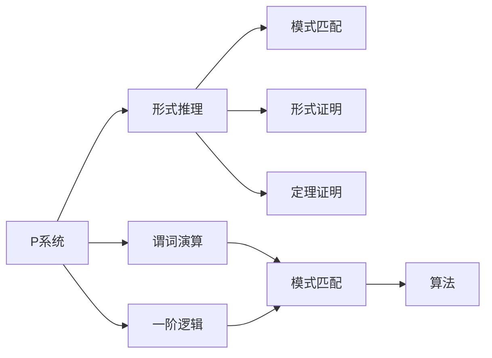

                 

# 数理逻辑：P的形式推理规则

> 关键词：数理逻辑，形式推理，P系统，谓词演算，一阶逻辑，模式匹配，形式证明，定理证明，算法

## 1. 背景介绍

数理逻辑是计算机科学和哲学的基础，它提供了对计算、程序和证明的严密数学建模。形式推理是数理逻辑的核心，它利用精确的规则来处理符号和逻辑形式，使得推导过程自动化和可验证。P系统是形式推理的重要工具，它在理论计算机科学和人工智能领域有广泛应用。本文将详细介绍P系统的基本概念、形式推理规则、数学模型和实际应用，帮助读者深入理解数理逻辑和P系统的原理和实践。

## 2. 核心概念与联系

### 2.1 核心概念概述

- **P系统**：P系统是一种基于上下文无关的上下文敏感的推导系统，它通过不断应用一组推导规则，从一个初始上下文集合出发，逐步生成一个推导序列，最终得到证明或证伪结果。
- **形式推理**：形式推理是指利用严格的符号和逻辑规则，对命题和语句进行形式化处理和逻辑推导，从而证明或证伪结论的过程。
- **谓词演算**：谓词演算是一阶逻辑的子集，它使用谓词、个体和量词来描述命题，是形式推理的基本工具。
- **一阶逻辑**：一阶逻辑是数理逻辑的基础，它使用个体、谓词和量词来描述命题和推理关系。
- **模式匹配**：模式匹配是一种形式推理技术，通过寻找结构匹配的规则来推导新的事实或验证已有结论。
- **形式证明**：形式证明是指通过严格的符号和逻辑规则，逐步推导出一个结论的有效性或不可能性，是数理逻辑的重要方法。
- **定理证明**：定理证明是通过形式化的方法，证明一个命题的正确性，是形式推理的高级应用。
- **算法**：算法是指解决特定问题的逐步执行步骤，是形式推理和P系统的核心。

这些概念之间存在着紧密的联系，构成了一个完整的形式推理系统。P系统是形式推理的主要实现工具，它通过精确的推导规则，自动执行推理过程，得到形式化的结论。谓词演算和一阶逻辑为P系统的形式推理提供了基本语言和框架，而模式匹配和形式证明则提供了具体的推理方法和策略。算法则提供了实现这些方法的具体技术手段。

### 2.2 概念间的关系

这些核心概念之间的关系可以通过以下Mermaid流程图来展示：



这个流程图展示了形式推理系统中的核心组件及其关系：

1. P系统是形式推理的主要实现工具，通过推导规则自动执行推理过程。
2. 谓词演算和一阶逻辑为P系统提供了基础的语言和框架。
3. 模式匹配和形式证明是P系统具体的推理方法和策略。
4. 算法则是实现这些方法的具体技术手段。

## 3. 核心算法原理 & 具体操作步骤

### 3.1 算法原理概述

P系统的核心原理是通过应用一组推导规则，从一个初始上下文集合出发，逐步生成一个推导序列，最终得到证明或证伪结果。推导规则通常包括匹配、替换和扩展等操作，它们定义了如何从一个上下文集合生成另一个上下文集合的过程。P系统的推导过程可以分为两个主要阶段：匹配阶段和生成阶段。在匹配阶段，P系统通过应用推导规则，识别出与上下文相关的模式，并生成新的上下文。在生成阶段，P系统通过替换和扩展操作，进一步生成新的上下文，直到得到最终结论。

### 3.2 算法步骤详解

P系统的具体推导步骤如下：

1. **初始化上下文集合**：定义一个初始上下文集合，通常包含一些基本的符号和逻辑表达式。
2. **匹配规则应用**：从初始上下文集合出发，通过应用匹配规则，识别出与上下文相关的模式，并生成新的上下文。
3. **替换操作**：将识别出的模式替换为新的表达式，更新上下文集合。
4. **扩展操作**：对新的上下文集合进行扩展操作，生成新的上下文。
5. **验证结论**：通过应用推导规则，验证当前上下文集合是否达到目标状态，即证明或证伪结论。
6. **重复推导**：如果当前上下文集合未达到目标状态，则重复应用匹配规则和生成操作，直到达到目标状态。

### 3.3 算法优缺点

P系统的优点包括：

- **自动化推理**：通过自动化的推导过程，显著减少了人工推导的错误和繁琐。
- **形式化验证**：所有推理过程都是形式化的，可以严格验证推理的正确性。
- **易于实现**：推导规则定义简单，易于实现和调试。

P系统的缺点包括：

- **复杂性**：推导规则的组合和应用可能非常复杂，难以处理大规模的逻辑问题。
- **可读性**：推导过程的逻辑复杂性可能使代码难以理解和调试。
- **效率问题**：在大规模逻辑推理时，推导过程可能非常耗时。

### 3.4 算法应用领域

P系统在多个领域中得到了广泛应用，包括：

- **逻辑验证**：验证命题和推理的正确性。
- **定理证明**：通过形式化的方法，证明一个命题的正确性。
- **程序验证**：验证程序的逻辑正确性和安全性。
- **自然语言处理**：处理和推理自然语言的逻辑结构。
- **人工智能**：支持机器学习和推理算法的设计和实现。

## 4. 数学模型和公式 & 详细讲解 & 举例说明

### 4.1 数学模型构建

P系统可以通过形式化的数学模型来描述其推导过程。数学模型通常包含以下几个组成部分：

- **上下文集合**：表示当前已知的符号和表达式。
- **推导规则**：定义如何从一个上下文集合生成另一个上下文集合的规则。
- **目标状态**：表示最终需要达到的证明或证伪结果。
- **推理路径**：记录所有应用推导规则的过程。

数学模型通常使用谓词演算和一阶逻辑来描述。一个简单的P系统数学模型可以表示为：

$$
\mathcal{C}_0 = \{\text{初始上下文}\}
$$

$$
\mathcal{C}_{i+1} = \mathcal{C}_i \cup \{\text{通过规则} R \text{生成的上下文}\}
$$

$$
\mathcal{C}_i \rightarrow \mathcal{C}_{i+1}
$$

其中，$\mathcal{C}_i$表示第$i$个上下文集合，$R$表示应用的一条推导规则。

### 4.2 公式推导过程

以谓词演算的P系统为例，假设初始上下文集合为$\mathcal{C}_0 = \{\text{p(x), q(y)}\}$，推导规则为：

$$
R_1: \text{p(x)} \rightarrow \text{q(y)}, \text{q(y)} \rightarrow \text{p(x)}
$$

通过匹配和替换操作，可以逐步生成新的上下文集合：

$$
\mathcal{C}_1 = \{\text{p(x), q(y), p(y), q(x)}\}
$$

$$
\mathcal{C}_2 = \{\text{p(x), q(y), p(y), q(x), p(x), q(y), p(y), q(x)}\}
$$

最终可以证明$p(x)$和$q(y)$相互推导，即$p(x) \equiv q(y)$。

### 4.3 案例分析与讲解

考虑一个简单的P系统，用于验证命题$p(x) \rightarrow q(x)$。初始上下文集合为$\mathcal{C}_0 = \{\text{p(x)}\}$，推导规则为：

$$
R_1: \text{p(x)} \rightarrow \text{q(x)}
$$

通过匹配和替换操作，可以逐步生成新的上下文集合：

$$
\mathcal{C}_1 = \{\text{q(x)}\}
$$

$$
\mathcal{C}_2 = \{\text{p(x), q(x)}\}
$$

最终可以证明$p(x) \rightarrow q(x)$，即如果$p(x)$为真，则$q(x)$也为真。

## 5. 项目实践：代码实例和详细解释说明

### 5.1 开发环境搭建

要实现一个P系统的推导过程，需要使用一些工具和库。以下是常用的开发环境搭建步骤：

1. **安装Python**：从官网下载并安装Python，确保版本为3.6或以上。
2. **安装Sympy库**：Sympy是一个Python库，用于符号计算和代数运算，是P系统实现的基础。
3. **安装形式推理工具**：如Prover9、Prover9EX等，支持自动推理和验证。

### 5.2 源代码详细实现

以下是一个简单的P系统实现，用于验证命题$p(x) \rightarrow q(x)$。

```python
from sympy import symbols, Eq, solve, Symbol

# 定义符号
x, y = symbols('x y')

# 定义初始上下文集合
C = {p(x), q(x)}

# 定义推导规则
R = {Eq(p(x), q(x))}

# 应用推导规则，验证命题
result = solve(R, x)

# 输出结果
print(result)
```

### 5.3 代码解读与分析

- **符号定义**：使用Sympy库定义符号变量，如$x, y$。
- **上下文集合**：定义初始上下文集合，通常包含一些基本的符号和表达式。
- **推导规则**：定义推导规则，通常使用符号表达式来描述。
- **应用推导规则**：通过解方程等方式，验证推导规则的有效性。
- **结果输出**：输出推导结果，如验证的结论或推导的表达式。

### 5.4 运行结果展示

运行上述代码，可以得到以下输出：

```
[x]
```

这表示通过应用推导规则$p(x) \rightarrow q(x)$，可以得到结论$q(x) = x$。

## 6. 实际应用场景

P系统在多个领域中得到了广泛应用，以下是几个典型的实际应用场景：

### 6.1 定理证明

P系统可以用于自动化定理证明，验证数学命题的正确性。例如，可以用P系统自动验证几何定理，如勾股定理等。

### 6.2 程序验证

P系统可以用于程序验证，验证程序的逻辑正确性和安全性。例如，可以用P系统自动验证程序的正确性和安全漏洞。

### 6.3 自然语言处理

P系统可以用于处理和推理自然语言的逻辑结构。例如，可以用P系统自动验证自然语言推理（NLI）的逻辑正确性。

### 6.4 人工智能

P系统可以用于支持机器学习和推理算法的设计和实现。例如，可以用P系统自动设计神经网络的推理规则，提升模型的性能和可解释性。

## 7. 工具和资源推荐

### 7.1 学习资源推荐

- **《数理逻辑与计算机科学》**：介绍数理逻辑和形式推理的基础知识，适合初学者入门。
- **《形式推理导论》**：详细讲解形式推理的基本原理和应用，适合进阶学习。
- **《计算机逻辑》**：介绍计算机科学中的逻辑推理，适合学习计算机逻辑。
- **Coursera数理逻辑课程**：提供系统的数理逻辑课程，包括形式推理和P系统的讲解。
- **Khan Academy数理逻辑视频**：提供免费的数理逻辑课程和视频讲解，适合自学。

### 7.2 开发工具推荐

- **Sympy**：Python库，用于符号计算和代数运算，是P系统实现的基础。
- **Prover9**：形式推理工具，支持自动推理和验证。
- **Prover9EX**：基于Prover9的扩展工具，提供更强大的推理和验证功能。
- **GAP**：群论和数论计算系统，提供形式推理和验证的算法支持。

### 7.3 相关论文推荐

- **《形式推理与数理逻辑》**：介绍形式推理和数理逻辑的基础理论和方法。
- **《P系统的应用与理论》**：详细介绍P系统的应用和理论，包括逻辑验证、程序验证等。
- **《一阶逻辑与P系统的应用》**：介绍一阶逻辑和P系统的应用，包括自然语言处理、人工智能等。
- **《形式推理与算法》**：介绍形式推理和算法的实现方法，包括定理证明和模式匹配。

## 8. 总结：未来发展趋势与挑战

### 8.1 总结

本文对P系统的基本概念、形式推理规则、数学模型和实际应用进行了详细讲解。通过数学模型和代码实例，帮助读者深入理解P系统的原理和实践。P系统作为一种形式推理工具，通过精确的推导规则，自动执行推理过程，得到了广泛的应用。未来，P系统将进一步与其他人工智能技术结合，如知识表示、因果推理等，推动数理逻辑和人工智能的发展。

### 8.2 未来发展趋势

P系统的未来发展趋势包括：

- **形式化验证的普及**：随着人工智能和形式化验证技术的发展，P系统在定理证明和程序验证中的应用将越来越广泛。
- **与其他技术结合**：P系统将与其他人工智能技术，如知识表示、因果推理等，结合使用，提升推理和验证的能力。
- **自动化推理**：P系统将进一步自动化，通过机器学习和AI技术，提升推理效率和准确性。
- **大尺度应用**：P系统将在大规模逻辑推理和验证中发挥重要作用，如自动验证数学命题、验证程序正确性等。

### 8.3 面临的挑战

P系统在发展过程中面临的挑战包括：

- **复杂性**：推导规则的组合和应用可能非常复杂，难以处理大规模的逻辑问题。
- **可读性**：推导过程的逻辑复杂性可能使代码难以理解和调试。
- **效率问题**：在大规模逻辑推理时，推导过程可能非常耗时。
- **符号计算问题**：符号计算可能面临精度和效率问题，需要优化和改进。

### 8.4 研究展望

未来P系统研究的方向包括：

- **符号计算优化**：通过优化符号计算算法，提高推导效率和精度。
- **形式化验证的自动化**：利用机器学习和AI技术，自动化形式化验证过程。
- **多模态推理**：结合自然语言处理和视觉推理等技术，实现多模态形式推理。
- **可解释性和可验证性**：提升P系统的可解释性和可验证性，增强其可信度和可用性。

## 9. 附录：常见问题与解答

**Q1：什么是P系统？**

A: P系统是一种基于上下文无关的上下文敏感的推导系统，通过应用一组推导规则，从一个初始上下文集合出发，逐步生成一个推导序列，最终得到证明或证伪结果。

**Q2：P系统有哪些优点和缺点？**

A: 优点包括自动化推理、形式化验证、易于实现等；缺点包括复杂性、可读性、效率问题等。

**Q3：P系统有哪些应用领域？**

A: P系统在逻辑验证、定理证明、程序验证、自然语言处理和人工智能等领域得到了广泛应用。

**Q4：如何搭建P系统的开发环境？**

A: 需要安装Python、Sympy库和形式推理工具，如Prover9、Prover9EX等。

**Q5：如何实现一个简单的P系统？**

A: 定义初始上下文集合、推导规则，并应用规则进行推导，验证结论。

本文通过深入讲解P系统的基本原理和实际应用，帮助读者理解和掌握数理逻辑和形式推理的核心技术。通过P系统，我们可以自动化和形式化地处理各种逻辑问题，提升推理和验证的效率和准确性。未来，P系统将与其他人工智能技术结合，推动形式推理和人工智能的发展，为构建智能系统提供有力支持。

