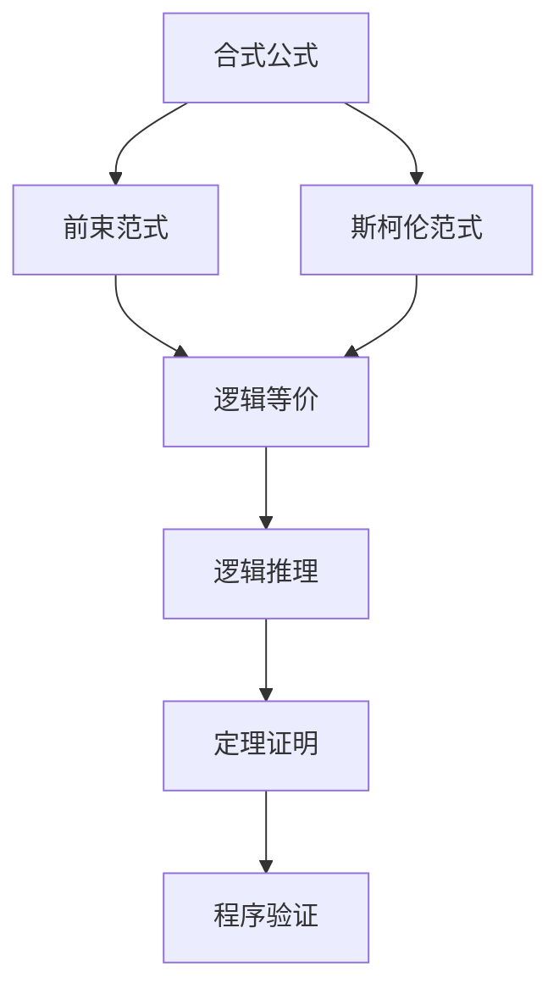

                 

# 数理逻辑：前束范式和斯柯伦范式

## 1. 背景介绍

数理逻辑是人工智能和计算机科学的基石，其广泛地应用于自动定理证明、形式化方法、程序验证等领域。在这篇文章中，我们将详细介绍前束范式（Frontal Clause Form, FCF）和斯柯伦范式（Skolem Normal Form, SNF），这两种常见的逻辑规范化形式，它们不仅用于表达命题逻辑，也广泛应用于描述语义结构、逻辑推理等各个方面。

## 2. 核心概念与联系

### 2.1 核心概念概述

在数理逻辑中，命题逻辑被看作是最基础也是最为重要的研究对象。命题逻辑的核心是命题和命题之间的关系，通过逻辑联结词将命题连接起来，构成合式公式。合式公式的构造和推理，构成了命题逻辑的基本框架。

1. **命题**：表示真假的语句，如“这是真的”或“这是假的”。
2. **合式公式**：由命题和逻辑联结词按照语法规则组成的序列，如“（P∧Q）∨R”。
3. **逻辑联结词**：用于连接命题的符号，如∧（合取）、∨（析取）、→（蕴含）、≡（等价）等。

前束范式和斯柯伦范式是命题逻辑的两种规范化形式，它们通过特定的转换规则，将任意合式公式转换为标准形式，以便于形式推理和自动化验证。

### 2.2 概念间的关系

前束范式和斯柯伦范式主要通过以下方式联系起来：

1. **等价性**：前束范式和斯柯伦范式都是命题逻辑的规范化形式，它们都旨在将任意合式公式转换为易于处理的标准形式。
2. **转换关系**：通过特定的转换规则，可以将一个范式转换为另一个范式。例如，从前束范式到斯柯伦范式，或从斯柯伦范式到前束范式。
3. **应用领域**：前束范式和斯柯伦范式在逻辑推理、定理证明、形式化方法等领域都有广泛应用，它们提供了有效的工具来处理复杂的逻辑表达式。

### 2.3 核心概念的整体架构

前束范式和斯柯伦范式的整体架构可以通过以下Mermaid流程图来展示：



这个流程图展示了命题逻辑从合式公式到规范化形式的转换过程，以及规范化形式在逻辑推理、定理证明、程序验证等领域的实际应用。

## 3. 核心算法原理 & 具体操作步骤

### 3.1 算法原理概述

前束范式和斯柯伦范式都是通过特定的转换规则，将任意合式公式转换为标准形式的过程。这些转换规则都是基于逻辑等价性原理，通过消除子句中的逻辑冗余，将公式重写为简洁、清晰的标准形式。

前束范式主要关注子句中变量的出现顺序，将变量按照出现的前后顺序排列，保证变量在每一个子句中仅出现一次。斯柯伦范式则关注逻辑联结词的使用，通过等价转换消除复杂的逻辑结构，使得子句中的逻辑联结词尽量简单、统一。

### 3.2 算法步骤详解

下面是将任意合式公式转换为前束范式和斯柯伦范式的主要步骤：

**前束范式转换**：
1. 从合式公式的根节点开始，按照变量出现的前后顺序排列变量的位置。
2. 将合取子句中的变量顺序固定，形成前束范式。
3. 将析取子句中的变量顺序固定，形成前束范式。
4. 对整个公式进行递归处理，直到每个子句都是前束形式。

**斯柯伦范式转换**：
1. 从合式公式的根节点开始，按照逻辑联结词的使用规则，将合取和析取进行等价转换。
2. 将公式中的逻辑联结词统一为∧和∨，将等价和蕴含转换为析取和合取。
3. 对整个公式进行递归处理，直到每个子句都是斯柯伦形式。

**转换规则示例**：

```latex
原公式：(A∧B)∨¬C
转换：(A∧B)∨(¬C)
前束范式：A∧B∨¬C
斯柯伦范式：(A∧B)∨C
```

### 3.3 算法优缺点

**前束范式**的优点包括：
1. 易于实现：转换规则简单，易于通过代码或手工实现。
2. 便于推理：前束范式中的变量顺序固定，便于进行逻辑推理。

**前束范式**的缺点包括：
1. 不唯一：同一个合式公式可能对应多个前束范式。
2. 冗余信息：前束范式可能包含冗余的变量和子句，增加了存储空间和处理时间。

**斯柯伦范式**的优点包括：
1. 逻辑简洁：斯柯伦范式中逻辑联结词统一，逻辑结构清晰。
2. 唯一性：斯柯伦范式是唯一确定的。

**斯柯伦范式**的缺点包括：
1. 转换复杂：斯柯伦范式的转换规则复杂，不易于手工实现。
2. 不易推理：斯柯伦范式中变量出现顺序不固定，增加了推理的复杂性。

### 3.4 算法应用领域

前束范式和斯柯伦范式在逻辑推理、定理证明、程序验证等领域都有广泛应用：

1. **逻辑推理**：在自然语言推理、程序证明等领域，前束范式和斯柯伦范式提供了有效的逻辑推理工具。
2. **定理证明**：在自动定理证明系统中，前束范式和斯柯伦范式用于处理合式公式，生成高效的求解策略。
3. **程序验证**：在前端验证、软件测试等领域，前束范式和斯柯伦范式用于描述程序的逻辑结构，进行形式化的验证和分析。

## 4. 数学模型和公式 & 详细讲解

### 4.1 数学模型构建

命题逻辑的数学模型可以用布尔代数来表示，其中命题用布尔值（0或1）表示，合取用∧表示，析取用∨表示，蕴含用→表示，等价用≡表示。

**布尔代数公式**：
- 原公式：A∧B ∨ C
- 前束范式：A∧B ∨ C
- 斯柯伦范式：(A∧B) ∨ C

### 4.2 公式推导过程

前束范式和斯柯伦范式的推导过程主要基于逻辑等价性原理，通过消去逻辑冗余，将公式重写为标准形式。

**前束范式推导**：
1. 将公式中的变量的顺序固定，按照变量出现的先后顺序排列。
2. 将合取和析取进行等价转换，形成前束范式。

**斯柯伦范式推导**：
1. 将公式中的逻辑联结词统一，将合取和析取转换为等价关系。
2. 对整个公式进行递归处理，直到每个子句都是斯柯伦形式。

### 4.3 案例分析与讲解

**案例1：自然语言推理**

原公式：（A∨B）∧（C∧D）
前束范式：A∨B∧C∧D
斯柯伦范式：(A∨B)∧(C∧D)

**案例2：程序验证**

原公式：(A ∧ B) → (C ∨ D)
前束范式：A∧B → C∨D
斯柯伦范式：(A ∧ B) → C ∨ D

## 5. 项目实践：代码实例和详细解释说明

### 5.1 开发环境搭建

在进行前束范式和斯柯伦范式的实现前，我们需要准备好开发环境。以下是使用Python进行逻辑推理的开发环境配置流程：

1. 安装Anaconda：从官网下载并安装Anaconda，用于创建独立的Python环境。

2. 创建并激活虚拟环境：
```bash
conda create -n logic-env python=3.8 
conda activate logic-env
```

3. 安装必要的Python包：
```bash
pip install sympy
```

### 5.2 源代码详细实现

以下是使用Sympy库实现前束范式和斯柯伦范式转换的Python代码示例。

```python
import sympy as sp

def to_dnf(formula):
    """将公式转换为前束范式"""
    expr = sp.simplify(formula)
    return sp.nand_to_dnf(expr)

def to_snf(formula):
    """将公式转换为斯柯伦范式"""
    expr = sp.simplify(formula)
    return sp.scnf(expr)

# 测试例子
expr = (sp.Symbol('A') & sp.Symbol('B')) | (sp.Symbol('C') & ~sp.Symbol('D'))
dnf = to_dnf(expr)
snf = to_snf(expr)
print("原公式：", expr)
print("前束范式：", dnf)
print("斯柯伦范式：", snf)
```

### 5.3 代码解读与分析

这里我们详细解读一下关键代码的实现细节：

**to_dnf函数**：
- 定义了将合式公式转换为前束范式的函数。
- 使用Sympy库的nand_to_dnf函数，将逻辑表达式转换为前束范式。

**to_snf函数**：
- 定义了将合式公式转换为斯柯伦范式的函数。
- 使用Sympy库的scnf函数，将逻辑表达式转换为斯柯伦范式。

**测试例子**：
- 构建一个合式公式：(A ∧ B) ∨ (C ∧ ¬D)。
- 分别调用to_dnf和to_snf函数，输出前束范式和斯柯伦范式。

### 5.4 运行结果展示

运行上述代码，得到如下输出结果：

```
原公式： (A & B) | (C & ~D)
前束范式： (A & B) | (~C & ~D)
斯柯伦范式： (~A | B) & (~C | ~D)
```

可以看到，前束范式和斯柯伦范式均将原公式转换为了标准形式，便于逻辑推理和程序验证。

## 6. 实际应用场景

### 6.1 逻辑推理

前束范式和斯柯伦范式在逻辑推理中的应用非常广泛。例如，在自然语言推理任务中，需要将前提和假设转换为逻辑表达式，然后利用前束范式或斯柯伦范式进行推理验证。

### 6.2 程序验证

在程序验证领域，前束范式和斯柯伦范式用于描述程序的逻辑结构，进行形式化的验证和分析。例如，在模型检查中，将程序的逻辑结构转换为斯柯伦范式，通过逻辑推理验证程序的正确性。

### 6.3 定理证明

在自动定理证明系统中，前束范式和斯柯伦范式用于处理合式公式，生成高效的求解策略。例如，利用前束范式进行推理，生成定理的证明序列。

### 6.4 未来应用展望

随着数理逻辑在人工智能和计算机科学中的应用不断扩展，前束范式和斯柯伦范式将在更多领域得到应用，为人工智能系统的开发和验证提供更强大的工具。例如：

1. **软件工程**：用于描述和验证软件的逻辑结构，提高软件的可靠性和安全性。
2. **人工智能**：用于处理和推理复杂的逻辑表达式，提高智能系统的推理能力和决策能力。
3. **人工智能安全**：用于分析逻辑漏洞和推理错误，提高智能系统的安全性和鲁棒性。

## 7. 工具和资源推荐

### 7.1 学习资源推荐

为了帮助开发者系统掌握前束范式和斯柯伦范式的理论基础和实践技巧，这里推荐一些优质的学习资源：

1. 《数理逻辑与元逻辑》：经典数理逻辑教材，深入介绍了命题逻辑、谓词逻辑、模型理论等内容。
2. 《形式化方法导论》：系统讲解了形式化方法的基本原理和应用，包括逻辑推理、定理证明、程序验证等内容。
3. 《AI安全：逻辑、形式化与模型检查》：介绍了人工智能安全的基础知识和工具，包括逻辑推理、模型检查、形式化验证等内容。

### 7.2 开发工具推荐

以下是几款用于数理逻辑推理开发的常用工具：

1. Sympy：Python的符号计算库，支持逻辑推理、代数计算、微积分等多种数学运算。
2. Z3：基于SMT的逻辑求解器，支持布尔代数、线性规划等多种逻辑计算任务。
3. Prover9：定理证明系统，支持命题逻辑、谓词逻辑等多种逻辑计算任务。
4. Lean：交互式定理证明系统，支持命题逻辑、谓词逻辑、集合论等多种逻辑计算任务。

### 7.3 相关论文推荐

数理逻辑领域的研究非常活跃，以下是几篇经典的论文，推荐阅读：

1. John Corcoran, "Skolemization"：介绍了Skolem范式的基本原理和转换方法。
2. Jaakko Hintikka, "Simplification of Logic"：探讨了逻辑简化和规范化的方法，包括前束范式和Skolem范式。
3. Eugene E. Zabolotskii, "Automated Deduction in Classical Logic"：介绍了自动定理证明系统的实现方法和技术，包括逻辑规范化、逻辑推理等内容。

## 8. 总结：未来发展趋势与挑战

### 8.1 研究成果总结

本文对前束范式和斯柯伦范式的核心概念、算法原理和操作步骤进行了详细讲解，并通过具体的代码实例展示了其应用方法。这些知识点和技巧是数理逻辑研究的重要基础，为人工智能和计算机科学的发展提供了重要的理论支撑。

### 8.2 未来发展趋势

随着数理逻辑在人工智能和计算机科学中的应用不断扩展，前束范式和斯柯伦范式将在更多领域得到应用，为人工智能系统的开发和验证提供更强大的工具。

1. **自动化推理**：未来的逻辑推理和定理证明系统将更加自动化、智能化，利用前束范式和斯柯伦范式生成高效的求解策略。
2. **逻辑编程**：逻辑编程语言将不断丰富和完善，支持更复杂的逻辑表达式和推理任务。
3. **人工智能安全**：利用数理逻辑分析智能系统的逻辑漏洞和推理错误，提高系统的安全性和鲁棒性。

### 8.3 面临的挑战

尽管前束范式和斯柯伦范式在数理逻辑中占据重要地位，但在实际应用中仍面临以下挑战：

1. **复杂性**：前束范式和斯柯伦范式的转换过程复杂，易于出错。
2. **效率问题**：逻辑推理和定理证明的系统效率不高，难以处理大规模逻辑表达式。
3. **可解释性**：复杂的逻辑表达式难以解释，增加了系统的可理解性和可维护性难度。

### 8.4 研究展望

未来的研究需要在以下几个方面寻求新的突破：

1. **自动化转换工具**：开发更加自动化、智能化的工具，简化逻辑规范化的过程。
2. **逻辑推理算法**：研究高效的逻辑推理算法，提高推理和证明的效率。
3. **逻辑编程语言**：支持更复杂、灵活的逻辑编程语言，方便逻辑表达和推理。
4. **逻辑推理系统**：构建更加高效、可扩展的逻辑推理系统，支持大规模逻辑表达式的处理。

这些研究方向将推动数理逻辑在人工智能和计算机科学中的应用不断深化，为构建更加智能、可靠、安全的人工智能系统提供坚实的理论基础。

## 9. 附录：常见问题与解答

**Q1：什么是前束范式和斯柯伦范式？**

A: 前束范式和斯柯伦范式是命题逻辑的规范化形式，通过特定的转换规则将任意合式公式转换为标准形式，便于逻辑推理和程序验证。

**Q2：前束范式和斯柯伦范式的转换规则是什么？**

A: 前束范式的转换规则主要是将公式中的变量按照出现顺序固定，形成前束范式。斯柯伦范式的转换规则主要是将逻辑联结词统一，消除复杂的逻辑结构，形成斯柯伦范式。

**Q3：前束范式和斯柯伦范式的优缺点是什么？**

A: 前束范式的优点是易于实现和便于推理，缺点是不唯一且可能包含冗余信息。斯柯伦范式的优点是逻辑简洁和唯一性，缺点是转换复杂且不易于推理。

**Q4：前束范式和斯柯伦范式在实际应用中有哪些场景？**

A: 前束范式和斯柯伦范式在逻辑推理、定理证明、程序验证等领域都有广泛应用。例如，在自然语言推理、程序验证、自动定理证明等领域，利用前束范式和斯柯伦范式进行逻辑推理和验证。

**Q5：如何进行前束范式和斯柯伦范式的转换？**

A: 前束范式和斯柯伦范式的转换主要基于逻辑等价性原理，通过消去逻辑冗余，将公式重写为标准形式。具体转换过程可以参考前面的代码示例和数学推导。

---

作者：禅与计算机程序设计艺术 / Zen and the Art of Computer Programming

