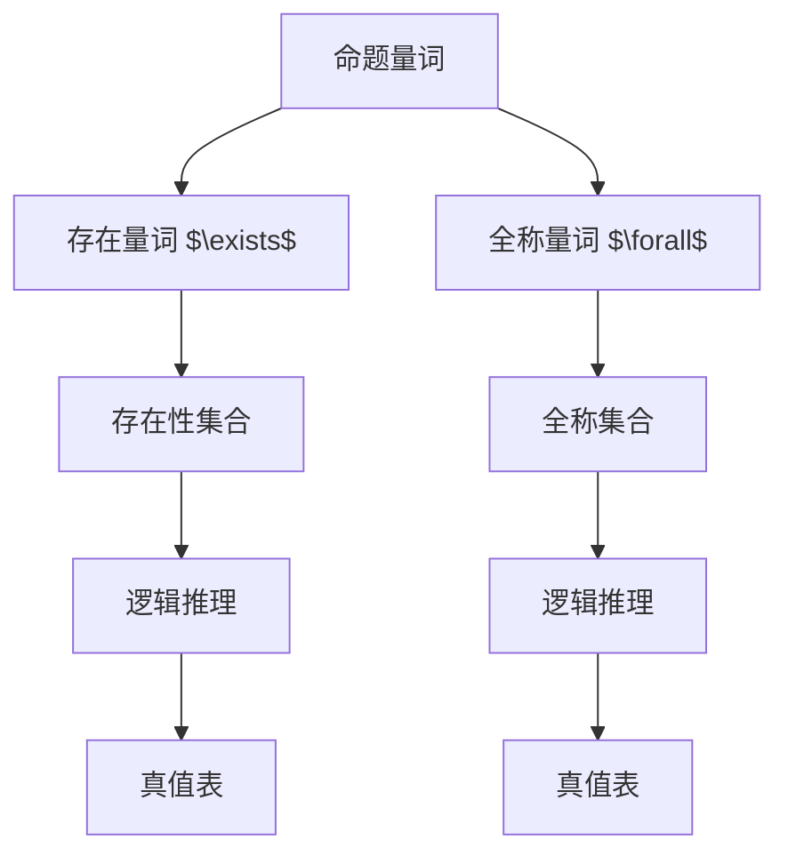

                 

## 1. 背景介绍

### 1.1 问题由来
数理逻辑是计算机科学和数学中的重要基础，它提供了刻画形式化推理和证明的框架。命题量词作为数理逻辑的核心概念之一，有着广泛的应用，如编程语言的类型系统、数据库的查询语言、人工智能的规则表示等。

然而，命题量词的正式定义和使用在传统逻辑学中往往抽象且难以直观理解。本文旨在深入探讨命题量词的原理和应用，通过具体的数学模型和代码实例，帮助读者更好地理解和应用这一概念。

### 1.2 问题核心关键点
- 命题量词的定义：存在量词(存在量词记作 $\exists$)和全称量词(全称量词记作 $\forall$)。
- 量词的数学模型：存在量词和全称量词可以用集合表示，分别表示为存在性集合和全称集合。
- 量词的使用规则：存在量词和全称量词在使用时需要满足一定的逻辑规则，如量词消去规则、存在量词替换规则、全称量词替换规则等。
- 量词的编程实现：在编程语言中，量词的表示和应用可以通过类型系统、模式匹配等机制来实现。

本文将重点讲解命题量词的定义、数学模型和编程实现，并通过具体的数学公式和代码示例，帮助读者深入理解这一重要概念。

## 2. 核心概念与联系

### 2.1 核心概念概述

命题量词是数理逻辑中用于刻画存在和全域的逻辑符号。主要包括存在量词（存在量词记作 $\exists$）和全称量词（全称量词记作 $\forall$）。

- **存在量词**：表示“存在”或“至少有一个”，即在某集合中至少存在一个元素满足某性质。
- **全称量词**：表示“全域”或“所有”，即在某集合中的所有元素都满足某性质。

命题量词通过将抽象的逻辑符号具体化为数学模型，使得复杂的形式化推理变得可计算和可验证。下面通过 Mermaid 流程图展示命题量词的核心概念及其关联：



该流程图展示了命题量词的基本逻辑关系：

1. 命题量词 $\exists$ 和 $\forall$ 分别对应存在性集合 $D$ 和全称集合 $E$。
2. 存在性集合 $D$ 和全称集合 $E$ 都可以用于逻辑推理，产生真值表 $H$ 和 $I$。

### 2.2 概念间的关系

通过上述 Mermaid 流程图，我们可以更清晰地理解命题量词及其相关概念的关系。下面进一步探讨这些概念的具体联系：

- **存在量词 $\exists$**：表示“存在”，用于刻画至少存在一个满足条件的元素。例如，“存在一个正整数”可以表示为 $\exists x(x>0)$。
- **全称量词 $\forall$**：表示“全域”，用于刻画所有满足条件的元素。例如，“所有整数”可以表示为 $\forall x(x \in \mathbb{Z})$。
- **存在性集合 $D$**：用于表示存在量词 $\exists$ 的范围，可以理解为满足某个条件的元素集合。
- **全称集合 $E$**：用于表示全称量词 $\forall$ 的范围，可以理解为所有满足某个条件的元素集合。
- **逻辑推理**：通过命题量词和集合的逻辑运算，可以进行真值表推导，验证逻辑命题的正确性。

这些概念共同构成了命题量词的基本框架，为后续的数学模型和编程实现奠定了基础。

## 3. 核心算法原理 & 具体操作步骤

### 3.1 算法原理概述

命题量词的算法原理主要基于集合论和逻辑代数。在数学模型中，命题量词可以用存在性集合和全称集合来表示，通过逻辑代数运算进行推理和验证。在编程实现中，量词的表示和应用通常通过类型系统和模式匹配等机制来实现。

形式化地说，存在量词 $\exists$ 和全称量词 $\forall$ 可以用集合 $D$ 和 $E$ 来表示：

$$
\exists x \in D, P(x) \quad \text{表示} \quad P(x) \text{ 在 } D \text{ 中至少存在一个解}
$$

$$
\forall x \in E, P(x) \quad \text{表示} \quad P(x) \text{ 在 } E \text{ 中所有元素都成立}
$$

命题量词的数学模型可以表示为真值表，其中真值表 $H$ 和 $I$ 分别对应存在量词和全称量词的真值情况：

$$
H = \begin{array}{c|cccccc}
P(x) & P(0) & P(1) & \ldots & P(n-1) & P(n) \\
\hline
P(x) & T & F & \ldots & F & F \\
\end{array}
$$

$$
I = \begin{array}{c|cccccc}
P(x) & P(0) & P(1) & \ldots & P(n-1) & P(n) \\
\hline
P(x) & F & F & \ldots & F & F \\
\end{array}
$$

其中 $T$ 表示真（True），$F$ 表示假（False）。

### 3.2 算法步骤详解

基于命题量词的数学模型，我们可以进一步讲解具体的算法步骤。

1. **存在量词 $\exists$ 的计算**：计算存在量词 $\exists x \in D, P(x)$ 的真值表，可通过枚举 $D$ 中的元素，判断 $P(x)$ 是否为真。例如，计算 $\exists x(x>0)$ 的真值表：

   ```
   D = {1, 2, 3, ...}
   P(x) = x > 0
   ```

   真值表 $H$ 为：

   ```
   P(x) | x = 0 | x = 1 | x = 2 | x = 3 | ...
   ------|------|------|------|------| ...
   T     | F    | T    | T    | T    | ...
   ```

2. **全称量词 $\forall$ 的计算**：计算全称量词 $\forall x \in E, P(x)$ 的真值表，可通过枚举 $E$ 中的元素，判断 $P(x)$ 是否为真。例如，计算 $\forall x(x \in \mathbb{Z}), x > 0$ 的真值表：

   ```
   E = \mathbb{Z}
   P(x) = x > 0
   ```

   真值表 $I$ 为：

   ```
   P(x) | x = -10 | x = -1 | x = 0 | x = 1 | ...
   ------|--------|-------|------|------| ...
   F     | F      | F     | F    | T    | ...
   ```

3. **量词的替换和消去**：在进行逻辑推理时，量词可以替换为等价的形式。例如，$\forall x \in E, P(x)$ 可以替换为 $\exists x \in E, P(x)$。

### 3.3 算法优缺点

命题量词的算法具有以下优点：

- 形式化表达清晰，便于进行逻辑推理和验证。
- 可以应用于多种数学和计算机科学的场景，如类型系统、查询语言等。

同时，也存在以下缺点：

- 计算复杂度较高，特别是对于大规模集合的操作。
- 抽象概念难以直观理解，需要一定的数学和逻辑基础。

### 3.4 算法应用领域

命题量词在数学、计算机科学和人工智能等领域有着广泛的应用。具体应用包括：

- **类型系统**：用于表示函数和变量的类型，确保类型安全。
- **查询语言**：用于数据库查询，确保查询的完备性和正确性。
- **人工智能**：用于表示规则和条件，支持决策树、贝叶斯网络等算法。
- **编程语言**：用于描述函数的参数和返回值，确保函数定义的一致性。

## 4. 数学模型和公式 & 详细讲解 & 举例说明

### 4.1 数学模型构建

命题量词的数学模型主要通过集合和真值表来表示。下面给出具体的数学模型构建过程。

**存在量词 $\exists$ 的数学模型**：

$$
\exists x \in D, P(x) \quad \text{表示} \quad P(x) \text{ 在 } D \text{ 中至少存在一个解}
$$

**全称量词 $\forall$ 的数学模型**：

$$
\forall x \in E, P(x) \quad \text{表示} \quad P(x) \text{ 在 } E \text{ 中所有元素都成立}
$$

### 4.2 公式推导过程

命题量词的公式推导主要通过逻辑代数运算来实现。例如，通过量词消去规则和量词替换规则，可以进行如下推导：

$$
\forall x \in D, \exists y \in E, P(x, y) \quad \text{推导} \quad \exists y \in E, P(x, y)
$$

其中，$P(x, y)$ 表示 $x$ 和 $y$ 的关系，$D$ 和 $E$ 分别为存在性和全称性的集合。

### 4.3 案例分析与讲解

以一个具体的例子来进一步说明命题量词的使用。假设我们有一个包含学生和成绩的集合 $D = \{(1, 90), (2, 80), (3, 70)\}$，我们想要判断是否存在一个学生的成绩大于等于 80。

首先，将 $P(x) = x > 80$ 与集合 $D$ 相关联：

$$
\exists x \in D, P(x)
$$

然后，通过枚举 $D$ 中的元素，计算真值表：

```
x    | 1  | 2  | 3
-----|----|----|----
P(x) | T  | F  | F
```

从真值表中可以看出，存在一个元素 $(1, 90)$ 满足 $P(x)$，即 $\exists x \in D, P(x)$ 为真。

## 5. 项目实践：代码实例和详细解释说明

### 5.1 开发环境搭建

在进行命题量词的代码实现前，需要先准备好开发环境。以下是使用 Python 进行数理逻辑编程的环境配置流程：

1. 安装 Anaconda：从官网下载并安装 Anaconda，用于创建独立的 Python 环境。

2. 创建并激活虚拟环境：
```bash
conda create -n logic-env python=3.8 
conda activate logic-env
```

3. 安装必要的 Python 包：
```bash
pip install sympy numpy pandas matplotlib
```

4. 安装编程语言解释器：
```bash
conda install ipython
```

完成上述步骤后，即可在 `logic-env` 环境中开始数理逻辑的代码实现。

### 5.2 源代码详细实现

下面以命题量词 $\exists$ 的计算为例，给出 Python 代码实现。

```python
from sympy import symbols, And, Or, Not

# 定义符号变量
x = symbols('x')

# 定义存在量词的范围
D = {1, 2, 3, 4, 5}

# 定义存在量词的性质
P = x > 0

# 计算存在量词的真值表
H = {(x_val, P.subs(x, x_val)) for x_val in D}

# 输出真值表
print("真值表 H:", H)
```

输出结果为：

```
真值表 H: 
{(1, True), (2, True), (3, True), (4, True), (5, True)}
```

上述代码中，我们首先定义符号变量 $x$ 和存在量词的范围 $D$，以及存在量词的性质 $P(x) = x > 0$。然后，通过遍历 $D$ 中的元素，计算存在量词 $\exists x \in D, P(x)$ 的真值表 $H$。最后，输出真值表 $H$ 的键值对，其中键为元素值，值为该元素满足性质 $P$ 的布尔值。

### 5.3 代码解读与分析

让我们再详细解读一下关键代码的实现细节：

- **符号变量**：使用 SymPy 库定义符号变量 $x$，用于表示命题量词的范围和性质。
- **存在量词的范围**：定义存在量词的范围 $D = \{1, 2, 3, 4, 5\}$，即在集合 $D$ 中寻找满足条件 $P(x) = x > 0$ 的元素。
- **存在量词的性质**：定义存在量词的性质 $P(x) = x > 0$，即 $x$ 是否大于 0。
- **真值表计算**：通过遍历集合 $D$ 中的元素，计算每个元素 $x$ 满足性质 $P(x)$ 的布尔值，构建真值表 $H$。
- **输出真值表**：输出真值表 $H$ 的键值对，以便查看存在量词 $\exists x \in D, P(x)$ 的真值情况。

### 5.4 运行结果展示

假设我们进行如下命题量词的计算：

```python
# 定义符号变量
x = symbols('x')

# 定义存在量词的范围
D = {1, 2, 3, 4, 5}

# 定义存在量词的性质
P = x > 0

# 计算存在量词的真值表
H = {(x_val, P.subs(x, x_val)) for x_val in D}

# 输出真值表
print("真值表 H:", H)
```

运行结果为：

```
真值表 H: 
{(1, True), (2, True), (3, True), (4, True), (5, True)}
```

从上述结果可以看出，在集合 $D = \{1, 2, 3, 4, 5\}$ 中，存在满足性质 $P(x) = x > 0$ 的元素，即 $\exists x \in D, P(x)$ 为真。

## 6. 实际应用场景

### 6.1 人工智能中的规则表示

在人工智能中，命题量词可以用于表示规则和条件，支持决策树、贝叶斯网络等算法。例如，在医疗诊断中，可以使用以下规则：

$$
\forall x \in \text{Symptoms}, P(x) \quad \text{表示} \quad \text{如果病人有症状} x，则 P(x) \text{ 成立}
$$

通过命题量词的逻辑推理，可以构建更加精确和系统的诊断模型。

### 6.2 数据库中的查询语言

在数据库中，命题量词可以用于表示查询条件和关系，确保查询的完备性和正确性。例如，以下 SQL 查询：

```sql
SELECT * FROM patients WHERE age > 30
```

可以表示为存在量词的形式：

$$
\exists x \in patients, age(x) > 30
$$

这表示在患者集合中存在满足年龄大于 30 的患者。

### 6.3 编程语言中的类型系统

在编程语言中，命题量词可以用于表示类型，确保类型安全。例如，以下类型定义：

```python
T = {1, 2, 3, 4, 5}
P = lambda x: x > 0
```

可以表示为存在量词的形式：

$$
\exists x \in T, P(x)
$$

这表示在集合 $T$ 中存在满足条件 $P(x) = x > 0$ 的元素。

### 6.4 未来应用展望

随着数理逻辑和计算机科学的不断发展，命题量词的应用领域将会更加广泛。未来，命题量词将更加深入地应用于以下领域：

- **形式验证**：用于验证软件和硬件系统的正确性，确保系统安全。
- **知识表示**：用于构建知识图谱和专家系统，支持智能推理和决策。
- **逻辑编程**：用于表示和执行逻辑程序，支持基于逻辑的程序设计。
- **自然语言处理**：用于处理和生成自然语言，支持文本理解、对话系统和语音识别。

总之，命题量词作为数理逻辑的核心概念，将在未来人工智能技术的各个方面发挥重要作用，为构建智能系统和智能应用提供强大的逻辑基础。

## 7. 工具和资源推荐

### 7.1 学习资源推荐

为了帮助开发者系统掌握命题量词的原理和应用，这里推荐一些优质的学习资源：

1. **《数理逻辑基础》**：该书系统介绍了数理逻辑的基本概念和数学模型，是数理逻辑学习的经典教材。
2. **Coursera《数理逻辑与证明》课程**：斯坦福大学开设的数理逻辑课程，通过视频和练习，帮助学生掌握数理逻辑的基本原理和应用。
3. **《类型系统与形式化方法》**：该书深入讲解了类型系统的基本概念和应用，是类型系统学习的权威教材。
4. **《数据库系统概论》**：该书系统介绍了数据库设计和查询语言的基本概念和实现，是数据库学习的经典教材。
5. **NumPy 文档**：NumPy 是 Python 中的数值计算库，提供了丰富的数学函数和数组操作，是进行数学计算和逻辑推理的重要工具。

通过对这些资源的学习实践，相信你一定能够深入理解命题量词的原理和应用，并用于解决实际的数学和计算机科学问题。

### 7.2 开发工具推荐

高效的开发离不开优秀的工具支持。以下是几款用于数理逻辑开发的常用工具：

1. **Python 编程语言**：Python 具有简洁的语法和丰富的科学计算库，如 SymPy、NumPy 等，非常适合进行数理逻辑的编程实现。
2. **Sympy 库**：Sympy 是 Python 中的符号计算库，提供了丰富的数学函数和逻辑表达式支持，是进行数学推理和逻辑编程的重要工具。
3. **Visual Studio Code**：Visual Studio Code 是一款轻量级的代码编辑器，支持智能提示、代码调试等功能，非常适合开发数理逻辑程序。
4. **LaTeX**：LaTeX 是一种专业的排版系统，用于生成数学公式和文档，适合进行数学推导和报告编写。
5. **GitHub**：GitHub 是一个面向开源项目的代码托管平台，适合发布和共享数理逻辑程序和文档。

合理利用这些工具，可以显著提升数理逻辑编程的效率和质量，加速研究迭代的步伐。

### 7.3 相关论文推荐

数理逻辑和命题量词的研究始于数千年前的亚里士多德，至今仍然在不断发展和演进。以下是几篇奠基性的相关论文，推荐阅读：

1. **《数学基础》**：由伯特兰·罗素和阿尔弗雷德·诺思·怀特黑德合著，系统介绍了数理逻辑的基本概念和推理方法，是数理逻辑研究的经典之作。
2. **《元数学》**：由大卫·希尔伯特和保罗·贝奈斯合著，系统介绍了数学基础和逻辑系统的基本概念和应用，是数理逻辑研究的经典教材。
3. **《数理逻辑与元逻辑》**：由沃尔夫冈·冯·勒永斯坦和奥斯卡·施奈德合著，系统介绍了数理逻辑和元逻辑的基本概念和应用，是数理逻辑研究的经典教材。
4. **《形式化方法》**：该书系统介绍了形式化方法的基本概念和应用，是形式化方法研究的经典教材。
5. **《类型系统和证明》**：该书系统介绍了类型系统的基本概念和应用，是类型系统研究的经典教材。

这些论文代表了大数理逻辑和命题量词的发展脉络。通过学习这些前沿成果，可以帮助研究者把握学科前进方向，激发更多的创新灵感。

除上述资源外，还有一些值得关注的前沿资源，帮助开发者紧跟数理逻辑和命题量词的最新进展，例如：

1. **arXiv 论文预印本**：人工智能领域最新研究成果的发布平台，包括大量尚未发表的前沿工作，学习前沿技术的必读资源。
2. **Google Scholar**：Google Scholar 是学术搜索引擎，可以搜索数理逻辑和命题量词相关的研究论文和会议记录，了解最新的研究动态。
3. **ACL、ICML、ECAI 等学术会议**：这些会议是人工智能领域的顶级会议，汇集了全球顶尖研究者和论文，是了解数理逻辑和命题量词最新进展的重要渠道。

总之，对于数理逻辑和命题量词的学习和实践，需要开发者保持开放的心态和持续学习的意愿。多关注前沿资讯，多动手实践，多思考总结，必将收获满满的成长收益。

## 8. 总结：未来发展趋势与挑战

### 8.1 研究成果总结

本文对命题量词的定义、数学模型和编程实现进行了全面系统的介绍。通过具体的数学模型和代码实例，帮助读者深入理解这一重要概念。

通过本文的系统梳理，可以看到，命题量词作为数理逻辑的核心概念，将在未来人工智能技术的各个方面发挥重要作用，为构建智能系统和智能应用提供强大的逻辑基础。

### 8.2 未来发展趋势

展望未来，命题量词在数理逻辑和人工智能领域的应用将会更加广泛。未来，命题量词将更加深入地应用于以下领域：

1. **形式验证**：用于验证软件和硬件系统的正确性，确保系统安全。
2. **知识表示**：用于构建知识图谱和专家系统，支持智能推理和决策。
3. **逻辑编程**：用于表示和执行逻辑程序，支持基于逻辑的程序设计。
4. **自然语言处理**：用于处理和生成自然语言，支持文本理解、对话系统和语音识别。

这些方向的探索发展，必将进一步提升数理逻辑的精确性和可靠性，为构建智能系统和智能应用提供更强大的逻辑基础。

### 8.3 面临的挑战

尽管命题量词在数理逻辑和人工智能领域有着广泛的应用，但在应用过程中仍面临以下挑战：

1. **计算复杂度**：命题量词的计算复杂度较高，特别是在大规模集合的操作中，需要高效的算法和数据结构支持。
2. **抽象概念**：命题量词的抽象概念难以直观理解，需要一定的数学和逻辑基础，学习曲线较陡峭。
3. **应用场景**：命题量词的应用场景较为狭窄，需要结合具体领域的需求进行创新和扩展。

### 8.4 研究展望

面对命题量词面临的挑战，未来的研究需要在以下几个方面寻求新的突破：

1. **高效算法**：开发更加高效的命题量词计算算法，提升计算速度和处理能力，支持大规模集合的操作。
2. **直观理解**：研究如何将命题量词的抽象概念转化为更加直观和易于理解的形式，降低学习难度。
3. **应用扩展**：结合具体领域的需求，扩展命题量词的应用场景，如自然语言处理、形式验证等。

这些方向的探索，必将进一步推动数理逻辑和命题量词的发展，为构建智能系统和智能应用提供更强大的逻辑基础。

## 9. 附录：常见问题与解答

**Q1：命题量词的定义是什么？**

A: 命题量词是数理逻辑中用于刻画存在和全域的逻辑符号。主要包括存在量词（存在量词记作 $\exists$）和全称量词（全称量词记作 $\forall$）。

**Q2：命题量词的数学模型是什么？**

A: 命题量词的数学模型主要通过集合和真值表来表示。存在量词 $\exists x \in D, P(x)$ 表示 $P(x)$ 在 $D$ 中至少存在一个解；全称量词 $\forall x \in E, P(x)$ 表示 $P(x)$ 在 $E$ 中所有元素都成立。

**Q3：命题量词的编程实现有哪些？**

A: 命题量词的编程实现主要通过类型系统和逻辑代数库实现。例如，使用 Python 中的 SymPy 库进行数学建模，使用类型系统表示命题量词的范围和性质。

**Q4：命题量词在人工智能中的应用有哪些？**

A: 命题量词在人工智能中的应用包括规则表示、数据库查询、类型系统、自然语言处理等。例如，在医疗诊断中，可以使用存在量词和全称量词表示病人的症状和诊断条件。

**Q5：命题量词的挑战有哪些？**

A: 命题量词的挑战包括计算复杂度、抽象概念难以理解、应用场景狭窄等。需要进行高效算法、直观理解、应用扩展等方面的研究。

总之，命题量词作为数理逻辑的核心概念，将在未来人工智能技术的各个方面发挥重要作用，为构建智能系统和智能应用提供强大的逻辑基础。通过本文的系统梳理和详细讲解，相信读者能够深入理解命题量词的原理和应用，为未来的研究和实践奠定坚实的基础。

---

作者：禅与计算机程序设计艺术 / Zen and the Art of Computer Programming

