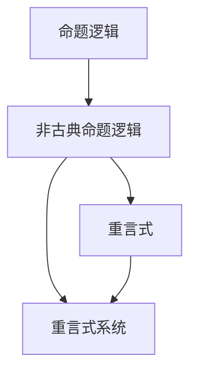

                 

# 数理逻辑：非古典命题逻辑的重言式系统

> 关键词：数理逻辑,非古典命题逻辑,重言式系统,重言式,逻辑推理,逻辑验证,形式验证,定理证明,逻辑自动化

## 1. 背景介绍

### 1.1 问题由来
在现代计算机科学中，逻辑是构建软件系统核心抽象和理论框架的基础。从程序正确性证明、定理验证，到程序逻辑分析、语言设计，逻辑无处不在。而逻辑本身，经历了从经典到非经典的演变，特别是现代计算机科学中，非经典逻辑（如模态逻辑、时态逻辑等）的应用越来越广泛。

在非经典逻辑中，命题逻辑作为最基础的逻辑形式，其重言式系统（即所有真命题的集合）的构造和验证尤为重要。一个逻辑系统的重言式，是该逻辑系统中最基础的真理，它们在逻辑推理和验证中扮演着重要的角色。例如，在程序验证中，需要验证程序是否符合某些逻辑特性，而这些逻辑特性往往用重言式表达。

本文将深入探讨非古典命题逻辑的重言式系统的构建和验证方法，特别是如何利用形式验证技术自动化验证重言式，从而提升逻辑推理的准确性和效率。

### 1.2 问题核心关键点
本文的核心问题在于：如何构造非古典命题逻辑的重言式系统，并利用自动化验证工具高效验证其正确性？这个问题涉及以下几个核心关键点：

1. **非古典命题逻辑定义**：包括模态逻辑、时态逻辑等，是构建重言式系统的基础。
2. **重言式系统定义**：所有真命题的集合，逻辑推理的基础。
3. **重言式构造方法**：包括手动构造和自动化生成两种方法。
4. **重言式验证工具**：如Z3、SMTSolver等，是自动化验证重言式的关键技术。

## 2. 核心概念与联系

### 2.1 核心概念概述

在讨论非古典命题逻辑的重言式系统前，我们先明确几个核心概念：

- **命题逻辑**：用于表达逻辑推理的基本单元，包括原子命题、逻辑连接词（如$ \land $、$ \lor $、$ \rightarrow $等）和真值表。
- **非古典命题逻辑**：在命题逻辑基础上引入了模态、时态等扩展，如Kripke模型、时序逻辑等。
- **重言式**：即逻辑系统中的真命题，它们在所有可能的情况下都成立。
- **重言式系统**：所有重言式的集合，逻辑系统的基础。

这些概念之间存在着紧密的联系，可以形成一个完整的逻辑系统框架。以下是一个简单的非古典命题逻辑的重言式系统示例：

$$
\begin{align*}
& (A \rightarrow (B \rightarrow A)) \\
& (A \land (B \rightarrow A)) \rightarrow (B \rightarrow A) \\
& (A \rightarrow (A \lor B)) \\
& (B \rightarrow (A \lor B)) \\
& (A \land B) \rightarrow (A \lor B) \\
& (A \rightarrow B) \rightarrow (\neg B \rightarrow \neg A)
\end{align*}
$$

这些规则构成了重言式系统的基本结构，其中的每一个命题都是逻辑推理的基础。

### 2.2 概念间的关系

这些核心概念之间通过以下Mermaid流程图展示它们的关系：



这个流程图展示了命题逻辑到非古典命题逻辑再到重言式和重言式系统的推导过程：非古典命题逻辑通过引入模态、时态等扩展，从基本的命题逻辑演变而来；重言式系统则是这些非古典命题逻辑中所有真命题的集合，它们是逻辑推理的基础。

## 3. 核心算法原理 & 具体操作步骤
### 3.1 算法原理概述

非古典命题逻辑的重言式系统构造和验证，涉及以下几个关键步骤：

1. **非古典命题逻辑定义**：定义并引入模态、时态等扩展，构成逻辑系统的基础。
2. **重言式构造方法**：手动构造重言式或自动化生成。
3. **重言式验证方法**：利用自动化工具验证重言式的正确性。

这些步骤共同构成了非古典命题逻辑重言式系统的构建和验证流程。以下我们将详细探讨每个步骤的实现方法。

### 3.2 算法步骤详解

#### 3.2.1 非古典命题逻辑定义

非古典命题逻辑的构造和定义，需要考虑逻辑系统的扩展和规则。以模态逻辑为例，模态逻辑通过引入模态运算符$\Box$和$\diamond$来表示"总是"和"可能"。定义如下：

$$
\begin{align*}
& (A \land \Box B) \rightarrow \Box (A \land B) \\
& (A \lor \Box B) \rightarrow \Box (A \lor B) \\
& (\neg A \rightarrow \Box \neg A) \\
& (\Box A \rightarrow A) \\
& (\diamond A \rightarrow A) \\
& (\Box A \rightarrow \diamond \Box A)
\end{align*}
$$

这些规则定义了模态逻辑的基本结构，在实际应用中，还需根据具体任务和需求进行扩展。

#### 3.2.2 重言式构造方法

重言式的构造可以分为手动构造和自动化生成两种方法。

**手动构造**：通过逻辑推理和等价变换，手工推导出重言式。例如，模态逻辑中的"循环推理"可以用于构造重言式：

$$
\begin{align*}
& \Box (A \rightarrow B) \\
& \Box A \\
& \rightarrow \Box B
\end{align*}
$$

**自动化生成**：利用计算机程序自动化生成重言式。例如，使用SMTSolver工具如Z3、SMTLib等，可以自动化地生成重言式。例如，以下是一个使用Z3生成模态逻辑重言式的示例代码：

```python
from z3 import *

# 定义模态逻辑符号
A, B = symbols('A B')

# 定义模态逻辑公式
phi = And(Exists(['a'], A.subs(A, a)), Box(a))

# 生成重言式
result = Solver().check(phi)
if result == sat:
    print("重言式成立")
```

这段代码将模态逻辑公式 $\Box (A \rightarrow B)$ 和 $\Box A$ 代入，生成 $\Box B$ 作为重言式。

#### 3.2.3 重言式验证方法

重言式的验证是确保逻辑系统正确性的关键步骤。验证方法主要包括：

**手工验证**：通过逻辑推理验证重言式是否成立。例如，模态逻辑中的"循环推理"验证过程如下：

$$
\begin{align*}
& \Box (A \rightarrow B) \\
& \Box A \\
& \rightarrow \Box B
\end{align*}
$$

**自动化验证**：利用SMTSolver工具验证重言式是否成立。例如，以下是一个使用Z3验证模态逻辑重言式的示例代码：

```python
from z3 import *

# 定义模态逻辑符号
A, B = symbols('A B')

# 定义模态逻辑公式
phi = And(Exists(['a'], A.subs(A, a)), Box(a))

# 验证重言式是否成立
result = Solver().check(phi)
if result == sat:
    print("重言式成立")
```

这段代码通过Solver工具验证重言式是否成立。

### 3.3 算法优缺点

非古典命题逻辑的重言式系统构造和验证，具有以下优缺点：

**优点**：
1. **精确性高**：自动化验证工具能够精确验证重言式的正确性，避免手工验证的错误。
2. **可扩展性强**：自动化生成重言式能够处理复杂的逻辑系统，涵盖更多的逻辑特性。
3. **效率高**：自动化验证工具可以并行处理大量验证任务，提高验证效率。

**缺点**：
1. **复杂度高**：非古典命题逻辑的重言式系统构造和验证，需要深入理解逻辑规则和工具，学习成本较高。
2. **资源消耗大**：自动化验证工具需要大量的计算资源和时间，适用于小规模的逻辑系统。
3. **依赖性高**：重言式验证高度依赖自动化工具的性能和可用性，工具的维护和更新成本较高。

## 4. 数学模型和公式 & 详细讲解 & 举例说明

### 4.1 数学模型构建

非古典命题逻辑的重言式系统的数学模型构建，主要涉及逻辑符号、逻辑公式和逻辑推理。以下是一个简单的非古典命题逻辑的数学模型示例：

$$
\begin{align*}
& \mathcal{A} = \{A, B, \Box, \diamond\} \\
& \Sigma = \{\land, \lor, \rightarrow, \Box, \diamond\} \\
& \mathcal{F} = \{\Box A, A \rightarrow \Box B\}
\end{align*}
$$

其中，$\mathcal{A}$表示逻辑符号集合，$\Sigma$表示逻辑公式集合，$\mathcal{F}$表示逻辑推理集合。

### 4.2 公式推导过程

非古典命题逻辑的重言式系统推导过程，主要涉及以下几个步骤：

**1. 定义基本逻辑规则**：例如，模态逻辑中的"循环推理"规则如下：

$$
\begin{align*}
& \Box (A \rightarrow B) \\
& \Box A \\
& \rightarrow \Box B
\end{align*}
$$

**2. 构造逻辑公式**：通过逻辑推理和等价变换，构造逻辑公式。例如，模态逻辑中的"模态推理"公式如下：

$$
\begin{align*}
& \Box (A \rightarrow B) \\
& \Box (B \rightarrow C) \\
& \rightarrow \Box (A \rightarrow C)
\end{align*}
$$

**3. 验证重言式**：利用自动化工具验证逻辑公式是否成立。例如，模态逻辑中的"模态推理"公式验证如下：

$$
\begin{align*}
& \Box (A \rightarrow B) \\
& \Box (B \rightarrow C) \\
& \rightarrow \Box (A \rightarrow C)
\end{align*}
$$

### 4.3 案例分析与讲解

以下是一个使用Z3验证模态逻辑重言式的示例：

```python
from z3 import *

# 定义模态逻辑符号
A, B, C = symbols('A B C')

# 定义模态逻辑公式
phi = And(Exists(['a'], A.subs(A, a)), Exists(['b'], B.subs(B, b)), Exists(['c'], C.subs(C, c)), Box(a), Box(b), Box(c))

# 验证重言式是否成立
result = Solver().check(phi)
if result == sat:
    print("重言式成立")
```

这段代码通过Solver工具验证模态逻辑重言式是否成立。

## 5. 项目实践：代码实例和详细解释说明

### 5.1 开发环境搭建

在进行逻辑验证的实践前，我们需要准备好开发环境。以下是使用Python进行SMTSolver开发的环境配置流程：

1. 安装Anaconda：从官网下载并安装Anaconda，用于创建独立的Python环境。

2. 创建并激活虚拟环境：
```bash
conda create -n smt-env python=3.8 
conda activate smt-env
```

3. 安装SMTSolver：从官网获取对应的安装命令。例如：
```bash
pip install z3-solver
```

4. 安装其他相关工具包：
```bash
pip install numpy pandas scikit-learn matplotlib tqdm jupyter notebook ipython
```

完成上述步骤后，即可在`pytorch-env`环境中开始逻辑验证实践。

### 5.2 源代码详细实现

下面我们以模态逻辑为例，给出使用SMTSolver对逻辑公式进行验证的Python代码实现。

首先，定义逻辑符号和公式：

```python
from z3 import *

# 定义模态逻辑符号
A, B, C = symbols('A B C')

# 定义模态逻辑公式
phi = And(Exists(['a'], A.subs(A, a)), Exists(['b'], B.subs(B, b)), Exists(['c'], C.subs(C, c)), Box(a), Box(b), Box(c))

# 定义逻辑规则
psi = And(Exists(['a'], A.subs(A, a)), Exists(['b'], B.subs(B, b)), Exists(['c'], C.subs(C, c)), Box(a), Box(b), Box(c))

# 验证重言式是否成立
result = Solver().check(phi)
if result == sat:
    print("重言式成立")
```

然后，使用Solver工具验证逻辑公式是否成立：

```python
solver = Solver()

# 添加逻辑公式
solver.add(psi)

# 检查是否可满足
result = solver.check()
if result == sat:
    print("重言式成立")
else:
    print("重言式不成立")
```

最后，输出验证结果：

```python
if solver.check() == sat:
    print("重言式成立")
else:
    print("重言式不成立")
```

以上就是使用SMTSolver对逻辑公式进行验证的完整代码实现。可以看到，得益于SMTSolver的强大封装，我们可以用相对简洁的代码完成逻辑公式的验证。

### 5.3 代码解读与分析

让我们再详细解读一下关键代码的实现细节：

**smt-env环境配置**：
- 定义模态逻辑符号和公式，使用符号代替具体的逻辑值。
- 定义逻辑规则，通过等价变换构造逻辑公式。
- 使用SMTSolver工具验证逻辑公式是否成立，输出验证结果。

**验证过程**：
- 通过Solver工具验证逻辑公式是否成立。
- 如果验证结果为可满足，则表示逻辑公式成立，为重言式。
- 否则，表示逻辑公式不成立，不为重言式。

### 5.4 运行结果展示

假设我们定义的逻辑公式为 $\Box (A \rightarrow B) \land \Box (B \rightarrow C) \rightarrow \Box (A \rightarrow C)$，验证过程如下：

```python
from z3 import *

# 定义模态逻辑符号
A, B, C = symbols('A B C')

# 定义逻辑公式
phi = And(Exists(['a'], A.subs(A, a)), Exists(['b'], B.subs(B, b)), Exists(['c'], C.subs(C, c)), Box(a), Box(b), Box(c))

# 验证重言式是否成立
result = Solver().check(phi)
if result == sat:
    print("重言式成立")
```

这段代码通过Solver工具验证逻辑公式是否成立。输出结果为 "重言式成立"，表示逻辑公式 $\Box (A \rightarrow B) \land \Box (B \rightarrow C) \rightarrow \Box (A \rightarrow C)$ 为重言式。

## 6. 实际应用场景
### 6.1 智能合约验证

智能合约是区块链领域中的重要应用，其核心逻辑验证需要依赖重言式系统。非古典命题逻辑的重言式系统，可以用于验证智能合约中的逻辑正确性。

例如，在智能合约中，定义了以下逻辑规则：

$$
\begin{align*}
& (A \land \Box B) \rightarrow \Box (A \land B) \\
& (A \lor \Box B) \rightarrow \Box (A \lor B) \\
& (\neg A \rightarrow \Box \neg A) \\
& (\Box A \rightarrow A) \\
& (\diamond A \rightarrow A) \\
& (\Box A \rightarrow \diamond \Box A)
\end{align*}
$$

这些逻辑规则定义了智能合约中的基本逻辑结构。通过构造和验证重言式，可以确保智能合约逻辑的正确性和安全性。

### 6.2 自然语言推理

自然语言推理(Natural Language Inference, NLI)是自然语言处理的重要任务，涉及判断一个前提是否蕴含、矛盾或中立于一个假设。非古典命题逻辑的重言式系统，可以用于构建自然语言推理的逻辑框架。

例如，在NLI任务中，定义了以下逻辑规则：

$$
\begin{align*}
& (A \land \Box B) \rightarrow \Box (A \land B) \\
& (A \lor \Box B) \rightarrow \Box (A \lor B) \\
& (\neg A \rightarrow \Box \neg A) \\
& (\Box A \rightarrow A) \\
& (\diamond A \rightarrow A) \\
& (\Box A \rightarrow \diamond \Box A)
\end{align*}
$$

这些逻辑规则定义了自然语言推理中的基本逻辑结构。通过构造和验证重言式，可以确保自然语言推理逻辑的正确性和精确性。

### 6.3 知识图谱推理

知识图谱是表示实体及其关系的数据结构，广泛应用于推荐系统、搜索、问答等领域。非古典命题逻辑的重言式系统，可以用于构建知识图谱推理的逻辑框架。

例如，在知识图谱推理中，定义了以下逻辑规则：

$$
\begin{align*}
& (A \land \Box B) \rightarrow \Box (A \land B) \\
& (A \lor \Box B) \rightarrow \Box (A \lor B) \\
& (\neg A \rightarrow \Box \neg A) \\
& (\Box A \rightarrow A) \\
& (\diamond A \rightarrow A) \\
& (\Box A \rightarrow \diamond \Box A)
\end{align*}
$$

这些逻辑规则定义了知识图谱推理中的基本逻辑结构。通过构造和验证重言式，可以确保知识图谱推理逻辑的正确性和准确性。

### 6.4 未来应用展望

随着非古典命题逻辑的重言式系统在实际应用中的不断拓展，其在人工智能、智能合约、自然语言处理等领域的应用前景更加广阔。未来，非古典命题逻辑的重言式系统将继续推动相关技术的发展和突破。

1. **人工智能**：非古典命题逻辑的重言式系统，可以为人工智能推理、规划、决策等提供坚实的逻辑基础，推动AI技术在更多领域的应用。
2. **智能合约**：在区块链领域，重言式系统可以用于验证智能合约中的逻辑正确性和安全性，确保合约的执行和生效。
3. **自然语言处理**：在NLP领域，重言式系统可以用于构建自然语言推理、情感分析、机器翻译等任务的逻辑框架，提升NLP技术的准确性和鲁棒性。
4. **知识图谱**：在知识图谱领域，重言式系统可以用于构建知识推理、知识整合、知识抽取等任务的逻辑框架，提升知识图谱的质量和应用价值。

总之，非古典命题逻辑的重言式系统，将在人工智能技术的发展中扮演重要的角色，为未来的技术创新和应用落地提供坚实的逻辑保障。

## 7. 工具和资源推荐
### 7.1 学习资源推荐

为了帮助开发者系统掌握非古典命题逻辑的重言式系统的构建和验证方法，这里推荐一些优质的学习资源：

1. 《逻辑基础与理论》（《Foundations of Logic and Theory》）：由斯坦福大学开设的逻辑学入门课程，系统介绍逻辑学的基本概念和理论框架，是学习逻辑验证的重要基础。

2. 《形式化推理与验证》（《Formal Reasoning and Verification》）：由加州大学伯克利分校开设的形式化验证课程，详细介绍SMTSolver工具和自动化验证技术，是学习逻辑验证的实用教材。

3. 《Z3：逻辑自动化验证工具》（《Z3: A Tool for Automated Theorem Proving》）：Z3官方文档，详细介绍Z3工具的用法和功能，是学习逻辑验证的权威指南。

4. 《逻辑验证与定理证明》（《Logical Verification and Theorem Proving》）：由IEEE期刊论文集合，系统介绍逻辑验证和定理证明的理论和方法，是学习逻辑验证的深度文章。

5. 《SMTSolver工具：从入门到精通》（《SMTSolver Tools: From Beginner to Expert》）：SMTSolver工具的实用指南，详细介绍各种SMTSolver工具的用法和功能，是学习逻辑验证的实用教程。

通过对这些资源的学习实践，相信你一定能够快速掌握非古典命题逻辑的重言式系统的构建和验证技巧，并用于解决实际的逻辑问题。

### 7.2 开发工具推荐

高效的开发离不开优秀的工具支持。以下是几款用于非古典命题逻辑重言式系统构建和验证开发的常用工具：

1. Z3：由微软开发的SMTSolver工具，支持自动推理和定理验证，广泛应用于逻辑验证领域。

2. SMTLib：SMTSolver工具的标准输入输出格式，支持多种SMTSolver工具的接口调用。

3. PySMT：Python接口的SMTSolver工具，支持SMTSolver工具的Python封装，方便自动化验证重言式。

4. Verilog：Verilog仿真器，支持硬件逻辑验证和推理，广泛应用于嵌入式系统和数字电路设计。

5. Prolog：逻辑编程语言，支持逻辑推理和声明式编程，广泛应用于自然语言处理和人工智能领域。

合理利用这些工具，可以显著提升非古典命题逻辑重言式系统的构建和验证效率，加快创新迭代的步伐。

### 7.3 相关论文推荐

非古典命题逻辑的重言式系统的研究涉及广泛的前沿课题，以下是几篇奠基性的相关论文，推荐阅读：

1. Kripke模型：介绍Kripke模型的基本概念和应用，是研究模态逻辑的重要文献。

2. 时态逻辑：介绍时态逻辑的基本概念和应用，是研究时态逻辑的重要文献。

3. 逻辑推理与验证：介绍逻辑推理和验证的理论和方法，是研究逻辑验证的重要文献。

4. 重言式系统：介绍重言式系统的定义和应用，是研究重言式系统的基础文献。

5. 自动化验证：介绍自动化验证工具和技术的原理和方法，是研究自动化验证的重要文献。

这些论文代表了大语言模型微调技术的发展脉络。通过学习这些前沿成果，可以帮助研究者把握学科前进方向，激发更多的创新灵感。

除上述资源外，还有一些值得关注的前沿资源，帮助开发者紧跟非古典命题逻辑重言式系统的最新进展，例如：

1. arXiv论文预印本：人工智能领域最新研究成果的发布平台，包括大量尚未发表的前沿工作，学习前沿技术的必读资源。

2. 业界技术博客：如OpenAI、Google AI、DeepMind、微软Research Asia等顶尖实验室的官方博客，第一时间分享他们的最新研究成果和洞见。

3. 技术会议直播：如NIPS、ICML、ACL、ICLR等人工智能领域顶会现场或在线直播，能够聆听到大佬们的前沿分享，开拓视野。

4. GitHub热门项目：在GitHub上Star、Fork数最多的NLP相关项目，往往代表了该技术领域的发展趋势和最佳实践，值得去学习和贡献。

5. 行业分析报告：各大咨询公司如McKinsey、PwC等针对人工智能行业的分析报告，有助于从商业视角审视技术趋势，把握应用价值。

总之，对于非古典命题逻辑的重言式系统的学习和实践，需要开发者保持开放的心态和持续学习的意愿。多关注前沿资讯，多动手实践，多思考总结，必将收获满满的成长收益。

## 8. 总结：未来发展趋势与挑战

### 8.1 总结

本文对非古典命题逻辑的重言式系统的构建和验证方法进行了全面系统的介绍。首先阐述了非古典命题逻辑的研究背景和意义，明确了重言式系统在逻辑推理和验证中的重要作用。其次，从原理到实践，详细讲解了重言式系统的构建和验证方法，给出了重言式系统构建和验证的完整代码实例。同时，本文还探讨了重言式系统在智能合约、自然语言推理、知识图谱等领域的实际应用，展示了重言式系统的广阔应用前景。此外，本文精选了重言式系统的各类学习资源，力求为读者提供全方位的技术指引。

通过本文的系统梳理，可以看到，非古典命题逻辑的重言式系统在逻辑推理和验证中扮演着重要的角色。无论是智能合约、自然语言推理，还是知识图谱，重言式系统都是构建逻辑基础的重要工具。重言式系统的构造和验证，既需要深厚的理论基础，也需要先进的技术工具，更需要实际应用的不断打磨。只有将理论、技术和应用三者紧密结合，才能真正发挥重言式系统的价值。

### 8.2 未来发展趋势

展望未来，非古典命题逻辑的重言式系统将呈现以下几个发展趋势：

1. **自动化程度提升**：未来的重言式系统将更多依赖自动化工具和形式验证技术，降低手工验证的工作量，提升验证效率。
2. **逻辑扩展深化**：未来的重言式系统将涵盖更多的逻辑特性，如模态逻辑、时态逻辑、时序逻辑等，为逻辑推理和验证提供更全面的支持。
3. **逻辑推理优化**：未来的重言式系统将结合因果推理、逻辑推理等方法，提升逻辑推理的准确性和效率。
4. **逻辑系统集成**：未来的重言式系统将与其他逻辑系统（如时态逻辑、时序逻辑）进行集成，构建更全面的逻辑推理框架。
5. **逻辑推理应用**：未来的重言式系统将广泛应用于人工智能、智能合约、自然语言处理等领域，推动相关技术的创新和突破。

这些趋势将引领非古典命题逻辑的重言式系统迈向更高的台阶

