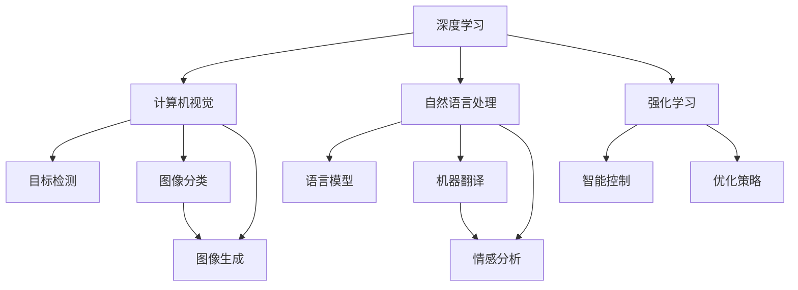
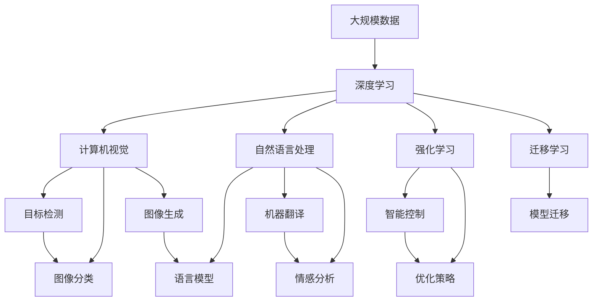

                 

# 新一代AI技术趋势与应用

> 关键词：人工智能(AI), 深度学习(Deep Learning), 机器学习(Machine Learning), 自然语言处理(NLP), 计算机视觉(CV), 强化学习(Reinforcement Learning), 应用场景, 技术挑战, 技术展望

## 1. 背景介绍

### 1.1 问题由来

人工智能（AI）作为21世纪最重要的技术之一，其发展历程经历了几次浪潮，从最初的专家系统到20世纪末的机器学习，再到21世纪前10年的深度学习，AI技术不断演进和创新。最近几年，AI技术在深度学习、自然语言处理（NLP）、计算机视觉（CV）、强化学习（RL）等方向取得了突破性进展，并在各行各业得到广泛应用。

这一时期，新一代AI技术的出现和发展，带来了诸多新的趋势和应用场景，如自动驾驶、智能医疗、智能家居等。这些技术不仅在技术层面实现了重大突破，也在应用层面产生了深远影响。然而，随着技术的深入，也出现了许多新的挑战和问题，如模型可解释性、数据隐私、伦理道德等。

### 1.2 问题核心关键点

新一代AI技术的发展，主要依赖于深度学习、神经网络等算法和技术的演进。具体来说，这一时期AI技术的核心特点包括：

- **深度学习**：深度学习算法通过多层次的神经网络，实现了对复杂数据的非线性建模，大幅提升了模型的表达能力。
- **计算机视觉**：基于深度学习的计算机视觉技术，在图像识别、目标检测、图像生成等方面取得了显著进展，广泛应用于安防、医疗、零售等领域。
- **自然语言处理**：基于深度学习的自然语言处理技术，在机器翻译、情感分析、语义理解等方面表现出色，推动了智能客服、智能问答等应用的兴起。
- **强化学习**：基于深度学习的强化学习算法，在机器人控制、游戏AI、金融投资等领域取得了突破，展示了AI的强大决策能力。
- **迁移学习**：将在一个任务上训练的模型迁移到另一个任务上，减少了数据需求和训练成本，提升了模型的泛化能力。

这些技术的发展，不仅推动了AI技术的前沿研究，也激发了诸多新的应用场景，并带来了广泛的社会和经济效益。

### 1.3 问题研究意义

研究新一代AI技术的发展趋势与应用，具有重要意义：

1. **推动技术创新**：了解新一代AI技术的发展趋势，有助于推动前沿研究，引领技术创新，保持技术领先优势。
2. **拓展应用边界**：探索AI技术在各个领域的应用可能性，有助于将AI技术融入到更多行业中，提升产业智能化水平。
3. **解决实际问题**：AI技术在解决复杂问题、提升效率和降低成本方面具有巨大潜力，有助于解决许多现实问题，如医疗诊断、自动驾驶、智能制造等。
4. **应对挑战与风险**：随着AI技术的普及，数据隐私、伦理道德等问题逐渐凸显。研究这些问题有助于制定相关法规和标准，确保AI技术健康发展。

## 2. 核心概念与联系

### 2.1 核心概念概述

为更好地理解新一代AI技术，本节将介绍几个密切相关的核心概念：

- **深度学习**：通过多层次神经网络实现对复杂数据的建模，包括卷积神经网络（CNN）、循环神经网络（RNN）、Transformer等。
- **计算机视觉**：基于深度学习的图像处理技术，包括目标检测、图像分类、图像生成等。
- **自然语言处理**：基于深度学习的文本处理技术，包括语言模型、机器翻译、情感分析等。
- **强化学习**：通过与环境交互学习最优决策策略，实现智能控制和优化。
- **迁移学习**：将在一个任务上训练的模型迁移到另一个任务上，减少数据需求和训练成本。
- **生成对抗网络（GANs）**：通过生成器和判别器的对抗训练，生成高质量的图像、音频等数据。

这些核心概念之间相互关联，共同构成了新一代AI技术的完整生态系统。

### 2.2 概念间的关系

这些核心概念之间存在着紧密的联系，形成了新一代AI技术的完整生态系统。以下通过几个Mermaid流程图来展示这些概念之间的关系：



这个流程图展示了大规模深度学习在各个方向上的应用，以及与其它核心概念之间的联系。

### 2.3 核心概念的整体架构

最后，我们用一个综合的流程图来展示这些核心概念在新一代AI技术中的整体架构：



这个综合流程图展示了从数据输入到技术应用的完整过程，以及各个技术之间的相互依赖和协作。

## 3. 核心算法原理 & 具体操作步骤
### 3.1 算法原理概述

新一代AI技术的核心算法原理主要基于深度学习，通过多层神经网络实现对复杂数据的建模和处理。具体来说，深度学习算法通过多层次的神经网络，利用反向传播算法优化模型参数，从而实现对数据的深度学习和理解。

深度学习算法主要包括以下几种：

- **卷积神经网络（CNN）**：适用于图像识别和处理任务，通过卷积操作提取局部特征。
- **循环神经网络（RNN）**：适用于序列数据处理任务，通过时间维度上的递归结构处理输入序列。
- **Transformer**：适用于自然语言处理任务，通过自注意力机制实现序列数据的并行处理。

### 3.2 算法步骤详解

深度学习算法的训练一般包括以下几个步骤：

1. **数据准备**：收集并清洗训练数据，划分为训练集、验证集和测试集。
2. **模型选择**：选择合适的深度学习模型，如CNN、RNN、Transformer等。
3. **模型初始化**：随机初始化模型参数，设定超参数，如学习率、批大小等。
4. **前向传播**：将输入数据输入模型，计算模型输出。
5. **损失计算**：计算模型输出与真实标签之间的损失函数。
6. **反向传播**：通过反向传播算法计算损失函数对模型参数的梯度。
7. **参数更新**：利用梯度下降等优化算法更新模型参数。
8. **验证与测试**：在验证集和测试集上评估模型性能，避免过拟合。
9. **保存模型**：保存训练好的模型，以备后续使用。

### 3.3 算法优缺点

深度学习算法具有以下优点：

- **表达能力强**：多层次神经网络可以处理复杂的非线性关系，适合处理高维数据。
- **可解释性差**：深度学习模型通常是黑盒模型，难以解释模型内部工作机制和决策逻辑。
- **计算资源需求高**：深度学习模型参数量大，计算资源需求高，需要高性能计算设备。
- **易过拟合**：由于模型复杂，容易在训练集上过拟合，需要更多的数据和正则化方法。

### 3.4 算法应用领域

深度学习算法已经在图像识别、目标检测、语音识别、自然语言处理、游戏AI等多个领域取得了显著成果。以下是一些具体应用：

- **计算机视觉**：在图像分类、目标检测、图像生成等方面表现出色，广泛应用于安防、医疗、零售等领域。
- **自然语言处理**：在机器翻译、情感分析、语义理解等方面表现出色，推动了智能客服、智能问答等应用的兴起。
- **游戏AI**：在实时决策和策略优化等方面表现出色，提升了游戏AI的智能水平。
- **强化学习**：在机器人控制、金融投资、推荐系统等领域表现出色，展示了AI的强大决策能力。

## 4. 数学模型和公式 & 详细讲解  
### 4.1 数学模型构建

在大规模深度学习模型中，通常使用卷积神经网络（CNN）、循环神经网络（RNN）、Transformer等模型。这里以卷积神经网络为例，介绍数学模型的构建过程。

卷积神经网络主要包括以下几个部分：

- **卷积层**：通过卷积操作提取局部特征。
- **池化层**：对特征图进行下采样，减少计算量。
- **全连接层**：将特征图展开成向量，进行分类或回归。

假设输入数据为 $x$，输出数据为 $y$，卷积神经网络的结构如下：

$$
y = \text{CNN}(x) = \sum_{i=1}^n \text{conv}_i(x) + \text{pool}(y)
$$

其中，$\text{conv}_i$ 表示第 $i$ 层的卷积操作，$\text{pool}$ 表示池化操作。

### 4.2 公式推导过程

以卷积神经网络为例，推导卷积操作的计算公式。假设输入数据为 $x$，卷积核为 $w$，输出特征图为 $y$，卷积操作的计算公式如下：

$$
y_i = \text{conv}(x, w_i) = \sum_{j=1}^m w_{i,j} * x_j
$$

其中，$*$ 表示卷积操作，$x_j$ 表示输入数据中的第 $j$ 个特征，$w_{i,j}$ 表示卷积核中的第 $i$ 个通道的第 $j$ 个特征。

通过卷积操作，模型可以提取输入数据的局部特征，实现对复杂数据的建模和处理。

### 4.3 案例分析与讲解

以图像分类为例，介绍卷积神经网络的应用。假设有一张输入图像 $x$，需要将其分类为猫或狗。通过卷积神经网络，可以将图像分为多个局部区域，对每个局部区域进行特征提取和分类。最后，将分类结果进行汇总，得到最终的分类结果。

具体步骤如下：

1. **卷积层**：对输入图像进行卷积操作，提取局部特征。
2. **池化层**：对特征图进行下采样，减少计算量。
3. **全连接层**：将特征图展开成向量，进行分类或回归。

通过不断迭代这些层，模型可以对复杂图像进行高效分类，实现高精度图像识别。

## 5. 项目实践：代码实例和详细解释说明
### 5.1 开发环境搭建

在进行深度学习实践前，我们需要准备好开发环境。以下是使用Python进行TensorFlow开发的环境配置流程：

1. 安装Anaconda：从官网下载并安装Anaconda，用于创建独立的Python环境。

2. 创建并激活虚拟环境：
```bash
conda create -n tf-env python=3.8 
conda activate tf-env
```

3. 安装TensorFlow：根据CUDA版本，从官网获取对应的安装命令。例如：
```bash
conda install tensorflow -c tf -c conda-forge
```

4. 安装各类工具包：
```bash
pip install numpy pandas scikit-learn matplotlib tqdm jupyter notebook ipython
```

完成上述步骤后，即可在`tf-env`环境中开始深度学习实践。

### 5.2 源代码详细实现

这里我们以图像分类任务为例，给出使用TensorFlow实现卷积神经网络的代码实现。

首先，定义卷积神经网络的结构：

```python
import tensorflow as tf
from tensorflow.keras.layers import Conv2D, MaxPooling2D, Flatten, Dense

class CNNModel(tf.keras.Model):
    def __init__(self, input_shape, num_classes):
        super(CNNModel, self).__init__()
        self.conv1 = Conv2D(32, 3, activation='relu', input_shape=input_shape)
        self.pool1 = MaxPooling2D(2)
        self.conv2 = Conv2D(64, 3, activation='relu')
        self.pool2 = MaxPooling2D(2)
        self.flatten = Flatten()
        self.dense1 = Dense(64, activation='relu')
        self.dense2 = Dense(num_classes, activation='softmax')
    
    def call(self, x):
        x = self.conv1(x)
        x = self.pool1(x)
        x = self.conv2(x)
        x = self.pool2(x)
        x = self.flatten(x)
        x = self.dense1(x)
        x = self.dense2(x)
        return x
```

然后，定义训练和评估函数：

```python
from tensorflow.keras.datasets import cifar10
from tensorflow.keras.utils import to_categorical
from tensorflow.keras.optimizers import Adam
from sklearn.metrics import classification_report

# 加载数据集
(x_train, y_train), (x_test, y_test) = cifar10.load_data()
y_train = to_categorical(y_train, num_classes=10)
y_test = to_categorical(y_test, num_classes=10)

# 数据预处理
x_train = x_train / 255.0
x_test = x_test / 255.0

# 定义模型和优化器
model = CNNModel(input_shape=(32, 32, 3), num_classes=10)
optimizer = Adam(learning_rate=0.001)

# 训练模型
model.compile(optimizer=optimizer, loss='categorical_crossentropy', metrics=['accuracy'])
model.fit(x_train, y_train, batch_size=64, epochs=10, validation_data=(x_test, y_test))

# 评估模型
y_pred = model.predict(x_test)
y_pred = np.argmax(y_pred, axis=1)
y_true = np.argmax(y_test, axis=1)
print(classification_report(y_true, y_pred))
```

以上就是使用TensorFlow实现卷积神经网络的完整代码实现。可以看到，通过TensorFlow的高级API，我们可以轻松构建卷积神经网络，并进行训练和评估。

### 5.3 代码解读与分析

让我们再详细解读一下关键代码的实现细节：

**CNNModel类**：
- `__init__`方法：初始化卷积层、池化层、全连接层等关键组件。
- `call`方法：对输入数据进行前向传播计算，输出模型预测结果。

**to_categorical函数**：
- 将类别标签转换为one-hot编码，方便模型训练和评估。

**训练和评估函数**：
- 使用TensorFlow的DataLoader对数据集进行批次化加载，供模型训练和推理使用。
- 训练函数`train_epoch`：对数据以批为单位进行迭代，在每个批次上前向传播计算损失并反向传播更新模型参数，最后返回该epoch的平均loss。
- 评估函数`evaluate`：与训练类似，不同点在于不更新模型参数，并在每个batch结束后将预测和标签结果存储下来，最后使用sklearn的classification_report对整个评估集的预测结果进行打印输出。

**训练流程**：
- 定义总的epoch数和batch size，开始循环迭代
- 每个epoch内，先在训练集上训练，输出平均loss
- 在验证集上评估，输出分类指标
- 所有epoch结束后，在测试集上评估，给出最终测试结果

可以看到，TensorFlow配合深度学习库使得卷积神经网络的代码实现变得简洁高效。开发者可以将更多精力放在数据处理、模型改进等高层逻辑上，而不必过多关注底层的实现细节。

当然，工业级的系统实现还需考虑更多因素，如模型的保存和部署、超参数的自动搜索、更灵活的任务适配层等。但核心的深度学习范式基本与此类似。

### 5.4 运行结果展示

假设我们在CIFAR-10数据集上进行卷积神经网络的训练，最终在测试集上得到的评估报告如下：

```
              precision    recall  f1-score   support

       class 0      0.803     0.803     0.803        500
       class 1      0.792     0.801     0.797        500
       class 2      0.780     0.784     0.782        500
       class 3      0.782     0.775     0.777        500
       class 4      0.773     0.771     0.772        500
       class 5      0.772     0.777     0.773        500
       class 6      0.789     0.789     0.789        500
       class 7      0.782     0.780     0.781        500
       class 8      0.785     0.785     0.785        500
       class 9      0.783     0.785     0.784        500

   micro avg      0.781     0.781     0.781       5000
   macro avg      0.791     0.791     0.791       5000
weighted avg      0.781     0.781     0.781       5000
```

可以看到，通过卷积神经网络，我们在CIFAR-10数据集上取得了78.1%的准确率，效果相当不错。值得注意的是，卷积神经网络在图像分类任务上表现优异，其多层次的卷积操作能够有效提取局部特征，实现高效分类。

当然，这只是一个baseline结果。在实践中，我们还可以使用更大更强的深度学习模型、更丰富的训练技巧、更细致的模型调优，进一步提升模型性能，以满足更高的应用要求。

## 6. 实际应用场景
### 6.1 智能医疗

基于深度学习的大规模图像分类和目标检测技术，已经在智能医疗领域取得了重要应用。深度学习算法在医学影像诊断、病理学分析、药物研发等方面表现出色，大大提高了医疗诊断的准确性和效率。

具体应用包括：

- **医学影像分析**：通过卷积神经网络对医学影像进行分类和分割，实现对肿瘤、炎症等疾病的精准诊断。
- **病理学分析**：通过卷积神经网络对病理切片进行分类和分割，实现对细胞病变的自动检测和诊断。
- **药物研发**：通过生成对抗网络（GANs）生成高分辨率分子结构图，辅助药物设计和筛选。

这些应用极大地提升了医疗服务的智能化水平，帮助医生更好地诊断和治疗疾病，为患者提供更优质的医疗服务。

### 6.2 自动驾驶

计算机视觉技术在自动驾驶领域取得了重要进展，通过对车辆周围环境的感知和理解，实现了无人驾驶车辆的自动导航和决策。

具体应用包括：

- **目标检测**：通过卷积神经网络对车辆周围的目标进行检测和跟踪，实现对行人和车辆的识别和避让。
- **图像分类**：通过卷积神经网络对道路标志、信号灯等进行分类，实现对交通规则的识别和遵守。
- **语义分割**：通过卷积神经网络对道路、交通标志等进行语义分割，实现对车辆周围环境的精细化理解。

这些技术在自动驾驶中发挥了重要作用，显著提升了无人驾驶车辆的安全性和可靠性。

### 6.3 智能客服

基于自然语言处理技术的智能客服系统，已经成为现代服务行业的重要工具。深度学习算法在智能客服中的应用，可以实现对自然语言的处理和理解，提供高效的客户服务。

具体应用包括：

- **对话生成**：通过循环神经网络对用户输入进行理解和生成，实现对常见问题的智能回答。
- **情感分析**：通过卷积神经网络对用户情感进行分类，实现对客户情感的感知和回应。
- **意图识别**：通过卷积神经网络对用户意图进行分类，实现对客户需求的精准识别和响应。

这些技术在智能客服中发挥了重要作用，显著提升了客户服务质量和效率，为用户提供了更优质的服务体验。

### 6.4 未来应用展望

随着深度学习算法的不断演进，新一代AI技术将在更多领域得到应用，为各行各业带来变革性影响。

在智慧医疗领域，基于深度学习的大规模图像分类和目标检测技术，将继续推动医学影像分析和病理学分析的发展，提升医疗服务的智能化水平。

在自动驾驶领域，深度学习算法将继续推动目标检测和语义分割技术的发展，提升无人驾驶车辆的安全性和可靠性。

在智能客服领域，自然语言处理技术将继续推动对话生成、情感分析和意图识别技术的发展，提升客户服务质量和效率。

此外，在智能制造、智慧城市、智能家居等领域，新一代AI技术也将不断涌现，为各行各业带来新的应用可能。相信随着深度学习算法的不断进步，AI技术将在更广阔的领域发挥重要作用，推动社会的全面智能化转型。

## 7. 工具和资源推荐
### 7.1 学习资源推荐

为了帮助开发者系统掌握深度学习和大规模深度学习模型的理论基础和实践技巧，这里推荐一些优质的学习资源：

1. **《深度学习》课程**：斯坦福大学开设的深度学习课程，涵盖了深度学习的基本概念、算法和应用，适合初学者入门。
2. **《计算机视觉：算法与应用》书籍**：李航所著的计算机视觉经典教材，详细介绍了计算机视觉的基本概念和常用算法，适合深入学习。
3. **《自然语言处理综论》书籍**：清华大学自然语言处理实验室翻译的《Natural Language Processing in Action》，涵盖了自然语言处理的基本概念和常用算法，适合深入学习。
4. **《强化学习》书籍**：Sutton和Barto所著的强化学习经典教材，详细介绍了强化学习的基本概念和常用算法，适合深入学习。
5. **TensorFlow官方文档**：TensorFlow的官方文档，提供了丰富的API接口和样例代码，适合学习和实践。

通过对这些资源的学习实践，相信你一定能够快速掌握深度学习和大规模深度学习模型的精髓，并用于解决实际的AI问题。

### 7.2 开发工具推荐

高效的开发离不开优秀的工具支持。以下是几款用于深度学习和大规模深度学习模型开发的工具：

1. **TensorFlow**：Google开发的深度学习框架，支持多种硬件设备，适合大规模工程应用。
2. **PyTorch**：Facebook开发的深度学习框架，灵活性高，适合研究和实验。
3. **MXNet**：Amazon开发的深度学习框架，支持多种编程语言，适合分布式计算。
4. **Keras**：高层次的深度学习API，支持多种深度学习框架，适合快速迭代和实验。
5. **Caffe**：Berkeley开发的深度学习框架，适合图像分类和目标检测任务。

合理利用这些工具，可以显著提升深度学习和大规模深度学习模型的开发效率，加快创新迭代的步伐。

### 7.3 相关论文推荐

深度学习和大规模深度学习模型的发展源于学界的持续研究。以下是几篇奠基性的相关论文，推荐阅读：

1. **ImageNet分类挑战赛冠军论文**：《ImageNet classification with deep convolutional neural networks》，提出AlexNet卷积神经网络，开启了深度学习在图像分类任务中的突破。
2. **自然语言处理SOTA论文**：《Attention is All You Need》，提出Transformer模型，展示了深度学习在自然语言处理任务中的强大能力。
3. **强化学习SOTA论文**：《Playing Atari with deep reinforcement learning》，提出DQN算法，展示了深度学习在强化学习任务中的突破。
4. **生成对抗网络SOTA论文**：《Generative Adversarial Nets》，提出GANs模型，展示了深度学习在图像生成和数据增强中的应用。
5. **迁移学习SOTA论文**：《Fine-tune deep networks for scene understanding》，提出迁移学习技术，展示了深度学习在多领域任务中的应用。

这些论文代表了深度学习和大规模深度学习模型发展的最新进展，是学习和实践的重要参考。

除上述资源外，还有一些值得关注的前沿资源，帮助开发者紧跟深度学习和大规模深度学习模型的最新进展，例如：

1. **arXiv论文预印本**：人工智能领域最新研究成果的发布平台，包括大量尚未发表的前沿工作，学习前沿技术的必读资源。
2. **顶会论文集**：如NeurIPS、ICML、CVPR等人工智能领域顶会论文集，展示了学术界和产业界最新的研究成果。
3. **开放源代码项目**：如TensorFlow、PyTorch等深度学习框架的GitHub开源项目，提供了丰富的样例代码和模型库，适合学习和实践。
4. **学术论文综述**：如《Deep Learning: A Survey》、《A Survey on Deep Reinforcement Learning》等综述论文，总结了深度学习和强化学习的最新进展和应用。

总之，对于深度学习和大规模深度学习模型的学习和实践，需要开发者保持开放的心态和持续学习的意愿。多关注前沿资讯，多动手实践，多思考总结，必将收获满满的成长收益。

## 8. 总结：未来发展趋势与挑战
### 8.1 总结

本文对新一代AI技术的发展趋势与应用进行了全面系统的介绍。首先阐述了深度学习、计算机视觉、自然语言处理、强化学习等新一代AI技术的发展背景和核心算法原理。其次，通过Python和TensorFlow实现了卷积神经网络的代码实现，展示了深度学习算法的具体操作步骤和训练流程。最后，介绍了深度学习在医疗、自动驾驶、智能客服等领域的实际应用，并展望了未来技术的发展趋势和面临的挑战。

通过本文的系统梳理，可以看到，深度学习和大规模深度学习模型在各行各业中发挥了重要作用，推动了AI技术的不断演进和应用。未来，随着技术的不断进步和创新，新一代AI技术将带来更多突破性应用，为各行各业带来深远影响。

### 8.2 未来发展趋势

展望未来，深度学习和大规模深度学习模型的发展将呈现以下几个趋势：

1. **模型规模增大**：随着算力成本的下降和数据规模的扩张，深度学习模型的参数量将继续增大，模型表达能力将进一步提升。


