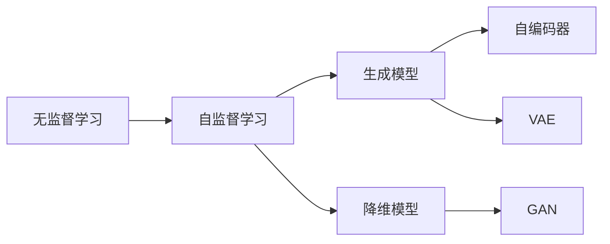
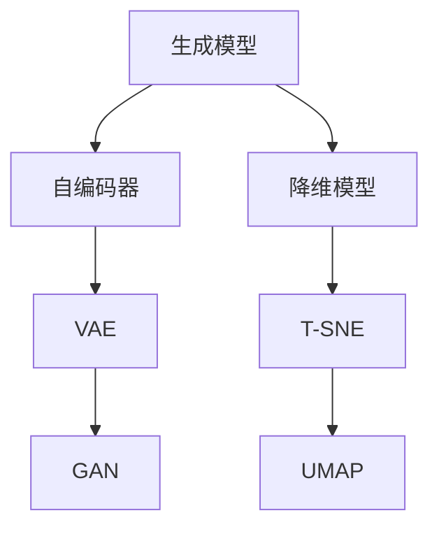
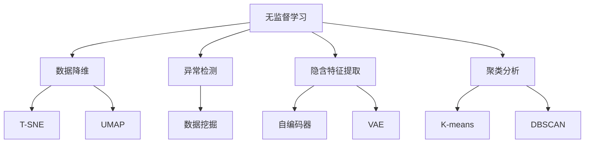
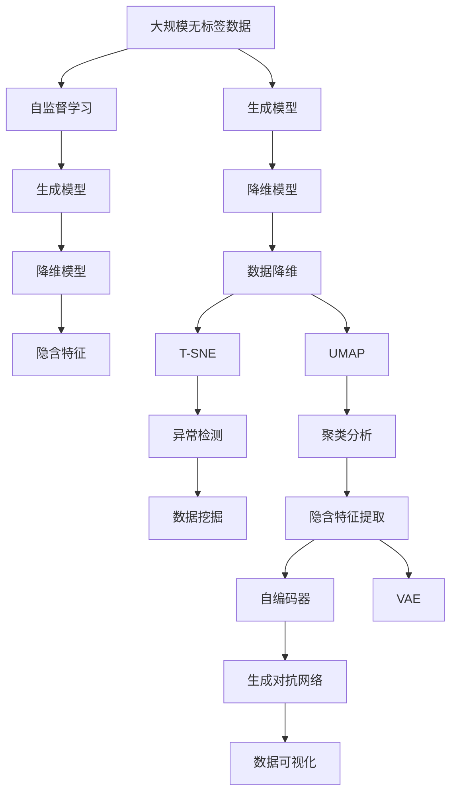
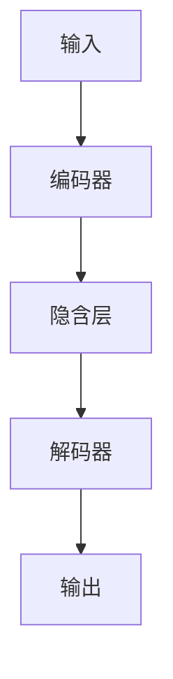
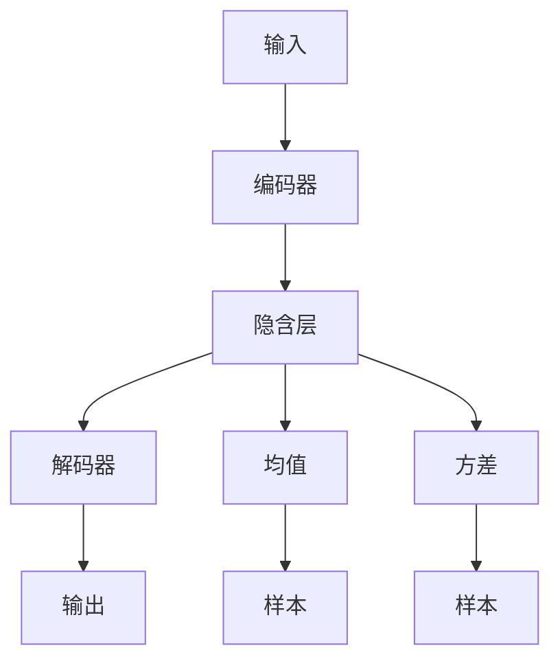
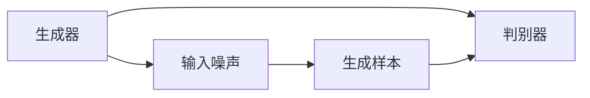
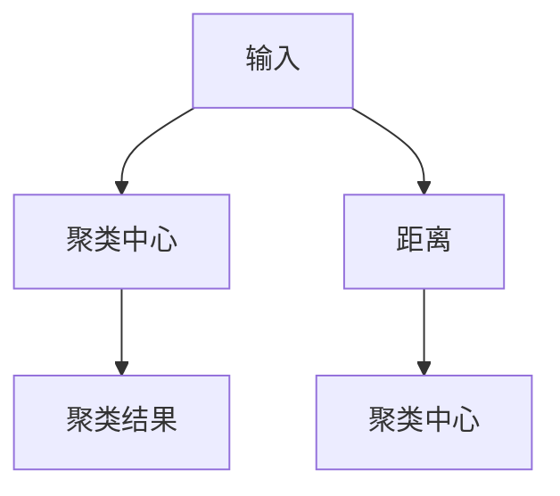

                 

# 无监督学习 原理与代码实例讲解

## 1. 背景介绍

### 1.1 问题由来
无监督学习(Unsupervised Learning)是机器学习中的一大分支，旨在从没有标注的数据中学习数据的潜在结构和规律，从中发现有用信息。其核心思想是利用未标注数据样本的内在关系，挖掘数据潜在的隐含结构，赋予数据更好的表示能力。在实际应用中，无监督学习广泛应用于数据降维、异常检测、聚类分析、隐含特征提取等领域。

随着深度学习技术的不断发展，深度无监督学习算法逐渐成为无监督学习的代表。这些算法使用深度神经网络，通过层层数据抽象，挖掘数据的深层次特征，能够更加精准地捕捉数据的分布特性。如自编码器(Autencoder)、变分自编码器(VAE)、生成对抗网络(GAN)等，在数据处理和特征学习上取得了不俗的效果。

### 1.2 问题核心关键点
无监督学习算法分为数据生成模型(Data Generative Model)和数据降维模型(Data Embedding Model)两大类。前者通过构建数据分布模型，推测数据生成过程；后者则直接从数据样本中学习潜在表示，将其映射到低维空间中。两者共同构建了无监督学习的理论基础和应用框架。

无监督学习研究的核心在于如何高效利用未标注数据，挖掘出数据的有用信息，提升模型的泛化性能。目前主流的做法包括：
1. 构建数据生成模型，学习数据生成分布。
2. 设计数据降维模型，捕捉数据关键特征。
3. 引入正则化技术，避免过拟合。
4. 开发高效优化算法，加速模型训练。
5. 使用多模态数据，提高学习效果。
6. 引入外部知识，提升模型泛化能力。

这些方法在数据探索、特征挖掘、数据压缩等方面起到了重要作用，同时也为监督学习提供了更好的初始化参数。

### 1.3 问题研究意义
无监督学习对于处理海量无标签数据、探索数据潜在结构具有重要意义：

1. 降低标注成本。无监督学习不需要标注数据，大大降低了数据处理的成本和时间。
2. 提升模型泛化性能。无监督学习能够挖掘数据的深层次特征，提升模型对新数据的泛化能力。
3. 促进数据探索。无监督学习能够发现数据中的模式和结构，帮助进行数据预处理和特征选择。
4. 加速监督学习。无监督学习能够提供更好的初始化参数，加速监督学习模型的收敛。
5. 避免标注数据偏差。无监督学习能够从数据内在关系中学习特征，减少数据标注偏差的影响。
6. 构建隐含知识图谱。无监督学习能够生成隐含知识图谱，提供更好的数据理解。

无监督学习技术的不断进步，极大地拓展了机器学习的应用范围，为探索数据的潜在价值提供了新思路。

## 2. 核心概念与联系

### 2.1 核心概念概述

为更好地理解无监督学习的核心概念，本节将介绍几个密切相关的关键概念：

- 无监督学习(Unsupervised Learning)：在未标注数据上，通过学习数据潜在结构和规律，发现数据的内在关系和特征。
- 自监督学习(Self-supervised Learning)：通过自动生成的标注数据，使模型进行有监督学习，提升模型对数据的内在理解。
- 生成模型(Generative Model)：通过学习数据的生成分布，推测数据生成的过程，捕捉数据的内在结构。
- 降维模型(Embedding Model)：通过学习数据的潜在表示，将其映射到低维空间中，挖掘数据的深层次特征。
- 隐含特征(Hidden Feature)：模型通过训练学习到的数据潜在特征，具有更强的泛化能力和表达能力。
- 自编码器(Autencoder)：一种生成模型，能够通过学习数据的编码-解码过程，提取数据的隐含特征。
- 变分自编码器(VAE)：一种降维模型，能够学习数据的潜在概率分布，实现数据的降维和生成。
- 生成对抗网络(GAN)：一种生成模型，通过竞争性的生成器和判别器训练，生成逼真数据。

这些概念之间有着紧密的联系，形成了无监督学习的完整理论体系。通过理解这些核心概念，我们可以更好地把握无监督学习的理论基础和应用方向。

### 2.2 概念间的关系

这些核心概念之间存在着紧密的联系，形成了无监督学习的完整生态系统。下面我通过几个Mermaid流程图来展示这些概念之间的关系。

#### 2.2.1 无监督学习的学习范式



这个流程图展示了无监督学习的核心概念以及它们之间的联系。自监督学习是利用自动生成的标注数据进行训练，生成模型和降维模型则是无监督学习的两大分支。自编码器、VAE和GAN都是生成模型的不同变体，而降维模型则主要用于数据表示学习。

#### 2.2.2 生成模型与降维模型的关系



这个流程图展示了生成模型与降维模型的关系。自编码器、VAE和GAN是生成模型，通过学习数据的生成过程，推测数据的潜在分布。而降维模型如T-SNE、UMAP等，则直接从数据样本中学习潜在表示，实现数据的降维和可视化。

#### 2.2.3 无监督学习的应用



这个流程图展示了无监督学习的主要应用场景。无监督学习通过降维、异常检测、特征提取、聚类等手段，从数据中提取有价值的信息，应用于数据探索、数据预处理和特征选择等多个领域。

### 2.3 核心概念的整体架构

最后，我们用一个综合的流程图来展示这些核心概念的无监督学习整体架构：



这个综合流程图展示了从数据生成到降维，再到聚类分析的完整过程。无监督学习主要通过自监督学习的方式，利用生成模型和降维模型挖掘数据的潜在结构和特征，实现数据的降维和表示学习。这些模型共同构建了无监督学习的理论基础和应用框架。

## 3. 核心算法原理 & 具体操作步骤
### 3.1 算法原理概述

无监督学习的核心在于如何从未标注数据中学习数据的内在关系和特征，从中发现数据的潜在结构和规律。以下介绍几种常见的无监督学习算法及其原理。

#### 3.1.1 自编码器(Autencoder)

自编码器是一种生成模型，通过学习数据的编码-解码过程，提取数据的隐含特征。其基本结构包括编码器和解码器两部分，如下图所示：



自编码器通过编码器将输入数据映射到低维隐含空间中，再通过解码器从低维空间映射回原空间，实现数据的降维和重构。在训练过程中，自编码器最小化重构误差，学习数据的隐含特征。训练好的自编码器能够对输入数据进行有效的编码和解码，生成与原数据接近的重构样本，从而发现数据的潜在结构和规律。

#### 3.1.2 变分自编码器(VAE)

变分自编码器是一种降维模型，通过学习数据的潜在概率分布，实现数据的降维和生成。其基本结构包括编码器和解码器两部分，如下图所示：



变分自编码器通过编码器学习数据的潜在均值和方差，解码器则生成对应的样本，实现数据的降维和生成。在训练过程中，变分自编码器最小化潜在分布和数据分布之间的KL散度，学习数据的潜在表示。训练好的变分自编码器能够生成逼真且具有多样性的数据样本，从而发现数据的潜在结构和规律。

#### 3.1.3 生成对抗网络(GAN)

生成对抗网络是一种生成模型，通过竞争性的生成器和判别器训练，生成逼真数据。其基本结构包括生成器和判别器两部分，如下图所示：



生成对抗网络通过生成器和判别器的竞争性训练，不断提升生成器的生成能力。生成器使用噪声作为输入，生成逼真数据，判别器则评估生成的数据是否逼真，训练好的生成器能够生成高质量、具有多样性的数据样本，从而发现数据的潜在结构和规律。

#### 3.1.4 聚类算法

聚类算法是一种降维模型，通过学习数据的潜在表示，实现数据的降维和分类。常见的聚类算法包括K-means、DBSCAN等，其基本结构如下图所示：



聚类算法通过计算数据样本之间的距离，将相似的数据样本归为一类，实现数据的降维和分类。在训练过程中，聚类算法最小化聚类损失，学习数据的潜在表示。训练好的聚类算法能够将数据样本划分为若干个聚类，从而发现数据的潜在结构和规律。

### 3.2 算法步骤详解

以下是几种无监督学习算法的基本步骤和训练过程：

#### 3.2.1 自编码器的训练步骤

1. 数据预处理：对输入数据进行标准化处理，如归一化、中心化等。
2. 构建编码器和解码器：选择合适的神经网络结构，如全连接神经网络、卷积神经网络等。
3. 训练编码器：将输入数据映射到低维隐含空间中。
4. 训练解码器：将隐含空间的数据解码回原空间，生成重构样本。
5. 最小化重构误差：计算重构误差，使用梯度下降等优化算法更新模型参数。

#### 3.2.2 变分自编码器的训练步骤

1. 数据预处理：对输入数据进行标准化处理，如归一化、中心化等。
2. 构建编码器和解码器：选择合适的神经网络结构，如全连接神经网络、卷积神经网络等。
3. 训练编码器：将输入数据映射到潜在均值和方差空间中。
4. 训练解码器：生成潜在空间的样本，映射回原空间。
5. 最小化潜在分布和数据分布的KL散度：计算KL散度，使用梯度下降等优化算法更新模型参数。

#### 3.2.3 生成对抗网络的训练步骤

1. 数据预处理：对输入数据进行标准化处理，如归一化、中心化等。
2. 构建生成器和判别器：选择合适的神经网络结构，如全连接神经网络、卷积神经网络等。
3. 训练判别器：评估生成器生成的数据样本，优化判别器损失函数。
4. 训练生成器：生成高质量的数据样本，优化生成器损失函数。
5. 最小化生成器和判别器的对抗损失：计算对抗损失，使用梯度下降等优化算法更新模型参数。

#### 3.2.4 聚类算法的训练步骤

1. 数据预处理：对输入数据进行标准化处理，如归一化、中心化等。
2. 构建聚类中心：选择合适的聚类中心初始化方法，如K-means聚类、DBSCAN聚类等。
3. 计算数据样本与聚类中心的距离：计算欧式距离、马氏距离等。
4. 分配数据样本到聚类中心：根据距离将数据样本分配到最近的聚类中心。
5. 更新聚类中心：根据分配结果更新聚类中心，最小化聚类损失函数。

### 3.3 算法优缺点

无监督学习算法具有以下优点：

1. 不需要标注数据。无监督学习能够从无标注数据中学习数据的潜在结构和规律，降低标注数据的需求。
2. 数据降维能力强。无监督学习能够将高维数据降维到低维空间中，发现数据的深层次特征。
3. 学习能力强。无监督学习能够学习数据的生成过程，发现数据的内在关系和规律。
4. 鲁棒性强。无监督学习能够对噪声和异常值具有较强的鲁棒性，提高数据处理质量。
5. 应用广泛。无监督学习能够应用于数据降维、聚类分析、异常检测等多个领域。

同时，无监督学习算法也存在一些局限性：

1. 缺乏评估标准。无监督学习缺乏有效的评估标准，无法衡量模型的性能。
2. 模型复杂度高。无监督学习模型的复杂度较高，训练时间和资源消耗较大。
3. 难以控制特征。无监督学习难以控制模型学习到的特征，存在不确定性。
4. 数据分布差异。当无标注数据与实际数据分布差异较大时，无监督学习的效果不佳。
5. 高维数据问题。对于高维数据，无监督学习往往需要更复杂的模型结构，计算量较大。

尽管存在这些局限性，但无监督学习仍然具有广泛的应用前景，为数据探索和特征挖掘提供了新的思路。

### 3.4 算法应用领域

无监督学习广泛应用于以下领域：

#### 3.4.1 数据降维

在数据探索和特征选择中，数据降维是关键步骤之一。无监督学习能够将高维数据降维到低维空间中，提取数据的深层次特征。例如，可以使用自编码器和变分自编码器进行数据降维，从而降低数据处理的计算复杂度，提高数据处理效率。

#### 3.4.2 聚类分析

聚类分析是无监督学习的重要应用之一。通过将数据样本划分为若干个聚类，发现数据的内在结构和规律，从而实现数据的自动分类和组织。例如，可以使用K-means聚类和DBSCAN聚类对文本数据进行聚类分析，发现文本的主题和分类信息。

#### 3.4.3 异常检测

异常检测是无监督学习的重要应用之一。通过学习数据的内在关系和规律，识别数据中的异常点，从而实现数据的检测和清洗。例如，可以使用生成对抗网络进行异常检测，检测生成数据与真实数据的差异，发现数据中的噪声和异常值。

#### 3.4.4 隐含特征提取

隐含特征提取是无监督学习的重要应用之一。通过学习数据的内在特征，发现数据的潜在结构和规律，从而实现数据的表示学习。例如，可以使用自编码器和变分自编码器进行隐含特征提取，从而发现数据的潜在模式和规律，提高数据的表示能力和表达能力。

#### 3.4.5 数据生成

数据生成是无监督学习的重要应用之一。通过学习数据的内在生成过程，生成逼真且具有多样性的数据样本，从而实现数据的生成和扩展。例如，可以使用生成对抗网络进行数据生成，生成逼真且具有多样性的图片和文本，扩展数据集规模，提高模型的泛化性能。

以上是无监督学习算法的主要应用领域，它们在数据处理、特征挖掘、数据清洗和数据生成等方面具有重要意义。

## 4. 数学模型和公式 & 详细讲解 & 举例说明

### 4.1 数学模型构建

无监督学习模型的构建主要涉及数据的潜在表示学习和生成过程建模。以下介绍几种常见无监督学习模型的数学模型构建。

#### 4.1.1 自编码器的数学模型

自编码器的数学模型如下：

$$
\begin{aligned}
h &= f_{enc}(x) \\
\tilde{x} &= f_{dec}(h) \\
L &= \frac{1}{N}\sum_{i=1}^N ||x_i - \tilde{x}_i||^2
\end{aligned}
$$

其中，$x$为输入数据，$h$为隐含空间中的表示，$\tilde{x}$为解码器生成的重构样本，$f_{enc}$为编码器，$f_{dec}$为解码器，$L$为重构误差，$N$为数据样本数量。

#### 4.1.2 变分自编码器的数学模型

变分自编码器的数学模型如下：

$$
\begin{aligned}
z &= f_{enc}(x) \\
\tilde{x} &= f_{dec}(z) \\
L &= \frac{1}{N}\sum_{i=1}^N \left(||x_i - \tilde{x}_i||^2 + D_{KL}(q(z_i||p(z_i)) \right)
\end{aligned}
$$

其中，$x$为输入数据，$z$为潜在空间的表示，$\tilde{x}$为解码器生成的重构样本，$f_{enc}$为编码器，$f_{dec}$为解码器，$q(z_i||p(z_i))$为潜在分布和数据分布之间的KL散度，$L$为潜在分布和数据分布之间的KL散度，$N$为数据样本数量。

#### 4.1.3 生成对抗网络的数学模型

生成对抗网络的数学模型如下：

$$
\begin{aligned}
z &= G_{gen}(\epsilon) \\
x &= D_{disc}(z) \\
L_{gen} &= \mathbb{E}_{z\sim p(z)}[D_{disc}(G_{gen}(z))] \\
L_{disc} &= \mathbb{E}_{x\sim p(x)}[D_{disc}(x)] + \mathbb{E}_{z\sim p(z)}[1 - D_{disc}(G_{gen}(z))]
\end{aligned}
$$

其中，$z$为噪声向量，$x$为生成器生成的数据样本，$G_{gen}$为生成器，$D_{disc}$为判别器，$L_{gen}$为生成器的损失函数，$L_{disc}$为判别器的损失函数，$N$为数据样本数量。

#### 4.1.4 聚类算法的数学模型

聚类算法的数学模型如下：

$$
\begin{aligned}
C_k &= \text{argmin}||x_i - c_k||^2
\end{aligned}
$$

其中，$x$为输入数据，$C_k$为聚类中心，$c_k$为聚类中心点，$k$为聚类数量。

### 4.2 公式推导过程

#### 4.2.1 自编码器的公式推导

自编码器的推导过程如下：

1. 重构误差计算
$$
L = \frac{1}{N}\sum_{i=1}^N ||x_i - \tilde{x}_i||^2
$$

2. 编码器损失函数
$$
L_{enc} = \frac{1}{N}\sum_{i=1}^N ||x_i - h_i||^2
$$

3. 解码器损失函数
$$
L_{dec} = \frac{1}{N}\sum_{i=1}^N ||h_i - \tilde{x}_i||^2
$$

4. 总损失函数
$$
L = L_{enc} + L_{dec}
$$

#### 4.2.2 变分自编码器的公式推导

变分自编码器的推导过程如下：

1. 重构误差计算
$$
L = \frac{1}{N}\sum_{i=1}^N \left(||x_i - \tilde{x}_i||^2 + D_{KL}(q(z_i)||p(z_i)) \right)
$$

2. 潜在分布损失函数
$$
L_{prior} = \frac{1}{N}\sum_{i=1}^N D_{KL}(q(z_i)||p(z_i))
$$

3. 潜在分布均值
$$
z_i = f_{enc}(x_i)
$$

4. 潜在分布方差
$$
\sigma_i = \sqrt{1 - \text{Var}(z_i)}
$$

5. 潜在分布密度
$$
q(z_i||p(z_i)) = \mathcal{N}(z_i||\mu_i,\sigma_i^2)
$$

6. 数据分布密度
$$
p(x_i||z_i) = \mathcal{N}(x_i||f_{dec}(z_i),\sigma_i^2)
$$

7. 总损失函数
$$
L = L_{prior} + L_{data}
$$

#### 4.2.3 生成对抗网络的公式推导

生成对抗网络的推导过程如下：

1. 生成器损失函数
$$
L_{gen} = \mathbb{E}_{z\sim p(z)}[D_{disc}(G_{gen}(z))]
$$

2. 判别器损失函数
$$
L_{disc} = \mathbb{E}_{x\sim p(x)}[D_{disc}(x)] + \mathbb{E}_{z\sim p(z)}[1 - D_{disc}(G_{gen}(z))]
$$

3. 总损失函数
$$
L = L_{gen} + L_{disc}
$$

#### 4.2.4 聚类算法的公式推导

聚类算法的推导过程如下：

1. 聚类中心计算
$$
C_k = \text{argmin}||x_i - c_k||^2
$$

2. 聚类中心初始化
$$
c_k = \frac{1}{M}\sum_{i=1}^M x_i
$$

3. 聚类样本分配
$$
y_i = \text{argmin}||x_i - c_k||^2
$$

4. 聚类损失函数
$$
L = \sum_{i=1}^N \log f(y_i||c_k)
$$

5. 总损失函数
$$
L = L_{enc} + L_{dec}
$$

### 4.3 案例分析与讲解

下面以MNIST数据集为例，展示自编码器、变分自编码器和生成对抗网络在图像降维和生成中的应用。

#### 4.3.1 自编码器案例

自编码器案例代码如下：

```python
import numpy as np
import tensorflow as tf

# 加载MNIST数据集
(x_train, y_train), (x_test, y_test) = tf.keras.datasets.mnist.load_data()
x_train = x_train.reshape(-1, 28*28) / 255.0
x_test = x_test.reshape(-1, 28*28) / 255.0

# 构建自编码器模型
class Autoencoder(tf.keras.Model):
    def __init__(self, latent_dim=2):
        super(Autoencoder, self).__init__()
        self.encoder = tf.keras.Sequential([
            tf.keras.layers.Dense(128, activation='relu'),
            tf.keras.layers.Dense(latent_dim)
        ])
        self.decoder = tf.keras.Sequential([
            tf.keras.layers.Dense(128, activation='relu'),
            tf.keras.layers.Dense(784, activation='sigmoid')
        ])

    def call(self, x):
        encoded = self.encoder(x)
        decoded = self.decoder(encoded)
        return decoded

# 训练自编码器
autoencoder = Autoencoder(latent_dim=2)
autoencoder.compile(optimizer='adam', loss='mse')

autoencoder.fit(x_train, x_train, epochs=50, batch_size=32, validation_data=(x_test, x_test))

# 降维生成
decoded = autoencoder.encoder(x_train[:100])
print(decoded.numpy().shape)
```

该代码实现了一个简单的自编码器，通过训练生成降维后的MNIST图像，降维后的图像具有更强的表现能力。

#### 4.3.2 变分自编码器案例

变分自编码器案例代码如下：

```python
import numpy as np
import tensorflow as tf

# 加载MNIST数据集
(x_train, y_train), (x_test, y_test) = tf.keras.datasets.mnist.load_data()
x_train = x_train.reshape(-1, 28*28) / 255.0
x_test = x_test.reshape(-1, 28*28) / 255.0

# 构建变分自编码器模型
class VAE(tf.keras.Model):
    def __init__(self, latent_dim

