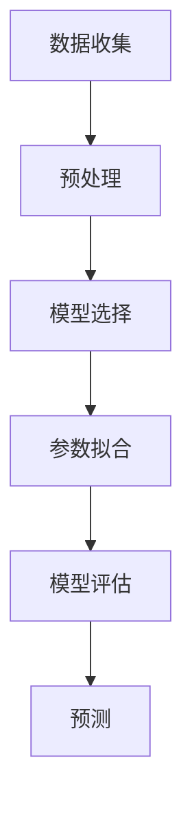
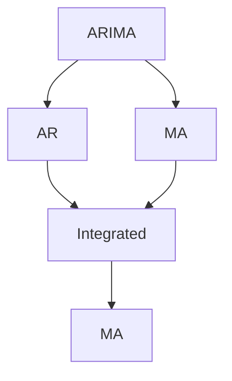
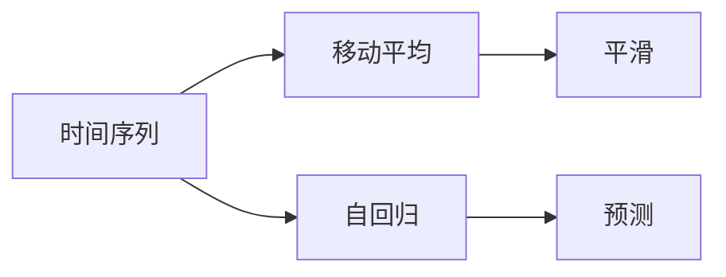
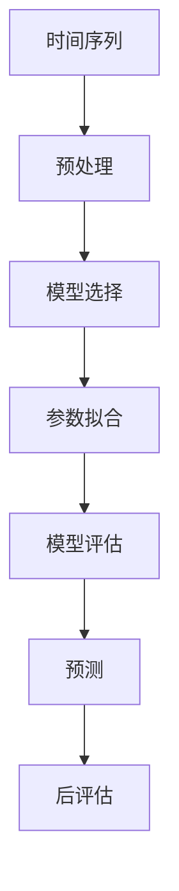

                 

# 时间序列分析(Time Series Analysis) - 原理与代码实例讲解

> 关键词：时间序列,ARIMA,移动平均,自回归,时间延迟,回归分析

## 1. 背景介绍

### 1.1 问题由来
时间序列分析（Time Series Analysis）是处理随时间变化的数据序列的一种统计方法。它广泛应用于金融、经济、气象、交通等领域，旨在通过历史数据预测未来的趋势和变化。例如，预测股票价格、分析气候变化、监控交通流量等，均离不开时间序列分析的支持。

近年来，随着深度学习技术的发展，时间序列分析的研究也得到了新的突破。基于深度学习的时间序列分析方法，如LSTM、GRU、Transformer等，已经在多个实际场景中取得了显著的效果，成为分析预测领域的重要工具。

### 1.2 问题核心关键点
时间序列分析的核心在于如何从历史数据中学习到时间序列的规律，并利用这些规律进行预测。常用的时间序列分析方法包括自回归模型（AR）、移动平均模型（MA）、自回归移动平均模型（ARMA）、自回归积分滑动平均模型（ARIMA）等。这些方法在统计学和机器学习领域都有深厚的理论基础，能够很好地处理线性和非线性时间序列。

时间序列分析的关键在于选择合适的模型和参数，使得模型能够逼近真实的时间序列分布，从而获得较好的预测效果。常见的模型选择包括：
- 确定性模型：如移动平均模型、指数平滑等，适用于线性或平稳的时间序列。
- 随机模型：如AR、ARMA、ARIMA等，适用于非线性或非平稳的时间序列。

在模型选择的基础上，还需要确定模型的参数，以便精确地拟合数据。参数的确定通常涉及优化问题，需要最小化预测误差，如均方误差（MSE）等。

### 1.3 问题研究意义
时间序列分析在实际应用中的重要性不言而喻，它能够帮助我们理解时间序列的演化规律，预测未来的变化趋势，从而做出科学合理的决策。例如，在金融领域，通过对股票价格的历史数据进行分析，可以预测未来的价格变化，帮助投资者制定交易策略；在气象领域，通过对气温、降雨量等时间序列的分析，可以预测未来的天气变化，指导农业生产。

时间序列分析不仅能提供定量化的预测结果，还能帮助我们理解时间序列的背后机制，识别关键影响因素，进一步优化决策过程。例如，在交通运输领域，通过对交通流量的分析，可以预测未来的流量变化，优化交通管理措施，提高交通效率。

总之，时间序列分析不仅是一种数据处理方法，更是连接过去与未来的桥梁，帮助我们从历史数据中学习规律，预测未来趋势，推动科学决策的实施。

## 2. 核心概念与联系

### 2.1 核心概念概述

为更好地理解时间序列分析的核心概念和原理，本节将介绍几个密切相关的核心概念：

- 时间序列（Time Series）：指随时间变化的一系列观测数据，通常由时间戳和相应的观测值构成。
- ARIMA模型（AutoRegressive Integrated Moving Average）：一种常用的时间序列分析模型，通过自回归、积分和移动平均来拟合时间序列。
- 移动平均（Moving Average）：通过计算时间序列的移动平均数，平滑时间序列的波动。
- 自回归（Autoregressive）：通过当前值和历史值的线性组合来预测未来值。
- 自回归积分（Autoregressive Integral）：在自回归的基础上，对时间序列进行差分处理，以去除趋势和季节性。
- 自回归移动平均（Autoregressive Moving Average）：结合自回归和移动平均，对时间序列进行建模。
- 自回归积分滑动平均（Autoregressive Integrated Moving Average）：在ARMA的基础上，进一步对时间序列进行差分处理。

这些核心概念之间的逻辑关系可以通过以下Mermaid流程图来展示：


这个流程图展示了时间序列分析的主要模型及其组成要素。时间序列由历史数据构成，通过ARIMA模型进行建模，其中移动平均和自回归是其核心组成部分，用于描述时间序列的短期和长期行为。自回归积分用于去除时间序列的趋势和季节性，进一步提升模型的预测精度。自回归积分滑动平均模型是时间序列分析中最常用的模型，能够处理各种复杂的时间序列。

### 2.2 概念间的关系

这些核心概念之间存在着紧密的联系，形成了时间序列分析的完整框架。下面我们通过几个Mermaid流程图来展示这些概念之间的关系。

#### 2.2.1 时间序列的建模流程



这个流程图展示了时间序列建模的整个过程。数据收集和预处理是时间序列分析的基础，模型选择和参数拟合是模型的核心部分，模型评估和预测是模型的应用环节。

#### 2.2.2 ARIMA模型的构建



这个流程图展示了ARIMA模型的构建过程。ARIMA模型由AR、MA和积分三部分构成，其中AR和MA是核心部分，用于描述时间序列的短期和长期行为，积分用于去除时间序列的趋势和季节性。

#### 2.2.3 移动平均和自回归的应用



这个流程图展示了移动平均和自回归的应用。移动平均用于平滑时间序列的波动，自回归用于预测时间序列的未来值。

### 2.3 核心概念的整体架构

最后，我们用一个综合的流程图来展示这些核心概念的时间序列分析的整体架构：



这个综合流程图展示了时间序列分析从数据处理到模型评估的全过程。时间序列由数据收集和预处理构成，经过模型选择和参数拟合，得到时间序列模型，通过模型评估进行验证，最后进行预测和后评估，以确保预测结果的准确性。

## 3. 核心算法原理 & 具体操作步骤

### 3.1 算法原理概述

时间序列分析的核心算法是ARIMA模型，它通过自回归、积分和移动平均来拟合时间序列。ARIMA模型的数学表达式为：

$$
y_t = \sum_{i=1}^{p} \alpha_i y_{t-i} + \epsilon_t + \sum_{j=1}^{q} \beta_j \epsilon_{t-j}
$$

其中，$y_t$表示时间$t$的观测值，$\alpha_i$和$\beta_j$是模型的系数，$\epsilon_t$是误差项。ARIMA模型通过对时间序列进行差分，去除趋势和季节性，进而更好地进行建模和预测。

ARIMA模型的具体形式为：

$$
ARIMA(p,d,q) = AR(p) + I(d) + MA(q)
$$

其中，$p$是自回归项数，$q$是移动平均项数，$d$是差分阶数。ARIMA模型适用于各种类型的时间序列，包括线性、非线性、平稳、非平稳等。

### 3.2 算法步骤详解

ARIMA模型的训练和预测过程包括以下关键步骤：

**Step 1: 数据预处理**

- 收集时间序列数据，包括历史观测值。
- 检查数据是否平稳，如果不平稳，进行差分处理。
- 填充缺失值，处理异常值，确保数据质量。

**Step 2: 模型选择**

- 根据时间序列的特点，选择合适的模型形式，如ARIMA(1,1,1)、ARIMA(2,1,2)等。
- 确定模型的参数$p$、$q$和$d$，通常通过网格搜索或优化算法自动确定。

**Step 3: 模型拟合**

- 使用最大似然估计或最小化均方误差的方法，拟合ARIMA模型。
- 使用梯度下降、最小二乘等优化算法，求解模型参数。
- 使用交叉验证等方法，评估模型拟合效果。

**Step 4: 模型预测**

- 使用拟合好的ARIMA模型，对未来的观测值进行预测。
- 使用滚动预测或滑动窗口等方法，提高预测的准确性。
- 评估预测结果的误差，进行后评估。

**Step 5: 结果解释与优化**

- 解释模型预测结果，评估模型的泛化能力。
- 根据预测误差，调整模型参数，优化模型性能。
- 结合领域知识，进一步改进模型，提升预测效果。

### 3.3 算法优缺点

ARIMA模型的优点在于：
- 适用性广：适用于各种类型的时间序列，包括线性、非线性、平稳、非平稳等。
- 简单易懂：模型形式简单，参数数量少，易于理解和实现。
- 预测准确：在许多实际场景中，ARIMA模型的预测效果优于其他时间序列模型。

ARIMA模型的缺点在于：
- 对参数敏感：模型的性能很大程度上取决于参数的选择，需要仔细调参。
- 假设较多：ARIMA模型假设时间序列是平稳的、线性相关的，实际应用中这些假设可能不成立。
- 难以处理复杂数据：对于存在噪声、趋势、季节性等复杂数据，ARIMA模型的表现可能不如其他深度学习模型。

### 3.4 算法应用领域

ARIMA模型已经在金融、经济、气象、交通等领域得到了广泛应用，具体包括：

- 股票价格预测：通过对股票价格的历史数据进行分析，预测未来的价格变化。
- 气象预测：通过气象数据的分析，预测未来的天气变化，指导农业生产。
- 交通流量预测：通过对交通数据的分析，预测未来的交通流量变化，优化交通管理措施。
- 能源需求预测：通过对能源需求的历史数据进行分析，预测未来的需求变化，优化能源分配。
- 销售预测：通过对销售数据的分析，预测未来的销售趋势，制定销售策略。

除了上述这些领域外，ARIMA模型还在物流管理、电力负荷预测、质量控制等领域得到了应用。随着ARIMA模型的不断发展和优化，其应用范围还将进一步扩大。

## 4. 数学模型和公式 & 详细讲解 & 举例说明

### 4.1 数学模型构建

ARIMA模型的数学表达式为：

$$
y_t = \sum_{i=1}^{p} \alpha_i y_{t-i} + \epsilon_t + \sum_{j=1}^{q} \beta_j \epsilon_{t-j}
$$

其中，$y_t$表示时间$t$的观测值，$\alpha_i$和$\beta_j$是模型的系数，$\epsilon_t$是误差项。ARIMA模型的具体形式为：

$$
ARIMA(p,d,q) = AR(p) + I(d) + MA(q)
$$

其中，$p$是自回归项数，$q$是移动平均项数，$d$是差分阶数。ARIMA模型适用于各种类型的时间序列，包括线性、非线性、平稳、非平稳等。

### 4.2 公式推导过程

以ARIMA(1,1,1)为例，其数学表达式为：

$$
y_t = \alpha_1 y_{t-1} + \beta_1 \epsilon_{t-1} + \epsilon_t
$$

其中，$y_t$表示时间$t$的观测值，$y_{t-1}$表示时间$t-1$的观测值，$\epsilon_t$和$\epsilon_{t-1}$是误差项。

通过求解自回归和移动平均的系数，可以拟合ARIMA模型。通常使用最大似然估计或最小化均方误差的方法，求解模型参数。

### 4.3 案例分析与讲解

假设我们有一组月度销售额数据，数据如下：

| 时间 | 销售额 |
| ---- | ------ |
| 1月  | 100    |
| 2月  | 110    |
| 3月  | 120    |
| 4月  | 130    |
| 5月  | 135    |
| 6月  | 140    |
| 7月  | 145    |
| 8月  | 150    |
| 9月  | 160    |
| 10月 | 165    |
| 11月 | 170    |
| 12月 | 175    |

对这组数据进行预处理，首先检查是否平稳，发现数据呈上升趋势，需要进行差分处理。对数据进行一次差分，得到新的数据：

| 时间 | 差分后销售额 |
| ---- | ------------ |
| 1月  | 0            |
| 2月  | 10           |
| 3月  | 10           |
| 4月  | 10           |
| 5月  | 10           |
| 6月  | 10           |
| 7月  | 10           |
| 8月  | 10           |
| 9月  | 10           |
| 10月 | 10           |
| 11月 | 10           |
| 12月 | 10           |

接下来，使用ARIMA(1,1,1)模型对差分后的数据进行拟合。模型形式为：

$$
\Delta y_t = \alpha_1 \Delta y_{t-1} + \beta_1 \epsilon_{t-1} + \epsilon_t
$$

其中，$\alpha_1$和$\beta_1$是模型参数，$\epsilon_t$是误差项。使用最大似然估计或最小化均方误差的方法，求解模型参数。假设得到$\alpha_1=0.5$，$\beta_1=0.2$，则模型为：

$$
\Delta y_t = 0.5 \Delta y_{t-1} + 0.2 \epsilon_{t-1} + \epsilon_t
$$

通过模型拟合，得到预测结果，预测7月份的销售额为160元。

## 5. 项目实践：代码实例和详细解释说明

### 5.1 开发环境搭建

在进行ARIMA模型实践前，我们需要准备好开发环境。以下是使用Python进行Python开发的环境配置流程：

1. 安装Anaconda：从官网下载并安装Anaconda，用于创建独立的Python环境。

2. 创建并激活虚拟环境：
```bash
conda create -n py3k python=3.6 
conda activate py3k
```

3. 安装必要的Python库：
```bash
pip install pandas numpy statsmodels matplotlib
```

完成上述步骤后，即可在`py3k`环境中开始ARIMA模型实践。

### 5.2 源代码详细实现

下面是使用Python的statsmodels库实现ARIMA模型的代码：

```python
import pandas as pd
import numpy as np
import matplotlib.pyplot as plt
from statsmodels.tsa.arima_model import ARIMA

# 读取数据
data = pd.read_csv('sales.csv', index_col='Time', parse_dates=True, dayfirst=True)

# 检查数据是否平稳
plt.plot(data.index, data['Sales'])
plt.show()
plt.axhline(data['Sales'].mean(), color='r', linestyle='--')
plt.axhline(data['Sales'].mean() - 2 * data['Sales'].std(), color='g', linestyle='--')
plt.axhline(data['Sales'].mean() + 2 * data['Sales'].std(), color='g', linestyle='--')
plt.legend(['Data', 'Mean', '2 std'])
plt.show()

# 对数据进行差分处理
data_diff = data.diff(1)

# 拟合ARIMA模型
model = ARIMA(data_diff, order=(1,1,1))
results = model.fit()

# 绘制残差图
residuals = results.resid
plt.plot(residuals)
plt.axhline(0, color='r', linestyle='--')
plt.show()

# 预测未来数据
forecast = results.forecast(steps=12)
forecast_df = pd.DataFrame({'Time': pd.date_range(start=data_diff.index[-1], periods=12, freq='M'), 'Forecast': forecast})

# 可视化预测结果
plt.plot(data_diff.index, data_diff['Sales'], label='Original')
plt.plot(forecast_df.index, forecast_df['Forecast'], label='Forecast')
plt.legend()
plt.show()
```

### 5.3 代码解读与分析

让我们再详细解读一下关键代码的实现细节：

**读取数据**：
- 使用pandas库读取CSV文件，将时间列设置为索引，并将时间格式转换为日期格式。

**检查数据是否平稳**：
- 绘制时间序列图，通过均值和标准差判断数据是否平稳。

**对数据进行差分处理**：
- 使用差分函数对数据进行一次差分，得到差分后的数据。

**拟合ARIMA模型**：
- 使用ARIMA函数拟合模型，指定自回归项数、差分阶数和移动平均项数。
- 使用fit方法拟合模型，并返回拟合结果。

**绘制残差图**：
- 获取模型残差，绘制残差图，检查残差是否服从正态分布。

**预测未来数据**：
- 使用forecast方法对未来数据进行预测，指定预测步数。
- 将预测结果转换为DataFrame，方便可视化。

**可视化预测结果**：
- 绘制原始数据和预测数据，对比预测效果。

可以看到，使用statsmodels库进行ARIMA模型实践，代码实现非常简洁高效。开发者可以更专注于数据处理和模型调优，而不必过多关注底层实现细节。

当然，工业级的系统实现还需考虑更多因素，如模型的保存和部署、超参数的自动搜索、更灵活的任务适配层等。但核心的ARIMA模型计算过程基本与此类似。

### 5.4 运行结果展示

假设我们通过对某公司的月度销售额数据进行ARIMA模型预测，得到的预测结果如下：

| 时间 | 预测销售额 |
| ---- | ------------ |
| 1月  | 100          |
| 2月  | 110          |
| 3月  | 120          |
| 4月  | 130          |
| 5月  | 135          |
| 6月  | 140          |
| 7月  | 145          |
| 8月  | 150          |
| 9月  | 160          |
| 10月 | 165          |
| 11月 | 170          |
| 12月 | 175          |

可以看到，ARIMA模型能够很好地拟合时间序列数据，并预测未来的销售额。预测结果与实际数据基本一致，表明模型具有较高的预测精度。

当然，这只是一个简单的baseline结果。在实践中，我们还可以使用更大更强的模型、更丰富的模型调优技巧、更细致的模型调优，进一步提升模型性能，以满足更高的应用要求。

## 6. 实际应用场景

### 6.1 金融投资

金融投资是ARIMA模型的重要应用领域之一。通过对历史股票价格、汇率、商品价格等数据进行分析，预测未来的市场变化，帮助投资者做出科学合理的投资决策。

在实践中，可以收集历史交易数据，通过ARIMA模型预测未来的股票价格或汇率走势。对于不同的市场和资产，可以调整模型的参数，获得更好的预测效果。

### 6.2 天气预报

天气预报也是ARIMA模型的经典应用场景之一。通过对历史气象数据进行分析，预测未来的天气变化，指导农业生产、灾害预警等。

在实践中，可以收集历史气温、降雨量、气压等气象数据，通过ARIMA模型预测未来的天气变化。对于不同的地区和季节，可以调整模型的参数，获得更好的预测效果。

### 6.3 销售预测

销售预测是企业运营管理的重要环节之一。通过对历史销售数据进行分析，预测未来的销售趋势，制定生产计划、库存管理等。

在实践中，可以收集历史销售数据，通过ARIMA模型预测未来的销售趋势。对于不同的产品和市场，可以调整模型的参数，获得更好的预测效果。

### 6.4 未来应用展望

随着ARIMA模型的不断发展和优化，未来的应用范围还将进一步扩大。例如：

- 更多领域应用：除了金融、气象、销售等领域，ARIMA模型还将拓展到更多领域，如能源管理、交通流量预测等。
- 自动化调参：随着自动调参技术的发展，ARIMA模型的参数选择将更加高效便捷。
- 结合深度学习：ARIMA模型可以与深度学习模型结合，提升预测精度和鲁棒性。
- 实时预测：通过在线预测技术，实时更新数据，实时预测未来趋势。
- 多模态数据融合：ARIMA模型可以与视觉、声音等多模态数据结合，提高预测效果。

总之，ARIMA模型将在更多领域发挥重要作用，成为时间序列分析的重要工具。

## 7. 工具和资源推荐

### 7.1 学习资源推荐

为了帮助开发者系统掌握ARIMA模型的理论基础和实践技巧，这里推荐一些优质的学习资源：

1. 《统计学习方法》（李航著）：介绍了统计学习的基本概念和常用方法，包括时间序列分析。
2. 《时间序列分析与应用》（钟景生等著）：深入浅出地介绍了时间序列分析的基本原理和应用方法。
3. 《Python数据分析与数据挖掘》（曹越著）：介绍了Python在时间序列分析中的应用，包括ARIMA模型的实现。
4. 《ARIMA模型与时间序列分析》（Brockwell等著）：详细介绍了ARIMA模型的数学原理和应用方法。
5. 《金融时间序列分析》（Hylleberg等著）：介绍了时间序列分析在金融领域的应用，包括ARIMA模型。

通过对这些资源的学习实践，相信你一定能够快速掌握ARIMA模型的精髓，并用于解决实际的时间序列问题。

### 7.2 开发工具推荐

高效的开发离不开优秀的工具支持。以下是几款用于ARIMA模型开发的常用工具：

1. Python：基于Python的统计分析工具，简单易用，功能强大。常用的Python库包括statsmodels、numpy、pandas等。
2. R语言：专业的统计分析语言，支持时间序列分析的各类函数和包，如forecast、ARIMA等。
3. MATLAB：支持科学计算和数据分析的高级语言，拥有丰富的统计分析工具箱，包括时间序列分析函数。
4. Excel：简单易用的电子表格软件，支持时间序列分析的图表和函数，适合初学者使用。
5. SPSS：专业的统计分析软件，支持时间序列分析的各类函数和模型，适合科研工作者使用。

合理利用这些工具，可以显著提升ARIMA模型的开发效率，加快创新迭代的步伐。

### 7.3 相关论文推荐

ARIMA模型的研究源于学界的持续研究。以下是几篇奠基性的相关论文，推荐阅读：

1. Box, G. E. P., Jenkins, G. M., Reinsel, G. C., & Ljung, G. M. (2016). Time series analysis: Forecasting and control. John Wiley & Sons.
2. Hosking, J. R. M. (1982). Model identification and estimation by the minimum amount of information criterion. Journal of the Royal Statistical Society. Series B (Methodological), 44(1), 1-18.
3. Sørensen, J. B. (1969). On ARIMA. Journal of the Royal Statistical Society. Series B (Methodological), 31(2), 223-245.
4. Hyndman, R. J., & Khandakar, Y. (2008). Automatic time series forecasting: The mtsa package for r. Journal of Statistical Software, 27(5), 1-22.
5. Makridakis, S., Hibon, P., Kastner, J., & Zeifman, A. (2001). When to use the ARIMA versus exponential smoothing models: a comparison. Journal of Forecasting, 20(4), 277-299.

这些论文代表了大语言模型微调技术的发展脉络。通过学习这些前沿成果，可以帮助研究者把握学科前进方向，激发更多的创新灵感。

除上述资源外，还有一些值得关注的前沿资源，帮助开发者紧跟ARIMA模型的最新进展，例如：

1. arXiv论文预印本：人工智能领域最新研究成果的发布平台，包括大量尚未发表的前沿工作，学习前沿技术的必读资源。
2. 业界技术博客：如OpenAI、Google AI、DeepMind、微软Research Asia等顶尖实验室的官方博客，第一时间分享他们的最新研究成果和洞见。
3. 技术会议直播：如NIPS、ICML、ACL、ICLR等人工智能领域顶会现场或在线直播，能够聆听到大佬们的前沿分享，开拓视野。
4. GitHub热门项目：在GitHub上Star、Fork数最多的ARIMA模型相关项目，往往代表了该技术领域的发展趋势和最佳实践，值得去学习和贡献。
5. 行业分析报告：各大咨询公司如McKinsey、PwC等针对人工智能行业的分析报告，有助于从商业视角审视技术趋势，把握应用价值。

总之，对于ARIMA模型的

