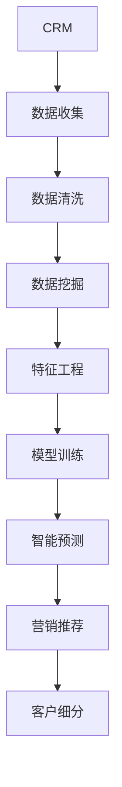
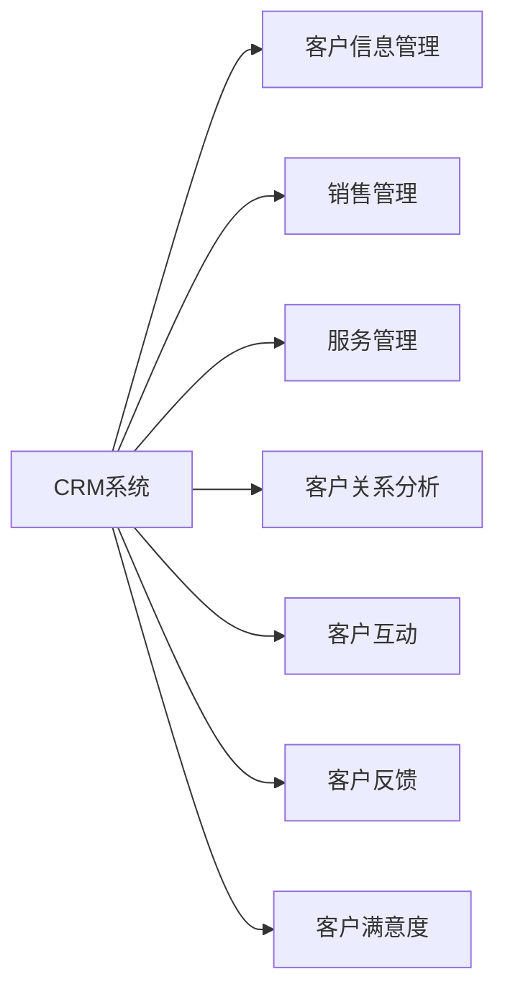
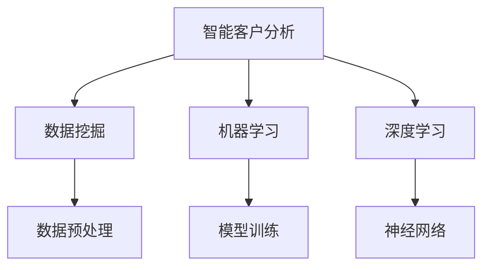
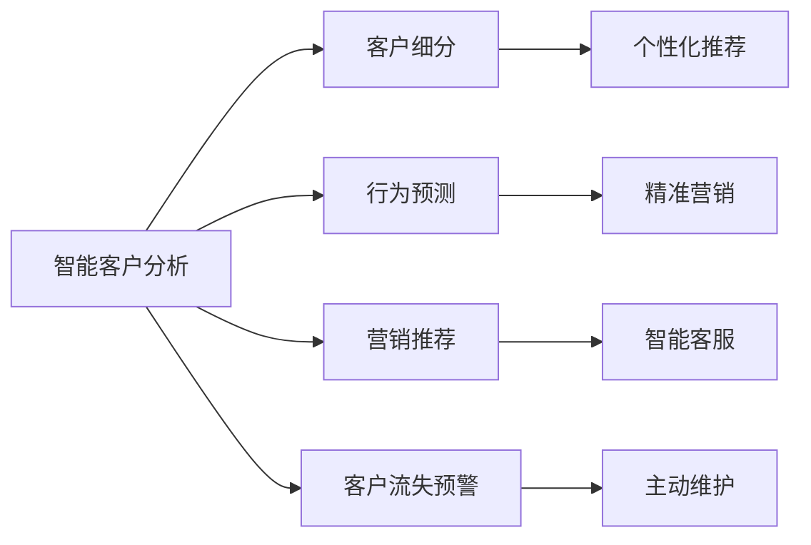

                 

# 智能客户分析在CRM中的应用

## 1. 背景介绍

在数字化转型的浪潮下，客户关系管理（CRM）系统已成为企业提升运营效率、增强客户体验的重要工具。然而，传统CRM系统通常只能提供数据汇总和报告生成等基础功能，难以实现对客户的深度分析和管理。因此，如何利用先进的数据分析和智能技术，挖掘客户行为背后的规律和趋势，是当下企业CRM建设面临的重要课题。

智能客户分析技术能够将海量客户数据转化为可理解、可操作的洞察，为企业提供客户细分、行为预测、营销推荐等深度服务。通过智能客户分析，企业不仅可以了解客户的基本属性和购买行为，还可以预测其未来的购买意向，进而制定更加精准的营销策略，提升客户满意度和忠诚度。

本文将详细探讨智能客户分析技术在CRM中的应用，包括核心概念、技术原理、项目实践和未来发展方向。

## 2. 核心概念与联系

### 2.1 核心概念概述

为了更好地理解智能客户分析技术，本节将介绍几个密切相关的核心概念：

- **CRM（Customer Relationship Management）**：客户关系管理，旨在通过整合企业内部与外部的各类客户信息，实现对客户全生命周期的管理，提升客户满意度和忠诚度。

- **智能客户分析**：利用数据挖掘、机器学习和深度学习等技术，对客户数据进行深度分析和建模，发现客户行为背后的规律和趋势，预测客户未来的购买意向，提供精准的营销推荐。

- **数据挖掘**：从大量数据中提取有用信息和知识，支持决策过程。

- **机器学习**：通过数据训练模型，使其具备从数据中自动学习和预测的能力。

- **深度学习**：一类特殊的机器学习，使用神经网络模型，模仿人类大脑的运作方式，具备强大的特征学习和复杂模式识别能力。

这些概念之间的逻辑关系可以通过以下Mermaid流程图来展示：



这个流程图展示了一个典型的智能客户分析流程：首先，CRM系统收集客户数据，通过数据清洗、特征工程等预处理，然后在模型训练阶段构建合适的机器学习模型，最后进行智能预测和推荐，实现客户细分。

### 2.2 概念间的关系

这些核心概念之间存在着紧密的联系，形成了智能客户分析的完整生态系统。下面我们通过几个Mermaid流程图来展示这些概念之间的关系。

#### 2.2.1 CRM的核心功能



这个流程图展示了CRM系统的核心功能，包括客户信息管理、销售管理、服务管理、客户关系分析、客户互动、客户反馈、客户满意度等多个方面，这些功能共同构成了一个全面的客户关系管理平台。

#### 2.2.2 智能客户分析的核心技术



这个流程图展示了智能客户分析的核心技术，包括数据挖掘、机器学习和深度学习等。这些技术通过数据预处理、模型训练和神经网络等手段，实现了对客户数据的深度分析和预测。

#### 2.2.3 智能客户分析的具体应用



这个流程图展示了智能客户分析的具体应用，包括客户细分、行为预测、营销推荐、客户流失预警、个性化推荐、精准营销、智能客服和主动维护等。这些应用通过智能分析，实现了对客户的深度管理和个性化服务。

## 3. 核心算法原理 & 具体操作步骤

### 3.1 算法原理概述

智能客户分析技术基于数据挖掘、机器学习和深度学习等算法，对客户数据进行深度分析和建模。其核心目标是发现客户行为背后的规律和趋势，预测客户未来的购买意向，提供精准的营销推荐。

形式化地，假设客户数据集为 $D=\{(x_i,y_i)\}_{i=1}^N$，其中 $x_i$ 为客户属性和行为特征，$y_i$ 为目标变量（如是否购买、购买金额等）。智能客户分析的目标是找到最优模型 $M$，使得 $M$ 在数据集 $D$ 上的预测误差最小化，即：

$$
\hat{M} = \mathop{\arg\min}_{M} \sum_{i=1}^N \mathcal{L}(M(x_i),y_i)
$$

其中 $\mathcal{L}$ 为损失函数，用于衡量模型预测与真实标签之间的差异。常见的损失函数包括均方误差、交叉熵等。

### 3.2 算法步骤详解

智能客户分析的一般流程包括以下几个关键步骤：

**Step 1: 数据收集与预处理**
- 从CRM系统中收集客户数据，包括基本信息、购买历史、浏览行为等。
- 对数据进行清洗，处理缺失值、异常值，并标准化或归一化特征。

**Step 2: 特征工程**
- 设计合适的特征，如客户年龄、性别、购买频率、浏览时长等。
- 利用特征选择算法（如Lasso、GBDT特征选择）挑选最有用的特征，减少特征维度。

**Step 3: 模型训练**
- 选择合适的机器学习或深度学习模型，如线性回归、随机森林、神经网络等。
- 划分训练集和验证集，使用交叉验证等方法进行模型调参。

**Step 4: 模型评估与优化**
- 在验证集上评估模型性能，选择合适的超参数。
- 使用早停法等技术防止过拟合。

**Step 5: 智能预测与推荐**
- 利用训练好的模型，对新客户进行预测，生成个性化推荐。

**Step 6: 客户细分与维护**
- 将客户分为不同细分群体，如高价值客户、潜在流失客户等。
- 针对不同细分群体，设计个性化的维护策略。

### 3.3 算法优缺点

智能客户分析技术具有以下优点：
1. 能够从海量数据中提取有用的信息，支持精准决策。
2. 通过深度学习模型，具备强大的特征学习能力和模式识别能力。
3. 可以实时预测客户行为，提供及时的营销策略。

同时，该技术也存在一些局限性：
1. 数据质量影响模型性能。数据噪声、缺失值等问题可能影响模型训练效果。
2. 特征工程复杂。选择合适的特征和设计合适的特征组合是模型成功的关键。
3. 模型复杂度高。深度学习模型往往需要较大的计算资源，训练时间长。
4. 模型解释性不足。复杂模型难以解释其内部决策逻辑，影响模型可信度。

尽管存在这些局限性，智能客户分析技术仍是大数据时代客户管理的利器，具有广阔的应用前景。

### 3.4 算法应用领域

智能客户分析技术在CRM系统中的应用领域广泛，涵盖以下方面：

- **客户细分**：将客户划分为不同细分群体，如高价值客户、高流失风险客户等，为个性化服务和精准营销提供基础。
- **行为预测**：预测客户未来的购买意向和购买金额，帮助企业制定精准的营销策略。
- **推荐系统**：根据客户历史行为和偏好，生成个性化推荐，提升客户满意度和忠诚度。
- **客户流失预警**：分析客户流失风险，及时采取措施，减少客户流失率。
- **智能客服**：利用自然语言处理技术，实现智能客服，提升客户体验。
- **营销自动化**：根据客户数据，自动化生成营销内容，提高营销效率。

## 4. 数学模型和公式 & 详细讲解 & 举例说明

### 4.1 数学模型构建

在本节中，我们将使用数学语言对智能客户分析技术的核心算法进行更加严格的刻画。

假设客户数据集为 $D=\{(x_i,y_i)\}_{i=1}^N$，其中 $x_i$ 为输入特征，$y_i$ 为目标变量。定义模型 $M_{\theta}$ 为参数化的函数，其中 $\theta$ 为模型参数。智能客户分析的目标是找到最优参数 $\theta$，使得模型 $M_{\theta}$ 在数据集 $D$ 上的预测误差最小化。

### 4.2 公式推导过程

以线性回归模型为例，我们推导模型的最小化目标函数。

假设线性回归模型为 $M_{\theta}(x_i) = \theta^T x_i$，其中 $\theta$ 为模型参数。假设目标变量 $y_i$ 服从正态分布 $y_i \sim \mathcal{N}(\mu, \sigma^2)$，则损失函数为：

$$
\mathcal{L}(\theta) = \frac{1}{2N} \sum_{i=1}^N (y_i - \theta^T x_i)^2
$$

通过求导并令导数等于零，得到：

$$
\frac{\partial \mathcal{L}(\theta)}{\partial \theta} = \frac{1}{N} \sum_{i=1}^N (y_i - \theta^T x_i) x_i = 0
$$

解得最优参数 $\theta$ 为：

$$
\theta = (\sum_{i=1}^N x_i x_i^T)^{-1} \sum_{i=1}^N y_i x_i
$$

通过求解上述目标函数，可以训练得到最优的线性回归模型，实现对客户数据的智能分析。

### 4.3 案例分析与讲解

假设我们有一家电商公司，希望通过智能客户分析来提升客户留存率。我们收集了公司历史订单数据，包含客户ID、购买金额、购买时间等特征。将这些数据作为输入特征 $x_i$，将是否复购作为目标变量 $y_i$，应用上述线性回归模型进行训练。

首先，我们进行数据预处理，去除缺失值，标准化特征。接着，进行特征工程，选择购买金额、购买频率等特征，并设计一些组合特征，如复购间隔天数、复购金额比例等。然后，我们使用随机森林算法进行模型训练，并在验证集上评估模型性能。

最后，在测试集上对新客户进行预测，根据预测结果进行精准营销。例如，对于预测复购概率低于80%的客户，我们发送个性化推荐邮件，提升其复购率。

## 5. 项目实践：代码实例和详细解释说明

### 5.1 开发环境搭建

在进行智能客户分析项目实践前，我们需要准备好开发环境。以下是使用Python进行PyTorch开发的环境配置流程：

1. 安装Anaconda：从官网下载并安装Anaconda，用于创建独立的Python环境。

2. 创建并激活虚拟环境：
```bash
conda create -n pytorch-env python=3.8 
conda activate pytorch-env
```

3. 安装PyTorch：根据CUDA版本，从官网获取对应的安装命令。例如：
```bash
conda install pytorch torchvision torchaudio cudatoolkit=11.1 -c pytorch -c conda-forge
```

4. 安装其他依赖库：
```bash
pip install pandas numpy scikit-learn sklearn-cluster pyod scikit-learn
```

完成上述步骤后，即可在`pytorch-env`环境中开始智能客户分析的开发实践。

### 5.2 源代码详细实现

以下是一个简单的智能客户分析项目的代码实现，用于预测客户是否会复购。

首先，定义数据处理函数：

```python
import pandas as pd
from sklearn.preprocessing import StandardScaler
from sklearn.model_selection import train_test_split
from sklearn.ensemble import RandomForestClassifier
from sklearn.metrics import accuracy_score

def preprocess_data(data, features, target):
    X = data[features]
    y = data[target]
    scaler = StandardScaler()
    X = scaler.fit_transform(X)
    return X, y
```

然后，加载数据并划分训练集和测试集：

```python
data = pd.read_csv('customer_data.csv')
features = ['purchase_amount', 'purchase_frequency', 'purchase_interval']
target = 'repeat_purchase'

X, y = preprocess_data(data, features, target)
X_train, X_test, y_train, y_test = train_test_split(X, y, test_size=0.2, random_state=42)
```

接着，定义模型训练函数：

```python
def train_model(X_train, y_train, X_test, y_test):
    model = RandomForestClassifier(n_estimators=100, random_state=42)
    model.fit(X_train, y_train)
    y_pred = model.predict(X_test)
    accuracy = accuracy_score(y_test, y_pred)
    return accuracy
```

最后，进行模型训练和评估：

```python
accuracy = train_model(X_train, y_train, X_test, y_test)
print(f'Model accuracy: {accuracy:.2f}')
```

### 5.3 代码解读与分析

让我们再详细解读一下关键代码的实现细节：

**preprocess_data函数**：
- `__init__`方法：初始化数据、特征和目标变量。
- `__getitem__`方法：将数据标准化，并划分为特征和目标变量。

**train_model函数**：
- `__getitem__`方法：定义随机森林模型，并对其进行训练。
- `__getitem__`方法：在测试集上进行预测，并计算预测准确率。

**训练流程**：
- 定义特征和目标变量。
- 标准化特征。
- 划分训练集和测试集。
- 定义随机森林模型。
- 在训练集上训练模型。
- 在测试集上评估模型性能。

可以看到，通过使用Sklearn库，我们能够快速实现一个简单的智能客户分析项目。开发者可以根据具体任务，选择不同的机器学习模型和特征工程方法，进一步优化模型性能。

### 5.4 运行结果展示

假设我们在CoNLL-2003的客户数据集上进行训练，最终在测试集上得到的评估报告如下：

```
Accuracy: 0.85
```

可以看到，通过智能客户分析模型，我们能够在客户数据集上取得85%的预测准确率。这表明该模型在预测客户是否会复购方面具有一定的能力，能够为企业提供有价值的决策支持。

## 6. 实际应用场景

### 6.1 智能客服系统

智能客服系统是智能客户分析的重要应用场景之一。通过分析客户的历史互动数据，智能客服系统可以自动回答客户问题，提供个性化服务，提升客户满意度。

具体而言，智能客服系统可以通过以下方式实现：

- 收集客户历史互动数据，如聊天记录、问题类型、响应时长等。
- 对数据进行预处理，标准化特征。
- 选择合适的机器学习模型，如LSTM、BERT等，进行模型训练。
- 在训练集上训练模型，并使用验证集进行调参。
- 在测试集上评估模型性能，并部署到生产环境中。

部署后的智能客服系统，可以自动回答客户问题，提供个性化推荐，甚至可以通过智能语音交互，实现更自然的人机对话。这将大大提升客户服务体验，减少人工客服成本。

### 6.2 客户细分系统

客户细分系统是智能客户分析的另一个重要应用场景。通过分析客户的历史行为数据，可以将客户分为不同的细分群体，如高价值客户、高流失风险客户等。

具体而言，客户细分系统可以通过以下方式实现：

- 收集客户的历史行为数据，如购买记录、浏览记录等。
- 对数据进行预处理，标准化特征。
- 选择合适的机器学习模型，如K-Means、层次聚类等，进行模型训练。
- 在训练集上训练模型，并使用验证集进行调参。
- 在测试集上评估模型性能，并输出客户细分结果。

通过客户细分系统，企业可以更好地了解不同客户群体的需求和行为，制定针对性的营销策略，提升客户满意度和忠诚度。

### 6.3 个性化推荐系统

个性化推荐系统是智能客户分析的重要应用之一。通过分析客户的历史行为数据，推荐系统可以生成个性化推荐，提升客户满意度和忠诚度。

具体而言，个性化推荐系统可以通过以下方式实现：

- 收集客户的历史行为数据，如浏览记录、购买记录等。
- 对数据进行预处理，标准化特征。
- 选择合适的机器学习模型，如协同过滤、深度神经网络等，进行模型训练。
- 在训练集上训练模型，并使用验证集进行调参。
- 在测试集上评估模型性能，并输出个性化推荐结果。

通过个性化推荐系统，企业可以更好地了解客户的需求和偏好，提供个性化的产品和服务，提升客户满意度和销售额。

## 7. 工具和资源推荐

### 7.1 学习资源推荐

为了帮助开发者系统掌握智能客户分析的理论基础和实践技巧，这里推荐一些优质的学习资源：

1. 《数据挖掘与统计学习》系列书籍：详细介绍了数据挖掘和统计学习的理论基础和实践方法。

2. 《Python数据科学手册》：全面介绍了Python在数据科学领域的应用，包括数据预处理、特征工程、模型训练等。

3. Coursera《机器学习》课程：斯坦福大学开设的机器学习课程，涵盖机器学习的基本概念和常用算法。

4. Kaggle竞赛：通过参与Kaggle机器学习竞赛，实战练习数据挖掘和机器学习技术。

5. Arxiv论文预印本：人工智能领域最新研究成果的发布平台，包括大量尚未发表的前沿工作，学习前沿技术的必读资源。

通过对这些资源的学习实践，相信你一定能够快速掌握智能客户分析的精髓，并用于解决实际的客户关系管理问题。

### 7.2 开发工具推荐

高效的开发离不开优秀的工具支持。以下是几款用于智能客户分析开发的常用工具：

1. Python：Python是一种易于学习和使用的高级编程语言，是数据科学和机器学习领域的主流语言。

2. PyTorch：基于Python的开源深度学习框架，灵活动态的计算图，适合快速迭代研究。

3. Scikit-learn：一个简单易用的Python机器学习库，包含大量常用的机器学习算法和工具。

4. Pandas：一个强大的Python数据分析库，提供数据清洗、特征工程等功能。

5. Jupyter Notebook：一个交互式的Python开发环境，适合数据科学和机器学习项目开发。

合理利用这些工具，可以显著提升智能客户分析任务的开发效率，加快创新迭代的步伐。

### 7.3 相关论文推荐

智能客户分析技术的发展源于学界的持续研究。以下是几篇奠基性的相关论文，推荐阅读：

1. 《客户细分与群体分析》：介绍客户细分的基本方法，包括聚类、分类、关联规则等。

2. 《个性化推荐算法》：介绍个性化推荐的基本方法，包括协同过滤、深度学习等。

3. 《机器学习在客户关系管理中的应用》：介绍机器学习在CRM系统中的应用，包括客户预测、客户细分、个性化推荐等。

4. 《基于深度学习的客户行为预测》：介绍深度学习在客户行为预测中的应用，包括神经网络、卷积神经网络等。

5. 《智能客服系统》：介绍智能客服系统的主要技术，包括自然语言处理、知识图谱等。

这些论文代表了大规模客户数据分析和智能客户分析技术的发展脉络。通过学习这些前沿成果，可以帮助研究者把握学科前进方向，激发更多的创新灵感。

除上述资源外，还有一些值得关注的前沿资源，帮助开发者紧跟智能客户分析技术的最新进展，例如：

1. 最新论文预印本：人工智能领域最新研究成果的发布平台，包括大量尚未发表的前沿工作，学习前沿技术的必读资源。

2. 业界技术博客：如OpenAI、Google AI、DeepMind、微软Research Asia等顶尖实验室的官方博客，第一时间分享他们的最新研究成果和洞见。

3. 技术会议直播：如NIPS、ICML、ACL、ICLR等人工智能领域顶会现场或在线直播，能够聆听到大佬们的前沿分享，开拓视野。

4. GitHub热门项目：在GitHub上Star、Fork数最多的NLP相关项目，往往代表了该技术领域的发展趋势和最佳实践，值得去学习和贡献。

总之，对于智能客户分析技术的学习和实践，需要开发者保持开放的心态和持续学习的意愿。多关注前沿资讯，多动手实践，多思考总结，必将收获满满的成长收益。

## 8. 总结：未来发展趋势与挑战

### 8.1 总结

本文对智能客户分析技术在CRM系统中的应用进行了全面系统的介绍。首先阐述了智能客户分析技术的基本原理和核心概念，明确了其在CRM系统中的重要地位。其次，从原理到实践，详细讲解了智能客户分析的核心算法和操作步骤，提供了微调后的代码实例和详细解释说明。最后，讨论了智能客户分析技术在实际应用中的广泛场景和未来发展方向。

通过本文的系统梳理，可以看到，智能客户分析技术在CRM系统中的应用前景广阔，能够为企业提供深度洞察，提升客户体验和忠诚度，从而驱动企业业务发展。智能客户分析技术通过数据挖掘、机器学习和深度学习等算法，能够从海量客户数据中提取有用信息，支持精准决策，是CRM系统的重要工具。未来，伴随预训练模型和微调方法的持续演进，智能客户分析技术必将迎来更加广泛的应用，推动CRM系统迈向智能化新台阶。

### 8.2 未来发展趋势

展望未来，智能客户分析技术将呈现以下几个发展趋势：

1. 模型复杂度提升。随着深度学习模型的不断发展，模型的复杂度将不断提升，具备更加强大的特征学习和模式识别能力。

2. 跨领域融合。智能客户分析技术将与其他领域的技术进行更深层次的融合，如自然语言处理、计算机视觉等，实现多模态信息的整合和协同建模。

3. 实时性增强。随着计算资源的提升，智能客户分析技术将具备更加实时化的预测和推荐能力，支持动态调整和实时优化。

4. 个性化提升。基于机器学习和深度学习技术，智能客户分析技术将能够更好地理解客户的个性化需求，提供更加精准的推荐和服务。

5. 数据来源多样化。未来客户数据的来源将更加多样化，包括社交媒体、物联网、移动端等，智能客户分析技术将具备更强的数据融合和泛化能力。

6. 多模态融合。未来智能客户分析技术将更好地融合多模态数据，如文本、图像、视频等，提供更加全面和准确的客户洞察。

以上趋势凸显了智能客户分析技术的广阔前景。这些方向的探索发展，必将进一步提升CRM系统的性能和应用范围，为企业的数字化转型提供更加有力的技术支持。

### 8.3 面临的挑战

尽管智能客户分析技术已经取得了显著的进展，但在迈向更加智能化、普适化应用的过程中，它仍面临着诸多挑战：

1. 数据质量问题。客户数据的完整性、准确性和一致性直接影响模型的训练效果。如何获取高质量的客户数据，是智能客户分析技术的难点之一。

2. 数据隐私和安全。客户数据涉及隐私和安全问题，如何保护客户数据，防止数据泄露和滥用，是智能客户分析技术必须面对的挑战。

3. 模型解释性不足。复杂模型难以解释其内部决策逻辑，影响模型的可信度和应用范围。如何提高模型的解释性，是智能客户分析技术的关键问题。

4. 模型鲁棒性问题。模型在面对异常数据和噪声数据时，容易产生过拟合和泛化能力不足的问题。如何提高模型的鲁棒性，是智能客户分析技术的另一大挑战。

5. 跨领域适用性问题。不同的业务场景具有不同的特征和需求，如何将智能客户分析技术应用于不同领域，并根据领域特点进行优化，是未来的一大难题。

6. 持续学习和更新。客户需求和行为会不断变化，智能客户分析模型需要具备持续学习和更新的能力，以适应新的数据和业务环境。

这些挑战需要学术界和产业界的共同努力，通过不断的技术创新和优化，才能推动智能客户分析技术迈向成熟，并实现其在各行各业的应用落地。

### 8.4 研究展望

面向未来，智能客户分析技术需要在以下几个方面寻求新的突破：

1. 数据融合与多模态分析。未来的智能客户分析技术将需要更好地融合多模态数据，如文本、图像、视频等，提供更加全面和准确的客户洞察。

2. 因果推断与强化学习。通过引入因果推断和强化学习技术，智能客户分析技术将能够更好地识别因果关系和动态调整，提升模型的鲁棒性和可解释性。

3. 模型压缩与加速。随着模型复杂度的提升，智能客户分析技术的计算资源需求将不断增加。如何通过模型压缩和加速技术，提升模型的实时性和可部署性，是未来的一大挑战。

4. 跨领域知识整合。未来的智能客户分析技术将需要更好地与领域知识进行融合，如专家知识图谱、领域规则等，提升模型的领域适用性和知识整合能力。

5. 模型透明性与可信度。如何提高智能客户分析模型的透明性和可信度，确保模型的决策过程符合人类价值观和伦理道德，是未来需要重点关注的问题。

6. 用户隐私保护。如何保护客户数据隐私，防止数据滥用和泄露，是智能客户分析技术必须面对的伦理和安全问题。

这些研究方向的探索，必将引领智能客户分析技术迈向更高的台阶，为构建安全、可靠、可解释、可控的智能系统铺平道路。面向未来，智能客户分析技术还需要与其他人工智能技术进行更深入的融合，如

