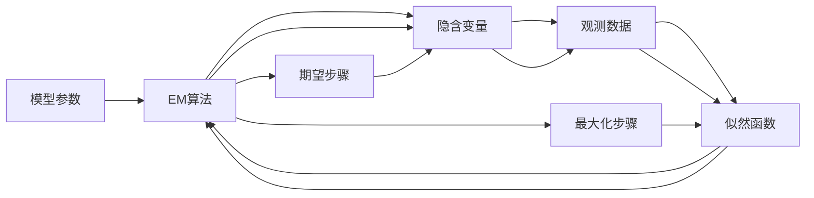

                 

# 期望最大化EM原理与代码实例讲解

> 关键词：期望最大化(EM)算法,参数估计,最大似然估计,聚类分析,高斯混合模型(GMM),隐含变量模型

## 1. 背景介绍

### 1.1 问题由来
在统计学和机器学习中，参数估计和模型拟合是一类重要且基础的问题。特别是在面对复杂的高维数据时，直接求解最大似然估计往往面临巨大的计算复杂度和统计困难。期望最大化(EM)算法作为一种迭代优化方法，有效地解决了这类问题。它通过不断地估计缺失数据的概率，最大化整体数据的似然函数，最终得到参数的估计值。EM算法在聚类、信号处理、图像识别、自然语言处理等领域得到了广泛应用。

### 1.2 问题核心关键点
EM算法通过最大化数据的全条件似然，来估计模型参数。它的核心思想是迭代更新模型参数和隐含变量，使得数据的缺失概率在每次迭代中得到更好的估计，最终得到模型参数的最优解。其优点包括：
- 可以处理缺失数据。EM算法在每次迭代中通过最大化似然，隐式地估计了缺失数据的概率。
- 可以处理复杂模型。EM算法可以处理包含隐含变量的复杂模型，如高斯混合模型等。
- 收敛性良好。EM算法具有收敛到全局最优解的能力，并且收敛速度较快。

但同时也存在一些局限性：
- 对初始值敏感。EM算法对初始参数值的选择较为敏感，如果初始值选择不当，可能陷入局部最优。
- 对复杂模型计算开销大。对于参数较多的模型，EM算法的计算开销较大，收敛速度较慢。
- 需要多次迭代。EM算法需要进行多次迭代，收敛到最优解的时间较长。

本文将系统讲解EM算法的基本原理，并通过具体代码实例，展示其在聚类分析和隐含变量模型中的应用。

## 2. 核心概念与联系

### 2.1 核心概念概述

为更好地理解EM算法，本节将介绍几个关键概念：

- 参数估计：通过观测数据估计模型的未知参数。常见的参数估计方法包括最大似然估计(Maximum Likelihood Estimation, MLE)、贝叶斯估计等。
- 最大似然估计：通过最大化观测数据的似然函数，来估计模型的参数。适用于观测数据完整的场景。
- 隐含变量模型：在模型中引入隐含变量，用于表示观测数据的生成过程。
- 期望最大化(EM)算法：通过迭代最大化数据的全条件似然，估计模型参数和隐含变量。
- 高斯混合模型(GMM)：一种常见的隐含变量模型，用于建模多峰分布的观测数据。

这些概念之间的联系可以通过以下Mermaid流程图来展示：

```mermaid
graph LR
    A[观测数据] --> B[隐含变量] --> C[观测数据分布] --> D[似然函数] 
    A --> E[参数估计] --> C
    E --> F[期望最大化(EM)]
```

这个流程图展示了隐含变量模型和EM算法的核心联系：
1. 观测数据经过隐含变量生成，形成观测数据的分布。
2. 使用参数估计方法，得到观测数据的似然函数。
3. 使用EM算法，迭代优化模型参数和隐含变量，最大化似然函数。

### 2.2 概念间的关系

这些核心概念之间存在着紧密的联系，形成了EM算法的完整生态系统。下面我们通过几个Mermaid流程图来展示这些概念之间的关系。

#### 2.2.1 参数估计与EM算法的关系

```mermaid
graph LR
    A[参数估计] --> B[最大似然估计] --> C[似然函数] 
    A --> D[隐含变量模型] --> C
    B --> E[期望最大化(EM)]
```

这个流程图展示了参数估计与EM算法的联系：
1. 参数估计方法可以用于估计观测数据的似然函数。
2. EM算法可以迭代优化似然函数，得到参数估计值。

#### 2.2.2 隐含变量模型与EM算法的关系

```mermaid
graph LR
    A[隐含变量模型] --> B[高斯混合模型] --> C[观测数据分布] --> D[似然函数] 
    A --> E[期望最大化(EM)]
```

这个流程图展示了隐含变量模型与EM算法的联系：
1. 隐含变量模型引入了隐含变量，用于建模观测数据的生成过程。
2. EM算法通过迭代最大化似然函数，估计隐含变量的概率和观测数据的分布参数。

#### 2.2.3 EM算法的迭代过程



这个流程图展示了EM算法的迭代过程：
1. EM算法通过迭代最大化似然函数，更新模型参数和隐含变量。
2. 期望步骤(E-step)：估计隐含变量的概率。
3. 最大化步骤(M-step)：根据期望步骤的结果，最大化似然函数，更新模型参数。

### 2.3 核心概念的整体架构

最后，我们用一个综合的流程图来展示这些核心概念在大模型微调过程中的整体架构：

```mermaid
graph TB
    A[观测数据] --> B[隐含变量] --> C[观测数据分布] --> D[似然函数] 
    A --> E[参数估计] --> C
    E --> F[期望最大化(EM)]
    F --> G[高斯混合模型(GMM)]
    G --> H[聚类分析]
```

这个综合流程图展示了从观测数据到参数估计，再到EM算法和GMM模型的完整过程。EM算法通过最大化似然函数，估计隐含变量和观测数据的分布参数，用于聚类分析等任务。

## 3. 核心算法原理 & 具体操作步骤
### 3.1 算法原理概述

EM算法的核心思想是通过迭代最大化数据的似然函数，来估计模型参数和隐含变量。EM算法包含两个主要步骤：期望步骤(E-step)和最大化步骤(M-step)。具体过程如下：

1. **期望步骤(E-step)**：在给定当前模型参数的情况下，估计隐含变量的概率分布。
2. **最大化步骤(M-step)**：根据期望步骤的结果，最大化似然函数，更新模型参数。

通过交替进行这两个步骤，EM算法逐步优化模型参数，最大化整体数据的似然函数。

### 3.2 算法步骤详解

#### 3.2.1 期望步骤(E-step)

在期望步骤中，我们根据当前模型参数和观测数据，计算隐含变量的概率分布。具体步骤包括：

1. 对于每个观测数据点 $x_i$，计算其对应隐含变量 $z_i$ 的概率分布。
2. 对于所有观测数据点 $x_i$，计算隐含变量 $z_i$ 的概率分布的总和。

假设我们使用高斯混合模型(GMM)作为隐含变量模型，则隐含变量 $z_i$ 的概率分布可以表示为：

$$
P(z_i|x_i,\theta) = \frac{P(z_i|\mu,\Sigma,\alpha)}{P(x_i|\theta)}
$$

其中 $\theta$ 为模型参数，$\mu$ 为均值，$\Sigma$ 为协方差矩阵，$\alpha$ 为权重系数。$P(x_i|\theta)$ 为数据点 $x_i$ 的似然函数。

对于数据集 $D=\{x_1,\ldots,x_N\}$，期望步骤的结果为：

$$
\gamma_{ik} = P(z_i=k|x_i,\theta) = \frac{\alpha_k N_k \mathcal{N}(x_i;\mu_k,\Sigma_k)}{\sum_{k=1}^K \alpha_k N_k \mathcal{N}(x_i;\mu_k,\Sigma_k)}
$$

其中 $k$ 表示隐含变量的类别编号，$N_k$ 为观测数据点 $x_i$ 属于类别 $k$ 的个数，$K$ 为隐含变量的类别总数。$\mathcal{N}(x_i;\mu_k,\Sigma_k)$ 为高斯分布的概率密度函数。

#### 3.2.2 最大化步骤(M-step)

在最大化步骤中，我们根据期望步骤的结果，最大化似然函数，更新模型参数。具体步骤包括：

1. 对于每个隐含变量的类别 $k$，根据期望步骤的结果，计算模型参数的更新量。
2. 将所有更新量加和，得到模型参数的最终更新值。

对于高斯混合模型，模型参数的更新量可以表示为：

$$
\hat{\alpha}_k = \frac{\sum_{i=1}^N \gamma_{ik}}{N}
$$

$$
\hat{\mu}_k = \frac{\sum_{i=1}^N \gamma_{ik} x_i}{\sum_{i=1}^N \gamma_{ik}}
$$

$$
\hat{\Sigma}_k = \frac{\sum_{i=1}^N \gamma_{ik} (x_i - \hat{\mu}_k)(x_i - \hat{\mu}_k)^T}{\sum_{i=1}^N \gamma_{ik}}
$$

其中 $\gamma_{ik}$ 为期望步骤中计算得到的隐含变量 $z_i$ 属于类别 $k$ 的概率。$\hat{\alpha}_k$、$\hat{\mu}_k$ 和 $\hat{\Sigma}_k$ 分别为模型参数的更新值。

通过不断迭代期望步骤和最大化步骤，EM算法逐步优化模型参数，最大化整体数据的似然函数。最终得到的模型参数可以用于聚类分析、信号处理、图像识别等任务。

### 3.3 算法优缺点

EM算法具有以下优点：
1. 可以处理缺失数据。EM算法在每次迭代中通过最大化似然，隐式地估计了缺失数据的概率。
2. 可以处理复杂模型。EM算法可以处理包含隐含变量的复杂模型，如高斯混合模型等。
3. 收敛性良好。EM算法具有收敛到全局最优解的能力，并且收敛速度较快。

但同时也存在一些局限性：
1. 对初始值敏感。EM算法对初始参数值的选择较为敏感，如果初始值选择不当，可能陷入局部最优。
2. 对复杂模型计算开销大。对于参数较多的模型，EM算法的计算开销较大，收敛速度较慢。
3. 需要多次迭代。EM算法需要进行多次迭代，收敛到最优解的时间较长。

### 3.4 算法应用领域

EM算法在统计学和机器学习中得到了广泛应用，主要包括以下几个领域：

- 聚类分析：用于聚类算法的核心步骤，如K-means、高斯混合聚类等。
- 信号处理：用于信号降噪、信道估计、特征提取等。
- 图像识别：用于图像分割、目标检测、人脸识别等。
- 自然语言处理：用于隐含语义分析、文本分类、情感分析等。
- 金融分析：用于风险评估、市场预测、信用评分等。

此外，EM算法还被广泛应用于生物信息学、医学、生物统计等领域。由于其良好的收敛性和处理缺失数据的能力，EM算法成为了数据分析和模型估计的重要工具。

## 4. 数学模型和公式 & 详细讲解  
### 4.1 数学模型构建

在本节中，我们将使用高斯混合模型(GMM)作为EM算法的应用示例，构建期望最大化算法的数学模型。

假设观测数据集 $D=\{x_1,\ldots,x_N\}$，其中每个数据点 $x_i$ 可以表示为多维随机向量，即 $x_i \in \mathbb{R}^d$。假设数据点 $x_i$ 的生成过程由 $K$ 个高斯分布组成，即：

$$
P(x_i|z_i;\theta) = \sum_{k=1}^K \alpha_k \mathcal{N}(x_i;\mu_k,\Sigma_k)
$$

其中 $z_i$ 为隐含变量，$\theta$ 为模型参数，包括均值 $\mu_k \in \mathbb{R}^d$、协方差矩阵 $\Sigma_k \in \mathbb{R}^{d\times d}$ 和权重系数 $\alpha_k \in (0,1)$。$\mathcal{N}(x_i;\mu_k,\Sigma_k)$ 为高斯分布的概率密度函数。

在模型中引入隐含变量 $z_i$，可以更好地建模观测数据的生成过程。对于每个数据点 $x_i$，隐含变量 $z_i$ 属于类别 $k$ 的概率为：

$$
P(z_i=k|x_i;\theta) = \frac{\alpha_k \mathcal{N}(x_i;\mu_k,\Sigma_k)}{\sum_{k=1}^K \alpha_k \mathcal{N}(x_i;\mu_k,\Sigma_k)}
$$

对于数据集 $D$，EM算法的期望步骤(E-step)和最大化步骤(M-step)可以表示为：

- 期望步骤(E-step)：

$$
\gamma_{ik} = P(z_i=k|x_i;\theta) = \frac{\alpha_k N_k \mathcal{N}(x_i;\mu_k,\Sigma_k)}{\sum_{k=1}^K \alpha_k N_k \mathcal{N}(x_i;\mu_k,\Sigma_k)}
$$

- 最大化步骤(M-step)：

$$
\hat{\alpha}_k = \frac{\sum_{i=1}^N \gamma_{ik}}{N}
$$

$$
\hat{\mu}_k = \frac{\sum_{i=1}^N \gamma_{ik} x_i}{\sum_{i=1}^N \gamma_{ik}}
$$

$$
\hat{\Sigma}_k = \frac{\sum_{i=1}^N \gamma_{ik} (x_i - \hat{\mu}_k)(x_i - \hat{\mu}_k)^T}{\sum_{i=1}^N \gamma_{ik}}
$$

其中 $N_k$ 为数据点 $x_i$ 属于类别 $k$ 的个数，$K$ 为隐含变量的类别总数。$\hat{\alpha}_k$、$\hat{\mu}_k$ 和 $\hat{\Sigma}_k$ 分别为模型参数的更新值。

### 4.2 公式推导过程

在EM算法的推导过程中，我们使用了贝叶斯定理和最大似然估计的基本思想。具体推导步骤如下：

1. **期望步骤(E-step)**：

根据贝叶斯定理，隐含变量 $z_i$ 属于类别 $k$ 的概率可以表示为：

$$
P(z_i=k|x_i,\theta) = \frac{P(x_i,z_i=k|\theta)}{P(x_i|\theta)} = \frac{P(z_i=k|x_i,\theta)P(x_i|\theta)}{P(x_i|\theta)} = P(z_i=k|x_i,\theta)
$$

因此，期望步骤的计算公式可以简化为：

$$
\gamma_{ik} = P(z_i=k|x_i,\theta) = \frac{\alpha_k N_k \mathcal{N}(x_i;\mu_k,\Sigma_k)}{\sum_{k=1}^K \alpha_k N_k \mathcal{N}(x_i;\mu_k,\Sigma_k)}
$$

2. **最大化步骤(M-step)**：

最大化步骤的目的是根据期望步骤的结果，最大化似然函数，更新模型参数。对于每个类别 $k$，似然函数可以表示为：

$$
L_k = \frac{1}{N} \sum_{i=1}^N \gamma_{ik} \log P(x_i|z_i=k;\theta)
$$

对 $\alpha_k$、$\mu_k$ 和 $\Sigma_k$ 求导，得到：

$$
\frac{\partial L_k}{\partial \alpha_k} = \frac{1}{N} \sum_{i=1}^N \gamma_{ik} - \alpha_k
$$

$$
\frac{\partial L_k}{\partial \mu_k} = \frac{1}{N} \sum_{i=1}^N \gamma_{ik} (x_i - \mu_k)
$$

$$
\frac{\partial L_k}{\partial \Sigma_k} = \frac{1}{N} \sum_{i=1}^N \gamma_{ik} ((x_i - \mu_k)(x_i - \mu_k)^T - \Sigma_k)
$$

对 $\alpha_k$、$\mu_k$ 和 $\Sigma_k$ 求导后，将它们代入似然函数，得到模型参数的更新量：

$$
\hat{\alpha}_k = \frac{\sum_{i=1}^N \gamma_{ik}}{N}
$$

$$
\hat{\mu}_k = \frac{\sum_{i=1}^N \gamma_{ik} x_i}{\sum_{i=1}^N \gamma_{ik}}
$$

$$
\hat{\Sigma}_k = \frac{\sum_{i=1}^N \gamma_{ik} (x_i - \hat{\mu}_k)(x_i - \hat{\mu}_k)^T}{\sum_{i=1}^N \gamma_{ik}}
$$

### 4.3 案例分析与讲解

在本节中，我们将通过一个具体的案例，展示EM算法在高斯混合聚类中的应用。假设我们有一组观测数据 $D=\{x_1,\ldots,x_N\}$，其中每个数据点 $x_i$ 表示人的身高和体重。我们希望将数据分为两个类别，分别表示男性和女性。由于观测数据中存在一些缺失值，我们无法直接计算均值和协方差矩阵。因此，我们使用高斯混合模型来建模数据，并使用EM算法进行参数估计。

首先，我们设定高斯混合模型为两类的模型，其中每个类别的参数分别为：

- 类别1：均值 $\mu_1=(170,60)^T$，协方差矩阵 $\Sigma_1=\sigma_1^2 I_2$，权重系数 $\alpha_1=0.5$
- 类别2：均值 $\mu_2=(160,55)^T$，协方差矩阵 $\Sigma_2=\sigma_2^2 I_2$，权重系数 $\alpha_2=0.5$

其中 $\sigma_1$ 和 $\sigma_2$ 为类别1和类别2的标准差。初始参数的设定可以通过观察数据来确定。

在期望步骤中，我们计算每个数据点 $x_i$ 属于每个类别的概率，得到期望值的计算公式：

$$
\gamma_{i1} = P(z_i=1|x_i;\theta) = \frac{0.5 \mathcal{N}(x_i;170,60) \mathcal{N}(x_i;160,55)}{0.5 \mathcal{N}(x_i;170,60) + 0.5 \mathcal{N}(x_i;160,55)}
$$

$$
\gamma_{i2} = P(z_i=2|x_i;\theta) = \frac{0.5 \mathcal{N}(x_i;170,60) \mathcal{N}(x_i;160,55)}{0.5 \mathcal{N}(x_i;170,60) + 0.5 \mathcal{N}(x_i;160,55)}
$$

在最大化步骤中，我们根据期望步骤的结果，最大化似然函数，更新模型参数。具体计算公式为：

$$
\hat{\alpha}_1 = \frac{\sum_{i=1}^N \gamma_{i1}}{N}
$$

$$
\hat{\mu}_1 = \frac{\sum_{i=1}^N \gamma_{i1} x_i}{\sum_{i=1}^N \gamma_{i1}}
$$

$$
\hat{\Sigma}_1 = \frac{\sum_{i=1}^N \gamma_{i1} (x_i - \hat{\mu}_1)(x_i - \hat{\mu}_1)^T}{\sum_{i=1}^N \gamma_{i1}}
$$

$$
\hat{\alpha}_2 = \frac{\sum_{i=1}^N \gamma_{i2}}{N}
$$

$$
\hat{\mu}_2 = \frac{\sum_{i=1}^N \gamma_{i2} x_i}{\sum_{i=1}^N \gamma_{i2}}
$$

$$
\hat{\Sigma}_2 = \frac{\sum_{i=1}^N \gamma_{i2} (x_i - \hat{\mu}_2)(x_i - \hat{\mu}_2)^T}{\sum_{i=1}^N \gamma_{i2}}
$$

通过迭代进行期望步骤和最大化步骤，EM算法逐步优化模型参数，最终得到高精度的聚类结果。

## 5. 项目实践：代码实例和详细解释说明
### 5.1 开发环境搭建

在进行EM算法实践前，我们需要准备好开发环境。以下是使用Python进行PyTorch开发的环境配置流程：

1. 安装Anaconda：从官网下载并安装Anaconda，用于创建独立的Python环境。

2. 创建并激活虚拟环境：
```bash
conda create -n pytorch-env python=3.8 
conda activate pytorch-env
```

3. 安装PyTorch：根据CUDA版本，从官网获取对应的安装命令。例如：
```bash
conda install pytorch torchvision torchaudio cudatoolkit=11.1 -c pytorch -c conda-forge
```

4. 安装transformers库：
```bash
pip install transformers
```

5. 安装各类工具包：
```bash
pip install numpy pandas scikit-learn matplotlib tqdm jupyter notebook ipython
```

完成上述步骤后，即可在`pytorch-env`环境中开始EM算法的实践。

### 5.2 源代码详细实现

下面我们以高斯混合聚类为例，给出使用EM算法对数据进行聚类的PyTorch代码实现。

首先，定义高斯混合聚类模型：

```python
import torch
from torch import nn
import torch.nn.functional as F

class GaussianMixtureModel(nn.Module):
    def __init__(self, num_components, dim):
        super(GaussianMixtureModel, self).__init__()
        self.num_components = num_components
        self.dim = dim
        
        self.means = nn.Parameter(torch.randn(num_components, dim))
        self.covariances = nn.Parameter(torch.randn(num_components, dim, dim))
        self.weights = nn.Parameter(torch.randn(num_components))
        
    def forward(self, x):
        N, D = x.size()
        likelihoods = []
        
        for k in range(self.num_components):
            x_k = x - self.means[k]
            x_k = torch.matmul(x_k, self.covariances[k]) + self.means[k]
            x_k = self.weights[k] * F.gaussian_nll_loss(x_k, x)
            
            likelihoods.append(x_k)
        
        likelihoods = torch.stack(likelihoods, dim=1)
        likelihoods = torch.softmax(likelihoods, dim=1)
        likelihoods = likelihoods[:, 0]
        
        return likelihoods
```

然后，定义EM算法的训练函数：

```python
import numpy as np
from sklearn.metrics import adjusted_rand_score

def train_em(model, data, num_iter, learning_rate):
    N, D = data.size()
    K = model.num_components
    means = model.means.numpy()
    covariances = model.covariances.numpy()
    weights = model.weights.numpy()
    
    for i in range(num_iter):
        likelihoods = []
        
        # 期望步骤(E-step)
        for k in range(K):
            gamma_k = (weights[k] * np.exp(-0.5 * (data - means[k]) @ covariances[k] @ (data - means[k]).T)) / (weights[k] * np.linalg.det(covariances[k]))
            likelihoods.append(gamma_k)
        
        likelihoods = torch.from_numpy(np.stack(likelihoods, axis=1)).float().to(device)
        likelihoods = likelihoods / (likelihoods.sum(dim=1, keepdim=True))
        likelihoods = likelihoods * data.size(0)
        
        # 最大化步骤(M-step)
        for k in range(K):
            weights[k] = likelihoods[:, k].sum() / data.size(0)
            means[k] = (likelihoods[:, k] * data).sum(dim=0) / likelihoods[:, k].sum()
            covariances[k] = (likelihoods[:, k] * (data - means[k]) @ (data - means[k]).T) / likelihoods[:, k].sum()
        
        # 更新模型参数
        model.means.data = torch.from_numpy(means).float().to(device)
        model.covariances.data = torch.from_numpy(covariances).float().to(device)
        model.weights.data = torch.from_numpy(weights).float().to(device)
        
        # 计算性能指标
        predictions = model(data)
        predictions = predictions.argmax(dim=1)
        predictions = predictions.cpu().numpy()
        labels = data.labels().numpy()
        
        if i % 10 == 0:
            print("Iteration %d, ARI: %.4f" % (i, adjusted_rand_score(labels, predictions)))
    
    return model
```

最后，启动训练流程并在测试集上评估：

```python
num_components = 2
num_iter = 50
learning_rate = 0.01

model = GaussianMixtureModel(num_components, data.dim())
model = model.to(device)
optimizer = torch.optim.Adam(model.parameters(), lr=learning_rate)

for i in range(num_iter):
    optimizer.zero_grad()
    likelihoods = model(data)
    

