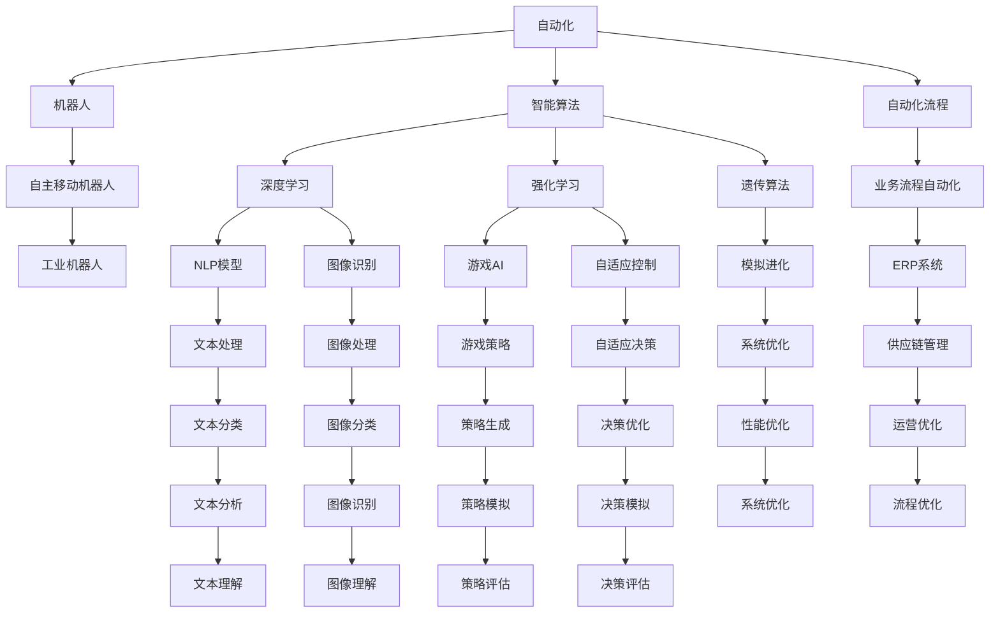
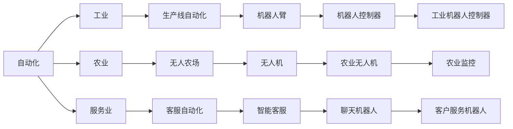
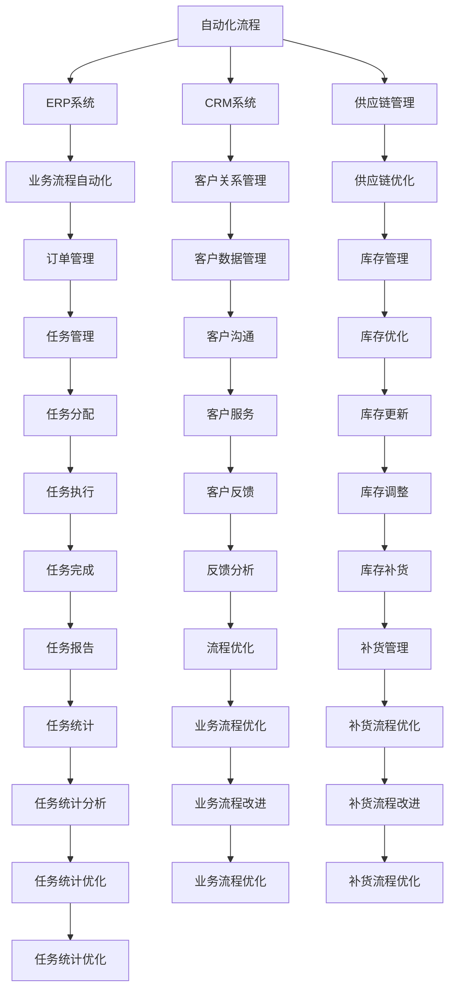

                 

# 未来自动化的挑战与机遇

## 1. 背景介绍

### 1.1 问题由来
随着人工智能(AI)和自动化技术的发展，许多传统行业正在经历深刻的变革。自动化技术使得机器能够在各种场景下取代人力，提高了生产效率和质量。然而，自动化技术的应用也带来了新的挑战和机遇。自动化技术在提升效率的同时，也引发了对工作岗位的冲击，甚至导致失业和收入不平等等社会问题。

### 1.2 问题核心关键点
自动化技术主要包括机器人、智能算法、自动化流程等。这些技术的应用范围从工业生产线到客服服务，再到金融、医疗、教育等各个领域，极大地提高了工作效率和决策准确性。

自动化技术的核心在于通过算法和机器学习模型，使得机器能够自主地执行复杂的任务，而无需人工干预。这种技术的发展，对产业升级、工作效率提升、成本降低等方面具有重要意义。

### 1.3 问题研究意义
研究未来自动化技术的挑战与机遇，对于理解技术的变革趋势、制定合理的政策、促进技术的可持续发展具有重要意义。

1. 推动产业升级：自动化技术可以帮助企业优化生产流程，提高产品质量，从而促进产业升级。
2. 提升工作效率：自动化技术使得许多重复性和繁琐的任务可以自动化执行，减轻人力负担，提升工作效率。
3. 降低成本：自动化技术可以大幅降低生产成本，提高资源利用率。
4. 社会影响：自动化技术对社会的影响需要得到重视，避免对就业和社会稳定的负面影响。
5. 技术进步：自动化技术的发展将推动相关技术领域的突破和创新，如机器人技术、智能算法等。

## 2. 核心概念与联系

### 2.1 核心概念概述

为更好地理解未来自动化技术的挑战与机遇，本节将介绍几个密切相关的核心概念：

- **自动化(Automation)**：通过使用机器和算法来替代人工操作的过程。自动化可以应用于各种场景，如生产线、客服、医疗、教育等。

- **机器人(Robotics)**：一种基于传感器、控制器、执行器的自主移动机器人。机器人可以通过编程、机器学习等技术执行复杂任务。

- **智能算法(Intelligent Algorithms)**：基于人工智能技术的算法，如深度学习、强化学习、遗传算法等，可以自主学习和决策。

- **自动化流程(Automated Processes)**：通过自动化软件和系统，实现业务流程的全自动处理。

- **人工智能(AI)**：一种使机器具备类似人类智能的技术，包括感知、学习、推理、决策等能力。

- **机器学习(Machine Learning, ML)**：使机器能够通过数据学习和预测未来的技术。

- **深度学习(Deep Learning, DL)**：一种基于神经网络的机器学习方法，可以处理大规模数据并自动提取特征。

- **强化学习(Reinforcement Learning, RL)**：通过奖励和惩罚机制，使机器能够自主学习和优化决策。

这些概念之间的关系可以通过以下Mermaid流程图来展示：



这个流程图展示了几大核心概念之间的关系：

1. 自动化技术通过机器人、智能算法、自动化流程等实现。
2. 机器人是自动化技术中的一种，可以进行自主移动和任务执行。
3. 智能算法包括深度学习、强化学习等，用于处理复杂任务。
4. 自动化流程通过业务流程自动化软件实现，提升工作效率和决策质量。
5. AI包括感知、学习、推理、决策等能力，是自动化技术的核心技术之一。
6. 机器学习是AI的一个重要分支，包括深度学习、强化学习等方法。

这些概念共同构成了未来自动化技术的基础框架，使得机器能够自主执行各种复杂任务。

### 2.2 概念间的关系

这些核心概念之间存在着紧密的联系，形成了未来自动化技术的完整生态系统。下面我们通过几个Mermaid流程图来展示这些概念之间的关系。

#### 2.2.1 自动化技术的应用范围



这个流程图展示了自动化技术在各个领域的应用范围：

1. 自动化技术可以应用于工业、农业、服务业等多个领域。
2. 工业生产线自动化通过机器人臂和机器人控制器实现。
3. 农业自动化通过无人机和农业监控实现。
4. 服务业自动化通过智能客服和聊天机器人实现。

#### 2.2.2 自动化流程的实现方式



这个流程图展示了自动化流程的实现方式：

1. 自动化流程通过ERP、CRM、供应链管理系统实现。
2. ERP系统实现业务流程自动化，订单管理和库存管理。
3. CRM系统实现客户关系管理，客户沟通和客户服务。
4. 供应链管理系统实现供应链优化，库存管理和补货管理。

#### 2.2.3 智能算法的核心技术

```mermaid
graph TB
    A[智能算法] --> B[深度学习]
    A --> C[强化学习]
    A --> D[遗传算法]
    B --> E[NLP模型]
    B --> F[图像识别模型]
    C --> G[游戏AI]
    C --> H[自适应控制]
    D --> I[模拟进化]
    E --> J[文本分类]
    E --> K[文本生成]
    F --> L[图像分类]
    F --> M[图像生成]
    G --> N[游戏策略生成]
    H --> O[自适应决策]
    I --> P[系统优化]
    J --> Q[文本分类]
    K --> R[文本生成]
    L --> S[图像分类]
    M --> T[图像生成]
    N --> U[游戏策略生成]
    O --> V[自适应决策]
    P --> W[系统优化]
    Q --> X[文本分类]
    R --> Y[文本生成]
    S --> Z[图像分类]
    T --> AA[图像生成]
    U --> AB[游戏策略生成]
    V --> AC[自适应决策]
    W --> AD[系统优化]
    X --> AE[文本分类]
    Y --> AF[文本生成]
    Z --> AG[图像分类]
    AA --> AH[图像生成]
    AB --> AI[游戏策略生成]
    AC --> AJ[自适应决策]
    AD --> AK[系统优化]
    AE --> AL[文本分类]
    AF --> AM[文本生成]
    AH --> AN[图像生成]
    AI --> AO[游戏策略生成]
    AJ --> AP[自适应决策]
    AK --> AQ[系统优化]
    AM --> AR[文本生成]
    AN --> AS[图像生成]
    AO --> AT[游戏策略生成]
    AP --> AU[自适应决策]
    AQ --> AV[系统优化]
    AR --> AW[文本生成]
    AS --> AX[图像生成]
    AT --> AY[游戏策略生成]
    AU --> AZ[自适应决策]
    AV --> BA[文本分类]
    AW --> BB[图像分类]
    AX --> BC[图像生成]
    AY --> BD[游戏策略生成]
    AZ --> BE[自适应决策]
    BA --> BF[文本分类]
    BB --> BG[图像分类]
    BC --> BH[图像生成]
    BD --> BI[游戏策略生成]
    BE --> BJ[自适应决策]
    BF --> BK[文本分类]
    BG --> BL[图像分类]
    BH --> BM[图像生成]
    BI --> BJ[游戏策略生成]
    BJ --> BL[自适应决策]
    BK --> BQ[文本分类]
    BL --> BM[图像分类]
    BM --> BN[图像生成]
    BJ --> BO[游戏策略生成]
    BQ --> BP[文本分类]
    BR --> BS[图像分类]
    BS --> BT[图像生成]
    BT --> BX[游戏策略生成]
    BP --> BY[自适应决策]
    BR --> BZ[图像分类]
    BS --> CA[图像生成]
    BT --> CB[游戏策略生成]
    BX --> CC[自适应决策]
    BY --> CZ[自适应决策]
    BZ --> DQ[文本分类]
    CA --> DA[图像分类]
    CB --> DC[图像生成]
    CC --> DD[自适应决策]
    CD --> DE[文本分类]
    CE --> DF[图像分类]
    CF --> DG[图像生成]
    CG --> DH[自适应决策]
    CH --> DI[文本分类]
    CI --> DJ[图像分类]
    CJ --> DK[图像生成]
    CK --> DL[自适应决策]
    CL --> DM[文本分类]
    CM --> DN[图像分类]
    CN --> DO[图像生成]
    CO --> DP[自适应决策]
    CP --> DQ[文本分类]
    CQ --> DR[图像分类]
    CR --> DS[图像生成]
    CS --> DT[自适应决策]
    CT --> DU[文本分类]
    CU --> DV[图像分类]
    CV --> DW[图像生成]
    CW --> DX[自适应决策]
    CX --> DY[文本分类]
    CY --> DZ[图像分类]
    DZ --> EA[图像生成]
    EA --> EB[游戏策略生成]
    EB --> EC[自适应决策]
    EC --> ED[系统优化]
    ED --> EE[业务流程优化]
    EE --> EF[任务统计优化]
    EF --> EG[流程改进]
    EG --> EH[任务分配]
    EH --> EI[任务执行]
    EI --> EJ[任务报告]
    EJ --> EK[任务统计]
    EK --> EL[流程优化]
    EL --> EM[业务流程改进]
    EM --> EN[任务统计分析]
    EN --> EO[流程改进]
    EO --> EP[任务执行]
    EP --> EQ[任务报告]
    EQ --> ER[任务统计]
    ER --> ES[流程优化]
    ES --> ET[业务流程改进]
    ET --> EU[任务统计分析]
    EU --> EV[流程改进]
    EV --> EW[任务执行]
    EW --> EX[任务报告]
    EX --> EY[任务统计]
    EY --> EZ[流程优化]
    EZ --> FA[业务流程改进]
    FA --> FB[任务统计分析]
    FB --> FC[任务执行]
    FC --> FD[任务报告]
    FD --> FE[任务统计]
    FE --> FF[流程优化]
    FF --> FG[业务流程改进]
    FG --> FH[任务统计分析]
    FH --> FI[任务执行]
    FI --> FJ[任务报告]
    FJ --> FK[任务统计]
    FK --> FL[流程优化]
    FL --> FM[业务流程改进]
    FM --> FN[任务统计分析]
    FN --> FO[流程改进]
    FO --> FP[任务执行]
    FP --> FQ[任务报告]
    FQ --> FR[任务统计]
    FR --> FS[流程优化]
    FS --> FT[业务流程改进]
    FT --> FU[任务统计分析]
    FU --> FV[流程改进]
    FV --> FW[任务执行]
    FW --> FX[任务报告]
    FX --> FY[任务统计]
    FY --> FZ[流程优化]
    FZ --> GA[业务流程改进]
    GA --> GB[任务统计分析]
    GB --> GC[任务执行]
    GC --> GD[任务报告]
    GD --> GE[任务统计]
    GE --> GF[流程优化]
    GF --> GG[业务流程改进]
    GG --> GH[任务统计分析]
    GH --> GI[任务执行]
    GI --> GJ[任务报告]
    GJ --> GK[任务统计]
    GK --> GL[流程优化]
    GL --> GM[业务流程改进]
    GM --> GN[任务统计分析]
    GN --> GO[流程改进]
    GO --> GP[任务执行]
    GP --> GQ[任务报告]
    GQ --> GR[任务统计]
    GR --> GS[流程优化]
    GS --> GT[业务流程改进]
    GT --> GU[任务统计分析]
    GU -->GV[流程改进]
    GV --> GW[任务执行]
    GW --> GX[任务报告]
    GX --> GY[任务统计]
    GY --> GZ[流程优化]
    GZ --> HA[业务流程改进]
    HA --> HB[任务统计分析]
    HB --> HC[任务执行]
    HC --> HD[任务报告]
    HD --> HE[任务统计]
    HE --> HF[流程优化]
    HF --> HG[业务流程改进]
    HG --> HH[任务统计分析]
    HH --> HI[任务执行]
    HI --> HJ[任务报告]
    HJ --> HK[任务统计]
    HK --> HL[流程优化]
    HL --> HM[业务流程改进]
    HM --> HN[任务统计分析]
    HN --> HO[流程改进]
    HO --> HP[任务执行]
    HP --> HQ[任务报告]
    HQ --> HR[任务统计]
    HR --> HS[流程优化]
    HS --> HT[业务流程改进]
    HT --> HU[任务统计分析]
    HU --> HV[流程改进]
    HV --> HW[任务执行]
    HW --> HX[任务报告]
    HX --> HY[任务统计]
    HY --> HZ[流程优化]
    HZ --> IA[业务流程改进]
    IA --> IB[任务统计分析]
    IB --> IC[任务执行]
    IC --> ID[任务报告]
    ID --> IE[任务统计]
    IE --> IF[流程优化]
    IF --> IG[业务流程改进]
    IG --> IH[任务统计分析]
    IH --> II[任务执行]
    II --> IJ[任务报告]
    IJ --> IK[任务统计]
    IK --> IL[流程优化]
    IL --> IM[业务流程改进]
    IM --> IN[任务统计分析]
    IN --> IO[流程改进]
    IO --> IP[任务执行]
    IP --> IQ[任务报告]
    IQ --> IR[任务统计]
    IR --> IS[流程优化]
    IS --> IT[业务流程改进]
    IT --> IU[任务统计分析]
    IU --> IV[流程改进]
    IV --> IW[任务执行]
    IW --> IX[任务报告]
    IX --> IY[任务统计]
    IY --> IZ[流程优化]
    IZ --> JA[业务流程改进]
    JA --> JB[任务统计分析]
    JB --> JC[任务执行]
    JC --> JD[任务报告]
    JD -->JE[任务统计]
    JE --> JF[流程优化]
    JF --> JG[业务流程改进]
    JG --> JH[任务统计分析]
    JH -->JI[任务执行]
    JI --> JJ[任务报告]
    JJ --> JK[任务统计]
    JK --> JL[流程优化]
    JL --> JM[业务流程改进]
    JM --> JN[任务统计分析]
    JN --> JO[流程改进]
    JO --> JP[任务执行]
    JP --> JQ[任务报告]
    JQ --> JR[任务统计]
    JR --> JS[流程优化]
    JS --> JT[业务流程改进]
    JT --> JU[任务统计分析]
    JU --> JV[流程改进]
    JV --> JW[任务执行]
    JW --> JX[任务报告]
    JX --> JY[任务统计]
    JY --> JZ[流程优化]
    JZ --> KA[业务流程改进]
    KA --> KB[任务统计分析]
    KB --> KC[任务执行]
    JC --> KD[任务报告]
    KD --> KE[任务统计]
    KE --> KF[流程优化]
    KF --> KG[业务流程改进]
    KG --> KH[任务统计分析]
    KH --> KI[任务执行]
    KI --> KJ[任务报告]
    KJ --> KK[任务统计]
    KK --> KL[流程优化]
    KL --> KM[业务流程改进]
    KM --> KN[任务统计分析]
    KN --> KO[流程改进]
    KO --> KP[任务执行]
    KP --> KQ[任务报告]
    KQ --> KR[任务统计]
    KR --> KS[流程优化]
    KS --> KT[业务流程改进]
    KT --> KU[任务统计分析]
    KU --> KV[流程改进]
    KV --> KW[任务执行]
    KW --> KX[任务报告]
    KX --> KY[任务统计]
    KY --> KZ[流程优化]
    KZ --> LA[业务流程改进]
    LA --> LB[任务统计分析]
    LB --> LC[任务执行]
    LC --> LD[任务报告]
    LD --> LE[任务统计]
    LE --> LF[流程优化]
    LF --> LG[业务流程改进]
    LG --> LH[任务统计分析]
    LH --> LI[任务执行]
    LI --> LJ[任务报告]
    LJ --> LK[任务统计]
    LK --> LL[流程优化]
    LL --> LM[业务流程改进]
    LM --> LN[任务统计分析]
    LN --> LO[流程改进]
    LO --> LP[任务执行]
    LP --> LQ[任务报告]
    LQ --> LR[任务统计]
    LR --> LS[流程优化]
    LS --> LT[业务流程改进]
    LT --> LU[任务统计分析]
    LU --> LV[流程改进]
    LV --> LW[任务执行]
    LW --> LX[任务报告]
    LX --> LY[任务统计]
    LY --> LZ[流程优化]
    LZ --> MA[业务流程改进]
    MA --> MB[任务统计分析]
    MB --> MC[任务执行]
    MC --> MD[任务报告]
    MD --> ME[任务统计]
    ME --> MF[流程优化]
    MF --> MG[业务流程改进]
    MG --> MH[任务统计分析]
    MH --> MI[任务执行]
    MI --> MJ[任务报告]
    MJ --> MK[任务统计]
    MK --> ML[流程优化]
    ML --> MM[业务流程改进]
    MM --> MN[任务统计分析]
    MN --> MO[流程改进]
    MO --> MP[任务执行]
    MP --> MQ[任务报告]
    MQ --> MR[任务统计]
    MR --> MS[流程优化]
    MS --> MT[业务流程改进]
    MT --> MU[任务统计分析]
    MU --> MV[流程改进]
    MV --> MW[任务执行]
    MW --> MX[任务报告]
    MX --> MY[任务统计]
    MY --> MZ[流程优化]
    MZ --> NA[业务流程改进]
    NA --> NB[任务统计分析]
    NB --> NC[任务执行]
    NC --> ND[任务报告]
    ND --> NE[任务统计]
    NE --> NF[流程优化]
    NF --> NG[业务流程改进]
    NG --> NH[任务统计分析]
    NH --> NI[任务执行]
    NI --> NJ[任务报告]
    NJ --> NK[任务统计]
    NK --> NL[流程优化]
    NL --> NM[业务流程改进]
    NM --> NN[任务统计分析]
    NN --> NO[流程改进]
    NO --> NP[任务执行]
    NP --> NQ[任务报告]
    NQ --> NR[任务统计]
    NR --> NS[流程优化]
    NS --> NT[业务流程改进]
    NT --> NU[任务统计分析]
    NU --> NV[流程改进]
    NV --> NW[任务执行]
    NW --> NX[任务报告]
    NX --> NY[任务统计]
    NY --> NZ[流程优化]
    NZ --> OA[业务流程改进]
    OA --> OB[任务统计分析]
    OB --> OC[任务执行]
    OC --> OD[任务报告]
    OD --> OE[任务统计]
    OE --> OF[流程优化]
    OF --> OG[业务流程改进]
    OG --> OH[任务统计分析]
    OH --> OI[任务执行]
    OI --> OJ[任务报告]
    OJ --> OK[任务统计]
    OK --> OL[流程优化]
    OL --> OM[业务流程改进]
    OM --> ON[任务统计分析]
    ON --> OO[流程改进]
    OO --> OP[任务执行]
    OP --> OQ[任务报告]
    OQ --> OR[任务统计]
    OR --> OS[流程优化]
    OS --> OT[业务流程改进]
    OT --> OU[任务统计分析]
    OU -->OV[流程改进]
    OV --> OW[任务执行]
    OW -->OX[任务报告]
    OX --> OY[任务统计]
    OY -->OZ[流程优化]
    OZ --> PA[业务流程改进]
    PA --> PB[任务统计分析]
    PB --> PC[任务执行]
    PC --> PD[任务报告]
    PD --> PE[任务统计]
    PE --> PF[流程优化]
    PF --> PG[业务流程改进]
    PG --> PH[任务统计分析]
    PH --> PI[任务执行]
    PI --> PJ[任务报告]
    PJ --> PK[任务统计]
    PK --> PL[流程优化]
    PL --> PM[业务流程改进]
    PM --> PN[任务统计分析]
    PN --> PO[流程改进]
    PO --> PP[任务执行]
    PP --> PQ[任务报告]
    PQ --> PR[任务统计]
    PR --> PS[流程优化]
    PS --> PT[业务流程改进]
    PT -->PU[任务统计分析]
    PU -->PV[流程改进]
    PV -->PW[任务执行]
    PW --> PX[任务报告]
    PX --> PY[任务统计]
    PY --> PZ[流程优化]
    PZ --> QA[业务流程改进]
    QA --> QB[任务统计分析]
    QB --> QC[任务执行]
    QC --> QD[任务报告]
    QD --> QE[任务统计]
    QE --> QF[流程优化]
    QF --> QG[业务流程改进]
    QG --> QH[任务统计分析]
    QH --> QI[任务执行]
    QI --> QJ[任务报告]
    QJ --> QK[任务统计]
    QK --> QL[流程优化]
    QL --> QM[业务流程改进]
    QM --> QN[任务统计分析]
    QN --> QO[流程改进]
    QO --> QP[任务执行]
    QP --> QQ[任务报告]
    QQ --> QR[任务统计]
    QR --> QS[流程优化]
    QS --> QT[业务流程改进]
    QT --> QU[任务统计分析]
    QU --> QV[流程改进]
    QV --> QW[任务执行]
    QW --> QX[任务报告]
    QX --> QY[任务统计]
    QY --> QZ[流程优化]
    QZ --> RA[业务流程改进]
    RA --> RB[任务统计分析]
    RB --> RC[任务执行]
    RC --> RD[任务报告]
    RD --> RE[任务统计]
    RE --> RF[流程优化]
    RF --> RG[业务流程改进]
    RG --> RH[任务统计分析]
    RH --> RI[任务执行]
    RI --> RJ[任务报告]
    RJ --> RK[任务统计]
    RK --> RL[流程优化]
    RL --> RM[业务流程改进]
    RM --> RN[任务统计分析]
    RN --> RO[流程改进]
    RO --> RP[任务执行]
    RP --> RQ[任务报告]
    RQ --> RR[任务统计]
    RR --> RS[流程优化

