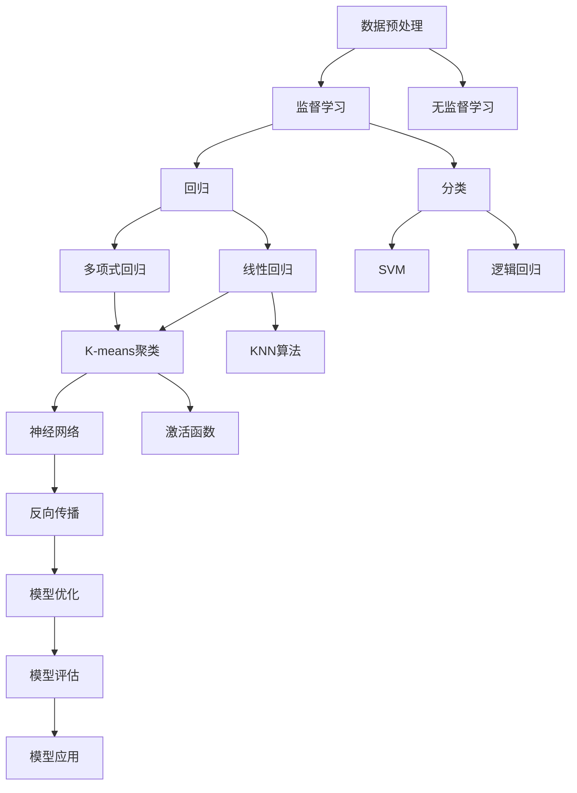

                 

# 机器学习 原理与代码实例讲解

> 关键词：机器学习, 数学模型, 算法原理, 数据处理, 代码实例

## 1. 背景介绍

### 1.1 问题由来
机器学习（Machine Learning, ML）是人工智能（Artificial Intelligence, AI）的重要分支，旨在通过算法和统计模型，从数据中自动学习和改进性能。它的核心思想是利用历史数据，训练模型预测新数据的输出，从而实现自动化决策和智能推断。

机器学习在金融、医疗、工业、农业等多个领域中得到了广泛应用，帮助这些行业提升了决策效率，降低了运营成本，提高了产品质量。例如，金融行业利用机器学习算法进行风险评估、欺诈检测；医疗行业通过机器学习模型进行疾病诊断、药物研发；工业领域利用机器学习进行质量控制、设备预测维护等。

随着数据的爆炸性增长和计算能力的提升，机器学习技术正在迅速发展，新的模型、算法和应用不断涌现。但是，机器学习的复杂性和技术门槛，使得很多技术人员难以深入理解其核心原理和应用实践。

因此，本文旨在通过系统讲解机器学习的数学模型和代码实现，帮助读者全面掌握这一技术，从而应用于实际项目中。

### 1.2 问题核心关键点
本文将详细介绍机器学习的核心概念和算法原理，包括：
1. 监督学习与无监督学习的基本原理和区别。
2. 线性回归和逻辑回归的数学模型及其代码实现。
3. 决策树与随机森林的算法流程及代码示例。
4. 支持向量机（SVM）的优化算法及应用场景。
5. 神经网络的激活函数和反向传播算法。
6. K-means聚类算法和KNN算法的数学模型及代码实例。

此外，本文还将通过代码实例，展示这些算法的实际应用效果，并结合实际项目中的问题，提出具体的解决方案。

### 1.3 问题研究意义
掌握机器学习技术，对于提升企业的智能化水平，优化运营决策，具有重要意义：
1. 提高决策效率。机器学习模型能够自动处理大量数据，减少人工干预，提高决策速度和准确性。
2. 降低运营成本。通过自动化流程，机器学习能够减少人力和物力资源的消耗。
3. 优化产品设计。利用机器学习进行用户行为分析，能够帮助企业更好地了解市场需求，优化产品设计。
4. 增强竞争力。掌握机器学习技术，使企业在市场中处于领先地位，提高竞争力。
5. 推动技术创新。机器学习是当前AI领域最前沿的技术之一，掌握机器学习能够加速技术创新和应用。

## 2. 核心概念与联系

### 2.1 核心概念概述

机器学习涉及多个核心概念，下面将逐一介绍：

1. **监督学习**（Supervised Learning）：一种利用标注数据训练模型，使其能够对未知数据进行预测的机器学习方法。监督学习包括回归和分类两个主要类别。

2. **无监督学习**（Unsupervised Learning）：一种利用未标注数据训练模型，使其能够自动发现数据结构或分布的机器学习方法。无监督学习包括聚类和降维两个主要类别。

3. **回归**（Regression）：一种监督学习方法，旨在预测连续型数值变量。常见的回归算法包括线性回归和多项式回归。

4. **分类**（Classification）：一种监督学习方法，旨在将数据分为不同的类别。常见的分类算法包括逻辑回归和支持向量机（SVM）。

5. **决策树**（Decision Tree）：一种基于树形结构进行决策的算法，适合于分类和回归问题。

6. **随机森林**（Random Forest）：一种集成学习算法，通过组合多个决策树进行分类和回归，提升模型性能。

7. **神经网络**（Neural Network）：一种模拟人脑神经元结构的前馈网络，适合于处理复杂的非线性关系。

8. **激活函数**（Activation Function）：神经网络中用于引入非线性关系的函数，如sigmoid函数和ReLU函数。

9. **反向传播**（Backpropagation）：神经网络中用于优化模型参数的算法，通过链式法则计算梯度。

10. **K-means聚类**（K-means Clustering）：一种基于距离的聚类算法，用于发现数据中的群体结构。

11. **KNN算法**（K-Nearest Neighbors）：一种基于相似度的分类算法，用于对新数据进行分类。

这些概念通过机器学习的学习流程（数据预处理、模型训练、模型评估和模型应用）紧密联系在一起，形成一个完整的机器学习系统。

### 2.2 概念间的关系

这些核心概念之间的关系可以通过以下Mermaid流程图来展示：

这个流程图展示了大机器学习流程中各个核心概念的相互关系：

1. 数据预处理：对原始数据进行清洗、归一化等处理，以提高模型训练效果。
2. 监督学习：利用标注数据训练模型，使模型能够对未知数据进行预测。
3. 无监督学习：利用未标注数据训练模型，自动发现数据结构或分布。
4. 回归和分类：监督学习的两个主要类别，分别用于预测连续型和离散型变量。
5. 决策树和随机森林：基于树形结构进行决策和分类的方法。
6. 神经网络：处理复杂非线性关系的前馈网络。
7. 激活函数和反向传播：神经网络中的关键组件，用于引入非线性关系和优化模型参数。
8. 聚类和分类：无监督学习的两个主要类别，分别用于发现数据中的群体结构和进行分类。
9. 模型优化和应用：将训练好的模型应用于实际问题中，并根据需要进行优化。

这些概念共同构成了机器学习的基本框架，通过它们之间的相互作用，机器学习模型能够从数据中自动学习和改进性能。

## 3. 核心算法原理 & 具体操作步骤
### 3.1 算法原理概述

机器学习的核心算法原理包括：
- 监督学习算法：利用标注数据训练模型，使其能够对未知数据进行预测。
- 无监督学习算法：利用未标注数据训练模型，使其能够自动发现数据结构或分布。

监督学习算法可以分为回归和分类两个主要类别，其中回归算法用于预测连续型数值变量，分类算法用于将数据分为不同的类别。常见的监督学习算法包括线性回归、多项式回归、逻辑回归和支持向量机（SVM）。

无监督学习算法可以分为聚类和降维两个主要类别，其中聚类算法用于发现数据中的群体结构，降维算法用于降低数据维度。常见的无监督学习算法包括K-means聚类和KNN算法。

神经网络是一种处理复杂非线性关系的前馈网络，由多个神经元（节点）组成。神经网络的激活函数和反向传播算法用于引入非线性关系和优化模型参数。

### 3.2 算法步骤详解

#### 3.2.1 线性回归

线性回归是一种最简单的回归算法，用于预测连续型数值变量。其基本思路是通过拟合数据点，建立一个线性方程，用于预测新的数据点。

线性回归的步骤如下：
1. 数据预处理：对原始数据进行清洗、归一化等处理。
2. 模型训练：利用标注数据训练模型，最小化预测值与真实值之间的误差。
3. 模型评估：在测试集上评估模型性能，计算均方误差等指标。
4. 模型应用：将训练好的模型应用于新数据，预测连续型数值变量。

#### 3.2.2 逻辑回归

逻辑回归是一种最简单的分类算法，用于将数据分为两个或多个类别。其基本思路是通过拟合数据点，建立一个逻辑函数，用于预测新的数据点属于哪个类别。

逻辑回归的步骤如下：
1. 数据预处理：对原始数据进行清洗、归一化等处理。
2. 模型训练：利用标注数据训练模型，最小化预测值与真实值之间的误差。
3. 模型评估：在测试集上评估模型性能，计算准确率等指标。
4. 模型应用：将训练好的模型应用于新数据，预测数据所属的类别。

#### 3.2.3 决策树

决策树是一种基于树形结构进行决策的算法，适合于分类和回归问题。其基本思路是通过树形结构进行决策，每个节点代表一个属性，每个分支代表一个决策结果。

决策树的步骤如下：
1. 数据预处理：对原始数据进行清洗、归一化等处理。
2. 模型训练：利用标注数据训练决策树，通过贪心算法选择最优节点。
3. 模型评估：在测试集上评估模型性能，计算准确率等指标。
4. 模型应用：将训练好的决策树应用于新数据，进行分类或回归。

#### 3.2.4 随机森林

随机森林是一种集成学习算法，通过组合多个决策树进行分类和回归，提升模型性能。其基本思路是通过随机选择数据和特征，训练多个决策树，通过投票或平均值进行分类或回归。

随机森林的步骤如下：
1. 数据预处理：对原始数据进行清洗、归一化等处理。
2. 模型训练：利用标注数据训练多个决策树，随机选择数据和特征。
3. 模型评估：在测试集上评估模型性能，计算准确率等指标。
4. 模型应用：将训练好的随机森林应用于新数据，进行分类或回归。

#### 3.2.5 支持向量机（SVM）

支持向量机是一种基于最大边界分类的算法，适合于分类和回归问题。其基本思路是通过寻找最优的超平面，将数据分为两个或多个类别。

支持向量机的步骤如下：
1. 数据预处理：对原始数据进行清洗、归一化等处理。
2. 模型训练：利用标注数据训练支持向量机，最小化预测值与真实值之间的误差。
3. 模型评估：在测试集上评估模型性能，计算准确率等指标。
4. 模型应用：将训练好的支持向量机应用于新数据，进行分类或回归。

#### 3.2.6 神经网络

神经网络是一种处理复杂非线性关系的前馈网络，由多个神经元（节点）组成。其基本思路是通过多层神经元进行数据处理，每个神经元计算加权和并引入非线性关系，最终输出预测结果。

神经网络的步骤如下：
1. 数据预处理：对原始数据进行清洗、归一化等处理。
2. 模型训练：利用标注数据训练神经网络，最小化预测值与真实值之间的误差。
3. 模型评估：在测试集上评估模型性能，计算准确率等指标。
4. 模型应用：将训练好的神经网络应用于新数据，进行分类或回归。

#### 3.2.7 K-means聚类

K-means聚类是一种基于距离的聚类算法，用于发现数据中的群体结构。其基本思路是通过计算数据点之间的距离，将数据点分为K个簇。

K-means聚类的步骤如下：
1. 数据预处理：对原始数据进行清洗、归一化等处理。
2. 模型训练：利用未标注数据训练K-means聚类，计算数据点之间的距离，将数据点分为K个簇。
3. 模型评估：在测试集上评估模型性能，计算簇内离散度等指标。
4. 模型应用：将训练好的K-means聚类应用于新数据，进行聚类分析。

#### 3.2.8 KNN算法

KNN算法是一种基于相似度的分类算法，用于对新数据进行分类。其基本思路是通过计算数据点之间的距离，找到与新数据点最相似的K个数据点，利用这K个数据点的类别进行分类。

KNN算法的步骤如下：
1. 数据预处理：对原始数据进行清洗、归一化等处理。
2. 模型训练：利用未标注数据训练KNN算法，计算数据点之间的距离，建立相似度矩阵。
3. 模型评估：在测试集上评估模型性能，计算准确率等指标。
4. 模型应用：将训练好的KNN算法应用于新数据，进行分类。

### 3.3 算法优缺点

不同的机器学习算法有不同的优缺点，需要根据具体问题选择合适的算法。下面将详细介绍几种常见算法的优缺点：

#### 3.3.1 线性回归

优点：
- 计算简单，易于实现。
- 适用于线性关系的数据。

缺点：
- 对异常值敏感。
- 不能处理非线性关系的数据。

#### 3.3.2 逻辑回归

优点：
- 计算简单，易于实现。
- 适用于二分类问题。

缺点：
- 对异常值敏感。
- 不能处理多分类问题。

#### 3.3.3 决策树

优点：
- 易于理解和解释。
- 适用于处理非线性关系的数据。

缺点：
- 容易过拟合。
- 不能处理连续型数值变量。

#### 3.3.4 随机森林

优点：
- 集成学习，具有较高的准确率。
- 适用于处理非线性关系的数据。

缺点：
- 计算复杂，需要较多的计算资源。
- 对异常值敏感。

#### 3.3.5 支持向量机（SVM）

优点：
- 具有较高的准确率和泛化能力。
- 适用于处理高维数据。

缺点：
- 计算复杂，需要较多的计算资源。
- 对异常值敏感。

#### 3.3.6 神经网络

优点：
- 适用于处理复杂的非线性关系。
- 具有较高的准确率和泛化能力。

缺点：
- 计算复杂，需要较多的计算资源。
- 容易过拟合。

#### 3.3.7 K-means聚类

优点：
- 计算简单，易于实现。
- 适用于处理大规模数据。

缺点：
- 对初始点的选择敏感。
- 不能处理非凸形状的簇。

#### 3.3.8 KNN算法

优点：
- 计算简单，易于实现。
- 适用于处理小规模数据。

缺点：
- 计算复杂，需要较多的计算资源。
- 对异常值敏感。

### 3.4 算法应用领域

机器学习技术已经广泛应用于金融、医疗、工业、农业等多个领域，具体应用如下：

1. **金融领域**：利用机器学习进行风险评估、欺诈检测、股票预测等。

2. **医疗领域**：利用机器学习进行疾病诊断、药物研发、医学影像分析等。

3. **工业领域**：利用机器学习进行质量控制、设备预测维护、供应链管理等。

4. **农业领域**：利用机器学习进行作物病虫害检测、土壤分析、农业生产优化等。

5. **零售领域**：利用机器学习进行客户行为分析、推荐系统、库存管理等。

6. **交通领域**：利用机器学习进行交通流量预测、自动驾驶、智能交通管理等。

7. **能源领域**：利用机器学习进行电力负荷预测、能源消耗分析、智能电网等。

以上应用领域展示了机器学习技术在不同行业中的广泛应用，未来随着技术的发展和算力的提升，机器学习还将拓展到更多领域，带来更多创新和价值。

## 4. 数学模型和公式 & 详细讲解 & 举例说明

### 4.1 数学模型构建

#### 4.1.1 线性回归

线性回归的数学模型可以表示为：
$$ y = \beta_0 + \beta_1 x_1 + \beta_2 x_2 + \cdots + \beta_n x_n + \epsilon $$
其中，$y$为预测值，$x_1, x_2, \cdots, x_n$为自变量，$\beta_0, \beta_1, \beta_2, \cdots, \beta_n$为回归系数，$\epsilon$为随机误差。

#### 4.1.2 逻辑回归

逻辑回归的数学模型可以表示为：
$$ P(y=1|x) = \frac{1}{1+e^{-z}} $$
其中，$P(y=1|x)$为预测值，$x$为自变量，$z = \beta_0 + \beta_1 x_1 + \beta_2 x_2 + \cdots + \beta_n x_n$为线性函数，$\beta_0, \beta_1, \beta_2, \cdots, \beta_n$为回归系数。

#### 4.1.3 决策树

决策树的数学模型可以表示为：
$$ y = f(x) = \left\{
\begin{array}{ll}
c_1 & \text{if} \quad x_1 > s_1 \\
c_2 & \text{if} \quad x_1 \leq s_1
\end{array}
\right. $$
其中，$y$为预测值，$x_1$为自变量，$s_1$为分割点，$c_1$和$c_2$为两个子节点的类别。

#### 4.1.4 随机森林

随机森林的数学模型可以表示为：
$$ y = f(x) = \frac{1}{N} \sum_{i=1}^N f_i(x) $$
其中，$y$为预测值，$x$为自变量，$f_i(x)$为第$i$棵决策树的预测值，$N$为决策树的数量。

#### 4.1.5 支持向量机（SVM）

支持向量机的数学模型可以表示为：
$$ \hat{y} = \sum_{i=1}^N \alpha_i y_i K(x, x_i) + b $$
其中，$\hat{y}$为预测值，$x$为自变量，$y$为标签，$\alpha_i$为拉格朗日乘子，$K(x, x_i)$为核函数，$b$为截距。

#### 4.1.6 神经网络

神经网络的数学模型可以表示为：
$$ z_i = \sum_{j=1}^m w_{ij} x_j + b_i $$
$$ a_i = \sigma(z_i) $$
$$ z_{i+1} = \sum_{j=1}^m w_{i+1j} a_j + b_{i+1} $$
其中，$z_i$为加权和，$a_i$为激活函数，$w_{ij}$为权重，$b_i$为偏置，$m$为神经元数量，$i$为层数。

#### 4.1.7 K-means聚类

K-means聚类的数学模型可以表示为：
$$ K = \arg\min_{K} \sum_{i=1}^n \min_{j} ||x_i - \mu_j||^2 $$
其中，$K$为簇的数量，$x_i$为数据点，$\mu_j$为簇的中心。

#### 4.1.8 KNN算法

KNN算法的数学模型可以表示为：
$$ \hat{y} = \text{arg}\min_{k} ||x - x_k|| $$
其中，$\hat{y}$为预测值，$x$为测试点，$x_k$为训练点，$k$为距离最近的训练点数量。

### 4.2 公式推导过程

#### 4.2.1 线性回归

线性回归的损失函数可以表示为：
$$ L = \frac{1}{2n} \sum_{i=1}^n (y_i - \hat{y}_i)^2 $$
其中，$L$为损失函数，$y_i$为真实值，$\hat{y}_i$为预测值，$n$为样本数量。

线性回归的梯度下降算法可以表示为：
$$ w_i = w_i - \eta \frac{\partial L}{\partial w_i} $$
其中，$w_i$为回归系数，$\eta$为学习率。

#### 4.2.2 逻辑回归

逻辑回归的损失函数可以表示为：
$$ L = -\frac{1}{n} \sum_{i=1}^n (y_i \log \hat{y}_i + (1 - y_i) \log (1 - \hat{y}_i)) $$
其中，$L$为损失函数，$y_i$为真实值，$\hat{y}_i$为预测值，$n$为样本数量。

逻辑回归的梯度下降算法可以表示为：
$$ w_i = w_i - \eta \frac{\partial L}{\partial w_i} $$
其中，$w_i$为回归系数，$\eta$为学习率。

#### 4.2.3 决策树

决策树的训练算法可以表示为：
$$ \text{arg}\min_{c} \sum_{i=1}^n L_i(c) $$
其中，$L_i(c)$为样本$i$的损失函数，$c$为分类结果。

#### 4.2.4 随机森林

随机森林的训练算法可以表示为：
$$ \text{arg}\min_{F} \sum_{i=1}^n L_i(F) $$
其中，$L_i(F)$为样本$i$的损失函数，$F$为随机森林模型。

#### 4.2.5 支持向量机（SVM）

支持向量机的训练算法可以表示为：
$$ \text{arg}\min_{\alpha} \frac{1}{2} \sum_{i=1}^N \sum_{j=1}^N \alpha_i \alpha_j y_i y_j K(x_i, x_j) - \sum_{i=1}^N \alpha_i $$
$$ s.t. \sum_{i=1}^N \alpha_i y_i = 0 $$
$$ 0 \leq \alpha_i \leq C $$
其中，$\alpha$为拉格朗日乘子，$y_i$为标签，$K(x_i, x_j)$为核函数，$C$为惩罚系数。

#### 4.2.6 神经网络

神经网络的训练算法可以表示为：
$$ w_i = w_i - \eta \frac{\partial L}{\partial w_i} $$
其中，$w_i$为权重，$\eta$为学习率，$L$为损失函数。

#### 4.2.7 K-means聚类

K-means聚类的训练算法可以表示为：
$$ \text{arg}\min_{K} \sum_{i=1}^n \min_{j} ||x_i - \mu_j||^2 $$
其中，$K$为簇的数量，$x_i$为数据点，$\mu_j$为簇的中心。

#### 4.2.8 KNN算法

KNN算法的训练算法可以表示为：
$$ \text{arg}\min_{k} ||x - x_k|| $$
其中，$x$为测试点，$x_k$为训练点，$k$为距离最近的训练点数量。

### 4.3 案例分析与讲解

#### 4.3.1 线性回归

假设我们要预测房价，训练数据集包含房屋面积$x_1$、卧室数量$x_2$和卫生间数量$x_3$，以及对应的房价$y$。

- 数据预处理：将数据归一化。
- 模型训练：利用线性回归模型训练模型，得到回归系数$\beta_0, \beta_1, \beta_2, \beta_3$。
- 模型评估：在测试集上评估模型性能，计算均方误差。
- 模型应用：将训练好的模型应用于新数据，预测房价。

#### 4.3.2 逻辑回归

假设我们要对客户进行分类，训练数据集包含年龄$x_1$、收入$x_2$和购买行为$x_3$，以及对应的分类标签$y$。

- 数据预处理：将数据归一化。
- 模型训练：利用逻辑回归模型训练模型，得到回归系数$\beta_0, \beta_1, \beta_2, \beta_3$。
- 模型评估：在测试集上评估模型性能，计算准确率。
- 模型应用：将训练好的模型应用于新数据，进行分类。

#### 4.3.3 决策树

假设我们要对学生进行分类，训练数据集包含年龄$x_1$、性别$x_2$和成绩$x_3$，以及对应的分类标签$y$。

- 数据预处理：将数据归一化。
- 模型训练：利用决策树模型训练模型，得到分割点和类别。
- 模型评估：在测试集上评估模型性能，计算准确率。
- 模型应用：将训练好的模型应用于新数据，进行分类。

#### 4.3.4 随机森林

假设我们要对客户进行分类，训练数据集包含年龄$x_1$、收入$x_2$和购买行为$x_3$，以及对应的分类标签$y$。

- 数据预处理：将数据归一化。
- 模型训练：利用随机森林模型训练模型，得到决策树数量和特征。
- 模型评估：在测试集上评估模型性能，计算准确率。
- 模型应用：将训练好的模型应用于新数据，进行分类。

#### 4.3.5 支持向量机（S

