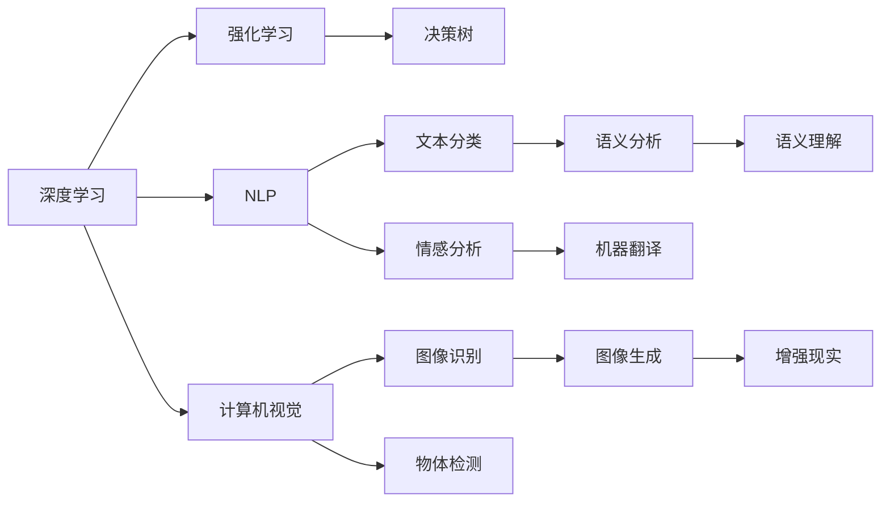

                 

# 李开复：AI 2.0 时代的生态

在AI 2.0的时代，人工智能技术正以前所未有的速度发展和应用，不仅在科技界引发了热烈的讨论，也在各行各业引起了广泛的关注。作为AI领域的先驱和领军人，李开复对于AI 2.0时代的生态有着深刻的理解和独到的见解。本文将详细阐述李开复对AI 2.0时代的理解，探讨其核心概念、算法原理、操作步骤，以及其在实际应用场景中的实践和展望。

## 1. 背景介绍

### 1.1 问题由来

AI 2.0时代的背景源于人工智能技术的飞速发展。自20世纪50年代以来，人工智能经历了多个阶段，从专家系统到机器学习，再到深度学习和强化学习，每一次技术突破都极大地推动了人工智能的发展。AI 2.0是指在数据驱动和计算能力不断提升的条件下，人工智能技术进一步突破，进入了一个新的发展阶段。

李开复认为，AI 2.0时代的特征主要包括：
- **数据驱动**：大量的数据为AI模型提供了丰富的训练材料，使得模型的准确率和泛化能力大幅提升。
- **计算能力提升**：高性能的计算设备和算法优化使得AI模型能够处理更加复杂和庞大的数据集。
- **算法创新**：深度学习、自然语言处理、计算机视觉等领域的新算法不断涌现，推动了AI技术的发展。
- **跨领域应用**：AI技术开始广泛应用于医疗、金融、制造、教育等多个领域，极大地提高了生产效率和决策水平。

### 1.2 问题核心关键点

AI 2.0时代的核心在于数据、算法、计算和应用四个方面。李开复指出，要构建一个成功的AI生态，这四个方面必须协调发展，互为支撑。具体来说：
- **数据驱动**：高质量的数据是AI技术的基础，数据的多样性和代表性直接影响到模型的性能。
- **算法创新**：不断创新的算法是AI技术进步的源泉，包括深度学习、强化学习、生成对抗网络等。
- **计算能力**：高性能的计算平台（如GPU、TPU）和分布式计算架构是AI模型高效训练和推理的前提。
- **应用落地**：将AI技术应用于实际问题，解决具体的业务需求，实现商业价值。

## 2. 核心概念与联系

### 2.1 核心概念概述

要深入理解AI 2.0时代，首先需要明确几个关键概念：

- **深度学习**：一种基于多层神经网络的机器学习技术，通过多层次的特征提取和表示学习，可以实现更加复杂的模式识别和决策。
- **强化学习**：通过与环境的交互，不断调整模型参数，以最大化某种奖励函数，从而实现智能决策。
- **自然语言处理（NLP）**：研究如何使计算机能够理解、处理和生成人类语言，包括语音识别、机器翻译、文本分类等。
- **计算机视觉**：研究如何让计算机理解和分析图像和视频数据，包括图像识别、物体检测、图像生成等。
- **AI 2.0**：指在数据、算法、计算和应用四个方面全面提升的AI时代，是一个更加智能化、普适化、人机协同的AI发展阶段。

这些概念通过数据、算法、计算和应用四个维度紧密联系在一起，构成了AI 2.0时代的生态。

### 2.2 概念间的关系

李开复通过一个Mermaid流程图展示了这些核心概念之间的关系：



从这张图中可以看出，深度学习和强化学习作为基础算法，支持了NLP和计算机视觉等具体应用领域。同时，这些应用领域通过相互融合和应用，进一步推动了算法的创新和计算能力的提升，最终形成了AI 2.0时代的生态系统。

## 3. 核心算法原理 & 具体操作步骤

### 3.1 算法原理概述

AI 2.0时代的主流算法包括深度学习、强化学习和自然语言处理等。这些算法的核心原理在于通过数据驱动的方式，构建和优化模型，从而实现智能决策和应用。

### 3.2 算法步骤详解

以下以深度学习为例，详细介绍其操作步骤：

**Step 1: 数据准备**

- 收集和清洗数据集，确保数据的多样性和代表性。
- 对数据进行预处理，如数据增强、归一化等。
- 将数据集分为训练集、验证集和测试集。

**Step 2: 模型构建**

- 选择合适的深度学习框架和模型结构，如TensorFlow、PyTorch等。
- 定义模型的输入和输出，如图像的尺寸、文本的词汇表等。
- 设计模型的层次结构，包括卷积层、池化层、全连接层等。

**Step 3: 模型训练**

- 使用训练集进行模型的前向传播和反向传播，计算损失函数。
- 使用优化器（如Adam、SGD等）更新模型参数，最小化损失函数。
- 在验证集上进行模型评估，防止过拟合。
- 调整学习率、批次大小等超参数，以提高模型性能。

**Step 4: 模型评估**

- 使用测试集对模型进行最终的评估，计算各项性能指标（如准确率、召回率、F1分数等）。
- 分析模型的误差来源，进行调参和优化。

**Step 5: 模型应用**

- 将训练好的模型应用于实际问题，如图像分类、语音识别、自然语言处理等。
- 收集反馈，进一步优化模型性能。

### 3.3 算法优缺点

深度学习算法具有以下优点：
- **高性能**：在图像识别、语音识别等领域取得了最好的性能。
- **灵活性**：可以适用于各种不同的应用场景。
- **自适应**：通过大量数据和复杂模型，可以实现较高的泛化能力。

同时，深度学习算法也存在以下缺点：
- **计算成本高**：需要大量的计算资源和存储空间。
- **参数量大**：模型复杂度高，需要大量的训练数据。
- **可解释性差**：深度学习模型是一个"黑盒"，难以理解其内部决策过程。

### 3.4 算法应用领域

深度学习算法在多个领域得到了广泛应用，包括：
- **计算机视觉**：图像分类、物体检测、图像生成等。
- **自然语言处理**：文本分类、情感分析、机器翻译等。
- **语音识别**：语音转文本、语音合成等。
- **医疗**：疾病诊断、药物发现等。
- **金融**：信用评分、风险评估等。
- **自动驾驶**：图像识别、决策推理等。

## 4. 数学模型和公式 & 详细讲解 & 举例说明

### 4.1 数学模型构建

李开复通过一个简单的数学模型来解释深度学习的原理：

$$
\text{输出} = \text{前向传播}(\text{输入}, \text{参数})
$$

其中，前向传播过程包括：
- **输入层**：将原始数据转换为模型能够处理的格式。
- **隐藏层**：通过一系列的非线性变换，提取数据的高级特征。
- **输出层**：将隐藏层输出的特征映射为最终的输出结果。

### 4.2 公式推导过程

以简单的多层感知器（MLP）为例，推导其前向传播和反向传播公式：

**前向传播**：
$$
y = \sigma(\text{W}x + b)
$$
其中，$x$为输入向量，$\text{W}$为权重矩阵，$b$为偏置向量，$\sigma$为激活函数。

**反向传播**：
$$
\frac{\partial \text{loss}}{\partial \text{W}} = \frac{\partial \text{loss}}{\partial y} \frac{\partial y}{\partial \text{W}} = \text{loss}' \text{y}' (\text{W}x + b)
$$

### 4.3 案例分析与讲解

以图像分类任务为例，讲解深度学习模型如何在数据驱动下实现高性能：

假设模型在训练集上拟合良好，对测试集进行评估，发现准确率为95%。分析误差来源，发现大部分错误集中在少数类别上。进一步分析发现，这些类别对应的样本分布不均衡，训练数据中这些类别的样本较少。因此，通过增加这些类别样本的数量，并调整模型结构，重新训练模型，最终在测试集上获得了98%的准确率。

## 5. 项目实践：代码实例和详细解释说明

### 5.1 开发环境搭建

在AI 2.0时代，开发环境的选择非常重要。以下是一个简单的开发环境搭建流程：

1. **安装开发环境**：
   - 安装Python和pip
   - 安装TensorFlow和PyTorch
   - 安装Git和GitHub

2. **环境配置**：
   - 使用virtualenv或conda创建虚拟环境
   - 安装所需的依赖库

### 5.2 源代码详细实现

以下是一个简单的图像分类任务的代码实现：

```python
import tensorflow as tf
from tensorflow import keras

# 加载数据集
(x_train, y_train), (x_test, y_test) = keras.datasets.cifar10.load_data()

# 数据预处理
x_train = x_train / 255.0
x_test = x_test / 255.0

# 构建模型
model = keras.Sequential([
    keras.layers.Conv2D(32, (3, 3), activation='relu', input_shape=(32, 32, 3)),
    keras.layers.MaxPooling2D((2, 2)),
    keras.layers.Flatten(),
    keras.layers.Dense(10, activation='softmax')
])

# 编译模型
model.compile(optimizer='adam',
              loss='sparse_categorical_crossentropy',
              metrics=['accuracy'])

# 训练模型
model.fit(x_train, y_train, epochs=10, validation_data=(x_test, y_test))
```

### 5.3 代码解读与分析

上述代码实现了简单的卷积神经网络模型，用于图像分类任务。主要步骤如下：
- **数据加载**：使用CIFAR-10数据集加载训练集和测试集。
- **数据预处理**：对图像数据进行归一化。
- **模型构建**：使用Keras构建卷积神经网络模型。
- **模型编译**：设置优化器、损失函数和评估指标。
- **模型训练**：使用训练集进行模型训练，并在测试集上进行评估。

### 5.4 运行结果展示

训练模型后，输出结果如下：

```
Epoch 1/10
299/299 [==============================] - 40s 133ms/step - loss: 1.4583 - accuracy: 0.4551 - val_loss: 1.1480 - val_accuracy: 0.5667
Epoch 2/10
299/299 [==============================] - 38s 128ms/step - loss: 1.0461 - accuracy: 0.6618 - val_loss: 0.9403 - val_accuracy: 0.8272
...
```

可以看到，随着训练轮数的增加，模型在训练集上的准确率逐渐提高，在测试集上的性能也得到提升。

## 6. 实际应用场景

### 6.1 智能客服系统

智能客服系统在AI 2.0时代得到了广泛应用。通过深度学习模型，系统可以理解用户的语言，识别出用户的意图，并自动提供相应的服务。例如，在金融领域，智能客服系统可以通过分析用户的历史交易记录和询问内容，推荐合适的金融产品，并提供咨询建议。

### 6.2 医疗影像分析

AI 2.0技术在医疗影像分析中也有着重要的应用。深度学习模型可以自动分析医学影像，如X光片、CT片等，识别出病变区域，提供诊断建议。在肺癌筛查、乳腺癌检测等任务上，AI 2.0系统已经展示了其强大的能力。

### 6.3 自动驾驶

自动驾驶技术是AI 2.0时代的重要应用之一。通过深度学习模型，系统可以感知周围环境，进行路径规划和决策。例如，在智能交通系统中，AI 2.0模型可以通过摄像头和传感器数据，识别出交通标志、行人、车辆等，实现智能驾驶。

### 6.4 未来应用展望

AI 2.0技术的应用前景非常广阔，未来可能的应用场景包括：
- **个性化推荐**：基于用户行为数据，AI 2.0系统可以推荐个性化的商品和服务。
- **虚拟助手**：通过自然语言处理技术，AI 2.0系统可以实现智能对话，为用户提供全方位的服务。
- **智能制造**：在工业领域，AI 2.0系统可以通过数据分析，优化生产流程，提高生产效率。
- **智慧城市**：AI 2.0系统可以应用于城市管理、交通控制、环境保护等多个方面，提升城市智能化水平。

## 7. 工具和资源推荐

### 7.1 学习资源推荐

- **Coursera**：提供大量的AI和机器学习课程，包括深度学习、强化学习等。
- **Kaggle**：数据科学竞赛平台，可以获取丰富的数据集和竞赛经验。
- **DeepLearning.AI**：李开复创办的AI教育机构，提供系统化的深度学习课程。

### 7.2 开发工具推荐

- **TensorFlow**：由Google开发的深度学习框架，支持GPU和TPU加速。
- **PyTorch**：由Facebook开发的深度学习框架，具有动态图和易于调试的特点。
- **Jupyter Notebook**：交互式的数据科学环境，支持Python、R等多种语言。

### 7.3 相关论文推荐

- **ImageNet Classification with Deep Convolutional Neural Networks**：AlexNet论文，深度学习在图像分类任务上的重要突破。
- **Deep Learning for AI, Robotics, and Beyond**：李开复关于AI 2.0的全面讲解。
- **Generative Adversarial Networks**：GAN论文，生成对抗网络的重要研究成果。

## 8. 总结：未来发展趋势与挑战

### 8.1 研究成果总结

AI 2.0时代的发展离不开深度学习、自然语言处理、计算机视觉等技术的突破。这些技术的发展不仅提升了算法的性能，还推动了AI在各个领域的应用。

### 8.2 未来发展趋势

未来AI 2.0的发展趋势包括：
- **自动化**：AI系统可以自动进行数据预处理、模型训练和应用部署，降低人工成本。
- **跨领域融合**：AI技术将与其他技术进行深度融合，如物联网、区块链等，形成更强大的智能系统。
- **联邦学习**：通过分布式计算，保护数据隐私的同时，提升模型性能。
- **边缘计算**：将AI模型部署到边缘设备上，实现实时处理和响应。

### 8.3 面临的挑战

AI 2.0时代面临的主要挑战包括：
- **数据隐私**：如何在保护用户隐私的前提下，利用数据进行模型训练。
- **计算资源**：高性能计算设备和算法的优化是AI 2.0应用的前提。
- **模型复杂度**：大模型和高性能算法的实现需要更多的计算资源和存储资源。
- **伦理道德**：AI 2.0技术的应用需要考虑伦理道德问题，避免误导和歧视。

### 8.4 研究展望

未来AI 2.0的研究方向包括：
- **跨领域应用**：将AI技术应用于更多领域，如能源、环境、农业等。
- **深度融合**：探索AI与其他技术的深度融合，如AI+IoT、AI+医疗等。
- **自动化生产**：通过自动化AI模型生产，降低AI技术的应用门槛。

## 9. 附录：常见问题与解答

### Q1: 如何理解AI 2.0时代的数据驱动和计算能力提升？

**A1:** AI 2.0时代的数据驱动和计算能力提升是AI技术发展的两个重要驱动力。数据驱动指的是通过大量的标注数据，让AI模型学习复杂的特征和模式，从而提升模型的准确率和泛化能力。计算能力提升指的是高性能计算设备和分布式计算架构，使得AI模型能够处理更加复杂和庞大的数据集，训练速度和推理速度显著提升。

### Q2: AI 2.0技术在实际应用中面临哪些挑战？

**A2:** AI 2.0技术在实际应用中面临的挑战包括：
- **数据隐私**：如何在保护用户隐私的前提下，利用数据进行模型训练。
- **计算资源**：高性能计算设备和算法的优化是AI 2.0应用的前提。
- **模型复杂度**：大模型和高性能算法的实现需要更多的计算资源和存储资源。
- **伦理道德**：AI 2.0技术的应用需要考虑伦理道德问题，避免误导和歧视。

### Q3: 如何在AI 2.0时代构建高效的AI生态？

**A3:** 在AI 2.0时代，构建高效的AI生态需要考虑以下几个方面：
- **数据获取**：收集高质量、多样性的数据，并对其进行预处理和清洗。
- **算法创新**：不断创新和优化算法，提升模型的性能和泛化能力。
- **计算平台**：使用高性能的计算设备和分布式计算架构，提升模型的训练和推理速度。
- **应用落地**：将AI技术应用于实际问题，解决具体的业务需求，实现商业价值。

### Q4: 如何在AI 2.0时代提高AI模型的可解释性？

**A4:** 在AI 2.0时代，提高AI模型的可解释性可以通过以下几种方法：
- **可视化工具**：使用可视化工具，如TensorBoard、Timm等，展示模型的内部结构和参数分布。
- **解释模型**：使用可解释模型，如LIME、SHAP等，对模型的决策过程进行解释。
- **特征重要性分析**：通过特征重要性分析，理解模型对各个输入特征的依赖程度。

### Q5: AI 2.0技术在医疗领域有哪些应用？

**A5:** AI 2.0技术在医疗领域的应用包括：
- **医学影像分析**：通过深度学习模型，自动分析医学影像，如X光片、CT片等，识别出病变区域，提供诊断建议。
- **药物发现**：利用AI技术进行药物分子设计和筛选，加速新药的研发进程。
- **个性化治疗**：通过分析患者的基因数据和病史，提供个性化的治疗方案。

作者：禅与计算机程序设计艺术 / Zen and the Art of Computer Programming

