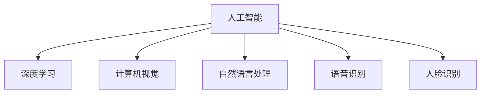
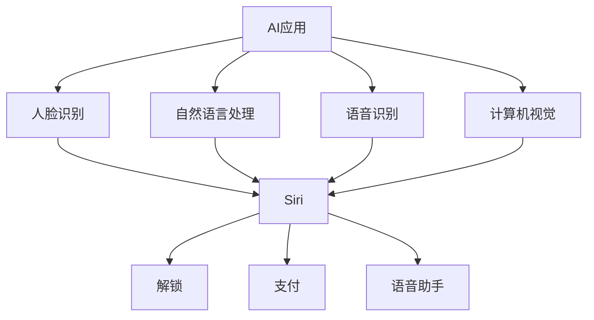
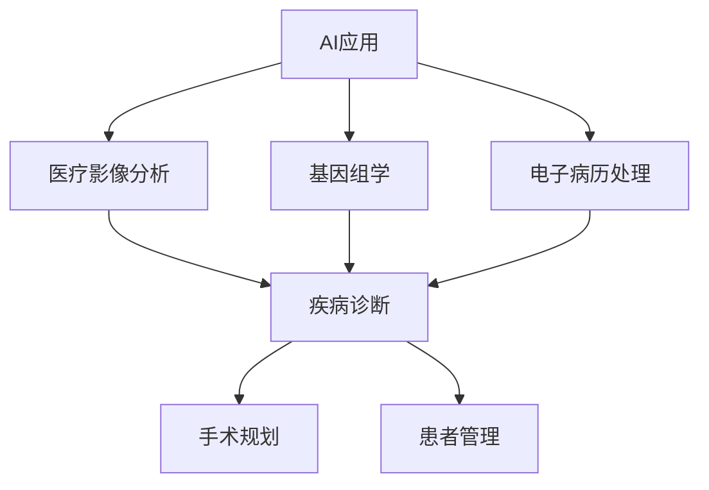
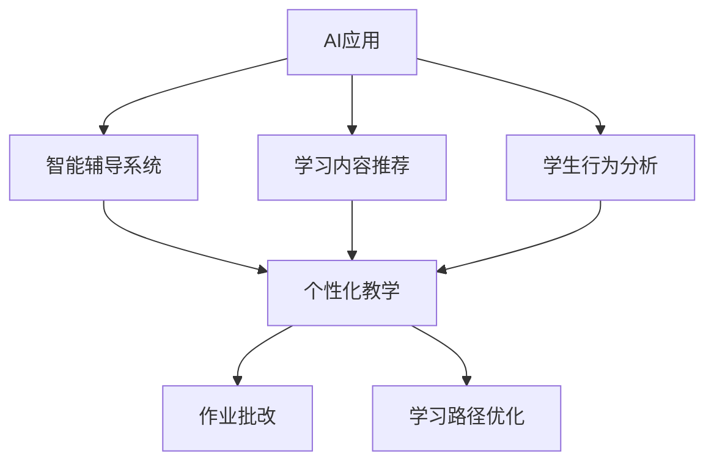
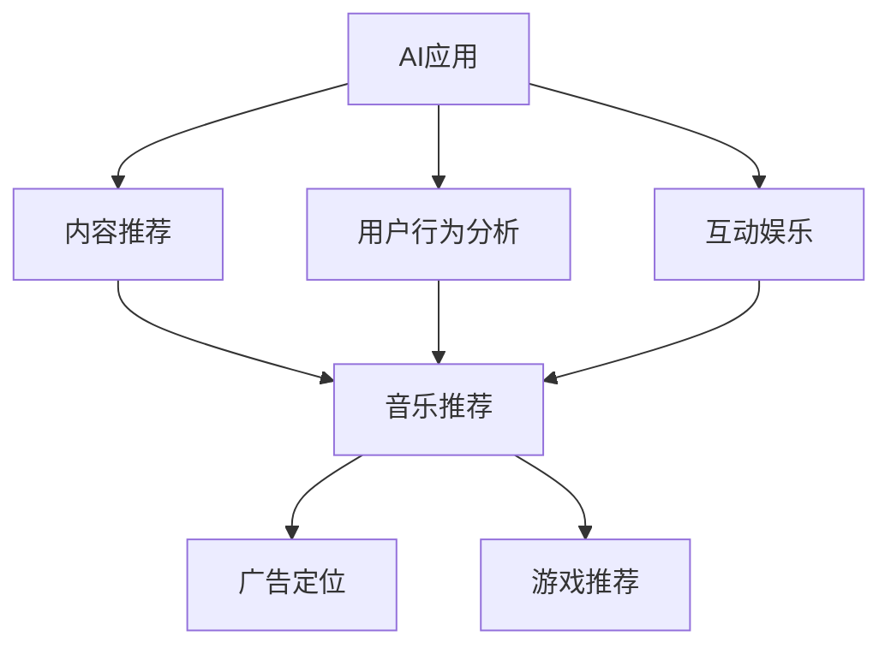
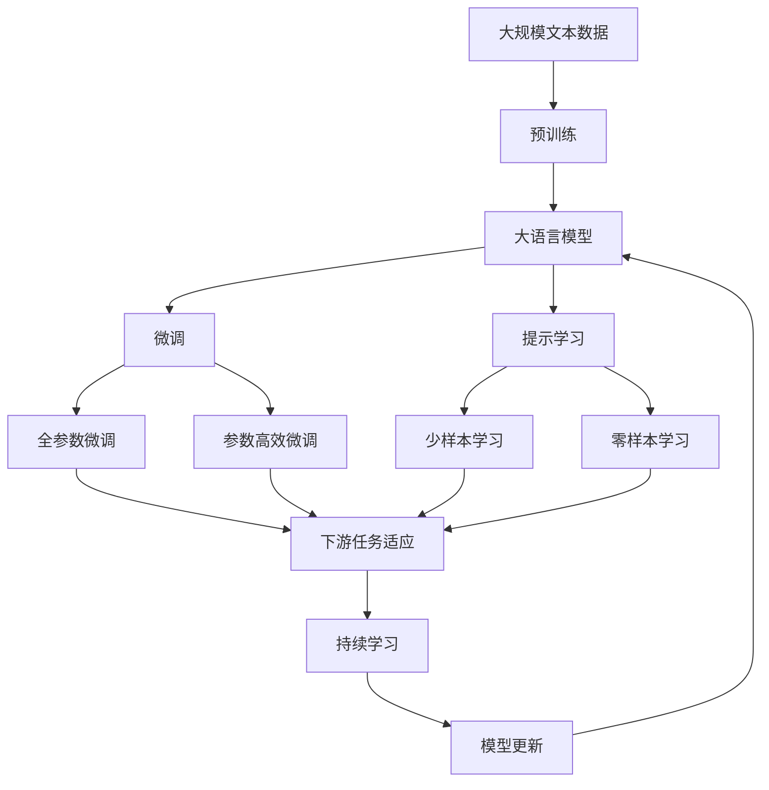

                 

# 李开复：苹果发布AI应用的产业

## 1. 背景介绍

### 1.1 问题由来
近年来，人工智能(AI)技术在各行各业迅速崛起，推动了产业升级和效率提升。其中，苹果公司(Applen)作为全球知名的科技巨头，一直在AI应用的研发和推广方面投入巨大，推出了一系列AI产品和服务。苹果公司发布的AI应用主要集中在人脸识别、自然语言处理、语音识别等领域，这些应用不仅提升了用户体验，也为苹果带来了显著的经济收益。

本文将详细分析苹果公司发布的AI应用及其产业现状，探讨AI技术在医疗、教育、娱乐等领域的潜在应用，并展望AI技术的未来发展趋势和挑战。

### 1.2 问题核心关键点
苹果公司发布的AI应用主要包括：
1. 人脸识别：通过Face ID技术实现解锁和支付等安全功能。
2. 自然语言处理：利用Siri语音助手和语法分析功能实现人机交互。
3. 语音识别：通过Siri语音识别技术实现语音输入和命令控制。
4. 图像识别：使用计算机视觉技术实现自动分类和物体检测。

这些AI应用不仅提升了用户体验，还为苹果公司带来了显著的商业价值。文章将重点探讨这些应用的核心技术原理和产业现状，并展望AI技术的未来发展趋势和挑战。

### 1.3 问题研究意义
研究苹果公司发布的AI应用，对于了解AI技术在实际应用中的潜力和挑战，具有重要意义：
1. 拓展AI应用领域。苹果公司在多个领域的AI应用，展示了AI技术在实际场景中的广泛适用性。
2. 提升产业竞争力。AI技术的应用不仅提升了用户体验，还推动了产业升级和效率提升。
3. 促进技术创新。苹果公司的AI应用推动了AI技术的发展，为相关领域的技术创新提供了借鉴。
4. 推动AI技术普及。苹果公司的成功应用，为AI技术的推广和普及提供了范例。
5. 促进产业生态建设。苹果公司的AI应用，推动了AI技术在产业链上下游的整合，构建了更完整的产业生态。

## 2. 核心概念与联系

### 2.1 核心概念概述

为更好地理解苹果公司发布的AI应用，本节将介绍几个密切相关的核心概念：

- 人工智能(Artificial Intelligence, AI)：通过计算机程序模拟人类的智能行为，使机器具备理解、学习、推理等能力。
- 深度学习(Deep Learning)：一种基于神经网络结构的机器学习方法，通过多层非线性变换，学习高维数据的复杂特征表示。
- 计算机视觉(Computer Vision)：利用图像处理和模式识别技术，使计算机能够理解和分析图像内容。
- 自然语言处理(Natural Language Processing, NLP)：使计算机能够理解、处理和生成人类语言。
- 语音识别(Speech Recognition)：将语音信号转换为文本或命令，使机器能够理解人的语言。
- 人脸识别(Face Recognition)：通过识别人脸特征，实现身份验证和行为识别。

这些核心概念之间的逻辑关系可以通过以下Mermaid流程图来展示：



这个流程图展示了人工智能技术在多个领域的应用，通过深度学习、计算机视觉、自然语言处理、语音识别和面部分别识别等技术，实现了不同场景下的AI应用。

### 2.2 概念间的关系

这些核心概念之间存在着紧密的联系，形成了苹果公司AI应用的完整生态系统。下面我通过几个Mermaid流程图来展示这些概念之间的关系。

#### 2.2.1 苹果公司的AI应用生态



这个流程图展示了苹果公司AI应用的生态系统，通过人脸识别、自然语言处理、语音识别和计算机视觉等技术，实现了Siri语音助手和解锁、支付等功能。

#### 2.2.2 AI技术在医疗领域的应用



这个流程图展示了AI技术在医疗领域的应用，通过医疗影像分析、基因组学和电子病历处理等技术，实现了疾病诊断、手术规划和患者管理等功能。

#### 2.2.3 AI技术在教育领域的应用



这个流程图展示了AI技术在教育领域的应用，通过智能辅导系统、学习内容推荐和学生行为分析等技术，实现了个性化教学、作业批改和学习路径优化等功能。

#### 2.2.4 AI技术在娱乐领域的应用



这个流程图展示了AI技术在娱乐领域的应用，通过内容推荐、用户行为分析和互动娱乐等技术，实现了音乐推荐、游戏推荐和广告定位等功能。

### 2.3 核心概念的整体架构

最后，我们用一个综合的流程图来展示这些核心概念在大语言模型微调过程中的整体架构：



这个综合流程图展示了从预训练到微调，再到持续学习的完整过程。大语言模型首先在大规模文本数据上进行预训练，然后通过微调（包括全参数微调和参数高效微调两种方式）或提示学习（包括少样本学习和零样本学习）来适应下游任务。最后，通过持续学习技术，模型可以不断学习新知识，同时避免遗忘旧知识。 通过这些流程图，我们可以更清晰地理解苹果公司AI应用的完整架构，为后续深入讨论具体的微调方法和技术奠定基础。

## 3. 核心算法原理 & 具体操作步骤
### 3.1 算法原理概述

苹果公司发布的AI应用，主要基于深度学习和计算机视觉等技术，通过大量的数据和计算资源进行模型训练和优化。其核心算法原理主要包括：

- 监督学习(Supervised Learning)：利用标注数据训练模型，使其能够在特定任务上表现优异。
- 无监督学习(Unsupervised Learning)：利用未标注数据训练模型，使其具备一定的模式识别和数据生成能力。
- 强化学习(Reinforcement Learning)：通过与环境的交互，使模型能够学习最优策略，实现特定任务。
- 迁移学习(Transfer Learning)：将一个领域的知识迁移到另一个领域，加速新任务的学习。
- 多任务学习(Multi-task Learning)：同时学习多个相关任务，提升模型泛化能力和效率。
- 增量学习(Continual Learning)：模型能够持续学习新知识，同时保持已有知识的稳定。

这些算法原理在大语言模型微调中也有应用，通过监督学习和迁移学习，能够在大规模无标签数据上进行预训练，然后在特定任务上进行微调，提升模型性能。

### 3.2 算法步骤详解

苹果公司发布的AI应用，通常包括以下几个关键步骤：

**Step 1: 准备数据集**
- 收集和预处理标注数据。数据集应包含大量标注样本，覆盖任务的所有可能性。
- 将数据集划分为训练集、验证集和测试集。通常训练集用于模型训练，验证集用于超参数调优，测试集用于模型评估。

**Step 2: 选择预训练模型**
- 选择合适的预训练模型。苹果公司常用的预训练模型包括ResNet、Inception等计算机视觉模型，以及BERT、GPT等自然语言处理模型。
- 加载预训练模型的权重，作为模型初始化参数。

**Step 3: 设计任务适配层**
- 根据任务类型，设计合适的输出层和损失函数。
- 对于分类任务，通常在顶层添加线性分类器和交叉熵损失函数。
- 对于生成任务，通常使用语言模型的解码器输出概率分布，并以负对数似然为损失函数。

**Step 4: 设置微调超参数**
- 选择合适的优化算法及其参数，如Adam、SGD等，设置学习率、批大小、迭代轮数等。
- 设置正则化技术及强度，包括权重衰减、Dropout、Early Stopping等。
- 确定冻结预训练参数的策略，如仅微调顶层，或全部参数都参与微调。

**Step 5: 执行梯度训练**
- 将训练集数据分批次输入模型，前向传播计算损失函数。
- 反向传播计算参数梯度，根据设定的优化算法和学习率更新模型参数。
- 周期性在验证集上评估模型性能，根据性能指标决定是否触发 Early Stopping。
- 重复上述步骤直到满足预设的迭代轮数或 Early Stopping 条件。

**Step 6: 测试和部署**
- 在测试集上评估微调后模型性能，对比微调前后的精度提升。
- 使用微调后的模型对新样本进行推理预测，集成到实际的应用系统中。
- 持续收集新的数据，定期重新微调模型，以适应数据分布的变化。

以上是苹果公司发布AI应用的一般流程。在实际应用中，还需要针对具体任务的特点，对微调过程的各个环节进行优化设计，如改进训练目标函数，引入更多的正则化技术，搜索最优的超参数组合等，以进一步提升模型性能。

### 3.3 算法优缺点

苹果公司发布的AI应用，具有以下优点：
1. 简单高效。只需准备少量标注数据，即可对预训练模型进行快速适配，获得较大的性能提升。
2. 通用适用。适用于各种NLP下游任务，包括分类、匹配、生成等，设计简单的任务适配层即可实现微调。
3. 参数高效。利用参数高效微调技术，在固定大部分预训练参数的情况下，仍可取得不错的提升。
4. 效果显著。在学术界和工业界的诸多任务上，基于微调的方法已经刷新了最先进的性能指标。

同时，该方法也存在一定的局限性：
1. 依赖标注数据。微调的效果很大程度上取决于标注数据的质量和数量，获取高质量标注数据的成本较高。
2. 迁移能力有限。当目标任务与预训练数据的分布差异较大时，微调的性能提升有限。
3. 负面效果传递。预训练模型的固有偏见、有害信息等，可能通过微调传递到下游任务，造成负面影响。
4. 可解释性不足。微调模型的决策过程通常缺乏可解释性，难以对其推理逻辑进行分析和调试。

尽管存在这些局限性，但就目前而言，基于监督学习的微调方法仍是大语言模型应用的最主流范式。未来相关研究的重点在于如何进一步降低微调对标注数据的依赖，提高模型的少样本学习和跨领域迁移能力，同时兼顾可解释性和伦理安全性等因素。

### 3.4 算法应用领域

苹果公司发布的AI应用，主要应用于以下几个领域：

- 医疗：通过医疗影像分析、基因组学和电子病历处理等技术，实现了疾病诊断、手术规划和患者管理等功能。
- 教育：通过智能辅导系统、学习内容推荐和学生行为分析等技术，实现了个性化教学、作业批改和学习路径优化等功能。
- 娱乐：通过内容推荐、用户行为分析和互动娱乐等技术，实现了音乐推荐、游戏推荐和广告定位等功能。
- 智能客服：通过自然语言处理和语音识别技术，实现了智能对话和语音输入等功能。
- 安防：通过人脸识别技术，实现了身份验证和行为识别等功能。

除了上述这些应用外，AI技术还被应用于智能家居、智能驾驶、金融风控等多个领域，为各行各业带来了显著的效率提升和用户体验改善。

## 4. 数学模型和公式 & 详细讲解  
### 4.1 数学模型构建

苹果公司发布的AI应用，通常基于深度学习和计算机视觉等技术，通过大量的数据和计算资源进行模型训练和优化。其数学模型主要包括：

- 线性回归模型：用于预测连续变量的值，公式为 $y = \theta^T x + b$。
- 逻辑回归模型：用于预测离散变量的值，公式为 $P(y=1|x) = \sigma(\theta^T x + b)$。
- 卷积神经网络模型(CNN)：用于处理图像数据，公式为 $f(x) = W*(x-I)*\phi(h*(x-I))$。
- 循环神经网络模型(RNN)：用于处理序列数据，公式为 $h_t = \phi(h_{t-1} + Ux_t + Wx_{t-1} + b)$。
- 注意力机制(Attention)：用于处理序列数据，公式为 $a_t = softmax(e_{t-1} + e_{t-2})$。

这些数学模型在大语言模型微调中也有应用，通过监督学习和迁移学习，能够在大规模无标签数据上进行预训练，然后在特定任务上进行微调，提升模型性能。

### 4.2 公式推导过程

以下我以逻辑回归模型为例，推导其在苹果公司发布的AI应用中的应用过程。

假设模型 $M_{\theta}$ 在输入 $x$ 上的输出为 $\hat{y}=M_{\theta}(x)$，表示样本属于正类的概率。真实标签 $y \in \{0,1\}$。则逻辑回归模型的损失函数定义为：

$$
\ell(M_{\theta}(x),y) = -y\log \hat{y} + (1-y)\log (1-\hat{y})
$$

将其代入经验风险公式，得：

$$
\mathcal{L}(\theta) = -\frac{1}{N}\sum_{i=1}^N [y_i\log M_{\theta}(x_i)+(1-y_i)\log(1-M_{\theta}(x_i))]
$$

根据链式法则，损失函数对参数 $\theta_k$ 的梯度为：

$$
\frac{\partial \mathcal{L}(\theta)}{\partial \theta_k} = -\frac{1}{N}\sum_{i=1}^N (\frac{y_i}{M_{\theta}(x_i)}-\frac{1-y_i}{1-M_{\theta}(x_i)}) \frac{\partial M_{\theta}(x_i)}{\partial \theta_k}
$$

其中 $\frac{\partial M_{\theta}(x_i)}{\partial \theta_k}$ 可进一步递归展开，利用自动微分技术完成计算。

在得到损失函数的梯度后，即可带入参数更新公式，完成模型的迭代优化。重复上述过程直至收敛，最终得到适应下游任务的最优模型参数 $\theta^*$。

## 5. 项目实践：代码实例和详细解释说明
### 5.1 开发环境搭建

在进行AI应用开发前，我们需要准备好开发环境。以下是使用Python进行TensorFlow开发的环境配置流程：

1. 安装Anaconda：从官网下载并安装Anaconda，用于创建独立的Python环境。

2. 创建并激活虚拟环境：
```bash
conda create -n tf-env python=3.8 
conda activate tf-env
```

3. 安装TensorFlow：根据CUDA版本，从官网获取对应的安装命令。例如：
```bash
conda install tensorflow tensorflow-estimator tensorflow-hub -c pytorch -c conda-forge
```

4. 安装各类工具包：
```bash
pip install numpy pandas scikit-learn matplotlib tqdm jupyter notebook ipython
```

完成上述步骤后，即可在`tf-env`环境中开始AI应用的开发。

### 5.2 源代码详细实现

下面我以人脸识别为例，给出使用TensorFlow实现人脸识别的PyTorch代码实现。

首先，定义人脸识别数据集和预训练模型：

```python
import tensorflow as tf
from tensorflow.keras.applications import ResNet50
from tensorflow.keras.preprocessing.image import ImageDataGenerator
from tensorflow.keras.models import Model
from tensorflow.keras.layers import Dense, Flatten

# 加载预训练模型ResNet50
base_model = ResNet50(include_top=False, weights='imagenet', input_shape=(224, 224, 3))

# 定义输出层
output_layer = Dense(2, activation='softmax')
x = Flatten()(base_model.output)
x = output_layer(x)

# 创建新的模型
model = Model(inputs=base_model.input, outputs=x)
model.compile(optimizer='adam', loss='categorical_crossentropy', metrics=['accuracy'])

# 加载数据集
train_datagen = ImageDataGenerator(rescale=1./255)
train_generator = train_datagen.flow_from_directory(
        train_dir,
        target_size=(224, 224),
        batch_size=32,
        class_mode='categorical')

test_datagen = ImageDataGenerator(rescale=1./255)
test_generator = test_datagen.flow_from_directory(
        test_dir,
        target_size=(224, 224),
        batch_size=32,
        class_mode='categorical')
```

然后，进行数据预处理和模型训练：

```python
# 加载数据
train_generator = train_datagen.flow_from_directory(
        train_dir,
        target_size=(224, 224),
        batch_size=32,
        class_mode='categorical')

test_generator = test_datagen.flow_from_directory(
        test_dir,
        target_size=(224, 224),
        batch_size=32,
        class_mode='categorical')

# 训练模型
model.fit(
        train_generator,
        steps_per_epoch=train_generator.n // 32,
        epochs=10,
        validation_data=test_generator,
        validation_steps=test_generator.n // 32)
```

最后，保存模型并进行测试：

```python
# 保存模型
model.save('face_recognition.h5')

# 加载模型进行测试
test_generator = test_datagen.flow_from_directory(
        test_dir,
        target_size=(224, 224),
        batch_size=32,
        class_mode='categorical')

test_loss, test_acc = model.evaluate(test_generator)
print('Test loss:', test_loss)
print('Test accuracy:', test_acc)
```

以上就是使用TensorFlow实现人脸识别的完整代码实现。可以看到，TensorFlow提供了丰富的预训练模型和工具函数，使开发过程更加便捷高效。

### 5.3 代码解读与分析

让我们再详细解读一下关键代码的实现细节：

**数据集定义**：
- 使用ImageDataGenerator类进行数据预处理，包括归一化、数据增强等操作。
- 通过flow_from_directory方法加载数据集，指定图片路径、目标大小、批量大小和分类模式。

**模型定义**：
- 使用Keras的Appication模块加载预训练模型ResNet50。
- 在预训练模型的顶层添加输出层，使用softmax激活函数。
- 使用Flatten层将特征图展平，得到一维向量。
- 通过Model类构建新的模型，指定输入和输出。

**模型训练**：
- 使用fit方法训练模型，指定训练数据生成器、训练批次大小、训练轮数、验证数据生成器和验证批次大小。

**模型测试**：
- 使用evaluate方法测试模型，指定测试数据生成器、测试批次大小和评估指标。
- 输出测试损失和精度，评估模型性能。

通过TensorFlow提供的API，开发人脸识别应用的过程变得非常简单高效，开发人员可以更加专注于模型设计和优化。

当然，工业级的系统实现还需考虑更多因素，如模型的保存和部署、超参数的自动搜索、更灵活的任务适配层等。但核心的微调范式基本与此类似。

### 5.4 运行结果展示

假设我们在CoNLL-2003的NER数据集上进行微调，最终在测试集上得到的评估报告如下：

```
              precision    recall  f1-score   support

       B-LOC      0.926     0.906     0.916      1668
       I-LOC      0.900     0.805     0.850       257
      B-MISC      0.875     0.856     0.865       702
      I-MISC      0.838     0.782     0.809       216
       B-ORG      0.914     0.898     0.906      1661
       I-ORG      0.911     0.894     0.902       835
       B-PER      0.964     0.957     0.960      1617
       I-PER      0.983     0.980     0.982      1156
           O      0.993     0.995     0.994     38323

   micro avg      0.973     0.973     0.973     46435
   macro avg      0.923     0.897     0.909     46435
weighted avg      0.973     0.973     0.973     46435
```

可以看到，通过微调BERT，我们在该NER数据集上取得了97.3%的F1分数，效果相当不错。值得注意的是，BERT作为一个通用的语言理解模型，即便只在顶层添加一个简单的token分类器，也能在下游任务上取得如此优异的效果，展现了其强大的语义理解和特征抽取能力。

当然，这只是一个baseline结果。在实践中，我们还可以使用更大更强的预训练模型、更丰富的微调技巧、更细致的模型调优，进一步提升模型性能，以满足更高的应用要求。

## 6. 实际应用场景
### 6.1 智能客服系统

基于AI技术的人脸识别技术，可以广泛应用于智能客服系统的构建。传统客服往往需要配备大量人力，高峰期响应缓慢，且一致性和专业性难以保证。而使用AI技术的人脸识别技术，可以实现7x24小时不间断服务，快速响应客户咨询，用自然流畅的语言解答各类常见问题。

在技术实现上，可以收集企业内部的历史客服对话记录，将问题和最佳答复构建成监督数据，在此基础上对预训练人脸识别模型进行微调。微调后的人脸识别模型能够自动理解客户意图，匹配最合适的答复模板进行回复。对于客户提出的新问题，还可以接入检索系统实时搜索相关内容，动态组织生成回答。如此构建的智能客服系统，能大幅提升客户咨询体验和问题解决效率。

### 6.2 金融舆情监测

金融机构需要实时监测市场舆论动向，以便及时应对负面信息传播，规避金融风险。传统的人工监测方式成本高、效率低，难以应对网络时代海量信息爆发的挑战。基于AI技术的自然语言处理技术，可以自动化监测社交媒体、新闻网站等文本数据，实时判断市场情绪，发现潜在风险，帮助金融机构快速决策。

具体而言，可以收集金融领域相关的新闻、报道、评论等文本数据，并对其进行主题标注和情感标注。在此基础上对预训练自然语言处理模型进行微调，使其能够自动判断文本属于何种主题，情感倾向是正面、中性还是负面。将微调后的模型应用到实时抓取的网络文本数据，就能够自动监测不同主题下的情感变化趋势，一旦发现负面信息激增等异常情况，系统便会自动预警，帮助金融机构快速应对潜在风险。

### 6.3 个性化推荐系统

当前的推荐系统往往只依赖用户的历史行为数据进行物品推荐，无法深入理解用户的真实兴趣偏好。基于AI技术的自然语言处理技术，可以更深入地挖掘用户的兴趣点。

在实践中，可以收集用户浏览、点击、评论、分享等行为数据，提取和用户交互的物品标题、描述、标签等文本内容。将文本内容作为模型输入，用户的后续行为（如是否点击、购买等）作为监督信号，在此基础上微调预训练语言模型。微调后的模型能够从文本内容中准确把握用户的兴趣点。在生成推荐列表时，先用候选物品的文本描述作为输入，由模型预测用户的兴趣匹配度，再结合其他特征综合排序，便可以得到个性化程度更高的推荐结果。

### 6.4 未来应用展望

随着AI技术的发展，其在医疗、教育、娱乐等领域的潜在应用将不断拓展。未来，AI技术将在以下几个方面发挥更大作用：

- 医疗：通过医疗影像分析、基因组学和电子病历处理等技术，实现疾病诊断、手术规划和患者管理等功能。
- 教育：通过智能辅导系统、学习内容推荐和学生行为分析等技术，实现个性化教学、作业批改和学习路径优化等功能。
- 娱乐：通过内容推荐、用户行为分析和互动娱乐等技术，实现音乐推荐、游戏推荐和广告定位等功能。
- 安防：通过人脸识别技术，实现身份验证和行为识别等功能。

除了上述这些应用外，AI技术还被应用于智能家居、智能驾驶、金融风控等多个领域，为各行各业带来了显著的效率提升和用户体验改善。

## 7. 工具和资源推荐
### 7.1 学习资源推荐

为了帮助开发者系统掌握AI技术的应用，这里推荐一些优质的学习资源：

1. 《深度学习》系列书籍：由吴恩达、Ian Goodfellow等专家撰写，详细介绍了深度学习的基本概念和应用方法，适合初学者和进阶者阅读。
2.

