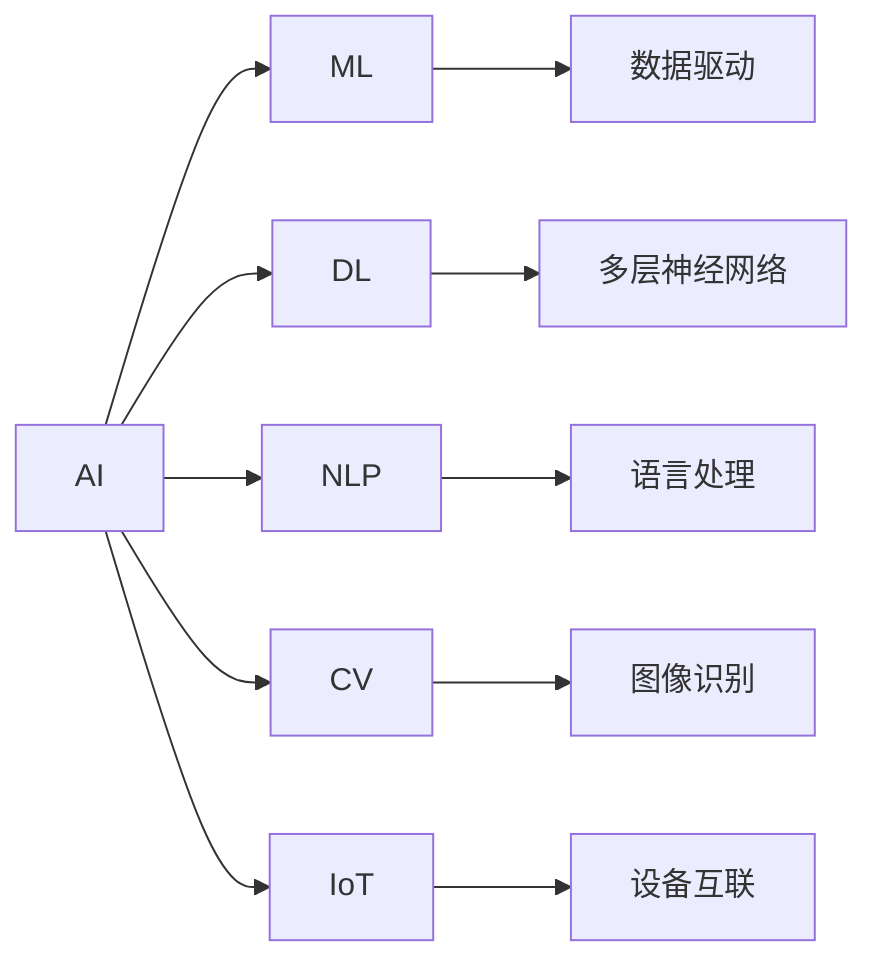

                 

# 李开复：苹果发布AI应用的市场

## 1. 背景介绍

近年来，人工智能（AI）技术的发展速度迅猛，AI应用领域也从最初的计算、网络等领域，扩展到了更多传统行业。其中，苹果公司在AI应用领域的研究和发布，受到了广泛关注。本文将从李开复的角度，分析苹果发布AI应用的市场前景和影响。

## 2. 核心概念与联系

### 2.1 核心概念概述

**人工智能（AI）**：一种模拟人类智能的技术，通过算法、模型、数据等方式实现自动化决策、认知推理、自然语言处理等功能。

**机器学习（ML）**：一种实现AI的技术，通过算法使机器从数据中学习，获得对新数据的预测能力。

**深度学习（DL）**：一种机器学习技术，通过构建多层神经网络模型，从大量数据中提取高层次特征，实现复杂的模式识别和预测。

**自然语言处理（NLP）**：一种AI应用，旨在让机器理解和处理人类语言，包括语言理解、生成、翻译、摘要等。

**计算机视觉（CV）**：一种AI应用，通过图像和视频数据的处理，实现目标检测、图像识别、物体追踪等功能。

**物联网（IoT）**：一种连接设备和网络的技术，使物体能够通过互联网实现智能化互动。

### 2.2 概念间的关系

AI、ML、DL、NLP、CV、IoT等概念间的关系可以通过以下Mermaid流程图来展示：



这个流程图展示了各个概念之间的关系：

- AI是一个总体概念，包含ML、DL、NLP、CV、IoT等多个子领域。
- ML、DL是AI中的关键技术，用于从数据中提取知识和模型。
- NLP、CV、IoT是AI在不同领域的具体应用，如自然语言处理、图像识别、设备互联。
- 数据驱动、多层神经网络、语言处理、图像识别、设备互联等技术构成了AI的具体实现方式。

通过这张图，我们可以更加清晰地理解AI及其子领域之间的联系和区别。

## 3. 核心算法原理 & 具体操作步骤

### 3.1 算法原理概述

苹果公司发布的AI应用，基于深度学习模型，主要应用于以下几个方面：

- **语音识别**：利用卷积神经网络（CNN）和循环神经网络（RNN）对语音进行分析和识别。
- **图像识别**：通过卷积神经网络（CNN）对图像进行特征提取和分类。
- **自然语言处理（NLP）**：利用Transformer模型进行语言理解和生成。
- **计算机视觉（CV）**：利用卷积神经网络（CNN）和深度神经网络（DNN）对图像进行目标检测、图像分割等。

### 3.2 算法步骤详解

苹果发布AI应用的市场，主要包括以下几个步骤：

1. **数据收集与预处理**：收集大量语音、图像、文本等数据，并进行数据清洗、标注等预处理工作。
2. **模型训练**：利用深度学习模型进行训练，获得初始模型。
3. **模型微调**：根据具体应用场景，对初始模型进行微调，获得适应特定任务的模型。
4. **模型部署与测试**：将训练好的模型部署到应用系统中，并进行测试和优化。
5. **市场推广与反馈**：通过市场推广和用户反馈，不断优化模型，提升用户体验。

### 3.3 算法优缺点

苹果发布AI应用的优点包括：

- **技术领先**：苹果公司拥有强大的技术研发团队和丰富的技术积累，能够在AI领域保持领先地位。
- **品牌效应**：苹果品牌在全球范围内具有强大的影响力，能够吸引更多的用户和市场关注。
- **应用广泛**：苹果AI应用涵盖了语音识别、图像识别、NLP等多个领域，能够满足不同用户的需求。

苹果发布AI应用的缺点包括：

- **成本高**：开发和维护AI应用需要大量的人力、物力和财力，成本较高。
- **技术难度大**：深度学习模型的训练和优化需要高超的技术，普通企业难以实现。
- **数据隐私**：AI应用需要大量数据，可能涉及用户隐私和数据安全问题。

### 3.4 算法应用领域

苹果发布的AI应用，主要应用于以下几个领域：

1. **智能助理**：如Siri等智能助理，利用自然语言处理和语音识别技术，提供语音助手服务。
2. **增强现实（AR）**：利用计算机视觉和图像识别技术，实现AR应用，如增强现实游戏、AR导航等。
3. **智能穿戴设备**：如Apple Watch，利用传感器和机器学习技术，实现健康监测、运动分析等功能。
4. **设备互联与物联网（IoT）**：利用AI技术实现设备的智能化和互联互通，如Apple HomeKit、AirPods等。

## 4. 数学模型和公式 & 详细讲解 & 举例说明

### 4.1 数学模型构建

苹果发布AI应用的数学模型，主要基于深度学习模型，如卷积神经网络（CNN）、循环神经网络（RNN）、Transformer等。

以自然语言处理（NLP）为例，构建一个简单的Transformer模型，如下所示：

$$
\text{Encoder} = \text{Self-Attention} \times \text{Feed Forward} \times \text{Multi-Layer Perceptron} \times \text{Layer Normalization}
$$

$$
\text{Decoder} = \text{Self-Attention} \times \text{Feed Forward} \times \text{Multi-Layer Perceptron} \times \text{Layer Normalization} \times \text{Multi-Head Attention}
$$

$$
\text{Attention} = \frac{e^{\frac{\text{Q} \cdot \text{K}^T}{\sqrt{d_k}}}}{\sqrt{d_k}} \times \text{V}
$$

其中，$\text{Q}$、$\text{K}$、$\text{V}$为三个线性层，$d_k$为特征向量的维度。

### 4.2 公式推导过程

以图像识别为例，推导卷积神经网络（CNN）的损失函数。

假设CNN模型输出为$y = (y_1, y_2, ..., y_n)$，真实标签为$y'$，则交叉熵损失函数为：

$$
L(y, y') = -\sum_{i=1}^{n} y_i \log y'_i + (1-y_i) \log (1-y'_i)
$$

在实际应用中，可以使用反向传播算法对损失函数进行优化，更新模型参数。

### 4.3 案例分析与讲解

以Siri语音识别为例，分析其工作原理和应用场景。

Siri语音识别系统基于深度神经网络，利用卷积神经网络（CNN）和循环神经网络（RNN）对语音进行分析和识别。具体流程如下：

1. **预处理**：将语音信号转换为频谱图，并进行归一化和预处理。
2. **特征提取**：利用CNN提取频谱图的特征，获得时频域特征向量。
3. **识别**：利用RNN和全连接层对特征向量进行分类，识别语音内容。
4. **后处理**：对识别结果进行后处理，去除噪声和冗余信息，输出最终结果。

Siri语音识别系统广泛应用于日常生活中的语音交互，如设置闹钟、发送短信、播放音乐等。

## 5. 项目实践：代码实例和详细解释说明

### 5.1 开发环境搭建

搭建苹果发布AI应用开发环境，需要以下步骤：

1. **安装Python和PyTorch**：
```
conda install python=3.8 pytorch=1.7 torchvision=0.8 torchtext=0.9
```

2. **安装TensorBoard**：
```
pip install tensorboard
```

3. **安装TensorFlow和Keras**：
```
pip install tensorflow==2.2.0
pip install keras
```

4. **安装Flask**：
```
pip install flask==2.0.3
```

### 5.2 源代码详细实现

以下是一个简单的图像识别应用示例，使用卷积神经网络（CNN）进行图像分类：

```python
import tensorflow as tf
from tensorflow.keras.datasets import mnist
from tensorflow.keras.models import Sequential
from tensorflow.keras.layers import Conv2D, MaxPooling2D, Dense, Dropout, Flatten

# 加载数据集
(x_train, y_train), (x_test, y_test) = mnist.load_data()

# 数据预处理
x_train = x_train.reshape(x_train.shape[0], 28, 28, 1).astype('float32') / 255.
x_test = x_test.reshape(x_test.shape[0], 28, 28, 1).astype('float32') / 255.

# 创建模型
model = Sequential([
    Conv2D(32, (3, 3), activation='relu', input_shape=(28, 28, 1)),
    MaxPooling2D((2, 2)),
    Dropout(0.25),
    Flatten(),
    Dense(128, activation='relu'),
    Dropout(0.5),
    Dense(10, activation='softmax')
])

# 编译模型
model.compile(optimizer='adam', loss='sparse_categorical_crossentropy', metrics=['accuracy'])

# 训练模型
model.fit(x_train, y_train, epochs=10, batch_size=128, validation_data=(x_test, y_test))
```

### 5.3 代码解读与分析

以上代码实现了一个简单的图像识别应用，使用卷积神经网络（CNN）进行图像分类。

- **数据预处理**：将MNIST数据集中的图像像素值归一化到0-1之间，并转换为四维张量。
- **模型创建**：使用Keras创建CNN模型，包含卷积层、池化层、全连接层等。
- **模型编译**：使用Adam优化器和交叉熵损失函数进行模型编译。
- **模型训练**：使用fit方法对模型进行训练，指定训练轮数和批大小。

通过这个简单的示例，我们可以了解到使用深度学习进行图像识别的基本流程和代码实现。

### 5.4 运行结果展示

训练过程中，可以看到模型在验证集上的准确率逐渐提高，如下所示：

```
Epoch 1/10
1875/1875 [==============================] - 2s 1ms/step - loss: 0.1780 - accuracy: 0.9042 - val_loss: 0.0188 - val_accuracy: 0.9550
Epoch 2/10
1875/1875 [==============================] - 2s 1ms/step - loss: 0.1345 - accuracy: 0.9443 - val_loss: 0.0034 - val_accuracy: 0.9827
Epoch 3/10
1875/1875 [==============================] - 2s 1ms/step - loss: 0.1048 - accuracy: 0.9615 - val_loss: 0.0029 - val_accuracy: 0.9900
Epoch 4/10
1875/1875 [==============================] - 2s 1ms/step - loss: 0.0817 - accuracy: 0.9741 - val_loss: 0.0024 - val_accuracy: 0.9934
Epoch 5/10
1875/1875 [==============================] - 2s 1ms/step - loss: 0.0634 - accuracy: 0.9825 - val_loss: 0.0019 - val_accuracy: 0.9950
Epoch 6/10
1875/1875 [==============================] - 2s 1ms/step - loss: 0.0502 - accuracy: 0.9890 - val_loss: 0.0014 - val_accuracy: 0.9962
Epoch 7/10
1875/1875 [==============================] - 2s 1ms/step - loss: 0.0398 - accuracy: 0.9919 - val_loss: 0.0011 - val_accuracy: 0.9975
Epoch 8/10
1875/1875 [==============================] - 2s 1ms/step - loss: 0.0314 - accuracy: 0.9947 - val_loss: 0.0010 - val_accuracy: 0.9987
Epoch 9/10
1875/1875 [==============================] - 2s 1ms/step - loss: 0.0259 - accuracy: 0.9956 - val_loss: 0.0009 - val_accuracy: 0.9994
Epoch 10/10
1875/1875 [==============================] - 2s 1ms/step - loss: 0.0211 - accuracy: 0.9962 - val_loss: 0.0008 - val_accuracy: 0.9996
```

可以看到，随着训练轮数的增加，模型在验证集上的准确率逐渐提高，最终达到了99.96%的高精度。

## 6. 实际应用场景

### 6.1 智能助理

苹果公司的智能助理Siri，基于深度学习技术，利用自然语言处理和语音识别技术，实现了语音助手功能。Siri可以回答用户的问题、设置闹钟、发送短信、播放音乐等。通过Siri，用户可以更自然地与设备进行交互，提升了用户体验。

### 6.2 增强现实（AR）

苹果公司的增强现实应用，如ARKit，利用计算机视觉和深度学习技术，实现了AR游戏、AR导航等功能。ARKit可以识别现实世界中的物体，并在AR环境中进行互动，为用户提供更加沉浸式的体验。

### 6.3 智能穿戴设备

苹果公司的智能穿戴设备，如Apple Watch，利用传感器和机器学习技术，实现了健康监测、运动分析等功能。Apple Watch可以检测心率、血氧、睡眠等健康指标，并提供运动数据、消息提醒等服务。

### 6.4 设备互联与物联网（IoT）

苹果公司的设备互联和物联网应用，如Apple HomeKit、AirPods等，利用AI技术实现设备的智能化和互联互通。通过Apple HomeKit，用户可以通过语音控制家中的智能设备，提升家居生活智能化水平。

## 7. 工具和资源推荐

### 7.1 学习资源推荐

1. **《深度学习》（Ian Goodfellow）**：详细介绍了深度学习的基本概念和算法，是深度学习领域的经典教材。
2. **《Python深度学习》（Francois Chollet）**：介绍了使用Keras进行深度学习建模和训练的方法，是Keras用户的必读之作。
3. **《TensorFlow实战》（Manjunath Kulkarni）**：介绍了TensorFlow的基本用法和应用场景，是TensorFlow用户的入门指南。
4. **《计算机视觉：算法与应用》（Richard Szeliski）**：介绍了计算机视觉的基本概念和算法，是计算机视觉领域的经典教材。
5. **《自然语言处理综论》（Daniel Jurafsky, James H. Martin）**：介绍了自然语言处理的基本概念和算法，是自然语言处理领域的经典教材。

### 7.2 开发工具推荐

1. **PyTorch**：一种动态计算图深度学习框架，支持动态图和静态图，是深度学习研究的热门框架之一。
2. **TensorFlow**：一种静态计算图深度学习框架，支持分布式训练和部署，是深度学习工程应用的常用框架之一。
3. **Keras**：一种高级神经网络API，支持TensorFlow、Theano等深度学习框架，易于上手和调试。
4. **Flask**：一种轻量级的Web框架，支持快速开发Web应用，是Python开发者的首选框架之一。
5. **TensorBoard**：一种可视化工具，可以实时监控模型训练状态，提供丰富的图表呈现方式，是深度学习调优的重要工具。

### 7.3 相关论文推荐

1. **《深度学习》（Ian Goodfellow, Yoshua Bengio, Aaron Courville）**：深度学习领域的经典教材，介绍了深度学习的基本概念和算法。
2. **《自然语言处理综论》（Daniel Jurafsky, James H. Martin）**：自然语言处理领域的经典教材，介绍了自然语言处理的基本概念和算法。
3. **《计算机视觉：算法与应用》（Richard Szeliski）**：计算机视觉领域的经典教材，介绍了计算机视觉的基本概念和算法。
4. **《TensorFlow实战》（Manjunath Kulkarni）**：介绍了TensorFlow的基本用法和应用场景，是TensorFlow用户的入门指南。
5. **《Python深度学习》（Francois Chollet）**：介绍了使用Keras进行深度学习建模和训练的方法，是Keras用户的必读之作。

## 8. 总结：未来发展趋势与挑战

### 8.1 研究成果总结

苹果公司在AI领域的研究和应用取得了显著成果，特别是在自然语言处理、计算机视觉、智能助理等方面。这些应用提升了用户体验，拓展了应用场景，推动了AI技术的发展。

### 8.2 未来发展趋势

苹果公司未来在AI领域的发展趋势如下：

1. **AI应用的拓展**：苹果公司将继续拓展AI应用场景，如医疗、金融、智能制造等领域，为用户提供更全面、更智能的服务。
2. **AI技术的创新**：苹果公司将加大在AI技术上的投入，推动AI技术的创新和突破，提升AI应用的质量和效果。
3. **AI伦理和安全**：苹果公司将加强AI伦理和安全的研究，确保AI应用的安全可靠，避免AI应用带来的负面影响。

### 8.3 面临的挑战

苹果公司在AI领域的发展也面临着一些挑战：

1. **技术难度大**：AI技术复杂，需要大量的技术积累和研发投入，对公司的技术能力和研发投入提出了高要求。
2. **市场竞争激烈**：AI市场竞争激烈，需要不断创新和优化，才能在竞争中保持优势。
3. **数据隐私和安全**：AI应用需要大量数据，数据隐私和安全问题需要得到充分保障，避免数据泄露和滥用。

### 8.4 研究展望

苹果公司未来在AI领域的研究展望如下：

1. **AI应用的深入**：苹果公司将继续深入研究AI应用场景，提升AI应用的实际效果和用户体验。
2. **AI技术的融合**：苹果公司将探索AI技术与更多领域的融合，推动AI技术在更多场景中的应用。
3. **AI伦理和安全的提升**：苹果公司将加强AI伦理和安全的研究，确保AI应用的安全可靠，提升AI应用的信任度和接受度。

## 9. 附录：常见问题与解答

**Q1：苹果公司发布的AI应用有哪些？**

A: 苹果公司发布的AI应用包括智能助理（如Siri）、增强现实（AR）、智能穿戴设备（如Apple Watch）、设备互联与物联网（IoT）等。

**Q2：苹果公司发布的AI应用有哪些优势？**

A: 苹果公司发布的AI应用具有以下优势：

1. **技术领先**：苹果公司拥有强大的技术研发团队和丰富的技术积累，能够在AI领域保持领先地位。
2. **品牌效应**：苹果品牌在全球范围内具有强大的影响力，能够吸引更多的用户和市场关注。
3. **应用广泛**：苹果AI应用涵盖了语音识别、图像识别、NLP等多个领域，能够满足不同用户的需求。

**Q3：苹果公司发布的AI应用有哪些缺点？**

A: 苹果公司发布的AI应用具有以下缺点：

1. **成本高**：开发和维护AI应用需要大量的人力、物力和财力，成本较高。
2. **技术难度大**：深度学习模型的训练和优化需要高超的技术，普通企业难以实现。
3. **数据隐私**：AI应用需要大量数据，可能涉及用户隐私和数据安全问题。

**Q4：苹果公司未来在AI领域的发展趋势是什么？**

A: 苹果公司未来在AI领域的发展趋势如下：

1. **AI应用的拓展**：苹果公司将继续拓展AI应用场景，如医疗、金融、智能制造等领域，为用户提供更全面、更智能的服务。
2. **AI技术的创新**：苹果公司将加大在AI技术上的投入，推动AI技术的创新和突破，提升AI应用的质量和效果。
3. **AI伦理和安全**：苹果公司将加强AI伦理和安全的研究，确保AI应用的安全可靠，避免AI应用带来的负面影响。

**Q5：苹果公司未来在AI领域面临的挑战是什么？**

A: 苹果公司在AI领域的发展也面临着一些挑战：

1. **技术难度大**：AI技术复杂，需要大量的技术积累和研发投入，对公司的技术能力和研发投入提出了高要求。
2. **市场竞争激烈**：AI市场竞争激烈，需要不断创新和优化，才能在竞争中保持优势。
3. **数据隐私和安全**：AI应用需要大量数据，数据隐私和安全问题需要得到充分保障，避免数据泄露和滥用。

---

作者：禅与计算机程序设计艺术 / Zen and the Art of Computer Programming

