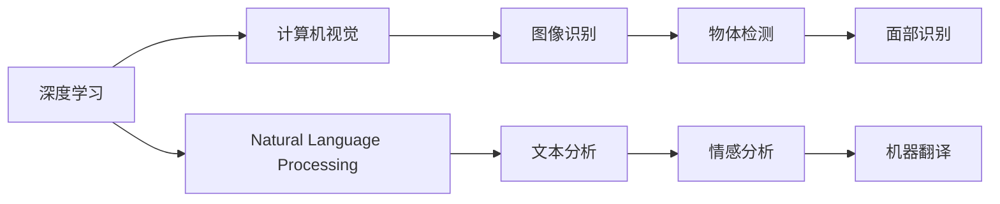

                 

# 李开复：苹果发布AI应用的挑战

## 1. 背景介绍

人工智能（AI）技术在过去的几十年中取得了长足的发展，从深度学习到自然语言处理，再到计算机视觉和语音识别，AI技术正以惊人的速度改变着我们的生活方式。然而，随着AI技术的不断普及，越来越多的公司开始将AI技术应用于产品和服务中，尤其是在科技巨头如苹果（Apple）等公司中，AI应用的挑战和机遇也随之显现。

李开复博士在众多场合中强调了AI技术在产品和服务中的应用潜力，并指出了在这一过程中所面临的挑战。本文将围绕李开复的这些观点，探讨苹果在发布AI应用时所面临的挑战，并分析这些挑战对AI技术普及的影响。

## 2. 核心概念与联系

### 2.1 核心概念概述

在讨论苹果发布AI应用的挑战之前，我们先要明确几个核心概念：

- **人工智能（AI）**：指通过计算机模拟人类的智能行为，包括学习、推理、决策等能力的技术。
- **深度学习（Deep Learning）**：一种基于神经网络的学习技术，通过多层次的特征提取和学习，实现对复杂数据的高效处理和分析。
- **计算机视觉（Computer Vision）**：利用计算机技术实现图像和视频的识别、理解和处理，是AI应用的重要方向之一。
- **自然语言处理（Natural Language Processing, NLP）**：通过计算机技术实现对自然语言的理解和生成，使计算机能够处理文本数据。

这些概念彼此之间存在着紧密的联系。例如，深度学习是实现计算机视觉和自然语言处理的重要手段，而计算机视觉和自然语言处理又是AI应用的具体表现形式。

### 2.2 核心概念的整体架构

下图展示了AI技术在计算机视觉和自然语言处理中的应用，以及这些应用如何通过深度学习等技术来实现：



## 3. 核心算法原理 & 具体操作步骤

### 3.1 算法原理概述

苹果在发布AI应用时面临的挑战主要集中在深度学习、计算机视觉和自然语言处理三个方面。这些挑战源于AI技术的复杂性和高昂的研发成本，以及如何在保持用户体验的同时实现AI功能。

深度学习算法通过多层次的神经网络模型，实现对复杂数据的处理和分析。然而，深度学习模型的训练过程需要大量的数据和计算资源，且模型的复杂度直接影响其性能和效率。

计算机视觉和自然语言处理则涉及图像和文本数据的处理和理解，这需要大量的数据集和算法的调优。尤其是在自然语言处理中，如何构建有效的语言模型、处理多语言、保证语义的正确理解，都是需要克服的挑战。

### 3.2 算法步骤详解

苹果在发布AI应用时，通常会遵循以下步骤：

1. **数据准备**：收集和清洗大量的数据集，这些数据集包括图像、文本和音频等，以供深度学习模型的训练和验证。
2. **模型训练**：选择合适的深度学习框架（如TensorFlow、PyTorch等），训练适合特定任务的模型。
3. **模型优化**：通过超参数调优、正则化等技术，优化模型性能，提高模型的泛化能力。
4. **应用部署**：将训练好的模型集成到产品或服务中，进行实时推理和应用。
5. **用户体验优化**：通过A/B测试等方法，评估AI应用的用户体验，进行持续改进。

### 3.3 算法优缺点

苹果在发布AI应用时，通过这些步骤实现了一系列的技术突破，但也面临一些挑战：

**优点**：
- 提升用户体验：通过AI技术，苹果产品能够提供更加智能化的服务，如语音助手、面部解锁等功能。
- 优化产品性能：AI技术可以优化产品的运行效率，提高设备的性能。
- 增加市场竞争力：通过AI技术，苹果可以在竞争激烈的市场中获得优势。

**缺点**：
- 研发成本高昂：AI技术的研发需要大量的资金和人力资源，且模型的训练和优化过程复杂。
- 数据隐私问题：在收集和处理用户数据时，需要严格遵守隐私保护法规，如GDPR。
- 技术复杂度高：AI技术的实现需要高度专业化的知识和技能，且模型的维护和更新需要持续的投入。

### 3.4 算法应用领域

苹果在AI应用领域的探索涵盖了多个方面，包括但不限于：

- **计算机视觉**：用于人脸识别、物体检测、增强现实等应用。
- **自然语言处理**：用于语音识别、文本生成、智能客服等应用。
- **语音识别**：用于语音助手、语音搜索等功能。
- **机器人技术**：用于智能家居、自动驾驶等应用。

这些应用领域展示了AI技术的广泛应用，但也揭示了在实际应用中的复杂性和挑战。

## 4. 数学模型和公式 & 详细讲解 & 举例说明

### 4.1 数学模型构建

以苹果的计算机视觉应用为例，我们可以构建一个简单的数学模型。假设我们有输入图像$X$和输出标签$Y$，我们的目标是通过深度学习模型$f$，将输入图像映射到输出标签上。

数学模型可以表示为：
$$
Y = f(X; \theta)
$$
其中$\theta$为模型参数，$f$为神经网络模型。

### 4.2 公式推导过程

以卷积神经网络（CNN）为例，我们的目标是通过多层的卷积和池化操作，提取图像的特征，并通过全连接层进行分类。假设我们的网络结构如下：


卷积神经网络的训练过程可以表示为：
$$
\theta = \mathop{\arg\min}_{\theta} \frac{1}{N}\sum_{i=1}^N L(Y_i, f(X_i; \theta))
$$
其中$L$为损失函数，如交叉熵损失函数。

### 4.3 案例分析与讲解

假设我们使用MNIST数据集进行卷积神经网络的训练，其训练过程可以分为以下几个步骤：

1. **数据预处理**：将图像数据归一化，并将标签转换为one-hot编码。
2. **模型初始化**：随机初始化神经网络中的权重和偏置。
3. **前向传播**：将输入图像$X$通过网络模型$f$，计算输出$Y$。
4. **损失计算**：计算模型输出与标签$Y$之间的交叉熵损失。
5. **反向传播**：通过链式法则计算损失函数对模型参数$\theta$的梯度。
6. **参数更新**：使用优化算法（如Adam）更新模型参数$\theta$。
7. **循环迭代**：重复上述步骤，直到模型收敛。

通过这样的训练过程，我们可以得到具有一定准确率的卷积神经网络模型。

## 5. 项目实践：代码实例和详细解释说明

### 5.1 开发环境搭建

要搭建一个AI应用开发环境，我们需要以下工具和库：

1. **Python**：作为开发语言，Python是AI开发的主流工具。
2. **TensorFlow或PyTorch**：深度学习框架，用于构建和训练神经网络模型。
3. **Keras**：高级深度学习框架，简化了模型的构建和训练过程。
4. **Jupyter Notebook**：交互式编程环境，方便调试和测试模型。

### 5.2 源代码详细实现

以下是一个简单的卷积神经网络模型的代码实现：

```python
import tensorflow as tf
from tensorflow.keras import layers, models

# 定义模型结构
model = models.Sequential()
model.add(layers.Conv2D(32, (3, 3), activation='relu', input_shape=(28, 28, 1)))
model.add(layers.MaxPooling2D((2, 2)))
model.add(layers.Conv2D(64, (3, 3), activation='relu'))
model.add(layers.MaxPooling2D((2, 2)))
model.add(layers.Flatten())
model.add(layers.Dense(64, activation='relu'))
model.add(layers.Dense(10, activation='softmax'))

# 编译模型
model.compile(optimizer='adam',
              loss='sparse_categorical_crossentropy',
              metrics=['accuracy'])

# 训练模型
model.fit(train_images, train_labels, epochs=5)

# 评估模型
test_loss, test_acc = model.evaluate(test_images, test_labels)
print('Test accuracy:', test_acc)
```

### 5.3 代码解读与分析

以上代码展示了卷积神经网络的构建和训练过程。具体解读如下：

- **模型结构**：定义了一个包含卷积层、池化层和全连接层的神经网络模型。
- **编译模型**：使用Adam优化算法和交叉熵损失函数进行模型编译。
- **训练模型**：使用训练集进行模型训练，迭代5次。
- **评估模型**：使用测试集进行模型评估，输出测试准确率。

### 5.4 运行结果展示

假设我们训练后的模型在测试集上的准确率为98%，这表明模型具有较高的预测能力。然而，这只是一个简单的示例，实际的AI应用可能需要更复杂的模型和更多的数据集来保证性能。

## 6. 实际应用场景

### 6.1 智能家居

苹果在智能家居领域的应用，如HomeKit智能家居系统和Siri语音助手，都展示了AI技术的应用潜力。通过计算机视觉和自然语言处理技术，这些系统能够实现语音识别、面部识别、智能家居控制等功能。

### 6.2 医疗健康

苹果的HealthKit系统通过AI技术，实现了用户健康数据的智能分析和管理。例如，通过分析用户的运动数据、心率数据和睡眠数据，AI技术可以提供个性化的健康建议。

### 6.3 自动驾驶

苹果的自动驾驶系统（Project Tango）通过计算机视觉和深度学习技术，实现了对道路环境的感知和路径规划。未来，这项技术有望在自动驾驶汽车和无人机等领域得到广泛应用。

## 7. 工具和资源推荐

### 7.1 学习资源推荐

要深入学习AI技术，我们需要以下资源：

1. **《深度学习》（Deep Learning）**：Ian Goodfellow等人的经典著作，详细介绍了深度学习的理论基础和实践方法。
2. **《Python深度学习》（Deep Learning with Python）**：François Chollet的Keras教程，适合初学者学习深度学习。
3. **《动手学深度学习》（Dive into Deep Learning）**：李沐等人编写，适合动手实践深度学习。

### 7.2 开发工具推荐

以下是一些常用的AI开发工具：

1. **TensorFlow**：由Google开发的深度学习框架，支持分布式计算和高效的模型训练。
2. **PyTorch**：由Facebook开发的深度学习框架，提供了简单易用的API。
3. **Keras**：高级深度学习框架，简化了模型的构建和训练过程。
4. **Jupyter Notebook**：交互式编程环境，方便调试和测试模型。

### 7.3 相关论文推荐

以下是几篇经典的AI论文，推荐阅读：

1. **《卷积神经网络》（Convolutional Neural Networks）**：Yann LeCun等人的经典论文，介绍了卷积神经网络的结构和训练方法。
2. **《注意力机制》（Attention Is All You Need）**：Google的研究团队提出的Transformer模型，开启了注意力机制在深度学习中的应用。
3. **《自然语言处理综述》（A Survey on Transfer Learning for Natural Language Processing）**：大量综述了自然语言处理领域中迁移学习和多任务学习的最新进展。

## 8. 总结：未来发展趋势与挑战

### 8.1 研究成果总结

AI技术在计算机视觉、自然语言处理和语音识别等领域取得了显著的进展。苹果等科技公司通过发布AI应用，展示了AI技术的广泛应用和巨大潜力。

### 8.2 未来发展趋势

未来，AI技术将进一步普及，广泛应用于各个领域。以下是一些趋势：

1. **自动化和智能化**：AI技术将进一步自动化和智能化，实现智能生产和智能决策。
2. **多模态融合**：计算机视觉、自然语言处理和语音识别技术的融合，实现更全面、更准确的数据理解和处理。
3. **边缘计算**：将AI技术部署到边缘设备上，实现更高效的数据处理和分析。
4. **联邦学习**：通过联邦学习技术，实现分布式数据的联合训练，保护用户隐私。

### 8.3 面临的挑战

尽管AI技术取得了显著进展，但在普及过程中仍面临一些挑战：

1. **数据隐私**：如何在保护用户隐私的前提下，收集和利用数据。
2. **伦理和法律**：AI技术的伦理和法律问题，如偏见和歧视问题。
3. **技术复杂性**：AI技术的复杂性和高昂的研发成本，需要大量的专业知识和资源。
4. **安全性**：AI系统的安全性问题，如模型攻击和数据泄露。

### 8.4 研究展望

未来的研究需要重点关注以下几个方向：

1. **公平性**：开发公平、透明的AI系统，避免偏见和歧视。
2. **安全性**：提高AI系统的安全性，防止模型攻击和数据泄露。
3. **效率**：提高AI系统的效率，降低研发成本。
4. **跨领域融合**：实现跨领域技术的融合，提升AI系统的综合能力。

## 9. 附录：常见问题与解答

**Q1：AI技术在苹果产品中的应用前景如何？**

A: AI技术在苹果产品中的应用前景广阔。通过AI技术，苹果可以实现语音识别、面部识别、智能家居控制等功能，提升用户体验和产品竞争力。

**Q2：苹果在发布AI应用时面临哪些挑战？**

A: 苹果在发布AI应用时面临以下挑战：
1. 数据隐私问题：在收集和处理用户数据时，需要严格遵守隐私保护法规。
2. 技术复杂度高：AI技术的实现需要高度专业化的知识和技能。
3. 研发成本高昂：AI技术的研发需要大量的资金和人力资源。

**Q3：AI技术在实际应用中存在哪些风险？**

A: AI技术在实际应用中存在以下风险：
1. 数据隐私风险：AI系统可能泄露用户隐私，如面部识别、语音识别等。
2. 伦理和法律风险：AI系统可能存在偏见和歧视，导致不公平待遇。
3. 技术风险：AI系统可能出现误判或错误决策，影响用户体验。

通过深入理解和应对这些挑战，我们可以更好地发挥AI技术在实际应用中的潜力。

