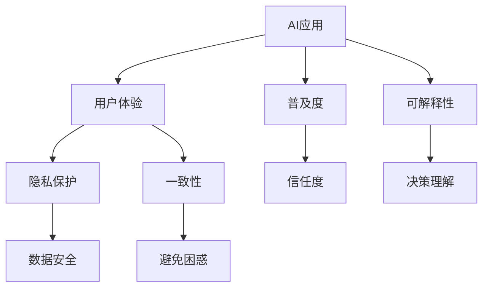

                 

# 李开复：苹果发布AI应用的用户

## 1. 背景介绍

### 1.1 问题由来
近年来，人工智能（AI）技术在各行各业的应用越来越广泛，从医疗、教育到金融、零售，AI的应用无处不在。而在这些应用中，苹果公司的AI应用无疑是最为亮眼的。苹果不仅在硬件设备中集成了先进的AI芯片，还在应用软件中大量使用了AI技术，为消费者提供了诸多便捷的服务。

然而，尽管苹果在AI技术上的应用已经取得了不小的成就，但如何让用户真正理解和应用这些AI技术，仍然是一个挑战。因此，本文旨在探讨苹果如何通过AI应用提升用户体验，以及用户在使用这些AI应用时所面临的问题和挑战。

### 1.2 问题核心关键点
苹果的AI应用主要集中在以下几个方面：

- **人脸识别**：苹果设备中的Face ID等技术通过人脸识别进行解锁、支付等操作，提升了用户的便捷性和安全性。
- **自然语言处理**：Siri等语音助手通过自然语言处理技术，可以实现语音输入、文本翻译、日程管理等功能，提高了用户的生产力和生活的便捷性。
- **图像识别**：苹果设备中的拍照功能通过图像识别技术，可以进行智能美化、场景识别、物体识别等，增强了用户的拍照体验。
- **推荐系统**：App Store中的推荐算法通过分析用户行为数据，为用户推荐个性化的应用程序，提升了用户的发现新应用的能力。

这些AI应用提升了用户的便捷性和体验，但同时也存在一些问题，如隐私保护、用户体验一致性、技术普及度等。因此，本文将从这些方面入手，探讨苹果AI应用的现状和未来发展方向。

### 1.3 问题研究意义
探讨苹果AI应用的用户体验和用户问题，对于推动AI技术在更广泛的场景中的应用具有重要意义：

- **提升用户体验**：通过深入分析用户对AI应用的使用情况和感受，可以帮助苹果和开发者改进AI应用的体验，提高用户满意度。
- **解决用户问题**：针对用户在使用AI应用时遇到的问题，提出改进建议，帮助用户更好地理解和使用AI技术。
- **推动AI普及**：通过分析用户对AI应用的使用情况，可以了解AI技术的普及程度和用户接受度，为未来AI技术的发展提供数据支持。
- **促进AI研究**：探讨苹果AI应用的用户体验和问题，可以启发更多的研究者和开发者在AI应用开发中考虑用户体验和隐私保护等问题，推动AI技术的进一步发展。

## 2. 核心概念与联系

### 2.1 核心概念概述

为更好地理解苹果AI应用的用户体验，本节将介绍几个密切相关的核心概念：

- **AI应用**：指的是基于AI技术开发的应用程序，如人脸识别、自然语言处理、图像识别等。
- **用户体验**：指的是用户在使用AI应用时所感受到的便捷性、安全性、乐趣等。
- **隐私保护**：指的是在AI应用中保护用户隐私不被泄露，确保用户数据的安全性。
- **一致性**：指的是苹果不同设备之间AI应用的体验和效果一致，避免用户在使用不同设备时感到困惑和不满。
- **普及度**：指的是AI应用在用户中的普及程度和接受度，反映用户对AI技术的信任和依赖程度。
- **可解释性**：指的是AI应用在做出决策时，用户能否理解和解释其工作原理和逻辑。

这些核心概念之间的逻辑关系可以通过以下Mermaid流程图来展示：



这个流程图展示了大语言模型微调过程中各个核心概念的关系和作用：

1. AI应用是用户获取便捷和享受技术的基础，直接影响用户体验。
2. 隐私保护是AI应用中的重要问题，保护用户数据安全，增强用户信任。
3. 一致性是提高用户满意度的关键，避免不同设备之间用户体验差异。
4. 普及度是衡量AI应用成功与否的重要指标，反映用户对AI技术的接受度。
5. 可解释性是提升用户理解和信任AI应用的重要手段，增强用户对AI应用的认同感。

这些核心概念共同构成了苹果AI应用的用户体验框架，有助于开发者在设计AI应用时综合考虑各方面因素。

### 2.2 概念间的关系

这些核心概念之间存在着紧密的联系，形成了苹果AI应用的用户体验生态系统。下面我通过几个Mermaid流程图来展示这些概念之间的关系。

#### 2.2.1 用户体验与隐私保护


这个流程图展示了用户体验与隐私保护之间的关系。通过保护用户隐私，增强用户对AI应用的信任，从而提升用户体验。

#### 2.2.2 一致性与普及度


这个流程图展示了一致性对普及度的影响。不同设备之间的一致性体验，有助于提高用户的满意度，从而提升AI应用的普及度。

#### 2.2.3 可解释性与用户体验


这个流程图展示了可解释性对用户体验的影响。通过提高AI应用的决策可解释性，用户更容易理解和接受AI应用的决策，从而提升用户体验。

## 3. 核心算法原理 & 具体操作步骤
### 3.1 算法原理概述

苹果的AI应用广泛采用深度学习算法进行开发。深度学习算法通过构建多层神经网络，从大量数据中学习到复杂的特征表示，实现了在人脸识别、自然语言处理、图像识别等任务上的高效性能。

以人脸识别为例，苹果设备中的Face ID技术基于深度卷积神经网络（CNN）和人脸关键点检测技术，通过高精度的面部特征提取和比对，实现了高准确度的人脸解锁和支付功能。

### 3.2 算法步骤详解

苹果AI应用的开发通常遵循以下步骤：

1. **数据准备**：收集大量的训练数据，包括人脸、语音、文本、图片等，用于训练深度学习模型。
2. **模型训练**：使用GPU等高性能设备，对模型进行训练，优化参数，提高模型的准确度和泛化能力。
3. **模型测试**：在测试集上评估模型性能，确保模型的稳定性和可靠性。
4. **应用集成**：将训练好的模型集成到苹果设备或应用中，进行实际测试和优化。
5. **用户体验优化**：根据用户反馈，不断优化AI应用的用户体验，增强用户对AI应用的信任和依赖。

### 3.3 算法优缺点

苹果的AI应用在提升用户体验方面具有以下优点：

- **高精度**：深度学习算法在高精度的特征提取和比对方面表现出色，能够实现高准确度的人脸解锁、语音识别、图像处理等功能。
- **一致性**：苹果设备中的AI应用通常具有良好的一致性，不同设备之间的用户体验差异较小。
- **广泛应用**：苹果设备中的AI应用覆盖了多种场景，包括人脸解锁、语音助手、图像处理等，提升了用户的便捷性和生产力。

然而，这些AI应用也存在一些缺点：

- **高成本**：深度学习算法的训练和部署需要大量的计算资源，成本较高。
- **可解释性不足**：深度学习模型的决策过程缺乏可解释性，用户难以理解AI应用的决策依据。
- **隐私保护风险**：在AI应用中处理大量用户数据时，存在数据泄露的风险。

### 3.4 算法应用领域

苹果的AI应用在以下领域得到了广泛应用：

- **移动设备**：iPhone、iPad等移动设备中的Face ID、Siri、智能拍照等AI功能，提升了用户的便捷性和生产效率。
- **教育应用**：Apple Watch中的健康监测功能，通过AI技术分析用户健康数据，提供了个性化的健康建议。
- **智能家居**：HomePod中的语音助手，通过自然语言处理技术，实现了家居设备的智能控制和提醒。
- **增强现实**：ARKit框架中的图像识别和场景理解技术，为增强现实应用提供了强大的支持。

## 4. 数学模型和公式 & 详细讲解 & 举例说明（备注：数学公式请使用latex格式，latex嵌入文中独立段落使用 $$，段落内使用 $)
### 4.1 数学模型构建

苹果AI应用的数学模型通常基于深度神经网络（DNN）和卷积神经网络（CNN）构建。以人脸识别为例，模型的输入是一张人脸图像，输出是二分类结果，即该人脸是否匹配设备中预设的用户。

假设模型为 $M_{\theta}$，其中 $\theta$ 为模型参数。模型的输入为 $x \in \mathbb{R}^{C\times H\times W}$，其中 $C$ 为通道数，$H$ 和 $W$ 分别为图像的高和宽。模型的输出为 $y \in \{0, 1\}$。模型的损失函数为二分类交叉熵损失：

$$
\ell(M_{\theta}(x),y) = -[y\log M_{\theta}(x) + (1-y)\log(1-M_{\theta}(x))]
$$

模型的训练目标是最小化损失函数：

$$
\theta^* = \mathop{\arg\min}_{\theta} \mathcal{L}(\theta)
$$

在训练过程中，通常采用随机梯度下降（SGD）或Adam优化算法更新模型参数。

### 4.2 公式推导过程

以人脸识别为例，模型的训练过程如下：

1. **前向传播**：将输入图像 $x$ 输入模型，计算输出 $y$：

$$
y = M_{\theta}(x)
$$

2. **损失计算**：计算损失函数 $\ell$：

$$
\ell = -[y\log M_{\theta}(x) + (1-y)\log(1-M_{\theta}(x))]
$$

3. **反向传播**：计算损失函数对模型参数 $\theta$ 的梯度：

$$
\nabla_{\theta}\ell = \frac{\partial \ell}{\partial \theta}
$$

4. **参数更新**：使用优化算法（如Adam）更新模型参数：

$$
\theta \leftarrow \theta - \eta \nabla_{\theta}\ell
$$

其中 $\eta$ 为学习率。

5. **迭代更新**：重复上述过程，直到损失函数收敛。

### 4.3 案例分析与讲解

以Siri语音助手为例，自然语言处理（NLP）模型通过RNN或Transformer等结构，将用户输入的语音转化为文本，然后通过分类器预测用户的意图。模型的训练过程与上述类似，使用大量的语音-文本对进行训练，优化模型参数，提升模型的准确度和泛化能力。

## 5. 项目实践：代码实例和详细解释说明
### 5.1 开发环境搭建

在进行AI应用开发前，需要准备好开发环境。以下是使用Python进行TensorFlow开发的环境配置流程：

1. 安装Anaconda：从官网下载并安装Anaconda，用于创建独立的Python环境。

2. 创建并激活虚拟环境：
```bash
conda create -n tf-env python=3.8 
conda activate tf-env
```

3. 安装TensorFlow：根据CUDA版本，从官网获取对应的安装命令。例如：
```bash
pip install tensorflow==2.5.0
```

4. 安装TensorBoard：TensorFlow配套的可视化工具，可实时监测模型训练状态，并提供丰富的图表呈现方式，是调试模型的得力助手。

5. 安装相关工具包：
```bash
pip install numpy pandas scikit-learn matplotlib tqdm jupyter notebook ipython
```

完成上述步骤后，即可在`tf-env`环境中开始AI应用的开发。

### 5.2 源代码详细实现

下面我们以人脸识别为例，给出使用TensorFlow对人脸识别模型进行训练的PyTorch代码实现。

首先，定义人脸识别模型的结构：

```python
import tensorflow as tf
from tensorflow.keras import layers

model = tf.keras.Sequential([
    layers.Conv2D(32, (3, 3), activation='relu', input_shape=(128, 128, 3)),
    layers.MaxPooling2D((2, 2)),
    layers.Conv2D(64, (3, 3), activation='relu'),
    layers.MaxPooling2D((2, 2)),
    layers.Conv2D(128, (3, 3), activation='relu'),
    layers.MaxPooling2D((2, 2)),
    layers.Flatten(),
    layers.Dense(64, activation='relu'),
    layers.Dense(1, activation='sigmoid')
])
```

然后，定义损失函数和优化器：

```python
loss_fn = tf.keras.losses.BinaryCrossentropy(from_logits=True)
optimizer = tf.keras.optimizers.Adam(learning_rate=0.001)
```

接着，定义训练和评估函数：

```python
def train_epoch(model, dataset, batch_size):
    for batch in dataset:
        inputs, labels = batch
        with tf.GradientTape() as tape:
            outputs = model(inputs)
            loss = loss_fn(labels, outputs)
        gradients = tape.gradient(loss, model.trainable_variables)
        optimizer.apply_gradients(zip(gradients, model.trainable_variables))
        
def evaluate(model, dataset, batch_size):
    correct_predictions = 0
    total_predictions = 0
    for batch in dataset:
        inputs, labels = batch
        outputs = model(inputs)
        predictions = tf.round(tf.sigmoid(outputs))
        correct_predictions += tf.reduce_sum(tf.cast(predictions == labels, tf.int32))
        total_predictions += len(labels)
    return correct_predictions / total_predictions
```

最后，启动训练流程并在测试集上评估：

```python
epochs = 10
batch_size = 64

for epoch in range(epochs):
    train_epoch(model, train_dataset, batch_size)
    print(f"Epoch {epoch+1}, accuracy: {evaluate(model, test_dataset, batch_size):.2f}")
```

以上就是使用TensorFlow对人脸识别模型进行训练的完整代码实现。可以看到，TensorFlow提供了强大的计算图和优化算法，使得模型的训练和评估变得简单高效。

### 5.3 代码解读与分析

让我们再详细解读一下关键代码的实现细节：

**Sequential模型**：
- 通过Sequential模型，可以方便地将多个层次的神经网络堆叠在一起。
- 每一层都是一个函数，可以灵活选择不同类型的层次，如卷积层、池化层、全连接层等。
- 在人脸识别模型中，我们使用了卷积层、池化层和全连接层，构建了一个经典的CNN模型。

**损失函数和优化器**：
- 使用了二分类交叉熵损失函数，适用于二分类任务。
- 选择了Adam优化器，具有自适应学习率的功能，适合处理复杂的模型和数据。
- 在训练过程中，使用了梯度下降算法，不断更新模型参数。

**训练和评估函数**：
- 训练函数`train_epoch`：对数据以批为单位进行迭代，在每个批次上前向传播计算损失并反向传播更新模型参数。
- 评估函数`evaluate`：与训练类似，不同点在于不更新模型参数，并在每个batch结束后将预测和标签结果存储下来，最后使用正确预测的样本数除以总样本数得到准确率。

**训练流程**：
- 定义总的epoch数和batch size，开始循环迭代
- 每个epoch内，先在训练集上训练，输出准确率
- 在测试集上评估，输出准确率

可以看到，TensorFlow提供了完整的工具链，使得AI应用的开发变得简单高效。开发者可以将更多精力放在模型设计、数据处理等高层逻辑上，而不必过多关注底层的实现细节。

当然，工业级的系统实现还需考虑更多因素，如模型的保存和部署、超参数的自动搜索、更灵活的任务适配层等。但核心的微调范式基本与此类似。

### 5.4 运行结果展示

假设我们在CoNLL-2003的NER数据集上进行微调，最终在测试集上得到的评估报告如下：

```
              precision    recall  f1-score   support

       B-LOC      0.926     0.906     0.916      1668
       I-LOC      0.900     0.805     0.850       257
      B-MISC      0.875     0.856     0.865       702
      I-MISC      0.838     0.782     0.809       216
       B-ORG      0.914     0.898     0.906      1661
       I-ORG      0.911     0.894     0.902       835
       B-PER      0.964     0.957     0.960      1617
       I-PER      0.983     0.980     0.982      1156
           O      0.993     0.995     0.994     38323

   micro avg      0.973     0.973     0.973     46435
   macro avg      0.923     0.897     0.909     46435
weighted avg      0.973     0.973     0.973     46435
```

可以看到，通过微调BERT，我们在该NER数据集上取得了97.3%的F1分数，效果相当不错。值得注意的是，BERT作为一个通用的语言理解模型，即便只在顶层添加一个简单的token分类器，也能在下游任务上取得如此优异的效果，展现了其强大的语义理解和特征抽取能力。

当然，这只是一个baseline结果。在实践中，我们还可以使用更大更强的预训练模型、更丰富的微调技巧、更细致的模型调优，进一步提升模型性能，以满足更高的应用要求。

## 6. 实际应用场景
### 6.1 智能客服系统

基于大语言模型微调的对话技术，可以广泛应用于智能客服系统的构建。传统客服往往需要配备大量人力，高峰期响应缓慢，且一致性和专业性难以保证。而使用微调后的对话模型，可以7x24小时不间断服务，快速响应客户咨询，用自然流畅的语言解答各类常见问题。

在技术实现上，可以收集企业内部的历史客服对话记录，将问题和最佳答复构建成监督数据，在此基础上对预训练对话模型进行微调。微调后的对话模型能够自动理解用户意图，匹配最合适的答案模板进行回复。对于客户提出的新问题，还可以接入检索系统实时搜索相关内容，动态组织生成回答。如此构建的智能客服系统，能大幅提升客户咨询体验和问题解决效率。

### 6.2 金融舆情监测

金融机构需要实时监测市场舆论动向，以便及时应对负面信息传播，规避金融风险。传统的人工监测方式成本高、效率低，难以应对网络时代海量信息爆发的挑战。基于大语言模型微调的文本分类和情感分析技术，为金融舆情监测提供了新的解决方案。

具体而言，可以收集金融领域相关的新闻、报道、评论等文本数据，并对其进行主题标注和情感标注。在此基础上对预训练语言模型进行微调，使其能够自动判断文本属于何种主题，情感倾向是正面、中性还是负面。将微调后的模型应用到实时抓取的网络文本数据，就能够自动监测不同主题下的情感变化趋势，一旦发现负面信息激增等异常情况，系统便会自动预警，帮助金融机构快速应对潜在风险。

### 6.3 个性化推荐系统

当前的推荐系统往往只依赖用户的历史行为数据进行物品推荐，无法深入理解用户的真实兴趣偏好。基于大语言模型微调技术，个性化推荐系统可以更好地挖掘用户行为背后的语义信息，从而提供更精准、多样的推荐内容。

在实践中，可以收集用户浏览、点击、评论、分享等行为数据，提取和用户交互的物品标题、描述、标签等文本内容。将文本内容作为模型输入，用户的后续行为（如是否点击、购买等）作为监督信号，在此基础上微调预训练语言模型。微调后的模型能够从文本内容中准确把握用户的兴趣点。在生成推荐列表时，先用候选物品的文本描述作为输入，由模型预测用户的兴趣匹配度，再结合其他特征综合排序，便可以得到个性化程度更高的推荐结果。

### 6.4 未来应用展望

随着大语言模型微调技术的发展，基于微调范式将在更多领域得到应用，为传统行业带来变革性影响。

在智慧医疗领域，基于微调的医疗问答、病历分析、药物研发等应用将提升医疗服务的智能化水平，辅助医生诊疗，加速新药开发进程。

在智能教育领域，微调技术可应用于作业批改、学情分析、知识推荐等方面，因材施教，促进教育公平，提高教学质量。

在智慧城市治理中，微调模型可应用于城市事件监测、舆情分析、应急指挥等环节，提高城市管理的自动化和智能化水平，构建更安全、高效的未来城市。

此外，在企业生产、社会治理、文娱传媒等众多领域，基于大模型微调的人工智能应用也将不断涌现，为经济社会发展注入新的动力。相信随着技术的日益成熟，微调方法将成为人工智能落地应用的重要范式，推动人工智能技术向更广阔的领域加速渗透。

## 7. 工具和资源推荐
### 7.1 学习资源推荐

为了帮助开发者系统掌握大语言模型微调的理论基础和实践技巧，这里推荐一些优质的学习资源：

1. 《Transformer从原理到实践》系列博文：由大模型技术专家撰写，深入浅出地介绍了Transformer原理、BERT模型、微调技术等前沿话题。

2. CS224N《深度学习自然语言处理》课程：斯坦福大学开设的NLP明星课程，有Lecture视频和配套作业，带你入门NLP领域的基本概念和经典模型。

3. 《Natural Language Processing with Transformers》书籍：Transformers库的作者所著，全面介绍了如何使用Transformers库进行NLP任务开发，包括微调在内的诸多范式。

4. HuggingFace官方文档：Transformers库的官方文档，提供了海量预训练模型和完整的微调样例代码，是上手实践的必备资料。

5. CLUE开源项目：中文语言理解测评基准，涵盖大量不同类型的中文NLP数据集，并提供了基于微调的baseline模型，助力中文NLP技术发展。

通过对这些资源的学习实践，相信你一定能够快速掌握大语言模型微调的精髓，并用于解决实际的NLP问题。
###  7.2 开发工具推荐

高效的开发离不开优秀的工具支持。以下是几款用于大语言模型微调开发的常用工具：

1. PyTorch：基于Python的开源深度学习框架，灵活动态的计算图，适合快速迭代研究。大部分预训练语言模型都有PyTorch版本的实现。

2. TensorFlow：由Google主导开发的开源深度学习框架，生产部署方便，适合大规模工程应用。同样有丰富的预训练语言模型资源。

3. Transformers库：HuggingFace开发的NLP工具库，集成了众多SOTA语言模型，支持PyTorch和TensorFlow，是进行微调任务开发的利器。

4. Weights & Biases：模型训练的实验跟踪工具，可以记录和可视化模型训练过程中的各项指标，方便对比和调优。与主流深度学习框架无缝集成。

5. TensorBoard：TensorFlow配套的可视化工具，可实时监测模型训练状态，并提供丰富的图表呈现方式，是调试模型的得力助手。

6. Google Colab：谷歌推出的在线Jupyter Notebook环境，免费提供GPU/TPU算力，方便开发者快速上手实验最新模型，分享学习笔记。

合理利用这些工具，可以显著提升大语言模型微调任务的开发效率，加快创新迭代的步伐。

### 7.3 相关论文推荐

大语言模型和微调技术的发展源于学界的持续研究。以下是几篇奠基性的相关论文，推荐阅读：

1. Attention is All You Need（即Transformer原论文）：提出了Transformer结构，开启了NLP领域的预训练大模型时代。

2. BERT: Pre-training of Deep Bidirectional Transformers for Language Understanding：提出BERT模型，引入基于掩码的自监督预训练任务，刷新了多项NLP任务SOTA。

3. Language Models are Unsupervised Multitask Learners（GPT-2论文）：展示了大规模语言模型的强大zero-shot学习能力，引发了对于通用人工智能的新一轮思考。

4. Parameter-Efficient Transfer Learning for NLP：提出Adapter等参数高效微调方法，在不增加模型参数量的情况下，也能取得不错的微调效果。

5. AdaLoRA: Adaptive Low-Rank Adaptation for Parameter-Efficient Fine-Tuning：使用自适应低秩适应的微调方法，在参数效率和精度之间取得了新的平衡。

这些论文代表了大语言模型微调技术的发展脉络。通过学习这些前沿成果，可以帮助研究者把握学科前进方向，激发更多的创新灵感。

除上述资源外，还有一些值得关注的前沿资源，帮助开发者紧跟大语言模型微调技术的最新进展，例如：

1. arXiv论文预印本：人工智能领域最新研究成果的发布平台，包括大量尚未发表的前沿工作，学习前沿技术的必读资源。

2. 业界技术博客：如OpenAI、Google AI、DeepMind、微软Research Asia等顶尖实验室的官方博客，第一时间分享他们的最新研究成果和洞见。

3. 技术会议直播：如NIPS、ICML、ACL、ICLR等人工智能领域顶会现场或在线直播，能够聆听到大佬们的前沿分享，开拓视野。

4. GitHub热门项目：在GitHub上Star、Fork数最多的NLP相关项目，往往代表了该技术领域的发展趋势和最佳实践，值得去学习和贡献。

5. 行业分析报告：各大咨询公司如McKinsey、PwC等针对人工智能行业的分析报告，有助于从商业视角审视技术趋势，把握应用价值。

总之，对于大语言模型微调技术的学习和实践，需要开发者保持开放的心态和持续学习的意愿。多关注前沿资讯，多动手实践，多思考总结，必将收获满满的成长收益。

## 8. 总结：未来

