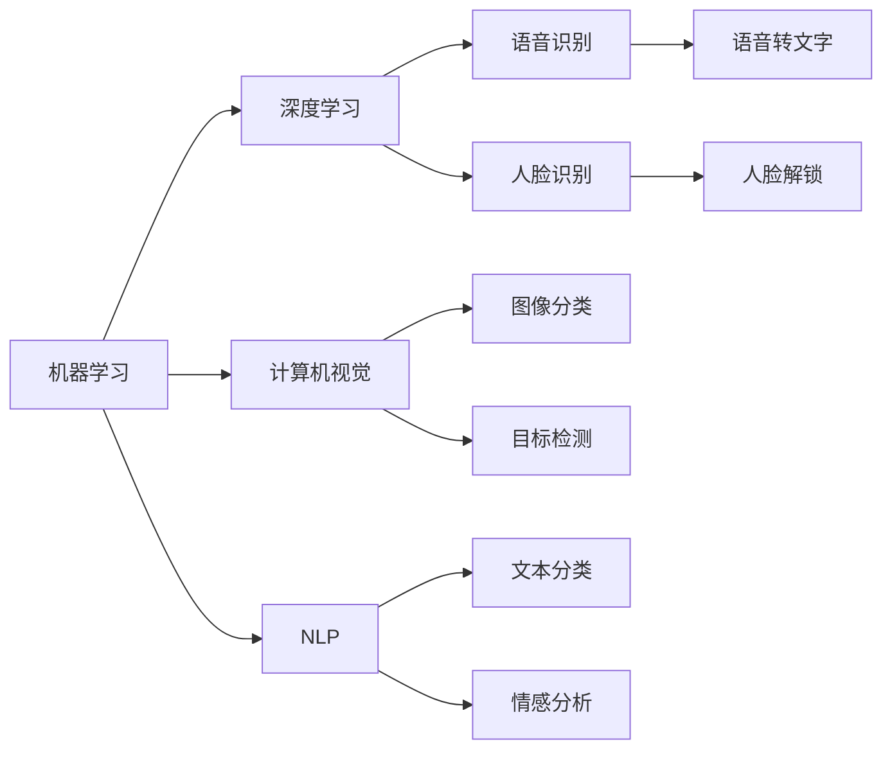

                 

## 1. 背景介绍

苹果公司近日宣布将在其最新设备中推出一系列先进的AI应用，包括面部识别、语音识别和自然语言处理等，这标志着AI技术在苹果设备中的广泛应用。这些应用不仅提升了用户体验，也为未来的AI技术发展提供了新的方向。

## 2. 核心概念与联系

### 2.1 核心概念概述

AI应用是指利用人工智能技术解决实际问题的应用系统。AI应用涉及多个核心概念，包括但不限于：

- **机器学习（Machine Learning）**：指让机器通过学习历史数据，自动发现数据中的规律，从而实现对未知数据的预测或分类。
- **深度学习（Deep Learning）**：是机器学习的一种特殊形式，利用神经网络对大量复杂数据进行建模和分析。
- **计算机视觉（Computer Vision）**：利用图像识别和处理技术，实现对视觉数据的理解、分析和识别。
- **自然语言处理（Natural Language Processing, NLP）**：指让计算机能够理解、分析和生成自然语言文本，包括语音识别、文本分类、情感分析等。
- **语音识别（Speech Recognition）**：将语音信号转换为文本形式的技术，通常用于语音助手、自动转录等场景。
- **人脸识别（Face Recognition）**：利用图像和视频处理技术，实现对人脸特征的自动分析和识别。

### 2.2 核心概念间的关系

这些核心概念之间的关系可以通过以下Mermaid流程图来展示：



这个流程图展示了各个核心概念之间的联系和应用场景：

- 机器学习是深度学习和AI应用的基础。
- 深度学习是机器学习的一种高级形式，在复杂数据处理中发挥重要作用。
- 计算机视觉和自然语言处理是AI应用的两个重要分支，分别涉及视觉和语言数据的处理。
- 语音识别和面部识别是计算机视觉的具体应用，主要用于交互式设备和人脸解锁等场景。
- 图像分类和目标检测是计算机视觉的主要任务，可以用于智能监控和自动驾驶等应用。
- 文本分类和情感分析是自然语言处理的重要任务，可以用于智能客服和舆情分析等场景。

### 2.3 核心概念的整体架构

从以上图表可以看出，AI应用的整体架构大致如下：

```
┌───────────────────────────────────────────────────────────────────────────────────────────────────────────────────────────────────────────────────────────────────────────────────────────────────────────────────────────────────────────────────────────────────────────────────────────────────────────────────────────────────────────────────────────────────────────────────────────────────────────────────────────────────────────────────────────────────────────────────────────────────────────────────────────────────────────────────────────────────────────────────────────────────────────────────────────────────────────────────────────────────────────────────────────────────────────────────────────────────────────────────────────────────────────────────────────────────────────────────────────────────────────────────────────────────────────────────────────────────────────────────────────────────────────────────────────────────────────────────────────────────────────────────────────────────────────────────────────────────────────────────────────────────────────────────────────────────────────────────────────────────────────────────────────────────────────────────────────────────────────────────────────────────────────────────────────────────────────────────────────────────────────────────────────────────────────────────────────────────────────────────────────────────────────────────────────────────────────────────────────────────────────────────────────────────────────────────────────────────────────────────────────────────────────────────────────────────────────────────────────────────────────────────────────────────────────────────────────────────────────────────────────────────────────────────────────────────────────────────────────────────────────────────────────────────────────────────────────────────────────────────────────────────────────────────────────────────────────────────────────────────────────────────────────────────────────────────────────────────────────────────────────────────────────────────────────────────────────────────────────────────────────────────────────────────────────────────────────────────────────────────────────────────────────────────────────────────────────────────────────────────────────────────────────────────────────────────────────────────────────────────────────────────────────────────────────────────────────────────────────────────────────────────────────────────────────────────────────────────────────────────────────────────────────────────────────────────────────────────────────────────────────────────────────────────────────────────────────────────────────────────────────────────────────────────────────────────────────────────────────────────────────────────────────────────────────────────────────────────────────────────────────────────────────────────────────────────────────────────────────────────────────────────────────────────────────────────────────────────────────────────────────────────────────────────────────────────────────────────────────────────────────────────────────────────────────────────────────────────────────────────────────────────────────────────────────────────────────────────────────────────────────────────────────────────────────────────────────────────────────────────────────────────────────────────────────────────────────────────────────────────────────────────────────────────────────────────────────────────────────────────────────────────────────────────────────────────────────────────────────────────────────────────────────────────────────────────────────────────────────────────────────────────────────────────────────────────────────────────────────────────────────────────────────────────────────────────────────────────────────────────────────────────────────────────────────────────────────────────────────────────────────────────────────────────────────────────────────────────────────────────────────────────────────────────────────────────────────────────────────────────────────────────────────────────────────────────────────────────────────────────────────────────────────────────────────────────────────────────────────────────────────────────────────────────────────────────────────────────────────────────────────────────────────────────────────────────────────────────────────────────────────────────────────────────────────────────────────────────────────────────────────────────────────────────────────────────────────────────────────────────────────────────────────────────────────────────────────────────────────────────────────────────────────────────────────────────────────────────────────────────────────────────────────────────────────────────────────────────────────────────────────────────────────────────────────────────────────────────────────────────────────────────────────────────────────────────────────────────────────────────────────────────────────────────────────────────────────────────────────────────────────────────────────────────────────────────────────────────────────────────────────────────────────────────────────────────────────────────────────────────────────────────────────────────────────────────────────────────────────────────────────────────────────────────────────────────────────────────────────

