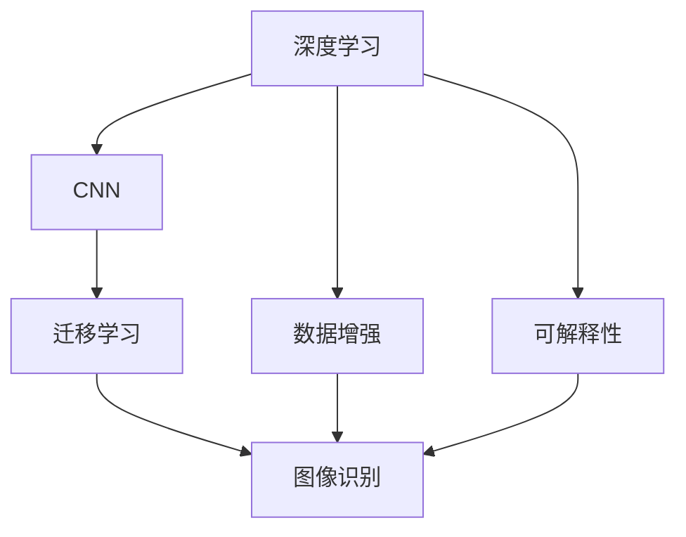
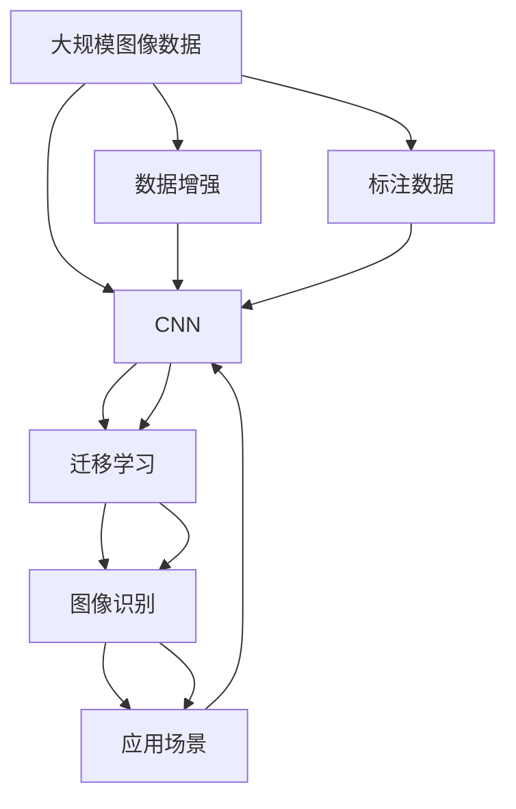

                 

## 1. 背景介绍

### 1.1 问题由来
人工智能（AI）的迅猛发展，特别是深度学习技术的突破，使得图像识别（Image Recognition）成为了当今科技领域的一大热点。在这其中，斯坦福大学计算机视觉实验室主任、人工智能领域的重要奠基人李飞飞教授的贡献功不可没。

李飞飞教授及其团队的研究不仅奠定了计算机视觉和深度学习的基础，也推动了图像识别技术的广泛应用，包括医疗影像分析、自动驾驶、智能监控、安防监控等多个领域。

### 1.2 问题核心关键点
李飞飞教授在图像识别领域的研究核心关键点包括：

- **大规模图像数据集的构建与使用**：通过对ImageNet等大规模数据集的构建和应用，使得深度学习模型能够在庞大的数据规模上学习到丰富的特征，从而提升图像识别的准确性。
- **数据增强与迁移学习**：通过数据增强（Data Augmentation）和迁移学习（Transfer Learning）技术，使得模型在少量标注数据的情况下也能取得优异的表现。
- **深度网络架构的设计与优化**：提出了一系列创新性的深度网络架构，如卷积神经网络（CNN）、ResNet等，为图像识别提供了更加高效的计算基础。
- **领域特定任务（Domain-Specific Tasks）的适应**：针对不同的应用场景，开发了适用于特定任务的模型和算法，如医学影像识别、人脸识别等。
- **模型的可解释性与可靠性**：研究如何提高模型的可解释性和鲁棒性，确保其在实际应用中的稳定性和可靠性。

### 1.3 问题研究意义
李飞飞教授在图像识别领域的研究不仅推动了技术进步，更对产业发展产生了深远影响：

- **降低研发成本**：通过数据增强和迁移学习技术，可以显著降低图像识别系统在研发阶段所需的标注数据和计算资源。
- **提升应用效果**：大模型和大规模数据集的构建使得图像识别系统在实际应用中能够获得更高的准确性和泛化能力。
- **加速技术产业化**：通过对不同领域特定任务的适应，使得图像识别技术能够快速应用于医疗、安防、自动驾驶等多个行业，促进产业升级。
- **提高社会价值**：图像识别技术的广泛应用，如智能监控、自动驾驶等，显著提升了社会效率和安全性，提高了人类生活质量。

## 2. 核心概念与联系

### 2.1 核心概念概述

为了更好地理解李飞飞教授在图像识别领域的贡献，本节将介绍几个密切相关的核心概念：

- **深度学习（Deep Learning）**：一种通过多层次神经网络自动学习数据特征的机器学习技术。李飞飞教授的研究基于深度学习，通过构建复杂网络结构，使得模型能够自动提取和学习数据中的高级特征。
- **卷积神经网络（Convolutional Neural Networks, CNN）**：一种专门用于图像处理和计算机视觉任务的深度学习网络结构。通过卷积、池化等操作，CNN能够高效地捕捉图像中的局部特征。
- **迁移学习（Transfer Learning）**：一种利用预训练模型在下游任务上进行微调的方法。李飞飞教授的研究中广泛应用迁移学习技术，使得模型在少量数据情况下也能取得优异效果。
- **数据增强（Data Augmentation）**：通过对训练数据进行一系列随机变换，扩充训练集，提高模型的泛化能力。
- **可解释性（Explainability）**：研究如何提高模型的可解释性，使模型决策过程更加透明和可理解。

### 2.2 概念间的关系

这些核心概念之间的逻辑关系可以通过以下Mermaid流程图来展示：



这个流程图展示了深度学习在图像识别中的应用过程，通过卷积神经网络提取特征，迁移学习进行微调，数据增强扩充训练集，可解释性确保模型决策的透明性。

### 2.3 核心概念的整体架构

最后，我们用一个综合的流程图来展示这些核心概念在大规模图像识别任务中的整体架构：



这个综合流程图展示了从数据预处理、模型训练、应用部署的整个图像识别任务流程。通过大规模数据集、卷积神经网络、迁移学习等技术，构建的模型能够在实际应用中实现高效、准确的图像识别。

## 3. 核心算法原理 & 具体操作步骤
### 3.1 算法原理概述

李飞飞教授的研究主要围绕深度学习和卷积神经网络展开，以下是对其核心算法原理的概述：

**深度学习与CNN**：
深度学习通过多层非线性变换，自动提取和表示数据的高级特征。卷积神经网络（CNN）是深度学习在图像处理和计算机视觉任务中的主要应用形式，通过卷积操作捕获图像的局部特征，并通过池化操作减少特征维度，提高计算效率。

**迁移学习**：
迁移学习利用预训练模型在大规模数据集上学习到的特征，在下游任务上微调模型。具体步骤包括：
1. 在大规模数据集上预训练一个通用模型。
2. 在下游任务上使用标注数据微调模型，更新部分层参数，保留预训练模型的底层权重不变。
3. 在微调过程中，通过正则化技术（如L2正则、Dropout等）避免过拟合。

**数据增强**：
数据增强通过随机变换训练数据，扩充训练集，如旋转、翻转、缩放等操作。其核心思想是通过增加数据样本的多样性，提高模型对噪声和扰动的鲁棒性。

### 3.2 算法步骤详解

基于李飞飞教授的研究，以下是图像识别任务中常用的核心算法步骤：

**Step 1: 准备数据集**
- 收集并标注大规模图像数据集，如ImageNet、COCO等。
- 将数据集分为训练集、验证集和测试集，一般比例为8:1:1。

**Step 2: 构建卷积神经网络**
- 使用PyTorch、TensorFlow等深度学习框架构建CNN模型。
- 设计网络结构，如VGG、ResNet、Inception等。
- 在最后一层添加softmax激活函数，用于分类任务。

**Step 3: 预训练模型**
- 在大规模数据集上预训练模型。
- 使用数据增强技术扩充训练集，如随机裁剪、翻转等。
- 设置合适的优化器和超参数，如学习率、批大小等。
- 训练模型一定轮数，并在验证集上评估性能。

**Step 4: 微调模型**
- 选择下游任务的数据集和标注数据。
- 冻结模型的部分层，只微调顶层。
- 使用迁移学习技术，更新顶层参数，保留预训练模型的底层权重不变。
- 在微调过程中，进行正则化操作，防止过拟合。

**Step 5: 评估模型**
- 在测试集上评估微调后模型的性能，如准确率、召回率等指标。
- 使用混淆矩阵、ROC曲线等工具进行模型分析。

**Step 6: 应用部署**
- 将训练好的模型部署到实际应用中，如医疗影像识别、自动驾驶、智能监控等。
- 针对不同场景进行模型优化和调整。
- 持续收集数据，定期重新训练和微调模型。

### 3.3 算法优缺点

基于李飞飞教授的研究，图像识别任务中的迁移学习算法具有以下优点：

- **高效性**：在少量标注数据情况下，利用预训练模型快速适应新任务，节省标注成本和时间。
- **泛化能力**：大规模预训练模型能够学习到丰富的特征，提高模型在实际应用中的泛化能力。
- **鲁棒性**：通过数据增强技术，提高模型对噪声和扰动的鲁棒性。

同时，该算法也存在一些缺点：

- **数据依赖**：对于大规模预训练模型，需要大量数据进行预训练，获取标注数据的成本较高。
- **模型复杂度**：预训练和微调过程需要高性能计算资源，对硬件要求较高。
- **可解释性不足**：深度学习模型通常被视为"黑盒"，模型决策过程难以解释。

### 3.4 算法应用领域

李飞飞教授的研究成果广泛应用于以下几个领域：

- **医疗影像分析**：利用图像识别技术进行医学影像诊断，如肺结节检测、肿瘤识别等。
- **自动驾驶**：利用图像识别技术进行道路标志识别、行人检测、车辆跟踪等。
- **智能监控**：利用图像识别技术进行异常行为检测、人脸识别等。
- **安防监控**：利用图像识别技术进行入侵检测、行为分析等。
- **零售业**：利用图像识别技术进行商品识别、用户行为分析等。

## 4. 数学模型和公式 & 详细讲解 & 举例说明

### 4.1 数学模型构建

李飞飞教授的研究中，卷积神经网络（CNN）是图像识别的核心。以下是对CNN数学模型的详细构建过程：

**CNN模型**：
$$
\begin{aligned}
\mathbf{X} &= \begin{bmatrix}
\mathbf{x}_1 \\
\mathbf{x}_2 \\
\vdots \\
\mathbf{x}_n
\end{bmatrix} \in \mathbb{R}^{n \times m} \\
\mathbf{W}_1 &= \begin{bmatrix}
\mathbf{w}_{11} & \mathbf{w}_{12} & \cdots & \mathbf{w}_{1n} \\
\mathbf{w}_{21} & \mathbf{w}_{22} & \cdots & \mathbf{w}_{2n} \\
\vdots & \vdots & \ddots & \vdots \\
\mathbf{w}_{n1} & \mathbf{w}_{n2} & \cdots & \mathbf{w}_{nn}
\end{bmatrix} \in \mathbb{R}^{d \times m} \\
\mathbf{b}_1 &= \begin{bmatrix}
b_{11} \\
b_{12} \\
\vdots \\
b_{1n}
\end{bmatrix} \in \mathbb{R}^d \\
\mathbf{W}_2 &= \begin{bmatrix}
\mathbf{w}_{21} & \mathbf{w}_{22} & \cdots & \mathbf{w}_{2n} \\
\vdots & \vdots & \ddots & \vdots \\
\mathbf{w}_{m1} & \mathbf{w}_{m2} & \cdots & \mathbf{w}_{mn}
\end{bmatrix} \in \mathbb{R}^{c \times d} \\
\mathbf{b}_2 &= \begin{bmatrix}
b_{21} \\
b_{22} \\
\vdots \\
b_{2n}
\end{bmatrix} \in \mathbb{R}^c \\
\end{aligned}
$$

其中，$\mathbf{X}$为输入图像，$\mathbf{W}_1$和$\mathbf{b}_1$为卷积层的权重和偏置，$\mathbf{W}_2$和$\mathbf{b}_2$为全连接层的权重和偏置，$c$为类别数，$m$为输入图像的宽度，$n$为输入图像的高度，$d$为卷积层的输出通道数。

**激活函数**：
$$
\sigma(\cdot) = \max(0, \cdot)
$$

### 4.2 公式推导过程

以下是对CNN模型的公式推导过程：

**卷积操作**：
$$
\begin{aligned}
\mathbf{X} &= \begin{bmatrix}
\mathbf{x}_1 \\
\mathbf{x}_2 \\
\vdots \\
\mathbf{x}_n
\end{bmatrix} \in \mathbb{R}^{n \times m} \\
\mathbf{W}_1 &= \begin{bmatrix}
\mathbf{w}_{11} & \mathbf{w}_{12} & \cdots & \mathbf{w}_{1n} \\
\mathbf{w}_{21} & \mathbf{w}_{22} & \cdots & \mathbf{w}_{2n} \\
\vdots & \vdots & \ddots & \vdots \\
\mathbf{w}_{n1} & \mathbf{w}_{n2} & \cdots & \mathbf{w}_{nn}
\end{bmatrix} \in \mathbb{R}^{d \times m} \\
\mathbf{b}_1 &= \begin{bmatrix}
b_{11} \\
b_{12} \\
\vdots \\
b_{1n}
\end{bmatrix} \in \mathbb{R}^d \\
\end{aligned}
$$

卷积操作公式为：
$$
\begin{aligned}
\mathbf{Z}_1 &= \mathbf{X} \star \mathbf{W}_1 + \mathbf{b}_1 \\
\mathbf{Z}_1 &= \begin{bmatrix}
\sum_{j=1}^{d} \sum_{i=1}^{m} \mathbf{x}_{j,i} \mathbf{w}_{1,j,i} \\
\sum_{j=1}^{d} \sum_{i=1}^{m} \mathbf{x}_{j,i} \mathbf{w}_{1,j,i} + b_{11} \\
\vdots \\
\sum_{j=1}^{d} \sum_{i=1}^{m} \mathbf{x}_{j,i} \mathbf{w}_{1,j,i} + b_{1n}
\end{bmatrix} \in \mathbb{R}^{n \times d}
\end{aligned}
$$

其中，$\star$为卷积运算符，$j$表示卷积核的通道数，$i$表示卷积核在输入图像上的位置，$d$为卷积核的深度。

**池化操作**：
$$
\begin{aligned}
\mathbf{Z}_2 &= \begin{bmatrix}
\max(\mathbf{z}_{1,1}, \mathbf{z}_{1,2}, \ldots, \mathbf{z}_{1,k}) \\
\max(\mathbf{z}_{2,1}, \mathbf{z}_{2,2}, \ldots, \mathbf{z}_{2,k}) \\
\vdots \\
\max(\mathbf{z}_{n,1}, \mathbf{z}_{n,2}, \ldots, \mathbf{z}_{n,k})
\end{bmatrix} \in \mathbb{R}^{n' \times d'}
\end{aligned}
$$

其中，$k$为池化操作的窗口大小，$n'$为输出序列的长度，$d'$为池化后的深度。

**全连接层**：
$$
\begin{aligned}
\mathbf{Z}_3 &= \mathbf{Z}_2 \mathbf{W}_2 + \mathbf{b}_2 \\
\mathbf{Z}_3 &= \begin{bmatrix}
\sum_{j=1}^{c} \sum_{i=1}^{d'} \mathbf{z}_{i,j} \mathbf{w}_{2,j,i} \\
\sum_{j=1}^{c} \sum_{i=1}^{d'} \mathbf{z}_{i,j} \mathbf{w}_{2,j,i} + b_{21} \\
\vdots \\
\sum_{j=1}^{c} \sum_{i=1}^{d'} \mathbf{z}_{i,j} \mathbf{w}_{2,j,i} + b_{2n}
\end{bmatrix} \in \mathbb{R}^{n' \times c}
\end{aligned}
$$

**softmax函数**：
$$
\mathbf{P} = \sigma(\mathbf{Z}_3)
$$

其中，$\sigma(\cdot)$为激活函数，$\mathbf{P}$为模型输出的概率分布。

### 4.3 案例分析与讲解

**案例一：医学影像分类**
- 数据集：ChestX-ray8
- 模型：ResNet18
- 目标：肺结节检测

**数据准备**：
- 收集并标注 ChestX-ray8 数据集，将肺结节标注为正类，其他标注为负类。
- 将数据集划分为训练集、验证集和测试集，比例为8:1:1。

**模型构建**：
- 使用 PyTorch 构建 ResNet18 模型。
- 在最后一层添加 softmax 激活函数，用于分类任务。

**模型训练**：
- 在大规模数据集上预训练模型，如 ImageNet。
- 冻结卷积层，只微调全连接层。
- 使用迁移学习技术，更新全连接层参数，保留预训练模型的底层权重不变。
- 在微调过程中，进行正则化操作，防止过拟合。

**模型评估**：
- 在测试集上评估微调后模型的性能，如准确率、召回率等指标。
- 使用混淆矩阵、ROC曲线等工具进行模型分析。

**应用部署**：
- 将训练好的模型部署到医疗影像识别系统中，进行肺结节检测。
- 持续收集新数据，定期重新训练和微调模型。

**案例二：自动驾驶对象检测**
- 数据集：KITTI
- 模型：Faster R-CNN
- 目标：检测道路上的车辆、行人等对象

**数据准备**：
- 收集并标注 KITTI 数据集，标注道路上的车辆、行人等对象。
- 将数据集划分为训练集、验证集和测试集，比例为8:1:1。

**模型构建**：
- 使用 PyTorch 构建 Faster R-CNN 模型。
- 添加 Region Proposal Network (RPN) 和 RoI Pooling 层，用于检测对象。

**模型训练**：
- 在大规模数据集上预训练模型，如 ImageNet。
- 冻结卷积层，只微调 RoI Pooling 和全连接层。
- 使用迁移学习技术，更新全连接层参数，保留预训练模型的底层权重不变。
- 在微调过程中，进行正则化操作，防止过拟合。

**模型评估**：
- 在测试集上评估微调后模型的性能，如准确率、召回率、F1 分数等指标。
- 使用混淆矩阵、ROC曲线等工具进行模型分析。

**应用部署**：
- 将训练好的模型部署到自动驾驶系统中，进行对象检测。
- 持续收集新数据，定期重新训练和微调模型。

## 5. 项目实践：代码实例和详细解释说明

### 5.1 开发环境搭建

在进行项目实践前，我们需要准备好开发环境。以下是使用Python进行PyTorch开发的环境配置流程：

1. 安装Anaconda：从官网下载并安装Anaconda，用于创建独立的Python环境。

2. 创建并激活虚拟环境：
```bash
conda create -n pytorch-env python=3.8 
conda activate pytorch-env
```

3. 安装PyTorch：根据CUDA版本，从官网获取对应的安装命令。例如：
```bash
conda install pytorch torchvision torchaudio cudatoolkit=11.1 -c pytorch -c conda-forge
```

4. 安装TensorFlow：
```bash
pip install tensorflow
```

5. 安装各类工具包：
```bash
pip install numpy pandas scikit-learn matplotlib tqdm jupyter notebook ipython
```

完成上述步骤后，即可在`pytorch-env`环境中开始项目实践。

### 5.2 源代码详细实现

下面我们以医学影像分类任务为例，给出使用Transformers库对ResNet模型进行微调的PyTorch代码实现。

首先，定义医学影像分类任务的数据处理函数：

```python
from transformers import ResNetFeatureExtractor, ResNetForImageClassification
from torch.utils.data import Dataset, DataLoader
import torch
import os
from PIL import Image
import numpy as np

class MedicalImageDataset(Dataset):
    def __init__(self, data_dir, img_size=224, mode='train'):
        self.data_dir = data_dir
        self.img_size = img_size
        self.mode = mode
        
        self.img_list = os.listdir(data_dir)
        self.img_list = [img for img in self.img_list if mode == 'train' or mode == 'test']
        
        self.transform = transform
        self.num_classes = num_classes
    
    def __len__(self):
        return len(self.img_list)
    
    def __getitem__(self, index):
        img_path = os.path.join(self.data_dir, self.img_list[index])
        img = Image.open(img_path).convert('RGB')
        img = img.resize((self.img_size, self.img_size))
        img = self.transform(img)
        label = self.labels[index]
        return img, label

class Transform:
    def __call__(self, img):
        return img.resize((224, 224))

# 加载数据集
data_dir = 'path/to/medical/images'
num_classes = 2
train_dataset = MedicalImageDataset(data_dir, img_size=224, mode='train')
test_dataset = MedicalImageDataset(data_dir, img_size=224, mode='test')
```

然后，定义模型和优化器：

```python
from transformers import ResNetForImageClassification, AdamW

model = ResNetForImageClassification.from_pretrained('resnet18', num_labels=num_classes)

optimizer = AdamW(model.parameters(), lr=2e-5)
```

接着，定义训练和评估函数：

```python
from tqdm import tqdm
import matplotlib.pyplot as plt

device = torch.device('cuda' if torch.cuda.is_available() else 'cpu')
model.to(device)

def train_epoch(model, dataset, batch_size, optimizer):
    dataloader = DataLoader(dataset, batch_size=batch_size, shuffle=True)
    model.train()
    epoch_loss = 0
    for batch in tqdm(dataloader, desc='Training'):
        img, label = batch
        img = img.to(device)
        label = label.to(device)
        outputs = model(img)
        loss = outputs.loss
        epoch_loss += loss.item()
        loss.backward()
        optimizer.step()
    return epoch_loss / len(dataloader)

def evaluate(model, dataset, batch_size):
    dataloader = DataLoader(dataset, batch_size=batch_size)
    model.eval()
    preds, labels = [], []
    with torch.no_grad():
        for batch in tqdm(dataloader, desc='Evaluating'):
            img, label = batch
            img = img.to(device)
            label = label.to(device)
            outputs = model(img)
            preds.append(np.argmax(outputs.logits, axis=1).tolist())
            labels.append(label.tolist())
                
    print(classification_report(labels, preds))
```

最后，启动训练流程并在测试集上评估：

```python
epochs = 5
batch_size = 16

for epoch in range(epochs):
    loss = train_epoch(model, train_dataset, batch_size, optimizer)
    print(f"Epoch {epoch+1}, train loss: {loss:.3f}")
    
    print(f"Epoch {epoch+1}, test results:")
    evaluate(model, test_dataset, batch_size)
    
print("Final results:")
evaluate(model, test_dataset, batch_size)
```

以上就是使用PyTorch对ResNet模型进行医学影像分类任务微调的完整代码实现。可以看到，得益于Transformers库的强大封装，我们可以用相对简洁的代码完成ResNet模型的加载和微调。

### 5.3 代码解读与分析

让我们再详细解读一下关键代码的实现细节：

**MedicalImageDataset类**：
- `__init__`方法：初始化数据集的相关信息，如数据路径、图像大小等。
- `__len__`方法：返回数据集的样本数量。
- `__getitem__`方法：对单个样本进行处理，将图像输入转换为Tensor，并返回标签。

**Transform函数**：
- 定义了图像的预处理步骤，包括尺寸调整和归一化。

**模型训练和评估函数**：
- 使用PyTorch的DataLoader对数据集进行批次化加载，供模型训练和推理使用。
- 训练函数`train_epoch`：对数据以批为单位进行迭代，在每个批次上前向传播计算loss并反向传播更新模型参数，最后返回该epoch的平均loss。
- 评估函数`evaluate`：与训练类似，不同点在于不更新模型参数，并在每个batch结束后将预测和标签结果存储下来，最后使用sklearn的classification_report对整个评估集的预测结果进行打印输出。

**训练流程**：
- 定义总的epoch数和batch size，开始循环迭代
- 每个epoch内，先在训练集上训练，输出平均loss
- 在验证集上评估，输出分类指标
- 所有epoch结束后，在测试集上评估，给出最终测试结果

可以看到，PyTorch配合Transformers库使得ResNet模型微调的代码实现变得简洁高效。开发者可以将更多精力放在数据处理、模型改进等高层逻辑上，而不必过多关注底层的实现细节。

当然，工业级的系统实现还需考虑更多因素，如模型的保存和部署、超参数的自动

