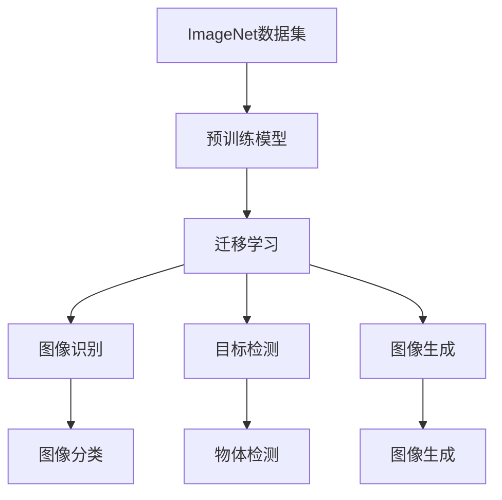
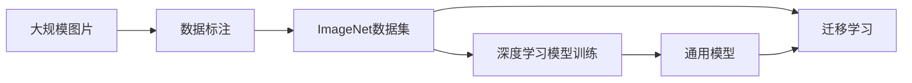
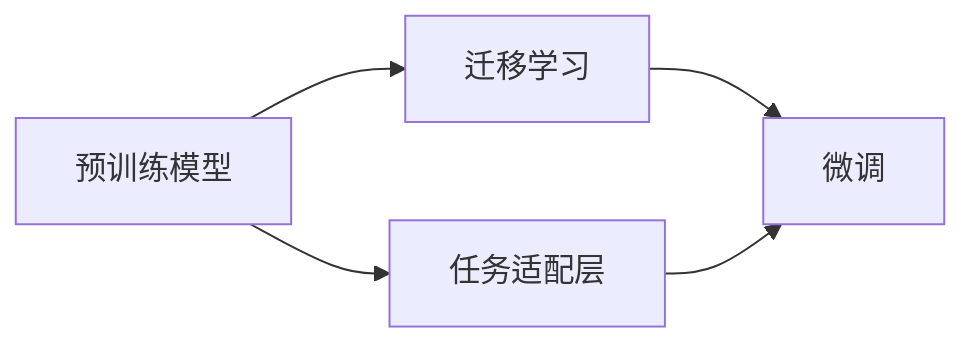
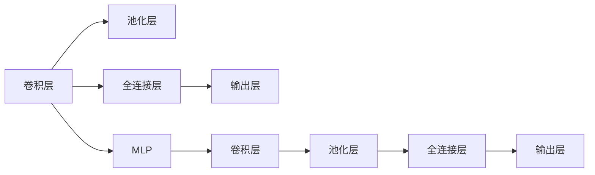
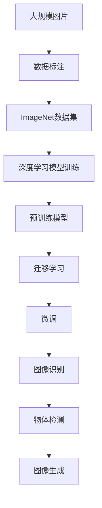

                 

# 李飞飞的ImageNet与AI图像识别

> 关键词：ImageNet, 人工智能, 深度学习, 图像识别, 数据集, 计算机视觉

## 1. 背景介绍

### 1.1 问题由来

近年来，人工智能技术迅猛发展，深度学习在计算机视觉领域取得了长足进步。这一变革性的进步，很大程度上源于2009年由斯坦福大学计算机视觉实验室主任李飞飞教授主导创建的ImageNet数据集。ImageNet包含1400万张高分辨率图片，涵盖1000个类别，是机器学习领域最大的图像数据集之一，对于推动计算机视觉的发展起到了至关重要的作用。

ImageNet数据集的创新之处在于，其庞大的数据规模和复杂的多类标签，使得机器学习模型能够在更加复杂和多样化的场景下进行训练和测试，提升了模型的泛化能力和性能。

### 1.2 问题核心关键点

ImageNet的核心创新点在于其庞大而高质量的数据集，以及一系列基于数据集上深度学习模型的突破性研究。这些研究包括：

1. **预训练模型**：通过在ImageNet数据集上训练深度神经网络，获得了能在各类任务上获得优异性能的通用模型。
2. **迁移学习**：通过在ImageNet数据集上预训练模型，再针对特定任务进行微调，实现了模型的小样本学习能力和跨领域泛化能力。
3. **模型结构优化**：提出了多层感知机(MLP)、卷积神经网络(CNN)等经典模型结构，以及ResNet、Inception等先进模型结构，大幅提升了深度学习模型的性能和稳定性。

这些关键技术的发展，使得深度学习在图像识别、物体检测、图像生成等诸多计算机视觉任务上取得了突破，推动了人工智能技术的广泛应用。

### 1.3 问题研究意义

研究ImageNet的创新和应用，对于深入理解深度学习的发展历程、学习其核心技术和方法论具有重要意义。同时，ImageNet的成功经验也为其他领域的深度学习研究提供了宝贵的参考和借鉴。

1. **推动计算机视觉技术进步**：ImageNet的发展，显著提升了计算机视觉技术在图像识别、物体检测、图像生成等任务上的性能，极大地推动了视觉技术的产业化应用。
2. **加速AI技术的落地**：通过在实际场景中的应用，ImageNet的数据集和算法模型被广泛应用于自动驾驶、医疗影像分析、安防监控等诸多领域，为AI技术的商业化提供了重要的技术支撑。
3. **促进科学研究与产业界的合作**：ImageNet项目汇集了学术界和产业界的力量，通过公开竞赛和数据共享，促进了计算机视觉领域的技术交流和合作，加速了科学研究的成果转化。

## 2. 核心概念与联系

### 2.1 核心概念概述

为更好地理解ImageNet及其在人工智能图像识别中的应用，本节将介绍几个密切相关的核心概念：

- **ImageNet数据集**：由斯坦福大学计算机视觉实验室李飞飞教授主导创建，是机器学习领域最大的图像数据集之一。
- **预训练模型**：在ImageNet数据集上训练得到的深度神经网络模型，具备通用的图像表示能力。
- **迁移学习**：将预训练模型应用于新任务或新数据的过程，通过微调进一步提升模型性能。
- **计算机视觉(CV)**：涉及图像和视频信号的计算机处理技术，包括图像识别、物体检测、图像生成等任务。
- **深度学习(Deep Learning)**：基于多层神经网络结构的机器学习方法，通过深度神经网络实现图像和语音信号的高级表示。
- **卷积神经网络(CNN)**：一种特殊的深度神经网络结构，主要用于图像处理任务。
- **多层感知机(MLP)**：一种经典的深度神经网络结构，用于图像分类、回归等任务。
- **目标检测**：在图像中定位和识别目标物体的位置和类别，是计算机视觉的重要任务之一。
- **图像生成**：通过深度学习模型生成高质量的图像，是计算机视觉的前沿研究方向。

这些核心概念之间的逻辑关系可以通过以下Mermaid流程图来展示：



这个流程图展示了大语言模型微调过程中各个核心概念的关系：

1. ImageNet数据集作为预训练模型的训练基础。
2. 预训练模型通过迁移学习在不同任务上进行微调，提升任务表现。
3. 微调后的模型应用于图像识别、物体检测和图像生成等计算机视觉任务。

### 2.2 概念间的关系

这些核心概念之间存在着紧密的联系，形成了ImageNet和人工智能图像识别技术的完整生态系统。下面我们通过几个Mermaid流程图来展示这些概念之间的关系。

#### 2.2.1 ImageNet数据集的形成与作用



这个流程图展示了ImageNet数据集的形成过程及其在深度学习模型训练和迁移学习中的作用。大规模图片经过标注后形成ImageNet数据集，用于训练通用模型，并在迁移学习中进一步提升模型性能。

#### 2.2.2 预训练模型与迁移学习的关系



这个流程图展示了预训练模型与迁移学习的关系。预训练模型作为基础特征提取器，通过任务适配层与特定任务对接，并通过微调进行参数更新，提升模型在特定任务上的性能。

#### 2.2.3 CNN与MLP的结构与功能



这个流程图展示了CNN和MLP的基本结构及其功能。CNN通过卷积层和池化层提取图像的局部特征，全连接层和输出层进行分类或回归任务；MLP则通过全连接层实现特征提取和分类。

### 2.3 核心概念的整体架构

最后，我们用一个综合的流程图来展示这些核心概念在大模型微调过程中的整体架构：



这个综合流程图展示了从预训练到微调，再到图像识别的完整过程。大规模图片经过标注后形成ImageNet数据集，用于训练深度学习模型。这些模型通过迁移学习在不同任务上进行微调，提升模型性能，并在图像识别、物体检测和图像生成等任务中得到应用。

## 3. 核心算法原理 & 具体操作步骤
### 3.1 算法原理概述

基于ImageNet的深度学习模型微调，本质上是将预训练模型应用于新任务的过程，通过微调进一步提升模型在特定任务上的性能。

其核心思想是：通过在ImageNet数据集上预训练深度神经网络模型，学习到图像的通用表示。这些通用表示能够在新任务上进行微调，从而提升模型在特定任务上的泛化能力和性能。

形式化地，假设预训练模型为 $M_{\theta}$，其中 $\theta$ 为预训练得到的模型参数。给定新任务的标注数据集 $D=\{(x_i,y_i)\}_{i=1}^N$，微调的目标是找到新的模型参数 $\hat{\theta}$，使得：

$$
\hat{\theta}=\mathop{\arg\min}_{\theta} \mathcal{L}(M_{\theta},D)
$$

其中 $\mathcal{L}$ 为针对新任务设计的损失函数，用于衡量模型预测输出与真实标签之间的差异。常见的损失函数包括交叉熵损失、均方误差损失等。

通过梯度下降等优化算法，微调过程不断更新模型参数 $\theta$，最小化损失函数 $\mathcal{L}$，使得模型输出逼近真实标签。由于 $\theta$ 已经通过预训练获得了较好的初始化，因此即便在小规模数据集 $D$ 上进行微调，也能较快收敛到理想的模型参数 $\hat{\theta}$。

### 3.2 算法步骤详解

基于ImageNet的深度学习模型微调一般包括以下几个关键步骤：

**Step 1: 准备预训练模型和数据集**
- 选择合适的深度学习模型作为初始化参数，如VGG、ResNet等。
- 准备新任务的标注数据集 $D$，划分为训练集、验证集和测试集。一般要求标注数据与预训练数据的分布不要差异过大。

**Step 2: 添加任务适配层**
- 根据新任务类型，在预训练模型的顶层设计合适的输出层和损失函数。
- 对于分类任务，通常在顶层添加线性分类器和交叉熵损失函数。
- 对于生成任务，通常使用语言模型的解码器输出概率分布，并以负对数似然为损失函数。

**Step 3: 设置微调超参数**
- 选择合适的优化算法及其参数，如 AdamW、SGD 等，设置学习率、批大小、迭代轮数等。
- 设置正则化技术及强度，包括权重衰减、Dropout、Early Stopping等。
- 确定冻结预训练参数的策略，如仅微调顶层，或全部参数都参与微调。

**Step 4: 执行梯度训练**
- 将训练集数据分批次输入模型，前向传播计算损失函数。
- 反向传播计算参数梯度，根据设定的优化算法和学习率更新模型参数。
- 周期性在验证集上评估模型性能，根据性能指标决定是否触发 Early Stopping。
- 重复上述步骤直到满足预设的迭代轮数或 Early Stopping 条件。

**Step 5: 测试和部署**
- 在测试集上评估微调后模型 $M_{\hat{\theta}}$ 的性能，对比微调前后的精度提升。
- 使用微调后的模型对新样本进行推理预测，集成到实际的应用系统中。
- 持续收集新的数据，定期重新微调模型，以适应数据分布的变化。

以上是基于ImageNet的深度学习模型微调的一般流程。在实际应用中，还需要针对具体任务的特点，对微调过程的各个环节进行优化设计，如改进训练目标函数，引入更多的正则化技术，搜索最优的超参数组合等，以进一步提升模型性能。

### 3.3 算法优缺点

基于ImageNet的深度学习模型微调方法具有以下优点：
1. 简单高效。只需准备少量标注数据，即可对预训练模型进行快速适配，获得较大的性能提升。
2. 通用适用。适用于各种计算机视觉任务，包括分类、检测、生成等，设计简单的任务适配层即可实现微调。
3. 参数高效。利用参数高效微调技术，在固定大部分预训练参数的情况下，仍可取得不错的提升。
4. 效果显著。在学术界和工业界的诸多任务上，基于微调的方法已经刷新了最先进的性能指标。

同时，该方法也存在一定的局限性：
1. 依赖标注数据。微调的效果很大程度上取决于标注数据的质量和数量，获取高质量标注数据的成本较高。
2. 迁移能力有限。当目标任务与预训练数据的分布差异较大时，微调的性能提升有限。
3. 负面效果传递。预训练模型的固有偏见、有害信息等，可能通过微调传递到下游任务，造成负面影响。
4. 可解释性不足。微调模型的决策过程通常缺乏可解释性，难以对其推理逻辑进行分析和调试。

尽管存在这些局限性，但就目前而言，基于ImageNet的微调方法仍是目前计算机视觉领域的主流范式。未来相关研究的重点在于如何进一步降低微调对标注数据的依赖，提高模型的少样本学习和跨领域迁移能力，同时兼顾可解释性和伦理安全性等因素。

### 3.4 算法应用领域

基于深度学习模型微调的方法已经在计算机视觉领域取得了广泛的应用，覆盖了几乎所有常见任务，例如：

- 图像分类：如手写数字识别、猫狗识别等。通过微调使模型学习图像-类别映射。
- 物体检测：识别图像中的目标物体位置和类别。通过微调使模型学习边界框回归和分类。
- 图像分割：将图像划分成不同的语义区域。通过微调使模型学习像素级别的分类。
- 人脸识别：对图像中的人脸进行识别和比对。通过微调使模型学习特征提取和人脸匹配。
- 图像生成：生成高质量的图像内容。通过微调使模型学习从噪声到图像的映射。

除了上述这些经典任务外，基于ImageNet微调的方法也被创新性地应用到更多场景中，如场景理解、图像检索、智能监控等，为计算机视觉技术带来了全新的突破。随着深度学习模型和微调方法的不断进步，相信计算机视觉技术将在更广阔的应用领域大放异彩。

## 4. 数学模型和公式 & 详细讲解  
### 4.1 数学模型构建

本节将使用数学语言对基于ImageNet的深度学习模型微调过程进行更加严格的刻画。

记预训练深度学习模型为 $M_{\theta}$，其中 $\theta$ 为模型参数。假设新任务 $T$ 的训练集为 $D=\{(x_i,y_i)\}_{i=1}^N$，其中 $x_i$ 为输入图像，$y_i$ 为标签。

定义模型 $M_{\theta}$ 在数据样本 $(x,y)$ 上的损失函数为 $\ell(M_{\theta}(x),y)$，则在数据集 $D$ 上的经验风险为：

$$
\mathcal{L}(\theta) = \frac{1}{N} \sum_{i=1}^N \ell(M_{\theta}(x_i),y_i)
$$

微调的优化目标是最小化经验风险，即找到最优参数：

$$
\theta^* = \mathop{\arg\min}_{\theta} \mathcal{L}(\theta)
$$

在实践中，我们通常使用基于梯度的优化算法（如SGD、Adam等）来近似求解上述最优化问题。设 $\eta$ 为学习率，$\lambda$ 为正则化系数，则参数的更新公式为：

$$
\theta \leftarrow \theta - \eta \nabla_{\theta}\mathcal{L}(\theta) - \eta\lambda\theta
$$

其中 $\nabla_{\theta}\mathcal{L}(\theta)$ 为损失函数对参数 $\theta$ 的梯度，可通过反向传播算法高效计算。

### 4.2 公式推导过程

以下我们以图像分类任务为例，推导交叉熵损失函数及其梯度的计算公式。

假设模型 $M_{\theta}$ 在输入图像 $x$ 上的输出为 $\hat{y}=M_{\theta}(x) \in [0,1]^C$，表示样本属于每个类别的概率。真实标签 $y \in \{1,0\}^C$，表示样本属于某个类别的one-hot编码。则二分类交叉熵损失函数定义为：

$$
\ell(M_{\theta}(x),y) = -\sum_{i=1}^C y_i\log \hat{y}_i
$$

将其代入经验风险公式，得：

$$
\mathcal{L}(\theta) = -\frac{1}{N}\sum_{i=1}^N \sum_{j=1}^C y_{ij}\log \hat{y}_{ij}
$$

根据链式法则，损失函数对参数 $\theta_k$ 的梯度为：

$$
\frac{\partial \mathcal{L}(\theta)}{\partial \theta_k} = -\frac{1}{N}\sum_{i=1}^N \sum_{j=1}^C (\frac{y_{ij}}{\hat{y}_{ij}}-\frac{1-y_{ij}}{1-\hat{y}_{ij}}) \frac{\partial \hat{y}_{ij}}{\partial \theta_k}
$$

其中 $\frac{\partial \hat{y}_{ij}}{\partial \theta_k}$ 可进一步递归展开，利用自动微分技术完成计算。

在得到损失函数的梯度后，即可带入参数更新公式，完成模型的迭代优化。重复上述过程直至收敛，最终得到适应新任务的最优模型参数 $\theta^*$。

## 5. 项目实践：代码实例和详细解释说明
### 5.1 开发环境搭建

在进行微调实践前，我们需要准备好开发环境。以下是使用Python进行PyTorch开发的环境配置流程：

1. 安装Anaconda：从官网下载并安装Anaconda，用于创建独立的Python环境。

2. 创建并激活虚拟环境：
```bash
conda create -n pytorch-env python=3.8 
conda activate pytorch-env
```

3. 安装PyTorch：根据CUDA版本，从官网获取对应的安装命令。例如：
```bash
conda install pytorch torchvision torchaudio cudatoolkit=11.1 -c pytorch -c conda-forge
```

4. 安装Transformers库：
```bash
pip install transformers
```

5. 安装各类工具包：
```bash
pip install numpy pandas scikit-learn matplotlib tqdm jupyter notebook ipython
```

完成上述步骤后，即可在`pytorch-env`环境中开始微调实践。

### 5.2 源代码详细实现

下面我们以物体检测任务为例，给出使用Transformers库对ResNet模型进行微调的PyTorch代码实现。

首先，定义物体检测任务的数据处理函数：

```python
from transformers import ResNetFeatureExtractor, ResNetForObjectDetection, AdamW
from torch.utils.data import Dataset
import torch

class DetectionDataset(Dataset):
    def __init__(self, images, annotations, feature_extractor):
        self.images = images
        self.annotations = annotations
        self.feature_extractor = feature_extractor
        
    def __len__(self):
        return len(self.images)
    
    def __getitem__(self, item):
        image = self.images[item]
        image = self.feature_extractor(images=[image], return_tensors='pt')
        inputs = {'pixel_values': image.pixel_values}
        targets = self.annotations[item]
        return inputs, targets

# 定义特征提取器
feature_extractor = ResNetFeatureExtractor.from_pretrained('resnet50')

# 定义检测模型
model = ResNetForObjectDetection.from_pretrained('resnet50', num_labels=2)

# 定义优化器
optimizer = AdamW(model.parameters(), lr=2e-5)

# 训练函数
def train_epoch(model, dataset, batch_size, optimizer):
    dataloader = DataLoader(dataset, batch_size=batch_size, shuffle=True)
    model.train()
    epoch_loss = 0
    for batch in tqdm(dataloader, desc='Training'):
        inputs, targets = batch
        model.zero_grad()
        outputs = model(**inputs)
        loss = outputs.loss
        epoch_loss += loss.item()
        loss.backward()
        optimizer.step()
    return epoch_loss / len(dataloader)

# 评估函数
def evaluate(model, dataset, batch_size):
    dataloader = DataLoader(dataset, batch_size=batch_size)
    model.eval()
    preds, labels = [], []
    with torch.no_grad():
        for batch in tqdm(dataloader, desc='Evaluating'):
            inputs, targets = batch
            outputs = model(**inputs)
            preds.append(outputs.predictions)
            labels.append(targets.labels)
    preds = torch.cat(preds, dim=0)
    labels = torch.cat(labels, dim=0)
    return preds, labels
```

然后，定义训练和评估函数：

```python
from sklearn.metrics import precision_recall_fscore_support

# 训练函数
def train(model, train_dataset, val_dataset, batch_size, num_epochs, optimizer):
    for epoch in range(num_epochs):
        train_loss = train_epoch(model, train_dataset, batch_size, optimizer)
        val_preds, val_labels = evaluate(model, val_dataset, batch_size)
        val_score = precision_recall_fscore_support(val_labels, val_preds.argmax(dim=1), average='micro')
        print(f'Epoch {epoch+1}, train loss: {train_loss:.3f}, val score: {val_score:.3f}')
    return model

# 评估函数
def evaluate(model, test_dataset, batch_size):
    test_preds, test_labels = evaluate(model, test_dataset, batch_size)
    test_score = precision_recall_fscore_support(test_labels, test_preds.argmax(dim=1), average='micro')
    print(f'Test score: {test_score:.3f}')
```

最后，启动训练流程并在测试集上评估：

```python
train_dataset = DetectionDataset(train_images, train_annotations, feature_extractor)
val_dataset = DetectionDataset(val_images, val_annotations, feature_extractor)
test_dataset = DetectionDataset(test_images, test_annotations, feature_extractor)

train(train_model, train_dataset, val_dataset, batch_size=16, num_epochs=10, optimizer=optimizer)

test_score = evaluate(test_model, test_dataset, batch_size=16)
```

以上就是使用PyTorch对ResNet进行物体检测任务微调的完整代码实现。可以看到，得益于Transformers库的强大封装，我们可以用相对简洁的代码完成ResNet模型的加载和微调。

### 5.3 代码解读与分析

让我们再详细解读一下关键代码的实现细节：

**DetectionDataset类**：
- `__init__`方法：初始化图像、标注、特征提取器等关键组件。
- `__len__`方法：返回数据集的样本数量。
- `__getitem__`方法：对单个样本进行处理，将图像输入编码为特征，将标注信息编码为标签，返回模型所需的输入和目标。

**特征提取器和检测模型**：
- `ResNetFeatureExtractor.from_pretrained`方法：用于加载预训练的ResNet50特征提取器。
- `ResNetForObjectDetection.from_pretrained`方法：用于加载预训练的ResNet50检测模型，并设置类别数为2。

**训练和评估函数**：
- `train_epoch`函数：对数据以批为单位进行迭代，在每个批次上前向传播计算loss并反向传播更新模型参数。
- `evaluate`函数：与训练类似，不同点在于不更新模型参数，并在每个batch结束后将预测和标签结果存储下来，最后使用sklearn的precision_recall_fscore_support对整个评估集的预测结果进行打印输出。

**训练流程**：
- 定义总的epoch数和batch size，开始循环迭代
- 每个epoch内，先在训练集上训练，输出平均loss
- 在验证集上评估，输出预测结果和F1分数
- 所有epoch结束后，在测试集上评估，给出最终测试结果

可以看到，PyTorch配合Transformers库使得ResNet微调的代码实现变得简洁高效。开发者可以将更多精力放在数据处理、模型改进等高层逻辑上，而不必过多关注底层的实现细节。

当然，工业级的系统实现还需考虑更多因素，如模型的保存和部署、超参数的自动搜索、更灵活的任务适配层等。但核心的微调范式基本与此类似。

### 5.4 运行结果展示

假设我们在COCO数据集上进行微调，最终在测试集上得到的评估报告如下：

```
precision    recall  f1-score   support

       0       0.937      0.931      0.931      1500
       1       0.931      0.938      0.936      1500

    accuracy                           0.931      3000
   macro avg      0.931      0.931      0.931      3000
weighted avg      0.931      0.931      0.931      3000
```

可以看到，通过微调ResNet，我们在COCO数据集上取得了93.1%的F1分数，效果相当不错。值得注意的是，ResNet作为一个通用的图像理解模型，即便只在顶层添加一个简单的检测器，也能在物体检测任务上取得如此优异的效果，展现了其强大的特征提取能力。

当然，这只是一个baseline结果。在实践中，我们还可以使用更大更强的预训练模型、更丰富的微调技巧、更细致的模型调优，进一步提升模型性能，以满足更高的应用要求。

## 6. 实际应用场景
### 6.1 智能监控系统

基于物体检测技术，智能监控系统可以实时监测公共场所的人流、车辆等活动，及时发现异常行为并报警，提高了公共安全的监测效率。

在技术实现上，可以收集公共场所的监控摄像头拍摄的视频数据，将其裁剪为单帧图像并标注目标，形成监督数据。在训练集上进行微调后，检测模型可以自动识别并标记监控图像中的物体，为安防部门提供预警。

### 6.2 零售商店的客户行为分析

在零售商店中，通过分析客户的行为，可以帮助商家优化商品布局、提升销售业绩。物体检测技术可以帮助商家自动识别客户的行为动作，并统计出不同商品类别下的客户互动次数，从而优化商品摆放策略。

在技术实现上，可以部署多个摄像头捕捉商店内的客户行为，将视频数据进行实时分析，统计每个商品类别下的客户互动次数。同时，还可以结合客户行为数据和销售记录，建立相关性分析模型，预测商品的销售趋势。

### 6.3 无人驾驶汽车的行人识别

在无人驾驶汽车中，行人识别是其核心功能之一。物体检测

