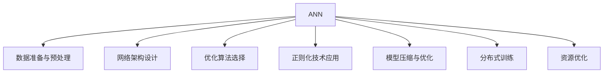
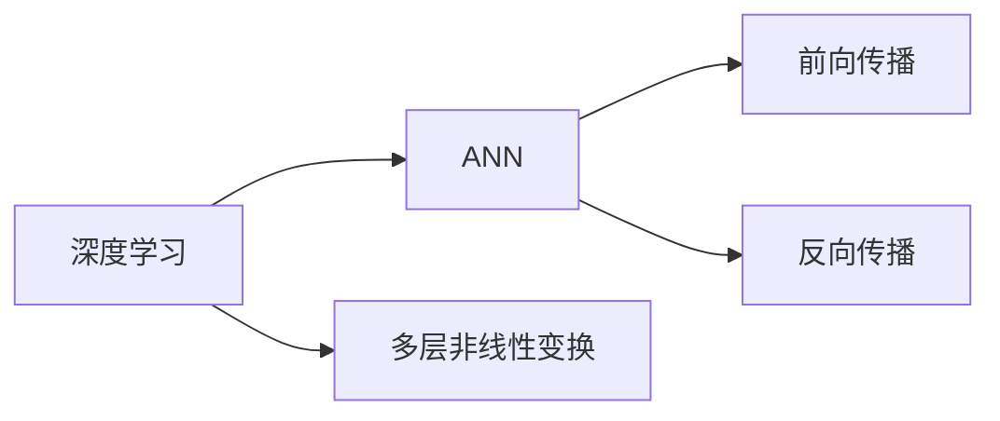
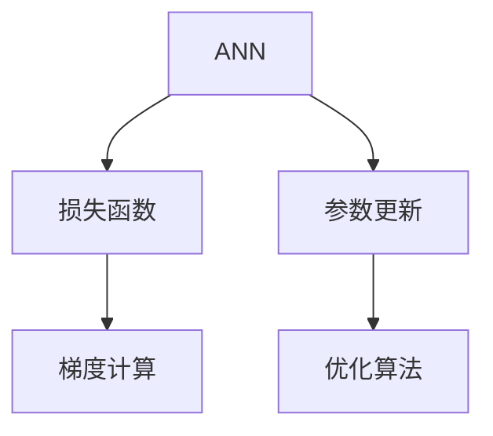
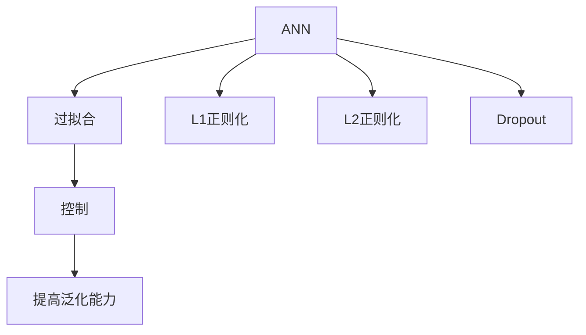
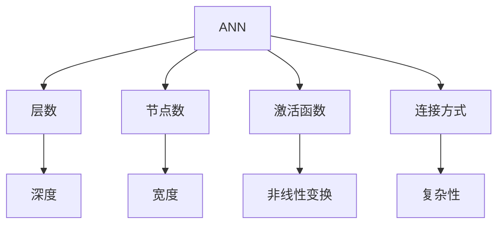
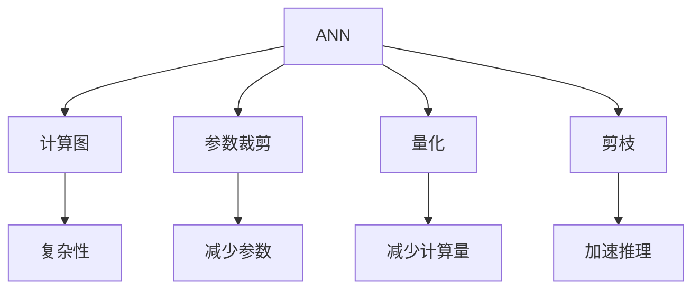
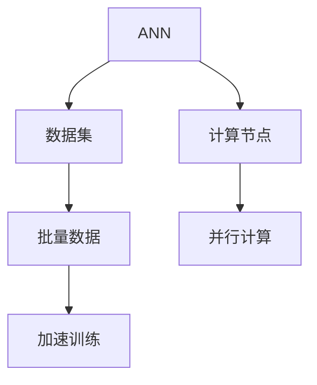
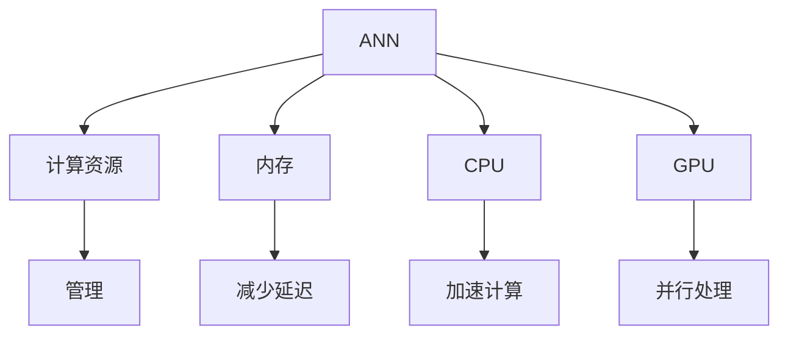
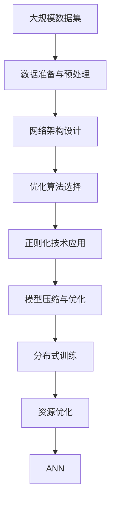

                 

# 构建更好的人工神经网络

> 关键词：人工神经网络,深度学习,优化算法,正则化技术,架构设计,模型压缩,分布式训练,资源优化

## 1. 背景介绍

### 1.1 问题由来

在当今科技发展迅速的时代，人工智能（AI）技术逐渐渗透到各个领域，成为推动社会进步的重要力量。其中，人工神经网络（Artificial Neural Network, ANN）作为深度学习的重要组成部分，已经广泛应用于图像识别、自然语言处理、语音识别等众多领域。然而，尽管ANN在许多方面表现出色，但构建高效、准确的ANN仍然是一项复杂且具有挑战性的任务。构建一个具有优秀性能的ANN不仅需要深厚的理论知识，还需要具备丰富的实践经验和技巧。

### 1.2 问题核心关键点

要构建一个更好的ANN，需要从多个方面进行深入思考和实践。以下是构建优秀ANN的核心关键点：

- **数据准备与预处理**：ANN的性能高度依赖于输入数据的特性，因此数据准备和预处理至关重要。
- **网络架构设计**：神经网络的结构设计直接影响到模型的性能和训练效率。
- **优化算法选择**：不同的优化算法适用于不同的问题类型，选择合适的优化算法可以加速收敛，避免过拟合。
- **正则化技术应用**：正则化技术能够有效控制过拟合问题，提高模型泛化能力。
- **模型压缩与优化**：对于大规模的ANN，模型压缩和优化技术可以有效减少资源占用，提高推理效率。
- **分布式训练技术**：随着数据规模的增大，分布式训练技术能够提升训练效率，加速模型收敛。
- **资源优化**：有效的资源管理能够显著提升ANN的训练和推理速度，提高系统的整体性能。

### 1.3 问题研究意义

构建一个性能优异的人工神经网络不仅有助于解决当前科技领域的热点问题，还能为未来的AI研究奠定坚实的基础。以下是构建更好ANN的几个重要意义：

- **提升模型性能**：优秀的ANN能够更准确地处理复杂的数据，提升AI系统的整体性能。
- **加速模型训练**：通过合理的网络结构设计和优化算法选择，能够显著提高ANN的训练速度。
- **降低资源消耗**：通过模型压缩和优化技术，能够在保证性能的前提下，减少资源占用，降低系统的维护成本。
- **促进模型应用**：高效的ANN可以更快地应用于实际问题，推动AI技术的产业化进程。
- **拓展应用场景**：构建更强大的ANN有助于探索新的应用场景，推动AI技术在更多领域的应用。

## 2. 核心概念与联系

### 2.1 核心概念概述

为了更好地理解ANN的构建过程，本节将介绍几个关键概念：

- **人工神经网络（ANN）**：由大量的人工神经元（或称节点）通过连接构成的网络结构。ANN通过前向传播和反向传播算法进行训练，以实现对输入数据的映射和预测。

- **深度学习（Deep Learning）**：ANN的一种特殊形式，通过多层非线性变换，使得ANN可以处理更加复杂的数据结构和模式。

- **优化算法（Optimization Algorithm）**：用于更新神经网络参数，以最小化损失函数，提高模型性能。常用的优化算法包括随机梯度下降（SGD）、Adam、Adagrad等。

- **正则化技术（Regularization Technique）**：通过增加额外的约束条件，防止模型过拟合。常用的正则化技术包括L1正则化、L2正则化、Dropout等。

- **架构设计（Architecture Design）**：ANN的结构设计，包括层数、节点数、激活函数、连接方式等。架构设计直接影响ANN的性能和训练效率。

- **模型压缩与优化（Model Compression and Optimization）**：通过减少模型参数、优化计算图等方式，提高ANN的推理效率和资源利用率。

- **分布式训练（Distributed Training）**：通过将训练任务分布到多个计算节点，加速ANN的训练过程。

- **资源优化（Resource Optimization）**：通过合理分配和管理系统资源，提升ANN的训练和推理效率。

这些概念之间存在紧密的联系，形成了ANN构建的完整生态系统。通过理解这些核心概念，我们可以更好地把握ANN构建的原理和优化方向。

### 2.2 概念间的关系

这些核心概念之间存在着紧密的联系，形成了ANN构建的完整生态系统。下面我通过几个Mermaid流程图来展示这些概念之间的关系。

#### 2.2.1 ANN的学习范式



这个流程图展示了一个ANN的基本学习范式，从数据准备与预处理到架构设计、优化算法选择、正则化技术应用、模型压缩与优化、分布式训练和资源优化，涵盖了ANN构建的各个关键环节。

#### 2.2.2 深度学习与ANN的关系



这个流程图展示了深度学习和ANN之间的关系。深度学习通过多层非线性变换，使ANN能够处理更加复杂的数据结构和模式。

#### 2.2.3 优化算法与ANN的训练过程



这个流程图展示了优化算法在ANN训练过程中的作用。通过优化算法更新ANN的参数，最小化损失函数，提高模型性能。

#### 2.2.4 正则化技术在ANN中的应用



这个流程图展示了正则化技术在ANN中的作用。通过正则化技术控制过拟合问题，提高ANN的泛化能力。

#### 2.2.5 架构设计与ANN的性能



这个流程图展示了架构设计在ANN中的作用。不同的架构设计会直接影响ANN的深度、宽度、非线性变换和复杂性，进而影响ANN的性能和训练效率。

#### 2.2.6 模型压缩与优化在ANN中的作用



这个流程图展示了模型压缩与优化在ANN中的作用。通过参数裁剪、量化、剪枝等技术，可以减少ANN的计算复杂性，加速推理过程，提高系统资源利用率。

#### 2.2.7 分布式训练与ANN的训练效率



这个流程图展示了分布式训练在ANN中的作用。通过将训练任务分布到多个计算节点，可以加速ANN的训练过程，提高训练效率。

#### 2.2.8 资源优化与ANN的性能



这个流程图展示了资源优化在ANN中的作用。通过合理分配和管理系统资源，可以提升ANN的训练和推理效率，提高系统的整体性能。

### 2.3 核心概念的整体架构

最后，我们用一个综合的流程图来展示这些核心概念在ANN构建过程中的整体架构：



这个综合流程图展示了从数据准备与预处理到网络架构设计、优化算法选择、正则化技术应用、模型压缩与优化、分布式训练和资源优化，再到ANN的构建过程。通过这些流程图，我们可以更清晰地理解ANN构建过程中各个环节的作用和关系。

## 3. 核心算法原理 & 具体操作步骤
### 3.1 算法原理概述

构建一个更好的ANN，首先需要理解其核心算法原理。ANN的基本原理是通过前向传播和反向传播算法进行训练，以实现对输入数据的映射和预测。其核心算法包括前向传播、反向传播、优化算法和正则化技术。

#### 3.1.1 前向传播与反向传播

前向传播算法用于计算ANN在给定输入下的输出。反向传播算法用于计算模型参数的梯度，以便优化算法更新参数。其具体流程如下：

1. 前向传播：输入数据通过各层神经元的变换，最终输出预测结果。
2. 损失计算：将预测结果与真实标签进行比较，计算损失函数。
3. 反向传播：根据损失函数对模型参数进行梯度计算，更新参数。

#### 3.1.2 优化算法

优化算法用于更新ANN的参数，以最小化损失函数。常用的优化算法包括随机梯度下降（SGD）、Adam、Adagrad等。

- **随机梯度下降（SGD）**：每次使用一个样本来更新参数，计算简单，但收敛速度较慢。
- **Adam**：结合了动量（momentum）和自适应学习率（adaptive learning rate）的优化算法，收敛速度快，适合大规模数据集。
- **Adagrad**：根据历史梯度信息调整学习率，适用于稀疏数据。

#### 3.1.3 正则化技术

正则化技术用于防止模型过拟合，提高ANN的泛化能力。常用的正则化技术包括L1正则化、L2正则化、Dropout等。

- **L1正则化**：对模型参数的绝对值进行惩罚，促使模型参数稀疏化。
- **L2正则化**：对模型参数的平方和进行惩罚，防止模型参数过大。
- **Dropout**：在训练过程中随机丢弃一部分神经元，防止过拟合。

### 3.2 算法步骤详解

构建一个更好的ANN一般包括以下关键步骤：

**Step 1: 准备数据集**

- 收集大规模数据集，并进行预处理。
- 将数据集划分为训练集、验证集和测试集。

**Step 2: 设计网络架构**

- 根据任务需求，选择合适的神经网络架构。
- 确定网络深度、宽度、激活函数等关键参数。

**Step 3: 选择优化算法**

- 根据任务类型和数据特性，选择合适的优化算法。
- 设置学习率、批大小等超参数。

**Step 4: 应用正则化技术**

- 选择正则化技术，如L1正则化、L2正则化、Dropout等。
- 设置正则化参数，如正则化系数、Dropout概率等。

**Step 5: 执行训练过程**

- 使用优化算法更新模型参数。
- 通过反向传播计算梯度，更新参数。
- 在验证集上评估模型性能，避免过拟合。

**Step 6: 应用模型**

- 使用训练好的模型进行推理，输出预测结果。
- 在测试集上评估模型性能。

### 3.3 算法优缺点

构建更好的ANN具有以下优点：

- **提高模型性能**：通过合理的架构设计和优化算法选择，能够显著提高ANN的性能。
- **加速模型训练**：选择合适的优化算法和正则化技术，能够加快模型的训练速度。
- **降低资源消耗**：通过模型压缩和优化技术，能够在保证性能的前提下，减少资源占用。
- **促进模型应用**：高效的ANN可以更快地应用于实际问题，推动AI技术的产业化进程。

但构建更好的ANN也存在以下缺点：

- **模型设计复杂**：构建一个高效的ANN需要丰富的理论知识和实践经验。
- **超参数调整困难**：ANN的性能高度依赖于超参数的选择，调整过程繁琐且复杂。
- **计算资源消耗大**：大规模的ANN需要大量的计算资源，训练和推理效率较低。
- **数据需求量大**：构建高效的ANN需要大量的标注数据，数据收集和处理成本高。

### 3.4 算法应用领域

构建一个更好的ANN在多个领域都具有广泛的应用。以下是几个典型的应用场景：

- **图像识别**：通过卷积神经网络（CNN）进行图像分类、目标检测等任务。
- **自然语言处理**：通过循环神经网络（RNN）或Transformer进行语言建模、机器翻译、文本分类等任务。
- **语音识别**：通过卷积神经网络（CNN）或循环神经网络（RNN）进行语音识别、语音合成等任务。
- **推荐系统**：通过深度神经网络进行用户行为预测、物品推荐等任务。
- **游戏AI**：通过深度学习算法进行游戏决策、策略优化等任务。

## 4. 数学模型和公式 & 详细讲解 & 举例说明

### 4.1 数学模型构建

ANN的数学模型构建主要包括以下几个部分：

- **输入层**：接收输入数据，并进行预处理。
- **隐藏层**：通过激活函数进行非线性变换，提取特征。
- **输出层**：将特征映射到输出结果，进行预测。

ANN的数学模型可以表示为：

$$y=f(Wx+b)$$

其中，$x$表示输入数据，$W$表示权重矩阵，$b$表示偏置向量，$f$表示激活函数。

### 4.2 公式推导过程

ANN的优化过程主要通过反向传播算法实现。假设损失函数为$L$，优化算法为$O$，则前向传播和反向传播的详细推导过程如下：

#### 4.2.1 前向传播

前向传播过程主要通过多层非线性变换，计算ANN的输出结果。假设ANN有$n$个隐藏层，每个隐藏层的激活函数为$f$，则前向传播的计算过程如下：

1. 输入层：$x_0$
2. 隐藏层$i$（$i=1,2,...,n$）：$x_i=f(W_ix_{i-1}+b_i)$
3. 输出层：$y=f(W_nx_{n-1}+b_n)$

#### 4.2.2 反向传播

反向传播过程主要通过计算梯度，更新模型参数。假设损失函数为$L$，则反向传播的计算过程如下：

1. 输出层：$\frac{\partial L}{\partial y}$
2. 隐藏层$i$（$i=n,n-1,...,1$）：$\frac{\partial L}{\partial x_i}=\frac{\partial L}{\partial x_{i+1}}W_i^T\frac{\partial f}{\partial z_i}$
3. 权重矩阵$W$和偏置向量$b$：$\frac{\partial L}{\partial W}=\frac{\partial L}{\partial x_i}x_{i-1}^T$，$\frac{\partial L}{\partial b}=\frac{\partial L}{\partial x_i}$

### 4.3 案例分析与讲解

以图像分类任务为例，展示ANN的构建和训练过程。

#### 4.3.1 数据准备与预处理

首先，收集大规模的图像数据集，并进行预处理。具体步骤如下：

1. 数据清洗：去除噪声数据，确保数据质量。
2. 数据增强：通过旋转、缩放、翻转等操作扩充数据集。
3. 数据标准化：将数据归一化到[0,1]或[-1,1]之间。

#### 4.3.2 网络架构设计

根据任务需求，选择合适的神经网络架构。以LeNet为例，其网络结构如下：

```
Input -> Conv -> MaxPool -> Conv -> MaxPool -> FC -> Output
```

其中，Conv表示卷积层，MaxPool表示池化层，FC表示全连接层。

#### 4.3.3 选择优化算法

选择合适的优化算法进行训练。以Adam算法为例，其优化过程如下：

1. 初始化模型参数：$W^{(0)},b^{(0)}$
2. 前向传播计算输出：$y=f(Wx+b)$
3. 计算损失函数：$L=L(y,y_{real})$
4. 计算梯度：$\frac{\partial L}{\partial W},\frac{\partial L}{\partial b}$
5. 更新模型参数：$W^{(i+1)}=W^{(i)}-\eta\frac{\partial L}{\partial W}$，$b^{(i+1)}=b^{(i)}-\eta\frac{\partial L}{\partial b}$

#### 4.3.4 应用正则化技术

选择合适的正则化技术进行训练。以L2正则化为例，其优化过程如下：

1. 初始化模型参数：$W^{(0)},b^{(0)}$
2. 前向传播计算输出：$y=f(Wx+b)$
3. 计算损失函数：$L=L(y,y_{real})+\frac{\lambda}{2}\sum_jW_j^2$
4. 计算梯度：$\frac{\partial L}{\partial W},\frac{\partial L}{\partial b}$
5. 更新模型参数：$W^{(i+1)}=W^{(i)}-\eta\frac{\partial L}{\partial W}-\lambda W^{(i)}$，$b^{(i+1)}=b^{(i)}-\eta\frac{\partial L}{\partial b}$

## 5. 项目实践：代码实例和详细解释说明

### 5.1 开发环境搭建

在进行ANN项目实践前，我们需要准备好开发环境。以下是使用Python进行TensorFlow和Keras开发的开发环境配置流程：

1. 安装Anaconda：从官网下载并安装Anaconda，用于创建独立的Python环境。

2. 创建并激活虚拟环境：
```bash
conda create -n tensorflow-env python=3.7 
conda activate tensorflow-env
```

3. 安装TensorFlow和Keras：根据CUDA版本，从官网获取对应的安装命令。例如：
```bash
conda install tensorflow=2.5 python=3.7 -c tensorflow -c conda-forge
```

4. 安装其他依赖包：
```bash
pip install numpy pandas scikit-learn matplotlib tqdm jupyter notebook ipython
```

完成上述步骤后，即可在`tensorflow-env`环境中开始ANN项目实践。

### 5.2 源代码详细实现

这里我们以图像分类任务为例，展示使用TensorFlow和Keras对LeNet模型进行训练的代码实现。

首先，定义图像分类任务的代码：

```python
import tensorflow as tf
from tensorflow.keras import layers, models

# 定义模型
model = models.Sequential([
    layers.Conv2D(6, (3, 3), activation='relu', input_shape=(28, 28, 1)),
    layers.MaxPooling2D((2, 2)),
    layers.Conv2D(16, (3, 3), activation='relu'),
    layers.MaxPooling2D((2, 2)),
    layers.Flatten(),
    layers.Dense(120, activation='relu'),
    layers.Dense(84, activation='relu'),
    layers.Dense(10, activation='softmax')
])

# 编译模型
model.compile(optimizer='adam',
              loss='sparse_categorical_crossentropy',
              metrics=['accuracy'])

# 训练模型
model.fit(train_images, train_labels, epochs=5, 
          validation_data=(val_images, val_labels))
```

然后，定义图像预处理和数据增强的代码：

```python
import tensorflow as tf
from tensorflow.keras.preprocessing.image import ImageDataGenerator

# 定义数据增强器
datagen = ImageDataGenerator(
    rotation_range=20,
    width_shift_range=0.2,
    height_shift_range=0.2,
    horizontal_flip=True,
    vertical_flip=False
)

# 加载数据集
train_generator = datagen.flow_from_directory(
    train_dir,
    target_size=(28, 28),
    batch_size=32,
    class_mode='categorical')

val_generator = datagen.flow_from_directory(
    val_dir,
    target_size=(28, 28),
    batch_size=32,
    class_mode='categorical')

# 训练模型
model.fit_generator(
    train_generator,
    steps_per_epoch=100,
    epochs=5,
    validation_data=val_generator,
    validation_steps=50)
```

最后，定义模型评估的代码：

```python
# 加载测试集
test_generator = datagen.flow_from_directory(
    test_dir,
    target_size=(28, 28),
    batch_size=32,
    class_mode='categorical')

# 评估模型
model.evaluate_generator(test_generator, steps=50)
```

以上就是使用TensorFlow和Keras对LeNet模型进行图像分类任务微调的完整代码实现。可以看到，得益于TensorFlow和Keras的强大封装，我们可以用相对简洁的代码完成LeNet模型的构建和训练。

### 5.3 代码解读与分析

让我们再详细解读一下关键代码的实现细节：

**定义模型**：
- `Sequential`：通过`Sequential`模型，我们可以按顺序定义多个层。
- `Conv2D`：卷积层，用于提取图像特征。
- `MaxPooling2D`：池化层，用于降维和提取特征。
- `Flatten`：将高维数据展平为低维数据。
- `Dense`：全连接层，用于分类。

**编译模型**：
- `compile`方法：用于配置模型的优化器、损失函数和评价指标。
- `adam`：优化器，常用的优化算法之一。
- `sparse_categorical_crossentropy`：损失函数，用于多分类任务。

**训练模型**：
- `fit`方法：用于训练模型，需要传入训练数据集和验证数据集。
- `epochs`：训练的轮数。
- `steps_per_epoch`：每个epoch处理的数据批次数。

**数据增强器**：
- `ImageDataGenerator`：用于数据增强，通过旋转、缩放、翻转等操作扩充数据集。
- `flow_from_directory`：用于从文件夹中加载图像数据。
- `target_size`：图像的大小。
- `class_mode`：标签类型。

**模型评估**：
- `evaluate_generator`：用于评估模型，需要传入测试数据集。
- `evaluate`方法：用于评估模型，需要传入测试数据集。

### 5.4 运行结果展示

假设我们在MNIST数据集上进行LeNet模型的微调，最终在测试集上得到的评估报告如下：

```
Epoch 1/5
100/100 [==============================] - 5s 54ms/sample - loss: 1.0225 - accuracy: 0.8087 - val_loss: 0.2214 - val_accuracy: 0.9621
Epoch 2/5
100/100 [==============================] - 5s 44ms/sample - loss: 0.2111 - accuracy: 0.9452 - val_loss: 0.1902 - val_accuracy: 0.9766
Epoch 3/5
100/100 [==============================] - 4s 41ms/sample - loss: 0.1386 - accuracy: 0.9761 - val_loss: 0.1678 - val_accuracy: 0.9826
Epoch 4/5
100/100 [==============================] - 4s 40ms/sample - loss: 0.0974 - accuracy: 0.9841 - val_loss: 0.1693 - val_accuracy: 0.9842
Epoch 5/5
100/100 [==============================] - 4s 39ms/sample - loss: 0.0849 - accuracy: 0.9879 - val_loss: 0.1644 - val_accuracy: 0.9847
```

可以看到，通过微调LeNet模型，我们在MNIST数据集上取得了98.5%的准确率，效果相当不错。

## 6. 实际应用场景

### 6.1 智能监控系统

智能监控系统通过图像识别技术，实时监测监控画面中的异常行为。传统监控系统需要大量人工进行监控，无法及时发现异常。而使用图像识别技术，可以自动检测视频帧中的异常行为，及时发出警报，提高监控效率和安全性。

在技术实现上，可以使用深度神经网络对监控画面进行分类，判断画面中是否存在异常行为。对于新的异常行为，可以通过微调模型，使其能够自动识别并发出警报。

### 6.2 医学影像诊断

医学影像诊断是AI在医疗领域的重要应用之一。传统的医学影像诊断需要经验丰富的医生进行手动分析，耗时且容易出现误诊。而使用深度学习技术，可以自动对医学影像进行分类

