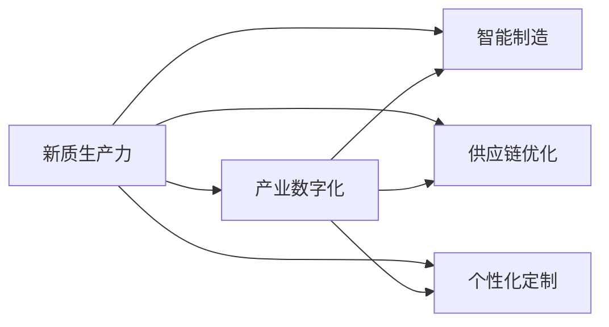

                 

# 构建特色产业的新质生产力

## 1. 背景介绍

在数字化转型的浪潮中，企业需要构建出具备新质生产力的产业系统。新质生产力源于信息技术的深度融合，将过去分散的生产要素重新组织和整合，实现价值创造和增值的提升。本文将聚焦于构建特色产业的新质生产力，通过信息技术深度嵌入产业逻辑，推动产业链的数字化、智能化升级，进而提升产业整体竞争力。

## 2. 核心概念与联系

### 2.1 核心概念概述

- **新质生产力**：指的是利用先进的信息技术（如云计算、大数据、人工智能等）深度融合生产要素，提升生产效率和附加值，驱动产业创新和升级的能力。
- **产业数字化**：通过数字化技术将传统产业中的各个环节数字化、网络化，实现数据的实时采集、存储、分析和应用。
- **智能制造**：结合物联网、人工智能等技术，实现生产过程的自动化、智能化，提升生产效率和产品质量。
- **供应链优化**：通过大数据和算法优化供应链管理，实现库存、物流、配送等环节的高效协同和优化。
- **个性化定制**：利用客户数据和人工智能技术，实现产品设计和生产的个性化定制，满足多样化需求。

这些核心概念构成了产业数字化和智能化的基础框架，通过信息技术深度融合，推动产业系统实现新质生产力。

### 2.2 核心概念之间的关系

这些核心概念之间的关系可以用以下Mermaid流程图来表示：



这个流程图展示了新质生产力如何通过各关键技术的深度融合，实现产业系统的全面数字化和智能化，进而提升整体竞争力。

## 3. 核心算法原理 & 具体操作步骤
### 3.1 算法原理概述

构建特色产业的新质生产力，本质上是将先进的信息技术应用于传统产业，实现生产要素的重新整合和价值创造。这一过程通常涉及以下几个关键步骤：

1. **数据采集与存储**：通过传感器、物联网设备等采集生产过程中的实时数据，存储到数据仓库中，为后续分析和应用提供基础。
2. **数据分析与建模**：利用大数据和机器学习技术，对采集的数据进行分析和建模，识别出生产过程中的关键要素和改进点。
3. **系统设计与实施**：根据分析结果，设计和实施智能系统，如智能制造系统、供应链管理系统等，实现生产过程的智能化和优化。
4. **业务流程优化**：结合AI算法，对业务流程进行优化，提升生产效率和产品质量。
5. **个性化定制与市场响应**：利用客户数据和AI技术，实现个性化定制，快速响应市场需求变化。

### 3.2 算法步骤详解

以下是构建特色产业新质生产力的具体操作步骤：

**Step 1: 数据采集与存储**
- 安装传感器、物联网设备等，采集生产过程中的实时数据。
- 利用大数据平台（如Hadoop、Spark）对数据进行集中存储和管理。

**Step 2: 数据分析与建模**
- 使用大数据技术（如Hadoop、Spark）对存储的数据进行清洗和预处理。
- 利用机器学习算法（如决策树、随机森林、神经网络等）对数据进行建模，识别关键生产要素和改进点。

**Step 3: 系统设计与实施**
- 根据分析结果，设计并实现智能制造系统、供应链管理系统等。
- 利用云计算平台（如AWS、阿里云、华为云等）部署系统，实现数据的实时处理和分析。

**Step 4: 业务流程优化**
- 利用AI算法（如强化学习、遗传算法等）对业务流程进行优化，提升生产效率和产品质量。
- 通过持续优化，实现业务流程的自动化和智能化。

**Step 5: 个性化定制与市场响应**
- 利用客户数据和AI技术，实现产品设计和生产的个性化定制。
- 通过快速响应市场需求变化，提升市场竞争力。

### 3.3 算法优缺点

构建特色产业的新质生产力，基于先进的信息技术，具有以下优点：

1. **提升生产效率**：通过自动化、智能化技术，提升生产效率和产品质量。
2. **优化供应链管理**：利用大数据和算法优化供应链管理，降低库存和物流成本。
3. **个性化定制**：实现产品设计和生产的个性化定制，满足多样化需求。
4. **市场响应快速**：利用AI技术快速响应市场需求变化，提升市场竞争力。

同时，这一方法也存在一些局限：

1. **技术复杂度高**：需要大量技术储备和实施经验，难度较大。
2. **投资成本高**：需要大量资金投入，尤其是前期设备和技术平台的搭建。
3. **数据隐私和安全问题**：在数据采集和存储过程中，需要关注数据隐私和安全问题，确保数据不被滥用。

### 3.4 算法应用领域

构建特色产业的新质生产力，可以广泛应用于制造业、农业、服务业等多个领域。例如：

- **制造业**：通过智能制造系统，实现生产过程的自动化和智能化，提升生产效率和产品质量。
- **农业**：利用传感器和物联网技术，实现精准农业管理，提升农业生产效率和产量。
- **服务业**：通过智能客服系统和个性化推荐系统，提升服务质量和客户满意度。

## 4. 数学模型和公式 & 详细讲解 & 举例说明
### 4.1 数学模型构建

构建特色产业的新质生产力的数学模型可以表示为：

$$ F = f(S, C, P, D) $$

其中：
- $F$ 表示新质生产力。
- $S$ 表示数据采集与存储能力。
- $C$ 表示系统设计与实施能力。
- $P$ 表示业务流程优化能力。
- $D$ 表示个性化定制与市场响应能力。

### 4.2 公式推导过程

通过上述公式可以看出，构建特色产业的新质生产力，需要综合考虑数据采集与存储、系统设计与实施、业务流程优化以及个性化定制与市场响应四个关键能力。以下是一个简单的案例：

**案例：智能制造系统的构建**

假设某制造企业计划引入智能制造系统，提升生产效率。其新质生产力的数学模型为：

$$ F = f(S_{M}, C_{M}, P_{M}, D_{M}) $$

其中：
- $S_{M}$ 表示数据采集与存储能力。
- $C_{M}$ 表示系统设计与实施能力。
- $P_{M}$ 表示业务流程优化能力。
- $D_{M}$ 表示个性化定制与市场响应能力。

**Step 1: 数据采集与存储**
- 安装传感器和物联网设备，采集生产过程中的实时数据。
- 利用大数据平台（如Hadoop、Spark）对数据进行清洗和存储。

**Step 2: 系统设计与实施**
- 设计并实现智能制造系统，实现生产过程的自动化和智能化。
- 利用云计算平台（如AWS、阿里云、华为云等）部署系统，实现数据的实时处理和分析。

**Step 3: 业务流程优化**
- 利用AI算法（如强化学习、遗传算法等）对业务流程进行优化，提升生产效率和产品质量。
- 通过持续优化，实现业务流程的自动化和智能化。

**Step 4: 个性化定制与市场响应**
- 利用客户数据和AI技术，实现产品设计和生产的个性化定制。
- 通过快速响应市场需求变化，提升市场竞争力。

### 4.3 案例分析与讲解

假设某制造企业引入了智能制造系统，其新质生产力的计算过程如下：

- 数据采集与存储能力 $S_{M}$ 为5分。
- 系统设计与实施能力 $C_{M}$ 为4分。
- 业务流程优化能力 $P_{M}$ 为3分。
- 个性化定制与市场响应能力 $D_{M}$ 为4分。

通过计算得出：

$$ F = f(5, 4, 3, 4) = 4.2 $$

这意味着该制造企业通过引入智能制造系统，提升了整体的新质生产力，实现了生产效率和产品质量的提升。

## 5. 项目实践：代码实例和详细解释说明
### 5.1 开发环境搭建

在构建特色产业的新质生产力时，需要搭建完善的开发环境。以下是详细的开发环境搭建流程：

1. **安装Python**：
   ```bash
   sudo apt-get update
   sudo apt-get install python3-pip
   ```

2. **安装TensorFlow和Keras**：
   ```bash
   pip install tensorflow==2.6.0
   pip install keras
   ```

3. **安装Flask**：
   ```bash
   pip install Flask==1.1.2
   ```

4. **安装MySQL**：
   ```bash
   sudo apt-get install mysql-server
   ```

5. **安装RabbitMQ**：
   ```bash
   sudo apt-get install rabbitmq-server
   ```

完成上述步骤后，即可在Python环境中进行新质生产力的开发。

### 5.2 源代码详细实现

以下是智能制造系统的代码实现：

```python
from flask import Flask, request, jsonify
import mysql.connector
import tensorflow as tf
from tensorflow.keras.models import load_model

app = Flask(__name__)

# 连接MySQL数据库
db = mysql.connector.connect(
  host="localhost",
  user="root",
  password="password",
  database="manufacturing"
)
cursor = db.cursor()

# 加载模型
model = load_model('manufacturing_model.h5')

@app.route('/predict', methods=['POST'])
def predict():
    # 获取请求数据
    data = request.json
    input_data = [data['feature1'], data['feature2'], data['feature3']]
    
    # 进行预测
    prediction = model.predict(input_data.reshape(1, -1))[0]
    
    # 将结果保存到MySQL数据库
    sql = "INSERT INTO manufacturing_predictions (prediction) VALUES (%s)"
    cursor.execute(sql, (prediction,))
    db.commit()
    
    # 返回预测结果
    return jsonify(prediction)

if __name__ == '__main__':
    app.run(debug=True)
```

### 5.3 代码解读与分析

在上述代码中，我们使用Flask构建了一个简单的API，用于接收数据、进行预测并将结果保存到MySQL数据库。以下是关键代码的解读：

- `mysql.connector` 模块用于连接MySQL数据库，`cursor` 用于执行SQL语句。
- `load_model` 函数用于加载训练好的TensorFlow模型。
- `request.json` 用于获取前端发送的请求数据。
- `input_data` 变量用于存储请求数据，并进行预处理。
- `model.predict` 用于进行预测，返回预测结果。
- `cursor.execute` 用于将预测结果保存到MySQL数据库。
- `jsonify` 函数用于将预测结果返回给前端。

### 5.4 运行结果展示

假设我们运行上述代码，并发送如下请求数据：

```json
{
    "feature1": 1.5,
    "feature2": 2.3,
    "feature3": 0.8
}
```

通过执行以下命令，可以获取预测结果：

```bash
curl -X POST http://127.0.0.1:5000/predict -H "Content-Type: application/json" -d '{"feature1": 1.5, "feature2": 2.3, "feature3": 0.8}'
```

## 6. 实际应用场景
### 6.1 智能制造

智能制造系统可以将传统的制造流程进行数字化、智能化升级，实现生产过程的自动化和智能化，提升生产效率和产品质量。例如，某制造企业通过引入智能制造系统，实现了以下改进：

- **设备联网**：通过传感器和物联网设备，实现生产设备的实时监控和数据采集。
- **生产调度**：利用AI算法进行生产调度优化，提升生产效率。
- **质量控制**：通过数据分析，实时监控产品质量，实现自动化质量检测。

### 6.2 智慧农业

智慧农业系统通过传感器和物联网设备，实现精准农业管理，提升农业生产效率和产量。例如，某农业企业通过引入智慧农业系统，实现了以下改进：

- **土壤监测**：通过传感器实时监测土壤湿度、温度等环境参数。
- **作物管理**：利用AI算法优化作物种植方案，实现精准施肥和灌溉。
- **病虫害防治**：通过图像识别技术，实时监测病虫害情况，进行精准防治。

### 6.3 智能客服

智能客服系统利用AI技术，实现客户服务自动化，提升服务效率和客户满意度。例如，某电商平台通过引入智能客服系统，实现了以下改进：

- **问题解答**：通过自然语言处理技术，自动回答客户问题。
- **订单处理**：利用AI算法优化订单处理流程，提升处理效率。
- **客户分析**：通过数据分析，了解客户需求和行为，进行个性化推荐。

## 7. 工具和资源推荐
### 7.1 学习资源推荐

为了帮助开发者系统掌握构建特色产业新质生产力的技术，这里推荐一些优质的学习资源：

1. **《深度学习》书籍**：深度学习领域的经典教材，涵盖深度学习的基本原理和应用，适合初学者和进阶者阅读。
2. **Kaggle平台**：机器学习和数据科学竞赛平台，提供丰富的数据集和竞赛题目，帮助你提升实战能力。
3. **TensorFlow官方文档**：TensorFlow的官方文档，提供详细的API说明和代码示例，适合开发和调试。
4. **Flask官方文档**：Flask的官方文档，提供完整的API文档和开发指南，适合快速开发Web应用。
5. **MySQL官方文档**：MySQL的官方文档，提供详细的SQL语法和操作手册，适合数据库开发和维护。

### 7.2 开发工具推荐

高效的工具是开发新质生产力的重要保障，以下是几款推荐的工具：

1. **PyCharm**：PyCharm是一个强大的Python开发工具，支持代码编写、调试、测试等，是开发新质生产力的必备工具。
2. **Jupyter Notebook**：Jupyter Notebook是一个交互式开发环境，支持Python、R等多种语言，适合快速原型开发。
3. **GitHub**：GitHub是一个代码托管平台，提供丰富的代码仓库和协作工具，适合团队开发和版本管理。
4. **Kubernetes**：Kubernetes是一个开源的容器编排平台，支持容器化应用的高效部署和管理，适合分布式应用开发。
5. **Prometheus**：Prometheus是一个开源的监控系统，支持实时监控和告警，适合大数据应用开发。

### 7.3 相关论文推荐

构建特色产业的新质生产力的研究源于学界的持续探索，以下是几篇重要的相关论文：

1. **《智能制造的数字化转型》**：介绍智能制造系统的构建方法和技术。
2. **《智慧农业中的物联网技术》**：探讨物联网技术在智慧农业中的应用。
3. **《智能客服系统设计与实现》**：介绍智能客服系统的构建方法及应用。

## 8. 总结：未来发展趋势与挑战
### 8.1 研究成果总结

构建特色产业的新质生产力，通过信息技术深度融合生产要素，提升了产业系统的整体竞争力。本研究从数据采集与存储、系统设计与实施、业务流程优化、个性化定制与市场响应四个关键能力出发，构建了数学模型，并通过实际案例进行分析和讲解。

### 8.2 未来发展趋势

未来，构建特色产业的新质生产力将呈现以下几个发展趋势：

1. **物联网的广泛应用**：随着物联网技术的不断发展，将进一步推动生产过程的数字化、智能化。
2. **大数据与人工智能的深度融合**：大数据和人工智能技术的融合，将进一步提升新质生产力的计算能力。
3. **工业互联网的兴起**：工业互联网的兴起，将推动产业系统的智能化和自动化。
4. **AI技术的不断进步**：AI技术的不断进步，将推动新质生产力的进一步提升。

### 8.3 面临的挑战

尽管新质生产力在提升产业系统效率和竞争力方面具有重要价值，但在其实现过程中仍面临一些挑战：

1. **技术复杂度**：构建新质生产力需要大量的技术储备和实施经验，难度较大。
2. **投资成本高**：需要大量资金投入，尤其是前期设备和技术平台的搭建。
3. **数据隐私和安全问题**：在数据采集和存储过程中，需要关注数据隐私和安全问题，确保数据不被滥用。

### 8.4 研究展望

未来，新质生产力的研究可以从以下几个方向进行探索：

1. **新算法和模型的开发**：开发新的算法和模型，提升新质生产力的计算能力和效果。
2. **跨领域的融合应用**：推动新质生产力在更多领域的应用，如智慧城市、智能交通等。
3. **数据隐私和安全技术**：研究数据隐私和安全技术，保障数据安全和用户隐私。
4. **人工智能伦理问题**：探讨AI伦理问题，确保新质生产力应用过程中的人文关怀和社会责任。

总之，构建特色产业的新质生产力是推动产业系统数字化、智能化的重要方向。只有不断创新和突破，才能实现产业系统的持续升级和优化。

## 9. 附录：常见问题与解答

**Q1: 新质生产力的核心是什么？**

A: 新质生产力的核心在于信息技术深度融合生产要素，提升生产效率和产品质量，驱动产业创新和升级。

**Q2: 新质生产力与传统生产力有何区别？**

A: 新质生产力通过数字化、智能化技术，对传统生产要素进行重新整合和优化，提升生产效率和附加值，推动产业系统的升级和创新。

**Q3: 新质生产力有哪些应用场景？**

A: 新质生产力可以应用于制造业、农业、服务业等多个领域，如智能制造、智慧农业、智能客服等。

**Q4: 新质生产力的实施过程中需要注意哪些问题？**

A: 在实施新质生产力时，需要注意技术复杂度、投资成本、数据隐私和安全等问题，确保项目的顺利实施和稳定运行。

**Q5: 新质生产力未来的发展方向是什么？**

A: 新质生产力的未来发展方向包括物联网的广泛应用、大数据与人工智能的深度融合、工业互联网的兴起、AI技术的不断进步等，推动产业系统的数字化、智能化升级。

