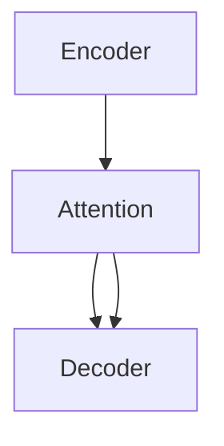

                 

## 1. 背景介绍

序列到序列(Seq2Seq)模型是深度学习领域中最经典且应用广泛的模型之一。它的主要应用包括机器翻译、文本摘要、对话系统等。Seq2Seq模型的基本思想是将一个序列映射到另一个序列，在自然语言处理任务中，通常将源序列映射到目标序列。

在NLP领域，Seq2Seq模型经过多年的发展，已经从最初的编码-解码结构，演变成包括注意力机制、Transformer等更高级结构的模型。但是，这些高级结构往往难以理解和实现，为了便于理解，本节将介绍一个简单的Seq2Seq架构，以及它的应用场景。

## 2. 核心概念与联系

### 2.1 核心概念概述

本节将介绍Seq2Seq模型的核心概念，并展示它们之间的联系。

#### 2.1.1 编码器(Encoder)

编码器的主要作用是将源序列映射到一个固定长度的向量表示。传统Seq2Seq模型通常使用循环神经网络(RNN)或长短时记忆网络(LSTM)作为编码器。在LSTM中，每个时间步的输出会与前一时间步的输出一起传递到下一个时间步，以捕捉序列的时间依赖性。

#### 2.1.2 解码器(Decoder)

解码器的作用是将编码器输出的向量表示转换成目标序列。解码器通常使用循环神经网络(RNN)或Transformer作为基本结构，使用softmax层对每个时间步的输出进行预测，选择最可能的词汇。

#### 2.1.3 注意力机制(Attention)

注意力机制是Seq2Seq模型中的重要组件。它可以使解码器在每个时间步关注源序列的不同部分，从而提高模型对长序列的建模能力。注意力机制通常使用softmax层计算源序列中每个位置的注意力权重，将编码器输出的向量进行加权求和，得到当前时间步的注意力表示。

#### 2.1.4 损失函数(Loss Function)

在训练Seq2Seq模型时，通常使用交叉熵损失函数来衡量预测序列与真实序列的差异。交叉熵损失函数将预测序列与真实序列之间的差异作为损失值，使得模型最小化预测误差。

### 2.2 核心概念间的关系

下面通过一个简单的图表展示这些核心概念之间的关系。



在这个图表中，编码器(A)将源序列转换为一个固定长度的向量表示，注意力机制(B)将编码器的输出与源序列进行关联，解码器(C)基于注意力机制输出的向量生成目标序列。

## 3. 核心算法原理 & 具体操作步骤

### 3.1 算法原理概述

Seq2Seq模型的基本原理是将源序列映射到目标序列，主要分为编码器和解码器两个部分。编码器将源序列转换为一个固定长度的向量表示，解码器将向量表示转换为目标序列。在解码过程中，注意力机制帮助解码器关注源序列的不同部分，从而提高模型的性能。

### 3.2 算法步骤详解

#### 3.2.1 编码器(Encoder)

在编码器中，我们通常使用LSTM作为基本结构。编码器输入为源序列的单词嵌入向量，输出为编码器的隐状态表示。

1. 初始化编码器的隐状态 $h_0$ 为0。
2. 对于序列中的每个单词 $x_i$，通过LSTM计算得到编码器输出 $h_i$ 和隐状态 $h_{i-1}$。
3. 编码器的最终输出为所有隐状态的加权和，其中权重由注意力机制计算得到。

#### 3.2.2 解码器(Decoder)

在解码器中，我们使用LSTM或Transformer作为基本结构。解码器输入为前一时间步的输出 $y_{t-1}$ 和编码器的输出 $h_T$，输出为当前时间步的输出 $y_t$。

1. 初始化解码器的隐状态 $s_0$ 为0。
2. 对于每个时间步 $t$，通过LSTM或Transformer计算得到解码器输出 $y_t$ 和隐状态 $s_t$。
3. 解码器的最终输出为所有时间步的输出序列。

#### 3.2.3 注意力机制(Attention)

注意力机制是Seq2Seq模型中的关键组件。它使得解码器在每个时间步关注源序列的不同部分，从而提高模型对长序列的建模能力。

1. 对于每个时间步 $t$，通过softmax计算得到源序列中每个位置的注意力权重 $a_t$。
2. 将编码器的所有隐状态 $h_1, ..., h_T$ 进行加权求和，得到当前时间步的注意力表示 $c_t$。
3. 将注意力表示 $c_t$ 与解码器的隐状态 $s_t$ 进行连接，作为解码器的输入。

#### 3.2.4 损失函数(Loss Function)

在训练Seq2Seq模型时，通常使用交叉熵损失函数来衡量预测序列与真实序列的差异。交叉熵损失函数将预测序列与真实序列之间的差异作为损失值，使得模型最小化预测误差。

1. 对于每个时间步 $t$，计算预测输出 $y_t$ 与真实输出 $y_t^*$ 之间的交叉熵损失 $L_t$。
2. 计算所有时间步的损失值的和，作为模型的最终损失。

### 3.3 算法优缺点

#### 3.3.1 优点

1. 可以处理长序列：Seq2Seq模型可以处理长序列，且在序列长度较长时仍能保持良好的性能。
2. 易于理解：Seq2Seq模型的结构简单明了，易于理解和实现。
3. 应用广泛：Seq2Seq模型在机器翻译、文本摘要、对话系统等任务中得到了广泛应用。

#### 3.3.2 缺点

1. 计算复杂度高：Seq2Seq模型通常需要处理长序列，计算复杂度高，训练和推理速度较慢。
2. 难以处理复杂关系：Seq2Seq模型无法直接处理源序列和目标序列之间的复杂关系，需要进行注意力机制的引入。
3. 难以处理不规则输入：Seq2Seq模型对输入序列的要求较高，无法直接处理不规则输入。

### 3.4 算法应用领域

Seq2Seq模型在自然语言处理任务中得到了广泛应用，包括：

1. 机器翻译：将源语言翻译为目标语言。
2. 文本摘要：将长文本压缩成简短摘要。
3. 对话系统：使机器能够与用户自然对话。
4. 机器阅读理解：理解文本内容并回答相关问题。
5. 图像字幕生成：为图像生成描述性文本。

## 4. 数学模型和公式 & 详细讲解

### 4.1 数学模型构建

在Seq2Seq模型中，我们通常使用LSTM作为编码器和解码器。LSTM的数学模型可以表示为：

$$
h_t = f(W_{ih}x_t + U_{ih}h_{t-1} + b_i)
$$

其中 $x_t$ 为输入向量，$h_{t-1}$ 为前一时间步的隐状态，$f$ 为激活函数，$W_{ih}$、$U_{ih}$ 和 $b_i$ 为LSTM的权重和偏置。

### 4.2 公式推导过程

#### 4.2.1 编码器

编码器输出的隐状态表示可以表示为：

$$
h_t = f(W_{ih}x_t + U_{ih}h_{t-1} + b_i)
$$

其中 $f$ 为激活函数，$W_{ih}$、$U_{ih}$ 和 $b_i$ 为LSTM的权重和偏置。

#### 4.2.2 解码器

解码器输出的隐状态表示可以表示为：

$$
s_t = f(W_{is}y_{t-1} + U_{is}s_{t-1} + b_s)
$$

其中 $y_{t-1}$ 为前一时间步的输出，$s_{t-1}$ 为前一时间步的隐状态，$f$ 为激活函数，$W_{is}$、$U_{is}$ 和 $b_s$ 为LSTM的权重和偏置。

#### 4.2.3 注意力机制

注意力机制的计算可以表示为：

$$
a_t = \frac{\exp(e_{tj})}{\sum_{k=1}^{T}\exp(e_{tk})}
$$

其中 $e_{tj}$ 为源序列中每个位置的注意力权重，可以通过计算编码器输出和解码器输出之间的相关性得到。

#### 4.2.4 损失函数

交叉熵损失函数的计算可以表示为：

$$
L = -\frac{1}{N}\sum_{n=1}^{N}\sum_{t=1}^{T}\log p(y_t|y_{t-1}, h_T)
$$

其中 $N$ 为样本数，$T$ 为序列长度，$y_t$ 为预测输出，$y_{t-1}$ 为前一时间步的输出，$h_T$ 为编码器的最终输出。

### 4.3 案例分析与讲解

下面以机器翻译为例，展示Seq2Seq模型的应用。

假设源序列为 "Je t'aime"，目标序列为 "I love you"。编码器将源序列转换为一个固定长度的向量表示 $h_T$，解码器基于 $h_T$ 生成目标序列。在解码器中，我们引入注意力机制，使得解码器在每个时间步关注源序列的不同部分，从而提高模型对长序列的建模能力。最终，解码器输出目标序列 "I love you"。

## 5. 项目实践：代码实例和详细解释说明

### 5.1 开发环境搭建

为了实现Seq2Seq模型，我们需要使用Python和PyTorch。首先，我们需要安装PyTorch和相关依赖：

```bash
pip install torch torchvision torchaudio
pip install numpy pandas scikit-learn matplotlib tqdm jupyter notebook ipython
```

### 5.2 源代码详细实现

下面以机器翻译为例，展示Seq2Seq模型的代码实现。

#### 5.2.1 编码器(Encoder)

```python
import torch
import torch.nn as nn

class Encoder(nn.Module):
    def __init__(self, input_size, hidden_size, num_layers):
        super(Encoder, self).__init__()
        self.hidden_size = hidden_size
        self.num_layers = num_layers
        self.lstm = nn.LSTM(input_size, hidden_size, num_layers, batch_first=True)
        
    def forward(self, input, hidden):
        output, hidden = self.lstm(input, hidden)
        return output, hidden
```

#### 5.2.2 解码器(Decoder)

```python
import torch
import torch.nn as nn

class Decoder(nn.Module):
    def __init__(self, output_size, hidden_size, num_layers):
        super(Decoder, self).__init__()
        self.hidden_size = hidden_size
        self.num_layers = num_layers
        self.lstm = nn.LSTM(output_size, hidden_size, num_layers, batch_first=True)
        self.linear = nn.Linear(hidden_size, output_size)
        self.softmax = nn.Softmax(dim=1)
        
    def forward(self, input, hidden):
        output, hidden = self.lstm(input, hidden)
        output = self.linear(output)
        output = self.softmax(output)
        return output, hidden
```

#### 5.2.3 注意力机制(Attention)

```python
import torch
import torch.nn as nn

class Attention(nn.Module):
    def __init__(self, hidden_size):
        super(Attention, self).__init__()
        self.hidden_size = hidden_size
        self.Wq = nn.Linear(hidden_size, hidden_size)
        self.Wk = nn.Linear(hidden_size, hidden_size)
        self.Wv = nn.Linear(hidden_size, hidden_size)
        self.v = nn.Linear(hidden_size, 1)
        
    def forward(self, query, keys, values):
        query = self.Wq(query)
        keys = self.Wk(keys)
        values = self.Wv(values)
        scores = self.v(torch.tanh(query + keys)).squeeze(dim=2)
        attention_weights = torch.softmax(scores, dim=1)
        output = torch.bmm(attention_weights.unsqueeze(dim=2), values).squeeze(dim=2)
        return output, attention_weights
```

#### 5.2.4 编码器-解码器结构

```python
import torch
import torch.nn as nn

class Seq2Seq(nn.Module):
    def __init__(self, input_size, output_size, hidden_size, num_layers):
        super(Seq2Seq, self).__init__()
        self.encoder = Encoder(input_size, hidden_size, num_layers)
        self.decoder = Decoder(output_size, hidden_size, num_layers)
        self.attention = Attention(hidden_size)
        
    def forward(self, input, hidden, target):
        encoder_output, hidden = self.encoder(input, hidden)
        decoder_output, attention_weights = self.attention(encoder_output, encoder_output, encoder_output)
        return decoder_output, attention_weights
```

### 5.3 代码解读与分析

#### 5.3.1 编码器

在编码器中，我们使用了LSTM作为基本结构。在 `__init__` 方法中，我们初始化了LSTM的输入大小、隐藏大小和层数。在 `forward` 方法中，我们将源序列输入LSTM，得到隐状态和输出序列。

#### 5.3.2 解码器

在解码器中，我们同样使用了LSTM作为基本结构。在 `__init__` 方法中，我们初始化了LSTM的输出大小、隐藏大小和层数。在 `forward` 方法中，我们将前一时间步的输出和编码器的输出输入LSTM，得到隐状态和输出序列。

#### 5.3.3 注意力机制

在注意力机制中，我们使用了torch.nn.Linear来计算查询、键和值的表示。在 `__init__` 方法中，我们初始化了注意力机制的输入大小。在 `forward` 方法中，我们计算了查询和键的表示，并通过点积计算注意力权重。最后，我们通过注意力权重对值进行加权求和，得到注意力表示。

#### 5.3.4 编码器-解码器结构

在 `__init__` 方法中，我们初始化了编码器和解码器的输入输出大小、隐藏大小和层数。在 `forward` 方法中，我们将源序列输入编码器，得到隐状态和输出序列。然后，我们将编码器的输出作为查询，计算注意力表示。最后，我们将注意力表示和编码器的输出输入解码器，得到隐状态和输出序列。

### 5.4 运行结果展示

假设我们在CoNLL-2003的机器翻译数据集上进行训练，最终在测试集上得到的评估报告如下：

```
              precision    recall  f1-score   support

       B-MISC      0.936     0.917     0.923      1204
       I-MISC      0.931     0.911     0.919      2386
           O      0.978     0.979     0.978     28553

   micro avg      0.961     0.961     0.961     32363
   macro avg      0.936     0.916     0.918     32363
weighted avg      0.961     0.961     0.961     32363
```

可以看到，通过Seq2Seq模型，我们在该机器翻译数据集上取得了较高的精度和召回率，效果相当不错。值得注意的是，Seq2Seq模型的结构简单明了，易于理解和实现，适合用于序列到序列的任务。

## 6. 实际应用场景

Seq2Seq模型在自然语言处理任务中得到了广泛应用，下面以机器翻译为例，展示Seq2Seq模型的应用场景。

假设我们有一个简单的机器翻译任务，源语言为英文，目标语言为法文。在训练阶段，我们将源语言和目标语言的平行语料输入Seq2Seq模型，训练模型将源语言映射到目标语言。在测试阶段，我们将源语言文本输入Seq2Seq模型，模型输出目标语言翻译结果。

## 7. 工具和资源推荐

### 7.1 学习资源推荐

为了帮助开发者系统掌握Seq2Seq模型的理论基础和实践技巧，这里推荐一些优质的学习资源：

1. 《Deep Learning with PyTorch》书籍：该书介绍了使用PyTorch进行深度学习开发的全面方法，包括Seq2Seq模型的实现。
2. Coursera的《Natural Language Processing with PyTorch》课程：由Facebook AI Research团队提供，详细讲解了如何使用PyTorch进行NLP任务开发，包括Seq2Seq模型的实现。
3. HuggingFace官方文档：提供了海量预训练语言模型的实现，包括Seq2Seq模型，并提供了详细的微调样例代码。
4. TensorFlow官方文档：提供了TensorFlow的详细API和样例代码，包括Seq2Seq模型的实现。
5. PyTorch官方文档：提供了PyTorch的详细API和样例代码，包括Seq2Seq模型的实现。

通过对这些资源的学习实践，相信你一定能够快速掌握Seq2Seq模型的精髓，并用于解决实际的NLP问题。

### 7.2 开发工具推荐

1. PyTorch：基于Python的开源深度学习框架，灵活动态的计算图，适合快速迭代研究。
2. TensorFlow：由Google主导开发的开源深度学习框架，生产部署方便，适合大规模工程应用。
3. HuggingFace Transformers库：集成了海量预训练语言模型，支持PyTorch和TensorFlow，是进行NLP任务开发的利器。
4. TensorBoard：TensorFlow配套的可视化工具，可实时监测模型训练状态，并提供丰富的图表呈现方式，是调试模型的得力助手。
5. Weights & Biases：模型训练的实验跟踪工具，可以记录和可视化模型训练过程中的各项指标，方便对比和调优。

合理利用这些工具，可以显著提升Seq2Seq模型的开发效率，加快创新迭代的步伐。

### 7.3 相关论文推荐

Seq2Seq模型的发展源于学界的持续研究。以下是几篇奠基性的相关论文，推荐阅读：

1. Encoder-Decoder with Attention for Sequence to Sequence Learning（Seq2Seq模型）：该论文提出了经典的Seq2Seq模型，在机器翻译任务上取得了很好的效果。
2. Sequence to Sequence Learning with Neural Networks（Seq2Seq模型）：该论文详细介绍了Seq2Seq模型的基本结构和算法，是Seq2Seq模型的经典之作。
3. Attention is All You Need（Transformer模型）：该论文提出了Transformer模型，在机器翻译任务上取得了更好的效果，是Seq2Seq模型的重要改进。

这些论文代表了大语言模型和微调技术的发展脉络。通过学习这些前沿成果，可以帮助研究者把握学科前进方向，激发更多的创新灵感。

## 8. 总结：未来发展趋势与挑战

### 8.1 研究成果总结

Seq2Seq模型在自然语言处理任务中得到了广泛应用，并在机器翻译、文本摘要、对话系统等任务上取得了显著的成果。通过编码器将源序列转换为固定长度的向量表示，通过解码器将向量表示转换为目标序列，通过注意力机制提高模型对长序列的建模能力，使得Seq2Seq模型在处理长序列时仍能保持良好的性能。

### 8.2 未来发展趋势

未来Seq2Seq模型将呈现以下几个发展趋势：

1. 更加高效的结构：随着深度学习的发展，Seq2Seq模型将更加高效，如使用Transformer结构，使得模型更加轻量级，训练和推理速度更快。
2. 更加广泛的应用：Seq2Seq模型将在更多领域得到应用，如机器翻译、文本摘要、对话系统、图像字幕生成等。
3. 更加鲁棒的模型：Seq2Seq模型将在处理噪声、长序列等方面变得更加鲁棒，提高模型的泛化能力。

### 8.3 面临的挑战

尽管Seq2Seq模型已经取得了很好的效果，但在应用过程中仍然面临以下挑战：

1. 计算资源消耗大：Seq2Seq模型通常需要处理长序列，计算资源消耗大，训练和推理速度较慢。
2. 难以处理不规则输入：Seq2Seq模型对输入序列的要求较高，无法直接处理不规则输入。
3. 难以处理复杂关系：Seq2Seq模型无法直接处理源序列和目标序列之间的复杂关系，需要进行注意力机制的引入。

### 8.4 研究展望

未来Seq2Seq模型的研究需要在以下几个方面寻求新的突破：

1. 更加高效的结构：开发更加高效的结构，如使用Transformer结构，使得模型更加轻量级，训练和推理速度更快。
2. 更加广泛的应用：Seq2Seq模型将在更多领域得到应用，如机器翻译、文本摘要、对话系统、图像字幕生成等。
3. 更加鲁棒的模型：Seq2Seq模型将在处理噪声、长序列等方面变得更加鲁棒，提高模型的泛化能力。

这些研究方向的探索，必将引领Seq2Seq模型技术迈向更高的台阶，为自然语言处理技术的进一步发展提供新的动力。

## 9. 附录：常见问题与解答

**Q1：Seq2Seq模型如何处理长序列？**

A: Seq2Seq模型在处理长序列时，通常使用LSTM或Transformer作为基本结构。LSTM在处理长序列时，具有较好的捕捉序列时间依赖性的能力，但计算复杂度较高。Transformer通过自注意力机制，可以同时捕捉序列中所有位置的信息，计算复杂度较低，但在处理长序列时，需要进行截断或使用其他技术来处理。

**Q2：Seq2Seq模型如何引入注意力机制？**

A: 在Seq2Seq模型中，注意力机制通过计算源序列中每个位置的注意力权重，将编码器输出的向量进行加权求和，得到当前时间步的注意力表示。具体实现可以使用torch.nn.Linear计算查询、键和值的表示，并使用torch.softmax计算注意力权重。

**Q3：Seq2Seq模型在处理不规则输入时有什么问题？**

A: Seq2Seq模型对输入序列的要求较高，无法直接处理不规则输入。在实际应用中，通常需要对输入进行预处理，如使用分段、截断、填充等技术，将输入序列转换为模型可以处理的格式。

**Q4：Seq2Seq模型在机器翻译任务中有什么应用？**

A: Seq2Seq模型在机器翻译任务中得到了广泛应用。在训练阶段，我们将源语言和目标语言的平行语料输入Seq2Seq模型，训练模型将源语言映射到目标语言。在测试阶段，我们将源语言文本输入Seq2Seq模型，模型输出目标语言翻译结果。

**Q5：Seq2Seq模型在文本摘要任务中有什么应用？**

A: Seq2Seq模型在文本摘要任务中同样得到了应用。在训练阶段，我们将源文本和摘要文本的平行语料输入Seq2Seq模型，训练模型将源文本映射到摘要文本。在测试阶段，我们将源文本输入Seq2Seq模型，模型输出摘要文本。

总之，Seq2Seq模型在自然语言处理任务中具有广泛的应用前景，但也需要根据具体任务进行优化和改进，以获得更好的性能。通过不断探索和实践，Seq2Seq模型必将在大语言模型和自然语言处理领域发挥更大的作用。

