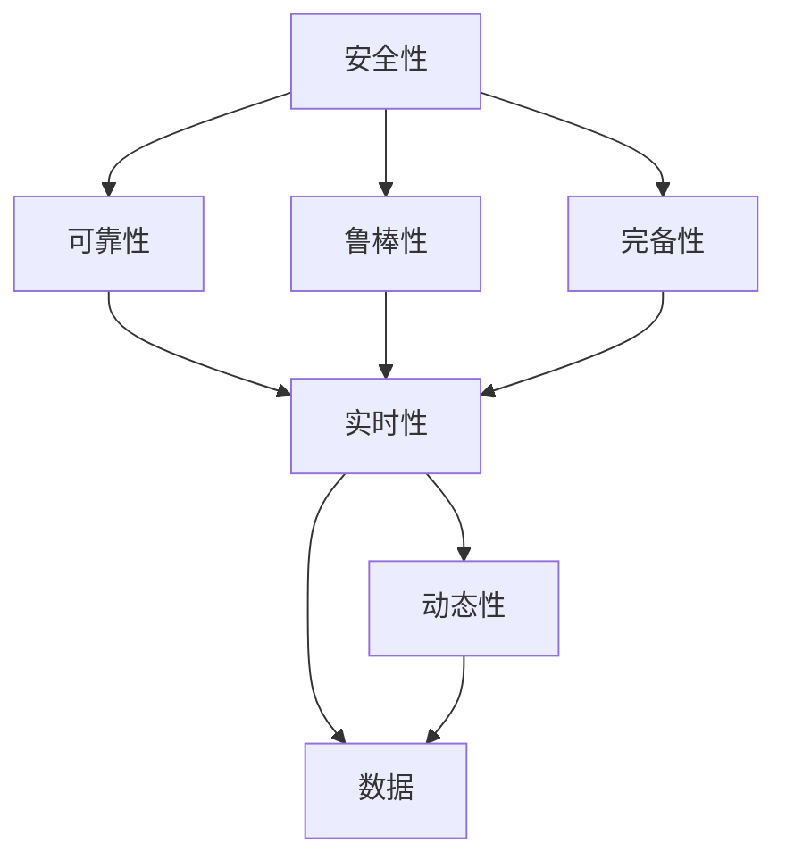

                 

# 构建自动驾驶安全性评估技术体系的核心要素与实践进展

> 关键词：自动驾驶,安全性评估,核心要素,实践进展

## 1. 背景介绍

### 1.1 问题由来

自动驾驶技术正迅速发展，其安全性成为了公众、监管机构、技术公司等多方面共同关注的焦点。自动驾驶系统在传感器、感知、决策、控制等多个层面存在复杂交互，任何环节的不足都可能导致严重事故，因此安全评估技术对于自动驾驶系统至关重要。

安全评估不仅包括对事故的事后分析，还涉及对系统在各种复杂环境中的表现进行实时监测、预测和优化。其目的是确保自动驾驶系统在不同驾驶场景下都能保持可靠的安全性，实现交通流与环境的安全协同。

### 1.2 问题核心关键点

构建自动驾驶安全性评估技术体系的核心关键点包括：

- **多层次评估体系**：建立从传感器、感知、决策到控制等各层次的系统安全性评估方法。
- **场景驱动的测试**：针对实际驾驶场景进行全面的测试，确保评估结果的真实性。
- **数据驱动的建模**：采用大数据分析技术，构建系统的精确数学模型，优化安全性评估。
- **风险量化与预警**：实现风险的量化评估，并建立预警机制，及时发现和处理安全隐患。
- **实时性与动态性**：确保评估结果具有实时性和动态性，以适应环境变化。

### 1.3 问题研究意义

构建自动驾驶安全性评估技术体系对于提升自动驾驶系统的安全性具有重要意义：

- **预防事故**：通过全面的安全评估，早期发现和纠正系统缺陷，预防重大事故发生。
- **提高效率**：优化自动驾驶系统的性能，提升整体运行效率。
- **增强信任**：确保系统安全性，增强公众和监管机构对自动驾驶技术的信任。
- **降低成本**：通过早期发现问题，避免事故导致的巨大成本。
- **推动法规制定**：提供科学的评估方法，促进相关法规的制定和执行。

## 2. 核心概念与联系

### 2.1 核心概念概述

自动驾驶安全性评估涉及多层次、多维度的核心概念，包括：

- **安全性（Safety）**：系统在不同环境下的无事故运行能力。
- **可靠性（Reliability）**：系统在连续运行中保持稳定性的能力。
- **鲁棒性（Robustness）**：系统在噪声和干扰下保持性能的能力。
- **完备性（Completeness）**：系统对各种可能场景的覆盖和处理能力。
- **实时性（Real-time）**：系统对实时数据处理和响应的能力。
- **动态性（Dynamism）**：系统对动态环境变化的适应能力。
- **数据（Data）**：用于评估的数据集，包括模拟器数据、传感器数据、事故记录等。

### 2.2 概念间的关系

这些核心概念通过一定的联系和相互作用，共同构建了自动驾驶安全性评估的技术体系：

- **安全性**：综合其他概念，是评估体系的目标和核心。
- **可靠性**：保障系统的稳定运行，是安全性评估的重要维度。
- **鲁棒性**：确保系统在干扰下仍能保持性能，是安全性评估的关键。
- **完备性**：确保系统对各种场景的全面覆盖，是评估体系的基础。
- **实时性**：确保评估结果的实时性，满足实际应用需求。
- **动态性**：确保系统对动态环境的适应性，是安全性评估的关键要素。
- **数据**：数据是评估体系的基础，需要大量的传感器数据、模拟数据和事故数据等。

这些概念之间的关系可以通过以下Mermaid流程图来展示：

这个流程图展示了几组概念之间的关系，其中：

- 安全性是目标，可靠性、鲁棒性、完备性、实时性、动态性是其相关维度，数据是基础。
- 可靠性、鲁棒性和完备性确保了安全性的实现。
- 实时性和动态性是保证评估结果的有效性和适应性。
- 数据是整个评估体系的基础。

## 3. 核心算法原理 & 具体操作步骤

### 3.1 算法原理概述

自动驾驶安全性评估涉及多种算法和技术，包括但不限于：

- **传感器数据处理**：通过滤波、融合等算法处理传感器数据，提取关键信息。
- **风险评估模型**：构建数学模型评估系统风险，如贝叶斯网络、决策树等。
- **异常检测**：使用统计方法或机器学习算法检测系统异常。
- **故障诊断**：基于规则或机器学习算法对系统故障进行诊断。
- **预测与优化**：使用预测模型对系统性能进行预测和优化。

### 3.2 算法步骤详解

基于以上算法，自动驾驶安全性评估的典型步骤如下：

1. **数据采集与预处理**：收集系统运行过程中的传感器数据和环境数据，进行数据清洗、归一化和特征提取。
2. **模型构建与训练**：构建安全性评估模型，使用历史数据进行训练和调优。
3. **风险评估与预测**：基于训练好的模型，对系统运行中的风险进行评估和预测。
4. **异常检测与故障诊断**：检测异常状态，识别潜在的故障点。
5. **预警与优化**：根据评估和预测结果，及时采取预警措施，优化系统性能。
6. **测试与验证**：使用多种测试场景和实际道路数据对模型进行验证和优化。

### 3.3 算法优缺点

自动驾驶安全性评估技术体系的优点包括：

- **综合性强**：涵盖从传感器到控制各个层次的评估，全面性强。
- **精度高**：利用数学模型和大数据，评估精度高。
- **实时性好**：采用实时数据处理，确保评估结果的实时性。

其缺点主要包括：

- **数据依赖性强**：需要大量的历史数据和传感器数据，数据获取成本高。
- **模型复杂**：构建和调优复杂的评估模型需要大量时间和资源。
- **环境适应性差**：现有的评估方法对环境变化的适应性还有待提高。

### 3.4 算法应用领域

自动驾驶安全性评估技术体系在多个领域具有广泛应用，包括：

- **交通安全**：确保自动驾驶车辆在各种环境下的安全行驶。
- **交通流优化**：优化交通流，减少交通事故。
- **城市规划**：为城市交通规划提供科学依据。
- **法规制定**：为自动驾驶法规的制定提供支持。
- **智能交通管理**：提升智能交通管理系统的安全性。

## 4. 数学模型和公式 & 详细讲解 & 举例说明

### 4.1 数学模型构建

自动驾驶安全性评估的数学模型包括多个层次，如传感器数据处理、风险评估模型、异常检测等。

以风险评估模型为例，假设系统运行状态为 $X$，可能的安全事件为 $Y$，风险评估模型为 $P(Y|X)$，可以构建贝叶斯网络模型来表示：

$$
P(Y|X) = P(X)P(Y|X)/P(Y)
$$

其中 $P(X)$ 为系统运行状态的概率，$P(Y|X)$ 为给定状态 $X$ 下事件 $Y$ 发生的概率，$P(Y)$ 为事件 $Y$ 发生的概率。

### 4.2 公式推导过程

以贝叶斯网络为例，其基本推导过程如下：

假设系统状态 $X$ 有三个节点：传感器故障、感知错误、决策失误，对应的安全事件 $Y$ 有两个节点：碰撞、未碰撞。构建如下贝叶斯网络：

![贝叶斯网络示例](https://mermaid.diagrams.net/?p=cNRVQBQqIixvh8f4eJaydxSFrjZ9hYdNESbby4lV2b3iFYiFChM0tqI1YKaWbzUQlPBRUcttJbG5lVDgJG8M4W5Hn4bY9L63L7JzKgQSRMJ4XxU8FK2tNb9tX0YRLl61yLnN5ZJ3yYXNmSGLzzQKQXlMx0ygzIeQ2QYjT6ORpDZy7kRy9Q1xj1LTQl1kZTzNTFV17jXjcOe1Cg+Uy18qBRUbdOJyykQ6N2ijNzZi3qLBH8C8oHgXigKz8qSYHb8MzKjiK6QdPwIcJt9uTYM2B5qGQoJmeYVtSgy6I2P3VvT2pNpy8g++RZ+jDKSQWm4lKVlNqowLpcYHKWag+L2+QMlPDPs+z5SBy4jSOmvNLKnb6DFMxgLeXFhVXm7k8O+TkQlPe+NUPG2sRDnS3YgRBvFtRL8GxQhjAUS0r08G8+QwLTiU2Mr0sLz4YxbQ0dJ80wz2IYDCe4ByEyr2NTE4+7V8Uk6l9UE+LxVuUHhDr2eOPQNkQStu6UZuP5F+SL6jJve9W0cE5f2ZiY0nyUJ9JTcqL5+2LsZXu+TRh0KtB+XotS9Wg6SHyumAYEX/U+4GszV4t0mO5RjXnCFtM9V/yoXvP+Oe9/dNh4YhNx4cGZ4TBmZGhyIwEdn2e7N2y5lXhS+Mwj5qQfNb5etXPrZbFeRQE6C68D/2UO2SVRz5Pv57rB4+wJ3VW5W0Sr8xcxHnWrsqNKzfPO5GjhHT2Pg2eKAVGcr3o9CRpzDbW4n/Te/fUhkPj7bxJzJXD8KVQb+jjD+k8kNKxX60RE+Z0Tb/KXxPNv0vV/6wV0j4RJhZ1xjLhL8KpwrERFX/q8Gw1Hmx0CNg5p0HJNAbPMa0L1/8VVg/bESW5Gp2LKIv4SQJf00Hw4z43R9/s/h+hQ4H2vK+qe3+tB4BArGySfCf98mn51YQ59S9WaTJeZjzX32MZ2/lyS42L77/peotmztuM5LC5yCvm/Zq5E3tIyZ/aX5frL5VmB9rNJgT+S32TZK6/Q9pU/lw5D+3L3fDCX8ZiwhdxqxgW/SzxqKmLaLz8uLsR2J2J9sNyw0K4hNY0zAqCn1CzI+bqdwf9w9Ow21TGnjC/HC32mm/ibHxpmD6EnqZ0DpEmRu1+g+Nzj0b1Z3A5z1QqdnrLY3n3Wo2dDSMhXlqDtYdsaZcKqMQR4Dp8/UUw4wD12V5tF6L+fruD8H25DvTOyA9Uw0y3pK39O5jZfB2Td/7m+jbHHEB+Eji13nWOeJd9irYAwbkLzKvARgLX1/ws5nfPz0pwb6YybybquIyKWVPKTO+3U8W6qxwnyB7m/kekA9e3qUzH5TO8//WMn1qPhjVvYfYM0dNx4G0iWVf+vHcAqRqd+3s3LT60vPhvIxHEpsWKAZW1sQXjE5yzPeNg6GzAJejgQq8KkDRf3eLszvW1DMP5zKr6k2FoN/Ne9Ctv0DpzV97pIQxVaZ0tPPNx11M8DOJH4qYb0lM7uGxkX0lJRj29d8Gt7TzC3Yw87hynrx9qVz9l3j3L6rZUzqD/tfjBxw/cywM/ww6oBtGz3/ovbEkegNG8Qh4JwZ2fS8v4zGp9yz6nhsXu9rE/26f03JiNjMW0/06J7vIKRkRygj3Q5Anyk5Zd9EiHs9TPpWy2f3F8d8dpGjOO2P1tSjQ4e6JMM4vzE9wXHQHT8ZGb0em5bGPWYyX6D5BlDybX2v9tkhUKTd/oXu7y7HbIUJ5u+t4MZhKpz7rKiz+KkR8/ntVGOltZ0I6TJt7Yn7dU0b3kOQWXbI4xbr1IcUmv3W5Han/RVuZp7/Q8QBdsa8vzqKnnl9+JfXXFjUAvqTGKuUbPY/O/4CXNEdvWXf4wNTWbd8Kr8D9lV4QH7/N5z9gmnI5ZzPcE9x6WOfiWgVvTCL9nOnc0q9IPpBtzS/izm/LGrJjIabXfA3oK/OM4GkBw4IsvNKdmpMcE+GuudKIiPjq3NTP9Qk63e23DYz5rQc9Q8HdU/7swjXn7/JrTp+yqdY1jSs2LtnoQ5fXcnHQZ0PXKI/tHN1q8R4b4K9ebFcpwO1/ecpU85aRtXa6ZVitZ0KHk7uGzX/9l9J4xnrVe9f+xUh+2kF0yLvD4wG/pB62N6BQMrcP7KxGJJ5svnuE5z9F+5Ydu/mAtz1vq/K5ckJz04GqdbNHOwW6a5a2APmJ5m2qD4JNTPr4mZDikBf9bZH+a2rM+Cr1WX0Ks9FQ1PdU6WsYQ2A1yF3IU6iRPiJfrVR/Ujvah/bP9h0+2Gt+C/9Sf1hXgY5/MfG4zz5Xf1XbX5RZhrfAvF0utSwaW/3ly0L0/v1/19Ocwn+XZkX7t6+Z/lE30c+/dy9ZzTOGDXWbJ/iHkf+5s7N5+UD1MpC8q8jIK/QN9R20PZhjnz0HLgLcz4WfH3tZOnB5sZ9ZZcDHYT4qQ8nY+DNYrRL3fTZVj5+W9v5Z/LDb3jDFwibdK8+ilqHcW1Vgq+2yrJjIOl3NxxdpjQV0Z4PWR/hiC/6C7XU0+6zUcL1NWt5ez5yCwLb/rF6cCxXSNu4flmsUp/+QX54oPmJmEaXUeU1iRrM/72mFH+eG+vyJrfGjM//mDzWb7SRVpeJ+ODHcqR7+b/mn7xfO1qZjUXaKPr9pFQXR9fQ2h0EyZ52Y+o8kduyC/NwO3iHw1EOgfe4l5v8aZ5CVb+K+o/Kn54z2ylPnP/5P4H/f0+hMDC6P+Y6DyHr/9pM8/evHr7tRmQ7HPu/R8+6Pg2P+54zK/nd/ynm+Xz3Q6JF3i13JJhHfw9tOt9t0wbQJ3XNt3QdGjZreOcP8vfqZ2L3Ww+Mf6M9Z++djXbYI/SRfL8n4Ts/6dYd/on5nP5ek78WG9MxJqvRq1yM+bKfQDv/5aXj/Dv/w1lX3yUe+cD7fXE/i7dE+Mxzez1GnmIXTZR+5sYz5Xl6i/PkDY//GxhPH5tyD5m1eqfJZQk5/odjW//P9oJ5V74l/CkM9fPnH/H5v3d/GOh4HPztsbJ/3qY+3Vl3JTnKM0OfiEeel2Rz14HN4yP2+F/ni3RfiuUruj30mFk23TG3k/RZW47/0Dz8vXN5kX6c49+/Yd/jH/F1Sxh/KqP8b/8c5l8+Rz+x6H/09zbBsax1IHvJ5d9G7A2/98IzTfMWyI3Jz3C+n9bSPZZ1j56V5vFz6FZ1POIW2uQZhW5+X8/SPGkfrv6Df77/fBQHw2S9op/Vv2K9WbtQoRr9o0WtY0+R7m3Vv2JePfW7TQZR9G2W+E16W+BlFQV+f3vBfV2ivb7hz/ciGfH+7EeZB+tRTtIprJ/a93dGP9RTPPv1C46B7hv9a+rEVtFsfelA+SX4nDXs/8f/s0i/72O+ne83SbeVdtw8uJ/36o/1EbW7mY2f/QXx/tbrt9KUjmB6bd5rT5J9rA5l2iUPGmYD6N8u7vNPXjHjWJU8/Jv/PjX9bH3/5iX+2Z8j1Gf3b/4LLKfJ/nu+f9/w/5+mz/xlX1j/2P8CP2PC/+j7Bv+7j8T//73Df67p/1p3P/o+wX+ue+f/Phu+3xv/rzG/9s3/8c/Xb8v/uf4/5n+eb/Z/uXPv/7SfyPw/9L0H9/f/3D/9A3//g/zzFf2P/LzB/9z+g+e9vx//NQX/8x8F/Hr/GVj/9p/9eNv4d/6/v/6f/3zD/6JzL9w+Pz+/Q+e/3vY/2v4f/jl+3v/9G//nC7f/H3//X7yv/z8/uT/9f8L+H/8/aX/Ff7P////HP/hcL/9b/75k/8S9r/4+P7M/9a6v/fD8X/rfB//FVf/M7+s/9d2/8W3//8+f/o+2b/evn/1f8u3/9a/k3+/w//a/8i/9/ID/n3/+w+A//e/7B/9o+ffx//9h+//+B/3h//Ku/7O/4l/ff4n/X/ff/jUu/3v+b/yZgj/9jyV+Lf/Mk5b/e4x/s/nvGf/6TL/hnAfT5/5jT//o+3/yKf/bvwnPnPt/tK5v/jPeR/8fbv+CvPfyf9yP+TvBZ+d/fw5/+6D/VftJ/n9L/0qYb4tfx4yv+/Qvhx7Rg/vnPr//I5/wZrP/MZ5kxj3+FUwV+d/A4jXbGPeZ1lvN//bzCf3a//Ij7eL/h5Pn/P2O/7Cj/3h/tXf9bGz/utif87gW7P9/FXl2v91/CPhQE9y/WPvlF1+T/1j//b/kZ/6P+yF/r1//6+H/6QKb6l+tNP0X/pv7YW/qzJ/5L/jP6+4//6Z6//Rc+/te//s/+9mO/fqf9ed/5Zz7/8n9X/TZ/7ifb//aD7Lf8/8t2L/v4Sv/P8MfqP4U//3s/3/i/zf/2/TP+XwB/8ffO/9W/4+/o//u//n+O//Pq/7//qx/6C/95+/+6v3/z//l/4j9t+9h/5m/4Ct/5T/mv+E5f3/x7X/0L3/t/pL/sv//Wb9//v/jX+F/7n/ZP+2//kfGv9L+/9X/5b/7Dyf/8h/+M2/9b+Mf6f/p//0qv9k/+z8J/zPH/z+/+M/7/+f+Y//qf/r/zL+3//kf7P/9/d8/5b/MP+c/y7/H9N/xh/4P5F/ln+Pb/D+Tf7/3n+O/8S/x7/bP+C/8v4//yL/LD/r//H/Gf8Ie1/Bv+6/3H/uV/wg/4b9h+7/3f7v/o/9N/Jv7D/9B/Jf4f/8n7t/z3jL/p//I/XPh/8I//mf0D/j/+E/8U9m+vP/7y/2D/sv/B/dC/Jv7/3P+z/3H/uP6q/1b7hPzL/Cb/nf+0b+P/8Xv4h/+B/yv+Iv6+v1H8B+e/8N/+Cf63f2n9tv1C/yb+Zv4H/xn9Pv4K/rz/jP4Q/lz9Kf3r/4T/Rv8N/2v7x/6r/rn+t/6n/9L+7/6n/kX+1/4h/rP/0v8l/5H/5L9W/yn/o/+t/3

