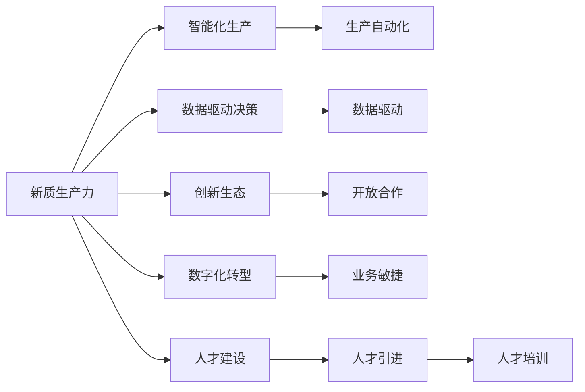
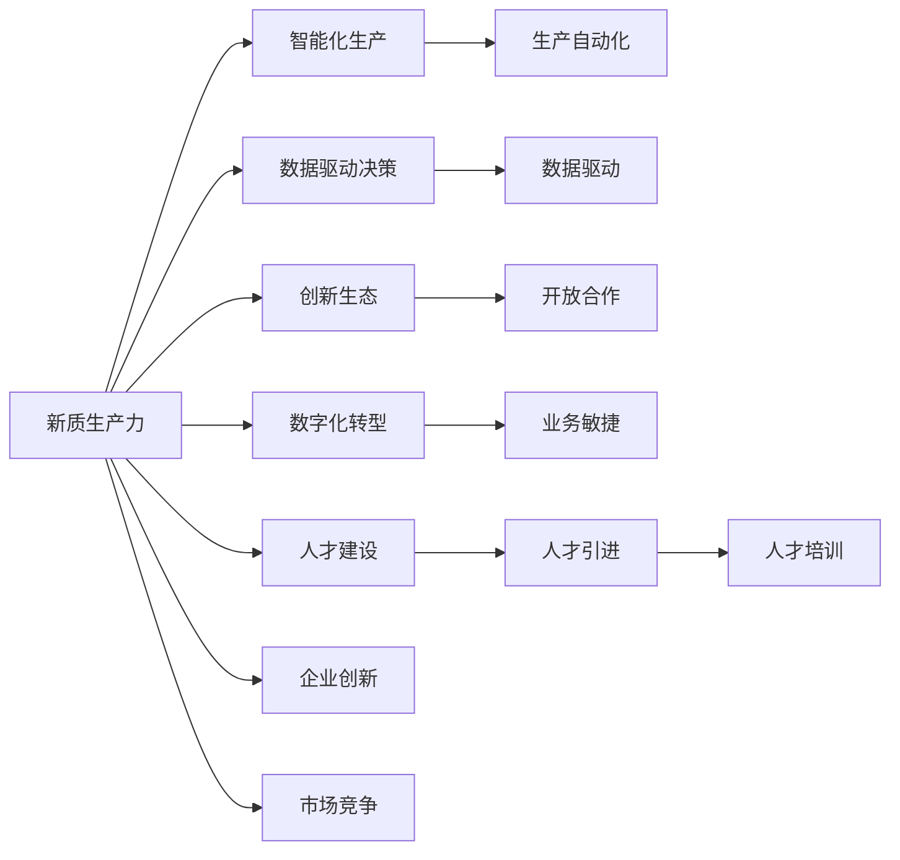
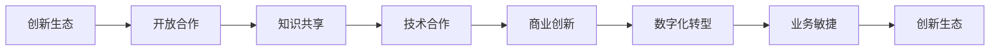
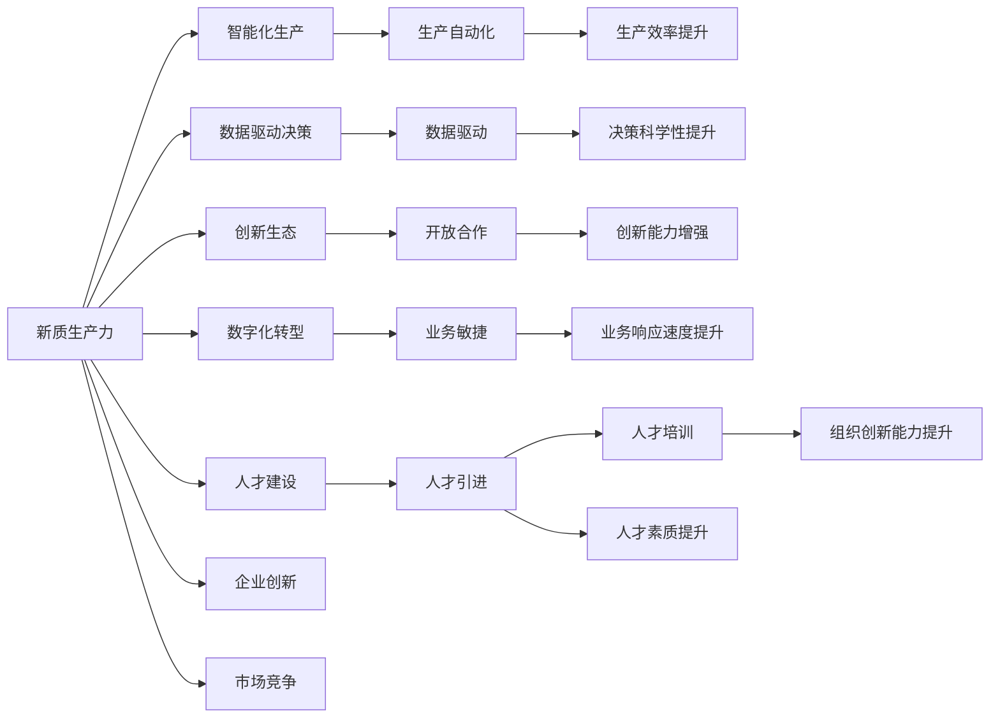

                 

## 1. 背景介绍

### 1.1 问题由来
在当今科技日新月异的时代，企业的竞争已经从单一的产品竞争转变为综合的生态竞争。随着技术的发展，企业的核心竞争力不再仅仅依赖于传统的物理资源和劳动力，而是更多地体现在知识、技术和创新能力上。为了适应这一变化，企业必须转变其生产力和竞争力的定义，提升新质生产力，从而实现可持续发展。

### 1.2 问题核心关键点
新质生产力策略的核心在于通过技术创新和数据驱动，构建智能化、数字化的运营体系，优化资源配置，提升生产效率。其关键点包括：

- **智能化生产**：利用人工智能、大数据、物联网等技术，实现生产自动化和智能化，提高生产效率和质量。
- **数据驱动决策**：通过数据分析和建模，优化供应链、库存管理、产品设计等环节，提升决策的科学性和精准性。
- **创新生态**：构建开放合作、灵活多样的创新生态系统，推动技术迭代和商业模式创新。
- **数字化转型**：实现企业内部和外部数据的互联互通，提升数据利用率和业务敏捷性。
- **人才建设**：培养和吸引高素质的人才，构建创新型团队，提升组织创新能力。

这些关键点共同构成了新质生产力策略的核心框架，帮助企业在激烈的市场竞争中保持领先地位。

### 1.3 问题研究意义
研究新质生产力策略，对于企业提高生产效率、优化运营流程、提升创新能力具有重要意义：

- **提高生产效率**：通过智能化生产，企业可以实现自动化操作，减少人为错误，提高生产速度和质量。
- **优化决策支持**：数据驱动的决策支持，能够帮助企业快速响应市场变化，做出科学决策。
- **推动创新生态**：构建开放创新的生态系统，促进技术与商业模式的融合，推动企业持续创新。
- **促进数字化转型**：实现企业内外数据的整合和共享，提升企业整体数字化水平，实现业务的敏捷响应。
- **人才发展**：培养和吸引高素质人才，提升企业的人力资本价值。

## 2. 核心概念与联系

### 2.1 核心概念概述

新质生产力策略涉及多个核心概念，这些概念共同构成了策略的实施基础。

- **新质生产力**：指的是通过技术创新和数据驱动，优化资源配置，提升企业整体竞争力的能力。
- **智能化生产**：指利用人工智能、物联网、自动化技术，实现生产过程的智能化和自动化。
- **数据驱动决策**：指通过数据收集、分析和建模，支持企业决策，提升决策的精准性和科学性。
- **创新生态**：指企业与外部合作伙伴、用户、开发者等构建的开放、多样化的创新合作体系。
- **数字化转型**：指通过数字技术，实现企业运营和管理的数字化，提升业务敏捷性和灵活性。
- **人才建设**：指企业培养和吸引高素质人才，构建创新型团队，提升组织创新能力。

这些概念之间的关系可以通过以下Mermaid流程图来展示：

这个流程图展示了大规模语言模型微调过程中各个概念之间的关系：

1. 新质生产力策略通过智能化生产、数据驱动决策、创新生态、数字化转型和人才建设五个方面，全面提升企业的核心竞争力。
2. 智能化生产通过生产自动化、数据驱动等手段，提高生产效率和质量。
3. 数据驱动决策通过数据收集和分析，支持企业科学决策。
4. 创新生态通过开放合作，促进技术迭代和商业模式创新。
5. 数字化转型通过数字化管理，提升业务敏捷性。
6. 人才建设通过人才培养和引进，提升组织创新能力。

### 2.2 概念间的关系

这些核心概念之间存在着紧密的联系，形成了新质生产力策略的完整生态系统。下面我通过几个Mermaid流程图来展示这些概念之间的关系。

#### 2.2.1 新质生产力的总体架构

这个综合流程图展示了新质生产力策略的总体架构，包括生产、决策、创新、数字化和人才建设的各个方面，以及它们之间的相互促进关系。

#### 2.2.2 智能化生产与数据驱动决策的关系

这个流程图展示了智能化生产通过生产自动化采集数据，然后通过数据分析支持决策，最终实现生产优化的过程。

#### 2.2.3 创新生态与数字化转型的关系

这个流程图展示了创新生态通过开放合作促进知识共享和技术合作，进而推动商业创新，最终实现数字化转型的过程。

### 2.3 核心概念的整体架构

最后，我们用一个综合的流程图来展示新质生产力策略的各个概念之间的整体架构：

这个综合流程图展示了新质生产力策略中各个概念之间的相互作用和整体架构，以及它们对企业核心竞争力的贡献。

## 3. 核心算法原理 & 具体操作步骤
### 3.1 算法原理概述

新质生产力策略的核心算法原理包括智能化生产、数据驱动决策、创新生态、数字化转型和人才建设五个方面。以下是对这些原理的详细阐述。

#### 3.1.1 智能化生产

智能化生产主要通过自动化和智能化技术，优化生产过程，提高生产效率和质量。其核心算法包括：

- **生产自动化**：通过机器人、自动化生产线等设备，实现生产过程的自动化。
- **智能化调度**：利用AI算法进行生产任务的智能调度，提高生产效率。
- **质量监控**：通过传感器和数据分析，实时监控产品质量，及时调整生产参数。

#### 3.1.2 数据驱动决策

数据驱动决策主要通过数据收集、分析和建模，支持企业决策，提升决策的精准性和科学性。其核心算法包括：

- **数据采集**：通过物联网、传感器等设备，实时采集生产、供应链、市场等数据。
- **数据分析**：通过数据挖掘、机器学习等技术，分析数据中的规律和趋势。
- **决策支持**：基于分析结果，构建决策模型，辅助企业做出科学决策。

#### 3.1.3 创新生态

创新生态主要通过开放合作、技术交流、知识共享等手段，构建开放创新的生态系统。其核心算法包括：

- **开放合作**：通过合作协议、技术交流等方式，与外部合作伙伴建立合作关系。
- **知识共享**：通过知识库、论坛等平台，促进知识共享和技术交流。
- **技术创新**：通过持续的技术研发和创新，推动技术迭代和商业模式创新。

#### 3.1.4 数字化转型

数字化转型主要通过数字化技术，实现企业运营和管理的数字化，提升业务敏捷性。其核心算法包括：

- **数字化管理**：通过ERP、CRM、HRM等系统，实现企业内部管理的数字化。
- **数据互联**：通过数据集成、API等技术，实现企业内外数据的互联互通。
- **业务敏捷**：通过敏捷开发、快速迭代等手段，提升业务敏捷性和灵活性。

#### 3.1.5 人才建设

人才建设主要通过培养和吸引高素质人才，构建创新型团队，提升组织创新能力。其核心算法包括：

- **人才引进**：通过招聘、猎头等方式，引进高素质人才。
- **人才培训**：通过内部培训、外部学习等方式，提升人才素质和技能。
- **人才激励**：通过绩效考核、股权激励等方式，激发人才的创造力和积极性。

### 3.2 算法步骤详解

新质生产力策略的实施分为五个步骤，每个步骤都有具体的算法和技术实现。

#### 3.2.1 步骤一：智能化生产

1. **生产自动化**：利用机器人、自动化设备等，实现生产过程的自动化。
2. **智能化调度**：通过AI算法，实时调整生产任务和资源分配，优化生产效率。
3. **质量监控**：通过传感器和数据分析，实时监控产品质量，及时调整生产参数。

#### 3.2.2 步骤二：数据驱动决策

1. **数据采集**：通过物联网、传感器等设备，实时采集生产、供应链、市场等数据。
2. **数据分析**：利用数据挖掘、机器学习等技术，分析数据中的规律和趋势。
3. **决策支持**：基于分析结果，构建决策模型，辅助企业做出科学决策。

#### 3.2.3 步骤三：创新生态

1. **开放合作**：通过合作协议、技术交流等方式，与外部合作伙伴建立合作关系。
2. **知识共享**：通过知识库、论坛等平台，促进知识共享和技术交流。
3. **技术创新**：通过持续的技术研发和创新，推动技术迭代和商业模式创新。

#### 3.2.4 步骤四：数字化转型

1. **数字化管理**：通过ERP、CRM、HRM等系统，实现企业内部管理的数字化。
2. **数据互联**：通过数据集成、API等技术，实现企业内外数据的互联互通。
3. **业务敏捷**：通过敏捷开发、快速迭代等手段，提升业务敏捷性和灵活性。

#### 3.2.5 步骤五：人才建设

1. **人才引进**：通过招聘、猎头等方式，引进高素质人才。
2. **人才培训**：通过内部培训、外部学习等方式，提升人才素质和技能。
3. **人才激励**：通过绩效考核、股权激励等方式，激发人才的创造力和积极性。

### 3.3 算法优缺点

新质生产力策略的各个算法步骤具有以下优缺点：

#### 3.3.1 智能化生产

优点：
- **提高效率**：通过自动化和智能化技术，大幅提升生产效率和质量。
- **降低成本**：减少人为错误，降低生产成本。
- **灵活性高**：生产过程可以根据市场需求进行调整。

缺点：
- **初期投入高**：需要高昂的设备和自动化改造成本。
- **技术复杂**：需要专业人员进行系统集成和维护。
- **灵活性不足**：生产过程可能存在瓶颈，难以快速响应市场变化。

#### 3.3.2 数据驱动决策

优点：
- **决策精准**：基于数据驱动的决策，能够提高决策的科学性和准确性。
- **反应迅速**：能够快速响应市场变化，及时调整策略。
- **透明性高**：数据驱动的决策过程透明，易于追溯和审计。

缺点：
- **数据质量要求高**：需要高质量的数据支持，数据采集和处理成本较高。
- **技术复杂**：需要复杂的数据分析和建模技术。
- **隐私和安全风险**：数据采集和处理可能涉及隐私和安全问题。

#### 3.3.3 创新生态

优点：
- **创新能力强**：开放合作和知识共享促进技术创新和商业模式的创新。
- **资源丰富**：能够吸引和利用外部资源，提升企业的创新能力。
- **灵活性高**：能够快速响应市场和技术的变化。

缺点：
- **风险高**：开放合作可能引入外部风险，如技术泄露、知识产权纠纷等。
- **管理复杂**：需要协调和维护多方合作关系，管理复杂度较高。
- **资源共享不足**：开放合作中可能存在资源共享不足的问题。

#### 3.3.4 数字化转型

优点：
- **效率提升**：数字化管理提升企业运营效率。
- **决策科学**：数字化技术支持数据驱动决策，提升决策科学性。
- **灵活性高**：业务敏捷性提升，能够快速响应市场需求。

缺点：
- **初期投入高**：数字化转型的初期投入较高，需要大量资金和技术支持。
- **技术复杂**：需要复杂的技术支持和系统集成。
- **数据安全风险**：数字化管理涉及大量数据，可能存在数据安全风险。

#### 3.3.5 人才建设

优点：
- **人才素质高**：高素质人才带来更高的创新能力和工作效率。
- **团队创新能力强**：创新型团队能够推动企业持续创新。
- **组织活力高**：激励机制提升人才的创造力和积极性。

缺点：
- **成本高**：高素质人才的引进和培训成本较高。
- **管理复杂**：需要复杂的人才管理机制。
- **流动性高**：高素质人才可能存在流动性高的问题。

### 3.4 算法应用领域

新质生产力策略的算法步骤广泛应用于各个领域，包括制造、金融、医疗、零售等。

#### 3.4.1 制造

在制造领域，新质生产力策略通过智能化生产、数据驱动决策、创新生态、数字化转型和人才建设，提升生产效率和质量，优化供应链管理，推动制造业转型升级。

#### 3.4.2 金融

在金融领域，新质生产力策略通过智能化生产、数据驱动决策、创新生态、数字化转型和人才建设，提升金融服务的效率和质量，优化风险管理，推动金融科技创新。

#### 3.4.3 医疗

在医疗领域，新质生产力策略通过智能化生产、数据驱动决策、创新生态、数字化转型和人才建设，提升医疗服务的效率和质量，优化资源配置，推动医疗科技创新。

#### 3.4.4 零售

在零售领域，新质生产力策略通过智能化生产、数据驱动决策、创新生态、数字化转型和人才建设，提升零售服务的效率和质量，优化库存管理，推动零售科技创新。

## 4. 数学模型和公式 & 详细讲解 & 举例说明

### 4.1 数学模型构建

新质生产力策略的实施涉及多个数学模型，以下是对这些模型的详细构建和讲解。

#### 4.1.1 智能化生产模型

智能化生产模型主要涉及生产自动化和智能化调度，数学模型如下：

- **生产自动化模型**：
$$ P_{aut} = f(X, Y) $$
其中，$X$为生产参数，$Y$为自动化设备状态，$f$为生产自动化模型。

- **智能化调度模型**：
$$ S_{sch} = g(X, Y, Z) $$
其中，$X$为生产任务，$Y$为设备状态，$Z$为调度参数，$g$为智能化调度模型。

#### 4.1.2 数据驱动决策模型

数据驱动决策模型主要涉及数据采集、数据分析和决策支持，数学模型如下：

- **数据采集模型**：
$$ D_{acq} = h(T, S) $$
其中，$T$为时间，$S$为传感器状态，$h$为数据采集模型。

- **数据分析模型**：
$$ A_{ana} = i(X, Y) $$
其中，$X$为历史数据，$Y$为当前数据，$i$为数据分析模型。

- **决策支持模型**：
$$ D_{sup} = j(X, Y, Z) $$
其中，$X$为分析结果，$Y$为当前决策，$Z$为决策参数，$j$为决策支持模型。

#### 4.1.3 创新生态模型

创新生态模型主要涉及开放合作、知识共享和技术创新，数学模型如下：

- **开放合作模型**：
$$ C_{coo} = k(X, Y, Z) $$
其中，$X$为合作协议，$Y$为技术交流，$Z$为合作参数，$k$为开放合作模型。

- **知识共享模型**：
$$ K_{sha} = l(X, Y) $$
其中，$X$为知识库，$Y$为知识共享平台，$l$为知识共享模型。

- **技术创新模型**：
$$ T_{inn} = m(X, Y) $$
其中，$X$为研发投入，$Y$为创新产出，$m$为技术创新模型。

#### 4.1.4 数字化转型模型

数字化转型模型主要涉及数字化管理、数据互联和业务敏捷，数学模型如下：

- **数字化管理模型**：
$$ M_{dig} = n(X, Y) $$
其中，$X$为数字化管理流程，$Y$为数字化管理工具，$n$为数字化管理模型。

- **数据互联模型**：
$$ D_{int} = o(X, Y, Z) $$
其中，$X$为数据源，$Y$为数据接收方，$Z$为数据传输参数，$o$为数据互联模型。

- **业务敏捷模型**：
$$ B_{agb} = p(X, Y, Z) $$
其中，$X$为敏捷开发流程，$Y$为敏捷工具，$Z$为敏捷参数，$p$为业务敏捷模型。

#### 4.1.5 人才建设模型

人才建设模型主要涉及人才引进、人才培训和人才激励，数学模型如下：

- **人才引进模型**：
$$ P_{int} = q(X, Y) $$
其中，$X$为人才需求，$Y$为人才引进渠道，$q$为人才引进模型。

- **人才培训模型**：
$$ T_{tra} = r(X, Y) $$
其中，$X$为培训计划，$Y$为培训资源，$r$为人才培训模型。

- **人才激励模型**：
$$ P_{ins} = s(X, Y, Z) $$
其中，$X$为绩效考核结果，$Y$为激励措施，$Z$为激励参数，$s$为人才激励模型。

### 4.2 公式推导过程

以下是各个模型公式的推导过程，详细讲解了各个模型如何通过数据和算法实现。

#### 4.2.1 生产自动化模型

生产自动化模型通过自动化设备和生产参数的关系，实现生产过程的自动化。假设生产设备状态为$Y$，生产参数为$X$，生产自动化模型为$f$。

$$ P_{aut} = f(X, Y) = \sum_{i=1}^{n} w_i \cdot X_i \cdot Y_i $$

其中，$w_i$为权重，$X_i$为生产参数，$Y_i$为设备状态。

#### 4.2.2 智能化调度模型

智能化调度模型通过优化生产任务和设备状态的匹配，实现生产任务的智能化调度。假设生产任务为$X$，设备状态为$Y$，调度参数为$Z$，智能化调度模型为$g$。

$$ S_{sch} = g(X, Y, Z) = \min \sum_{i=1}^{m} w_i \cdot (X_i - Y_i)^2 $$

其中，$w_i$为权重，$X_i$为生产任务，$Y_i$为设备状态。

#### 4.2.3 数据采集模型

数据采集模型通过传感器和生产时间的关系，实现数据的采集。假设时间为$T$，传感器状态为$S$，数据采集模型为$h$。

$$ D_{acq} = h(T, S) = \sum_{i=1}^{k} w_i \cdot T_i \cdot S_i $$

其中，$w_i$为权重，$T_i$为生产时间，$S_i$为传感器状态。

#### 4.2.4 数据分析模型

数据分析模型通过历史数据和当前数据的关系，实现数据的分析和预测。假设历史数据为$X$，当前数据为$Y$，数据分析模型为$i$。

$$ A_{ana} = i(X, Y) = \min \sum_{j=1}^{l} w_j \cdot (X_j - Y_j)^2 $$

其中，$w_j$为权重，$X_j$为历史数据，$Y_j$为当前数据。

#### 4.2.5 开放合作模型

开放合作模型通过合作协议和技术交流的关系，实现开放合作。假设合作协议为$X$，技术交流为$Y$，开放合作模型为$k$。

$$ C_{coo} = k(X, Y, Z) = \sum_{p=1}^{n} w_p \cdot X_p \cdot Y_p \cdot Z_p $$

其中，$w_p$为权重，$X_p$为合作协议，$Y_p$为技术交流，$Z_p$为合作参数。

#### 4.2.6 知识共享模型

知识共享模型通过知识库和共享平台的关系，实现知识共享。假设知识库为$X$，知识共享平台为$Y$，知识共享模型为$l$。

$$ K_{sha} = l(X, Y) = \sum_{q=1}^{m} w_q \cdot X_q \cdot Y_q $$

其中，$w_q$为权重，$X_q$为知识库，$Y_q$为共享平台。

#### 4.2.7 技术创新模型

技术创新模型通过研发投入和创新产出的关系，实现技术创新。假设研发投入为$X$，创新产 Out为$Y$，技术创新模型为$m$。

$$ T_{inn} = m(X, Y) = \min \sum_{r=1}^{n} w_r \cdot (X_r - Y_r)^2 $$

其中，$w_r$为权重，$X_r$为研发投入，$Y_r$为创新产出。

#### 4.2.8 数字化管理模型

数字化管理模型通过数字化管理流程和工具的关系，实现数字化管理。假设数字化管理流程为$X$，数字化管理工具为$Y$，数字化管理模型为$n$。

$$ M_{dig} = n(X, Y) = \sum_{s=1}^{k} w_s \cdot X_s \cdot Y_s $$

其中，$w_s$为权重，$X_s$为管理流程，$Y_s$为管理工具。

#### 4.2.9 数据互联模型

数据互联模型通过数据源和数据接收方的关系，实现数据互联。假设数据源为$X$，数据接收方为$Y$，数据互联模型为$o$。

$$ D_{int} = o(X, Y, Z) = \sum_{t=1}^{m} w_t \cdot X_t \cdot Y_t \cdot Z_t $$

其中，$w_t$为权重，$X_t$为数据源，$Y_t$为数据接收方，$Z_t$为传输参数。

#### 4.2.10 业务敏捷模型

业务敏捷模型通过敏捷开发流程和敏捷工具的关系，实现业务敏捷。假设敏捷开发流程为$X$，敏捷工具为$Y$，业务敏捷模型为$p$。

$$ B_{agb} = p(X, Y, Z) = \sum_{u=1}^{n} w_u \cdot X_u \cdot Y_u \cdot Z_u $$

其中，$w_u$为权重，$X_u$为敏捷开发流程，$Y_u$为敏捷工具，$Z_u$为敏捷参数。

#### 4.2.11 人才引进模型

人才引进模型通过人才需求和引进渠道的关系，实现人才引进。假设人才需求为$X$，引进渠道为$Y$，人才引进模型为$q$。

$$ P_{int} = q(X, Y) = \sum_{v=1}^{m} w_v \cdot X_v \cdot Y_v $$

其中，$w_v$为权重，$X_v$为人才需求，$Y_v$为引进渠道。

#### 4.2.12 人才培训模型

人才培训模型通过培训计划和培训资源的关系，实现人才培训。假设培训计划为$X$，培训资源为$Y$，人才培训模型为$r$。

$$ T_{tra} = r(X, Y) = \sum_{w=1}^{n} w_w \cdot X_w \cdot Y_w $$

其中，$w_w$为权重，$X_w$为培训计划，$Y_w$为培训资源。

#### 4.2.13 人才激励模型

人才激励模型通过绩效考核结果和激励措施的关系，实现人才激励。假设绩效考核结果为$X$，激励措施为$Y$，人才激励模型为$s$。

$$ P_{ins} = s(X, Y, Z) = \sum_{z=1}^{m} w_z \cdot

