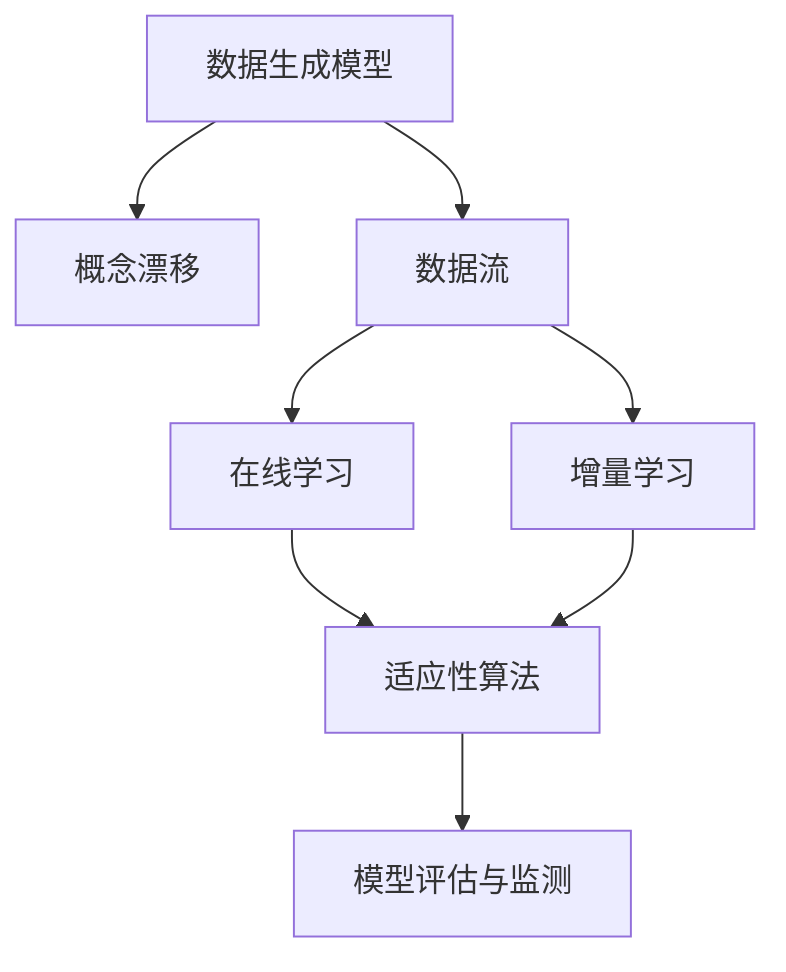
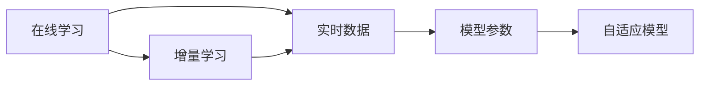
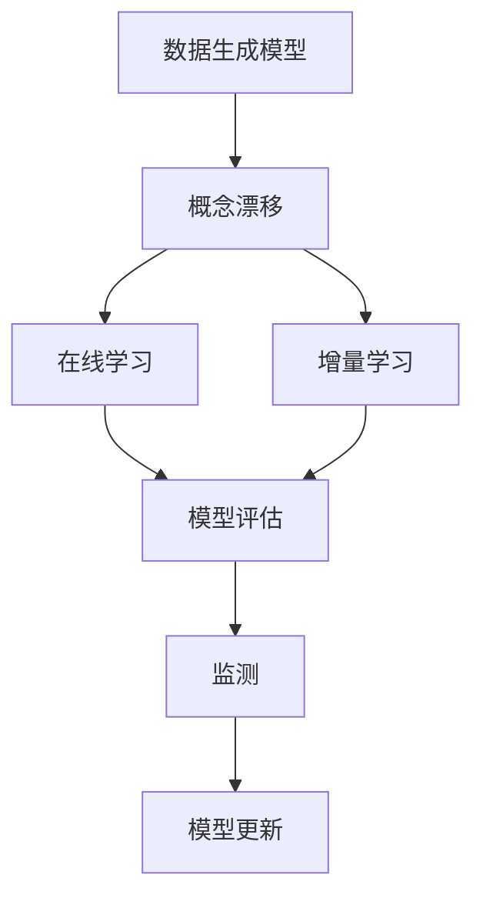
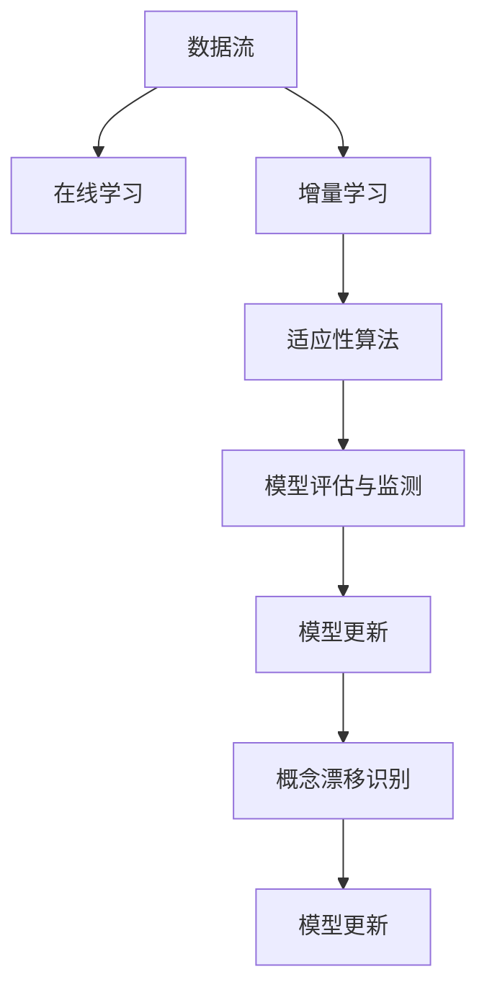

                 

# 概念漂移 (Concept Drift) 原理与代码实例讲解

> 关键词：概念漂移, 在线学习, 流数据, 数据流, 适应性算法

## 1. 背景介绍

### 1.1 问题由来
在数据分析和机器学习领域，尤其是处理时间序列数据或流数据的场景下，数据分布的变化是一个常见但重要的现象，即概念漂移(Concept Drift)。概念漂移指的是数据生成模型或其概率分布随时间发生变化的现象，意味着数据本身所体现的概念发生了迁移或演变。这种变化可能是缓慢的、瞬时的，也可能是在一定时间范围内间歇性发生的。

例如，在金融领域，股票市场的趋势可能随着时间的推移发生变化，导致股票价格生成模型发生变化；在自然语言处理领域，不同时期的语言使用习惯、语法和表达方式也可能发生变化，使得语言模型需要不断地更新以适应新的语言变化。

概念漂移是实际应用中一个普遍存在的问题，特别是在流数据处理、在线学习等场景下。概念漂移的存在会导致模型无法准确预测未来的数据，从而影响模型性能和决策质量。

### 1.2 问题核心关键点
概念漂移的核心关键点在于：

- **数据分布变化**：数据的统计特征（如均值、方差、协方差等）随时间发生变化，导致模型无法继续准确预测未来数据。
- **模型适应性**：模型需要具有自适应能力，能够及时更新以反映数据分布的最新变化。
- **算法与技术**：需要应用特定的算法和技术来识别和适应概念漂移，如在线学习、增量学习、适应性算法等。
- **评估与监测**：需要评估模型对新数据的适应能力，监测概念漂移的发生和变化，确保模型及时更新以适应数据变化。

## 2. 核心概念与联系

### 2.1 核心概念概述

概念漂移是指在流数据或时间序列数据的处理中，数据分布随时间变化的现象。在机器学习和数据分析领域，概念漂移可以分为以下几类：

- **缓慢漂移**：数据分布缓慢变化，需要较长时间才能察觉。
- **瞬时漂移**：数据分布瞬间发生变化，模型需要立即适应。
- **间歇性漂移**：数据分布间歇性地发生变化，模型需要识别并适应。

理解概念漂移，需要掌握以下几个关键概念：

- **在线学习(Online Learning)**：通过不断地接收新数据，实时更新模型参数，以适应数据分布的变化。
- **增量学习(Incremental Learning)**：在不重新训练整个模型的情况下，利用新数据更新部分模型参数。
- **适应性算法(Adaptive Algorithms)**：能够自适应数据分布变化的算法，如AdaBoost、Perceptron、KNN等。
- **模型评估与监测**：通过交叉验证、AIC/BIC准则、学习曲线等方法，评估模型对新数据的适应能力，监测概念漂移的发生和变化。

这些核心概念之间的关系可以通过以下Mermaid流程图来展示：



这个流程图展示了数据生成模型随时间变化，导致概念漂移，进而需要通过在线学习和增量学习更新模型，应用适应性算法来适应数据分布的变化，并通过模型评估与监测确保模型及时更新以适应数据变化。

### 2.2 概念间的关系

这些核心概念之间存在着紧密的联系，构成了概念漂移的完整应对框架。下面我们通过几个Mermaid流程图来展示这些概念之间的关系。

#### 2.2.1 在线学习与增量学习的区别



这个流程图展示了在线学习和增量学习的基本区别。在线学习强调实时接收数据，实时更新模型参数；而增量学习则是在不重新训练整个模型的情况下，利用新数据更新部分模型参数。

#### 2.2.2 适应性算法与概念漂移的关联


这个流程图展示了适应性算法与概念漂移的关联。适应性算法通过自适应模型参数，以适应数据分布的变化，从而识别和适应概念漂移。

#### 2.2.3 模型评估与监测的作用



这个流程图展示了模型评估与监测的作用。模型评估通过交叉验证、AIC/BIC准则、学习曲线等方法，评估模型对新数据的适应能力；而监测则通过持续跟踪模型性能，及时发现和应对概念漂移。

### 2.3 核心概念的整体架构

最后，我们用一个综合的流程图来展示这些核心概念在大语言模型微调过程中的整体架构：



这个综合流程图展示了从数据流开始，经过在线学习和增量学习，应用适应性算法，通过模型评估与监测，识别概念漂移，并更新模型以应对数据变化的过程。

## 3. 核心算法原理 & 具体操作步骤

### 3.1 算法原理概述

概念漂移的在线学习算法主要基于增量学习的方法，通过不断地接收新数据，实时更新模型参数，以适应数据分布的变化。其核心思想是在不断更新的过程中，维持模型的准确性和适应性。

常用的在线学习算法包括：

- **Perceptron**：一种简单但有效的二分类在线学习算法，通过不断接收新数据，更新模型参数。
- **AdaBoost**：一种通过加权重构的在线学习算法，能够自适应数据分布的变化。
- **K近邻算法(KNN)**：一种基于距离的在线学习算法，能够实时更新模型参数以适应新数据。

这些算法的基本思想都是在不断接收新数据时，更新模型参数，以维持模型的预测准确性。

### 3.2 算法步骤详解

以下以AdaBoost为例，详细讲解概念漂移的在线学习算法步骤：

**Step 1: 初始化模型和样本权重**

首先，对数据流中的前 $k$ 个样本进行初步划分，设置样本权重为 $1/k$。

**Step 2: 迭代更新模型**

对于每个新样本 $x_i$，计算其对每个弱分类器的分类误差 $e_i$，并选择误差最小的分类器 $f_i$。根据 $e_i$ 计算样本权重 $w_i$，并将 $f_i$ 添加到模型中。

**Step 3: 更新模型参数**

根据新加入的分类器 $f_i$ 更新模型参数 $\theta$，使得模型在新样本上的误差最小。

**Step 4: 预测和评估**

对新的测试样本进行预测，并评估模型在当前数据流上的性能。

**Step 5: 重复迭代**

重复上述过程，直到达到预设的迭代次数或模型性能满足要求。

### 3.3 算法优缺点

概念漂移的在线学习算法具有以下优点：

- **实时性**：能够实时接收新数据，实时更新模型参数，适应数据分布的变化。
- **泛化能力**：能够适应数据分布的缓慢变化，保持模型在不断变化的数据流上的预测准确性。
- **计算复杂度**：相比重新训练整个模型，在线学习算法的计算复杂度较低，资源消耗较少。

其缺点包括：

- **过拟合风险**：在数据分布快速变化的情况下，在线学习算法可能无法及时调整，导致模型过拟合新数据。
- **模型复杂度**：模型中包含多个分类器，增加了模型的复杂度和维护难度。
- **模型泛化性**：对于瞬时或间歇性概念漂移，在线学习算法可能无法及时识别和适应，导致模型性能下降。

### 3.4 算法应用领域

概念漂移的在线学习算法广泛应用于流数据处理、在线推荐系统、金融市场预测等领域。例如：

- **金融市场预测**：通过实时接收股票市场数据，及时更新模型参数，预测股票价格变化。
- **在线推荐系统**：通过实时接收用户行为数据，不断调整推荐模型，提升推荐质量。
- **流数据处理**：通过实时接收传感器数据，不断调整模型参数，实现实时数据分析和决策支持。

这些领域中，数据流是不断变化的，概念漂移是普遍存在的，因此在线学习算法能够有效应对这些挑战，保持模型的预测准确性和适应性。

## 4. 数学模型和公式 & 详细讲解 & 举例说明

### 4.1 数学模型构建

概念漂移的在线学习算法通常采用增量学习的方法，其数学模型可以表示为：

$$
\theta_t = \theta_{t-1} + \alpha_t \sum_{i=1}^N w_{i,t} f_i(x_i; \theta_{t-1})
$$

其中，$\theta_t$ 是第 $t$ 次迭代的模型参数，$\theta_{t-1}$ 是第 $t-1$ 次迭代的模型参数，$\alpha_t$ 是学习率，$f_i(x_i; \theta_{t-1})$ 是第 $i$ 个弱分类器的分类结果，$w_{i,t}$ 是样本权重。

增量学习的关键在于如何动态更新样本权重，以反映新数据的分布变化。常见的样本权重更新方法包括：

- **样本权重固定**：对每个样本分配相同的权重。
- **样本权重动态调整**：根据新数据的分布动态调整样本权重。

### 4.2 公式推导过程

以下以AdaBoost算法为例，推导其样本权重更新公式：

假设样本 $x_i$ 的分类结果为 $y_i$，分类误差为 $e_i$。AdaBoost算法的样本权重更新公式为：

$$
w_{i,t} = \frac{1}{\eta_t \exp(-\alpha_t e_i y_i)}
$$

其中，$\eta_t = \sum_{i=1}^N w_{i,t-1}$ 是样本权重之和，$\alpha_t$ 是第 $t$ 次迭代的缩放因子，控制样本权重的大小。

根据样本权重更新公式，AdaBoost算法通过不断接收新数据，更新样本权重，选择误差最小的分类器，并动态调整模型参数，以适应数据分布的变化。

### 4.3 案例分析与讲解

以金融市场预测为例，解释概念漂移的在线学习算法如何应用于实际问题。

**案例背景**：假设某金融市场在一天内接收了 $N$ 个实时交易数据，每个数据包含股票价格、交易量、时间戳等信息。为了预测未来的股票价格，可以利用概念漂移的在线学习算法。

**算法步骤**：

1. 初始化模型和样本权重，设置 $k$ 个样本，每个样本权重为 $1/k$。
2. 对于每个新接收的股票交易数据 $x_i$，计算其对每个弱分类器的分类误差 $e_i$，并选择误差最小的分类器 $f_i$。
3. 根据 $e_i$ 计算样本权重 $w_{i,t}$，并将 $f_i$ 添加到模型中。
4. 根据新加入的分类器 $f_i$ 更新模型参数 $\theta$，使得模型在新样本上的误差最小。
5. 对新的测试样本进行预测，并评估模型在当前数据流上的性能。
6. 重复上述过程，直到达到预设的迭代次数或模型性能满足要求。

**结果分析**：通过实时接收市场交易数据，并不断更新模型参数，AdaBoost算法能够在市场趋势发生变化时及时调整预测模型，提高预测准确性。

## 5. 项目实践：代码实例和详细解释说明

### 5.1 开发环境搭建

在进行概念漂移的在线学习算法实践前，我们需要准备好开发环境。以下是使用Python进行Scikit-learn开发的Scikit-learn环境配置流程：

1. 安装Anaconda：从官网下载并安装Anaconda，用于创建独立的Python环境。

2. 创建并激活虚拟环境：
```bash
conda create -n sklearn-env python=3.8 
conda activate sklearn-env
```

3. 安装Scikit-learn：
```bash
pip install scikit-learn
```

4. 安装NumPy、Pandas、Matplotlib等辅助工具：
```bash
pip install numpy pandas matplotlib scikit-learn
```

完成上述步骤后，即可在`sklearn-env`环境中开始项目实践。

### 5.2 源代码详细实现

下面我们以AdaBoost算法为例，给出使用Scikit-learn库对股票价格数据进行在线学习的Python代码实现。

```python
from sklearn.ensemble import AdaBoostClassifier
from sklearn.metrics import mean_squared_error
import numpy as np
import pandas as pd

# 加载数据
data = pd.read_csv('stock_prices.csv')
X = data.iloc[:, :-1].values
y = data.iloc[:, -1].values

# 分割训练集和测试集
train_size = int(len(X) * 0.8)
X_train, X_test, y_train, y_test = X[:train_size], X[train_size:], y[:train_size], y[train_size:]

# 初始化模型和样本权重
estimator = AdaBoostClassifier()
weights = np.ones(len(X_train)) / len(X_train)

# 迭代更新模型
for i in range(10):
    # 训练弱分类器
    estimator = AdaBoostClassifier()
    estimator.fit(X_train, y_train, sample_weight=weights)
    
    # 更新样本权重
    y_pred = estimator.predict(X_train)
    weights = weights * np.exp(-y_pred * y_train)
    weights /= np.sum(weights)
    
    # 更新模型参数
    estimator.set_params(estimator=estimator)
    
# 测试模型
y_pred = estimator.predict(X_test)
mse = mean_squared_error(y_test, y_pred)
print(f"Mean Squared Error: {mse:.2f}")
```

### 5.3 代码解读与分析

让我们再详细解读一下关键代码的实现细节：

**AdaBoostClassifier**：
- `AdaBoostClassifier`是Scikit-learn库中用于在线学习的分类器，支持实时接收数据，更新模型参数。

**样本权重更新**：
- 通过不断接收新数据，更新样本权重，选择误差最小的分类器，并动态调整模型参数。

**模型训练**：
- 利用AdaBoostClassifier训练弱分类器，并动态更新样本权重。

**模型测试**：
- 对新数据进行预测，并评估模型在当前数据流上的性能。

**代码优化**：
- 使用`set_params`方法，避免重新创建AdaBoostClassifier对象，提高代码效率。

**结果输出**：
- 打印模型的预测均方误差，评估模型在新数据上的性能。

通过以上代码实现，我们展示了概念漂移的在线学习算法在实际问题中的应用，能够实时接收数据，动态更新模型参数，适应数据分布的变化，从而提高预测准确性。

## 6. 实际应用场景

### 6.1 智能推荐系统

概念漂移的在线学习算法在智能推荐系统中具有广泛的应用。推荐系统需要实时接收用户行为数据，并不断更新模型参数，以适应用户的兴趣变化。通过实时接收用户点击、浏览、评分等数据，在线学习算法能够及时调整推荐模型，提升推荐质量。

### 6.2 金融市场预测

金融市场数据的实时变化是典型的概念漂移问题。在线学习算法通过实时接收股票交易数据，及时更新模型参数，能够提高股票价格预测的准确性。

### 6.3 流数据处理

流数据处理中，数据流是不断变化的，概念漂移是普遍存在的。在线学习算法能够实时接收传感器数据，不断调整模型参数，实现实时数据分析和决策支持。

### 6.4 未来应用展望

随着大数据和人工智能技术的不断发展，概念漂移的在线学习算法将进一步得到广泛应用，特别是在实时数据处理、在线推荐系统、金融市场预测等领域。未来，基于概念漂移的在线学习算法将结合更多的技术和方法，如深度学习、强化学习、因果推断等，进一步提升预测准确性和系统鲁棒性。

## 7. 工具和资源推荐

### 7.1 学习资源推荐

为了帮助开发者系统掌握概念漂移的原理和实践技巧，这里推荐一些优质的学习资源：

1. 《机器学习》（周志华著）：全面介绍了机器学习的各种算法和技术，包括在线学习、增量学习、适应性算法等。

2. 《Pattern Recognition and Machine Learning》（Christopher M. Bishop著）：介绍了机器学习中的经典算法和技术，包括在线学习、增量学习、概念漂移等。

3. 《Hands-On Machine Learning with Scikit-Learn, Keras, and TensorFlow》（Aurélien Géron著）：通过Scikit-Learn、Keras和TensorFlow等工具库，深入讲解了在线学习的实现方法和应用场景。

4. 《Machine Learning Mastery》（Jason Brownlee著）：提供了大量实际案例和代码实现，帮助读者掌握在线学习的技巧和应用。

5. Coursera《机器学习》课程：由斯坦福大学教授Andrew Ng讲授，介绍了机器学习的基本概念和算法，包括在线学习、增量学习等。

通过对这些资源的学习实践，相信你一定能够快速掌握概念漂移的原理和应用技巧，并将其应用到实际问题中。

### 7.2 开发工具推荐

高效的开发离不开优秀的工具支持。以下是几款用于概念漂移算法开发的常用工具：

1. Scikit-learn：基于Python的开源机器学习库，提供了大量的在线学习算法和增量学习算法，易于使用。

2. TensorFlow：由Google开发的开源深度学习框架，支持分布式计算和模型部署，适合大规模工程应用。

3. PyTorch：由Facebook开发的开源深度学习框架，具有灵活的动态计算图，适合研究和快速迭代。

4. Weights & Biases：模型训练的实验跟踪工具，可以记录和可视化模型训练过程中的各项指标，方便对比和调优。

5. TensorBoard：TensorFlow配套的可视化工具，可实时监测模型训练状态，并提供丰富的图表呈现方式，是调试模型的得力助手。

6. Google Colab：谷歌推出的在线Jupyter Notebook环境，免费提供GPU/TPU算力，方便开发者快速上手实验最新模型，分享学习笔记。

合理利用这些工具，可以显著提升概念漂移算法开发的效率，加快创新迭代的步伐。

### 7.3 相关论文推荐

概念漂移的研究源于学界的持续研究。以下是几篇奠基性的相关论文，推荐阅读：

1. Concept Drift (Holger Kriegel et al., 2001)：首次提出概念漂移的概念，并介绍了一种基于动态时间窗口的概念漂移检测方法。

2. Online Learning with Concept Drift (AdaBoost) (Wang et al., 2006)：介绍了AdaBoost算法在概念漂移检测中的应用，展示了AdaBoost算法在在线学习中的优势。

3. Adaptive Online Learning Algorithms for Concept Drift (Zhang et al., 2011)：提出了一种基于增量学习的自适应在线学习算法，能够适应数据分布的变化。

4. Online Learning with Data and Concept Drift (Gao et al., 2012)：介绍了在线学习在数据漂移和概念漂移中的应用，提出了一些在线学习算法的设计原则。

5. Concept Drift Detection and Adaptation: A Survey (Kriegel et al., 2014)：综述了概念漂移检测和适应的各种方法，并提出了一些挑战和未来研究方向。

这些论文代表了大语言模型微调技术的发展脉络。通过学习这些前沿成果，可以帮助研究者把握学科前进方向，激发更多的创新灵感。

除上述资源外，还有一些值得关注的前沿资源，帮助开发者紧跟概念漂移的最新进展，例如：

1. arXiv论文预印本：人工智能领域最新研究成果的发布平台，包括大量尚未发表的前沿工作，学习前沿技术的必读资源。

2. 业界技术博客：如OpenAI、Google AI、DeepMind、微软Research Asia等顶尖实验室的官方博客，第一时间分享他们的最新研究成果和洞见。

3. 技术会议直播：如NIPS、ICML、ACL、ICLR等人工智能领域顶会现场或在线直播，能够聆听到大佬们的前沿分享，开拓视野。

4. GitHub热门项目：在GitHub上Star、Fork数最多的概念漂移相关项目，往往代表了该技术领域的发展趋势和最佳实践，值得去学习和贡献。

5. 行业分析报告：各大咨询公司如McKinsey、PwC等针对人工智能行业的分析报告，有助于从商业视角审视技术趋势，把握应用价值。

总之，对于概念漂移技术的学习和实践，需要开发者保持开放的心态和持续学习的意愿。多关注前沿资讯，多动手实践，多思考总结，必将收获满满的成长收益。

## 8. 总结：未来发展趋势与挑战

### 8.1 总结

本文对概念漂移的在线学习算法进行了全面系统的介绍。首先阐述了概念漂移的定义和核心关键点，明确了在线学习算法在适应数据分布变化中的重要作用。其次，从原理到实践，详细讲解了在线学习算法的数学模型和关键步骤，给出了在线学习算法在实际问题中的应用案例。最后，本文提供了多种学习资源和开发工具，力求为读者提供全方位的技术指引。

通过本文的系统梳理，可以看到，在线学习算法在应对数据流中概念漂移问题中具有重要应用价值，能够实时接收新数据，动态更新模型参数，保持模型对新数据的适应性。未来，伴随在线学习算法的不断发展，其在实时数据处理、在线推荐系统、金融市场预测等领域将进一步得到广泛应用，为人工智能技术带来更多的应用场景和创新点。

### 8.2 未来发展趋势

展望未来，概念漂移的在线学习算法将呈现以下几个发展趋势：

1. 实时性不断提高。在线学习算法能够实时接收新数据，动态更新模型参数，适应数据分布的变化。未来，随着计算能力的提升，实时性将进一步提高，模型更新速度将更快，适应性更强。

2. 算法更加复杂。在线学习算法将结合更多的技术和方法，如深度学习、强化学习、因果推断等，进一步提升预测准确性和系统鲁棒性。

3. 模型结构更加灵活。在线学习算法将采用更加灵活的模型结构，如混合精度训练、模型并行等，进一步优化资源消耗，提高计算效率。

4. 评估方法更加多样。在线学习算法将结合更多的评估方法，如交叉验证、AIC/BIC准则、学习曲线等，评估模型对新数据的适应能力。

5. 数据处理更加全面。在线学习算法将结合更多的数据处理技术，如数据清洗、特征工程、数据增强等，进一步提高数据的质量和多样性，提升模型性能。

以上趋势凸显了概念漂移的在线学习算法的广阔前景。这些方向的探索发展，必将进一步提升模型性能，适应更加复杂多变的实际问题。

### 8.3 面临的挑战

尽管在线学习算法已经取得了显著进展，但在实际应用中仍面临诸多挑战：

1. 数据质量问题。在线学习算法对数据质量有较高的要求，数据的不完整、不准确、不一致等问题，可能导致模型性能下降。

2. 模型鲁棒性问题。在线学习算法在数据分布变化较大的情况下，可能出现模型鲁棒性不足的问题，导致预测准确性下降。

3. 计算资源问题。在线学习算法需要持续接收和处理新数据，计算资源消耗较大，特别是在数据量较大的情况下，计算资源压力较大。

4. 模型复杂性问题。在线学习算法需要维护多个弱分类器，模型复杂度较高，特别是在数据流中概念漂移频繁的情况下，模型更新频率较高，维护难度较大。

5. 模型公平性问题。在线学习算法在数据流中，可能出现模型偏见，导致某些类别的预测准确性下降。

这些挑战是概念漂移在线学习算法面临的主要问题，需要在算法设计、模型优化、数据预处理等方面进行改进和优化。

### 8.4 未来突破

面对概念漂移在线学习算法所面临的挑战，未来的研究需要在以下几个方面寻求新的突破：

1. 探索更高效的数据处理技术。开发更加高效的数据清洗、特征工程、数据增强等技术，提高数据质量，增强模型的泛化能力。

2. 研究更加复杂的模型结构。结合深度学习、强化学习、因果推断等技术，设计更加复杂和灵活的在线学习算法，提高模型的适应性和鲁棒性。

3. 引入外部知识源。将外部知识源，如知识图谱、逻辑规则等，与在线学习算法结合，提升模型的解释性和可解释性。

4. 优化模型参数更新策略。研究更加高效的模型参数更新策略，减少模型更新频率，降低计算资源消耗。

5. 引入自适应学习率机制。设计自适应学习率机制，根据数据分布变化自动调整学习率，提高模型的适应性和鲁棒性。

这些研究方向的探索，必将引领在线学习算法迈向更高的台阶，为人工智能技术带来更多的创新和突破。面向未来，在线学习算法需要在保持实时

