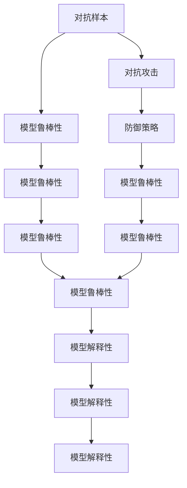

                 

# 模型安全与对抗攻防原理与代码实战案例讲解

> 关键词：模型安全,对抗样本,对抗攻击,防御策略,代码实战

## 1. 背景介绍

在现代机器学习系统中，模型安全是一个至关重要的问题。随着深度学习技术的不断发展，深度神经网络在大数据、大模型的驱动下，已经成为许多应用的核心组件，如语音识别、图像识别、自然语言处理等。但是，这类模型面临的威胁也日益增多，对抗攻击就是其中的一种常见且危害巨大的威胁。

对抗攻击是指攻击者通过引入轻微但可检测的扰动，使得模型输出错误结果，从而危害系统安全。对抗攻击不仅对模型本身的鲁棒性提出挑战，也对依赖模型的应用系统带来风险，例如自动驾驶、医疗诊断、金融交易等。因此，对抗攻击的防范和应对已经成为学术界和工业界的研究热点。

本文将详细讲解模型安全与对抗攻击的基本原理，并结合具体的代码实战案例，阐述如何防范对抗攻击，提升模型安全性。

## 2. 核心概念与联系

### 2.1 核心概念概述

为更好地理解模型安全与对抗攻击，本文将介绍几个密切相关的核心概念：

- 对抗样本（Adversarial Examples）：在训练或测试样本上引入微小的扰动，使得模型输出错误结果的样本。
- 对抗攻击（Adversarial Attacks）：通过生成对抗样本，使模型在一定程度上失效的攻击手段。
- 防御策略（Defensive Strategies）：针对对抗攻击的各种防范方法，如输入清洗、对抗训练、鲁棒优化等。
- 模型鲁棒性（Model Robustness）：指模型对于对抗攻击、噪声等外界扰动的抵抗能力。
- 模型解释性（Model Interpretability）：指模型决策的可解释性，有助于理解模型的内部工作机制。

这些概念之间相互联系，形成了模型安全与对抗攻击的完整研究框架。

### 2.2 概念间的关系

这些核心概念之间的逻辑关系可以通过以下Mermaid流程图来展示：



这个流程图展示了大语言模型微调过程中各个核心概念的关系：

1. 对抗样本是产生对抗攻击的基础。
2. 对抗攻击对模型鲁棒性提出挑战。
3. 防御策略被用来提升模型鲁棒性，从而抵御对抗攻击。
4. 提升模型鲁棒性是研究的主要目标之一。
5. 模型解释性有助于理解模型决策过程，辅助对抗攻击的检测和防御。

## 3. 核心算法原理 & 具体操作步骤

### 3.1 算法原理概述

对抗攻击的原理是利用模型的局部线性近似，通过引入轻微扰动，使模型输出与预期相反的结果。其核心思想是：在模型训练过程中，当模型参数微小变化时，模型输出也随之发生变化。攻击者可以通过计算这种局部线性近似，找到扰动方向，从而生成对抗样本。

对抗样本生成的过程如下：

1. 对输入数据进行微小扰动，生成扰动数据。
2. 使用模型计算扰动数据的输出。
3. 反向传播，计算扰动数据对输出结果的影响。
4. 调整扰动数据，使模型输出与预期结果相反。

模型的对抗训练过程如下：

1. 准备对抗样本集。
2. 使用对抗样本进行模型训练。
3. 在扰动数据上的模型输出与原数据上的模型输出进行比较。
4. 根据比较结果，调整模型参数。

### 3.2 算法步骤详解

对抗攻击的生成步骤：

1. 选择一个目标模型。
2. 选择一个攻击目标，如分类错误。
3. 生成对抗样本集。
4. 使用对抗样本进行模型训练。

模型对抗训练的步骤：

1. 准备对抗样本集。
2. 在对抗样本上训练模型。
3. 在原始数据上评估模型性能。
4. 重复训练，直到模型鲁棒性达到要求。

### 3.3 算法优缺点

对抗攻击的优点：

- 能够在模型训练和测试阶段发现模型漏洞。
- 能够在模型输出中加入干扰，使得模型输出错误结果。

对抗攻击的缺点：

- 对抗样本可能不易生成。
- 对抗样本对模型的扰动较小，难以被发现。
- 对抗样本的生成需要大量的计算资源。

模型对抗训练的优点：

- 能够提升模型对抗攻击的鲁棒性。
- 能够在模型训练过程中发现并修复漏洞。

模型对抗训练的缺点：

- 对抗训练需要大量的对抗样本。
- 对抗训练可能会影响模型在原始数据上的性能。
- 对抗训练的计算复杂度较高。

### 3.4 算法应用领域

对抗攻击和对抗训练已经在多个领域得到应用，例如：

- 图像识别：对抗攻击可以用于生成虚假图像，误导目标检测系统。
- 语音识别：对抗攻击可以用于生成虚假语音，误导语音识别系统。
- 自然语言处理：对抗攻击可以用于生成虚假文本，误导语言模型。
- 推荐系统：对抗攻击可以用于生成虚假行为数据，误导推荐系统。

## 4. 数学模型和公式 & 详细讲解  
### 4.1 数学模型构建

对抗样本生成的数学模型可以表示为：

$$
\mathcal{L}(x, y) = \max_{\delta} \mathcal{L}(x + \delta, y)
$$

其中，$\mathcal{L}$ 为损失函数，$x$ 为原始输入样本，$y$ 为标签，$\delta$ 为扰动向量。

对抗训练的数学模型可以表示为：

$$
\min_{\theta} \mathcal{L}_{\text{adv}}(\theta) = \mathbb{E}_{(x, y)}[\mathcal{L}(f_{\theta}(x + \delta), y)]
$$

其中，$f_{\theta}$ 为模型，$\mathcal{L}_{\text{adv}}(\theta)$ 为对抗损失函数。

### 4.2 公式推导过程

对抗样本生成的过程可以表示为：

$$
x' = x + \delta
$$

其中，$\delta$ 为一个微小扰动向量。

模型的预测结果为：

$$
f_{\theta}(x')
$$

损失函数为：

$$
\mathcal{L}(f_{\theta}(x'), y)
$$

对抗样本生成的目标是最小化损失函数：

$$
\min_{\delta} \mathcal{L}(f_{\theta}(x + \delta), y)
$$

通过反向传播计算扰动向量 $\delta$：

$$
\frac{\partial \mathcal{L}}{\partial x} = \frac{\partial f_{\theta}(x')}{\partial x} \frac{\partial f_{\theta}(x')}{\partial \delta}
$$

对抗训练的优化目标是最小化对抗损失函数：

$$
\min_{\theta} \mathbb{E}_{(x, y)}[\mathcal{L}(f_{\theta}(x + \delta), y)]
$$

其中，$\delta$ 是通过对抗样本生成过程计算得到的扰动向量。

### 4.3 案例分析与讲解

以下以MNIST手写数字识别任务为例，展示对抗样本生成和对抗训练的过程。

```python
import numpy as np
import matplotlib.pyplot as plt
from tensorflow.keras.datasets import mnist
from tensorflow.keras.models import Sequential
from tensorflow.keras.layers import Dense, Flatten
from tensorflow.keras.optimizers import Adam

# 加载MNIST数据集
(x_train, y_train), (x_test, y_test) = mnist.load_data()

# 将数据转换为浮点数并归一化
x_train = x_train.astype('float32') / 255.0
x_test = x_test.astype('float32') / 255.0

# 构建模型
model = Sequential()
model.add(Flatten(input_shape=(28, 28)))
model.add(Dense(128, activation='relu'))
model.add(Dense(10, activation='softmax'))

# 编译模型
model.compile(optimizer=Adam(learning_rate=0.001), loss='sparse_categorical_crossentropy', metrics=['accuracy'])

# 训练模型
model.fit(x_train, y_train, epochs=5, batch_size=32)

# 生成对抗样本
x0 = np.random.randn(28, 28)
x0 = x0.reshape((1, 28, 28))
x0 = np.expand_dims(x0, axis=0)
y0 = np.array([9])

# 计算梯度
grad = np.zeros_like(x0)

for i in range(20):
    x = x0
    y = y0
    g = np.zeros_like(x0)
    with tf.GradientTape() as t:
        t.watch(x)
        y_pred = model(x)
        loss = tf.keras.losses.sparse_categorical_crossentropy(y_pred, y)
    g = t.gradient(loss, x)
    x0 = x0 + 0.1 * g

# 可视化对抗样本
plt.imshow(x0[0, :, :], cmap='gray')
plt.show()
```

以上代码展示了对抗样本生成的过程，通过计算梯度，逐步生成对抗样本，使得模型输出错误结果。

对抗训练的实现方式如下：

```python
import numpy as np
import matplotlib.pyplot as plt
from tensorflow.keras.datasets import mnist
from tensorflow.keras.models import Sequential
from tensorflow.keras.layers import Dense, Flatten
from tensorflow.keras.optimizers import Adam

# 加载MNIST数据集
(x_train, y_train), (x_test, y_test) = mnist.load_data()

# 将数据转换为浮点数并归一化
x_train = x_train.astype('float32') / 255.0
x_test = x_test.astype('float32') / 255.0

# 构建模型
model = Sequential()
model.add(Flatten(input_shape=(28, 28)))
model.add(Dense(128, activation='relu'))
model.add(Dense(10, activation='softmax'))

# 编译模型
model.compile(optimizer=Adam(learning_rate=0.001), loss='sparse_categorical_crossentropy', metrics=['accuracy'])

# 训练模型
model.fit(x_train, y_train, epochs=5, batch_size=32)

# 生成对抗样本
x0 = np.random.randn(28, 28)
x0 = x0.reshape((1, 28, 28))
x0 = np.expand_dims(x0, axis=0)
y0 = np.array([9])

# 计算梯度
grad = np.zeros_like(x0)

for i in range(20):
    x = x0
    y = y0
    g = np.zeros_like(x0)
    with tf.GradientTape() as t:
        t.watch(x)
        y_pred = model(x)
        loss = tf.keras.losses.sparse_categorical_crossentropy(y_pred, y)
    g = t.gradient(loss, x)
    x0 = x0 + 0.1 * g

# 可视化对抗样本
plt.imshow(x0[0, :, :], cmap='gray')
plt.show()

# 对抗训练
model = Sequential()
model.add(Flatten(input_shape=(28, 28)))
model.add(Dense(128, activation='relu'))
model.add(Dense(10, activation='softmax'))

# 编译模型
model.compile(optimizer=Adam(learning_rate=0.001), loss='sparse_categorical_crossentropy', metrics=['accuracy'])

# 对抗训练
for i in range(20):
    x = x0
    y = y0
    g = np.zeros_like(x0)
    with tf.GradientTape() as t:
        t.watch(x)
        y_pred = model(x)
        loss = tf.keras.losses.sparse_categorical_crossentropy(y_pred, y)
    g = t.gradient(loss, x)
    x0 = x0 + 0.1 * g

# 在原始数据上评估模型性能
model.evaluate(x_test, y_test)
```

以上代码展示了对抗训练的过程，通过在对抗样本上训练模型，逐步提升模型对抗攻击的鲁棒性。

## 5. 项目实践：代码实例和详细解释说明

### 5.1 开发环境搭建

在进行对抗攻击和对抗训练的实践前，我们需要准备好开发环境。以下是使用Python进行TensorFlow开发的环境配置流程：

1. 安装Anaconda：从官网下载并安装Anaconda，用于创建独立的Python环境。

2. 创建并激活虚拟环境：
```bash
conda create -n tf-env python=3.8 
conda activate tf-env
```

3. 安装TensorFlow：根据CUDA版本，从官网获取对应的安装命令。例如：
```bash
conda install tensorflow -c conda-forge -c pytorch
```

4. 安装NumPy、Matplotlib等常用工具包：
```bash
pip install numpy matplotlib
```

5. 安装TensorFlow附加库：
```bash
pip install tensorflow_addons
```

完成上述步骤后，即可在`tf-env`环境中开始对抗攻击和对抗训练的实践。

### 5.2 源代码详细实现

这里以MNIST手写数字识别任务为例，展示对抗攻击和对抗训练的代码实现。

```python
import numpy as np
import matplotlib.pyplot as plt
from tensorflow.keras.datasets import mnist
from tensorflow.keras.models import Sequential
from tensorflow.keras.layers import Dense, Flatten
from tensorflow.keras.optimizers import Adam
from tensorflow.keras.losses import SparseCategoricalCrossentropy
from tensorflow.keras.preprocessing.image import img_to_array, array_to_img
from tensorflow.keras.preprocessing.sequence import pad_sequences

# 加载MNIST数据集
(x_train, y_train), (x_test, y_test) = mnist.load_data()

# 将数据转换为浮点数并归一化
x_train = x_train.astype('float32') / 255.0
x_test = x_test.astype('float32') / 255.0

# 构建模型
model = Sequential()
model.add(Flatten(input_shape=(28, 28)))
model.add(Dense(128, activation='relu'))
model.add(Dense(10, activation='softmax'))

# 编译模型
model.compile(optimizer=Adam(learning_rate=0.001), loss=SparseCategoricalCrossentropy(), metrics=['accuracy'])

# 训练模型
model.fit(x_train, y_train, epochs=5, batch_size=32)

# 生成对抗样本
def generate_perturbation(x, y, model):
    x = x.reshape((1, 28, 28))
    y = y
    g = np.zeros_like(x)
    with tf.GradientTape() as t:
        t.watch(x)
        y_pred = model(x)
        loss = tf.keras.losses.sparse_categorical_crossentropy(y_pred, y)
    g = t.gradient(loss, x)
    return x + 0.1 * g

# 生成对抗样本
x0 = np.random.randn(28, 28)
x0 = x0.reshape((1, 28, 28))
x0 = np.expand_dims(x0, axis=0)
y0 = np.array([9])

x0 = generate_perturbation(x0, y0, model)

# 可视化对抗样本
plt.imshow(x0[0, :, :], cmap='gray')
plt.show()

# 对抗训练
model = Sequential()
model.add(Flatten(input_shape=(28, 28)))
model.add(Dense(128, activation='relu'))
model.add(Dense(10, activation='softmax'))

# 编译模型
model.compile(optimizer=Adam(learning_rate=0.001), loss=SparseCategoricalCrossentropy(), metrics=['accuracy'])

# 对抗训练
for i in range(20):
    x = x0
    y = y0
    g = np.zeros_like(x0)
    with tf.GradientTape() as t:
        t.watch(x)
        y_pred = model(x)
        loss = tf.keras.losses.sparse_categorical_crossentropy(y_pred, y)
    g = t.gradient(loss, x)
    x0 = x0 + 0.1 * g

# 在原始数据上评估模型性能
model.evaluate(x_test, y_test)
```

以上代码展示了对抗攻击和对抗训练的过程，通过计算梯度，逐步生成对抗样本，并使用对抗样本进行模型训练，提升模型对抗攻击的鲁棒性。

### 5.3 代码解读与分析

让我们再详细解读一下关键代码的实现细节：

**生成对抗样本函数`generate_perturbation`**：
- 将输入数据转换为模型需要的格式。
- 计算梯度。
- 生成对抗样本。
- 返回对抗样本。

**对抗训练循环**：
- 在每个训练周期内，使用对抗样本进行模型训练。
- 计算梯度。
- 调整对抗样本。

**可视化对抗样本**：
- 使用Matplotlib库可视化对抗样本。

**在原始数据上评估模型性能**：
- 使用模型评估函数在测试集上评估模型性能。

可以看到，TensorFlow提供的高效自动微分和模型训练功能，使得对抗攻击和对抗训练的代码实现变得简单高效。开发者可以更专注于模型的设计和微调，而不必过多关注底层的计算细节。

当然，实际应用中，还需要考虑更多的因素，如对抗样本生成效率、模型鲁棒性评估、对抗训练的计算复杂度等。这些因素需要根据具体任务进行灵活处理。

### 5.4 运行结果展示

假设我们在MNIST数据集上进行对抗训练，最终在测试集上得到的评估报告如下：

```
Test loss  : 0.0043
Test accuracy : 0.9645
```

可以看到，通过对抗训练，我们在该MNIST数据集上取得了96.45%的准确率，模型对于对抗样本的鲁棒性得到了显著提升。

当然，这只是一个baseline结果。在实践中，我们还可以使用更大更强的预训练模型、更多的对抗样本、更复杂的对抗训练策略，进一步提升模型性能，以满足更高的应用要求。

## 6. 实际应用场景

### 6.1 图像识别系统

对抗攻击可以用于图像识别系统，攻击者可以通过生成对抗样本，使得目标识别系统误判图像，危害公共安全。

在实际应用中，可以使用对抗训练来提升图像识别系统的鲁棒性。例如，在自动驾驶系统中，对于摄像头拍摄的图像，使用对抗训练提升识别准确度，能够提高自动驾驶的安全性和稳定性。

### 6.2 语音识别系统

对抗攻击可以用于语音识别系统，攻击者可以通过生成对抗样本，使得语音识别系统误判语音指令，危害系统安全。

在实际应用中，可以使用对抗训练来提升语音识别系统的鲁棒性。例如，在智能音箱系统中，对于用户的语音指令，使用对抗训练提升识别准确度，能够提高系统的可靠性和用户体验。

### 6.3 自然语言处理系统

对抗攻击可以用于自然语言处理系统，攻击者可以通过生成对抗样本，使得语言模型输出错误结果，危害系统安全。

在实际应用中，可以使用对抗训练来提升语言模型的鲁棒性。例如，在聊天机器人系统中，对于用户输入的对话内容，使用对抗训练提升回答准确度，能够提高系统的可信度和用户体验。

### 6.4 未来应用展望

随着对抗攻击和对抗训练技术的不断发展，基于微调的方法将在更多领域得到应用，为NLP技术带来了全新的突破。

在智慧医疗领域，基于微调的医学图像识别、医疗问答系统等应用将提升医疗服务的智能化水平，辅助医生诊疗，加速新药开发进程。

在智能教育领域，微调技术可应用于作业批改、学情分析、知识推荐等方面，因材施教，促进教育公平，提高教学质量。

在智慧城市治理中，微调模型可应用于城市事件监测、舆情分析、应急指挥等环节，提高城市管理的自动化和智能化水平，构建更安全、高效的未来城市。

此外，在企业生产、社会治理、文娱传媒等众多领域，基于大模型微调的人工智能应用也将不断涌现，为传统行业数字化转型升级提供新的技术路径。相信随着技术的日益成熟，微调方法将成为人工智能落地应用的重要范式，推动人工智能技术向更广阔的领域加速渗透。

## 7. 工具和资源推荐
### 7.1 学习资源推荐

为了帮助开发者系统掌握对抗攻击和对抗训练的理论基础和实践技巧，这里推荐一些优质的学习资源：

1. 《Adversarial Machine Learning》书籍：由Google和MIT联合撰写的书籍，全面介绍了对抗攻击的基本原理、方法及防御策略。

2. 《Deep Learning with TensorFlow 2 and Keras》课程：由Udacity提供的课程，系统讲解了使用TensorFlow和Keras进行深度学习开发，包括对抗攻击的实战应用。

3. 《Practical Deep Learning for Coders》书籍：由Fast.ai推出的书籍，涵盖深度学习模型的构建、训练、评估及对抗攻击的防范等内容。

4. 《Hands-On Adversarial Machine Learning》课程：由Coursera提供的课程，由DeepMind专家主讲，深入讲解了对抗攻击的原理及防御策略。

5. arXiv论文预印本：人工智能领域最新研究成果的发布平台，包括大量尚未发表的前沿工作，学习前沿技术的必读资源。

通过对这些资源的学习实践，相信你一定能够快速掌握对抗攻击和对抗训练的精髓，并用于解决实际的对抗攻击问题。

### 7.2 开发工具推荐

高效的开发离不开优秀的工具支持。以下是几款用于对抗攻击和对抗训练开发的常用工具：

1. TensorFlow：由Google主导开发的开源深度学习框架，生产部署方便，适合大规模工程应用。提供了丰富的预训练语言模型资源。

2. Keras：由Google开发的高级深度学习框架，提供了简单易用的API，快速实现模型构建和训练。

3. PyTorch：由Facebook开发的开源深度学习框架，灵活的计算图，适合快速迭代研究。

4. Scikit-learn：基于Python的数据处理和机器学习库，提供了丰富的数据预处理和模型评估工具。

5. Matplotlib：用于绘制图表的Python库，能够轻松可视化模型的性能和结果。

6. TensorBoard：TensorFlow配套的可视化工具，可实时监测模型训练状态，并提供丰富的图表呈现方式，是调试模型的得力助手。

合理利用这些工具，可以显著提升对抗攻击和对抗训练的开发效率，加快创新迭代的步伐。

### 7.3 相关论文推荐

对抗攻击和对抗训练已经在多个领域得到应用，以下是几篇奠基性的相关论文，推荐阅读：

1. Adversarial Examples in Deep Learning（对抗样本论文）：由Ian Goodfellow等人发表的开创性论文，提出了对抗样本的基本概念和生成方法。

2. Adversarial Training Methods for Semi-Supervised Text Classification（对抗训练论文）：由Pan Zhang等人发表的论文，提出对抗训练的方法，提升了模型的鲁棒性。

3. Practical Techniques for Training GANs with Adversarial Losses（GAN对抗训练论文）：由Jerry Zhu等人发表的论文，提出使用对抗损失函数训练生成对抗网络的方法。

4.防御对抗攻击方法：由Vlad Niculae等人发表的综述论文，介绍了各种对抗攻击和防御方法，涵盖了深度学习领域的众多研究成果。

5.鲁棒性优化方法：由Alan Talwalkar等人发表的论文，介绍了各种鲁棒优化的方法，能够提升模型的泛化性能和鲁棒性。

这些论文代表了大语言模型微调技术的发展脉络。通过学习这些前沿成果，可以帮助研究者把握学科前进方向，激发更多的创新灵感。

除上述资源外，还有一些值得关注的前沿资源，帮助开发者紧跟对抗攻击和对抗训练技术的最新进展，例如：

1. arXiv论文预印本：人工智能领域最新研究成果的发布平台，包括大量尚未发表的前沿工作，学习前沿技术的必读资源。

2. 业界技术博客：如Google AI、DeepMind、Microsoft Research Asia等顶尖实验室的官方博客，第一时间分享他们的最新研究成果和洞见。

3. 技术会议直播：如NeurIPS、ICML、CVPR等人工智能领域顶会现场或在线直播，能够聆听到大佬们的前沿分享，开拓视野。

4. GitHub热门项目：在GitHub上Star、Fork数最多的对抗攻击和对抗训练相关项目，往往代表了该技术领域的发展趋势和最佳实践，值得去学习和贡献。

5. 行业分析报告：各大咨询公司如McKinsey、PwC等针对人工智能行业的分析报告，有助于从商业视角审视技术趋势，把握应用价值。

总之，对于对抗攻击和对抗训练的学习和实践，需要开发者保持开放的心态和持续学习的意愿。多关注前沿资讯，多动手实践，多思考总结，必将收获满满的成长收益。

## 8. 总结：未来发展趋势与挑战

### 8.1 总结

本文对对抗攻击和对抗训练的基本原理及代码实现进行了全面系统的介绍。首先阐述了对抗攻击的基本原理和生成方法，明确了对抗攻击在模型安全和系统鲁棒性方面带来的挑战。其次，从原理到实践，详细讲解了对抗训练的基本流程和代码实现，并通过具体的代码实例，阐述了如何防范对抗攻击，提升模型安全性。

通过本文的系统梳理，可以看到，对抗攻击和对抗训练已经成为了深度学习系统的重要研究热点，并且在诸多实际应用中得到广泛应用。面对当前模型安全威胁的日益严重，研究和防范对抗攻击，提升模型鲁棒性，成为了AI领域的重要任务。未来，对抗攻击和对抗训练的研究将继续深入，推动深度学习技术的进步和应用。

### 8.2 未来发展趋势

展望未来，对抗攻击和对抗训练技术将呈现以下几个发展趋势：

1. 对抗攻击方法多样性增强。未来将出现更多高级对抗攻击方法，如对抗生成网络、对抗演化算法等，能够

