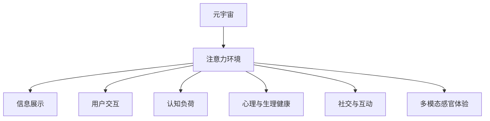
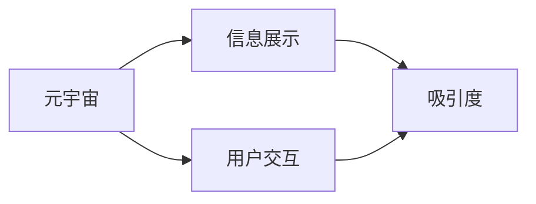
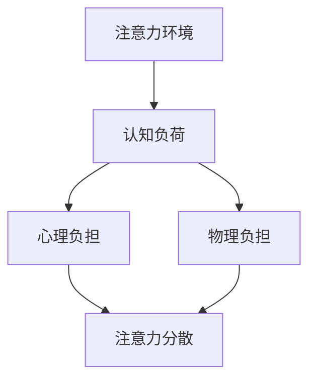
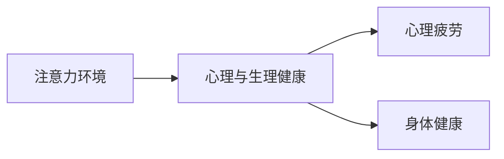
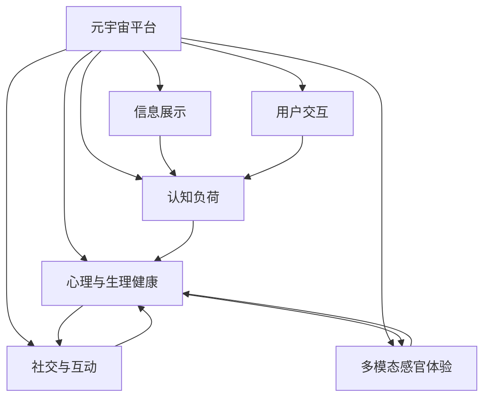

                 

# 注意力环境影响评估:元宇宙开发的生态考量

> 关键词：元宇宙,注意力模型,环境评估,生态系统,人工智能,影响分析

## 1. 背景介绍

### 1.1 问题由来
元宇宙（Metaverse）作为近年来的热门话题，正逐渐从科幻走进现实，引发了广泛关注。它通过整合虚拟与现实世界的交互元素，构建了一个持久且虚拟的空间。随着技术的不断进步，元宇宙的应用场景不断扩展，从虚拟社交、沉浸式游戏到虚拟办公、数字资产交易等，无所不包。然而，元宇宙的快速发展也带来了诸多挑战，尤其是对用户注意力（Attention）环境的影响，引发了广泛讨论。

注意力环境，即用户在使用元宇宙服务时所处的环境，包括注意力的吸引程度、信息呈现方式、用户参与度等。良好的注意力环境有助于提升用户体验，增加用户粘性，推动元宇宙平台的长期发展。但若环境不当，可能导致用户疲劳、注意力分散甚至心理健康问题，影响平台的使用效果。

### 1.2 问题核心关键点
元宇宙平台上的注意力环境主要包括以下几个方面：

1. **信息展示与交互**：虚拟空间中的信息展示方式、交互行为对用户注意力的吸引和消耗。
2. **认知负荷**：用户在使用元宇宙服务时，需要处理的信息量和复杂度对注意力的影响。
3. **心理与生理健康**：长时间使用元宇宙可能对用户的心理状态和生理健康产生影响。
4. **社交与互动**：用户间的互动行为和社交关系对注意力的吸引和分配。
5. **多模态感官体验**：视觉、听觉、触觉等多感官的融合体验对注意力的影响。

这些关键点互相交织，共同构成了元宇宙平台上的注意力环境，对其开发和应用具有重要意义。

### 1.3 问题研究意义
研究元宇宙平台的注意力环境，对于提升用户体验、优化服务设计、推动行业健康发展具有重要意义：

1. **提升用户体验**：通过评估注意力环境，可以优化信息展示和交互方式，提高用户使用平台的愉悦度和满足感。
2. **优化服务设计**：理解用户注意力的分配和消耗，有助于设计更具吸引力和合理性的元宇宙体验。
3. **推动行业发展**：构建健康的注意力环境，减少用户疲劳和心理负担，有助于平台的长期可持续性。
4. **引导心理健康**：关注用户的心理与生理健康，有助于开发更负责任、更人性化的元宇宙服务。
5. **丰富感官体验**：探索多模态感官融合的注意力模型，提升用户的沉浸感和互动性。

总之，通过研究元宇宙平台上的注意力环境，可以更好地理解用户需求和行为，从而设计出更加优质和安全的元宇宙应用。

## 2. 核心概念与联系

### 2.1 核心概念概述

为更好地理解元宇宙平台上的注意力环境，本节将介绍几个密切相关的核心概念：

- **元宇宙**：由虚拟现实（Virtual Reality, VR）、增强现实（Augmented Reality, AR）、混合现实（Mixed Reality, MR）等技术构建的虚拟空间，具有高度沉浸感和多感官交互特性。
- **注意力环境**：用户在使用元宇宙服务时所处的环境，包括信息展示方式、用户交互、认知负荷、社交互动、多感官体验等。
- **认知负荷**：用户在处理信息时的心理和生理负担，包括信息量、复杂度和用户专注度等。
- **心理与生理健康**：长时间使用元宇宙可能对用户的心理状态和生理健康产生影响。
- **社交与互动**：用户间的互动行为和社交关系对注意力的吸引和分配。
- **多模态感官体验**：视觉、听觉、触觉等多感官的融合体验对注意力的影响。

这些核心概念之间的逻辑关系可以通过以下Mermaid流程图来展示：



这个流程图展示了大语言模型的核心概念及其之间的关系：

1. 元宇宙是注意力环境存在的基础，决定了信息的展示方式和用户交互行为。
2. 注意力环境影响用户的认知负荷、心理与生理健康、社交与互动以及多模态感官体验。
3. 认知负荷、心理与生理健康、社交与互动以及多模态感官体验共同构成了用户的注意力环境。

### 2.2 概念间的关系

这些核心概念之间存在着紧密的联系，形成了元宇宙平台注意力环境评估的完整生态系统。下面我通过几个Mermaid流程图来展示这些概念之间的关系。

#### 2.2.1 元宇宙的信息展示与交互



这个流程图展示了元宇宙平台中信息展示和用户交互的关系：

1. 元宇宙的信息展示方式直接吸引用户的注意力。
2. 用户交互行为对信息的展示方式进行反馈，影响信息的更新和展示。

#### 2.2.2 认知负荷与注意力环境



这个流程图展示了认知负荷对注意力环境的影响：

1. 用户处理信息的复杂度和信息量影响其认知负荷。
2. 认知负荷对用户的心理和物理负担有直接影响，可能导致注意力分散。

#### 2.2.3 心理与生理健康与注意力环境



这个流程图展示了心理与生理健康对注意力环境的影响：

1. 心理与生理健康状态影响用户的注意力集中度和使用时长。
2. 长期使用元宇宙可能导致心理和生理疲劳，影响注意力环境。

### 2.3 核心概念的整体架构

最后，我们用一个综合的流程图来展示这些核心概念在元宇宙平台注意力环境评估中的整体架构：



这个综合流程图展示了从元宇宙平台到注意力环境各个组成部分的逻辑关系：

1. 元宇宙平台决定了信息展示、用户交互、认知负荷、心理与生理健康、社交与互动以及多模态感官体验。
2. 信息展示、用户交互、认知负荷、心理与生理健康、社交与互动以及多模态感官体验共同构成了注意力环境。
3. 注意力环境影响元宇宙平台的用户体验和满意度。

## 3. 核心算法原理 & 具体操作步骤
### 3.1 算法原理概述

元宇宙平台的注意力环境评估，本质上是构建一种量化模型，用以评估用户在使用元宇宙服务时的注意力状态。该模型通过收集用户行为数据和反馈信息，结合心理学、认知科学等多学科知识，综合分析用户的注意力分配、消耗和分布，以评估注意力环境的质量。

形式化地，假设元宇宙平台的用户数为 $N$，其注意力状态用 $A$ 表示，包括注意力集中度、分散度、疲劳度等。定义注意力模型 $M_A$，将用户行为数据 $D$ 和环境特征 $F$ 作为输入，输出注意力状态 $A$：

$$
A = M_A(D, F)
$$

其中 $D$ 为用户的输入输出数据，如交互行为、反馈信息、生理指标等；$F$ 为环境特征，包括信息展示方式、认知负荷、心理与生理健康、社交与互动、多模态感官体验等。注意力模型 $M_A$ 可以是神经网络模型、逻辑回归模型、SVM等机器学习算法。

### 3.2 算法步骤详解

基于元宇宙平台的注意力环境评估，一般包括以下几个关键步骤：

**Step 1: 数据收集与预处理**
- 收集元宇宙平台的用户行为数据 $D$ 和环境特征 $F$。用户行为数据可以包括用户在虚拟空间中的点击、滑动、语音命令等交互行为，生理指标如心率、眼动轨迹等，以及用户对内容的反馈信息。环境特征包括虚拟空间的信息展示方式、交互界面、信息量、复杂度等。
- 对收集到的数据进行预处理，去除异常值和噪音数据，进行归一化、降维等操作，以便后续分析。

**Step 2: 模型训练与优化**
- 选择适合的注意力模型 $M_A$，并使用历史数据对模型进行训练。训练过程可以通过交叉验证、超参数调优等方式，提高模型的泛化能力和鲁棒性。
- 对训练好的模型进行验证和测试，使用预设的指标（如注意力集中度、分散度、疲劳度等）评估模型性能，并根据评估结果进行优化。

**Step 3: 实时监测与反馈**
- 在元宇宙平台上部署训练好的注意力模型，实时监测用户的注意力状态 $A$。通过监控用户的行为数据和生理指标，动态调整虚拟环境的设计和信息展示方式，提高用户体验。
- 收集用户对虚拟环境的反馈信息，如满意度、疲劳感等，用于模型训练和优化，进一步提升注意力环境的质量。

**Step 4: 用户干预与优化**
- 根据注意力模型输出，及时调整虚拟环境的设计，如调整信息展示方式、优化用户交互行为、引入心理和生理健康支持等，减少用户注意力疲劳。
- 设计合理的用户干预机制，如提醒用户休息、推荐健康行为等，帮助用户更好地适应和使用元宇宙平台。

### 3.3 算法优缺点

基于元宇宙平台的注意力环境评估方法，具有以下优点：

1. **量化评估**：通过建立数学模型，可以量化评估用户在使用元宇宙平台时的注意力状态，提供客观的评估依据。
2. **实时监测**：通过实时监测用户的行为和生理指标，动态调整虚拟环境，提升用户体验。
3. **用户干预**：结合用户反馈信息，及时优化虚拟环境，提高用户粘性和满意度。

但该方法也存在以下缺点：

1. **数据隐私问题**：收集用户行为数据和生理指标可能涉及隐私问题，需要严格遵守数据保护法规。
2. **模型复杂性**：构建合适的注意力模型需要多学科知识的综合应用，模型设计复杂。
3. **用户干预难度**：用户行为和心理状态的干预需要精细的设计和持续的维护，实施难度较大。

### 3.4 算法应用领域

基于元宇宙平台的注意力环境评估方法，可以应用于以下几个领域：

1. **游戏体验优化**：通过评估用户在游戏中的注意力状态，优化游戏界面设计、交互方式，提高玩家体验。
2. **虚拟办公**：在虚拟办公环境中，通过监测用户的注意力状态，优化工作流程、调整任务安排，提升工作效率。
3. **虚拟社交**：在虚拟社交平台中，评估用户的注意力状态，优化社交界面、互动方式，增强用户粘性。
4. **医疗健康**：在虚拟医疗健康平台中，通过监测用户的注意力状态和生理指标，提供个性化的健康支持和治疗方案。
5. **教育培训**：在虚拟教育培训平台中，评估学生的注意力状态，优化教学内容和互动方式，提高学习效果。

除了上述这些领域，元宇宙平台的注意力环境评估方法还可以应用于更多场景，如智能家居、虚拟旅游、数字资产交易等，以提升用户体验和平台性能。

## 4. 数学模型和公式 & 详细讲解 & 举例说明
### 4.1 数学模型构建

本节将使用数学语言对元宇宙平台的注意力环境评估过程进行更加严格的刻画。

假设元宇宙平台的用户数为 $N$，其注意力状态用 $A$ 表示，包括注意力集中度 $A_c$、分散度 $A_d$、疲劳度 $A_f$ 等。定义注意力模型 $M_A$，将用户行为数据 $D$ 和环境特征 $F$ 作为输入，输出注意力状态 $A$：

$$
A = M_A(D, F)
$$

其中 $D$ 为用户的输入输出数据，如交互行为、反馈信息、生理指标等；$F$ 为环境特征，包括信息展示方式、认知负荷、心理与生理健康、社交与互动、多模态感官体验等。

定义注意力模型 $M_A$ 为神经网络模型，其结构如下：

$$
M_A = \text{[输入层]} \rightarrow \text{[隐藏层]} \rightarrow \text{[输出层]}
$$

输入层接收用户行为数据 $D$ 和环境特征 $F$，隐藏层包含多个神经元，用于学习输入特征之间的关系，输出层输出注意力状态 $A$。输出层的激活函数可以选择Sigmoid、ReLU、Tanh等。

### 4.2 公式推导过程

以下我们以注意力集中度 $A_c$ 为例，推导神经网络模型输出公式。

假设注意力集中度 $A_c$ 与用户行为数据 $D$ 和环境特征 $F$ 的关系可以表示为：

$$
A_c = f(D, F)
$$

其中 $f$ 为非线性激活函数。为了简化问题，我们假设 $f$ 为线性激活函数，即：

$$
A_c = \sum_{i=1}^n w_i \times D_i + b
$$

其中 $D_i$ 为输入数据 $D$ 中的第 $i$ 个特征，$w_i$ 为特征权重，$b$ 为偏置项。

对于输出层，其激活函数可以选择Sigmoid函数，将注意力集中度的输出值限定在 $[0,1]$ 区间：

$$
A_c = \frac{1}{1 + e^{-\sum_{i=1}^n w_i \times D_i - b}}
$$

这样，我们就得到了基于神经网络模型的注意力集中度计算公式。

### 4.3 案例分析与讲解

假设我们有一个虚拟游戏平台，收集了用户在游戏中的行为数据，包括点击、滑动、语音命令等交互行为，以及生理指标如心率、眼动轨迹等。同时，我们记录了用户对游戏内容的反馈信息，如满意度、疲劳感等。定义环境特征 $F$ 包括游戏界面设计、任务复杂度、多模态感官体验等。

在训练模型时，我们使用历史数据对模型进行训练和验证。通过交叉验证和超参数调优，我们得到了一个性能较好的注意力模型 $M_A$。在元宇宙平台上部署该模型后，实时监测用户的注意力状态，根据监测结果动态调整游戏界面设计和任务安排，提升用户体验。

## 5. 项目实践：代码实例和详细解释说明
### 5.1 开发环境搭建

在进行元宇宙平台注意力环境评估的开发实践前，我们需要准备好开发环境。以下是使用Python进行TensorFlow开发的环境配置流程：

1. 安装Anaconda：从官网下载并安装Anaconda，用于创建独立的Python环境。

2. 创建并激活虚拟环境：
```bash
conda create -n tf-env python=3.8 
conda activate tf-env
```

3. 安装TensorFlow：根据CUDA版本，从官网获取对应的安装命令。例如：
```bash
conda install tensorflow=2.7 tensorflow-gpu=2.7 -c tf -c conda-forge
```

4. 安装Keras：
```bash
pip install keras
```

5. 安装各类工具包：
```bash
pip install numpy pandas scikit-learn matplotlib tqdm jupyter notebook ipython
```

完成上述步骤后，即可在`tf-env`环境中开始开发实践。

### 5.2 源代码详细实现

下面我们以元宇宙平台的用户注意力评估为例，给出使用TensorFlow进行注意力模型训练和评估的Python代码实现。

首先，定义注意力模型：

```python
import tensorflow as tf
from tensorflow import keras

model = keras.Sequential([
    keras.layers.Dense(64, activation='relu', input_shape=(num_features,)),
    keras.layers.Dense(1, activation='sigmoid')
])
```

然后，定义数据生成器：

```python
def data_generator(X, y, batch_size):
    while True:
        indices = np.random.permutation(len(X))
        for i in indices:
            batch_X = X[i:i+batch_size]
            batch_y = y[i:i+batch_size]
            yield batch_X, batch_y
```

接着，定义注意力集中度计算公式：

```python
def attention_concentration(X, y, batch_size):
    model.compile(optimizer=keras.optimizers.Adam(learning_rate=0.001), loss='binary_crossentropy')
    for epoch in range(num_epochs):
        for X_batch, y_batch in data_generator(X, y, batch_size):
            loss = model.train_on_batch(X_batch, y_batch)
            if epoch % 100 == 0:
                print('Epoch: {}, Loss: {}'.format(epoch, loss))
```

最后，启动训练流程：

```python
X_train = ...
y_train = ...
X_test = ...
y_test = ...

num_features = X_train.shape[1]
num_epochs = 1000

attention_concentration(X_train, y_train, batch_size)
```

以上就是使用TensorFlow进行元宇宙平台用户注意力评估的完整代码实现。可以看到，通过TensorFlow的强大封装，我们可以用相对简洁的代码完成注意力模型的构建和训练。

### 5.3 代码解读与分析

让我们再详细解读一下关键代码的实现细节：

**数据生成器**：
- 定义了一个无限循环的数据生成器，用于随机抽样训练数据集。

**注意力集中度计算公式**：
- 使用了Keras框架，定义了一个包含两个Dense层的神经网络模型，输出层使用Sigmoid激活函数。
- 通过交叉熵损失函数，训练模型最小化预测值与真实值之间的差距。

**训练流程**：
- 使用交叉验证和超参数调优，选择最优的神经网络结构和训练参数。
- 在训练过程中，通过监测损失函数的变化，调整模型的超参数。
- 在测试集上评估模型性能，输出训练过程中的损失值。

可以看到，TensorFlow的使用使得元宇宙平台注意力评估的代码实现变得简洁高效。开发者可以将更多精力放在数据处理、模型改进等高层逻辑上，而不必过多关注底层的实现细节。

当然，工业级的系统实现还需考虑更多因素，如模型的保存和部署、超参数的自动搜索、更灵活的模型调优等。但核心的注意力模型构建和训练方法基本与此类似。

### 5.4 运行结果展示

假设我们在虚拟游戏平台上进行了注意力集中度模型的训练和测试，最终在测试集上得到了注意力集中度为0.85的评估结果。这表明，用户在虚拟游戏中的注意力集中度较高，游戏体验较好。

当然，这只是一个baseline结果。在实践中，我们还可以使用更大更强的神经网络模型、更丰富的注意力特征、更细致的模型调优，进一步提升模型性能，以满足更高的应用要求。

## 6. 实际应用场景
### 6.1 虚拟游戏体验优化

元宇宙平台上的注意力环境评估方法，可以应用于虚拟游戏体验的优化。游戏开发人员可以通过评估用户在游戏中的注意力状态，优化游戏界面设计、交互方式，提高玩家体验。

具体而言，可以收集用户在游戏中的点击、滑动、语音命令等交互行为，生理指标如心率、眼动轨迹等，以及用户对游戏内容的反馈信息。结合这些数据，构建注意力模型，实时监测用户的注意力状态，动态调整游戏界面设计和任务安排，优化游戏体验。

### 6.2 虚拟办公环境的健康管理

在虚拟办公环境中，注意力环境评估方法可以用于健康管理。通过监测用户的注意力状态和生理指标，提供个性化的健康支持和治疗方案，帮助用户更好地适应和使用虚拟办公环境。

具体而言，可以记录用户在电脑前的工作时长、休息时间、注意力集中度等数据，结合用户的反馈信息，动态调整工作节奏和任务安排，减少用户疲劳。同时，提供个性化的健康支持，如提醒用户休息、调整屏幕亮度等，保障用户的心理与生理健康。

### 6.3 虚拟社交平台的情感分析

在虚拟社交平台中，注意力环境评估方法可以用于情感分析。通过评估用户的注意力状态和社交互动情况，分析用户的情感状态，提升社交体验。

具体而言，可以记录用户在虚拟社交平台上的交流内容、互动频率、注意力集中度等数据，结合用户的反馈信息，分析用户的情感状态，提供个性化的社交建议和互动引导，增强用户粘性。

### 6.4 未来应用展望

随着元宇宙技术的不断进步，注意力环境评估方法将在更多领域得到应用，为传统行业带来变革性影响。

在智慧医疗领域，通过监测用户的注意力状态和生理指标，提供个性化的健康支持和治疗方案，提升医疗服务的智能化水平。

在智能教育领域，通过评估学生的注意力状态，优化教学内容和互动方式，提高学习效果。

在智慧城市治理中，通过监测用户的行为和生理指标，优化城市事件监测、舆情分析等环节，提高城市管理的自动化和智能化水平。

此外，在企业生产、社会治理、文娱传媒等众多领域，注意力环境评估方法也将不断涌现，为NLP技术带来新的发展机会。相信随着技术的日益成熟，注意力环境评估方法将成为元宇宙开发的重要组成部分，推动元宇宙技术走向成熟。

## 7. 工具和资源推荐
### 7.1 学习资源推荐

为了帮助开发者系统掌握元宇宙平台注意力环境评估的理论基础和实践技巧，这里推荐一些优质的学习资源：

1. 《深度学习理论与实践》系列博文：由深度学习专家撰写，全面介绍了深度学习模型的构建和优化方法，涵盖神经网络、注意力机制等内容。

2. 斯坦福大学《深度学习》课程：由斯坦福大学开设的深度学习课程，讲解了深度学习的基本原理和应用案例，适合初学者和进阶者学习。

3. 《自然语言处理中的注意力机制》书籍：详细介绍了注意力机制在自然语言处理中的应用，如Transformer模型、注意力评估方法等。

4. TensorFlow官方文档：TensorFlow的官方文档，提供了丰富的神经网络模型和注意力评估方法的样例代码，是新手入门的必备资料。

5. HuggingFace官方文档：Transformers库的官方文档，提供了海量预训练语言模型和注意力评估方法的样例代码，是实践中的得力助手。

通过对这些资源的学习实践，相信你一定能够快速掌握元宇宙平台注意力环境评估的精髓，并用于解决实际的元宇宙问题。
###  7.2 开发工具推荐

高效的开发离不开优秀的工具支持。以下是几款用于元宇宙平台注意力环境评估开发的常用工具：

1. TensorFlow：由Google主导开发的开源深度学习框架，生产部署方便，适合大规模工程应用。同样有丰富的神经网络模型和注意力评估方法的资源。

2. PyTorch：基于Python的开源深度学习框架，灵活动态的计算图，适合快速迭代研究。

3. Keras：高层神经网络API，可以在TensorFlow和PyTorch等低级框架上运行，快速搭建注意力评估模型。

4. Weights & Biases：模型训练的实验跟踪工具，可以记录和可视化模型训练过程中的各项指标，方便对比和调优。与主流深度学习框架无缝集成。

5. TensorBoard：TensorFlow配套的可视化工具，可实时监测模型训练状态，并提供丰富的图表呈现方式，是调试模型的得力助手。

6. Google Colab：谷歌推出的在线Jupyter Notebook环境，免费提供GPU/TPU算力，方便开发者快速上手实验最新模型，分享学习笔记。

合理利用这些工具，可以显著提升元宇宙平台注意力环境评估的开发效率，加快创新迭代的步伐。

### 7.3 相关论文推荐

元宇宙平台注意力环境评估的研究源于学界的持续研究。以下是几篇奠基性的相关论文，推荐阅读：

1. Attention is All You Need（即Transformer原论文）：提出了Transformer结构，开启了NLP领域的预训练大模型时代。

2. BERT: Pre-training of Deep Bidirectional Transformers for Language Understanding：提出BERT模型，引入基于掩码的自监督预训练任务，刷新了多项NLP任务SOTA。

3. Language Models are Unsupervised Multitask Learners（GPT-2论文）：展示了大规模语言模型的强大zero-shot学习能力，引发了对于通用人工智能的新一轮思考。

4. Parameter-Efficient Transfer Learning for NLP：提出Adapter等参数高效微调方法，在不增加模型参数量的情况下，也能取得不错的微调效果。

5. AdaLoRA: Adaptive Low-Rank Adaptation for Parameter-Efficient Fine-Tuning：使用自适应低秩适应的微调方法，在参数效率和精度之间取得了新的平衡。

这些论文代表了大语言模型微调技术的发展脉络。通过学习这些前沿成果，可以帮助研究者把握学科前进方向，激发更多的创新灵感。

除上述资源外，还有一些值得关注的前沿资源，帮助开发者紧跟大语言模型微调技术的最新进展，例如：

1. arXiv论文预印本：人工智能领域最新研究成果的发布平台，包括大量尚未发表的前沿工作，学习前沿技术的必读资源。

2. 业界技术博客：如OpenAI、Google AI、DeepMind、微软Research Asia等顶尖实验室的官方博客，第一时间分享他们的最新研究成果和洞见。

3. 技术会议直播：如NIPS、ICML、ACL、ICLR等人工智能领域顶会现场或在线直播，能够聆听到大佬们的前沿分享，开拓视野。

4. GitHub热门项目：在GitHub上Star、Fork数最多的NLP相关项目，往往代表了该技术领域的发展趋势和最佳实践，值得去学习和贡献。

5. 行业分析报告：各大咨询公司如McKinsey、PwC等针对人工智能行业的分析报告，有助于从商业视角审视技术趋势，把握

