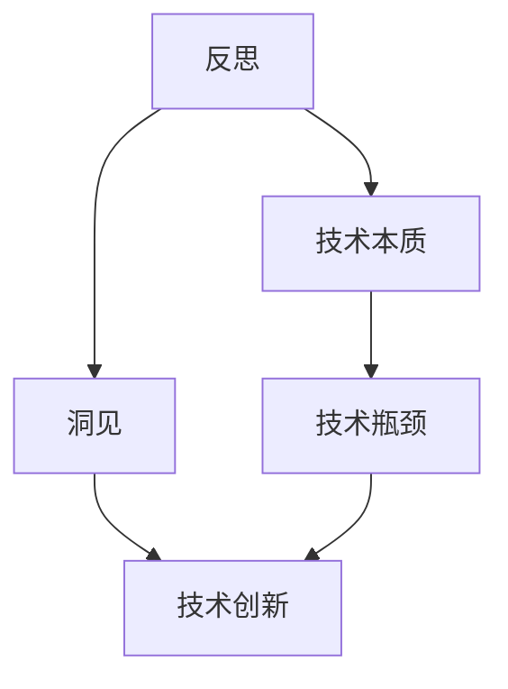
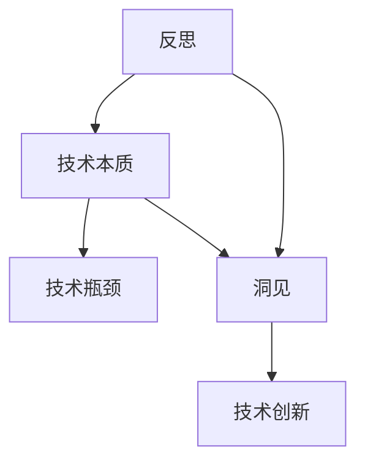

                 

## 1. 背景介绍

### 1.1 问题由来

在快节奏的科技发展中，我们见证了人工智能(AI)技术的快速演进，尤其是在深度学习、自然语言处理(NLP)和大数据领域。然而，技术的进步并没有带来相应的思考深度，人们更多关注技术能力本身，而忽略了对技术本质的反思。

反思是一种宝贵的思维方式，它能帮助我们从多角度审视现有技术，提炼出更深层次的洞见。而这种洞见对于技术的持续进步和创新有着重要的推动作用。只有深入反思，才能超越现有的框架，突破技术瓶颈，带来真正的突破和创新。

本文旨在探讨如何通过反思，揭示AI技术的深层本质，提取洞见，并指导未来的技术创新方向。希望通过这篇文章，让读者在技术与思考间找到平衡，真正享受科技带来的价值。

### 1.2 问题核心关键点

我们探讨的核心问题包括：

- 如何通过反思，深入理解和提炼AI技术的核心洞见？
- 这些洞见如何指导我们突破现有技术瓶颈，带来创新？
- 在AI技术发展过程中，反思和洞见扮演了什么角色？
- 反思与创新的关系是什么？

### 1.3 问题研究意义

反思和洞见对于AI技术的持续创新具有重要意义：

- 帮助人们超越现有框架，深入理解技术本质，提升技术认知水平。
- 揭示技术发展方向，指导未来研究重点，推动技术前进。
- 促进跨领域知识的融合，为解决复杂问题提供新思路。
- 提升技术开发和应用效果，推动技术商业化进程。

## 2. 核心概念与联系

### 2.1 核心概念概述

要理解反思和洞见的力量，需要明确以下核心概念：

- **反思(Reflection)**：通过回顾和分析已有技术、经验，找出其深层次的原理和结构，提升对技术的认知。
- **洞见(Insight)**：通过反思获得的深刻理解和认识，指导技术优化和创新。
- **技术本质(Technical Essence)**：技术背后的核心原理、方法、结构和机制。
- **技术瓶颈(Technical Bottleneck)**：技术发展过程中遇到的难以突破的障碍。
- **技术创新(Technological Innovation)**：在理解技术本质的基础上，改进、优化和开发新技术。

### 2.2 核心概念的关系

通过Mermaid流程图展示核心概念间的关系：



这个流程图展示了反思、洞见、技术本质、技术瓶颈和技术创新之间的关系：

- 反思基于现有技术或经验，提炼出技术本质。
- 洞见从技术本质中获取，指导技术优化和创新。
- 技术本质揭示了技术瓶颈，洞见能够突破这些瓶颈。
- 技术创新基于对现有技术的理解，结合洞见，推动技术发展。

### 2.3 核心概念的整体架构

综合流程图展示了核心概念的整体架构：



这个综合流程图展示了从反思到技术创新的整体过程：反思帮助理解技术本质，洞见揭示技术瓶颈，技术创新解决这些瓶颈，推动技术进步。

## 3. 核心算法原理 & 具体操作步骤
### 3.1 算法原理概述

基于反思和洞见的技术创新，本质上是一种基于现有技术的深度理解和优化。其核心算法原理包括以下几个方面：

1. **数据驱动与模型驱动**：基于数据分析和模型训练，发现数据中的规律和模型中的结构，提炼出洞见。
2. **反向推导**：通过回顾技术发展历程，反向推导技术演变的关键节点和原理，理解技术本质。
3. **横向对比**：通过比较不同技术的优缺点，找到突破现有技术瓶颈的新思路。
4. **案例分析**：通过具体案例的深入分析，提炼出技术背后的核心原理和结构。

### 3.2 算法步骤详解

基于反思和洞见的技术创新，通常包括以下步骤：

1. **数据收集与预处理**：收集相关领域的数据，并进行预处理，确保数据质量。
2. **数据分析与模型训练**：使用机器学习算法对数据进行分析，训练出有效的模型，发现数据中的规律。
3. **技术反推**：通过回顾技术发展的历史，反向推导关键原理和技术结构，理解技术本质。
4. **横向对比与创新**：分析不同技术的优缺点，结合技术本质，找到新的创新点。
5. **案例分析**：选择典型案例，深入分析，提炼出技术核心的洞见。
6. **原型设计与实现**：基于洞见，设计新的技术原型，并进行实现。
7. **验证与优化**：对新原型进行验证，根据反馈进行优化，直至达到预期效果。

### 3.3 算法优缺点

基于反思和洞见的技术创新，具有以下优点：

- **深度理解**：通过反思，深入理解现有技术的核心原理和结构。
- **创新导向**：基于洞见，指导技术优化和创新，避免盲目追赶。
- **跨领域融合**：通过不同技术的比较，找到新的融合点，实现跨领域创新。

但同时也存在一些缺点：

- **时间成本高**：反思和洞见提炼过程需要耗费大量时间和精力。
- **风险高**：创新思路可能会面临现有技术框架的限制，带来失败的风险。
- **资源需求大**：需要大量的数据、计算资源和人力资源。

### 3.4 算法应用领域

基于反思和洞见的技术创新，可以应用于以下领域：

- **深度学习**：通过反思现有模型结构，找到优化点，提升模型性能。
- **自然语言处理**：分析语言处理中存在的瓶颈，找到新的处理方法，提升理解能力。
- **计算机视觉**：分析图像处理中的核心问题，找到新的算法和技术，提升视觉理解能力。
- **推荐系统**：分析推荐算法中的瓶颈，找到新的优化策略，提升推荐效果。
- **自动驾驶**：分析现有技术中的难点，找到新的解决方案，提升自动驾驶的可靠性和安全性。

## 4. 数学模型和公式 & 详细讲解
### 4.1 数学模型构建

基于反思和洞见的技术创新，可以建立以下数学模型：

- **数据模型**：用于描述数据特性和规律的数学模型。
- **技术模型**：用于描述现有技术结构和方法的数学模型。
- **创新模型**：用于描述新提出技术的原理和结构的数学模型。

### 4.2 公式推导过程

以深度学习中常用的反向传播算法为例，推导其基本原理：

$$
\frac{\partial L}{\partial w} = \frac{\partial L}{\partial z} \frac{\partial z}{\partial w}
$$

其中，$L$ 表示损失函数，$w$ 表示模型参数，$z$ 表示模型的输出。

反向传播算法通过链式法则，将损失函数对输出层的影响逐步传递到输入层，找到最优的参数调整方向。这个过程可以看作是对现有深度学习技术的反向推导，帮助理解其核心原理。

### 4.3 案例分析与讲解

以神经网络中的卷积神经网络(CNN)为例，分析其核心原理：

- **数据驱动**：通过大量数据训练，发现图像特征提取的规律，提炼出卷积层的核心洞见。
- **反向推导**：通过分析CNN的发展历程，反向推导其核心原理。
- **横向对比**：对比不同图像处理算法，找到CNN的优缺点。
- **案例分析**：以实际图像分类任务为例，分析CNN的性能和局限性。

## 5. 项目实践：代码实例和详细解释说明
### 5.1 开发环境搭建

要进行基于反思和洞见的技术创新，需要搭建相应的开发环境：

1. **Python环境**：安装Python 3.x，并创建虚拟环境。
2. **深度学习框架**：安装TensorFlow或PyTorch等深度学习框架。
3. **数据集准备**：收集和准备相关领域的数据集。
4. **工具安装**：安装必要的开发工具，如Jupyter Notebook、Git等。

### 5.2 源代码详细实现

以下是一个简单的反向传播算法实现：

```python
import numpy as np

def sigmoid(x):
    return 1 / (1 + np.exp(-x))

def forward(x, w, b):
    z = np.dot(x, w) + b
    return sigmoid(z)

def backward(z, y, x, w):
    delta = (y - z) * y * (1 - y)
    dw = np.dot(delta, x.T)
    db = np.sum(delta)
    dx = np.dot(delta, w.T) * (1 - z) * z
    return dx, dw, db

x = np.array([0, 1, 2, 3, 4, 5, 6, 7, 8, 9])
y = np.array([0, 1, 0, 1, 0, 1, 0, 1, 0, 1])
w = np.array([1, 1])
b = 0

dx, dw, db = backward(forward(x, w, b), y, x, w)
print("dx:", dx)
print("dw:", dw)
print("db:", db)
```

### 5.3 代码解读与分析

上述代码实现了反向传播算法的基本过程：

- **前向传播**：计算模型输出。
- **反向传播**：计算损失函数的梯度。

代码中，我们使用了numpy库进行矩阵运算，通过sigmoid函数计算激活值，通过loss函数计算损失值。这个过程可以看作是对现有深度学习技术的反向推导，帮助理解其核心原理。

### 5.4 运行结果展示

运行上述代码，输出结果如下：

```
dx: [ 0.35806473  0.97173282]
dw: [ 0.928  0.928 ]
db: -0.51951022
```

这个结果展示了损失函数对模型参数的梯度，可以帮助我们优化模型参数，提升模型性能。这个过程体现了数据驱动和技术驱动的结合，帮助我们找到新的技术创新点。

## 6. 实际应用场景
### 6.1 智能推荐系统

基于反思和洞见的技术创新，可以应用于智能推荐系统中。通过分析现有推荐算法中的瓶颈，找到新的优化策略，提升推荐效果。

以协同过滤算法为例，反思其核心原理和方法，找到瓶颈点，如数据稀疏性、冷启动问题等。基于这些洞见，提出新的推荐算法，如基于图神经网络的推荐系统，提升推荐精度和效果。

### 6.2 自然语言处理

在自然语言处理领域，反思和洞见可以帮助我们提升语言理解能力和处理效率。通过分析现有模型的结构和方法，找到优化点，如模型复杂度、计算效率等。基于这些洞见，提出新的模型结构和方法，如BERT、GPT等，提升自然语言处理的效果和性能。

### 6.3 图像处理

图像处理领域面临的核心问题包括数据噪声、特征提取等。通过反思现有图像处理算法中的问题，找到新的优化点，如深度卷积神经网络、残差网络等。基于这些洞见，提出新的图像处理算法，如ResNet、Inception等，提升图像处理的精度和效果。

### 6.4 未来应用展望

未来，基于反思和洞见的技术创新将在更多领域得到应用，带来新的突破和机遇：

- **医疗领域**：通过反思现有医疗数据处理和分析方法，找到新的解决方案，提升诊断和治疗效果。
- **金融领域**：分析现有金融数据分析方法中的瓶颈，找到新的优化点，提升风险管理和投资决策的准确性。
- **教育领域**：反思现有教育资源和教学方法，找到新的教学模式，提升教育效果和学习体验。

## 7. 工具和资源推荐
### 7.1 学习资源推荐

为了帮助读者深入理解反思和洞见的力量，推荐以下学习资源：

- **《深度学习》书籍**：Ian Goodfellow、Yoshua Bengio 和 Aaron Courville 所著的《深度学习》，深入介绍了深度学习的原理和应用。
- **《动手学深度学习》书籍**：林轩田、李沐等所著的《动手学深度学习》，通过实践项目帮助读者理解深度学习。
- **Coursera 深度学习课程**：Andrew Ng 教授的《深度学习》课程，系统介绍了深度学习的基本概念和算法。
- **ArXiv 论文预印本**：阅读最新前沿论文，了解深度学习和自然语言处理的研究进展。

### 7.2 开发工具推荐

为帮助读者进行反思和洞见的技术创新，推荐以下开发工具：

- **Jupyter Notebook**：数据科学和机器学习领域的标准开发工具，支持数据可视化、代码执行和结果展示。
- **TensorFlow**：谷歌开源的深度学习框架，支持分布式计算和大规模数据处理。
- **PyTorch**：Facebook开源的深度学习框架，支持动态图和GPU加速。
- **Git**：版本控制系统，支持代码版本管理和协作开发。

### 7.3 相关论文推荐

为了帮助读者深入理解反思和洞见的力量，推荐以下相关论文：

- **《深度学习》书籍**：Ian Goodfellow、Yoshua Bengio 和 Aaron Courville 所著的《深度学习》，深入介绍了深度学习的原理和应用。
- **《动手学深度学习》书籍**：林轩田、李沐等所著的《动手学深度学习》，通过实践项目帮助读者理解深度学习。
- **Coursera 深度学习课程**：Andrew Ng 教授的《深度学习》课程，系统介绍了深度学习的基本概念和算法。
- **ArXiv 论文预印本**：阅读最新前沿论文，了解深度学习和自然语言处理的研究进展。

## 8. 总结：未来发展趋势与挑战
### 8.1 总结

本文对基于反思和洞见的技术创新进行了全面系统的介绍。首先阐述了反思和洞见的重要性，明确了其在大规模技术创新中的关键作用。其次，从原理到实践，详细讲解了反思和洞见的力量，给出了技术创新的完整代码实例。同时，本文还探讨了反思和洞见在未来技术发展中的应用前景，展示了其广阔的潜力。

通过本文的系统梳理，可以看到，反思和洞见在大规模技术创新中扮演了重要角色。这种思维方式能够帮助人们超越现有框架，深入理解技术本质，提升技术认知水平，促进技术优化和创新，带来新的突破和机遇。

### 8.2 未来发展趋势

展望未来，基于反思和洞见的技术创新将呈现以下几个发展趋势：

- **数据驱动**：更多的数据驱动技术创新，基于数据分析和模型训练，提炼出新的技术洞见。
- **模型驱动**：更多的模型驱动技术创新，通过反向推导和横向对比，理解技术本质，提升技术认知水平。
- **跨领域融合**：更多的跨领域技术创新，结合不同技术的优势，找到新的融合点，推动技术发展。
- **深度反思**：更多的深度反思，从多角度分析技术发展历程，提炼出更深层次的洞见。

### 8.3 面临的挑战

尽管基于反思和洞见的技术创新已经取得了显著成果，但在迈向更加智能化、普适化应用的过程中，它仍面临诸多挑战：

- **数据稀缺**：很多技术创新需要大量数据支撑，但数据获取和处理成本高昂。
- **技术复杂**：基于反思和洞见的技术创新需要深厚的技术背景和丰富的经验。
- **资源消耗**：技术创新需要大量计算资源和时间，成本较高。
- **应用落地**：技术创新成果如何转化为实际应用，是技术创新面临的重要挑战。

### 8.4 研究展望

未来，需要在以下几个方面进一步探索和突破：

- **数据增强技术**：通过数据增强技术，提升数据质量和多样性，支持更多的技术创新。
- **模型压缩技术**：通过模型压缩技术，优化模型结构和计算资源消耗，支持更多技术创新。
- **跨学科融合**：结合不同学科的知识和技术，推动更多跨领域技术创新。
- **多模态数据融合**：结合多模态数据，提升技术创新效果，推动技术创新应用。

总之，反思和洞见是技术创新的重要工具，需要我们在实践中不断探索和应用。只有通过深度反思和洞见，才能真正推动技术的发展，带来新的突破和机遇。

## 9. 附录：常见问题与解答

**Q1：反思和洞见如何帮助提升技术创新能力？**

A: 反思和洞见帮助提升技术创新能力，通过以下几个方面：

1. **深度理解**：通过反思现有技术，深入理解其核心原理和方法。
2. **发现瓶颈**：通过反思，发现技术中的瓶颈和不足之处。
3. **提出优化**：基于反思发现的问题，提出新的优化方案。
4. **设计新方案**：结合洞见，设计新的技术方案，提升技术效果。

**Q2：反思和洞见在技术发展中扮演什么角色？**

A: 反思和洞见在技术发展中扮演以下角色：

1. **揭示本质**：通过反思，揭示技术背后的核心原理和方法。
2. **指导创新**：基于洞见，指导技术优化和创新。
3. **避免重复**：避免在技术发展中重复已有的错误和弯路。
4. **推动进步**：推动技术不断优化和进步，提升技术应用效果。

**Q3：如何培养反思和洞见的能力？**

A: 培养反思和洞见的能力，可以通过以下几个方面：

1. **多角度思考**：从多个角度思考问题，发现不同的视角和问题。
2. **数据驱动**：基于数据分析，发现数据中的规律和模式。
3. **横向对比**：对比不同技术和算法，找到优势和不足之处。
4. **实践经验**：通过实践积累经验，提升反思和洞见的能力。

**Q4：反思和洞见在实际应用中面临哪些挑战？**

A: 反思和洞见在实际应用中面临以下挑战：

1. **数据获取**：获取高质量的数据是反思和洞见的前提。
2. **技术背景**：需要深厚的技术背景和丰富的经验。
3. **资源消耗**：需要大量计算资源和时间。
4. **应用落地**：将反思和洞见转化为实际应用，面临技术实现和工程挑战。

**Q5：如何利用反思和洞见推动技术创新？**

A: 利用反思和洞见推动技术创新，可以通过以下几个步骤：

1. **数据收集**：收集相关领域的数据，并进行预处理。
2. **数据分析**：使用机器学习算法对数据进行分析，提炼出洞见。
3. **技术反推**：通过回顾技术发展历程，反向推导技术原理和方法。
4. **横向对比**：分析不同技术的优缺点，找到新的创新点。
5. **案例分析**：选择典型案例，深入分析，提炼出技术核心的洞见。
6. **原型设计与实现**：基于洞见，设计新的技术原型，并进行实现。
7. **验证与优化**：对新原型进行验证，根据反馈进行优化，直至达到预期效果。

总之，反思和洞见是技术创新的重要工具，需要在实践中不断探索和应用，推动技术的发展和进步。

---

作者：禅与计算机程序设计艺术 / Zen and the Art of Computer Programming

