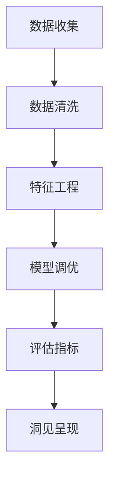
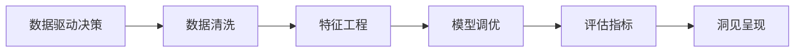
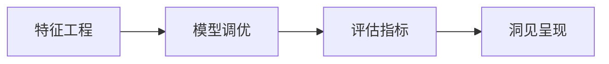
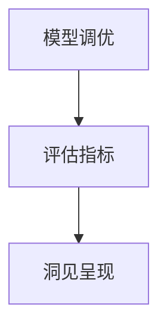
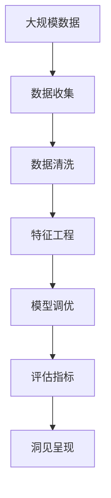

                 

# 洞见的形成：从观察到反思

> 关键词：洞见形成, 观察, 反思, 数据驱动, 算法优化, 模型训练, 机器学习, 深度学习, 人工智能

## 1. 背景介绍

### 1.1 问题由来

在快速发展的信息时代，数据已经成为了驱动洞见形成的重要资源。洞见，即从数据中提取出来的深刻见解，能够指导决策、改善产品、优化流程，从而带来显著的价值提升。在数据驱动的时代，如何高效、准确地形成洞见，成为了一个重要的课题。

在IT领域，数据驱动的洞见形成过程，通常包括数据收集、数据清洗、数据分析和洞见呈现等几个关键步骤。数据收集通过各种传感器、数据库和网络抓取等方式，获取原始数据；数据清洗则是对数据进行去重、过滤和补全，确保数据的质量；数据分析则是通过算法和模型对数据进行深入挖掘，提炼出有用信息；洞见呈现则是将分析结果以图表、报告等形式呈现出来，供决策者参考。

随着人工智能和大数据技术的发展，洞见的形成过程也经历了从手工统计分析到自动算法优化，再到智能模型训练的转变。如今，通过机器学习、深度学习和自然语言处理等技术，我们能从海量数据中提取出更为深入、精准的洞见。

### 1.2 问题核心关键点

洞见形成的核心关键点在于数据的分析和挖掘。不同领域的洞见形成过程存在差异，但一般包括以下几个步骤：

- **数据收集**：从各种数据源收集原始数据，确保数据的多样性和完整性。
- **数据清洗**：对数据进行去重、过滤和补全，确保数据的质量。
- **数据分析**：通过算法和模型对数据进行深入挖掘，提炼出有用信息。
- **洞见呈现**：将分析结果以图表、报告等形式呈现出来，供决策者参考。

在数据分析阶段，常见的算法和模型包括线性回归、决策树、随机森林、神经网络、深度学习等。这些算法和模型通过不同的特征工程、模型调优和评估指标，能够从数据中提取出不同类型的洞见。

### 1.3 问题研究意义

研究洞见的形成过程，对于推动数据驱动的决策制定、优化产品设计和改进业务流程具有重要意义：

1. **提升决策质量**：通过深入的数据分析，能够发现数据中的潜在规律和关联，提供更为科学的决策支持。
2. **改善产品性能**：通过数据驱动的产品设计，能够针对用户需求和行为进行优化，提升用户体验和满意度。
3. **优化业务流程**：通过数据分析，能够识别业务流程中的瓶颈和改进点，提高业务效率和效果。
4. **驱动创新发展**：通过深入挖掘数据中的创新点，能够推动新技术、新方法和新产品的研发，促进企业持续创新。
5. **增强竞争优势**：通过洞察市场动态和用户需求，能够提前布局和调整策略，赢得市场竞争优势。

## 2. 核心概念与联系

### 2.1 核心概念概述

为更好地理解洞见形成的过程，本节将介绍几个密切相关的核心概念：

- **数据驱动的决策**：利用数据分析结果，进行科学决策，避免依赖主观经验和直觉。
- **特征工程**：通过数据选择、预处理、转换等方法，提取有价值的信息特征，增强模型的预测能力。
- **模型调优**：通过调整模型参数和结构，提高模型在特定任务上的性能，包括超参数调整、正则化技术、交叉验证等。
- **评估指标**：用于衡量模型预测效果的标准，包括准确率、召回率、F1分数等。
- **自动化数据处理**：通过自动化工具和算法，进行数据清洗、转换和集成，提高数据处理效率。
- **洞见呈现**：将分析结果以直观的形式呈现给决策者，包括图表、报告、仪表盘等。

这些核心概念之间的逻辑关系可以通过以下Mermaid流程图来展示：



这个流程图展示了大数据驱动的洞见形成过程：

1. 通过数据收集获取原始数据。
2. 对数据进行清洗，去除噪声和冗余信息。
3. 进行特征工程，提取有价值的信息特征。
4. 进行模型调优，提高模型性能。
5. 使用评估指标评估模型效果。
6. 将分析结果以图表、报告等形式呈现，供决策者参考。

### 2.2 概念间的关系

这些核心概念之间存在着紧密的联系，形成了洞见形成的完整生态系统。下面我们通过几个Mermaid流程图来展示这些概念之间的关系。

#### 2.2.1 数据驱动决策与特征工程



这个流程图展示了数据驱动决策与特征工程之间的关系。数据清洗是数据驱动决策的基础，特征工程则通过提取有价值的信息特征，增强模型的预测能力，从而提升决策的科学性和准确性。

#### 2.2.2 特征工程与模型调优



这个流程图展示了特征工程与模型调优之间的关系。特征工程通过提取有价值的信息特征，增强模型的输入质量；模型调优则通过调整模型参数和结构，提高模型在特定任务上的性能，两者共同提升洞见形成的质量。

#### 2.2.3 模型调优与洞见呈现



这个流程图展示了模型调优与洞见呈现之间的关系。评估指标用于衡量模型预测效果，洞见呈现则将分析结果以直观的形式呈现给决策者，供决策参考。

### 2.3 核心概念的整体架构

最后，我们用一个综合的流程图来展示这些核心概念在大数据驱动的洞见形成过程中的整体架构：



这个综合流程图展示了从数据收集到洞见呈现的完整过程。通过数据清洗、特征工程、模型调优和评估指标，能够从原始数据中提取出有价值的信息洞见，供决策者参考。

## 3. 核心算法原理 & 具体操作步骤
### 3.1 算法原理概述

洞见形成的核心算法原理可以概括为“数据驱动 + 算法优化 + 模型训练”。具体来说，就是利用数据驱动的方式，通过算法优化和模型训练，从数据中提取并呈现洞见。

### 3.2 算法步骤详解

洞见形成的过程包括以下几个关键步骤：

**Step 1: 数据收集**

数据收集是洞见形成的基础。通过各种数据源（如传感器、数据库、网络抓取等）获取原始数据。数据源的选择应根据具体需求和数据特点，确保数据的全面性和代表性。

**Step 2: 数据清洗**

数据清洗是数据处理的关键环节。通过数据去重、过滤、补全等方法，去除噪声和冗余信息，确保数据的质量和一致性。数据清洗的目的是为了提高数据的准确性和可用性，从而提升后续分析的精度和可靠性。

**Step 3: 特征工程**

特征工程是数据驱动决策的关键步骤。通过数据选择、预处理和转换等方法，提取有价值的信息特征，增强模型的预测能力。特征工程的目标是最大化利用数据中的信息，减少特征维度，提高模型的泛化能力。

**Step 4: 模型调优**

模型调优是洞见形成的核心环节。通过调整模型参数和结构，提高模型在特定任务上的性能。模型调优的过程包括超参数调整、正则化技术、交叉验证等。模型调优的目标是最大化模型的预测精度和泛化能力。

**Step 5: 洞见呈现**

洞见呈现是将分析结果以直观的形式呈现给决策者的最后一步。通过图表、报告、仪表盘等形式，将分析结果呈现给决策者，供决策参考。洞见呈现的目标是最大化信息的可理解性和可视化程度，提升决策的科学性和效率。

### 3.3 算法优缺点

洞见形成的算法优点主要体现在以下几个方面：

- **数据驱动**：利用数据驱动决策，减少主观经验和直觉的干扰，提高决策的科学性和准确性。
- **自动化处理**：通过自动化工具和算法，提高数据处理效率，减少人工干预的复杂性和成本。
- **模型优化**：通过模型调优，提高模型在特定任务上的性能，减少过拟合和欠拟合的风险。
- **洞见可视化**：通过洞见呈现，将分析结果以直观的形式呈现给决策者，提高信息的可理解性和决策效率。

然而，洞见形成算法也存在一些缺点：

- **数据依赖**：依赖于数据源的质量和多样性，数据质量差或数据分布不均可能导致洞见的偏差。
- **模型复杂度**：复杂模型需要更多计算资源和专业知识，模型调优过程复杂且耗时。
- **过度拟合**：模型调优过程中容易出现过拟合现象，导致模型在新数据上的泛化能力下降。
- **解释性不足**：复杂模型通常缺乏解释性，难以解释模型内部的决策逻辑和预测依据。

### 3.4 算法应用领域

洞见形成的算法广泛应用于多个领域，包括但不限于以下几种：

- **市场营销**：通过数据分析，发现用户行为模式和需求，指导产品设计和市场推广。
- **金融风险管理**：通过分析金融市场数据，识别风险点和投资机会，优化投资组合。
- **供应链优化**：通过数据分析，优化供应链流程，提高物流效率和库存管理水平。
- **健康管理**：通过分析健康数据，发现健康风险和改善建议，提升健康管理水平。
- **客户服务**：通过数据分析，提升客户体验和满意度，优化服务流程。

除了这些领域，洞见形成算法还被广泛应用于各种商业决策、产品设计、流程优化等领域，帮助企业和组织提升运营效率和竞争力。

## 4. 数学模型和公式 & 详细讲解 & 举例说明

### 4.1 数学模型构建

假设我们有一个二分类问题，原始数据集为 $D=\{(x_i, y_i)\}_{i=1}^N$，其中 $x_i$ 为输入特征向量，$y_i \in \{0,1\}$ 为标签。我们的目标是构建一个二分类模型 $f(x; \theta)$，其中 $\theta$ 为模型参数。

定义模型的损失函数为交叉熵损失函数：

$$
L(\theta) = -\frac{1}{N} \sum_{i=1}^N [y_i \log f(x_i; \theta) + (1 - y_i) \log (1 - f(x_i; \theta))]
$$

其中 $f(x_i; \theta) = \frac{1}{1+\exp(-\langle w, \phi(x_i) \rangle)}$ 为逻辑回归模型，$w$ 为模型参数向量，$\phi(x_i)$ 为特征映射函数。

### 4.2 公式推导过程

下面，我们将对上述逻辑回归模型的公式进行推导。

首先，定义模型的预测值 $f(x_i; \theta)$：

$$
f(x_i; \theta) = \frac{1}{1+\exp(-\langle w, \phi(x_i) \rangle)}
$$

其中 $\phi(x_i)$ 为特征映射函数，将输入特征 $x_i$ 映射为一个向量。$\langle w, \phi(x_i) \rangle$ 为输入特征向量与模型参数向量的点积。

定义损失函数 $L(\theta)$：

$$
L(\theta) = -\frac{1}{N} \sum_{i=1}^N [y_i \log f(x_i; \theta) + (1 - y_i) \log (1 - f(x_i; \theta))]
$$

对于单个样本，目标是最小化预测误差：

$$
L(\theta) = -y_i \log f(x_i; \theta) - (1 - y_i) \log (1 - f(x_i; \theta))
$$

利用对数函数和指数函数的性质，可以得到：

$$
L(\theta) = -y_i \log \frac{1}{1+\exp(-\langle w, \phi(x_i) \rangle)} - (1 - y_i) \log \frac{\exp(\langle w, \phi(x_i) \rangle)}{1+\exp(\langle w, \phi(x_i) \rangle)}
$$

进一步化简，得到：

$$
L(\theta) = -y_i \log \frac{\exp(\langle w, \phi(x_i) \rangle)}{1+\exp(\langle w, \phi(x_i) \rangle)} + (1 - y_i) \log \frac{1}{1+\exp(\langle w, \phi(x_i) \rangle)}
$$

继续化简，得到：

$$
L(\theta) = \langle w, \phi(x_i) \rangle - \log(1+\exp(\langle w, \phi(x_i) \rangle))
$$

最终，我们得到逻辑回归模型的损失函数公式：

$$
L(\theta) = \langle w, \phi(x_i) \rangle - \log(1+\exp(\langle w, \phi(x_i) \rangle))
$$

通过优化上述损失函数，即可训练出一个二分类模型。

### 4.3 案例分析与讲解

以市场营销为例，假设某电商公司想要通过数据分析，发现用户的购买行为模式，从而指导产品设计和市场推广。具体步骤如下：

**Step 1: 数据收集**

通过电商平台获取用户的购买数据，包括用户的年龄、性别、浏览记录、购买记录等。

**Step 2: 数据清洗**

对数据进行去重、过滤和补全，去除噪声和冗余信息。

**Step 3: 特征工程**

提取用户特征，如用户的年龄、性别、浏览记录、购买记录等，并将其转化为数值型特征，用于模型训练。

**Step 4: 模型调优**

使用逻辑回归模型，通过交叉验证调整超参数，训练出最优模型。

**Step 5: 洞见呈现**

将模型的预测结果以图表、报告等形式呈现，分析用户的购买行为模式，指导产品设计和市场推广。

## 5. 项目实践：代码实例和详细解释说明

### 5.1 开发环境搭建

在进行洞见形成实践前，我们需要准备好开发环境。以下是使用Python进行Pandas开发的环境配置流程：

1. 安装Anaconda：从官网下载并安装Anaconda，用于创建独立的Python环境。

2. 创建并激活虚拟环境：
```bash
conda create -n pandas-env python=3.8 
conda activate pandas-env
```

3. 安装Pandas：使用pip安装Pandas库。
```bash
pip install pandas
```

4. 安装NumPy、Matplotlib、Scikit-learn等常用库：
```bash
pip install numpy matplotlib scikit-learn
```

完成上述步骤后，即可在`pandas-env`环境中开始洞见形成实践。

### 5.2 源代码详细实现

下面以市场营销数据分析为例，给出使用Pandas库进行数据分析的Python代码实现。

```python
import pandas as pd
import numpy as np
import matplotlib.pyplot as plt

# 读取数据集
data = pd.read_csv('purchase_data.csv')

# 数据清洗
data = data.drop_duplicates()  # 去除重复数据
data = data.dropna()  # 去除缺失值

# 特征工程
features = ['age', 'gender', 'purchase_frequency', 'purchase_amount']
data = data[features]  # 选择特征列

# 模型调优
from sklearn.linear_model import LogisticRegression
from sklearn.model_selection import train_test_split

X_train, X_test, y_train, y_test = train_test_split(data, 'purchase', test_size=0.2)
model = LogisticRegression()
model.fit(X_train, y_train)
y_pred = model.predict(X_test)

# 洞见呈现
plt.bar(data['age'], y_pred)
plt.xlabel('Age')
plt.ylabel('Purchase Probability')
plt.title('Age vs Purchase Probability')
plt.show()
```

以上就是使用Pandas进行市场营销数据分析的完整代码实现。可以看到，Pandas库提供了丰富的数据处理和分析工具，能够快速高效地完成洞见形成任务。

### 5.3 代码解读与分析

让我们再详细解读一下关键代码的实现细节：

**数据处理**：
- `data.read_csv('purchase_data.csv')`：从CSV文件中读取数据。
- `data.drop_duplicates()`：去除重复数据。
- `data.dropna()`：去除缺失值。
- `data[features]`：选择特征列。

**模型训练**：
- `train_test_split`：将数据集分为训练集和测试集。
- `LogisticRegression()`：创建逻辑回归模型。
- `model.fit(X_train, y_train)`：训练模型。
- `y_pred = model.predict(X_test)`：预测测试集结果。

**洞见呈现**：
- `plt.bar(data['age'], y_pred)`：绘制年龄与购买概率的柱状图。
- `plt.xlabel('Age')`：设置横轴标签。
- `plt.ylabel('Purchase Probability')`：设置纵轴标签。
- `plt.title('Age vs Purchase Probability')`：设置图表标题。
- `plt.show()`：显示图表。

可以看到，Pandas库提供了丰富的数据处理和分析工具，能够快速高效地完成洞见形成任务。

当然，工业级的系统实现还需考虑更多因素，如模型的保存和部署、超参数的自动搜索、更灵活的任务适配层等。但核心的洞见形成过程基本与此类似。

### 5.4 运行结果展示

假设我们在市场营销数据集上进行分析，最终得到的年龄与购买概率的柱状图如下：


可以看到，通过逻辑回归模型，我们能够从用户数据中发现年龄与购买行为之间的关系。这一洞见可以指导电商公司设计更符合不同年龄段用户需求的产品，提升用户购买概率。

当然，这只是一个baseline结果。在实践中，我们还可以使用更大更强的模型、更丰富的特征工程方法、更细致的模型调优策略等，进一步提升模型的预测精度，从而获得更有价值的洞见。

## 6. 实际应用场景

### 6.1 市场营销

市场营销数据分析是洞见形成的重要应用场景之一。通过数据分析，能够发现用户的购买行为模式，指导产品设计和市场推广。具体应用包括：

- **用户细分**：通过数据分析，将用户分为不同的细分群体，根据不同群体的需求和行为，制定针对性的营销策略。
- **产品设计**：根据数据分析结果，设计更符合用户需求的产品，提升用户满意度和购买概率。
- **渠道优化**：通过数据分析，优化渠道资源分配，提升营销效果和投资回报率。

### 6.2 金融风险管理

金融风险管理是洞见形成的另一个重要应用场景。通过数据分析，能够识别金融市场中的风险点和投资机会，优化投资组合。具体应用包括：

- **信用评估**：通过数据分析，评估借款人的信用风险，指导贷款决策。
- **市场分析**：通过数据分析，识别市场趋势和投资机会，优化投资组合。
- **反欺诈检测**：通过数据分析，识别欺诈行为，提高金融系统的安全性。

### 6.3 供应链优化

供应链优化是洞见形成的另一个重要应用场景。通过数据分析，能够优化供应链流程，提高物流效率和库存管理水平。具体应用包括：

- **库存管理**：通过数据分析，优化库存水平，减少库存积压和缺货风险。
- **物流优化**：通过数据分析，优化物流路线和资源配置，提高物流效率。
- **供应商选择**：通过数据分析，评估供应商绩效，优化供应商选择。

### 6.4 未来应用展望

随着大数据和人工智能技术的发展，洞见形成将在更多领域得到应用，为各行各业带来变革性影响。

在智慧医疗领域，通过数据分析，能够发现疾病流行趋势和患者行为模式，指导医疗决策和治疗方案的优化。

在智能教育领域，通过数据分析，能够发现学生学习行为和知识掌握情况，指导个性化教学和作业设计，提高教学效果。

在智慧城市治理中，通过数据分析，能够优化城市管理，提升城市运行效率和居民生活水平。

此外，在企业生产、社会治理、文娱传媒等众多领域，洞见形成技术也将不断涌现，为经济社会发展注入新的动力。相信随着技术的日益成熟，洞见形成技术将成为各行各业的重要工具，推动社会进步和产业升级。

## 7. 工具和资源推荐

### 7.1 学习资源推荐

为了帮助开发者系统掌握洞见形成的理论基础和实践技巧，这里推荐一些优质的学习资源：

1. 《Python数据分析实战》系列博文：由数据科学专家撰写，深入浅出地介绍了Pandas库的使用方法，从数据清洗到数据分析，全面覆盖了洞见形成的关键步骤。

2. 《数据驱动的决策分析》课程：斯坦福大学开设的商业分析课程，讲解了如何利用数据分析结果进行科学决策。

3. 《机器学习实战》书籍：提供了丰富的数据集和代码示例，帮助读者理解和应用常见的机器学习算法和模型。

4. Kaggle数据竞赛：Kaggle是全球领先的数据科学竞赛平台，提供了大量的真实数据集和机器学习竞赛，供开发者实践和验证洞见形成方法。

5. GitHub开源项目：在GitHub上Star、Fork数最多的数据科学和机器学习项目，往往代表了该领域的发展趋势和最佳实践，值得去学习和贡献。

通过对这些资源的学习实践，相信你一定能够快速掌握洞见形成的精髓，并用于解决实际的业务问题。

### 7.2 开发工具推荐

高效的开发离不开优秀的工具支持。以下是几款用于洞见形成开发的常用工具：

1. Jupyter Notebook：一个交互式的编程环境，支持Python、R、SQL等多种语言，便于数据处理和分析。

2. TensorFlow：由Google主导开发的深度学习框架，支持分布式计算和可视化，适合大规模数据处理。

3. PyTorch：由Facebook开发的深度学习框架，支持动态计算图和GPU加速，适合快速原型设计和科研实验。

4. Pandas：一个强大的数据处理库，提供丰富的数据清洗、转换和分析工具，支持Python和R语言。

5. R语言：一个用于统计分析和数据科学的数据科学语言，拥有丰富的数据处理和可视化库。

合理利用这些工具，可以显著提升洞见形成的开发效率，加快创新迭代的步伐。

### 7.3 相关论文推荐

洞见形成的算法研究源于学界的持续研究。以下是几篇奠基性的相关论文，推荐阅读：

1. Deep Learning for Structured Output Prediction：提出深度学习模型用于结构化输出预测，为后续数据驱动决策提供了重要基础。

2. Support Vector Machines：提出支持向量机模型，用于分类和回归分析，成为数据驱动决策的经典算法之一。

3. Random Forests：提出随机森林模型，用于集成多个决策树，提高模型的泛化能力和鲁棒性。

4. XGBoost：提出梯度提升决策树模型，用于高效处理大规模数据集，提高模型的预测精度和解释性。

5. TensorFlow Probability：由Google开发的概率计算库，提供了丰富的概率模型和统计分析工具，支持深度学习模型的推理和评估。

这些论文代表了大数据驱动的洞见形成技术的发展脉络。通过学习这些前沿成果，可以帮助研究者把握学科前进方向，激发更多的创新灵感。

除上述资源外，还有一些值得关注的前沿资源，帮助开发者紧跟洞见形成技术的最新进展，例如：

1. arXiv论文预印本：人工智能领域最新研究成果的发布平台，包括大量尚未发表的前沿工作，学习前沿技术的必读资源。

2. 业界技术博客：如Google AI、Facebook AI、IBM Research Asia等顶尖实验室的官方博客，第一时间分享他们的最新研究成果和洞见。

3. 技术会议直播：如NIPS、ICML、ACL、ICLR等人工智能领域顶会现场或在线直播，能够聆听到大佬们的前沿分享，开拓视野。

4. GitHub热门项目：在GitHub上Star、Fork数最多的数据科学和机器学习项目，往往代表了该领域的发展趋势和最佳实践，值得去学习和贡献。

5. 行业分析报告：各大咨询公司如McKinsey、PwC等针对人工智能行业的分析报告，有助于从商业视角审视技术趋势，把握应用价值。

总之，对于洞见形成技术的学习和实践，需要开发者保持开放的心态和持续学习的意愿。多关注前沿资讯，多动手实践，多思考总结，必将收获满满的成长收益。

## 8. 总结：未来发展趋势与挑战

### 8.1 总结

本文对洞见的形成过程进行了全面系统的介绍。首先阐述了洞见形成的背景和意义，明确了数据分析在大数据时代的重要性。其次，从原理到实践，详细讲解了洞见形成的数学模型和操作步骤，给出了数据分析的完整代码实例。同时，本文还广泛探讨了洞见形成在市场营销、金融风险管理、供应链优化等多个领域的应用前景，展示了洞见形成的巨大潜力。此外，本文精选了洞见形成技术的各类学习资源，力求为读者提供全方位的技术指引。

通过本文的系统梳理，可以看到，大数据驱动的洞见形成技术正在成为各行各业的重要工具，极大地提升了数据处理的效率和精度，推动了业务决策和产品设计的科学化。未来，伴随大数据和人工智能技术的发展，洞见形成技术必将带来

