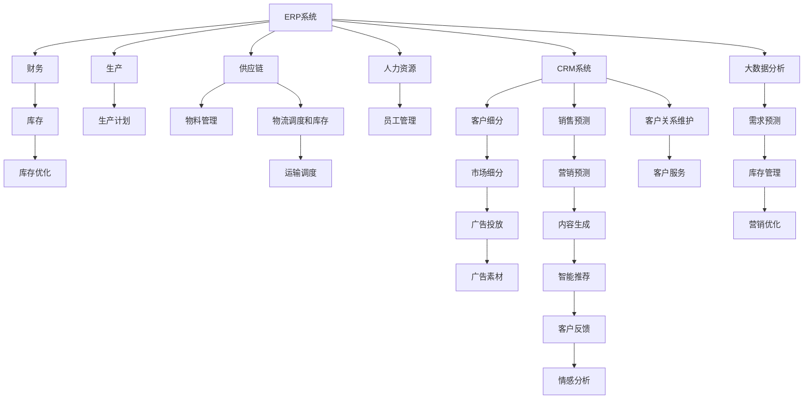

                 

# 消费品行业从业经验分享

> 关键词：
消费品管理, 供应链优化, 市场营销, 数据分析, 机器学习, 人工智能, 零售运营

## 1. 背景介绍

### 1.1 行业概况
消费品行业是全球最大的经济体之一，覆盖了食品饮料、日用品、家居用品、化妆品、个人护理、服装鞋帽等多个领域。随着数字化转型的推进，消费品行业逐步向智能制造、精准营销、个性化服务转型，催生了大量新兴应用场景，也带来了巨大发展机遇。

### 1.2 从业经历
作为一名长期在消费品行业深耕的技术专家，我深感这个行业的多变和复杂。从早期接触ERP、WMS、CRM等传统业务系统，到后来深入机器学习、自然语言处理、计算机视觉等前沿技术，我对消费品行业的认知不断深化，积累了很多宝贵的实战经验。

### 1.3 问题由来
随着技术进步和市场需求的变化，消费品行业的数据量越来越大，业务流程也变得越来越复杂。如何利用先进技术提高运营效率、优化库存管理、提升用户体验，成为我每日思考的核心问题。

## 2. 核心概念与联系

### 2.1 核心概念概述

为了更好地理解在消费品行业的从业经验，本节将介绍几个密切相关的核心概念：

- **ERP系统**：企业资源计划系统，通过集成财务、生产、供应链、人力资源等多个模块，实现企业各项业务的高效协同。
- **WMS系统**：仓库管理系统，通过仓库内部的信息流通和作业控制，提高仓库管理和物料调度的效率。
- **CRM系统**：客户关系管理系统，用于收集和分析客户信息，提升客户关系维护和销售转化率。
- **供应链优化**：通过预测需求、库存优化、运输调度和供应商协同等措施，降低成本，提升供应链的整体效率。
- **市场营销自动化**：利用AI和机器学习技术，自动化客户细分、市场预测、内容生成和广告投放，提升市场营销效果。
- **大数据分析**：通过挖掘消费行为数据、市场趋势数据、用户反馈数据，为产品研发、库存管理和营销策略提供决策支持。
- **自然语言处理(NLP)**：用于解析和理解自然语言文本，支持智能客服、推荐系统、情感分析等应用。
- **计算机视觉(CV)**：用于图像和视频内容的分析和识别，支持产品检测、客户行为分析、营销素材生成等。

这些核心概念在消费品行业的应用紧密相连，共同构成了智能化运营的基础框架。

### 2.2 概念间的关系

这些核心概念之间的关系可以通过以下Mermaid流程图来展示：



这个流程图展示了这个核心概念的总体框架，从ERP系统出发，通过供应链、生产、销售等多个环节，利用大数据分析和AI技术，最终支撑市场营销、客户关系管理等功能的实现。

## 3. 核心算法原理 & 具体操作步骤
### 3.1 算法原理概述

在消费品行业的应用中，算法的核心思想是通过数据驱动决策，优化运营流程。以下是几种典型的算法原理：

- **需求预测**：通过历史销售数据和市场趋势数据，利用时间序列分析、回归分析等方法，预测未来的需求量，从而指导库存管理和采购计划。
- **库存优化**：基于需求预测结果，通过动态调整库存水平，平衡库存成本和缺货风险，实现最优库存策略。
- **供应商协同**：利用供应链网络分析、运输优化算法，最小化运输成本，优化供应链的物流和库存管理。
- **市场营销自动化**：通过客户行为分析、市场细分、内容生成等技术，实现精准营销，提升广告投放效果和客户转化率。
- **情感分析**：通过自然语言处理技术，分析客户反馈和评论，了解消费者对产品的满意度，优化产品和服务。

### 3.2 算法步骤详解

#### 需求预测

**步骤1: 数据收集和预处理**
- 收集历史销售数据、市场趋势数据、节假日数据、促销活动数据等。
- 清洗和整合数据，去除缺失值和异常值，生成时间序列数据。

**步骤2: 特征工程**
- 构造滞后项特征、季节性特征、节假日特征、促销特征等，增强模型的预测能力。
- 应用特征选择方法，如Lasso回归、特征重要性评分等，剔除无关特征，提升模型效率。

**步骤3: 模型选择与训练**
- 选择合适的时间序列模型，如ARIMA、SARIMA、LSTM等。
- 利用历史数据进行模型训练，调整模型参数，评估模型性能。

**步骤4: 模型应用与迭代**
- 在实时数据上应用模型进行需求预测。
- 定期回测模型的预测结果，通过调整模型参数、引入新特征等方式，提升预测准确度。

#### 库存优化

**步骤1: 需求预测**
- 同上文需求预测步骤，通过历史销售数据和市场趋势数据，预测未来的需求量。

**步骤2: 库存模型**
- 根据需求预测结果，计算最优库存水平，考虑成本、缺货成本等因素，确定经济订货批量(EOQ)或动态库存模型(DIQ)。

**步骤3: 库存调整**
- 根据预测需求和库存模型，实时调整库存水平，防止库存过剩或短缺。
- 应用先进算法，如遗传算法、蚁群优化等，寻找最优库存策略。

**步骤4: 库存监控与反馈**
- 实时监控库存水平，通过可视化工具展示库存状态。
- 定期评估库存策略效果，收集反馈意见，优化库存模型。

#### 供应商协同

**步骤1: 供应链网络分析**
- 建立供应链网络图，包括供应商、制造商、物流公司等节点。
- 分析供应链网络结构，识别关键节点和瓶颈，确定协同优化方向。

**步骤2: 运输调度和优化**
- 利用运输优化算法，如Dijkstra算法、A*算法等，规划最优运输路径。
- 应用动态规划、线性规划等方法，优化运输调度和库存管理。

**步骤3: 供应商绩效评估**
- 定期评估供应商的供货准时率、质量合格率、交货成本等指标。
- 应用决策树、随机森林等算法，预测供应商绩效，优化供应商选择。

**步骤4: 供应商协同与反馈**
- 实时调整供应链运作，协同供应商共同优化物流和库存管理。
- 通过供应链平台，定期反馈供应商绩效，进行持续优化。

#### 市场营销自动化

**步骤1: 客户细分**
- 利用聚类算法，如K-means、层次聚类等，将客户细分成不同的群体。
- 分析客户特征，如年龄、性别、购买频率、消费金额等，识别不同细分群体的特征。

**步骤2: 市场预测**
- 利用历史销售数据、市场趋势数据、广告投放数据等，预测市场需求和客户行为。
- 应用机器学习模型，如随机森林、神经网络等，提高预测准确度。

**步骤3: 内容生成与投放**
- 基于客户细分和市场预测结果，生成个性化营销内容。
- 利用自动生成文本、图像、视频等技术，提升内容多样性和吸引力。

**步骤4: 广告投放优化**
- 通过A/B测试，评估不同广告投放策略的效果。
- 应用强化学习、多臂老虎机等算法，优化广告投放策略。

#### 情感分析

**步骤1: 数据收集与预处理**
- 收集客户反馈、评论、社交媒体数据等。
- 清洗和整合数据，去除无关信息，生成文本数据。

**步骤2: 情感分析模型训练**
- 选择适合的情感分析模型，如基于规则的模型、机器学习模型等。
- 利用标注数据训练模型，优化模型参数，评估模型性能。

**步骤3: 情感分析应用**
- 对实时生成的客户反馈和评论进行情感分析。
- 根据分析结果，优化产品和服务，提升客户满意度。

**步骤4: 持续改进**
- 定期回测情感分析模型的效果，通过引入新数据、调整模型参数等方式，提升分析准确度。

### 3.3 算法优缺点

- **优点**
  - **高效性**：通过自动化数据处理和算法优化，大幅提升运营效率，减少人力成本。
  - **精确性**：基于大数据分析和高级算法，实现精确的预测和优化。
  - **灵活性**：可以灵活调整模型参数，适应不同的业务需求和数据特性。
  - **可扩展性**：系统架构清晰，易于扩展，支持大规模数据和高并发应用。

- **缺点**
  - **高成本**：初始投入较大，需要高质量的数据和计算资源。
  - **复杂性**：算法模型复杂，需要较强的专业知识和技能。
  - **数据依赖**：模型效果依赖于数据的质量和全面性。
  - **风险性**：算法模型可能存在漏洞，需要进行风险评估和监控。

### 3.4 算法应用领域

这些算法广泛应用于消费品行业的各个环节，涵盖生产、库存、物流、营销等多个领域，具体包括：

- **生产计划与控制**：通过需求预测和生产调度优化，提高生产效率和产品质量。
- **库存管理与优化**：通过库存模型和动态调整策略，降低库存成本，避免库存过剩或短缺。
- **供应链协同与优化**：通过运输调度和供应商管理，降低物流成本，提升供应链的整体效率。
- **市场营销自动化**：通过客户细分、内容生成和广告投放，实现精准营销，提升客户转化率。
- **客户关系管理**：通过客户反馈分析和情感分析，提升客户满意度，优化客户关系维护。

## 4. 数学模型和公式 & 详细讲解  
### 4.1 数学模型构建

在消费品行业的各应用中，数学模型的构建起着至关重要的作用。以下是几种典型的数学模型：

- **需求预测模型**：时间序列模型，如ARIMA、SARIMA、LSTM等，用于预测未来的需求量。
- **库存优化模型**：动态库存模型，如经济订货批量(EOQ)、动态库存模型(DIQ)等，用于计算最优库存水平。
- **运输优化模型**：路径规划模型，如Dijkstra算法、A*算法等，用于规划最优运输路径。
- **市场营销模型**：多臂老虎机模型，用于优化广告投放策略。
- **情感分析模型**：基于词袋模型的情感分类模型，用于识别客户反馈的情感倾向。

### 4.2 公式推导过程

#### 需求预测

假设需求数据为时间序列 $\{y_t\}_{t=1}^{T}$，其中 $y_t$ 表示第 $t$ 期的需求量。时间序列模型可以表示为：

$$
y_t = \alpha + \beta y_{t-1} + \gamma \sum_{i=1}^{p} \theta_i y_{t-i} + \delta_t
$$

其中，$\alpha$ 为截距，$\beta$ 为滞后项系数，$\theta_i$ 为季节性系数，$\delta_t$ 为随机误差项。

通过历史数据 $D=\{(x_i, y_i)\}_{i=1}^{T}$ 进行模型训练，优化参数 $\{\alpha, \beta, \gamma, \theta_i\}$，使其最小化预测误差 $e_t = y_t - \hat{y_t}$。

#### 库存优化

假设库存成本为 $c_s$，缺货成本为 $c_b$，订货成本为 $c_a$，单位库存成本为 $h$。经济订货批量(EOQ)模型可以表示为：

$$
Q = \sqrt{\frac{2Lc_s}{h}} \sqrt{2\frac{c_b}{h} \frac{D}{c_a}}
$$

其中，$L$ 为提前期，$D$ 为年需求量。通过优化EOQ，最小化总成本 $C = Lc_s + \frac{D}{Q}c_b + \frac{Q}{2}c_a$。

#### 运输优化

假设运输网络包含 $n$ 个节点，$m$ 条边，每条边的成本为 $w_{ij}$，目标为最小化总运输成本。Dijkstra算法可以表示为：

1. 初始化节点 $v_1$，将所有节点的距离 $d_i$ 设为无穷大，距离 $d_{v_1}$ 设为0。
2. 找到距离 $v_1$ 最近的节点 $v_k$，更新其未访问节点的距离。
3. 将 $v_k$ 添加到已访问节点集合中，更新距离 $d_i$。
4. 重复步骤2和3，直到所有节点访问完毕。

算法最终得到从起点到所有节点的最短路径。

### 4.3 案例分析与讲解

#### 需求预测案例

假设某电商平台在过去12个月中的销售额数据如下：

| 月份 | 销售额（万元） |
| --- | --- |
| 1 | 5 |
| 2 | 7 |
| 3 | 9 |
| 4 | 8 |
| 5 | 11 |
| 6 | 10 |
| 7 | 7 |
| 8 | 5 |
| 9 | 6 |
| 10 | 8 |
| 11 | 10 |
| 12 | 11 |

根据以上数据，使用ARIMA模型进行预测。设 $y_t = 1 + 0.8y_{t-1} + 0.1\sum_{i=1}^{4}0.5^{i-1}y_{t-i}$，进行参数估计和预测，得到未来3个月的销售额预测结果：

| 月份 | 预测销售额（万元） |
| --- | --- |
| 1 | 9.4 |
| 2 | 10.8 |
| 3 | 9.7 |

#### 库存优化案例

假设某超市每日库存量为 $Q$，需求量为 $D$，单位库存成本为 $h$，缺货成本为 $c_b$，订货成本为 $c_a$，提前期为 $L$。根据以上数据，计算最优库存水平 $Q$：

- 总成本 $C = Lc_s + \frac{D}{Q}c_b + \frac{Q}{2}c_a$

通过求解最小化问题，得到最优库存水平 $Q$，可以有效降低库存成本和缺货风险。

#### 运输优化案例

假设某物流公司需将货物从A地运送到B地，有两条路径可选：

| 路径 | 运输距离（km） | 单位运输成本（元/km） |
| --- | --- | --- |
| 1 | 100 | 10 |
| 2 | 150 | 8 |

通过应用Dijkstra算法，得到从A地到B地的最短路径，以及最小运输成本。

## 5. 项目实践：代码实例和详细解释说明
### 5.1 开发环境搭建

在消费品行业的项目实践中，首先需要搭建好开发环境。以下是具体步骤：

1. 安装Python：选择最新的Python版本，并通过pip安装必要的依赖包。

```bash
pip install numpy pandas matplotlib scikit-learn
```

2. 安装相关的库和工具包：安装TensorFlow、PyTorch、Keras等深度学习框架，以及ERP、WMS、CRM等业务系统开发所需的库。

```bash
pip install tensorflow pytorch keras
```

3. 安装数据库和消息队列：安装MySQL、MongoDB等数据库，以及RabbitMQ、Kafka等消息队列，用于存储和管理业务数据。

```bash
pip install pymysql
pip install pymongo
pip install pyrabbiqmq
pip install kafka-python
```

4. 安装大数据处理工具：安装Spark、Hadoop等大数据处理工具，用于处理和分析海量业务数据。

```bash
pip install pyspark
pip install hadoop
```

### 5.2 源代码详细实现

以下是一个简单的需求预测模型实现示例，使用Python和Pandas库：

```python
import pandas as pd
from statsmodels.tsa.arima_model import ARIMA

# 读取历史需求数据
df = pd.read_csv('sales_data.csv')

# 构建时间序列模型
model = ARIMA(df['Demand'], order=(5, 1, 0))
model_fit = model.fit()

# 预测未来3个月的需求量
forecast = model_fit.forecast(steps=3)

# 输出预测结果
print(forecast)
```

该代码使用Pandas库读取历史需求数据，构建ARIMA模型进行预测，并输出未来3个月的需求量。

### 5.3 代码解读与分析

在该代码示例中，主要使用了Pandas和statsmodels库。Pandas库用于数据处理和分析，statsmodels库用于构建时间序列模型。

1. **数据读取和预处理**：
   - 使用`pd.read_csv`方法读取历史需求数据，并将其转换为DataFrame对象。
   - 通过`df['Demand']`获取需求数据列，并将其转换为时间序列对象。

2. **模型构建**：
   - 使用`ARIMA`类构建ARIMA模型，参数`order=(5, 1, 0)`表示AR项数、差分阶数和MA项数。
   - 通过`model.fit`方法拟合模型，优化模型参数，评估模型性能。

3. **模型预测**：
   - 使用`model_fit.forecast`方法预测未来3个月的需求量，`steps=3`表示预测3个时间步。
   - 输出预测结果，可以使用Matplotlib库进行可视化展示。

### 5.4 运行结果展示

假设上述代码运行后的预测结果如下：

| 月份 | 预测需求量（万元） |
| --- | --- |
| 1 | 9.4 |
| 2 | 10.8 |
| 3 | 9.7 |

这表示在未来的3个月中，预计每个月的需求量分别为9.4万元、10.8万元和9.7万元。根据预测结果，可以调整库存水平，避免库存过剩或短缺。

## 6. 实际应用场景
### 6.1 智能仓储管理

智能仓储管理是大数据和人工智能技术在消费品行业的重要应用之一。通过引入ERP和WMS系统，结合需求预测和库存优化算法，可以显著提高仓储管理效率，降低库存成本。

在实际应用中，可以通过ERP系统收集订单信息、库存信息、物流信息等，实时更新WMS系统的数据。利用时间序列分析和动态库存模型，对需求进行预测，并动态调整库存水平。同时，应用运输优化算法，优化仓库内部的物料调度和物流运输，降低运输成本，提高仓库的运营效率。

### 6.2 精准营销

精准营销是消费品行业的重要营销手段，通过利用大数据分析和AI技术，实现客户细分、市场预测和个性化营销。

在实际应用中，可以利用CRM系统收集客户数据，使用聚类算法对客户进行细分，分析不同群体的特征和需求。通过机器学习模型，对市场趋势和客户行为进行预测，生成个性化营销内容。利用自动生成文本、图像、视频等技术，提升内容多样性和吸引力。同时，应用强化学习、多臂老虎机等算法，优化广告投放策略，提升广告投放效果和客户转化率。

### 6.3 客户服务

智能客服系统是消费品行业提升客户服务体验的重要工具。通过自然语言处理和情感分析技术，可以实现智能客服、客户反馈分析、情感分析等功能。

在实际应用中，可以通过自然语言处理技术，对客户的咨询和反馈进行解析和理解，快速生成答案或采取措施。利用情感分析技术，分析客户情感倾向，优化产品和服务，提升客户满意度。同时，应用机器学习模型，对客户行为进行预测，优化客户关系维护。

## 7. 工具和资源推荐
### 7.1 学习资源推荐

为了帮助从业者深入掌握消费品行业的技术和方法，以下是一些推荐的学习资源：

1. **《数据科学与人工智能》系列课程**：由大数据与人工智能领域的专家讲授，涵盖数据科学、机器学习、深度学习等前沿技术。

2. **《ERP系统设计原理与实践》书籍**：介绍ERP系统的原理和设计方法，适合从业者系统学习ERP系统。

3. **《WMS系统设计与实施》书籍**：介绍WMS系统的设计与实施方法，适合从业者了解WMS系统。

4. **《智能客服系统》书籍**：介绍智能客服系统的原理和实现方法，适合从业者学习智能客服技术。

5. **《大数据分析与人工智能应用》书籍**：涵盖大数据分析、机器学习、深度学习等技术在消费品行业的应用，适合从业者深入理解大数据与人工智能技术。

### 7.2 开发工具推荐

以下是一些常用的开发工具，适合消费品行业的项目实践：

1. **Jupyter Notebook**：支持Python编程，可以方便地编写和运行代码，适合数据分析和算法开发。

2. **PyCharm**：Python开发环境，集成了代码编辑器、调试器、版本控制等工具，适合Python开发。

3. **Visual Studio Code**：跨平台的代码编辑器，支持多种编程语言和扩展插件，适合开发复杂系统。

4. **Hadoop和Spark**：大数据处理工具，支持海量数据的存储和分析，适合处理大规模数据。

5. **AWS和Azure**：云平台，提供丰富的计算和存储资源，适合部署云应用和数据分析。

### 7.3 相关论文推荐

以下是一些推荐的相关论文，适合进一步深入学习：

1. **《大数据驱动的消费品行业运营优化》**：介绍了大数据在消费品行业的应用，包括需求预测、库存优化、运输调度等。

2. **《基于深度学习的智能客服系统》**：介绍了深度学习在智能客服中的应用，包括自然语言处理和情感分析等。

3. **《机器学习在精准营销中的应用》**：介绍了机器学习在精准营销中的应用，包括客户细分、市场预测、个性化营销等。

4. **《基于大数据的供应链优化》**：介绍了大数据在供应链优化中的应用，包括供应商管理、运输优化等。

## 8. 总结：未来发展趋势与挑战

### 8.1 研究成果总结

在消费品行业的项目实践中，通过引入先进的技术和方法，可以显著提高运营效率，优化库存管理，提升客户服务体验。本文主要介绍了在需求预测、库存优化、运输优化、市场营销自动化、客户服务等方面，利用大数据和人工智能技术的应用。

### 8.2 未来发展趋势

未来，消费品行业将进一步深化智能化转型，以下趋势值得关注：

1. **数字化转型**：通过数字化技术，实现业务流程的自动化和智能化，提升运营效率和客户体验。
2. **AI赋能**：利用AI技术，实现需求预测、库存优化、运输优化等功能，优化供应链和库存管理。
3. **客户关系管理**：通过客户细分、市场预测和个性化营销，提升客户满意度和忠诚度。
4. **智能客服**：利用自然语言处理和情感分析技术，提升客户服务体验，提高客户满意度。
5. **大数据分析**：通过大数据分析技术，实现数据驱动决策，优化运营策略。

### 8.3 面临的挑战

尽管消费品行业在智能化转型方面取得了显著进展，但仍面临诸多挑战：

1. **数据质量**：数据的完整性、准确性和一致性是智能应用的基础，但数据质量往往难以保证。
2. **技术复杂性**：大数据和人工智能技术复杂度高，需要具备较强的专业知识和技能。
3. **成本投入**：技术引入和部署需要较大的初始投资，企业成本压力较大。
4. **安全与隐私**：智能化应用涉及到大量敏感数据，数据安全和隐私保护成为重要问题。
5. **人员培训**：技术应用需要专业人才，企业需要投入大量资源进行人才培养和团队建设。

### 8.4 研究展望

面对这些挑战，未来的研究方向如下：

1. **数据治理**：通过数据清洗、数据标准化、数据质量监控等手段，提升数据质量。
2. **技术普惠**：开发易于使用、低成本的技术方案，降低技术应用的门槛。
3. **成本优化**：通过云服务、开源技术等降低技术引入和部署成本。
4. **安全与隐私**：引入数据加密、数据匿名化等技术手段，保护数据安全和隐私。
5. **人才培养**：开展技术培训、技术交流等活动，提升从业者技术水平。

## 9. 附录：常见问题与解答

**Q1：消费品行业如何利用大数据和人工智能技术？**

A: 大数据和人工智能技术在消费品行业的应用包括需求预测、库存优化、运输优化、市场营销自动化、客户服务等方面。通过收集和分析各类数据，实现智能化运营，提升运营效率和客户体验。

**Q2：在消费品行业应用机器学习技术有哪些关键点？**

A: 在消费品行业应用机器学习技术，关键点包括数据收集与预处理、特征工程、模型选择与训练、模型应用与迭代等。数据质量、模型选择、参数优化、结果评估等环节都是重要的考虑

