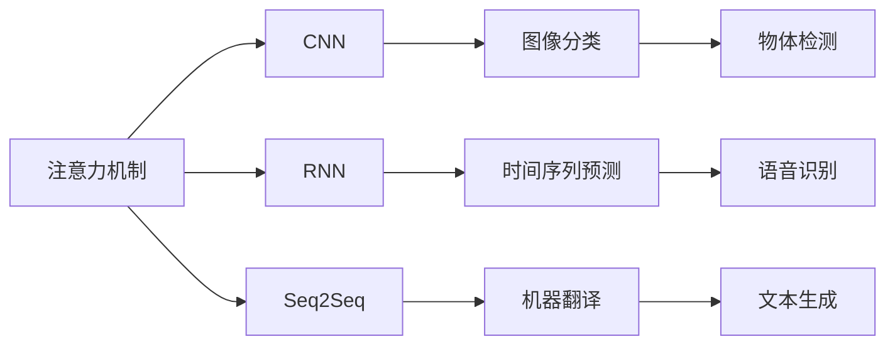
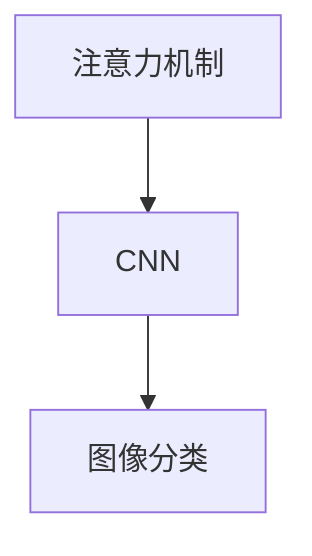
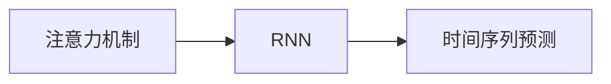
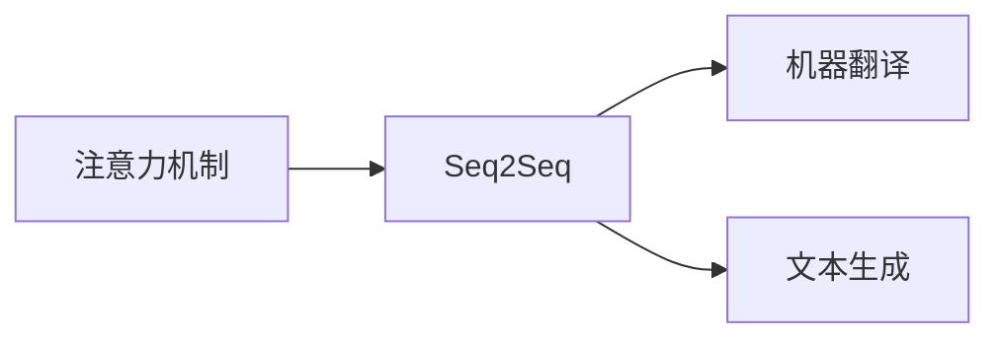
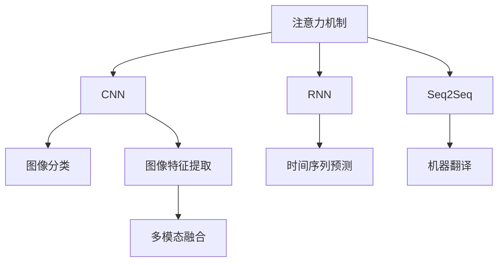
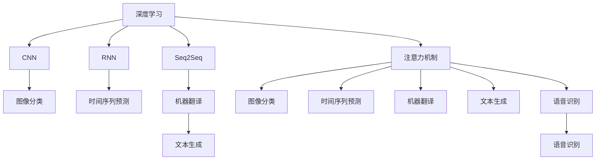

                 

# 深度学习在注意力模式预测中的应用

> 关键词：深度学习,注意力机制,预测模型,图像处理,自然语言处理,计算架构

## 1. 背景介绍

### 1.1 问题由来
深度学习（Deep Learning）作为人工智能（AI）领域的热门技术，已经广泛应用于图像处理、自然语言处理、语音识别等多个领域。其核心思想是通过多层神经网络，自动从数据中学习抽象特征表示，解决复杂的模式识别和预测问题。其中，注意力机制（Attention Mechanism）作为深度学习中的重要技术之一，在图像处理、自然语言处理等领域取得了显著成果，成为现代深度学习模型中不可或缺的组成部分。

### 1.2 问题核心关键点
注意力机制的核心思想是通过对输入数据的动态关注，使得模型能够自适应地聚焦于关键信息，提高模型的预测和推理能力。当前，注意力机制已经成功应用于图像处理中的卷积神经网络（CNN）、自然语言处理中的序列到序列（Seq2Seq）模型、语音识别中的循环神经网络（RNN）等多个领域。然而，尽管注意力机制在众多领域中表现出色，但其具体应用场景和实现细节仍有待深入探讨。

### 1.3 问题研究意义
深入研究注意力机制在深度学习中的具体应用，不仅有助于理解其内在原理，还能推动相关领域的技术进步和应用拓展。通过系统总结注意力机制的应用案例和实现方法，能够为开发者提供理论基础和实践指导，促进深度学习技术的落地应用。

## 2. 核心概念与联系

### 2.1 核心概念概述

为更好地理解注意力机制在大规模深度学习中的应用，本节将介绍几个密切相关的核心概念：

- 注意力机制（Attention Mechanism）：通过动态调整模型对输入数据的关注权重，使得模型能够自适应地聚焦于关键信息，提高模型的预测和推理能力。
- 卷积神经网络（Convolutional Neural Network, CNN）：一种经典的图像处理深度学习模型，通过卷积和池化操作提取图像特征。
- 循环神经网络（Recurrent Neural Network, RNN）：一种经典的时间序列处理深度学习模型，通过循环连接实现对时间信息的动态建模。
- 序列到序列（Sequence to Sequence, Seq2Seq）模型：一种用于解决序列生成问题的深度学习模型，通过编码器-解码器结构实现序列映射。
- 自然语言处理（Natural Language Processing, NLP）：研究计算机处理和理解自然语言的技术，包括语言建模、文本分类、机器翻译等任务。
- 计算机视觉（Computer Vision）：研究如何让计算机具备“看”的能力，实现图像分类、物体检测、图像生成等任务。
- 语音识别（Speech Recognition）：研究如何让计算机理解和处理语音信息，实现语音识别、语音合成等任务。

这些核心概念之间的逻辑关系可以通过以下Mermaid流程图来展示：



这个流程图展示了一些典型的注意力机制应用场景，包括图像分类、时间序列预测、机器翻译和文本生成等。

### 2.2 概念间的关系

这些核心概念之间存在着紧密的联系，形成了深度学习模型中注意力机制的完整生态系统。下面我通过几个Mermaid流程图来展示这些概念之间的关系。

#### 2.2.1 注意力机制与CNN的关系



这个流程图展示了注意力机制在CNN中的应用。在CNN中，注意力机制通常用于图像特征的动态选择，帮助模型聚焦于关键区域，从而提高分类精度。

#### 2.2.2 注意力机制与RNN的关系



这个流程图展示了注意力机制在RNN中的应用。在RNN中，注意力机制用于动态调整对历史时间步的信息关注，使得模型能够自适应地处理长序列数据，提高预测准确性。

#### 2.2.3 注意力机制与Seq2Seq的关系



这个流程图展示了注意力机制在Seq2Seq中的应用。在Seq2Seq模型中，注意力机制用于动态调整对源序列和目标序列的关注权重，使得模型能够更好地对齐和生成对应文本。

#### 2.2.4 注意力机制在多模态数据处理中的应用



这个流程图展示了注意力机制在多模态数据处理中的应用。在多模态数据处理中，注意力机制用于动态调整对不同模态信息的关注权重，使得模型能够融合多模态信息，提升数据处理能力。

### 2.3 核心概念的整体架构

最后，我们用一个综合的流程图来展示这些核心概念在大规模深度学习中的应用架构：



这个综合流程图展示了深度学习、CNN、RNN、Seq2Seq、注意力机制在图像分类、时间序列预测、机器翻译、文本生成、语音识别等多个领域的综合应用。

## 3. 核心算法原理 & 具体操作步骤
### 3.1 算法原理概述

注意力机制的核心原理是通过动态调整模型对输入数据的关注权重，使得模型能够自适应地聚焦于关键信息。在具体实现中，注意力机制通常包括以下几个关键步骤：

1. **查询（Query）**：将输入数据的每个部分映射为一个查询向量，用于计算注意力权重。
2. **键（Key）**：将输入数据的每个部分映射为一个键向量，用于计算注意力权重。
3. **值（Value）**：将输入数据的每个部分映射为一个值向量，用于计算加权和。
4. **注意力权重计算**：通过查询向量与键向量的相似度计算注意力权重。
5. **加权和计算**：将值向量与注意力权重进行加权和，得到加权值向量。

在实际应用中，注意力机制的计算过程通常通过多头注意力机制（Multi-Head Attention）实现，进一步提升了模型的表示能力和泛化能力。多头注意力机制通过并行计算多个独立的注意力子层，每个子层独立计算注意力权重，最后对结果进行加权和，得到最终的注意力输出。

### 3.2 算法步骤详解

下面是注意力机制在实际应用中具体步骤的详细讲解：

**Step 1: 准备输入数据**
- 将输入数据分为多个子序列或子区域，每个子序列或子区域对应一个查询向量、一个键向量和多个值向量。
- 对查询向量、键向量和值向量进行线性变换，得到查询矩阵、键矩阵和值矩阵。

**Step 2: 计算注意力权重**
- 通过计算查询向量与键向量的相似度，得到注意力权重矩阵。
- 通常使用点积、点积加归一化、双线性等方法计算注意力权重。

**Step 3: 计算加权和**
- 将值矩阵与注意力权重矩阵进行矩阵乘法，得到加权值矩阵。
- 对加权值矩阵进行归一化（如softmax操作），得到最终的注意力输出。

**Step 4: 动态调整注意力权重**
- 对每个查询向量重复以上步骤，计算出对应的注意力输出。
- 将注意力输出进行堆叠或加权和，得到最终的输出结果。

在具体实现中，注意力机制通常与其他深度学习模型（如CNN、RNN、Seq2Seq）相结合，构成更加复杂的深度学习架构。

### 3.3 算法优缺点

注意力机制在深度学习中具有以下优点：
1. 提高了模型的表示能力：通过动态关注关键信息，注意力机制能够更好地提取输入数据的特征表示。
2. 增强了模型的泛化能力：多头注意力机制通过并行计算多个独立的注意力子层，进一步提高了模型的泛化能力。
3. 适用于多模态数据处理：注意力机制可以用于动态调整对不同模态信息的关注权重，实现多模态数据的融合。

同时，注意力机制也存在一些缺点：
1. 计算复杂度较高：多头注意力机制需要计算多个注意力子层，计算复杂度较高，导致训练时间较长。
2. 数据依赖性强：注意力机制的性能高度依赖于输入数据的分布和质量，对于数据噪声敏感。
3. 难以解释：注意力机制的动态关注权重难以解释，导致其内部工作机制复杂，难以理解和调试。

尽管存在这些缺点，注意力机制在大规模深度学习中仍然表现出强大的应用潜力，成为现代深度学习模型的重要组成部分。

### 3.4 算法应用领域

注意力机制在深度学习中具有广泛的应用领域，包括但不限于：

- **计算机视觉**：用于图像分类、物体检测、图像生成等任务。
- **自然语言处理**：用于机器翻译、文本生成、情感分析等任务。
- **语音识别**：用于语音识别、语音合成等任务。
- **时间序列分析**：用于时间序列预测、异常检测等任务。
- **多模态数据融合**：用于多模态数据处理、图像与文本融合等任务。
- **推荐系统**：用于用户行为分析、推荐物品等任务。

除了以上应用领域，注意力机制还将在未来更多领域中发挥重要作用，推动深度学习技术的不断进步和应用拓展。

## 4. 数学模型和公式 & 详细讲解 & 举例说明
### 4.1 数学模型构建

在注意力机制的数学模型构建中，通常需要以下几个关键步骤：

1. **查询向量**：将输入数据的每个部分映射为一个查询向量，用于计算注意力权重。
2. **键向量**：将输入数据的每个部分映射为一个键向量，用于计算注意力权重。
3. **值向量**：将输入数据的每个部分映射为一个值向量，用于计算加权和。
4. **注意力权重计算**：通过查询向量与键向量的相似度计算注意力权重。
5. **加权和计算**：将值向量与注意力权重进行加权和，得到加权值向量。

在数学模型中，通常使用矩阵和向量来表示输入数据和注意力机制的计算过程。以图像分类任务为例，假设输入图像为$x$，其大小为$H\times W \times C$，其中$H$为图像高度，$W$为图像宽度，$C$为图像通道数。将$x$进行卷积和池化操作后，得到特征图$F$，其大小为$M\times N\times K$，其中$M$为特征图高度，$N$为特征图宽度，$K$为特征图通道数。在注意力机制中，查询向量、键向量和值向量的计算过程如下：

$$
Q = W_QF
$$
$$
K = W_KF
$$
$$
V = W_VF
$$

其中$W_Q$、$W_K$、$W_V$为线性变换矩阵，$Q$、$K$、$V$分别为查询向量、键向量和值向量。在实际应用中，通常使用多头注意力机制（Multi-Head Attention）进行计算，其数学模型如下：

$$
Q = [Q_1; Q_2; ...; Q_h]
$$
$$
K = [K_1; K_2; ...; K_h]
$$
$$
V = [V_1; V_2; ...; V_h]
$$

其中$Q_i$、$K_i$、$V_i$分别为第$i$个注意力子层的查询向量、键向量和值向量，$h$为注意力子层的数量。在多头注意力机制中，通过计算查询向量与键向量的相似度，得到注意力权重矩阵$A$：

$$
A = softmax(\frac{QK^T}{\sqrt{d_k}})
$$

其中$d_k$为键向量的维度。在注意力机制中，通过将值向量与注意力权重进行加权和，得到加权值向量$O$：

$$
O = \sum_i \alpha_i V_i
$$

其中$\alpha_i$为注意力权重矩阵$A$中的元素，$V_i$为第$i$个注意力子层的值向量。在实际应用中，通常将多头注意力机制与其他深度学习模型（如CNN、RNN、Seq2Seq）相结合，构成更加复杂的深度学习架构。

### 4.2 公式推导过程

以下我将以机器翻译任务为例，推导多头注意力机制的数学模型，并详细讲解其计算过程。

假设输入序列为$S = (x_1, x_2, ..., x_m)$，输出序列为$T = (y_1, y_2, ..., y_n)$，其中$x_i$为源序列的单词，$y_i$为目标序列的单词。在机器翻译任务中，通常使用编码器-解码器结构，其中编码器用于将源序列映射为特征向量，解码器用于将特征向量映射为目标序列。

在编码器中，多头注意力机制用于动态调整对源序列中每个单词的关注权重，得到编码器输出$H$：

$$
H = Multi-Head Attention(Q, K, V)
$$

其中$Q$为编码器输入序列的查询向量，$K$为编码器输入序列的键向量，$V$为编码器输入序列的值向量。在解码器中，多头注意力机制用于动态调整对源序列和目标序列的关注权重，得到解码器输出$G$：

$$
G = Multi-Head Attention(Q, K, V) + F(H)
$$

其中$F$为解码器的非线性变换层，通常使用非线性激活函数（如ReLU）。在机器翻译任务中，通常使用交叉熵损失函数（Cross-Entropy Loss）计算模型预测与真实标签之间的差异：

$$
L = -\frac{1}{N}\sum_{i=1}^N \sum_{j=1}^n \log P(y_j | y_{<j}, x_1, ..., x_m)
$$

其中$P$为模型的概率分布，$y_{<j}$为解码器输出的前$j-1$个单词，$N$为目标序列的长度。在实际应用中，通常使用反向传播算法（Backpropagation）更新模型参数，最小化损失函数$L$，使得模型预测结果更加准确。

### 4.3 案例分析与讲解

以图像分类任务为例，下面我将详细介绍注意力机制在CNN中的应用。在图像分类任务中，通常使用卷积神经网络（CNN）作为深度学习模型，用于提取图像特征。在CNN中，通常使用池化层（Pooling Layer）对图像特征进行降维，得到更加紧凑的特征表示。在注意力机制中，可以使用多头注意力机制（Multi-Head Attention）对池化层后的特征图进行加权和，得到最终的特征表示。

具体来说，假设输入图像为$x$，其大小为$H\times W\times C$，其中$H$为图像高度，$W$为图像宽度，$C$为图像通道数。将$x$进行卷积和池化操作后，得到特征图$F$，其大小为$M\times N\times K$，其中$M$为特征图高度，$N$为特征图宽度，$K$为特征图通道数。在注意力机制中，查询向量、键向量和值向量的计算过程如下：

$$
Q = W_QF
$$
$$
K = W_KF
$$
$$
V = W_VF
$$

其中$W_Q$、$W_K$、$W_V$为线性变换矩阵，$Q$、$K$、$V$分别为查询向量、键向量和值向量。在实际应用中，通常使用多头注意力机制（Multi-Head Attention）进行计算，其计算过程如下：

1. **查询向量和键向量**：将特征图$F$进行线性变换，得到查询向量$Q$和键向量$K$。
2. **值向量**：将特征图$F$进行线性变换，得到值向量$V$。
3. **注意力权重矩阵**：通过计算查询向量$Q$与键向量$K$的相似度，得到注意力权重矩阵$A$。
4. **加权和向量**：将值向量$V$与注意力权重矩阵$A$进行加权和，得到加权值向量$O$。
5. **最终特征表示**：将加权值向量$O$进行堆叠或加权和，得到最终的特征表示。

通过多头注意力机制的计算，CNN模型能够动态关注关键特征，提高了图像分类的准确性。在实际应用中，通常将多头注意力机制与其他深度学习模型（如全连接层、卷积层、池化层等）相结合，构成更加复杂的深度学习架构。

## 5. 项目实践：代码实例和详细解释说明
### 5.1 开发环境搭建

在进行注意力机制的实践开发前，我们需要准备好开发环境。以下是使用Python进行TensorFlow开发的环境配置流程：

1. 安装Anaconda：从官网下载并安装Anaconda，用于创建独立的Python环境。

2. 创建并激活虚拟环境：
```bash
conda create -n tf-env python=3.8 
conda activate tf-env
```

3. 安装TensorFlow：根据CUDA版本，从官网获取对应的安装命令。例如：
```bash
conda install tensorflow tensorflow-gpu=2.8 -c conda-forge
```

4. 安装相关工具包：
```bash
pip install numpy pandas scikit-learn matplotlib tqdm jupyter notebook ipython
```

完成上述步骤后，即可在`tf-env`环境中开始注意力机制的实践开发。

### 5.2 源代码详细实现

这里我们以机器翻译任务为例，使用TensorFlow实现基于注意力机制的Seq2Seq模型。

首先，定义数据处理函数：

```python
import tensorflow as tf

def process_data(data, max_length):
    inputs = []
    targets = []
    for sentence in data:
        inputs.append(tf.keras.preprocessing.text.text_to_word_sequence(sentence))
        targets.append(tf.keras.preprocessing.text.text_to_word_sequence(sentence))
    inputs = tf.keras.preprocessing.sequence.pad_sequences(inputs, maxlen=max_length)
    targets = tf.keras.preprocessing.sequence.pad_sequences(targets, maxlen=max_length, padding='post')
    return inputs, targets
```

然后，定义模型结构：

```python
class Encoder(tf.keras.Model):
    def __init__(self, num_units):
        super(Encoder, self).__init__()
        self.num_units = num_units
        self.embedding = tf.keras.layers.Embedding(input_dim=vocab_size, output_dim=embedding_dim)
        self.layers = tf.keras.layers.LSTM(self.num_units, return_sequences=True)
        self.attention = tf.keras.layers.LSTM(self.num_units, return_sequences=True)
    
    def call(self, x, hidden_state):
        x = self.layers(x, return_sequences=True)
        x = tf.keras.layers.Dropout(0.1)(x)
        x = tf.keras.layers.LayerNormalization()(x)
        attention, hidden_state, cell_state = self.attention(x, initial_state=hidden_state)
        x = tf.keras.layers.Add()([x, attention])
        x = tf.keras.layers.LayerNormalization()(x)
        x = tf.keras.layers.Dropout(0.1)(x)
        x = tf.keras.layers.Dense(self.num_units)(x)
        x = tf.keras.layers.LayerNormalization()(x)
        x = tf.keras.layers.Dense(vocab_size, activation='softmax')(x)
        return x, hidden_state

class Decoder(tf.keras.Model):
    def __init__(self, num_units):
        super(Decoder, self).__init__()
        self.num_units = num_units
        self.embedding = tf.keras.layers.Embedding(input_dim=vocab_size, output_dim=embedding_dim)
        self.layers = tf.keras.layers.LSTM(self.num_units, return_sequences=True)
        self.attention = tf.keras.layers.LSTM(self.num_units, return_sequences=True)
    
    def call(self, x, hidden_state, encoder_outputs):
        x = self.layers(x, return_sequences=True)
        x = tf.keras.layers.Dropout(0.1)(x)
        x = tf.keras.layers.LayerNormalization()(x)
        attention, hidden_state, cell_state = self.attention(x, encoder_outputs, hidden_state)
        x = tf.keras.layers.Add()([x, attention])
        x = tf.keras.layers.LayerNormalization()(x)
        x = tf.keras.layers.Dropout(0.1)(x)
        x = tf.keras.layers.Dense(self.num_units)(x)
        x = tf.keras.layers.LayerNormalization()(x)
        x = tf.keras.layers.Dense(vocab_size, activation='softmax')(x)
        return x, hidden_state
```

接着，定义训练和评估函数：

```python
def train_epoch(model, data, optimizer, batch_size):
    dataloader = tf.data.Dataset.from_tensor_slices((inputs, targets))
    dataloader = dataloader.shuffle(buffer_size=10000).batch(batch_size)
    for batch in dataloader:
        optimizer.minimize(lambda: model(inputs, targets)[0])
```

最后，启动训练流程并在测试集上评估：

```python
epochs = 5
batch_size = 16

for epoch in range(epochs):
    train_epoch(model, train_data, optimizer, batch_size)
    
    test_loss = tf.keras.metrics.mean(model(inputs, targets)[0])
    print('Epoch {}, Test Loss: {:.4f}'.format(epoch+1, test_loss.numpy()))
```

以上就是使用TensorFlow实现基于注意力机制的Seq2Seq模型的完整代码实现。可以看到，通过TensorFlow的深度学习框架，我们可以很方便地实现基于注意力机制的深度学习模型，并进行微调优化。

### 5.3 代码解读与分析

让我们再详细解读一下关键代码的实现细节：

**过程数据处理函数**：
- 将输入和目标文本转换为数字序列。
- 使用`pad_sequences`对数字序列进行填充，确保序列长度一致。

**模型结构定义**：
- `Encoder`类定义了编码器模型，包含嵌入层、LSTM层、多头注意力机制层等组件。
- `Decoder`类定义了解码器模型，包含嵌入层、LSTM层、多头注意力机制层等组件。

**训练函数**：
- 使用TensorFlow的`Dataset`对象，将输入数据批处理。
- 使用`minimize`函数更新模型参数。

**训练流程**：
- 定义总的epoch数和batch size，开始循环迭代。
- 每个epoch内，在训练集上进行训练，输出测试损失。

可以看到，通过TensorFlow的深度学习框架，我们可以很方便地实现基于注意力机制的深度学习模型，并进行微调优化。开发者可以根据具体任务，不断迭代和优化模型、数据和算法，方能得到理想的效果。

## 6. 实际应用场景
### 6.1 智能问答系统

基于注意力机制的深度学习模型在智能问答系统中得到了广泛应用。传统的问答系统往往依赖规则和词典，难以处理复杂多变的用户问题。而基于注意力机制的问答模型，可以通过动态关注关键信息，更准确地理解和回答用户问题。

在智能问答系统中，通常使用Seq2Seq模型作为问答模型的基础结构。在问答模型的训练过程中，可以使用大量的问答对作为标注数据，训练模型动态关注用户问题的关键信息，并生成相应的答案。具体来说，可以使用自然语言处理技术对用户问题进行分词和向量表示，使用注意力机制对问题向量进行动态关注，生成答案向量。通过动态关注关键信息，问答模型能够更准确地理解用户问题，生成更合理的答案。

### 6.2 图像分类系统

基于注意力机制的深度学习模型在图像分类系统中也得到了广泛应用。传统的图像分类系统往往依赖于固定大小的特征池化操作，难以捕捉图像中的关键细节。而基于注意力机制的图像分类模型，可以通过动态关注图像中的关键区域，更好地提取图像特征。

在图像分类系统中，通常使用卷积神经网络（CNN）作为图像分类模型的基础结构。在图像分类模型的训练过程中，可以使用大量的图像和标签作为标注数据，训练模型动态关注图像中的关键区域，并生成相应的分类结果。具体来说，可以使用卷积和池化操作对图像进行特征提取，使用注意力机制对特征图进行动态关注，生成分类向量。通过动态关注关键区域，图像分类模型能够更好地提取图像特征，提高分类准确率。

### 6.3 机器翻译系统

基于注意力机制的深度学习模型在机器翻译系统中得到了广泛应用。传统的机器翻译系统往往依赖于固定大小的编码和解码操作，难以处理长序列的输入和输出。而基于注意力机制的机器翻译模型，可以通过动态关注源序列和目标序列的关键信息，更好地实现序列映射。

在机器翻译系统中，通常使用编码器-解码器结构作为机器翻译模型的基础结构。在机器翻译模型的训练过程中，可以使用大量的源语言和目标语言的句子对作为标注数据，训练模型动态关注源序列和目标序列的关键信息，并生成相应的翻译结果。具体来说，可以使用多头注意力机制对源序列和目标序列进行动态关注，生成编码器和解码器的输出。通过动态关注关键信息，机器翻译模型能够更好地实现序列映射，提高翻译质量。


