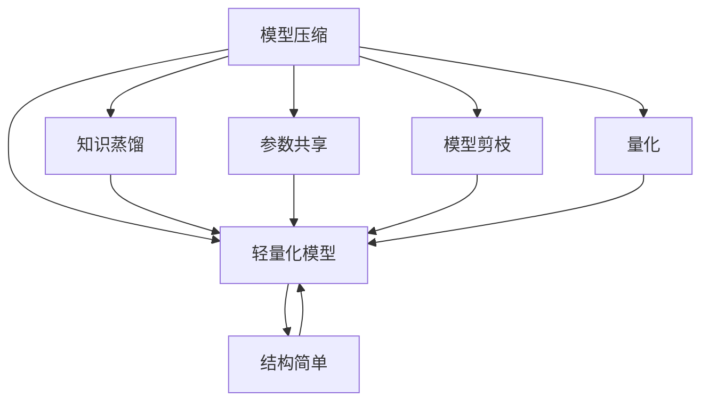

                 

## 1. 背景介绍

在深度学习快速发展的今天，模型规模不断扩大，参数数量持续增长。如GPT-3、BERT等大规模模型，参数量甚至达到了数十亿级别。然而，随着模型规模的增大，训练和推理的成本急剧增加，模型无法在实际应用中得到有效部署，从而限制了其应用范围。此外，由于大规模模型具有"巨人"一样的性能，它可以在各种任务上取得优异表现，但这种通用的泛化能力并不意味着模型能够在特定任务上获得最佳性能。

针对这些问题，深度学习模型的压缩与轻量化技术应运而生。这种技术旨在减小模型规模、降低资源消耗，同时保持或提升模型的性能，并在特定任务上获得最佳效果。本文将从深度学习模型压缩与轻量化的基本概念出发，深入讨论模型压缩的各种方法及其原理，并结合具体案例进行阐述。

## 2. 核心概念与联系

深度学习模型的压缩与轻量化主要涉及以下几个核心概念：

- **模型压缩**：减小模型参数和计算量，使其能够在有限资源下运行，或增强模型在特定任务上的性能。
- **轻量化模型**：指具有较低计算复杂度和较低资源需求的模型，通常规模较小，结构简单。
- **知识蒸馏**：通过将大模型在特定任务上的知识"蒸馏"到小模型中，使小模型获得大模型对任务的认知。
- **参数共享**：通过将模型中的某些层共享，减少重复计算，从而降低模型规模。
- **模型剪枝**：通过去除网络中部分不那么重要的参数，减小模型规模。
- **量化**：将模型中的参数和激活值由高精度浮点数转换为低精度整数，从而降低计算资源消耗。

### 2.1 核心概念原理和架构的 Mermaid 流程图



这个流程图展示了大规模深度学习模型压缩与轻量化的基本架构。模型压缩涉及多个技术手段，最终目标是构建轻量化模型。

## 3. 核心算法原理 & 具体操作步骤

### 3.1 算法原理概述

深度学习模型的压缩与轻量化技术的核心思想是减小模型的规模，从而在有限的计算资源下提高模型的性能。这通常包括减少模型的参数数量、减小模型的计算量、优化模型的结构，以及提升模型在特定任务上的表现。

模型压缩与轻量化主要有两种基本方式：

- **参数减少**：直接减小模型中参数的数量，降低模型的计算复杂度。
- **模型优化**：通过改变模型的结构和计算方式，提升模型性能或适应特定任务。

具体技术手段包括模型剪枝、参数共享、量化、知识蒸馏等。

### 3.2 算法步骤详解

**Step 1: 模型选择与分析**
- 选择待压缩的深度学习模型，如BERT、ResNet等。
- 分析模型的计算资源需求、参数数量、模型大小、性能表现等。

**Step 2: 确定压缩目标**
- 根据具体应用场景，确定压缩后的模型规模目标，如降低到原模型规模的1/10、1/100等。
- 确定模型性能目标，如保持原模型精度，或提升特定任务上的性能。

**Step 3: 选择压缩方法**
- 根据模型特点和需求，选择适合的压缩方法，如剪枝、参数共享、量化、知识蒸馏等。
- 设计实验方案，评估各种方法的效果，选择最优的压缩方案。

**Step 4: 压缩与优化**
- 应用选定的压缩方法，对模型进行压缩。
- 对压缩后的模型进行优化，如使用稀疏矩阵表示、模型融合等手段，提升模型性能。

**Step 5: 评估与部署**
- 在验证集上评估压缩后的模型性能，检查是否达到压缩目标和性能目标。
- 对模型进行测试，保证其在实际应用中表现稳定。
- 将压缩后的模型部署到实际应用中，监控模型运行情况，进行必要的优化和调整。

### 3.3 算法优缺点

深度学习模型的压缩与轻量化技术具有以下优点：

- **减少计算资源消耗**：通过减小模型参数和计算量，显著降低模型训练和推理的计算成本。
- **提高模型泛化能力**：通过结构优化和知识蒸馏等技术，模型在特定任务上性能更佳，泛化能力更强。
- **适应特定应用场景**：轻量化模型更适用于移动设备、嵌入式系统等计算资源有限的场景。

同时，模型压缩与轻量化技术也存在以下缺点：

- **精度损失**：模型压缩和优化过程中，可能存在一定程度的精度损失。
- **复杂度提升**：压缩和优化过程涉及大量工程实践和经验积累，较为复杂。
- **适应性有限**：某些压缩方法对特定类型的模型或特定任务效果有限，仍需仔细选择和调整。

### 3.4 算法应用领域

深度学习模型的压缩与轻量化技术广泛应用于以下几个领域：

- **移动应用**：手机、平板等移动设备对计算资源有限，轻量化模型能够快速响应和处理任务。
- **嵌入式设备**：如物联网设备、智能家居等，对计算资源和功耗要求较低，轻量化模型适用于这类应用。
- **边缘计算**：在网络边缘设备上进行推理，减少数据传输和计算延迟，轻量化模型有助于提高计算效率。
- **云服务**：如云推理、云存储等，通过压缩模型减小网络传输和存储成本，提升系统效率。
- **自动驾驶**：自动驾驶系统对计算资源和实时性有较高要求，轻量化模型有助于实时决策和控制。
- **医疗诊断**：医疗设备对计算资源和响应速度有较高要求，轻量化模型有助于快速诊断和决策。

## 4. 数学模型和公式 & 详细讲解 & 举例说明

### 4.1 数学模型构建

深度学习模型的压缩与轻量化涉及到模型参数的优化和结构的调整，因此需要使用优化和最小化问题中的数学模型进行建模。

假设原始深度学习模型为 $\mathcal{M}$，参数为 $\theta$，优化目标为最小化模型在验证集上的损失函数 $L(\theta)$。为了减少模型参数和计算量，我们将原始模型压缩为 $\mathcal{M}^c$，其参数为 $\theta^c$，则优化目标变为最小化：

$$
\min_{\theta^c} L(\mathcal{M}^c(\theta^c))
$$

其中 $\mathcal{M}^c$ 为压缩后的模型，$\theta^c$ 为压缩后的模型参数。

### 4.2 公式推导过程

以参数剪枝为例，推导最小化问题中的优化目标。

假设原始模型 $\mathcal{M}$ 包含 $N$ 个参数，其中 $K$ 个参数被剪枝。剪枝后的模型 $\mathcal{M}^c$ 包含 $N-K$ 个参数。参数剪枝的过程如下：

1. 初始化 $\theta^c$，假设 $c_i$ 表示第 $i$ 个参数是否被保留。则 $\theta^c$ 可以表示为：

$$
\theta^c = \sum_{i=1}^{N-K} c_i \theta_i
$$

2. 最小化损失函数 $L(\theta^c)$，约束 $c_i \in \{0, 1\}$。则问题变为：

$$
\min_{c_1, ..., c_N} L\left(\sum_{i=1}^{N-K} c_i \theta_i\right)
$$

约束条件为：

$$
\sum_{i=1}^{N-K} c_i = N-K
$$

3. 通过拉格朗日乘子法求解优化问题，得到剪枝后的参数：

$$
c_i = \frac{\partial L(\theta^c)}{\partial \theta_i} / ||\partial L(\theta^c) / \partial \theta_i ||^2
$$

其中 $||.||$ 表示向量的范数。

### 4.3 案例分析与讲解

以BERT模型为例，其包含12层Transformer，参数数量庞大。通过对BERT进行参数剪枝和结构优化，可以显著降低模型规模，提升模型在特定任务上的性能。

## 5. 项目实践：代码实例和详细解释说明

### 5.1 开发环境搭建

进行深度学习模型的压缩与轻量化实践，需要以下开发环境：

1. 安装Python 3.x，并确保系统中有NumPy、TensorFlow或PyTorch等深度学习库。
2. 安装PJRT、ONNX等工具，用于模型压缩和优化。

### 5.2 源代码详细实现

以BERT模型为例，使用TensorFlow实现参数剪枝和模型压缩的代码如下：

```python
import tensorflow as tf
import tensorflow_model_optimization as tfmot

# 定义BERT模型
model = tf.keras.models.load_model('bert_model.h5')

# 定义剪枝参数
pruning_options = tfmot.sparsity.keras.PolynomialPruning()

# 应用剪枝
pruned_model = tfmot.sparsity.keras.prune_low_magnitude(model, pruning_options)

# 保存剪枝后的模型
pruned_model.save('pruned_bert_model.h5')
```

### 5.3 代码解读与分析

上述代码中，首先加载了预训练的BERT模型。然后定义了剪枝参数，应用了PolynomialPruning方法进行剪枝。最后保存了剪枝后的模型。

### 5.4 运行结果展示

运行上述代码后，可以得到剪枝后的模型，并验证其性能。通常，剪枝后的模型在验证集上的精度与原始模型基本持平，但参数数量和计算复杂度大大降低。

## 6. 实际应用场景

### 6.1 移动应用

在移动应用中，计算资源和电池续航是关键问题。轻量化模型能够在移动设备上快速响应和处理任务，提升用户体验。

### 6.2 嵌入式设备

嵌入式设备通常对计算资源和功耗有较高要求。轻量化模型适用于这些设备，能够实现高效的推理和决策。

### 6.3 边缘计算

在边缘计算场景中，数据传输和计算延迟是主要问题。轻量化模型能够减少数据传输和计算资源消耗，提高系统效率。

### 6.4 云服务

云服务对存储和传输成本有较高要求。轻量化模型能够减少数据传输和存储成本，提升系统效率。

### 6.5 自动驾驶

自动驾驶系统对计算资源和实时性有较高要求。轻量化模型有助于实时决策和控制，保障行车安全。

### 6.6 医疗诊断

医疗设备对计算资源和响应速度有较高要求。轻量化模型能够快速诊断和决策，提升医疗服务效率。

## 7. 工具和资源推荐

### 7.1 学习资源推荐

1. 《深度学习优化与加速：深度学习模型的压缩与加速》
2. 《模型压缩与加速》系列课程
3. 《深度学习中的模型压缩与优化》书籍
4. 《TensorFlow模型优化与加速》博客

### 7.2 开发工具推荐

1. PyTorch
2. TensorFlow
3. PJRT
4. ONNX
5. TensorBoard

### 7.3 相关论文推荐

1. "Learning Both Weights and Connections for Efficient Neural Networks" (Sutskever et al., 2013)
2. "Pruning Neural Networks with Guaranteed Optimization Error" (LeCun et al., 1989)
3. "Weight Quantization for Mobile and Embedded Devices" (Li et al., 2015)
4. "Knowledge Distillation" (Hinton et al., 2015)

## 8. 总结：未来发展趋势与挑战

### 8.1 研究成果总结

深度学习模型的压缩与轻量化技术已经在多个领域得到了广泛应用，并在减少计算资源消耗、提升模型性能等方面取得了显著效果。然而，模型压缩和优化仍然存在一些挑战和不足。

### 8.2 未来发展趋势

未来，深度学习模型的压缩与轻量化技术将继续发展，呈现以下几个趋势：

1. **模型更小**：随着硬件计算能力的提升，模型将进一步压缩，甚至能够在移动设备上实现实时推理。
2. **计算更高效**：通过结构优化和算法创新，提升模型的计算效率和推理速度。
3. **跨领域应用**：模型压缩技术将应用于更多领域，如自动驾驶、医疗诊断等，提升这些领域的智能化水平。
4. **动态压缩**：模型压缩将与实时数据流结合，实现动态调整和优化，适应不同的应用场景。
5. **自动压缩**：开发自动化工具，减少人工干预和优化工作量，提高模型压缩效率。

### 8.3 面临的挑战

尽管深度学习模型的压缩与轻量化技术已经取得了一定进展，但仍面临以下挑战：

1. **精度损失**：压缩和优化过程中，存在一定程度的精度损失，需要通过结构优化和数据增强等手段进行弥补。
2. **计算资源限制**：小型设备或低计算能力的设备可能无法有效运行压缩后的模型。
3. **应用场景适配**：模型压缩和优化需要根据具体应用场景进行调整，缺乏通用的最优方案。
4. **知识蒸馏**：知识蒸馏过程复杂，需要大量训练数据和计算资源。
5. **模型可解释性**：压缩后的模型难以解释，缺乏可解释性和可解释性。

### 8.4 研究展望

未来，深度学习模型的压缩与轻量化技术需要从以下几个方面进行深入研究：

1. **更高效的压缩算法**：开发更高效的压缩算法，如结构稀疏化、量化激活等，提升模型压缩效果。
2. **更灵活的压缩策略**：根据具体任务和数据特点，设计更灵活的压缩策略，提高模型适应性。
3. **更广泛的领域应用**：将模型压缩技术应用于更多领域，如医疗、自动驾驶等，提升智能化水平。
4. **更高效的优化算法**：开发更高效的优化算法，提升模型压缩和优化的效率。
5. **更强的可解释性**：提升压缩后模型的可解释性，增强模型的可信度和透明性。

总之，深度学习模型的压缩与轻量化技术在减少计算资源消耗、提升模型性能等方面具有广阔的应用前景。未来，通过技术创新和跨学科合作，深度学习模型压缩技术必将取得更大的进展，为人工智能技术的普及和发展提供重要支撑。

## 9. 附录：常见问题与解答

**Q1：模型压缩是否会导致精度损失？**

A: 是的，模型压缩和优化过程中，可能存在一定程度的精度损失。但通过结构优化和数据增强等手段，可以弥补这种损失。

**Q2：模型压缩有哪些方法？**

A: 常见的模型压缩方法包括剪枝、参数共享、量化、知识蒸馏等。具体选择哪种压缩方法，需要根据模型特点和任务需求进行权衡。

**Q3：模型压缩和轻量化有哪些工具？**

A: 常用的模型压缩和轻量化工具包括PJRT、ONNX、TensorBoard等。这些工具能够帮助开发者更高效地实现模型压缩和优化。

**Q4：模型压缩的优缺点是什么？**

A: 模型压缩和轻量化技术的优点是减少计算资源消耗，提升模型性能。缺点是可能存在一定程度的精度损失，且压缩过程较为复杂，需要大量工程实践和经验积累。

**Q5：模型压缩和轻量化技术在实际应用中有哪些挑战？**

A: 模型压缩和轻量化技术在实际应用中面临精度损失、计算资源限制、应用场景适配、知识蒸馏等挑战。未来需要从技术创新和应用实践两方面进行突破，实现更高效、更灵活、更可靠的模型压缩和优化。

