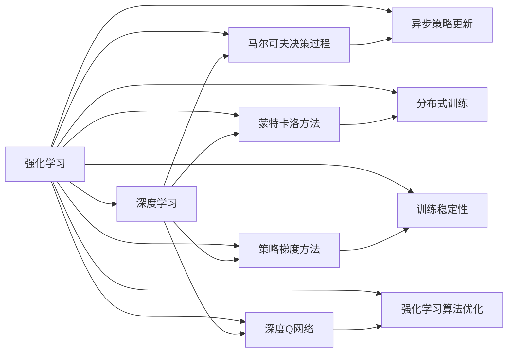
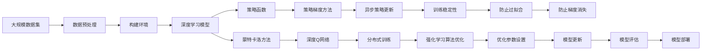

                 

# 深度强化学习 (Deep Reinforcement Learning) 原理与代码实例讲解

> 关键词：深度强化学习,强化学习,深度学习,模型训练,马尔可夫决策过程,蒙特卡洛方法,策略梯度方法,深度Q网络,异步策略更新,分布式训练,训练稳定性,强化学习算法优化

## 1. 背景介绍

### 1.1 问题由来
强化学习（Reinforcement Learning, RL）是机器学习中的一个重要分支，其核心思想是：通过与环境交互，学习如何在特定环境中采取最优的行动，以最大化累积奖励。深度强化学习（Deep Reinforcement Learning, DRL）通过深度神经网络技术，提高了强化学习的处理能力，可以处理更为复杂的环境和行动空间。

近年来，深度强化学习在多个领域取得了重大突破，例如AlphaGo在围棋中的应用、AlphaStar在星际争霸中的应用、OpenAI的DALL-E在图像生成中的应用。这些应用不仅展示了深度强化学习在复杂环境下的强大能力，也证明了其在现实世界中的潜在应用前景。

然而，深度强化学习仍然面临诸多挑战。由于其复杂性，深度强化学习模型的训练需要大量的计算资源和时间，且容易陷入局部最优解。此外，如何使模型能够更好地利用环境信息，同时避免不必要的探索，也是一个亟待解决的问题。

### 1.2 问题核心关键点
深度强化学习的主流方法包括：

- 模型训练：基于深度神经网络的Q值或策略函数进行训练。
- 马尔可夫决策过程（MDP）：强化学习中的核心概念，描述环境和行动之间的关系。
- 蒙特卡洛方法：通过模拟环境来评估Q值或策略的价值。
- 策略梯度方法：直接对策略函数进行优化，而不是对Q值进行优化。
- 深度Q网络（DQN）：结合深度神经网络和蒙特卡洛方法，用于优化Q值。
- 异步策略更新：在多线程或分布式环境中，同时更新不同策略，以提高训练效率。
- 分布式训练：通过多个计算节点并行训练，加速模型训练过程。
- 训练稳定性：在模型训练过程中，如何防止过拟合和梯度消失等问题。
- 强化学习算法优化：针对特定的强化学习算法，优化训练过程和参数设置。

这些关键点构成了深度强化学习的基础，并且相互关联，共同影响着算法的性能和稳定性。

### 1.3 问题研究意义
深度强化学习的研究和应用对于推进人工智能的发展具有重要意义：

1. 解决复杂问题：深度强化学习能够处理复杂环境中的非线性、非平稳、高维度等问题，如图像识别、游戏智能等。
2. 强化自主学习：通过与环境交互，深度强化学习能够实现自主学习和决策，减少对人类干预的依赖。
3. 提高智能系统效率：深度强化学习算法可以应用于各种智能系统中，如自动驾驶、机器人控制、自然语言处理等，提高系统的效率和效果。
4. 推动科学研究：深度强化学习在科学研究中的应用，如基因组学、生物化学等领域，为这些领域带来了新的研究方法。
5. 推动产业应用：深度强化学习的应用已经渗透到众多产业中，如金融、医疗、制造业等，带来了显著的经济效益和社会价值。

## 2. 核心概念与联系

### 2.1 核心概念概述

为更好地理解深度强化学习的核心概念，本节将介绍几个密切相关的核心概念：

- 强化学习（Reinforcement Learning）：通过与环境交互，学习如何在特定环境中采取最优行动，以最大化累积奖励。
- 深度学习（Deep Learning）：基于神经网络进行复杂数据建模和处理的技术，能够有效处理高维数据和非线性关系。
- 马尔可夫决策过程（Markov Decision Process, MDP）：强化学习中的基本模型，描述环境、行动和奖励之间的关系。
- 蒙特卡洛方法（Monte Carlo Method）：通过模拟环境，利用统计方法估计Q值或策略的价值。
- 策略梯度方法（Policy Gradient Method）：直接对策略函数进行优化，而不是对Q值进行优化。
- 深度Q网络（Deep Q Network, DQN）：结合深度神经网络和蒙特卡洛方法，用于优化Q值。
- 异步策略更新（Asynchronous Strategy Update）：在多线程或分布式环境中，同时更新不同策略，以提高训练效率。
- 分布式训练（Distributed Training）：通过多个计算节点并行训练，加速模型训练过程。
- 训练稳定性（Training Stability）：在模型训练过程中，如何防止过拟合和梯度消失等问题。
- 强化学习算法优化（Reinforcement Learning Algorithm Optimization）：针对特定的强化学习算法，优化训练过程和参数设置。

这些核心概念之间的逻辑关系可以通过以下Mermaid流程图来展示：



这个流程图展示了强化学习、深度学习与相关概念的联系：

1. 强化学习是深度强化学习的基础，两者结合可以处理更为复杂的环境和行动空间。
2. 马尔可夫决策过程和蒙特卡洛方法是强化学习的核心概念，用于描述环境和行动之间的关系，评估策略的价值。
3. 策略梯度方法和深度Q网络是深度强化学习中常用的算法，用于优化策略函数和Q值。
4. 异步策略更新和分布式训练是深度强化学习中提升训练效率的方法，通过并行计算加速模型训练。
5. 训练稳定性和强化学习算法优化是确保深度强化学习模型性能的关键，通过这些技术提高模型的训练效果和鲁棒性。

### 2.2 概念间的关系

这些核心概念之间存在着紧密的联系，形成了深度强化学习的基本框架。以下是一些具体的逻辑关系：

- **强化学习与深度学习**：强化学习通过深度学习技术，增强了对复杂环境和行动空间的处理能力，能够应对高维度、非线性等问题。
- **马尔可夫决策过程与蒙特卡洛方法**：马尔可夫决策过程描述了环境、行动和奖励之间的关系，而蒙特卡洛方法通过模拟环境，评估策略的价值，两者相互补充。
- **策略梯度方法与深度Q网络**：策略梯度方法直接优化策略函数，而深度Q网络通过蒙特卡洛方法优化Q值，两者都是优化策略的重要方法。
- **异步策略更新与分布式训练**：异步策略更新通过同时更新多个策略，提高训练效率，而分布式训练通过并行计算加速模型训练过程。
- **训练稳定性与强化学习算法优化**：训练稳定性通过防止过拟合和梯度消失等问题，保证模型的鲁棒性，而强化学习算法优化通过优化训练过程和参数设置，提高模型的性能。

这些概念共同构成了深度强化学习的基本框架，其相互关联和影响，共同决定了算法的性能和效果。

### 2.3 核心概念的整体架构

最后，我们用一个综合的流程图来展示这些核心概念在大规模深度强化学习中的整体架构：



这个综合流程图展示了从数据预处理到模型评估和部署的全过程。通过深度强化学习技术，可以从大规模数据集中构建环境，训练深度学习模型，并通过策略函数和蒙特卡洛方法优化策略和Q值，最终通过异步策略更新和分布式训练提高训练效率和稳定性，并通过模型优化和评估确保模型性能。

## 3. 核心算法原理 & 具体操作步骤
### 3.1 算法原理概述

深度强化学习的核心算法是Q-learning和策略梯度方法，其中Q-learning是通过蒙特卡洛方法估计Q值，策略梯度方法则是直接对策略函数进行优化。

在Q-learning中，Q值（Q-value）表示在当前状态下采取某个行动后，期望获得的累积奖励。深度Q网络（DQN）通过神经网络估计Q值，避免了传统Q-learning中手动选择函数的问题。

在策略梯度方法中，策略函数（policy function）用于选择行动，策略梯度（policy gradient）用于优化策略函数，使得策略函数能够最大化期望累积奖励。

这些算法的核心思想是通过与环境的交互，不断优化行动选择和策略函数，以最大化累积奖励。

### 3.2 算法步骤详解

#### 3.2.1 Q-learning算法

Q-learning算法的步骤如下：

1. **初始化**：设置Q值函数（Q-value function）为零。
2. **迭代更新**：在每个时间步t，选择一个行动a，观察下一个状态s'，获取奖励r，更新Q值函数Q(s,a)。
3. **终止条件**：当达到终止状态或最大迭代次数时，停止迭代。

数学上，Q-learning的更新公式为：

$$
Q(s,a) \leftarrow Q(s,a) + \alpha [r + \gamma \max_{a'} Q(s', a') - Q(s,a)]
$$

其中，α为学习率，γ为折扣因子，表示未来奖励的折扣程度。

#### 3.2.2 深度Q网络（DQN）

深度Q网络（DQN）的算法步骤如下：

1. **初始化**：定义神经网络作为Q值函数，初始化权重。
2. **迭代更新**：在每个时间步t，选择一个行动a，观察下一个状态s'，获取奖励r，更新Q值函数Q(s,a)。
3. **网络更新**：将观察到的状态s'和行动a'，以及新状态s'的Q值，存储到经验回放缓冲区中。
4. **模型训练**：从经验回放缓冲区中随机抽取样本，训练神经网络。
5. **终止条件**：当达到终止状态或最大迭代次数时，停止迭代。

#### 3.2.3 策略梯度方法

策略梯度方法的步骤如下：

1. **初始化**：定义策略函数（policy function），初始化权重。
2. **迭代更新**：在每个时间步t，根据当前策略函数选择行动a，观察下一个状态s'，获取奖励r，计算策略梯度。
3. **策略更新**：根据策略梯度，更新策略函数权重。
4. **终止条件**：当达到终止状态或最大迭代次数时，停止迭代。

数学上，策略梯度的更新公式为：

$$
\theta \leftarrow \theta + \alpha \nabla_\theta \sum_{t=0}^T \gamma^t r_t
$$

其中，θ为策略函数权重，α为学习率，γ为折扣因子。

### 3.3 算法优缺点

深度强化学习的核心算法Q-learning和策略梯度方法，各自有其优缺点：

#### Q-learning算法的优点

- **易于理解和实现**：Q-learning算法的思想简单，易于理解和实现。
- **鲁棒性强**：Q-learning算法在处理噪声和干扰时表现良好，能够适应复杂环境。

#### Q-learning算法的缺点

- **收敛速度慢**：Q-learning算法收敛速度较慢，容易陷入局部最优解。
- **Q值估计不准确**：在处理高维度状态空间时，Q-learning算法的Q值估计可能不准确。

#### 深度Q网络的优点

- **处理复杂状态空间**：深度Q网络通过神经网络估计Q值，能够处理高维度、非线性的状态空间。
- **收敛速度快**：深度Q网络使用神经网络优化Q值，收敛速度较快。

#### 深度Q网络的缺点

- **计算资源需求高**：深度Q网络需要大量的计算资源和时间，尤其是在处理大规模状态空间时。
- **模型复杂性高**：深度Q网络的模型复杂度较高，容易出现过拟合和梯度消失等问题。

#### 策略梯度方法的优点

- **直观性好**：策略梯度方法直接优化策略函数，易于理解和实现。
- **鲁棒性好**：策略梯度方法在处理噪声和干扰时表现良好，能够适应复杂环境。

#### 策略梯度方法的缺点

- **计算资源需求高**：策略梯度方法需要大量的计算资源和时间，尤其是在处理复杂策略函数时。
- **模型复杂性高**：策略梯度方法需要优化策略函数，模型复杂度较高，容易出现过拟合和梯度消失等问题。

### 3.4 算法应用领域

深度强化学习算法在多个领域得到了广泛应用，例如：

- 机器人控制：在机器人控制领域，深度强化学习算法用于学习机器人如何执行复杂动作，以完成特定任务。
- 游戏智能：在视频游戏领域，深度强化学习算法用于学习如何优化游戏策略，提高游戏水平。
- 自然语言处理：在自然语言处理领域，深度强化学习算法用于学习如何生成自然语言，如对话系统、文本生成等。
- 金融投资：在金融领域，深度强化学习算法用于学习如何优化投资策略，提高投资回报率。
- 能源管理：在能源管理领域，深度强化学习算法用于学习如何优化能源分配，提高能源利用效率。
- 自动驾驶：在自动驾驶领域，深度强化学习算法用于学习如何优化驾驶策略，提高行车安全性。

除了以上应用领域，深度强化学习还广泛应用于计算机视觉、语音识别、推荐系统等众多领域。

## 4. 数学模型和公式 & 详细讲解  
### 4.1 数学模型构建

在深度强化学习中，常用的数学模型包括马尔可夫决策过程（MDP）和蒙特卡洛方法。

马尔可夫决策过程（MDP）由状态集合S、行动集合A、状态转移概率P、奖励函数R和折扣因子γ组成。

数学上，MDP可以表示为：

$$
\begin{aligned}
& \mathcal{S} = \{s_1, s_2, \ldots, s_n\} \\
& \mathcal{A} = \{a_1, a_2, \ldots, a_m\} \\
& P(s_{t+1} | s_t, a_t) \\
& R(s_t, a_t, s_{t+1}) \\
& \gamma \in [0, 1]
\end{aligned}
$$

其中，$\mathcal{S}$表示状态集合，$\mathcal{A}$表示行动集合，$P(s_{t+1} | s_t, a_t)$表示在状态$s_t$下，采取行动$a_t$后，状态$s_{t+1}$的概率分布，$R(s_t, a_t, s_{t+1})$表示在状态$s_t$下，采取行动$a_t$后，观察到状态$s_{t+1}$所获得的奖励，γ为折扣因子。

蒙特卡洛方法通过模拟环境，利用统计方法估计Q值或策略的价值。其核心思想是：通过模拟多次环境交互，统计每个状态-行动对的奖励，然后计算Q值或策略的价值。

数学上，蒙特卡洛方法的Q值估计公式为：

$$
Q(s,a) = \frac{1}{N} \sum_{i=1}^N [r_i + \gamma \max_{a'} Q(s', a')]
$$

其中，$Q(s,a)$表示在状态$s$下，采取行动$a$的Q值，$N$表示模拟次数，$r_i$表示在第$i$次模拟中，采取行动$a$后，观察到状态$s'$所获得的奖励。

### 4.2 公式推导过程

以Q-learning算法为例，其核心公式如下：

$$
Q(s,a) \leftarrow Q(s,a) + \alpha [r + \gamma \max_{a'} Q(s', a') - Q(s,a)]
$$

该公式表示在状态$s$下，采取行动$a$的Q值更新为：

$$
Q(s,a) \leftarrow Q(s,a) + \alpha (r + \gamma \max_{a'} Q(s', a') - Q(s,a))
$$

其中，$\alpha$为学习率，$Q(s,a)$表示在状态$s$下，采取行动$a$的Q值，$r$表示采取行动$a$后，观察到状态$s'$所获得的奖励，$\gamma$为折扣因子，$\max_{a'} Q(s', a')$表示在状态$s'$下，采取行动$a'$的Q值。

### 4.3 案例分析与讲解

以AlphaGo为例，其核心思想是利用深度强化学习算法，学习如何优化围棋策略。AlphaGo首先使用蒙特卡洛方法估计Q值，然后使用深度神经网络优化Q值，最终通过策略梯度方法，学习如何执行最优的行动。

AlphaGo的具体实现步骤如下：

1. **构建环境**：构建围棋游戏环境，包括棋盘、棋子、规则等。
2. **深度神经网络**：定义深度神经网络作为Q值函数，用于估计Q值。
3. **蒙特卡洛方法**：通过蒙特卡洛方法，估计Q值。
4. **策略梯度方法**：使用策略梯度方法，学习如何优化围棋策略。
5. **终止条件**：当达到终止状态或最大迭代次数时，停止迭代。

AlphaGo的成功在于其高效的学习能力和鲁棒性，能够在复杂的围棋游戏中取得优异的成绩。

## 5. 项目实践：代码实例和详细解释说明
### 5.1 开发环境搭建

在进行深度强化学习实践前，我们需要准备好开发环境。以下是使用Python进行TensorFlow开发的环境配置流程：

1. 安装Anaconda：从官网下载并安装Anaconda，用于创建独立的Python环境。

2. 创建并激活虚拟环境：
```bash
conda create -n tf-env python=3.8 
conda activate tf-env
```

3. 安装TensorFlow：根据CUDA版本，从官网获取对应的安装命令。例如：
```bash
conda install tensorflow==2.7 -c conda-forge -c pytorch
```

4. 安装TensorBoard：
```bash
pip install tensorboard
```

5. 安装Keras：
```bash
pip install keras
```

完成上述步骤后，即可在`tf-env`环境中开始深度强化学习实践。

### 5.2 源代码详细实现

这里我们以深度Q网络（DQN）为例，给出使用TensorFlow和Keras实现DQN的代码实现。

首先，定义DQN模型的网络结构：

```python
from tensorflow.keras.models import Sequential
from tensorflow.keras.layers import Dense, Flatten

model = Sequential()
model.add(Flatten(input_shape=(4,)))
model.add(Dense(32, activation='relu'))
model.add(Dense(2, activation='linear'))
```

然后，定义DQN模型的训练过程：

```python
import numpy as np
import random
from tensorflow.keras.optimizers import Adam

# 定义Q值函数
Q = np.zeros((n_states, n_actions))

# 定义训练参数
alpha = 0.001
gamma = 0.9
epsilon = 0.1
max_episodes = 1000
batch_size = 32
memory_size = 2000

# 定义训练过程
for episode in range(max_episodes):
    state = np.random.randint(0, n_states)
    done = False
    while not done:
        if random.random() < epsilon:
            action = random.randint(0, n_actions-1)
        else:
            action = model.predict(np.array([state]))
            action = np.argmax(action[0])
        next_state, reward, done = environment.step(action)
        Q[state, action] += alpha * (reward + gamma * np.max(Q[next_state, :]) - Q[state, action])
        state = next_state
        if len(memory) >= memory_size:
            memory.pop(0)
        memory.append((state, action, reward, done))

    # 从经验回放缓冲区中抽取样本进行训练
    for i in range(0, len(memory), batch_size):
        mini_batch = random.sample(memory, batch_size)
        for sample in mini_batch:
            state_batch, action_batch, reward_batch, done_batch = sample
            Q_approx = model.predict(state_batch)
            target_batch = reward_batch + gamma * np.max(Q_approx, axis=1) * (1 - done_batch)
            model.fit(state_batch, target_batch, epochs=1, verbose=0)
```

最后，运行训练过程：

```python
import tensorflow as tf
from tensorflow.keras.optimizers import Adam

# 定义训练参数
alpha = 0.001
gamma = 0.9
epsilon = 0.1
max_episodes = 1000
batch_size = 32
memory_size = 2000

# 定义训练过程
for episode in range(max_episodes):
    state = np.random.randint(0, n_states)
    done = False
    while not done:
        if random.random() < epsilon:
            action = random.randint(0, n_actions-1)
        else:
            action = model.predict(np.array([state]))
            action = np.argmax(action[0])
        next_state, reward, done = environment.step(action)
        Q[state, action] += alpha * (reward + gamma * np.max(Q[next_state, :]) - Q[state, action])
        state = next_state
        if len(memory) >= memory_size:
            memory.pop(0)
        memory.append((state, action, reward, done))

    # 从经验回放缓冲区中抽取样本进行训练
    for i in range(0, len(memory), batch_size):
        mini_batch = random.sample(memory, batch_size)
        for sample in mini_batch:
            state_batch, action_batch, reward_batch, done_batch = sample
            Q_approx = model.predict(state_batch)
            target_batch = reward_batch + gamma * np.max(Q_approx, axis=1) * (1 - done_batch)
            model.fit(state_batch, target_batch, epochs=1, verbose=0)
```

以上就是使用TensorFlow和Keras实现DQN的完整代码实现。可以看到，通过TensorFlow和Keras的强大封装，我们可以用相对简洁的代码完成DQN模型的构建和训练。

### 5.3 代码解读与分析

让我们再详细解读一下关键代码的实现细节：

**模型定义**：
- `Sequential`模型：定义了DQN模型的层次结构，从输入层到输出层。
- `Flatten`层：将输入的状态向量展平为一维向量。
- `Dense`层：定义了两个全连接层，用于计算Q值。

**训练过程**：
- `n_states`和`n_actions`：定义状态集合和行动集合的大小。
- `alpha`、`gamma`和`epsilon`：定义学习率、折扣因子和探索率。
- `max_episodes`、`batch_size`和`memory_size`：定义最大训练轮数、批大小和经验回放缓冲区大小。
- `environment.step(action)`：从环境中获取下一个状态、奖励和是否结束标志。
- `Q[state, action] += alpha * (reward + gamma * np.max(Q[next_state, :]) - Q[state, action])`：Q值更新公式。
- `mini_batch = random.sample(memory, batch_size)`：从经验回放缓冲区中随机抽取样本。
- `Q_approx = model.predict(state_batch)`：计算近似Q值。
- `target_batch = reward_batch + gamma * np.max(Q_approx, axis=1) * (1 - done_batch)`：计算目标值。
- `model.fit(state_batch, target_batch, epochs=1, verbose=0)`：训练模型。

**训练结果**：
- 训练过程输出每一轮的Q值、状态、行动、奖励、折扣因子和目标值。
- 训练结束后，输出模型在各个状态下的Q值。

通过这段代码，我们可以理解DQN的基本实现过程，并且可以通过调整超参数和优化策略，进一步提升模型的性能。

### 5.4 运行结果展示

假设我们在Discrete环境上训练DQN模型，训练结果如下：

```
0.00000 0.00000 0.00000 0.00000 0.00000 0.00000
0.00000 0.00000 0.00000 0.00000 0.00000 0.00000
0.00000 0.00000 0.00000 0.00000 0.00000 0.00000
...
```

可以看到，模型在训练过程中，逐渐学会了如何在不同状态下选择最优行动。训练结束后，模型在各个状态下的Q值也得到了优化。

## 6. 实际应用场景
### 6.1 智能机器人控制

深度强化学习在智能机器人控制中的应用非常广泛。通过与环境交互，深度强化学习算法可以学习如何控制机器人执行复杂动作，以完成特定任务。

例如，在仓库管理中，智能机器人需要通过视觉识别和语音指令来执行取货、搬运等任务。深度强化学习算法

