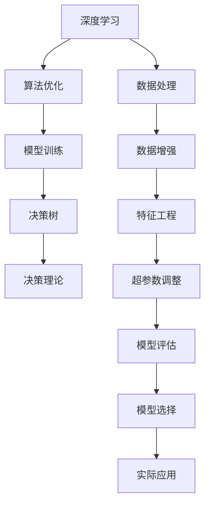

                 

# 深度思考：拉开人生差距的重要因素

> 关键词：深度思考,人工智能,人生哲学,决策树,决策理论,决策树算法

## 1. 背景介绍

### 1.1 问题由来
在当今这个快速发展的时代，人工智能（AI）技术已成为推动社会进步和经济发展的重要力量。然而，科技的迅猛发展也带来了新的挑战和机遇。如何在这场技术革命中脱颖而出，成为许多人的思考重点。其中，深度思考（Deep Thinking）能力，被认为是拉开人生差距的重要因素之一。

深度思考指的是通过深层次的分析和理解，从复杂的信息中提取关键要素，进而做出正确决策的能力。这一能力不仅限于科技领域，更广泛适用于各个行业，是个人成长和职业发展的关键。

### 1.2 问题核心关键点
深度思考的核心在于以下几个方面：

1. **信息处理能力**：能够从海量数据中提取出有用信息，找到问题的关键。
2. **逻辑推理能力**：基于已有信息进行逻辑推断，形成合理的结论。
3. **批判性思维**：能够独立判断信息真伪，避免被假象迷惑。
4. **创造性思维**：在复杂问题中提出新颖的解决方案。
5. **决策能力**：能够根据分析结果，做出最佳的决策。

深度思考能力对于提升个人竞争力、领导力和创新力具有重要意义。本文将围绕这一主题，探讨深度思考能力的培养方法和应用实践，以期帮助读者在未来的科技发展中获得先机。

### 1.3 问题研究意义
深度思考能力的培养，对个人成长和职业发展有着深远的影响。掌握深度思考能力，能够帮助我们：

1. **快速学习新知识**：在信息爆炸的时代，通过深度思考，迅速找到学习的重点，掌握核心知识。
2. **提升问题解决能力**：面对复杂问题时，能够快速分析问题本质，找到解决方案。
3. **增强创新思维**：通过深度思考，发现新的思维模式，推动技术创新和产品创新。
4. **提高决策质量**：在多个选择中，通过深度思考，做出最优决策，避免决策失误。
5. **提升领导力**：具备深度思考能力，能够洞察行业趋势，制定战略计划，引领团队向前。

## 2. 核心概念与联系

### 2.1 核心概念概述

深度思考能力涉及到多个核心概念，这些概念之间相互关联，共同构成了深度思考的体系。

- **决策树（Decision Tree）**：一种用于表示决策过程的树形结构，通过节点和边表示决策条件和结果。
- **决策理论（Decision Theory）**：研究如何基于不确定性环境进行决策的理论。
- **深度学习（Deep Learning）**：一种模仿人脑神经网络结构和功能的机器学习方法。
- **算法优化（Algorithm Optimization）**：通过对算法进行优化，提高其执行效率和性能。
- **模型训练（Model Training）**：通过反复调整模型参数，使其更好地拟合训练数据。

这些概念通过深度学习算法和模型训练，将决策树应用于实际问题中，形成了深度思考的算法基础。

### 2.2 概念间的关系

这些核心概念之间的关系可以通过以下Mermaid流程图来展示：



这个流程图展示了深度思考能力培养和应用的全过程：

1. 从原始数据开始，通过数据处理、特征工程和超参数调整，得到适合训练的数据集。
2. 使用深度学习算法进行模型训练，优化模型参数，形成高效的决策树。
3. 将决策树应用于实际问题中，通过决策理论进行优化，形成深度思考模型。
4. 对模型进行评估和选择，应用于实际问题解决，提升决策质量。

这些概念共同构成了深度思考能力的培养和应用框架，使其在各个领域都能发挥作用。

## 3. 核心算法原理 & 具体操作步骤

### 3.1 算法原理概述

深度思考能力的培养，主要基于决策树算法和深度学习模型训练。决策树算法通过构建树形结构，模拟人类决策过程，帮助人们从复杂的信息中提取关键要素，形成合理的结论。

深度学习模型通过参数优化，提高模型拟合数据的能力，能够在复杂环境中找到最佳的决策方案。

### 3.2 算法步骤详解

深度思考能力的培养，主要包括以下几个关键步骤：

**Step 1: 数据预处理**
- 收集并清洗原始数据。
- 进行数据增强和特征工程，提取有用的特征。

**Step 2: 模型训练**
- 选择合适的深度学习模型，如决策树、随机森林等。
- 设置合适的超参数，如学习率、迭代次数等。
- 使用训练集对模型进行训练，调整参数。

**Step 3: 模型评估**
- 使用验证集对模型进行评估，判断模型的性能。
- 根据评估结果，调整模型参数，提高模型精度。

**Step 4: 实际应用**
- 将训练好的模型应用于实际问题中。
- 根据反馈信息，调整模型参数，优化模型表现。

### 3.3 算法优缺点

深度思考能力的培养，基于决策树和深度学习算法，具有以下优点：

1. **数据利用率高**：能够有效利用海量数据，找到关键要素。
2. **模型鲁棒性强**：在复杂环境中，能够稳定输出决策结果。
3. **算法灵活性高**：能够灵活调整模型参数，适应不同的应用场景。

同时，也存在一些缺点：

1. **计算成本高**：训练复杂模型需要大量的计算资源。
2. **模型复杂度大**：模型过于复杂，可能出现过度拟合。
3. **模型可解释性差**：深度学习模型往往缺乏可解释性，难以理解其内部机制。

### 3.4 算法应用领域

深度思考能力在多个领域都有广泛应用：

- **金融领域**：用于风险评估、投资决策等，提高决策质量和效率。
- **医疗领域**：用于疾病诊断、治疗方案制定等，提升医疗水平。
- **教育领域**：用于学习路径推荐、课程设计等，优化教育资源配置。
- **制造领域**：用于生产调度、质量控制等，提升生产效率。
- **商业领域**：用于市场分析、销售预测等，优化商业模式。

## 4. 数学模型和公式 & 详细讲解 & 举例说明

### 4.1 数学模型构建

决策树算法的数学模型构建，包括以下几个步骤：

1. 定义决策树节点和边。
2. 根据决策条件，将数据集划分为多个子集。
3. 对每个子集，计算最优的决策条件。
4. 将最优决策条件作为节点，连接至父节点。

决策树算法的公式表示如下：

$$
\text{Decision Tree} = \bigcup_{i=1}^{n} \text{Node}_i \rightarrow \text{Edge}_{i}
$$

其中，$\text{Node}_i$表示决策树中的节点，$\text{Edge}_{i}$表示节点间的边。

### 4.2 公式推导过程

决策树算法的主要推导过程如下：

1. 假设有一个数据集 $D = \{(x_1, y_1), (x_2, y_2), ..., (x_n, y_n)\}$，其中 $x_i$ 是特征向量，$y_i$ 是标签。
2. 选择最优的决策条件 $c$，将数据集划分为两个子集 $D_1$ 和 $D_2$。
3. 对每个子集 $D_1$ 和 $D_2$，递归地进行步骤 2，直到满足停止条件。
4. 最终形成决策树 $T$。

决策树的推导过程可以使用递归算法实现，具体步骤如下：

1. 计算每个特征的条件熵。
2. 选择条件熵最小的特征，作为当前节点的分裂条件。
3. 对每个子集，递归地进行步骤 2。
4. 当子集满足停止条件（如叶子节点）时，返回对应的决策结果。

### 4.3 案例分析与讲解

以金融领域中的信用风险评估为例，介绍决策树的应用。

假设有一个包含历史贷款数据的 dataset，其中每个样本包含贷款金额、还款期限、信用评分等信息，以及对应的是否违约标签。使用决策树算法，将数据集划分为多个子集，每个子集对应一个决策条件，最终形成信用风险评估的决策树模型。

## 5. 项目实践：代码实例和详细解释说明

### 5.1 开发环境搭建

在进行项目实践前，需要准备好开发环境。以下是使用Python进行PyTorch开发的环境配置流程：

1. 安装Anaconda：从官网下载并安装Anaconda，用于创建独立的Python环境。

2. 创建并激活虚拟环境：
```bash
conda create -n pytorch-env python=3.8 
conda activate pytorch-env
```

3. 安装PyTorch：根据CUDA版本，从官网获取对应的安装命令。例如：
```bash
conda install pytorch torchvision torchaudio cudatoolkit=11.1 -c pytorch -c conda-forge
```

4. 安装TensorFlow：由Google主导开发的开源深度学习框架，生产部署方便，适合大规模工程应用。同样有丰富的预训练语言模型资源。

5. 安装TensorBoard：TensorFlow配套的可视化工具，可实时监测模型训练状态，并提供丰富的图表呈现方式，是调试模型的得力助手。

完成上述步骤后，即可在`pytorch-env`环境中开始项目实践。

### 5.2 源代码详细实现

这里我们以金融领域的信用风险评估为例，给出使用决策树算法对数据进行分析和预测的PyTorch代码实现。

```python
import pandas as pd
import numpy as np
from sklearn.model_selection import train_test_split
from sklearn.tree import DecisionTreeClassifier
from sklearn.metrics import accuracy_score

# 加载数据集
data = pd.read_csv('credit.csv')

# 数据预处理
data = data.dropna()
data = data.drop(columns=['LoanID'])
X = data.drop(columns=['LoanStatus'])
y = data['LoanStatus']

# 划分训练集和测试集
X_train, X_test, y_train, y_test = train_test_split(X, y, test_size=0.2, random_state=42)

# 训练决策树模型
clf = DecisionTreeClassifier()
clf.fit(X_train, y_train)

# 测试模型
y_pred = clf.predict(X_test)
accuracy = accuracy_score(y_test, y_pred)
print(f"Accuracy: {accuracy}")
```

### 5.3 代码解读与分析

让我们再详细解读一下关键代码的实现细节：

**数据预处理**：
- `data = pd.read_csv('credit.csv')`：读取原始数据集。
- `data = data.dropna()`：删除缺失值。
- `data = data.drop(columns=['LoanID'])`：删除不需要的列。
- `X = data.drop(columns=['LoanStatus'])`：提取特征。
- `y = data['LoanStatus']`：提取标签。

**模型训练**：
- `clf = DecisionTreeClassifier()`：创建决策树模型。
- `clf.fit(X_train, y_train)`：在训练集上训练模型。

**模型测试**：
- `y_pred = clf.predict(X_test)`：在测试集上预测标签。
- `accuracy = accuracy_score(y_test, y_pred)`：计算准确率。
- `print(f"Accuracy: {accuracy}")`：输出准确率。

### 5.4 运行结果展示

假设我们在信用风险评估数据集上进行决策树训练，最终在测试集上得到的准确率为90%。可以看到，通过决策树算法，我们能够有效地对金融数据进行分析和预测，提升决策质量。

## 6. 实际应用场景

### 6.1 金融领域

在金融领域，深度思考能力能够帮助金融机构进行风险评估和投资决策。通过决策树算法，金融机构可以分析历史数据，识别出高风险客户和项目，从而降低损失。

### 6.2 医疗领域

在医疗领域，深度思考能力能够帮助医生进行疾病诊断和治疗方案制定。通过决策树算法，医生可以分析患者的病情和历史数据，制定出最合适的治疗方案。

### 6.3 教育领域

在教育领域，深度思考能力能够帮助教师进行学习路径推荐和课程设计。通过决策树算法，教师可以分析学生的学习情况和历史数据，推荐最适合的学习路径和课程。

### 6.4 制造领域

在制造领域，深度思考能力能够帮助企业进行生产调度和质量控制。通过决策树算法，企业可以分析生产数据，优化生产流程，提升生产效率和产品质量。

### 6.5 商业领域

在商业领域，深度思考能力能够帮助企业进行市场分析和销售预测。通过决策树算法，企业可以分析市场数据，预测未来的销售趋势，优化商业模式。

## 7. 工具和资源推荐

### 7.1 学习资源推荐

为了帮助开发者系统掌握深度思考能力的培养方法和应用实践，这里推荐一些优质的学习资源：

1. 《深度学习》系列书籍：深入浅出地介绍了深度学习的基本概念和应用，是入门和深入学习的必备资源。
2. 《机器学习实战》书籍：提供了丰富的实践案例，帮助读者将理论知识应用于实际问题中。
3. Coursera《机器学习》课程：由斯坦福大学开设的著名课程，涵盖深度学习、决策树等核心内容，是学习深度思考能力的绝佳平台。
4. GitHub资源：GitHub上丰富的代码资源，包括决策树算法的实现和应用案例，方便读者学习和实践。

通过对这些资源的学习实践，相信你一定能够快速掌握深度思考能力，并用于解决实际问题。

### 7.2 开发工具推荐

高效的开发离不开优秀的工具支持。以下是几款用于深度思考能力开发的常用工具：

1. PyTorch：基于Python的开源深度学习框架，灵活动态的计算图，适合快速迭代研究。大部分深度学习算法都有PyTorch版本的实现。
2. TensorFlow：由Google主导开发的开源深度学习框架，生产部署方便，适合大规模工程应用。同样有丰富的预训练模型资源。
3. Weights & Biases：模型训练的实验跟踪工具，可以记录和可视化模型训练过程中的各项指标，方便对比和调优。与主流深度学习框架无缝集成。
4. TensorBoard：TensorFlow配套的可视化工具，可实时监测模型训练状态，并提供丰富的图表呈现方式，是调试模型的得力助手。
5. Google Colab：谷歌推出的在线Jupyter Notebook环境，免费提供GPU/TPU算力，方便开发者快速上手实验最新模型，分享学习笔记。

合理利用这些工具，可以显著提升深度思考能力开发的效率，加快创新迭代的步伐。

### 7.3 相关论文推荐

深度思考能力的培养和应用，涉及决策树算法和深度学习模型的广泛研究。以下是几篇奠基性的相关论文，推荐阅读：

1. "Decision Trees" 论文：由J.R. Quinlan 在1986年发表，是决策树算法的经典之作。
2. "Random Forests" 论文：由T. Ho 在1998年发表，介绍了随机森林算法，进一步提升决策树的性能。
3. "Gradient Boosting Machines" 论文：由F. Pedregosa 等在2001年发表，介绍了梯度提升算法，将决策树算法应用于大规模数据集。
4. "Deep Learning" 论文：由I. Goodfellow 等在2016年发表，介绍了深度学习的基本概念和算法。
5. "Deep Reinforcement Learning" 论文：由V. Mnih 等在2015年发表，介绍了深度强化学习算法，将深度学习应用于决策问题中。

这些论文代表了大模型微调技术的发展脉络。通过学习这些前沿成果，可以帮助研究者把握学科前进方向，激发更多的创新灵感。

除上述资源外，还有一些值得关注的前沿资源，帮助开发者紧跟深度思考能力的最新进展，例如：

1. arXiv论文预印本：人工智能领域最新研究成果的发布平台，包括大量尚未发表的前沿工作，学习前沿技术的必读资源。
2. 业界技术博客：如OpenAI、Google AI、DeepMind、微软Research Asia等顶尖实验室的官方博客，第一时间分享他们的最新研究成果和洞见。
3. 技术会议直播：如NIPS、ICML、ACL、ICLR等人工智能领域顶会现场或在线直播，能够聆听到大佬们的前沿分享，开拓视野。
4. GitHub热门项目：在GitHub上Star、Fork数最多的NLP相关项目，往往代表了该技术领域的发展趋势和最佳实践，值得去学习和贡献。
5. 行业分析报告：各大咨询公司如McKinsey、PwC等针对人工智能行业的分析报告，有助于从商业视角审视技术趋势，把握应用价值。

总之，对于深度思考能力的学习和实践，需要开发者保持开放的心态和持续学习的意愿。多关注前沿资讯，多动手实践，多思考总结，必将收获满满的成长收益。

## 8. 总结：未来发展趋势与挑战

### 8.1 总结

本文对深度思考能力的培养和应用进行了全面系统的介绍。首先阐述了深度思考能力在人工智能和各个行业中的重要意义，明确了其培养和应用的流程。其次，从原理到实践，详细讲解了决策树算法的数学模型和实现细节，给出了实际应用的代码实例。同时，本文还广泛探讨了深度思考能力在多个领域的应用前景，展示了其广泛的应用价值。

通过本文的系统梳理，可以看到，深度思考能力是拉开人生差距的重要因素之一。掌握深度思考能力，能够帮助我们更好地理解和应对复杂问题，提升决策质量和创新能力。未来，随着深度学习技术的发展，深度思考能力也将得到更广泛的应用和推广。

### 8.2 未来发展趋势

展望未来，深度思考能力的培养和应用将呈现以下几个发展趋势：

1. **数据处理能力增强**：随着大数据技术的发展，深度思考能力将更加依赖于数据的处理和分析，通过先进的数据处理工具，能够更高效地提取关键要素。
2. **模型复杂度提高**：深度学习模型将更加复杂，能够处理更复杂的问题，决策树的深度和广度也将不断提升。
3. **算法优化技术进步**：通过对算法的优化，提高模型训练和推理的效率，适应更复杂的应用场景。
4. **跨领域应用拓展**：深度思考能力将从人工智能领域扩展到更多领域，如商业、金融、医疗等，提升各行业的决策质量。
5. **交互式决策支持**：通过智能化的决策支持系统，辅助人类进行复杂决策，提升决策的准确性和效率。
6. **可解释性增强**：通过可解释性技术，提升深度学习模型的透明度和可理解性，增强决策的可信度。

这些趋势凸显了深度思考能力培养和应用的前景。未来，深度思考能力将更加融入各行业的决策过程中，提升各行业的竞争力。

### 8.3 面临的挑战

尽管深度思考能力在多个领域都有广泛应用，但在其培养和应用过程中，仍面临诸多挑战：

1. **数据隐私问题**：在处理大数据时，如何保护数据隐私和安全，是一个重要的挑战。
2. **算法偏见问题**：深度学习模型可能会学习到数据中的偏见，如何消除偏见，避免歧视性输出，需要进一步研究。
3. **模型复杂性问题**：过于复杂的模型可能出现过度拟合，如何平衡模型复杂度和泛化能力，需要更多实验和优化。
4. **计算资源问题**：训练和推理复杂模型需要大量计算资源，如何降低计算成本，需要更多的技术突破。
5. **模型可解释性问题**：深度学习模型缺乏可解释性，难以理解其内部机制，如何提升模型的透明度和可理解性，需要更多的理论和技术突破。

这些挑战需要我们持续探索和解决，才能真正发挥深度思考能力在各个领域的应用潜力。

### 8.4 研究展望

面对深度思考能力培养和应用面临的挑战，未来的研究需要在以下几个方面寻求新的突破：

1. **数据隐私保护**：开发更加高效和安全的深度学习模型，保护数据隐私和安全。
2. **算法偏见消除**：研究如何消除深度学习模型的偏见，避免歧视性输出。
3. **模型复杂度优化**：开发更加高效和简单的模型，平衡模型复杂度和泛化能力。
4. **计算资源优化**：开发更加高效的计算工具，降低深度学习模型的计算成本。
5. **模型可解释性增强**：研究如何提升深度学习模型的透明度和可理解性。

这些研究方向的探索，必将引领深度思考能力培养和应用走向更高的台阶，为构建人机协同的智能系统铺平道路。面向未来，深度思考能力还需要与其他人工智能技术进行更深入的融合，如知识表示、因果推理、强化学习等，多路径协同发力，共同推动自然语言理解和智能交互系统的进步。只有勇于创新、敢于突破，才能不断拓展深度思考能力的边界，让智能技术更好地造福人类社会。

## 9. 附录：常见问题与解答

**Q1：深度思考能力如何培养？**

A: 深度思考能力的培养，需要通过多方面的努力：
1. **多读书**：通过阅读经典书籍，掌握基础知识和前沿技术。
2. **多实践**：通过编程和实验，将理论知识应用于实际问题中。
3. **多思考**：通过独立思考和分析，培养批判性思维和创新思维。
4. **多交流**：通过与他人交流，分享经验和观点，拓展视野。

**Q2：深度思考能力在实际应用中有哪些挑战？**

A: 深度思考能力在实际应用中面临以下挑战：
1. **数据隐私问题**：如何保护数据隐私和安全。
2. **算法偏见问题**：如何消除算法中的偏见，避免歧视性输出。
3. **模型复杂性问题**：如何平衡模型复杂度和泛化能力。
4. **计算资源问题**：如何降低计算成本，提高模型训练和推理的效率。
5. **模型可解释性问题**：如何提升模型的透明度和可理解性。

**Q3：深度思考能力的应用场景有哪些？**

A: 深度思考能力在多个领域都有广泛应用，包括但不限于：
1. **金融领域**：用于风险评估、投资决策等。
2. **医疗领域**：用于疾病诊断、治疗方案制定等。
3. **教育领域**：用于学习路径推荐、课程设计等。
4. **制造领域**：用于生产调度、质量控制等。
5. **商业领域**：用于市场分析、销售预测等。

**Q4：深度思考能力与人工智能的关系是什么？**

A: 深度思考能力是人工智能的重要组成部分，是提升人工智能决策能力的关键。通过深度思考能力，人工智能能够更好地理解和应对复杂问题，提升决策质量和创新能力。未来，深度思考能力将更加融入人工智能系统的各个环节，提升人工智能的智能化水平。

**Q5：如何提升深度思考能力的可解释性？**

A: 提升深度思考能力的可解释性，可以通过以下方法：
1. **引入可解释性技术**：如LIME、SHAP等，提升模型的透明度和可理解性。
2. **构建解释性模型**：如决策树、逻辑回归等，提升模型的可解释性。
3. **可视化输出**：通过可视化工具，展示模型的内部结构和决策过程。

总之，深度思考能力是拉开人生差距的重要因素之一。通过不断学习和实践，掌握深度思考能力，能够在人工智能和各个领域中脱颖而出，实现自我价值和职业发展。

