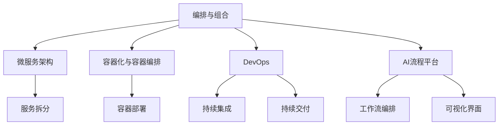
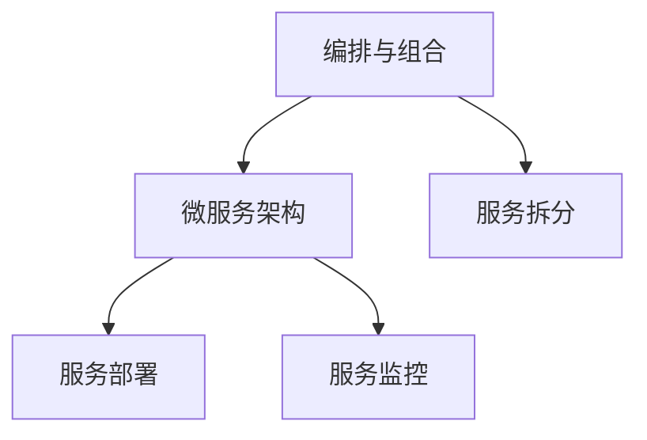
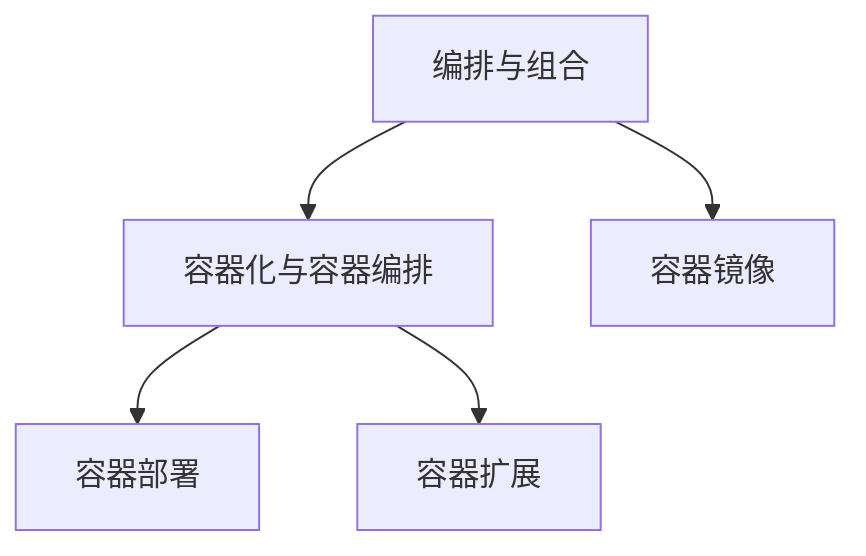
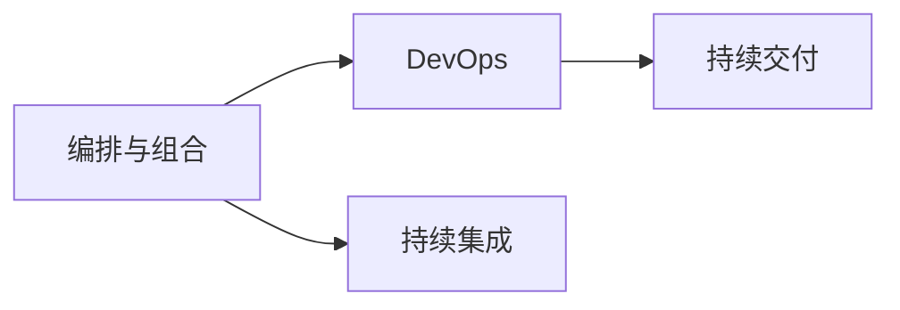
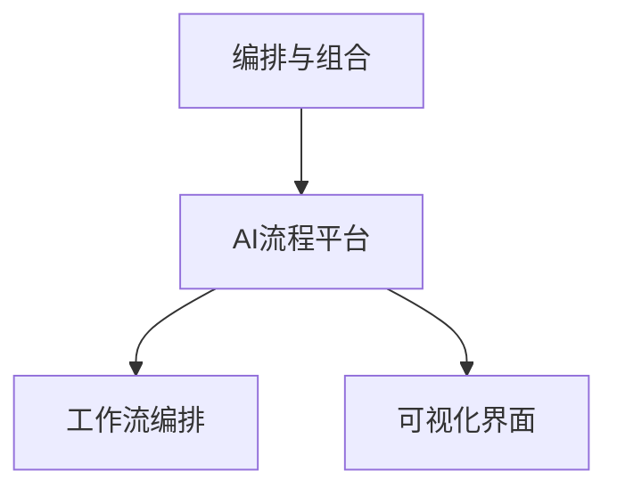
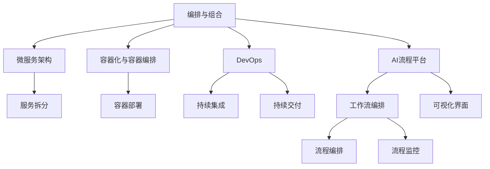

                 

## 1. 背景介绍

### 1.1 问题由来
人工智能（AI）技术在各行各业中得以广泛应用，尤其是在大数据驱动、信息密集型领域，AI技术已成为提升效率、优化决策的强大引擎。但随着AI应用的不断深入，从模型开发到部署，再到监控维护的各个环节，都面临着复杂度高、流程繁琐的问题。如何提高AI开发和运维的灵活性和可扩展性，成为当下亟需解决的技术痛点。

### 1.2 问题核心关键点
为了应对上述问题，本文聚焦于基于编排与组合的AI流程自动化，旨在提供一种高度灵活、可配置的解决方案。通过自动化编排与组合，能够提升AI应用的开发效率，降低运维成本，增强模型的灵活性和泛化能力。

### 1.3 问题研究意义
研究基于编排与组合的AI流程自动化，对于推动AI技术的广泛应用，加速各个行业数字化转型，提升生产力和服务质量，具有重要意义：

1. 提升开发效率：通过自动化编排与组合，可以快速构建和部署模型，缩短从需求到交付的时间周期。
2. 降低运维成本：自动化流程可以减少人工干预，降低错误率，提升系统稳定性和可靠性。
3. 增强模型灵活性：通过组合不同模型，可以构建高度定制化的AI解决方案，满足特定需求。
4. 优化资源利用：通过编排，合理分配计算、存储资源，提高系统整体效率。
5. 加速迭代更新：通过组合与更新，可以快速应对环境变化，实现模型迭代优化。

## 2. 核心概念与联系

### 2.1 核心概念概述

为更好地理解基于编排与组合的AI流程自动化，本节将介绍几个密切相关的核心概念：

- 编排与组合(Orchestration and Composition)：指通过编程语言、编排引擎等工具，对AI模型的开发、训练、部署、监控等各个环节进行自动化编排和组合的过程。编排主要负责流程的编排和调度，组合则负责模型的融合和优化。
- 微服务架构(Microservices Architecture)：一种将应用程序拆分为一系列微服务的架构设计，每个微服务独立运行、相互通信。这种架构设计能够提升系统的可维护性、可扩展性和灵活性。
- 容器化与容器编排(Kubernetes)：通过容器化技术将应用程序打包成镜像，并通过容器编排工具(Kubernetes)进行自动化部署和扩展。
- DevOps（开发运维一体化）：一种以文化和实践为基础的组织构建模式，通过自动化和协作，加快软件交付和改进开发与运维的工作流。
- AI流程平台(AI Workflow Platform)：一种支持编排与组合的AI自动化平台，通过可视化界面、工作流引擎等，实现AI开发和运维流程的自动化。

这些核心概念之间的逻辑关系可以通过以下Mermaid流程图来展示：



这个流程图展示了一些关键概念之间的关系：

1. 编排与组合可以将微服务架构、容器化与容器编排、DevOps、AI流程平台等技术手段有机结合，实现AI开发和运维流程的自动化。
2. 微服务架构通过服务拆分，提升系统的可维护性和可扩展性。
3. 容器化与容器编排通过容器化技术，实现应用的快速部署和扩展。
4. DevOps通过持续集成和持续交付，提升软件交付效率。
5. AI流程平台提供工作流编排和可视化界面，使编排与组合更加直观和易于实现。

### 2.2 概念间的关系

这些核心概念之间存在着紧密的联系，形成了基于编排与组合的AI流程自动化的完整生态系统。下面我们通过几个Mermaid流程图来展示这些概念之间的关系。

#### 2.2.1 编排与组合与微服务架构



这个流程图展示了编排与组合如何与微服务架构结合，通过服务拆分、部署和监控，实现微服务的自动化管理。

#### 2.2.2 编排与组合与容器化



这个流程图展示了编排与组合如何通过容器化技术实现应用的快速部署和扩展。

#### 2.2.3 编排与组合与DevOps



这个流程图展示了编排与组合如何与DevOps结合，通过持续集成和持续交付，提升软件交付效率。

#### 2.2.4 编排与组合与AI流程平台



这个流程图展示了编排与组合如何通过AI流程平台实现流程编排与组合的自动化。

### 2.3 核心概念的整体架构

最后，我们用一个综合的流程图来展示这些核心概念在大规模编排与组合中的整体架构：



这个综合流程图展示了从编排与组合到微服务架构、容器化与容器编排、DevOps、AI流程平台，以及其内部的具体实现和功能模块，形成了基于编排与组合的AI流程自动化的完整生态系统。

## 3. 核心算法原理 & 具体操作步骤
### 3.1 算法原理概述

基于编排与组合的AI流程自动化，核心在于通过编排工具实现工作流的自动化编排和调度，通过组合工具实现模型的融合和优化。其基本原理如下：

1. **编排原理**：编排工具通过定义和调度一系列编排脚本或工作流，实现不同环节（如模型训练、部署、监控等）的自动化执行。编排脚本或工作流通常由编排引擎解释执行，支持多步骤、多任务的灵活编排和调度。
2. **组合原理**：组合工具通过组合不同模型或组件，构建新的功能模型或服务。组合过程通常基于模型融合、参数共享等技术，实现模型的融合和优化。

### 3.2 算法步骤详解

基于编排与组合的AI流程自动化一般包括以下几个关键步骤：

**Step 1: 定义编排与组合流程**

- 分析任务需求，确定各环节的任务和目标。
- 定义编排脚本或工作流，明确每个任务的输入、输出和执行步骤。
- 使用编排工具（如Kubernetes、Airflow等）配置编排脚本或工作流。

**Step 2: 编排脚本或工作流执行**

- 编排工具根据配置的编排脚本或工作流，自动调度各任务的执行。
- 在每个任务执行过程中，监控任务状态和进度，及时处理异常。
- 使用日志和指标记录任务执行过程，便于后续分析和改进。

**Step 3: 组合模型或组件**

- 根据任务需求，选择合适的预训练模型或组件。
- 使用组合工具（如PyTorch Hub、TensorFlow Hub等）获取预训练模型或组件。
- 对预训练模型或组件进行微调、融合等操作，构建新的功能模型或服务。

**Step 4: 部署与监控**

- 将组合后的模型或服务部署到生产环境。
- 使用容器化技术（如Docker）将模型或服务打包成镜像。
- 使用容器编排工具（如Kubernetes）实现模型的自动部署和扩展。
- 持续监控模型的性能和状态，及时发现和处理异常。

### 3.3 算法优缺点

基于编排与组合的AI流程自动化，具有以下优点：

1. **灵活性和可扩展性**：通过编排和组合，能够灵活配置和扩展AI应用，快速应对环境变化和需求变化。
2. **开发效率提升**：自动化编排和组合能够缩短开发周期，提升开发效率。
3. **系统可靠性提升**：自动化流程可以减少人工干预，降低错误率，提升系统稳定性和可靠性。
4. **成本降低**：通过容器化、容器编排等技术，能够优化资源利用，降低运维成本。

同时，也存在以下缺点：

1. **复杂度高**：编排和组合过程可能涉及多个环节和组件，导致整体复杂度增加。
2. **学习曲线陡峭**：需要掌握多种技术和工具，可能增加学习成本。
3. **性能瓶颈**：编排和组合过程中可能存在性能瓶颈，需要优化流程和配置。

### 3.4 算法应用领域

基于编排与组合的AI流程自动化，已经在多个领域得到应用，例如：

- **金融风控**：通过编排与组合，构建实时风险评估和预警系统，提升金融风控效率和精度。
- **智能客服**：通过编排与组合，实现智能客服系统的自动化构建和运维，提升客户体验。
- **医疗诊断**：通过编排与组合，构建自动化的医疗诊断和治疗方案推荐系统，提高医疗服务质量。
- **智慧城市**：通过编排与组合，构建智能交通、智能安防等智慧城市应用，提升城市治理水平。
- **物流管理**：通过编排与组合，构建智能物流系统和仓储管理平台，提升物流效率和准确性。

除了上述这些应用领域，基于编排与组合的AI流程自动化还在工业制造、教育培训、农业管理等更多行业得到广泛应用，推动了各行业的数字化转型。

## 4. 数学模型和公式 & 详细讲解 & 举例说明

### 4.1 数学模型构建

在编排与组合的过程中，通常涉及多种数学模型和算法。这里以机器学习模型的组合为例，展示如何构建数学模型。

假设我们有两个预训练的机器学习模型 $M_1$ 和 $M_2$，分别用于不同的任务。通过组合，可以构建一个新的复合模型 $M_{comb}$，其输出为 $M_1$ 和 $M_2$ 的组合结果。

设 $M_1$ 的输入为 $x$，输出为 $y_1$，$M_2$ 的输入为 $x$，输出为 $y_2$，则 $M_{comb}$ 的输出 $y_{comb}$ 可以表示为：

$$
y_{comb} = f(y_1, y_2) = \alpha y_1 + (1-\alpha) y_2
$$

其中，$\alpha$ 为权重系数，通常通过交叉验证等方式确定。

### 4.2 公式推导过程

为了使 $M_{comb}$ 能够适应特定任务，通常需要在训练过程中调整 $\alpha$ 的值。假设我们有 $N$ 个训练样本 $(x_i, y_i)$，则最小化损失函数 $\mathcal{L}$ 的目标为：

$$
\mathcal{L} = \frac{1}{N}\sum_{i=1}^N \left( f(y_{comb}, y_i) - y_i \right)^2
$$

其中 $f(y_{comb}, y_i)$ 表示将 $y_{comb}$ 作为预测结果时，模型对样本 $i$ 的损失。

使用梯度下降等优化算法，最小化损失函数，求得 $\alpha$ 的值为：

$$
\alpha = \frac{\mathcal{L}(y_1, y_i)}{\mathcal{L}(y_1, y_i) + \mathcal{L}(y_2, y_i)}
$$

### 4.3 案例分析与讲解

以医疗影像分析为例，通过编排与组合，可以构建一个自动化的影像分析系统。假设我们有两个预训练的图像分类模型 $M_1$ 和 $M_2$，分别用于检测肿瘤和病变。

1. **编排流程**：通过编排工具，定义影像处理、分类和分析的编排流程。包括数据预处理、模型选择、参数调整、结果汇总等步骤。
2. **组合模型**：通过组合工具，将 $M_1$ 和 $M_2$ 的输出结果进行加权组合，构建新的复合模型 $M_{comb}$。例如，可以根据肿瘤和病变的严重程度，赋予不同的权重系数 $\alpha$，使得系统能够综合考虑肿瘤和病变的影响。
3. **部署与监控**：通过容器化技术将 $M_{comb}$ 打包成镜像，使用容器编排工具实现自动部署和扩展。在部署过程中，进行必要的监控和日志记录，及时发现和处理异常。

通过编排与组合，医疗影像分析系统能够高效、准确地进行肿瘤和病变的检测和分析，提升医疗服务质量和效率。

## 5. 项目实践：代码实例和详细解释说明

### 5.1 开发环境搭建

在进行编排与组合的AI流程自动化实践前，我们需要准备好开发环境。以下是使用Python进行Docker容器编排和编排工具（如Kubernetes）开发的环境配置流程：

1. 安装Docker：从官网下载并安装Docker，用于构建和运行Docker容器。
2. 安装Kubernetes：从官网下载并安装Kubernetes，用于容器编排和管理。
3. 安装相关开发工具：如Python、Jupyter Notebook、Airflow等，便于开发和部署。
4. 配置Docker和Kubernetes环境：通过配置文件和命令，设置Docker和Kubernetes的运行环境。

完成上述步骤后，即可在Docker和Kubernetes环境中开始编排与组合的AI流程自动化实践。

### 5.2 源代码详细实现

这里以Docker容器编排和Kubernetes编排工具为例，给出编排与组合的AI流程自动化的代码实现。

1. **Docker容器编排**：

```python
import docker
from docker import DockerClient

client = DockerClient(base_url='unix://var/run/docker.sock')

# 构建Docker镜像
image, _ = client.images.build(path='path/to/Dockerfile')
print('Image built: {}'.format(image.id))

# 运行Docker容器
container = client.containers.run(image.id, detach=True, ports={'8080/tcp': 8080})
print('Container started: {}'.format(container.id))
```

2. **Kubernetes编排**：

```yaml
apiVersion: batch/v1
kind: CronJob
metadata:
  name: my-cronjob
spec:
  schedule: "*/5 * * * *"
  jobTemplate:
    spec:
      template:
        spec:
          containers:
          - name: my-container
            image: my-image:latest
            resources:
              limits:
                memory: "256Mi"
              requests:
                memory: "128Mi"
          restartPolicy: OnFailure
```

3. **编排与组合的完整代码实现**：

```python
from airflow import DAG
from airflow.operators.docker_operator import DockerOperator

default_args = {'owner': 'airflow', 'depends_on_past': False, 'start_date': datetime(2022, 1, 1), 'retries': 1}

dag = DAG('编排与组合的AI流程自动化', default_args=default_args, schedule_interval='@daily')

# 编排流程
t1 = DockerOperator(
    task_id='t1',
    docker_url='unix://var/run/docker.sock',
    image='my-image',
    container_name='t1-container',
    command='echo Hello World',
    dag=dag,
)

# 组合模型
t2 = DockerOperator(
    task_id='t2',
    docker_url='unix://var/run/docker.sock',
    image='my-image-combined',
    container_name='t2-container',
    command='echo Hello World',
    dag=dag,
)

# 监控流程
t3 = DockerOperator(
    task_id='t3',
    docker_url='unix://var/run/docker.sock',
    image='my-monitor',
    container_name='t3-container',
    command='echo Hello World',
    dag=dag,
)
```

### 5.3 代码解读与分析

让我们再详细解读一下关键代码的实现细节：

**Docker容器编排**：
- 使用DockerClient类构建Docker镜像。
- 使用containers.run方法运行Docker容器，设置容器端口映射等参数。

**Kubernetes编排**：
- 使用YAML格式定义Kubernetes的CronJob，指定任务执行时间、容器镜像等参数。

**编排与组合的完整代码实现**：
- 使用Airflow的DAG定义编排与组合的AI流程自动化任务。
- 通过DockerOperator实现Docker容器的编排和组合。
- 使用DockerOperator实现监控任务的编排。

**代码解读**：
- 在编排与组合的AI流程自动化中，Docker容器和Kubernetes编排工具都起到了关键作用。
- 使用Airflow的DAG定义编排流程，通过DockerOperator实现容器编排和组合。
- 通过DockerOperator配置监控任务，实现对系统状态的实时监控和记录。

**运行结果展示**：
- 在运行上述代码后，系统将按照定义的编排流程，依次执行Docker容器和监控任务，实现AI流程的自动化编排与组合。

## 6. 实际应用场景

### 6.1 智能客服系统

基于编排与组合的AI流程自动化，可以广泛应用于智能客服系统的构建。传统客服往往需要配备大量人力，高峰期响应缓慢，且一致性和专业性难以保证。而使用编排与组合的AI流程自动化，可以7x24小时不间断服务，快速响应客户咨询，用自然流畅的语言解答各类常见问题。

在技术实现上，可以收集企业内部的历史客服对话记录，将问题和最佳答复构建成监督数据，在此基础上对编排与组合的AI流程自动化进行配置和调整。编排与组合的AI流程自动化能够自动理解用户意图，匹配最合适的答案模板进行回复。对于客户提出的新问题，还可以接入检索系统实时搜索相关内容，动态组织生成回答。如此构建的智能客服系统，能大幅提升客户咨询体验和问题解决效率。

### 6.2 金融舆情监测

金融机构需要实时监测市场舆论动向，以便及时应对负面信息传播，规避金融风险。传统的人工监测方式成本高、效率低，难以应对网络时代海量信息爆发的挑战。基于编排与组合的AI流程自动化技术，为金融舆情监测提供了新的解决方案。

具体而言，可以收集金融领域相关的新闻、报道、评论等文本数据，并对其进行主题标注和情感标注。在此基础上对编排与组合的AI流程自动化进行配置和调整，使其能够自动判断文本属于何种主题，情感倾向是正面、中性还是负面。将编排与组合的AI流程自动化应用到实时抓取的网络文本数据，就能够自动监测不同主题下的情感变化趋势，一旦发现负面信息激增等异常情况，系统便会自动预警，帮助金融机构快速应对潜在风险。

### 6.3 个性化推荐系统

当前的推荐系统往往只依赖用户的历史行为数据进行物品推荐，无法深入理解用户的真实兴趣偏好。基于编排与组合的AI流程自动化技术，个性化推荐系统可以更好地挖掘用户行为背后的语义信息，从而提供更精准、多样的推荐内容。

在实践中，可以收集用户浏览、点击、评论、分享等行为数据，提取和用户交互的物品标题、描述、标签等文本内容。将文本内容作为模型输入，用户的后续行为（如是否点击、购买等）作为监督信号，在此基础上编排与组合的AI流程自动化进行配置和调整。编排与组合的AI流程自动化能够从文本内容中准确把握用户的兴趣点。在生成推荐列表时，先用候选物品的文本描述作为输入，由编排与组合的AI流程自动化预测用户的兴趣匹配度，再结合其他特征综合排序，便可以得到个性化程度更高的推荐结果。

### 6.4 未来应用展望

随着编排与组合的AI流程自动化的不断发展，其在更多领域得到应用，为传统行业带来变革性影响。

在智慧医疗领域，基于编排与组合的AI流程自动化技术，构建自动化的医疗诊断和治疗方案推荐系统，提高医疗服务质量。

在智能教育领域，编排与组合的AI流程自动化技术，应用于作业批改、学情分析、知识推荐等方面，因材施教，促进教育公平，提高教学质量。

在智慧城市治理中，编排与组合的AI流程自动化技术，应用于城市事件监测、舆情分析、应急指挥等环节，提高城市管理的自动化和智能化水平，构建更安全、高效的未来城市。

此外，在企业生产、社会治理、文娱传媒等众多领域，编排与组合的AI流程自动化技术也将不断涌现，为经济社会发展注入新的动力。相信随着技术的日益成熟，编排与组合的AI流程自动化必将在构建人机协同的智能时代中扮演越来越重要的角色。

## 7. 工具和资源推荐
### 7.1 学习资源推荐

为了帮助开发者系统掌握编排与组合的AI流程自动化的理论基础和实践技巧，这里推荐一些优质的学习资源：

1. Kubernetes官方文档：作为容器编排的主流工具，Kubernetes提供了详细的官方文档和教程，涵盖从基础配置到高级调优的全面内容。
2. Docker官方文档：作为容器化技术的主流工具，Docker提供了详实的官方文档和教程，涵盖从容器构建到容器编排的全面内容。
3. DevOps社区：DevOps社区是DevOps技术的交流平台，提供大量的实践经验和最佳实践。
4. AI流程平台工具文档：如Jenkins、Airflow等AI流程平台，提供了详细的用户手册和教程。
5. 开源社区：如GitHub、GitLab等开源社区，提供了大量基于编排与组合的AI流程自动化的开源项目和案例。

通过对这些资源的学习实践，相信你一定能够快速掌握编排与组合的AI流程自动化的精髓，并用于解决实际的AI问题。
###  7.2 开发工具推荐

高效的开发离不开优秀的工具支持。以下是几款用于编排与组合的AI流程自动化开发的常用工具：

1. Docker：开源的容器化技术，提供简单易用的容器构建和运行工具。
2. Kubernetes：开源的容器编排工具，提供自动化的容器部署和管理功能。
3. Jenkins：开源的持续集成和持续交付工具，提供丰富的插件和配置选项。
4. Airflow：开源的工作流编排工具，提供可视化的编排界面和灵活的配置选项。
5. TensorFlow：开源的机器学习框架，提供丰富的模型和组件库，支持编排与组合的AI流程自动化。
6. PyTorch：开源的机器学习框架，提供丰富的模型和组件库，支持编排与组合的AI流程自动化。

合理利用这些工具，可以显著提升编排与组合的AI流程自动化的开发效率，加快创新迭代的步伐。

### 7.3 相关论文推荐

编排与组合的AI流程自动化技术的发展源于学界的持续研究。以下是几篇奠基性的相关论文，推荐阅读：

1. Containers and Kubernetes: The Journey So Far and Where We're Headed：介绍Kubernetes的发展历程和未来展望，提供全面的技术解析。
2. Docker in Practice: Dockerfile Best Practices：介绍Docker最佳实践，提供详细的配置和调优指南。
3. Kubernetes in Action：详细介绍Kubernetes的使用方法和最佳实践，提供丰富的实战案例。
4. DevOps：The Culture and Practices of Collaborative Software Development：介绍DevOps的核心思想和实践方法，提供深度的理论解析。
5. Machine Learning Operations (MLOps)：MLOps in Practice：介绍MLOps的实践方法和最佳实践，提供详细的案例分析和指导。

这些论文代表了大规模编排与组合的AI流程自动化的发展脉络。通过学习这些前沿成果，可以帮助研究者把握学科前进方向，激发更多的创新灵感。

除上述资源外，还有一些值得关注的前沿资源，帮助开发者紧跟编排与组合的AI流程自动化的最新进展，例如：

1. arXiv论文预印本：人工智能领域最新研究成果的发布平台，包括大量尚未发表的前沿工作，学习前沿技术的必读资源。
2. 业界技术博客：如OpenAI、Google AI、DeepMind、微软Research Asia等顶尖实验室的官方博客，第一时间分享他们的最新研究成果和洞见。
3. 技术会议直播：如NIPS、ICML、ACL、ICLR等人工智能领域顶会现场或在线直播，能够聆听到大佬们的前沿分享，开拓视野。
4. GitHub热门项目：在GitHub上Star、Fork数最多的编排与组合的AI流程自动化相关项目，往往代表了该技术领域的发展趋势和最佳实践，值得去学习和贡献。
5. 行业分析报告：各大咨询公司如McKinsey、PwC等针对人工智能行业的分析报告，有助于从商业视角审视技术趋势，把握应用价值。

总之，对于编排与组合的AI流程自动化的学习，需要开发者保持开放的心态和持续学习的意愿。多关注前沿资讯，多动手实践，多思考总结，必将收获满满的成长收益。

## 8. 总结：未来发展趋势与挑战

### 8.1 总结

本文对基于编排与组合的AI流程自动化进行了全面系统的介绍。首先阐述了编排与组合的核心思想和实际应用场景，明确了其在提升AI开发和运维效率、灵活性和可扩展性方面的独特价值。其次，从原理到实践，详细讲解了编排与组合的数学模型和关键操作步骤，给出了编排与组合的AI流程自动化的代码实现。同时，本文还广泛探讨了编排与组合技术在智能客服、金融舆情、个性化推荐等多个行业领域的应用前景，展示了编排与组合技术的巨大潜力。

通过本文的系统梳理，可以看到，编排与组合的

