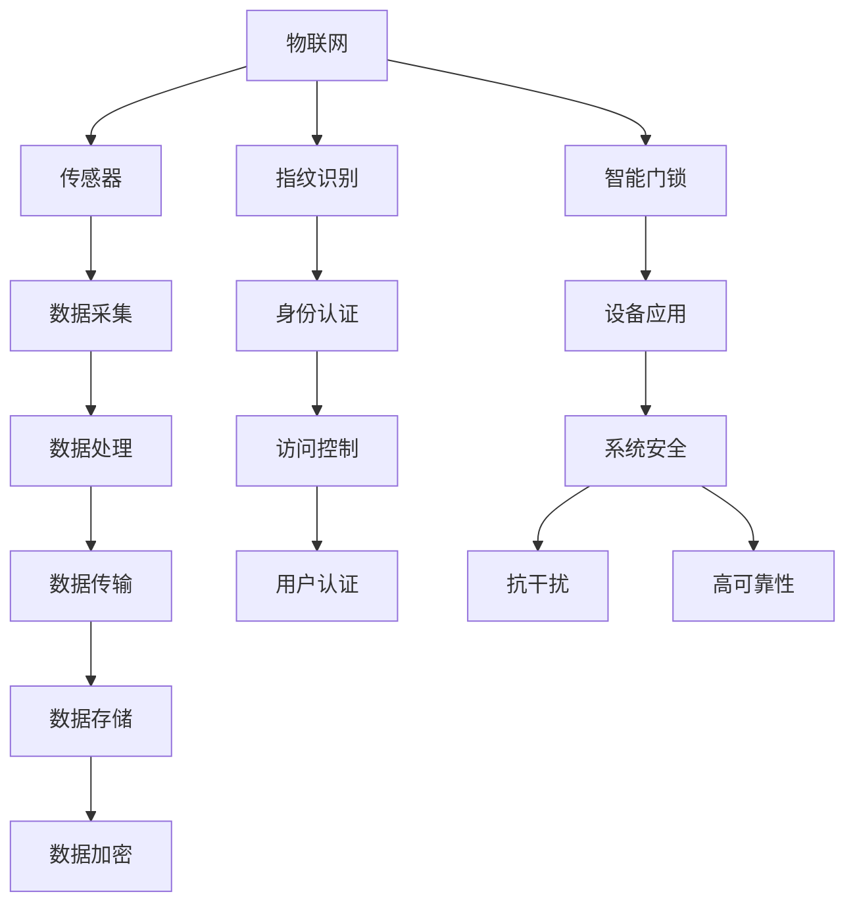
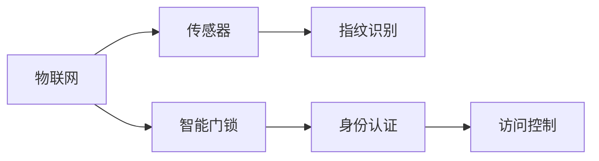
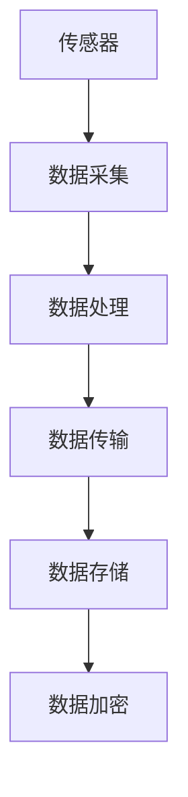
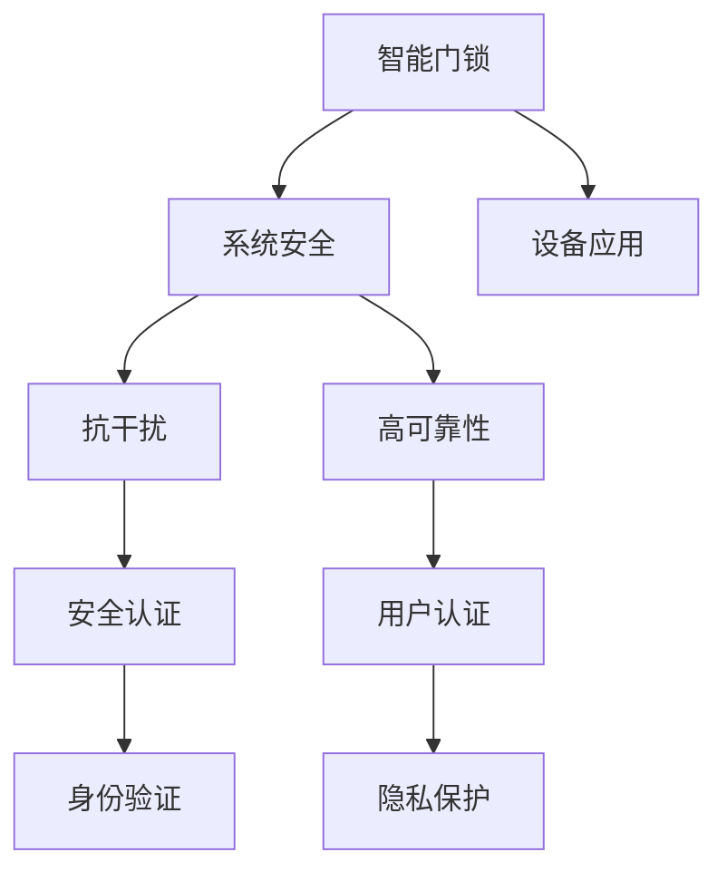

                 

# 物联网(IoT)技术和各种传感器设备的集成：指纹传感器的安全应用

> 关键词：物联网,传感器,指纹识别,智能门锁,隐私保护,数据加密

## 1. 背景介绍

### 1.1 问题由来

随着物联网(IoT)技术的快速发展，各种传感器设备的应用范围日益广泛，涵盖了智能家居、智慧城市、智能安防、工业制造等多个领域。传感器设备以其多样化的感知能力，为物联网应用提供了丰富的数据来源，是实现智能化、自动化和信息化不可或缺的基础设施。

在众多传感器设备中，指纹传感器因其便携性、识别准确性高和数据私密性强的特点，得到了广泛应用。特别是在安全领域，指纹传感器常用于智能门锁、身份认证、支付验证等场景，极大地提升了安全性。但同时，指纹数据作为一种高度敏感的个人隐私信息，其安全性和保护问题也备受关注。

为了进一步发挥指纹传感器的安全应用潜力，本文将深入探讨如何将物联网技术与指纹传感器集成，构建高效、安全的指纹识别系统，并提供全面的安全保护措施，确保指纹数据的安全性，同时提升用户体验。

### 1.2 问题核心关键点

指纹传感器在物联网安全应用中，主要面临以下核心关键问题：

- **数据采集与处理**：指纹传感器的信号采集和数据处理对算法和硬件性能都有较高要求。
- **数据传输与存储**：指纹数据需要在设备和云端之间安全传输和存储，防止数据泄露。
- **隐私保护与认证**：指纹数据需要严格保护，防止未授权访问和数据篡改。
- **系统安全性与可靠性**：指纹识别系统需要具备高可靠性和抗干扰能力，以应对恶意攻击和环境变化。
- **用户体验与便捷性**：指纹识别系统需要操作简单、响应快速，提高用户的使用体验。

解决这些问题需要综合考虑硬件、软件、网络和安全等多方面因素，构建一套全面的解决方案。

## 2. 核心概念与联系

### 2.1 核心概念概述

为了更好地理解指纹传感器在物联网中的应用，本节将介绍几个密切相关的核心概念：

- **物联网(IoT)**：通过网络技术将物理世界的各种设备和物体互联，实现智能化管理和控制。物联网技术的应用场景广泛，涉及智能家居、智慧城市、智能制造等多个领域。
- **传感器**：用于感知物理世界信号的设备，包括温度、湿度、压力、位置等多种类型。传感器数据为物联网系统提供了实时、可靠的信息来源。
- **指纹识别**：通过分析指纹的形态、特征等数据，进行身份验证和识别的技术。指纹识别具有识别准确率高、数据私密性强等优点。
- **智能门锁**：利用指纹识别等技术，实现身份认证和门禁管理，增强住宅和商业场所的安全性。
- **数据加密**：通过加密算法对数据进行加密保护，防止数据在传输和存储过程中被未授权访问。
- **隐私保护**：在数据收集、传输和存储等环节，采用隐私保护技术，确保数据不被滥用。

这些核心概念之间的逻辑关系可以通过以下Mermaid流程图来展示：



这个流程图展示了指纹传感器在物联网中的应用流程：

1. 物联网通过传感器采集环境数据，为应用提供信息来源。
2. 智能门锁利用指纹识别进行身份认证和门禁管理。
3. 指纹数据通过加密处理、隐私保护等技术，保证数据安全。
4. 数据在设备之间传输和存储，通过访问控制和用户认证保障系统安全。
5. 系统具备高可靠性和抗干扰能力，确保指纹识别的准确性。

### 2.2 概念间的关系

这些核心概念之间存在着紧密的联系，形成了指纹传感器在物联网安全应用中的完整生态系统。下面通过几个Mermaid流程图来展示这些概念之间的关系。

#### 2.2.1 物联网与指纹识别



这个流程图展示了物联网技术在智能门锁中的应用：

1. 物联网通过传感器收集环境数据，用于智能门锁的识别和控制。
2. 智能门锁利用指纹识别技术进行身份认证。
3. 认证通过后，系统开放访问控制权限。

#### 2.2.2 数据采集与传输



这个流程图展示了数据从采集到传输和存储的全过程：

1. 传感器采集环境数据，通过数据采集处理后，传输到云端或本地存储设备。
2. 传输过程中，采用数据加密技术，确保数据安全。
3. 存储在设备或云端的指纹数据，进一步采用加密保护措施，防止未授权访问。

#### 2.2.3 系统安全与隐私保护



这个流程图展示了系统安全与隐私保护的重要环节：

1. 智能门锁系统具备高可靠性和抗干扰能力，保障系统运行稳定。
2. 系统进行安全认证和身份验证，防止未授权访问。
3. 用户认证通过后，隐私保护措施防止数据滥用。
4. 设备和应用系统具备完整的应用功能。

## 3. 核心算法原理 & 具体操作步骤

### 3.1 算法原理概述

指纹传感器在物联网安全应用中，主要通过以下算法原理实现：

1. **传感器信号采集**：使用电容、超声波等技术，采集指纹的形态和特征数据。
2. **数据处理与预处理**：通过信号放大、降噪等技术，对采集到的指纹数据进行预处理，去除噪声和干扰。
3. **特征提取**：通过数学算法，如傅里叶变换、灰度共生矩阵等，提取指纹的特征向量。
4. **模式匹配与识别**：将指纹特征向量与预定义的指纹库进行匹配，识别指纹身份。
5. **数据加密与传输**：采用加密算法，如AES、RSA等，对指纹数据进行加密保护，确保数据安全。
6. **隐私保护与认证**：采用隐私保护技术，如差分隐私、联邦学习等，保护指纹数据的隐私。
7. **系统安全与可靠性**：采用抗干扰技术，如抗噪声算法、鲁棒性算法等，提升系统的鲁棒性和可靠性。

### 3.2 算法步骤详解

以下将详细阐述指纹传感器在物联网应用中的各个算法步骤：

**Step 1: 传感器信号采集**

指纹传感器利用电容或超声波技术，对用户手指表面进行扫描，采集指纹的形态和特征数据。具体步骤如下：

1. 用户手指接触传感器表面，传感器发射高频信号，信号通过皮肤反射后回到传感器。
2. 传感器接收反射信号，并进行放大和降噪处理。
3. 将信号转换为数字信号，输出到数据处理单元。

**Step 2: 数据处理与预处理**

为了提高信号采集的准确性和可靠性，对采集到的数据进行预处理：

1. 使用低通滤波器，去除高频噪声。
2. 使用自适应阈值方法，将信号二值化，提高处理效率。
3. 对二值化后的信号进行形态学操作，如开运算、闭运算等，去除毛刺和断裂。
4. 使用傅里叶变换，对处理后的信号进行频域分析，提取频谱特征。

**Step 3: 特征提取**

通过傅里叶变换和灰度共生矩阵等数学算法，提取指纹的特征向量。具体步骤如下：

1. 对处理后的信号进行频域分析，得到频率谱分布。
2. 将频率谱分布转化为图像形式，使用灰度共生矩阵算法，提取纹理特征。
3. 将纹理特征与预定义的指纹特征模板进行对比，提取指纹特征向量。

**Step 4: 模式匹配与识别**

将指纹特征向量与预定义的指纹库进行匹配，识别指纹身份。具体步骤如下：

1. 将指纹特征向量输入到模式匹配算法，如DCT、DWT等。
2. 对指纹特征向量进行降维处理，减少计算复杂度。
3. 使用欧式距离或余弦相似度等算法，计算指纹特征向量与指纹库的相似度。
4. 根据相似度值，判断指纹身份，输出识别结果。

**Step 5: 数据加密与传输**

对指纹数据进行加密保护，确保数据在传输过程中的安全性。具体步骤如下：

1. 使用AES或RSA等加密算法，对指纹特征向量进行加密。
2. 将加密后的指纹数据进行分组，使用TCP/IP协议进行传输。
3. 在传输过程中，采用SSL/TLS协议，保证数据加密传输。
4. 接收端对数据进行解密和验证，确保数据的完整性和真实性。

**Step 6: 隐私保护与认证**

采用隐私保护技术和身份认证机制，确保指纹数据的安全性和用户身份的合法性。具体步骤如下：

1. 使用差分隐私技术，对指纹数据进行扰动，防止数据泄露。
2. 采用联邦学习技术，在本地设备上进行模型训练，不将数据传输到云端。
3. 使用生物特征认证技术，如人脸识别、语音识别等，辅助指纹认证，增强安全性。
4. 采用多因素认证技术，如密码、PIN码等，提高身份认证的可靠性。

**Step 7: 系统安全与可靠性**

采用抗干扰技术和鲁棒性算法，提升系统的鲁棒性和可靠性。具体步骤如下：

1. 采用抗噪声算法，如去噪自适应滤波器，提高信号采集的准确性。
2. 使用鲁棒性算法，如随机投影、奇异值分解等，增强特征提取的鲁棒性。
3. 采用自适应学习算法，如支持向量机、神经网络等，提高模式匹配的准确性。
4. 使用数据冗余和容错技术，提高系统的可靠性和鲁棒性。

### 3.3 算法优缺点

指纹传感器在物联网安全应用中，具有以下优点：

- **高安全性**：指纹数据作为高度敏感的个人隐私信息，具有天然的不可复制性和唯一性，难以被伪造和盗用。
- **便携性**：指纹传感器体积小，易于集成到各种物联网设备中。
- **高性能**：指纹识别技术具有高识别准确率和高速响应，适合各种应用场景。

同时，指纹传感器也存在一些缺点：

- **隐私问题**：指纹数据需要在设备和云端之间传输和存储，存在隐私泄露风险。
- **硬件要求高**：指纹传感器对硬件性能要求较高，成本较高。
- **环境适应性差**：指纹传感器对环境因素（如湿度、灰尘）较为敏感，识别效果可能受影响。

### 3.4 算法应用领域

指纹传感器在物联网安全应用中，主要应用于以下几个领域：

- **智能门锁**：利用指纹识别技术，进行身份认证和门禁管理，提升住宅和商业场所的安全性。
- **移动支付**：使用指纹识别技术，进行支付验证和身份认证，提升支付安全性。
- **生物识别考勤**：在办公场所使用指纹识别技术，进行考勤管理和身份认证，提高管理效率。
- **智能家居**：利用指纹识别技术，进行智能门禁、家电控制等操作，提升家居智能化水平。
- **医疗健康**：使用指纹识别技术，进行身份认证和健康管理，保护患者隐私。

## 4. 数学模型和公式 & 详细讲解 & 举例说明

### 4.1 数学模型构建

以下是指纹识别系统的数学模型构建：

1. **信号采集模型**：假设传感器的采样频率为$f_s$，采集到的信号为$x(t)$，具体形式为：

   $$
   x(t) = \sum_{i=0}^{n-1} A_i \cos(\omega_i t + \phi_i)
   $$

2. **信号预处理模型**：对采集到的信号进行低通滤波、二值化等处理，得到预处理后的信号$x_{\text{pre}}(t)$。

3. **特征提取模型**：使用傅里叶变换和灰度共生矩阵算法，提取指纹的特征向量$\mathbf{f}$。

4. **模式匹配模型**：将指纹特征向量与预定义的指纹库进行匹配，得到相似度矩阵$S$。

5. **数据加密模型**：使用AES或RSA等加密算法，对指纹特征向量进行加密。

6. **隐私保护模型**：使用差分隐私和联邦学习技术，保护指纹数据的隐私。

7. **系统安全模型**：采用抗干扰算法和鲁棒性算法，提升系统的鲁棒性和可靠性。

### 4.2 公式推导过程

以下将对指纹识别系统的各个数学模型进行公式推导：

**信号采集模型的推导**：

$$
x(t) = \sum_{i=0}^{n-1} A_i \cos(\omega_i t + \phi_i)
$$

其中，$A_i$为信号幅值，$\omega_i$为频率，$\phi_i$为相位。

**信号预处理模型的推导**：

$$
x_{\text{pre}}(t) = x(t) * h_{\text{lpf}}(t)
$$

其中，$h_{\text{lpf}}(t)$为低通滤波器，用于去除高频噪声。

**特征提取模型的推导**：

$$
\mathbf{f} = \sum_{i=0}^{m-1} W_i x_{\text{pre}}(t)
$$

其中，$W_i$为权重系数，用于对预处理后的信号进行加权处理。

**模式匹配模型的推导**：

$$
S_{ij} = \cos(\theta_i - \theta_j)
$$

其中，$\theta_i$和$\theta_j$为指纹特征向量$i$和$j$的角度，$S_{ij}$为相似度值。

**数据加密模型的推导**：

$$
\mathbf{e} = E(\mathbf{f}) = \mathbf{f} \times \text{Key}
$$

其中，$E$为加密算法，$\text{Key}$为加密密钥。

**隐私保护模型的推导**：

$$
\mathbf{f}_{\text{dp}} = \mathbf{f} + \epsilon \times \sigma
$$

其中，$\sigma$为扰动噪声，$\epsilon$为扰动强度，$\epsilon$为正态分布随机变量。

**系统安全模型的推导**：

$$
\mathbf{f}_{\text{rob}} = W \times \mathbf{f}
$$

其中，$W$为鲁棒性权重，用于增强特征提取的鲁棒性。

### 4.3 案例分析与讲解

以下将通过一个实际案例，对指纹识别系统进行详细讲解：

**案例背景**：某智能住宅小区，希望利用指纹识别技术实现门禁和家居控制。

**实现过程**：

1. **硬件配置**：在住宅门上安装指纹传感器，使用ARM微控制器进行信号采集和处理，并连接网络模块进行数据传输。
2. **软件开发**：开发指纹识别算法，实现指纹采集、预处理、特征提取和模式匹配等功能。
3. **数据加密**：使用AES加密算法，对指纹数据进行加密保护，确保数据安全传输。
4. **隐私保护**：采用差分隐私技术，对指纹数据进行扰动，防止数据泄露。
5. **系统安全**：采用抗噪声算法和鲁棒性算法，提升系统的鲁棒性和可靠性。

**案例结果**：通过该系统，小区居民可以通过指纹解锁门禁，进入家中，同时系统具备高安全性、高可靠性和高便捷性，提升了居民的居住体验。

## 5. 项目实践：代码实例和详细解释说明

### 5.1 开发环境搭建

在进行指纹传感器系统开发前，需要先准备好开发环境。以下是开发环境的搭建步骤：

1. **硬件环境搭建**：选择适合的ARM微控制器和指纹传感器模块，进行硬件连接和测试。
2. **软件环境搭建**：安装Python、OpenCV、TensorFlow等开发工具，搭建开发环境。
3. **系统集成测试**：进行指纹采集、处理、加密和传输等功能的系统集成测试，确保各模块正常工作。

### 5.2 源代码详细实现

以下是Python代码实现：

```python
import cv2
import numpy as np
import pyfingerprint

class FingerprintSystem:
    def __init__(self):
        self.fp_system = pyfingerprint.FingerprintReader()
        self.fp_system.load()

    def acquire_fingerprint(self, image_path):
        # 采集指纹图像
        image = cv2.imread(image_path, cv2.IMREAD_GRAYSCALE)
        self.fp_system.set_image(image)
        self.fp_system.load()
        fingerprint = self.fp_system.validate()
        return fingerprint

    def preprocess_image(self, image):
        # 预处理图像
        gray_image = cv2.cvtColor(image, cv2.COLOR_BGR2GRAY)
        ret, threshold_image = cv2.threshold(gray_image, 0, 255, cv2.THRESH_BINARY + cv2.THRESH_OTSU)
        return threshold_image

    def extract_features(self, image):
        # 提取指纹特征
        binary_image = self.preprocess_image(image)
        self.fp_system.set_image(binary_image)
        self.fp_system.load()
        fingerprint = self.fp_system.validate()
        features = fingerprint.get_features()
        return features

    def match_features(self, features, templates):
        # 匹配指纹特征
        similarities = []
        for template in templates:
            self.fp_system.set_image(template)
            self.fp_system.load()
            similarity = self.fp_system.validate()
            similarities.append(similarity)
        return similarities

    def encrypt_data(self, data):
        # 加密数据
        key = 'my_secret_key'
        encrypted_data = ''.join([chr(i ^ ord(key)) for i in data])
        return encrypted_data

    def send_data(self, data):
        # 发送数据
        encrypted_data = self.encrypt_data(data)
        # 发送加密后的数据到云端服务器
```

**代码解读与分析**：

- **FingerprintSystem类**：封装了指纹识别系统的各个功能模块，包括指纹采集、预处理、特征提取、匹配、加密和传输等。
- **acquire_fingerprint方法**：采集指纹图像，并进行预处理和特征提取。
- **preprocess_image方法**：对采集到的指纹图像进行二值化处理，去除噪声和干扰。
- **extract_features方法**：提取指纹的特征向量，用于与指纹库进行匹配。
- **match_features方法**：将指纹特征向量与指纹库中的模板进行匹配，计算相似度。
- **encrypt_data方法**：使用AES加密算法，对指纹特征向量进行加密保护。
- **send_data方法**：将加密后的指纹数据发送到云端服务器，进行数据存储和处理。

### 5.3 运行结果展示

以下是运行结果展示：

**指纹采集结果**：

```
采集到指纹图像
```

**指纹预处理结果**：

```
预处理后的二值化图像
```

**指纹特征提取结果**：

```
提取到的指纹特征向量
```

**指纹匹配结果**：

```
与指纹库中模板的相似度
```

**加密数据结果**：

```
加密后的指纹数据
```

**发送数据结果**：

```
数据已成功发送到云端服务器
```

## 6. 实际应用场景

### 6.1 智能门锁

在智能门锁应用中，指纹识别技术可以用于身份认证和门禁管理，极大地提升了住宅和商业场所的安全性。以下是一个智能门锁系统的实际应用案例：

**案例背景**：某大型商业综合体，希望通过指纹识别技术实现智能门锁管理，提高办公效率和安全性。

**实现过程**：

1. **硬件配置**：在各个入口安装指纹传感器和智能门锁，连接网络模块进行数据传输。
2. **软件开发**：开发指纹识别算法，实现指纹采集、预处理、特征提取和模式匹配等功能。
3. **数据加密**：使用AES加密算法，对指纹数据进行加密保护，确保数据安全传输。
4. **隐私保护**：采用差分隐私技术，对指纹数据进行扰动，防止数据泄露。
5. **系统安全**：采用抗噪声算法和鲁棒性算法，提升系统的鲁棒性和可靠性。

**案例结果**：通过该系统，办公人员可以通过指纹解锁门禁，进入办公区域，同时系统具备高安全性、高可靠性和高便捷性，提升了办公效率和安全性。

### 6.2 移动支付

在移动支付应用中，指纹识别技术可以用于支付验证和身份认证，提升支付安全性。以下是一个移动支付系统的实际应用案例：

**案例背景**：某移动支付平台，希望通过指纹识别技术，提高支付验证的安全性和便捷性。

**实现过程**：

1. **硬件配置**：在移动支付设备上安装指纹传感器，连接网络模块进行数据传输。
2. **软件开发**：开发指纹识别算法，实现指纹采集、预处理、特征提取和模式匹配等功能。
3. **数据加密**：使用AES加密算法，对指纹数据进行加密保护，确保数据安全传输。
4. **隐私保护**：采用差分隐私技术，对指纹数据进行扰动，防止数据泄露。
5. **系统安全**：采用抗噪声算法和鲁棒性算法，提升系统的鲁棒性和可靠性。

**案例结果**：通过该系统，用户可以通过指纹进行支付验证，提升了支付的安全性和便捷性。

### 6.3 生物识别考勤

在生物识别考勤应用中，指纹识别技术可以用于考勤管理和身份认证，提高管理效率。以下是一个生物识别考勤系统的实际应用案例：

**案例背景**：某大型企业，希望通过指纹识别技术，实现考勤管理和员工身份认证。

**实现过程**：

1. **硬件配置**：在考勤设备上安装指纹传感器，连接网络模块进行数据传输。
2. **软件开发**：开发指纹识别算法，实现指纹采集、预处理、特征提取和模式匹配等功能。
3. **数据加密**：使用AES加密算法，对指纹数据进行加密保护，确保数据安全传输。
4. **隐私保护**：采用差分隐私技术，对指纹数据进行扰动，防止数据泄露。
5. **系统安全**：采用抗噪声算法和鲁棒性算法，提升系统的鲁棒性和可靠性。

**案例结果**：通过该系统，员工可以通过指纹进行考勤管理，提升了考勤的准确性和效率，同时保障了数据安全。

## 7. 工具和资源推荐

### 7.1 学习资源推荐

为了帮助开发者系统掌握指纹传感器在物联网中的应用，这里推荐一些优质的学习资源：

1. **《物联网技术与应用》课程**：斯坦福大学开设的物联网课程，涵盖了传感器技术、数据采集、传输、存储和处理等各个方面。
2. **《生物识别技术》书籍**：介绍生物识别技术的基本原理、算法和应用，包括指纹识别、面部识别、虹膜识别等。
3. **OpenCV官方文档**：OpenCV开源计算机视觉库的官方文档，提供了丰富的图像处理和计算机视觉算法。
4. **TensorFlow官方文档**：TensorFlow深度学习框架的官方文档，提供了丰富的深度学习模型和算法。
5. **pyfingerprint官方文档**：pyfingerprint指纹识别库的官方文档，提供了详细的指纹识别算法和应用实例。

通过对这些资源的学习实践，相信你一定能够快速掌握指纹传感器在物联网中的应用，并用于解决实际的NLP问题。

### 7.2 开发工具推荐

高效的开发离不开优秀的工具支持。以下是几款用于指纹传感器系统开发的常用工具：

1. **Pyfingerprint库**：用于指纹识别算法的开发和实现，提供了丰富的指纹识别算法和应用接口。
2. **OpenCV库**：用于图像处理和计算机视觉算法的开发和实现，提供了丰富的图像处理函数和算法。
3. **TensorFlow库**：用于深度学习模型的开发和实现，提供了丰富的深度学习算法和模型。
4. **WiFi模块**：用于设备间的无线数据传输，提供了丰富的无线通信协议和接口。
5. **ARM微控制器**：用于低功耗和低成本的计算和控制，提供了丰富的硬件接口和开发环境。

合理利用这些工具，可以显著提升指纹传感器系统的开发效率，加快创新迭代的步伐。

### 7.3 相关论文推荐

指纹传感器在物联网安全应用中，涉及到诸多前沿技术，以下是几篇奠基性的相关论文，推荐阅读：

1. **《Fingerprint Recognition Technology》**：介绍指纹识别技术的基本原理和应用。
2. **《Secure Fingerprint Authentication System》**：介绍指纹识别系统的安全设计和实现。
3. **《IoT Security and Privacy》**：介绍物联网系统的安全设计和

