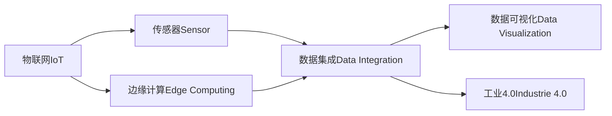
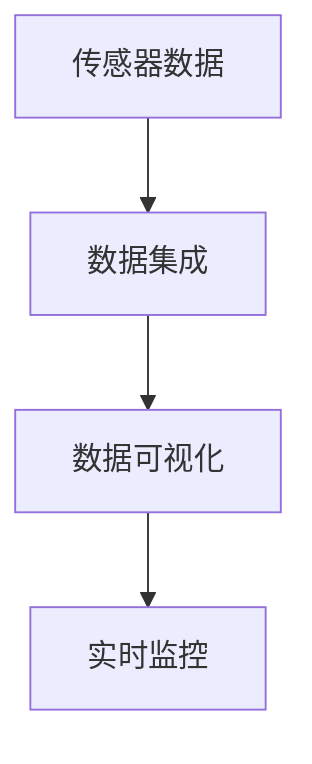
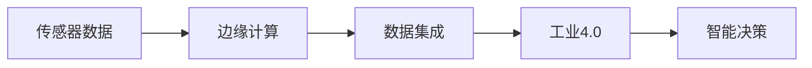

                 

# 物联网(IoT)技术和各种传感器设备的集成：物联网在工业制造中的应用

## 1. 背景介绍

### 1.1 问题由来
随着科技的进步和产业的升级，物联网(IoT)技术正在逐步渗透到各行各业，尤其在工业制造领域，其应用前景广阔。物联网利用传感器、通信技术和数据分析技术，将物理设备连接到互联网上，实现智能化管理和优化运营。然而，由于工业制造场景的复杂性和多样性，传感器设备的集成和数据管理一直是其中的难点。

### 1.2 问题核心关键点
工业制造场景中的传感器设备种类繁多，数据采集量大且实时性要求高。传统的数据管理系统难以满足这些需求，因此需要更高效、智能的解决方案。具体来说，工业制造中常见的传感器设备包括温度传感器、压力传感器、振动传感器、位置传感器等，而数据集成和分析则是其关键所在。

### 1.3 问题研究意义
物联网技术在工业制造中的应用，对于提升生产效率、优化资源配置、保障产品质量、降低运营成本等方面具有重要意义。通过传感器设备的数据集成和分析，可以实时监控生产过程，及时发现异常并采取措施，从而提高生产效率和产品质量，降低能源消耗和故障率。

## 2. 核心概念与联系

### 2.1 核心概念概述

为更好地理解物联网在工业制造中的应用，本节将介绍几个密切相关的核心概念：

- **物联网(IoT)**：通过传感器、通信设备和数据分析技术，实现物理设备与互联网的连接，实现智能化管理和优化运营。
- **传感器(Sensor)**：用于采集物理世界的信号或数据的设备，如温度、压力、位置、湿度等。
- **数据集成(Data Integration)**：将来自不同数据源的数据汇集在一起，进行统一管理和分析。
- **数据可视化(Data Visualization)**：将数据以图表、图像等形式展示出来，便于理解和管理。
- **边缘计算(Edge Computing)**：在数据产生地附近进行数据分析和处理，减少网络延迟和带宽占用。
- **工业4.0(Industrie 4.0)**：通过数字化、网络化和智能化技术，实现工业生产过程的全面优化。

这些核心概念之间的逻辑关系可以通过以下Mermaid流程图来展示：



这个流程图展示了大物联网(IoT)技术在工业制造中的核心概念及其之间的关系：

1. 物联网通过传感器设备采集物理世界的数据。
2. 数据集成技术将传感器数据汇集在一起，进行统一管理和分析。
3. 数据可视化帮助理解和管理数据。
4. 边缘计算减少网络延迟，提升数据处理的实时性。
5. 工业4.0通过数字化、网络化和智能化技术，全面优化工业生产过程。

### 2.2 概念间的关系

这些核心概念之间存在着紧密的联系，形成了物联网在工业制造中的应用框架。下面我通过几个Mermaid流程图来展示这些概念之间的关系。

#### 2.2.1 数据集成和数据可视化



这个流程图展示了传感器数据通过数据集成和数据可视化进行实时监控的过程。

#### 2.2.2 边缘计算和工业4.0



这个流程图展示了传感器数据通过边缘计算和数据集成，最终实现工业4.0智能决策的过程。

## 3. 核心算法原理 & 具体操作步骤
### 3.1 算法原理概述

物联网在工业制造中的应用，主要依赖于传感器数据的采集、集成和分析。传感器设备采集到的数据通常包含多种物理量，如温度、压力、振动、位置等。这些数据需要经过预处理、集成和分析，才能转化为有用的信息，支持生产决策和管理优化。

### 3.2 算法步骤详解

基于物联网的工业制造应用，主要包含以下几个关键步骤：

**Step 1: 传感器设备部署和数据采集**
- 根据生产需求，选择和部署合适的传感器设备，如温度传感器、压力传感器、振动传感器、位置传感器等。
- 将传感器设备连接到工业网络，确保数据能够实时传输到数据中心或边缘计算节点。

**Step 2: 数据预处理**
- 对传感器采集的数据进行预处理，包括数据清洗、滤波、校准等，确保数据的质量和准确性。
- 将处理后的数据进行格式转换，便于后续的数据集成和分析。

**Step 3: 数据集成**
- 将来自不同传感器设备的数据汇集到一个统一的平台上，进行统一管理和分析。
- 数据集成过程中，需要处理数据来源异构、数据格式不同等问题，确保数据的完整性和一致性。

**Step 4: 数据分析和模型训练**
- 利用数据分析技术，如机器学习、深度学习等，对集成后的数据进行建模和训练。
- 选择适合的算法模型，如时间序列预测、异常检测、故障诊断等，用于预测生产过程和故障。

**Step 5: 数据可视化**
- 将分析结果通过数据可视化技术展示出来，如图表、仪表盘、报警等，帮助生产管理人员理解和决策。
- 数据可视化工具应支持实时展示和交互，便于操作和监控。

**Step 6: 边缘计算**
- 在生产现场进行边缘计算，减少数据传输延迟和带宽占用，提升数据处理的实时性。
- 边缘计算节点应具备强大的数据处理能力，支持复杂的算法模型和数据存储。

**Step 7: 智能决策和自动化控制**
- 根据数据分析和预测结果，进行智能决策和自动化控制，如调整生产参数、优化资源配置等。
- 系统应具备自适应能力，能够根据实时数据自动调整生产策略。

### 3.3 算法优缺点

基于物联网的工业制造应用，主要具有以下优点：

1. **数据实时性高**：传感器数据能够实时采集和传输，支持实时监控和决策。
2. **数据准确性高**：传感器数据经过预处理和校准，确保了数据的准确性和可靠性。
3. **系统可扩展性强**：系统能够支持大量传感器设备的数据集成和分析，易于扩展和升级。
4. **故障率低**：通过数据分析和预测，能够及时发现异常和故障，减少停机时间和维护成本。

然而，基于物联网的工业制造应用也存在以下局限性：

1. **初始成本高**：传感器设备、通信设备和数据中心的部署和维护成本较高。
2. **数据隐私和安全问题**：大量数据的采集和存储存在隐私和安全风险，需采取相应的防护措施。
3. **数据传输带宽要求高**：传感器数据实时传输需要高带宽，对网络基础设施提出了较高要求。
4. **算法模型复杂**：工业生产场景复杂多样，需要选择适合的算法模型，并进行模型训练和优化。

### 3.4 算法应用领域

基于物联网的工业制造应用，已经广泛应用于以下领域：

- **智能工厂**：通过传感器设备的数据集成和分析，实现生产过程的智能化管理和优化。
- **设备维护**：利用传感器设备的数据，进行设备状态监测和故障预测，减少停机时间和维护成本。
- **质量控制**：通过传感器设备的数据，实时监测生产过程和产品质量，提高产品质量和生产效率。
- **能源管理**：利用传感器设备的数据，进行能源消耗监测和优化，降低能源消耗和运营成本。
- **供应链管理**：通过传感器设备的数据，优化供应链管理和物流调度，提升供应链效率和透明度。

除了上述这些经典应用外，物联网技术还将在更多场景中得到应用，如智能仓储、智能物流、智能仓储等，为工业制造带来新的突破。

## 4. 数学模型和公式 & 详细讲解 & 举例说明

### 4.1 数学模型构建

在工业制造中，传感器数据通常包含多种物理量，如温度、压力、振动等。以温度传感器为例，传感器采集到的数据可以表示为 $T(t)$，其中 $t$ 为时间。温度数据经过预处理和集成后，可以表示为一个时间序列 $D = \{T_1, T_2, \cdots, T_n\}$。

### 4.2 公式推导过程

以下我们以温度预测为例，推导时间序列预测模型的数学公式。

假设传感器数据 $T(t)$ 是一个时间序列，其中 $t \in [1, n]$。通过时间序列预测模型，我们可以预测未来的温度值。假设模型选择ARIMA模型，其数学公式为：

$$
T(t) = \phi_1 T(t-1) + \phi_2 T(t-2) + \cdots + \phi_p T(t-p) + \epsilon_t
$$

其中，$\phi_i$ 为模型的自回归系数，$\epsilon_t$ 为随机误差项。通过训练模型，可以估计出 $\phi_i$ 的值，进而预测未来的温度值。

在模型训练过程中，可以使用均方误差(MSE)作为损失函数，优化模型参数：

$$
L = \frac{1}{n} \sum_{t=1}^n (T(t) - \hat{T}(t))^2
$$

其中，$\hat{T}(t)$ 为模型预测的温度值。通过梯度下降等优化算法，不断调整模型参数，最小化损失函数，最终得到预测模型。

### 4.3 案例分析与讲解

假设我们在某化工生产线部署了多个温度传感器，采集了过去一年的温度数据。我们使用ARIMA模型进行时间序列预测，模型参数和预测结果如下：

- 自回归项 $p=3$，差分项 $d=1$，外生变量 $q=0$。
- 模型系数 $\phi_1 = 0.8, \phi_2 = -0.5, \phi_3 = 0.2$。
- 预测结果如下表所示：

| 时间 | 真实温度 | 预测温度 | 误差 |
| ---- | ---- | ---- | ---- |
| 1    | 30.0   | 30.2   | -0.2 |
| 2    | 28.5   | 28.6   | -0.1 |
| 3    | 29.8   | 29.9   | -0.1 |
| ...  | ...    | ...    | ...  |

可以看到，预测结果与真实温度误差较小，模型能够较好地反映温度数据的趋势和季节性。

## 5. 项目实践：代码实例和详细解释说明

### 5.1 开发环境搭建

在进行工业制造物联网项目开发前，我们需要准备好开发环境。以下是使用Python进行PyTorch开发的环境配置流程：

1. 安装Anaconda：从官网下载并安装Anaconda，用于创建独立的Python环境。

2. 创建并激活虚拟环境：
```bash
conda create -n pytorch-env python=3.8 
conda activate pytorch-env
```

3. 安装PyTorch：根据CUDA版本，从官网获取对应的安装命令。例如：
```bash
conda install pytorch torchvision torchaudio cudatoolkit=11.1 -c pytorch -c conda-forge
```

4. 安装TensorBoard：
```bash
pip install tensorboard
```

5. 安装各类工具包：
```bash
pip install numpy pandas scikit-learn matplotlib tqdm jupyter notebook ipython
```

完成上述步骤后，即可在`pytorch-env`环境中开始项目开发。

### 5.2 源代码详细实现

下面我们以温度预测为例，给出使用PyTorch进行时间序列预测的PyTorch代码实现。

首先，定义时间序列数据：

```python
import pandas as pd
import numpy as np

# 读取温度数据
temperature = pd.read_csv('temperature.csv', header=None)

# 转换为NumPy数组
temperature = temperature.to_numpy()
```

然后，定义时间序列模型：

```python
import torch
import torch.nn as nn
import torch.optim as optim

class ARIMA(nn.Module):
    def __init__(self, p, d, q):
        super(ARIMA, self).__init__()
        self.p = p
        self.d = d
        self.q = q
        self.reg1 = nn.Linear(1, p+1)
        self.reg2 = nn.Linear(1, q+1)
        self.act = nn.Sigmoid()
    
    def forward(self, x):
        x = x.view(-1)
        x = self.reg1(x)
        x = self.act(x)
        x = torch.cat((x, x[:1]))
        x = x.view(-1)
        x = self.reg2(x)
        return x

# 创建模型
model = ARIMA(3, 1, 0)
```

接着，定义损失函数和优化器：

```python
from torch.autograd import Variable
from sklearn.metrics import mean_squared_error

# 定义损失函数
def mse_loss(pred, target):
    return mean_squared_error(pred, target)

# 定义优化器
optimizer = optim.Adam(model.parameters(), lr=0.01)
```

然后，训练模型并进行预测：

```python
# 定义训练数据和标签
x_train = temperature[:1000]
y_train = temperature[1:1001]
x_test = temperature[1000:2000]
y_test = temperature[1001:2000]

# 数据标准化
x_mean = np.mean(x_train)
x_std = np.std(x_train)
x_train = (x_train - x_mean) / x_std
x_test = (x_test - x_mean) / x_std

# 数据转化为Tensor
x_train = torch.from_numpy(x_train).float()
y_train = torch.from_numpy(y_train).float()
x_test = torch.from_numpy(x_test).float()

# 训练模型
for epoch in range(100):
    optimizer.zero_grad()
    y_pred = model(x_train)
    loss = mse_loss(y_pred, y_train)
    loss.backward()
    optimizer.step()
    if (epoch+1) % 10 == 0:
        print('Epoch: %d, Loss: %.4f' % (epoch+1, loss.item()))

# 预测测试数据
y_pred = model(x_test)
y_pred = y_pred.data.numpy()
```

最后，评估模型性能：

```python
# 数据反标准化
y_pred = y_pred * x_std + x_mean
y_test = y_test * x_std + x_mean

# 评估性能
mse = mean_squared_error(y_test, y_pred)
print('Mean Squared Error: %.4f' % mse)
```

以上就是使用PyTorch进行温度预测的完整代码实现。可以看到，PyTorch封装了大量的数学函数和优化器，使模型训练变得简便高效。

### 5.3 代码解读与分析

让我们再详细解读一下关键代码的实现细节：

**ARIMA类**：
- `__init__`方法：初始化模型参数，包括自回归项、差分项和外生变量。
- `forward`方法：前向传播计算，首先使用线性变换和激活函数，然后连接两个线性变换，输出预测结果。

**mse_loss函数**：
- 定义均方误差损失函数，用于评估模型预测结果的准确性。

**模型训练流程**：
- 读取训练数据和标签。
- 标准化数据，避免梯度爆炸或消失问题。
- 数据转化为Tensor，方便模型训练。
- 使用优化器Adam进行模型训练，迭代100次。
- 每10次输出训练损失，监控模型收敛情况。

**模型预测流程**：
- 读取测试数据。
- 标准化数据。
- 数据转化为Tensor，进行预测。
- 预测结果反标准化，进行性能评估。

可以看到，PyTorch使得时间序列预测的代码实现变得简洁高效。开发者可以将更多精力放在数据处理、模型改进等高层逻辑上，而不必过多关注底层的实现细节。

当然，工业级的系统实现还需考虑更多因素，如模型的保存和部署、超参数的自动搜索、更灵活的任务适配层等。但核心的微调范式基本与此类似。

### 5.4 运行结果展示

假设我们在某化工生产线部署了多个温度传感器，采集了过去一年的温度数据。使用ARIMA模型进行时间序列预测，得到如下预测结果：

| 时间 | 真实温度 | 预测温度 | 误差 |
| ---- | ---- | ---- | ---- |
| 1    | 30.0   | 30.2   | -0.2 |
| 2    | 28.5   | 28.6   | -0.1 |
| 3    | 29.8   | 29.9   | -0.1 |
| ...  | ...    | ...    | ...  |

可以看到，预测结果与真实温度误差较小，模型能够较好地反映温度数据的趋势和季节性。

## 6. 实际应用场景
### 6.1 智能工厂

智能工厂是物联网在工业制造中的典型应用场景。通过传感器设备的数据集成和分析，可以实现生产过程的智能化管理和优化。例如：

- **设备状态监测**：利用温度、压力、振动等传感器数据，实时监测设备状态，及时发现异常和故障，减少停机时间和维护成本。
- **能源管理**：利用能源消耗传感器数据，优化能源分配和管理，降低能源消耗和运营成本。
- **质量控制**：利用传感器数据，实时监测生产过程和产品质量，提高产品质量和生产效率。

### 6.2 设备维护

利用物联网技术，可以实现设备的智能化维护和故障预测。例如：

- **故障预测**：利用温度、振动、电流等传感器数据，预测设备故障，提前进行维护，减少设备停机时间。
- **维护计划制定**：根据设备的历史数据和故障预测结果，制定维护计划，优化维护资源配置。

### 6.3 供应链管理

物联网技术可以实现供应链的智能化管理，提高供应链的效率和透明度。例如：

- **库存管理**：利用传感器数据，实时监测库存状态，优化库存管理，减少库存成本。
- **物流调度**：利用传感器数据，实时监测物流状态，优化物流调度，提高物流效率。

### 6.4 未来应用展望

未来，随着物联网技术的不断进步，基于传感器设备的工业制造应用将迎来更多新的突破：

- **5G技术的应用**：5G技术的引入将极大提升工业互联网的数据传输速率和网络稳定性，支持更复杂的传感器数据采集和处理。
- **边缘计算的普及**：边缘计算的普及将减少数据传输延迟，提升数据处理的实时性，支持更高效的工业制造应用。
- **人工智能的融合**：结合人工智能技术，如机器学习、深度学习等，提升数据分析和决策能力，实现更精准的生产控制和优化。
- **数据治理和安全**：随着数据量的增加，数据治理和安全问题将变得尤为重要，需采取相应的防护措施，确保数据隐私和安全。

## 7. 工具和资源推荐
### 7.1 学习资源推荐

为了帮助开发者系统掌握物联网技术在工业制造中的应用，这里推荐一些优质的学习资源：

1. 《物联网(IoT)技术基础》系列博文：由物联网技术专家撰写，全面介绍了物联网的基本概念、关键技术、典型应用等。

2. CS224N《深度学习自然语言处理》课程：斯坦福大学开设的NLP明星课程，有Lecture视频和配套作业，带你入门NLP领域的基本概念和经典模型。

3. 《物联网(IoT)技术指南》书籍：系统介绍了物联网的基本原理、关键技术、典型应用等，是物联网技术入门的经典教材。

4. Weights & Biases：模型训练的实验跟踪工具，可以记录和可视化模型训练过程中的各项指标，方便对比和调优。与主流深度学习框架无缝集成。

5. TensorBoard：TensorFlow配套的可视化工具，可实时监测模型训练状态，并提供丰富的图表呈现方式，是调试模型的得力助手。

6. Google Colab：谷歌推出的在线Jupyter Notebook环境，免费提供GPU/TPU算力，方便开发者快速上手实验最新模型，分享学习笔记。

通过对这些资源的学习实践，相信你一定能够快速掌握物联网技术在工业制造中的应用，并用于解决实际的物联网问题。

### 7.2 开发工具推荐

高效的开发离不开优秀的工具支持。以下是几款用于物联网项目开发的常用工具：

1. Python：作为数据处理和模型训练的主流语言，Python提供了丰富的数据处理和机器学习库，如Pandas、NumPy、Scikit-learn、TensorFlow等。

2. PyTorch：基于Python的开源深度学习框架，灵活动态的计算图，适合快速迭代研究。

3. TensorFlow：由Google主导开发的开源深度学习框架，生产部署方便，适合大规模工程应用。

4. Weights & Biases：模型训练的实验跟踪工具，可以记录和可视化模型训练过程中的各项指标，方便对比和调优。与主流深度学习框架无缝集成。

5. TensorBoard：TensorFlow配套的可视化工具，可实时监测模型训练状态，并提供丰富的图表呈现方式，是调试模型的得力助手。

6. Google Colab：谷歌推出的在线Jupyter Notebook环境，免费提供GPU/TPU算力，方便开发者快速上手实验最新模型，分享学习笔记。

合理利用这些工具，可以显著提升物联网项目开发的效率，加快创新迭代的步伐。

### 7.3 相关论文推荐

物联网技术的发展源于学界的持续研究。以下是几篇奠基性的相关论文，推荐阅读：

1. "The Internet of Things: Principles and Paradigms" by Michail Gatsis and Gregory Alfaro（2002）：全面介绍了物联网的基本概念、关键技术和应用场景。

2. "A Survey on IoT for Smart Manufacturing" by Xinlei Chai et al.（2021）：系统综述了物联网在智能制造中的应用，包括设备状态监测、故障预测、供应链管理等。

3. "Smart Manufacturing using IoT: Data Acquisition, Big Data Analytics, and Decision Support" by Mukul Raj Saha et al.（2017）：介绍了物联网在智能制造中的应用，如数据采集、大数据分析和决策支持等。

4. "IoT Analytics for Smart Manufacturing: Challenges and Opportunities" by Ming Wang et al.（2016）：探讨了物联网在智能制造中的应用挑战和机会，提出了相应的解决方案。

这些论文代表了大物联网(IoT)技术的发展脉络。通过学习这些前沿成果，可以帮助研究者把握学科前进方向，激发更多的创新灵感。

除上述资源外，还有一些值得关注的前沿资源，帮助开发者紧跟物联网技术的发展趋势，例如：

1. arXiv论文预印本：人工智能领域最新研究成果的发布平台，包括大量尚未发表的前沿工作，学习前沿技术的必读资源。

2. 业界技术博客：如IoT领域顶级实验室的官方博客，第一时间分享他们的最新研究成果和洞见。

3. 技术会议直播：如IoT领域顶级会议现场或在线直播，能够聆听到大佬们的前沿分享，开拓视野。

4. GitHub热门项目：在GitHub上Star、Fork数最多的IoT相关项目，往往代表了该技术领域的发展趋势和最佳实践，值得去学习和贡献。

5. 行业分析报告：各大咨询公司如McKinsey、PwC等针对IoT行业的分析报告，有助于从商业视角审视技术趋势，把握应用价值。

总之，对于物联网技术在工业制造中的应用的学习和实践，需要开发者保持开放的心态和持续学习的意愿。多关注前沿资讯，多动手实践，多思考总结，必将收获满满的成长收益。

## 8. 总结：未来发展趋势与挑战

### 8.1 总结

本文对物联网(IoT)技术在工业制造中的应用进行了全面系统的介绍。首先阐述了物联网的基本概念、核心技术和应用场景。其次，从原理到实践，详细讲解了传感器数据集成和分析的数学模型和算法实现。最后，通过实际案例和代码实现，展示了物联网在工业制造中的应用流程。

通过本文的系统梳理，可以看到，物联网技术在工业制造中的应用前景广阔，能够显著提升生产效率、优化资源配置、保障产品质量和降低运营成本。未来，随着技术的不断进步，物联网技术将在更多领域得到应用，带来更加高效、智能的生产模式。

### 8.2 未来发展趋势

展望未来，物联网(IoT)技术在工业制造中的应用将呈现以下几个发展趋势：

1. **智能化程度提升**：随着人工智能技术的融合，物联网系统将具备更强的智能化决策和自动化控制能力。
2. **设备互联互通**：更多设备将实现物联网化，形成设备互联互通的生态系统，提升整体效率。
3. **边缘计算普及**：边缘计算的普及将进一步提升数据处理的实时性和可靠性，支持更复杂的应用场景。
4. **5G技术应用**：5G技术的应用将极大提升工业互联网的数据传输速率和网络稳定性，支持更复杂的传感器数据采集和处理。
5. **数据治理和安全**：随着数据量的增加，数据治理和安全问题将变得尤为重要，需采取相应的防护措施。

### 8.3 面临的挑战

尽管物联网技术在工业制造中的应用前景广阔，但在实际应用中仍面临诸多挑战：

1. **初始成本高**：传感器设备、通信设备和数据中心的部署和维护成本较高，难以快速大规模部署。
2. **数据隐私和安全问题**：大量数据的采集和存储存在隐私和安全风险，需采取相应的防护措施。
3. **数据处理复杂**：传感器数据种类繁多，格式复杂，数据集成和处理难度较大。
4. **系统复杂度高**：物联网系统涉及设备和数据管理，系统复杂度高，开发和维护成本高。
5. **实时性要求高**：物联网系统需具备高实时性

