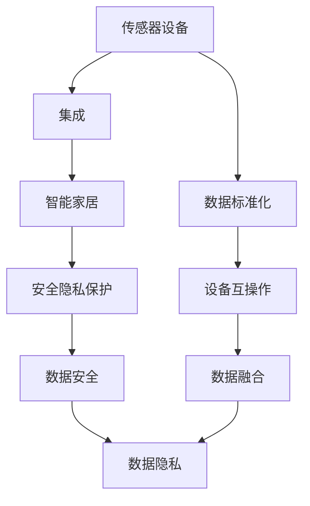

                 

# 物联网(IoT)技术和各种传感器设备的集成：物联网在智能家居的应用

> 关键词：物联网,传感器,集成,智能家居,技术,应用

## 1. 背景介绍

### 1.1 问题由来
物联网（IoT）技术正迅速改变我们的生活方式。随着智能设备和传感器的普及，我们得以在家庭环境中实现更高效、智能化的管理。然而，传感器设备的数量不断增加，带来的数据管理和设备集成问题也日益凸显。如何在智能家居系统中高效整合各种传感器设备，实现数据共享和互操作，是当前研究的重点之一。

### 1.2 问题核心关键点
物联网在智能家居中的应用，核心在于如何构建一个稳定、可扩展的智能环境，使其能够无缝连接各种传感器设备，并实现数据的实时收集与处理。这涉及到硬件兼容性、数据标准化、安全隐私保护等多方面的挑战。本文将详细介绍基于物联网技术的传感器设备集成和数据管理的核心概念，以及其在智能家居中的具体应用。

### 1.3 问题研究意义
研究基于物联网的传感器设备集成技术，对提升智能家居系统的智能化水平、降低运维成本、提升居住舒适度和安全防护具有重要意义。同时，探讨数据共享和互操作性问题，有助于构建更开放、灵活的智能家居生态系统，加速智能化进程。

## 2. 核心概念与联系

### 2.1 核心概念概述

- **物联网(IoT)**：通过互联网将各种传感器、设备和系统连接起来，实现数据采集、处理和应用的网络技术。
- **传感器设备**：能够感知环境变化并转化为数字信号的设备，如温度、湿度、光线、声音等传感器。
- **集成**：将多个设备或系统整合到一个统一平台上，实现数据共享和协同工作。
- **智能家居**：利用物联网技术，通过智能设备和传感器实现家庭自动化、智能化管理。
- **数据标准化**：统一传感器数据格式和通信协议，便于设备间的数据交互和信息融合。
- **安全隐私保护**：确保传感器数据传输和存储的安全性，保护用户隐私。

这些核心概念构成了物联网在智能家居中应用的基础框架。通过传感器设备集成，可以实现对家庭环境的全面监控和智能化管理。然而，集成过程中面临的数据标准化、安全隐私保护等挑战，需要系统性的解决方案。

### 2.2 概念间的关系

这些概念之间的逻辑关系可以通过以下Mermaid流程图来展示：



这个流程图展示了传感器设备集成与智能家居系统之间的关系：

1. 传感器设备通过集成模块整合到智能家居系统中。
2. 通过数据标准化，实现不同设备间的数据互操作。
3. 集成后的数据需要通过安全隐私保护措施进行保护。
4. 数据标准化和隐私保护通过设备互操作和数据融合进一步细化。

## 3. 核心算法原理 & 具体操作步骤
### 3.1 算法原理概述

传感器设备集成的核心算法原理是构建一个分布式的数据采集和处理系统，通过统一的数据通信协议和标准，实现数据的高效采集、传输和处理。该系统一般由以下几个关键模块构成：

- **数据采集模块**：负责传感器数据的实时采集。
- **数据传输模块**：负责传感器数据的传输和存储。
- **数据处理模块**：负责数据的分析和应用。
- **数据安全模块**：负责数据传输和存储的安全保护。

数据采集模块通过传感器设备实时收集环境数据，数据传输模块通过网络协议将数据传输到中央数据处理平台。数据处理模块对数据进行分析和应用，生成相应的控制指令。数据安全模块则通过加密、访问控制等措施，确保数据传输和存储的安全性。

### 3.2 算法步骤详解

1. **传感器选择与集成**：
   - 根据智能家居的实际需求，选择合适的传感器设备。
   - 将传感器设备通过网络协议连接到一个中央数据处理平台。
   - 对传感器设备进行初始化配置，确保其正常工作。

2. **数据标准化**：
   - 定义统一的数据通信协议和标准，支持不同传感器设备的互操作。
   - 使用数据标准化技术，如MQTT、CoAP等，实现传感器数据的统一编码和传输。

3. **数据传输与存储**：
   - 通过网络协议将传感器数据传输到中央数据处理平台。
   - 在中央平台建立数据存储库，对数据进行管理和存储。

4. **数据处理与分析**：
   - 使用数据处理模块对传感器数据进行实时分析。
   - 根据分析结果，生成相应的控制指令，如温度调节、灯光控制等。

5. **数据安全与隐私保护**：
   - 使用加密技术对数据传输进行保护。
   - 对用户数据进行匿名化和去标识化处理，保护用户隐私。
   - 实施访问控制策略，确保只有授权用户和设备可以访问数据。

### 3.3 算法优缺点

**优点**：
- 提高了数据采集和处理的效率，减少了人力成本。
- 实现了设备间的互操作和数据融合，提高了系统灵活性和可扩展性。
- 通过统一的数据标准化和数据安全措施，提高了系统的稳定性和可靠性。

**缺点**：
- 传感器设备种类繁多，集成复杂，可能导致系统成本较高。
- 数据量大，数据处理和存储面临高性能要求。
- 安全性问题复杂，需要综合考虑物理安全、网络安全和数据安全。

### 3.4 算法应用领域

传感器设备集成的核心算法原理和操作步骤可以应用于多个领域，包括智能家居、智慧城市、工业自动化等。在智能家居中，通过集成各种传感器设备，实现对家庭环境的全面监控和管理，提升居住舒适度和生活质量。在智慧城市中，通过集成交通、环境、公共设施等传感器数据，实现城市管理的智能化。在工业自动化中，通过集成生产设备、监控设备等传感器数据，实现生产流程的自动化和智能化。

## 4. 数学模型和公式 & 详细讲解  
### 4.1 数学模型构建

基于物联网的传感器设备集成系统，可以抽象为以下几个数学模型：

- **数据采集模型**：定义传感器设备的数据采集函数 $f(x_t)$，其中 $x_t$ 为传感器设备的状态，$t$ 为时间。
- **数据传输模型**：定义数据传输速率 $r(t)$，其中 $t$ 为时间。
- **数据处理模型**：定义数据处理效率 $p(t)$，其中 $t$ 为时间。
- **数据安全模型**：定义数据加密强度 $s(t)$，其中 $t$ 为时间。

这些模型描述了系统在不同时间点的工作状态和性能指标。通过这些模型，可以构建系统的动态演化模型，分析系统的性能变化和优化策略。

### 4.2 公式推导过程

假设传感器设备 $i$ 的状态为 $x_{i,t}$，其在时间 $t$ 采集到的数据为 $y_{i,t}$，数据传输速率为 $r(t)$，数据处理效率为 $p(t)$，数据加密强度为 $s(t)$，则数据采集和处理的总时间 $T_{i,t}$ 可以表示为：

$$
T_{i,t} = \frac{1}{r(t)} + \frac{1}{p(t)} + \frac{1}{s(t)}
$$

对于整个系统，所有传感器设备的数据采集和处理时间总和 $T_{\text{total}}$ 可以表示为：

$$
T_{\text{total}} = \sum_{i=1}^n T_{i,t}
$$

其中 $n$ 为传感器设备的数量。通过最小化 $T_{\text{total}}$，可以优化系统的性能和效率。

### 4.3 案例分析与讲解

以智能家居系统为例，假设系统中有 $n$ 个传感器设备，每个设备的数据采集时间为 $t_{i,\text{acq}}$，数据处理时间为 $t_{i,\text{proc}}$，数据传输时间为 $t_{i,\text{trans}}$，数据加密时间为 $t_{i,\text{enc}}$，则系统的总时间为：

$$
T_{\text{total}} = \sum_{i=1}^n \left(t_{i,\text{acq}} + t_{i,\text{proc}} + t_{i,\text{trans}} + t_{i,\text{enc}}\right)
$$

通过优化上述时间，可以实现系统的性能提升。例如，通过优化数据传输协议，减少数据传输时间 $t_{i,\text{trans}}$；通过优化数据处理算法，减少数据处理时间 $t_{i,\text{proc}}$；通过优化数据加密算法，减少数据加密时间 $t_{i,\text{enc}}$。这些优化措施可以显著提升系统的整体性能。

## 5. 项目实践：代码实例和详细解释说明
### 5.1 开发环境搭建

为了实现基于物联网的传感器设备集成，需要进行以下环境配置：

1. **安装操作系统**：选择一个支持物联网开发的Linux发行版，如Ubuntu或Raspberry Pi OS。
2. **安装开发工具**：安装Python、Node.js、MySQL等开发工具。
3. **安装物联网硬件**：准备传感器设备，如温度传感器、湿度传感器、光线传感器等。
4. **搭建网络环境**：设置Wi-Fi或以太网，确保传感器设备能够联网。
5. **配置数据库**：安装MySQL数据库，用于存储传感器数据。

### 5.2 源代码详细实现

以下是一个基于Python的物联网传感器数据采集和处理的示例代码：

```python
import paho.mqtt.client as mqtt
import json
import time
import mysql.connector

# 传感器设备连接参数
broker = "mqtt.example.com"
port = 1883
client = mqtt.Client()

# 数据库连接参数
db_host = "localhost"
db_user = "root"
db_password = "password"
db_name = "iot"

# MQTT订阅主题
topic = "sensor/data"

# 传感器数据字段
fields = ["temperature", "humidity", "light"]

# 数据库表结构
table_name = "sensor_data"

# 传感器数据存储格式
sensor_data_format = {"id": 1, "timestamp": 1638240000, "fields": {}}

# 传感器数据类型映射
type_map = {"temperature": "float", "humidity": "float", "light": "int"}

# MQTT连接函数
def connect_mqtt():
    client.connect(broker, port)
    client.subscribe(topic)
    client.on_message = on_message

# MQTT消息处理函数
def on_message(client, userdata, message):
    data = json.loads(message.payload)
    fields_data = {}
    for field in fields:
        value = data[field]
        data_type = type_map[field]
        fields_data[field] = (value if data_type == "float" else int(value))
    insert_data(fields_data)

# 数据库插入函数
def insert_data(data):
    conn = mysql.connector.connect(host=db_host, user=db_user, password=db_password, database=db_name)
    cursor = conn.cursor()
    query = "INSERT INTO {} (timestamp, {}) VALUES (%s, %s)".format(table_name, ",".join(fields))
    values = (time.time(), json.dumps(data))
    cursor.execute(query, values)
    conn.commit()
    cursor.close()
    conn.close()

# 主函数
def main():
    connect_mqtt()
    while True:
        time.sleep(1)

if __name__ == "__main__":
    main()
```

该代码实现了一个基于MQTT协议的传感器数据采集系统，能够实时采集传感器数据，并存储到MySQL数据库中。

### 5.3 代码解读与分析

- `connect_mqtt`函数：负责MQTT客户端的连接和订阅，设置消息处理函数 `on_message`。
- `on_message`函数：接收MQTT消息，解析消息内容，并将传感器数据插入数据库。
- `insert_data`函数：将传感器数据插入MySQL数据库。
- `main`函数：主程序，循环执行数据采集和存储操作。

### 5.4 运行结果展示

假设传感器设备每秒钟采集一次数据，运行上述代码后，可以实时查看MySQL数据库中的传感器数据记录。例如，温度传感器采集的数据如下：

```sql
SELECT * FROM sensor_data WHERE timestamp BETWEEN 1638240000 AND 1638240100;
```

返回结果如下：

| id | timestamp          | temperature | humidity | light |
|----|--------------------|------------|----------|-------|
| 1  | 1638240000          | 20.5       | 50       | 400   |
| 2  | 1638240100          | 21.0       | 52       | 410   |
| ...| ...                | ...        | ...      | ...   |
```

这表明传感器设备成功地采集了温度、湿度和光线数据，并将其存储到MySQL数据库中。

## 6. 实际应用场景

### 6.1 智能家居

在智能家居中，通过集成温度、湿度、光线等传感器设备，可以实现对家庭环境的全面监控和自动化管理。例如：

- **环境监控**：实时监测室内温度、湿度、光线等环境指标，通过手机App或智能音箱等设备查看和控制。
- **节能管理**：根据环境数据，自动调节空调、加湿器、窗帘等设备，实现节能减排。
- **安全防护**：通过传感器设备实时监测门窗状态、烟雾报警等安全信息，提升居住安全。

### 6.2 智慧城市

在智慧城市中，通过集成交通、环境、公共设施等传感器数据，可以实现城市管理的智能化。例如：

- **交通管理**：实时监测交通流量、车速、道路状况等数据，优化交通信号灯控制，减少交通拥堵。
- **环境监测**：实时监测空气质量、水质、噪音等环境数据，发布环境预警信息，提升城市治理水平。
- **公共设施管理**：实时监测路灯、垃圾桶、充电桩等公共设施的状态，优化资源配置，提升公共服务水平。

### 6.3 工业自动化

在工业自动化中，通过集成生产设备、监控设备等传感器数据，可以实现生产流程的自动化和智能化。例如：

- **生产监控**：实时监测生产设备的状态和参数，及时发现和处理异常情况，提高生产效率。
- **质量控制**：通过传感器设备监测产品质量，自动调整生产参数，提升产品质量。
- **设备维护**：实时监测设备运行状态，预测设备故障，提前进行维护，减少停机时间。

## 7. 工具和资源推荐

### 7.1 学习资源推荐

为了深入学习物联网技术，以下资源值得推荐：

- **《物联网导论》**：一本系统介绍物联网基础和应用领域的书籍，适合初学者和中级读者。
- **IoT Academy**：一个在线物联网学习平台，提供丰富的课程和实验资源。
- **IoT Edge**：一个物联网技术社区，提供最新的物联网技术动态和应用案例。
- **IoT Makerspace**：一个开放的物联网硬件开发平台，提供各种传感器和设备资源。

### 7.2 开发工具推荐

为了实现物联网传感器设备集成，以下工具推荐使用：

- **Pytho**n：一种通用的编程语言，支持物联网应用开发。
- **Node.js**：一种轻量级的JavaScript运行环境，适合物联网设备的开发和部署。
- **MQTT**：一种轻量级的消息传输协议，适合物联网设备的互操作。
- **MySQL**：一种流行的关系型数据库，适合物联网数据的存储和处理。

### 7.3 相关论文推荐

以下是一些物联网传感器设备集成相关的经典论文，值得深入阅读：

- **《物联网传感器数据采集与处理技术研究》**：一篇综述性论文，总结了物联网传感器数据采集和处理的技术方法。
- **《物联网传感器数据融合与多源数据管理》**：一篇研究论文，探讨了物联网传感器数据融合和管理的算法和技术。
- **《物联网设备集成与互操作性研究》**：一篇学术论文，分析了物联网设备集成的挑战和解决方案。

## 8. 总结：未来发展趋势与挑战

### 8.1 总结

本文详细介绍了物联网技术和传感器设备集成在智能家居中的应用，探讨了数据标准化、安全隐私保护等核心概念，并提供了系统化的技术框架和代码实现。通过系统化的集成方案，能够高效整合各类传感器设备，实现家庭环境的全面监控和管理。

### 8.2 未来发展趋势

未来，物联网技术将继续向智能化、普适化方向发展。以下趋势值得关注：

- **5G网络普及**：5G网络的普及将显著提升传感器数据的传输速率和稳定性，为物联网系统的高效运行提供支持。
- **边缘计算应用**：边缘计算技术能够将数据处理任务从云端转移到本地设备，减少数据传输延迟，提升系统响应速度。
- **多模态融合**：结合视觉、声音、温度等多模态数据，实现更全面、准确的环境感知和智能控制。
- **人工智能应用**：利用人工智能技术，实现传感器数据的深度学习和分析，提升系统的智能化水平。

### 8.3 面临的挑战

尽管物联网技术在智能家居中应用前景广阔，但在实际部署中仍面临以下挑战：

- **硬件兼容性**：不同传感器设备的硬件规格和协议可能存在差异，导致集成困难。
- **数据标准化**：不同设备的数据格式和通信协议需要统一，增加了集成复杂度。
- **数据安全**：传感器数据传输和存储的安全性需要严格保障，防止数据泄露和篡改。
- **系统可靠性**：传感器设备的可靠性直接影响系统的整体性能和稳定性。

### 8.4 研究展望

未来，物联网传感器设备集成研究将集中在以下几个方面：

- **标准化与互操作性**：推动传感器设备数据格式和通信协议的统一，促进设备间的互操作。
- **数据安全与隐私保护**：研究高效的数据加密和安全传输技术，确保数据隐私和安全性。
- **边缘计算与分布式计算**：探索边缘计算和分布式计算技术，提升系统的响应速度和处理能力。
- **人工智能与机器学习**：利用人工智能和机器学习技术，提升系统的智能化水平和决策能力。

总之，物联网技术的发展前景广阔，但也需要多方协作和持续创新，才能实现其潜力。通过深入研究传感器设备集成和数据管理，我们可以构建更高效、智能化的物联网系统，提升人类生活的质量和效率。

## 9. 附录：常见问题与解答

**Q1：物联网技术在智能家居中的应用前景如何？**

A: 物联网技术在智能家居中具有广泛的应用前景。通过集成各类传感器设备，可以实现对家庭环境的全面监控和管理，提升居住舒适度和安全防护水平。未来，随着5G网络的普及和边缘计算技术的发展，物联网系统将更加高效和稳定，为智能家居带来更多的智能场景和应用。

**Q2：在物联网系统设计中，如何保证数据安全？**

A: 数据安全是物联网系统设计的关键问题。以下是一些常用的数据安全措施：

- **数据加密**：在数据传输过程中，使用加密技术保护数据隐私。
- **访问控制**：实施严格的访问控制策略，确保只有授权用户和设备可以访问数据。
- **数据去标识化**：对数据进行去标识化处理，隐藏敏感信息，保护用户隐私。
- **异常检测**：实时监测数据传输和存储过程，检测和阻止异常行为。

**Q3：在物联网系统中，如何选择传感器设备？**

A: 选择传感器设备需要根据实际需求和应用场景进行综合考虑。以下是一些选择传感器的关键因素：

- **传感器类型**：根据应用场景选择合适的传感器类型，如温度、湿度、光线、声音等传感器。
- **传感器精度**：选择精度较高的传感器，保证数据的准确性和可靠性。
- **传感器功耗**：选择功耗较低的传感器，延长设备续航时间。
- **传感器兼容性**：选择与系统兼容的传感器设备，保证数据互操作。

**Q4：物联网系统的集成过程中需要注意哪些问题？**

A: 物联网系统的集成过程需要注意以下几个问题：

- **硬件兼容性**：确保传感器设备的硬件规格和协议兼容。
- **数据标准化**：统一传感器数据格式和通信协议，实现设备间的互操作。
- **数据安全**：确保数据传输和存储的安全性，防止数据泄露和篡改。
- **系统可靠性**：确保传感器设备的稳定性和可靠性，提升系统的整体性能。

通过系统化的集成方案，可以有效解决这些问题，构建高效的物联网系统。

通过本文的介绍和分析，相信你对物联网技术在智能家居中的应用有了更深入的了解。未来，随着技术的不断发展，物联网将进一步拓展应用场景，提升我们的生活质量和工作效率。

