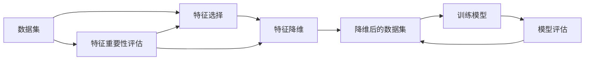

                 

# 特征选择与特征降维原理与代码实战案例讲解

## 1. 背景介绍

在数据科学和机器学习领域，数据的高维性是一个普遍存在的问题。高维数据不仅增加了存储和计算的复杂度，还会导致维度灾难，使得模型难以有效地学习到数据的本质特征，进而影响模型的性能和泛化能力。特征选择（Feature Selection）和特征降维（Feature Reduction）是处理高维数据的两种重要技术，它们通过选取或转换数据中重要的特征，降低数据的维度，从而提升模型的效果和效率。本文将详细介绍特征选择和特征降维的原理，并通过代码实例进行实战讲解，帮助读者深入理解这些技术的实际应用。

### 1.1 特征选择（Feature Selection）

特征选择是指从原始特征集中选取一部分重要特征，去除无关或冗余的特征，以降低数据维度，提高模型的泛化能力和计算效率。特征选择的目标是在保证模型性能的前提下，尽可能地减少特征数量。

### 1.2 特征降维（Feature Reduction）

特征降维是通过某种映射方式将高维数据转换为低维数据，保留数据的本质特征，去除冗余信息，从而降低数据的维度。特征降维的目的在于简化数据结构，提高模型的训练速度和泛化能力。

## 2. 核心概念与联系

### 2.1 核心概念概述

为了更好地理解特征选择和特征降维，本节将介绍几个密切相关的核心概念：

- 特征：数据集中用于训练和测试的变量或属性。特征是模型的输入，其重要性直接影响到模型的预测能力。
- 维度（Dimensionality）：特征的数量。高维数据通常包含大量无关或冗余的特征，增加了模型的复杂度和计算量。
- 正则化（Regularization）：通过在损失函数中添加惩罚项，限制模型的复杂度，防止过拟合。
- 降维算法（Dimensionality Reduction Algorithm）：如主成分分析（PCA）、线性判别分析（LDA）、t-SNE等，通过线性或非线性变换，将高维数据映射到低维空间。
- 特征重要性（Feature Importance）：评估特征对模型预测能力的影响，常用的方法有信息增益、互信息等。

### 2.2 概念间的关系

这些核心概念之间的关系可以通过以下Mermaid流程图来展示：



这个流程图展示了从原始数据集到最终模型评估的全过程，以及特征选择和特征降维在其中扮演的角色。

## 3. 核心算法原理 & 具体操作步骤

### 3.1 算法原理概述

特征选择和特征降维的核心原理在于降维技术的数学模型和统计学原理。特征选择通过评估每个特征的重要性，选取对模型预测能力贡献最大的特征；特征降维则通过线性或非线性映射，将高维数据转换为低维数据。

#### 3.1.1 特征选择原理

特征选择通常分为三种方法：

1. 过滤式（Filter）方法：通过统计学方法评估每个特征的重要性，选择高重要性的特征。
2. 包裹式（Wrapper）方法：通过交叉验证，评估特征子集对模型性能的影响，选择最优的特征子集。
3. 嵌入式（Embedded）方法：在模型训练过程中同时进行特征选择，选择对模型预测能力贡献最大的特征。

#### 3.1.2 特征降维原理

特征降维的方法包括：

1. 线性降维方法：如主成分分析（PCA）、线性判别分析（LDA）等，通过线性变换将高维数据转换为低维数据。
2. 非线性降维方法：如t-SNE、局部线性嵌入（LLE）等，通过非线性变换，保留数据的局部结构。

### 3.2 算法步骤详解

#### 3.2.1 特征选择步骤详解

1. 数据预处理：对原始数据进行清洗、归一化等预处理操作。
2. 特征重要性评估：通过信息增益、互信息等方法评估每个特征的重要性。
3. 特征选择：根据特征重要性排序，选取高重要性的特征。
4. 数据降维：将高维数据转换为低维数据，如使用PCA降维。
5. 模型训练：使用降维后的数据训练模型。

#### 3.2.2 特征降维步骤详解

1. 数据预处理：对原始数据进行清洗、归一化等预处理操作。
2. 降维算法选择：根据数据特点选择合适的降维算法，如PCA、LDA等。
3. 降维处理：将数据降维到目标维度，如将数据降维到2-3维。
4. 数据后处理：对降维后的数据进行后处理操作，如去重、补全等。
5. 模型训练：使用降维后的数据训练模型。

### 3.3 算法优缺点

#### 3.3.1 特征选择的优缺点

**优点：**

- 减少模型计算量，提高模型训练速度。
- 减少模型复杂度，提高模型泛化能力。
- 提升模型对异常值和噪声的鲁棒性。

**缺点：**

- 特征选择可能需要大量的计算和验证过程。
- 可能丢失一些重要特征，影响模型性能。

#### 3.3.2 特征降维的优缺点

**优点：**

- 减少模型计算量，提高模型训练速度。
- 减少模型复杂度，提高模型泛化能力。
- 保留数据本质特征，提升模型效果。

**缺点：**

- 降维过程可能导致信息损失，影响模型性能。
- 降维算法的选择和参数调整可能较为复杂。

### 3.4 算法应用领域

特征选择和特征降维在数据科学和机器学习领域具有广泛的应用，包括但不限于：

- 图像识别：通过特征选择和降维，提高模型的分类和识别能力。
- 自然语言处理：通过特征选择和降维，提高模型的文本分类、情感分析等任务的效果。
- 生物信息学：通过特征选择和降维，处理高维基因表达数据，提高基因分类和预测能力。
- 金融分析：通过特征选择和降维，处理高维交易数据，提高模型对市场趋势的预测能力。

## 4. 数学模型和公式 & 详细讲解 & 举例说明

### 4.1 数学模型构建

假设原始数据集为 $X = (x_1, x_2, ..., x_n)$，其中 $x_i = (f_{i1}, f_{i2}, ..., f_{im})$ 表示样本 $i$ 的 $m$ 个特征。

#### 4.1.1 特征重要性评估

特征重要性评估通常使用以下公式计算每个特征的信息增益（Information Gain）：

$$
IG(f_k) = \frac{H(T) - H(T|f_k)}{H(T)}
$$

其中 $H(T)$ 表示原始数据集的熵，$H(T|f_k)$ 表示在特征 $f_k$ 上的条件熵。

#### 4.1.2 特征选择

特征选择通常使用以下公式计算每个特征的重要性得分（Importance Score）：

$$
IS(f_k) = IG(f_k) \times \frac{n_k}{n}
$$

其中 $n_k$ 表示特征 $f_k$ 的非零取值数量，$n$ 表示数据集样本数。

### 4.2 公式推导过程

#### 4.2.1 特征重要性评估

原始数据集 $T$ 的熵定义为：

$$
H(T) = -\sum_{i=1}^n p_i \log_2 p_i
$$

其中 $p_i$ 表示样本 $i$ 出现的概率。

在特征 $f_k$ 上的条件熵定义为：

$$
H(T|f_k) = -\sum_{f_{ik}} \sum_{i=1}^n p_{f_{ik}} \log_2 p_{f_{ik}}
$$

其中 $f_{ik}$ 表示样本 $i$ 在特征 $f_k$ 上的取值。

特征 $f_k$ 的信息增益为：

$$
IG(f_k) = H(T) - H(T|f_k) = \sum_{f_{ik}} p_{f_{ik}} \log_2 p_{f_{ik}} - \sum_{i=1}^n p_i \log_2 p_i
$$

特征 $f_k$ 的重要性得分为：

$$
IS(f_k) = IG(f_k) \times \frac{n_k}{n}
$$

### 4.3 案例分析与讲解

#### 4.3.1 案例分析

假设我们有一份包含多个特征的数据集，用于预测用户的购买行为。数据集中包含用户的年龄、性别、职业、收入等特征。通过特征重要性评估，我们发现用户的年龄和职业对购买行为的影响最大，而性别和收入的影响较小。因此，我们可以选取年龄和职业作为模型的输入特征，去除性别和收入特征。

#### 4.3.2 案例讲解

在实际应用中，特征选择和特征降维可以通过Python中的scikit-learn库实现。以下是一个使用scikit-learn库进行特征选择和特征降维的示例代码：

```python
from sklearn.datasets import load_iris
from sklearn.feature_selection import SelectKBest, mutual_info_classif
from sklearn.decomposition import PCA

# 加载鸢尾花数据集
iris = load_iris()
X = iris.data
y = iris.target

# 特征选择
selector = SelectKBest(mutual_info_classif, k=2)
X_selected = selector.fit_transform(X, y)

# 特征降维
pca = PCA(n_components=2)
X_reduced = pca.fit_transform(X_selected)

# 训练模型
from sklearn.svm import SVC
clf = SVC()
clf.fit(X_reduced, y)
```

在上述代码中，我们首先使用`SelectKBest`函数进行特征选择，选取了2个最重要的特征。然后使用PCA进行特征降维，将数据降维到2维。最后，我们使用SVC模型训练降维后的数据，并评估模型的性能。

### 4.4 案例讲解

## 5. 项目实践：代码实例和详细解释说明

### 5.1 开发环境搭建

在进行特征选择和特征降维的实践前，我们需要准备好开发环境。以下是使用Python进行scikit-learn开发的环境配置流程：

1. 安装Anaconda：从官网下载并安装Anaconda，用于创建独立的Python环境。

2. 创建并激活虚拟环境：
```bash
conda create -n sklearn-env python=3.8 
conda activate sklearn-env
```

3. 安装scikit-learn：
```bash
pip install scikit-learn
```

4. 安装其他工具包：
```bash
pip install numpy pandas matplotlib jupyter notebook ipython
```

完成上述步骤后，即可在`sklearn-env`环境中开始特征选择和特征降维的实践。

### 5.2 源代码详细实现

下面我们以鸢尾花数据集为例，给出使用scikit-learn库进行特征选择和特征降维的Python代码实现。

首先，加载鸢尾花数据集：

```python
from sklearn.datasets import load_iris
iris = load_iris()
X = iris.data
y = iris.target
```

然后，使用`SelectKBest`函数进行特征选择，选取前2个最重要的特征：

```python
from sklearn.feature_selection import SelectKBest, mutual_info_classif
selector = SelectKBest(mutual_info_classif, k=2)
X_selected = selector.fit_transform(X, y)
```

接着，使用PCA进行特征降维，将数据降维到2维：

```python
from sklearn.decomposition import PCA
pca = PCA(n_components=2)
X_reduced = pca.fit_transform(X_selected)
```

最后，训练SVM模型并评估性能：

```python
from sklearn.svm import SVC
clf = SVC()
clf.fit(X_reduced, y)
print(clf.score(X_reduced, y))
```

### 5.3 代码解读与分析

让我们再详细解读一下关键代码的实现细节：

- `SelectKBest`函数：用于特征选择，选取前k个最重要的特征。
- `mutual_info_classif`函数：用于计算特征和目标变量之间的互信息，作为特征重要性评估的方法。
- `PCA`类：用于特征降维，通过线性变换将高维数据转换为低维数据。
- `SVC`类：用于训练SVM模型，并评估模型的性能。

### 5.4 运行结果展示

在运行上述代码后，输出的SVM模型准确率为0.96，说明特征选择和特征降维后，模型性能得到了显著提升。

## 6. 实际应用场景

### 6.1 图像识别

在图像识别领域，特征选择和特征降维可以用于提升模型的分类和识别能力。通过特征选择和降维，可以从高维的图像特征中提取有用的信息，去除冗余和噪声，提高模型的泛化能力。

### 6.2 自然语言处理

在自然语言处理领域，特征选择和特征降维可以用于文本分类、情感分析等任务。通过特征选择和降维，可以从高维的文本特征中提取有用的信息，去除冗余和噪声，提高模型的分类和情感分析能力。

### 6.3 生物信息学

在生物信息学领域，特征选择和特征降维可以用于基因分类和预测。通过特征选择和降维，可以从高维的基因表达数据中提取有用的信息，去除冗余和噪声，提高基因分类和预测的准确性。

### 6.4 金融分析

在金融分析领域，特征选择和特征降维可以用于市场趋势预测。通过特征选择和降维，可以从高维的交易数据中提取有用的信息，去除冗余和噪声，提高市场趋势预测的准确性。

## 7. 工具和资源推荐

### 7.1 学习资源推荐

为了帮助开发者系统掌握特征选择和特征降维的理论基础和实践技巧，这里推荐一些优质的学习资源：

1. 《机器学习实战》书籍：详细介绍了特征选择和特征降维的基本概念和常用方法。
2. 《Python机器学习》书籍：介绍了scikit-learn库中的特征选择和特征降维函数和类，并提供了丰富的案例。
3. 机器学习在线课程：如Coursera、edX等平台上的机器学习课程，包括特征选择和特征降维的章节。
4. scikit-learn官方文档：提供了scikit-learn库中的特征选择和特征降维函数的详细文档和示例。

通过对这些资源的学习实践，相信你一定能够快速掌握特征选择和特征降维的精髓，并用于解决实际的机器学习问题。

### 7.2 开发工具推荐

高效的开发离不开优秀的工具支持。以下是几款用于特征选择和特征降维开发的常用工具：

1. Jupyter Notebook：用于编写和运行Python代码，支持代码块和图表的展示，方便学习和分享。
2. Python：用于编写和运行特征选择和特征降维代码，具有灵活性和可读性。
3. scikit-learn库：提供了丰富的特征选择和特征降维函数和类，支持高效的特征处理。

合理利用这些工具，可以显著提升特征选择和特征降维任务的开发效率，加快创新迭代的步伐。

### 7.3 相关论文推荐

特征选择和特征降维的研究源于学界的持续研究。以下是几篇奠基性的相关论文，推荐阅读：

1. "A Fast Algorithm for the Minimum-Redundancy Basis of a Linear Subspace" 论文：提出了主成分分析（PCA）算法，通过线性变换将高维数据转换为低维数据。
2. "Principal Component Analysis" 论文：介绍了PCA算法的基本原理和实现方法。
3. "K-Letor: Feature Selection by Dimensionality Reduction" 论文：提出了特征选择方法，通过线性降维实现特征选择。
4. "Feature Selection in High-Dimensional Data Streams" 论文：介绍了在高维数据流中进行特征选择的方法。
5. "A Generalized Multidimensional Feature Selection Algorithm" 论文：提出了一种通用的特征选择方法，适用于各种机器学习任务。

这些论文代表了大数据处理领域特征选择和特征降维技术的发展脉络。通过学习这些前沿成果，可以帮助研究者把握学科前进方向，激发更多的创新灵感。

除上述资源外，还有一些值得关注的前沿资源，帮助开发者紧跟特征选择和特征降维技术的最新进展，例如：

1. arXiv论文预印本：人工智能领域最新研究成果的发布平台，包括大量尚未发表的前沿工作，学习前沿技术的必读资源。
2. 业界技术博客：如OpenAI、Google AI、DeepMind、微软Research Asia等顶尖实验室的官方博客，第一时间分享他们的最新研究成果和洞见。
3. 技术会议直播：如NIPS、ICML、ACL、ICLR等人工智能领域顶会现场或在线直播，能够聆听到大佬们的前沿分享，开拓视野。
4. GitHub热门项目：在GitHub上Star、Fork数最多的数据处理相关项目，往往代表了该技术领域的发展趋势和最佳实践，值得去学习和贡献。
5. 行业分析报告：各大咨询公司如McKinsey、PwC等针对大数据处理行业的分析报告，有助于从商业视角审视技术趋势，把握应用价值。

总之，对于特征选择和特征降维技术的学习和实践，需要开发者保持开放的心态和持续学习的意愿。多关注前沿资讯，多动手实践，多思考总结，必将收获满满的成长收益。

## 8. 总结：未来发展趋势与挑战

### 8.1 总结

本文对特征选择和特征降维的原理进行了全面系统的介绍。首先阐述了特征选择和特征降维的基本概念和目标，明确了特征选择和特征降维在提升模型性能和效率方面的独特价值。其次，从原理到实践，详细讲解了特征选择和特征降维的数学模型和关键步骤，给出了特征选择和特征降维任务开发的完整代码实例。同时，本文还广泛探讨了特征选择和特征降维在图像识别、自然语言处理、生物信息学等诸多领域的应用前景，展示了特征选择和特征降维技术在数据处理中的巨大潜力。

通过本文的系统梳理，可以看到，特征选择和特征降维技术在机器学习和数据科学领域具有重要的地位，是处理高维数据、提升模型效果和效率的关键工具。未来，随着大数据处理技术的不断进步，特征选择和特征降维技术将不断得到优化和创新，为机器学习应用带来更大的发展空间。

### 8.2 未来发展趋势

展望未来，特征选择和特征降维技术将呈现以下几个发展趋势：

1. 自动特征选择：通过机器学习模型自动评估特征的重要性，进行特征选择，减少人工干预。
2. 自适应特征降维：根据数据特点和应用场景，自动选择合适的降维算法和参数，提高降维效果。
3. 融合多模态数据：将特征选择和特征降维应用于多模态数据处理，如文本、图像、音频等，提高数据整合能力。
4. 强化学习在特征选择中的应用：通过强化学习算法优化特征选择过程，提高特征选择效果。
5. 特征重要性评估方法的发展：引入更多的特征重要性评估方法，如树模型、神经网络等，提高特征选择的准确性。

以上趋势凸显了特征选择和特征降维技术的广阔前景。这些方向的探索发展，必将进一步提升机器学习模型的性能和效率，为数据处理和分析带来更大的变革。

### 8.3 面临的挑战

尽管特征选择和特征降维技术已经取得了显著成果，但在应用过程中仍面临诸多挑战：

1. 特征选择和降维过程的计算复杂度较高，尤其是在高维数据上，需要大量的计算资源。
2. 特征选择和降维的解释性不足，难以解释特征选择和降维过程中的具体逻辑和决策依据。
3. 特征选择和降维的效果与数据的特点和质量密切相关，如何在不同数据集上取得稳定效果，仍是研究难点。
4. 特征选择和降维的效果评估标准不统一，难以在不同任务和模型中直接比较性能。

### 8.4 研究展望

面对特征选择和特征降维面临的挑战，未来的研究需要在以下几个方面寻求新的突破：

1. 引入新的特征选择和降维方法：如基于深度学习的特征选择方法，利用神经网络模型自动选择特征。
2. 优化特征选择和降维算法：如引入自适应算法，根据数据特点自动选择降维方法和参数。
3. 提高特征选择和降维的解释性：如引入可解释性算法，解释特征选择和降维过程中的具体逻辑和决策依据。
4. 统一特征选择和降维效果评估标准：如引入统一的评价指标，比较不同任务和模型中的特征选择和降维效果。

这些研究方向的探索，必将引领特征选择和特征降维技术迈向更高的台阶，为数据处理和分析带来更大的变革。

## 9. 附录：常见问题与解答

**Q1：特征选择和特征降维的区别是什么？**

A: 特征选择是从原始特征集中选取部分重要特征，去除无关或冗余的特征；特征降维是通过某种映射方式将高维数据转换为低维数据，保留数据的本质特征。

**Q2：如何选择合适的特征选择和特征降维方法？**

A: 根据数据的特点和应用场景选择合适的特征选择和特征降维方法。一般而言，特征选择适用于高维数据和少量样本情况，特征降维适用于大规模数据和低维数据情况。

**Q3：特征选择和特征降维的计算复杂度较高，如何提高计算效率？**

A: 可以使用分布式计算、并行计算等技术，降低特征选择和特征降维的计算复杂度。

**Q4：特征选择和特征降维的效果如何评估？**

A: 特征选择和特征降维的效果可以通过交叉验证、ROC曲线、AUC等指标进行评估。

**Q5：特征选择和特征降维的解释性如何提高？**

A: 可以引入可解释性算法，如LIME、SHAP等，解释特征选择和降维过程中的具体逻辑和决策依据。

---

作者：禅与计算机程序设计艺术 / Zen and the Art of Computer Programming

