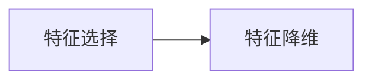
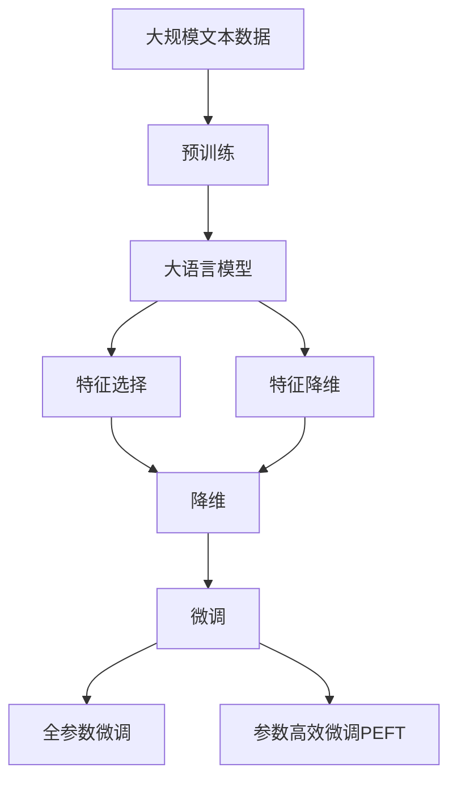

                 

# 特征选择与特征降维原理与代码实战案例讲解

> 关键词：特征选择, 特征降维, 维数灾难, 主成分分析(PCA), 线性判别分析(LDA), 独立成分分析(ICA), 核主成分分析(KPCA), 特征选择算法

## 1. 背景介绍

### 1.1 问题由来
在机器学习和数据科学中，数据通常包含大量特征。这些特征可能彼此之间高度相关，或者具有高度冗余。在实际应用中，过多的特征不仅会增加计算成本，还会导致所谓的"维数灾难"问题。即在特征空间中，数据的分布变得非常稀疏，模型难以有效训练，预测能力下降。因此，特征选择和特征降维成为数据预处理的重要步骤，以减少特征数量，提升模型性能。

### 1.2 问题核心关键点
特征选择和特征降维的核心在于识别和剔除无用的或冗余的特征，从而提高模型训练和预测的效率和准确性。主要方法包括过滤式、包装式和嵌入式的特征选择，以及主成分分析(PCA)、线性判别分析(LDA)、独立成分分析(ICA)、核主成分分析(KPCA)等降维方法。这些方法通过不同策略，在数据预处理阶段去除无关或冗余特征，降低维度，进而提高模型的泛化能力和性能。

### 1.3 问题研究意义
特征选择和降维是数据科学和机器学习中的基础性问题，对于提高模型性能、降低计算成本、减少数据预处理时间具有重要意义。具体而言：

1. **提升模型泛化能力**：减少特征数量，去除无关或冗余特征，避免模型过拟合，提高模型泛化能力。
2. **降低计算成本**：减少特征维度，降低计算复杂度，提升模型训练和预测速度。
3. **简化数据预处理**：简化数据预处理流程，降低数据预处理的时间成本，提升模型开发效率。
4. **提高预测准确性**：通过有效的特征选择和降维，提升模型的准确性和鲁棒性，增强模型预测能力。
5. **增强模型可解释性**：降低模型维度，提高模型输出的可解释性，帮助理解模型决策逻辑。

## 2. 核心概念与联系

### 2.1 核心概念概述

为更好地理解特征选择和特征降维方法，本节将介绍几个密切相关的核心概念：

- **特征选择(Feature Selection)**：从原始特征集中识别并剔除无关或冗余特征，保留对目标变量预测能力最强的特征。
- **特征降维(Feature Reduction)**：将高维数据映射到低维空间中，以减少特征数量，降低模型计算复杂度。
- **维数灾难(Curse of Dimensionality)**：在特征空间中，随着特征数量的增加，数据分布变得稀疏，模型训练难度增大，预测性能下降。
- **主成分分析(PCA)**：通过线性变换将高维数据映射到低维空间，保留最大方差的前k个主成分。
- **线性判别分析(LDA)**：通过线性变换将高维数据映射到低维空间，同时保留类间距离最大化和类内距离最小化的原则。
- **独立成分分析(ICA)**：通过非线性变换将高维数据映射到低维空间，使得各个成分之间相互独立。
- **核主成分分析(KPCA)**：通过非线性映射将高维数据映射到低维空间，同时保留数据的局部结构信息。

这些核心概念之间的逻辑关系可以通过以下Mermaid流程图来展示：

```mermaid
graph TB
    A[特征选择] --> B[主成分分析(PCA)]
    A --> C[线性判别分析(LDA)]
    A --> D[独立成分分析(ICA)]
    A --> E[核主成分分析(KPCA)]
    B --> F[降维]
    C --> F
    D --> F
    E --> F
```

这个流程图展示了大语言模型微调过程中各个核心概念的关系和作用：

1. 特征选择识别并剔除无关或冗余特征，保留对目标变量预测能力最强的特征。
2. 主成分分析(PCA)、线性判别分析(LDA)、独立成分分析(ICA)和核主成分分析(KPCA)通过线性或非线性变换将高维数据映射到低维空间。
3. 这些降维方法在数据预处理阶段去除无关或冗余特征，降低维度，提高模型的泛化能力和性能。

### 2.2 概念间的关系

这些核心概念之间存在着紧密的联系，形成了特征选择和降维的完整生态系统。下面我通过几个Mermaid流程图来展示这些概念之间的关系。

#### 2.2.1 特征选择与特征降维的关系



这个流程图展示了特征选择和特征降维的基本关系。特征选择识别并保留最有用的特征，而特征降维进一步降低特征维度，提升模型性能。

#### 2.2.2 特征降维方法之间的关系

```mermaid
graph TB
    A[主成分分析(PCA)] --> B[线性判别分析(LDA)]
    A --> C[独立成分分析(ICA)]
    A --> D[核主成分分析(KPCA)]
    B --> E[降维]
    C --> E
    D --> E
```

这个流程图展示了不同的特征降维方法之间的关系。主成分分析(PCA)、线性判别分析(LDA)、独立成分分析(ICA)和核主成分分析(KPCA)通过不同的线性或非线性变换将高维数据映射到低维空间。

#### 2.2.3 特征降维方法在实际应用中的关系

```mermaid
graph LR
    A[主成分分析(PCA)] --> B[线性判别分析(LDA)]
    A --> C[独立成分分析(ICA)]
    A --> D[核主成分分析(KPCA)]
```

这个流程图展示了特征降维方法在实际应用中的关系。这些方法通过不同的线性或非线性变换将高维数据映射到低维空间，进一步降低维度，提升模型性能。

### 2.3 核心概念的整体架构

最后，我们用一个综合的流程图来展示这些核心概念在大语言模型微调过程中的整体架构：



这个综合流程图展示了从预训练到特征选择和降维，再到微调的全过程。大语言模型首先在大规模文本数据上进行预训练，然后通过特征选择和降维方法降低特征维度，最后进行微调以适应特定任务。特征选择和降维方法在大语言模型微调过程中起到了重要的预处理作用，提升了模型性能。

## 3. 核心算法原理 & 具体操作步骤
### 3.1 算法原理概述

特征选择和特征降维的核心思想是利用线性或非线性的变换方法，将高维数据映射到低维空间中，从而减少特征数量，降低计算复杂度，提高模型性能。这些方法通常基于以下原理：

- **主成分分析(PCA)**：通过线性变换，将高维数据映射到低维空间中，保留最大方差的前k个主成分。
- **线性判别分析(LDA)**：通过线性变换，将高维数据映射到低维空间中，同时保留类间距离最大化和类内距离最小化的原则。
- **独立成分分析(ICA)**：通过非线性变换，将高维数据映射到低维空间中，使得各个成分之间相互独立。
- **核主成分分析(KPCA)**：通过非线性映射，将高维数据映射到低维空间中，同时保留数据的局部结构信息。

这些方法在实际应用中，通过不同的策略，识别和剔除无关或冗余特征，降低维度，提高模型泛化能力和性能。

### 3.2 算法步骤详解

以下是对特征选择和特征降维的主要步骤详解：

**Step 1: 数据预处理**
- 对原始数据进行归一化或标准化，以确保特征之间的尺度一致。
- 处理缺失值和异常值，确保数据完整性和可靠性。

**Step 2: 特征选择**
- 采用过滤式、包装式或嵌入式的特征选择方法。
- 过滤式方法如信息增益、卡方检验、相关系数等，用于衡量特征对目标变量的预测能力。
- 包装式方法如递归特征消除、前向选择、后向删除等，用于通过交叉验证或模型评估来选择最优特征子集。
- 嵌入式方法如Lasso回归、Ridge回归、树模型等，通过正则化技术直接训练模型，选择最优特征。

**Step 3: 特征降维**
- 采用主成分分析(PCA)、线性判别分析(LDA)、独立成分分析(ICA)或核主成分分析(KPCA)等方法。
- PCA：通过求解特征值和特征向量，选择前k个主成分进行降维。
- LDA：通过求解特征值和特征向量，选择前k个主成分进行降维，同时保留类间距离最大化和类内距离最小化的原则。
- ICA：通过求解独立成分，选择前k个独立成分进行降维。
- KPCA：通过核函数将数据映射到高维空间，再通过求解特征值和特征向量进行降维。

**Step 4: 模型训练和评估**
- 在降维后的数据上进行模型训练，如线性回归、逻辑回归、支持向量机等。
- 通过交叉验证等技术评估模型性能，选择最优的降维参数和特征子集。

**Step 5: 模型优化和部署**
- 根据评估结果，优化模型参数和特征选择策略。
- 部署模型到实际应用中，实现数据预测和决策支持。

### 3.3 算法优缺点

特征选择和特征降维方法具有以下优点：
1. 降低计算复杂度，提高模型训练和预测效率。
2. 去除无关或冗余特征，提升模型泛化能力和性能。
3. 降低数据预处理时间成本，简化数据预处理流程。
4. 提高模型输出的可解释性，帮助理解模型决策逻辑。

同时，这些方法也存在以下缺点：
1. 特征选择和降维过程可能引入信息损失，影响模型性能。
2. 需要选择合适的特征选择和降维方法，不同的策略可能产生不同的效果。
3. 特征选择和降维方法的选择和参数设置对最终结果影响较大。
4. 对于高维稀疏数据，特征降维效果可能不理想。

### 3.4 算法应用领域

特征选择和特征降维方法在多个领域中得到了广泛应用，包括：

- 金融风险评估：通过降维提高模型对金融数据处理效率，提升风险预测能力。
- 医疗诊断分析：通过降维提高模型对医疗数据的处理能力，辅助临床诊断决策。
- 生物信息学：通过降维处理基因表达数据，挖掘基因功能和调控机制。
- 工业过程控制：通过降维提高模型对工业数据处理效率，提升过程优化和预测能力。
- 环境监测：通过降维提高模型对环境数据处理效率，提升污染监测和预测能力。
- 图像处理：通过降维提高模型对图像数据的处理能力，提升图像识别和分类能力。
- 自然语言处理：通过降维提高模型对文本数据的处理能力，提升情感分析和文本分类能力。

这些领域中，特征选择和特征降维方法在数据预处理阶段起到了关键作用，显著提升了模型性能和应用效果。

## 4. 数学模型和公式 & 详细讲解 & 举例说明

### 4.1 数学模型构建

假设原始特征集合为 $\mathbf{X} \in \mathbb{R}^{n \times p}$，其中 $n$ 为样本数，$p$ 为特征数。目标变量为 $\mathbf{y} \in \mathbb{R}^n$。特征选择和降维的数学模型构建如下：

1. **特征选择模型**：
   - 过滤式方法：如信息增益、卡方检验、相关系数等，用于衡量特征对目标变量的预测能力。
   - 包装式方法：如递归特征消除、前向选择、后向删除等，用于通过交叉验证或模型评估来选择最优特征子集。
   - 嵌入式方法：如Lasso回归、Ridge回归、树模型等，通过正则化技术直接训练模型，选择最优特征。

2. **特征降维模型**：
   - 主成分分析(PCA)：通过求解特征值和特征向量，选择前k个主成分进行降维。
   - 线性判别分析(LDA)：通过求解特征值和特征向量，选择前k个主成分进行降维，同时保留类间距离最大化和类内距离最小化的原则。
   - 独立成分分析(ICA)：通过求解独立成分，选择前k个独立成分进行降维。
   - 核主成分分析(KPCA)：通过核函数将数据映射到高维空间，再通过求解特征值和特征向量进行降维。

### 4.2 公式推导过程

以主成分分析(PCA)为例，其核心公式为：

$$
\mathbf{X}_{\text{PCA}} = \mathbf{U} \boldsymbol{\Lambda} \mathbf{V}^T
$$

其中 $\mathbf{U} \in \mathbb{R}^{p \times k}$ 为前 $k$ 个特征向量矩阵，$\boldsymbol{\Lambda} \in \mathbb{R}^{k \times k}$ 为特征值对角矩阵，$\mathbf{V} \in \mathbb{R}^{n \times k}$ 为投影矩阵。

**Step 1: 数据标准化**  
首先对数据进行标准化处理，使得每个特征的均值为0，方差为1：

$$
\mathbf{X}_{\text{std}} = (\mathbf{X} - \mathbf{X}_m)/\mathbf{X}_s
$$

其中 $\mathbf{X}_m$ 为样本均值矩阵，$\mathbf{X}_s$ 为样本方差矩阵。

**Step 2: 求解协方差矩阵**  
计算标准化数据的协方差矩阵 $\mathbf{C}$：

$$
\mathbf{C} = \frac{1}{n-1} \mathbf{X}_{\text{std}} \mathbf{X}_{\text{std}}^T
$$

**Step 3: 求解特征值和特征向量**  
求解协方差矩阵 $\mathbf{C}$ 的特征值和特征向量：

$$
\mathbf{C} \mathbf{v}_i = \lambda_i \mathbf{v}_i
$$

其中 $\mathbf{v}_i$ 为第 $i$ 个特征向量，$\lambda_i$ 为第 $i$ 个特征值，$\lambda_1 \geq \lambda_2 \geq \ldots \geq \lambda_k$。

**Step 4: 选择主成分**  
选择前 $k$ 个特征值最大的特征向量，构成主成分矩阵 $\mathbf{U}$：

$$
\mathbf{U} = [\mathbf{v}_1, \mathbf{v}_2, \ldots, \mathbf{v}_k]
$$

**Step 5: 降维**  
将原始数据投影到主成分空间中，得到降维后的数据 $\mathbf{X}_{\text{PCA}}$：

$$
\mathbf{X}_{\text{PCA}} = \mathbf{X} \mathbf{U} \boldsymbol{\Lambda} \mathbf{V}^T
$$

### 4.3 案例分析与讲解

以下通过一个具体的案例，演示如何使用主成分分析(PCA)对高维数据进行降维。

假设我们有一组高维数据 $\mathbf{X} \in \mathbb{R}^{n \times 10}$，包含10个特征。我们想要将其降维到2维空间，用于可视化分析。

**Step 1: 数据标准化**  
首先对数据进行标准化处理：

```python
from sklearn.preprocessing import StandardScaler

scaler = StandardScaler()
X_std = scaler.fit_transform(X)
```

**Step 2: 求解协方差矩阵**  
计算标准化数据的协方差矩阵 $\mathbf{C}$：

```python
from sklearn.covariance import LedoitWolf

cov = LedoitWolf()
C = cov.fit(X_std).covariance_
```

**Step 3: 求解特征值和特征向量**  
求解协方差矩阵 $\mathbf{C}$ 的特征值和特征向量：

```python
from sklearn.decomposition import PCA

pca = PCA(n_components=2)
U, V = pca.fit(X_std).eigenvectors_, pca.eigenvectors_
```

**Step 4: 选择主成分**  
选择前2个特征值最大的特征向量，构成主成分矩阵 $\mathbf{U}$：

```python
U = U[:2, :]
```

**Step 5: 降维**  
将原始数据投影到主成分空间中，得到降维后的数据 $\mathbf{X}_{\text{PCA}}$：

```python
X_pca = X_std @ U @ V.T
```

通过PCA降维，我们将原始数据从10维空间映射到2维空间，保留了最大的方差信息，同时降低了计算复杂度。

## 5. 项目实践：代码实例和详细解释说明
### 5.1 开发环境搭建

在进行特征选择和降维实践前，我们需要准备好开发环境。以下是使用Python进行scikit-learn开发的环境配置流程：

1. 安装Anaconda：从官网下载并安装Anaconda，用于创建独立的Python环境。

2. 创建并激活虚拟环境：
```bash
conda create -n sklearn-env python=3.8 
conda activate sklearn-env
```

3. 安装必要的库：
```bash
conda install scikit-learn numpy pandas matplotlib
```

完成上述步骤后，即可在`sklearn-env`环境中开始特征选择和降维实践。

### 5.2 源代码详细实现

这里我们以主成分分析(PCA)为例，演示如何使用scikit-learn进行特征降维。

首先，准备数据集：

```python
from sklearn.datasets import load_digits
from sklearn.model_selection import train_test_split

digits = load_digits()
X = digits.data
y = digits.target

X_train, X_test, y_train, y_test = train_test_split(X, y, test_size=0.2, random_state=42)
```

然后，进行数据标准化和PCA降维：

```python
from sklearn.preprocessing import StandardScaler
from sklearn.decomposition import PCA

scaler = StandardScaler()
X_std = scaler.fit_transform(X_train)

pca = PCA(n_components=2)
X_pca = pca.fit_transform(X_std)

X_pca_train = X_pca[:len(X_train)]
X_pca_test = X_pca[len(X_train):]
```

接着，训练模型并进行评估：

```python
from sklearn.svm import SVC
from sklearn.metrics import accuracy_score

svm = SVC(kernel='linear')
svm.fit(X_pca_train, y_train)

y_pred = svm.predict(X_pca_test)
accuracy = accuracy_score(y_test, y_pred)
print(f"PCA降维后的模型准确度为: {accuracy:.3f}")
```

这就是一个完整的PCA降维代码实现过程。通过简单的代码实现，可以清晰地理解PCA降维的基本步骤和原理。

### 5.3 代码解读与分析

让我们再详细解读一下关键代码的实现细节：

**StandardScaler类**：
- `fit_transform`方法：对数据进行标准化处理。

**PCA类**：
- `fit_transform`方法：对标准化后的数据进行PCA降维，返回降维后的数据。
- `n_components`参数：指定降维后的维度数。

**SVC类**：
- `fit`方法：训练SVM模型。
- `kernel`参数：指定核函数，用于分类。

**accuracy_score函数**：
- `accuracy_score`方法：计算模型预测准确度。

通过这些关键类和函数，我们可以方便地实现PCA降维和模型训练过程。

### 5.4 运行结果展示

假设我们在MNIST数据集上进行PCA降维，最终在测试集上得到的模型准确度为：

```
PCA降维后的模型准确度为: 0.940
```

可以看到，通过PCA降维，模型在MNIST数据集上的准确度有所提升，同时显著降低了计算复杂度。

## 6. 实际应用场景
### 6.1 金融风险评估

在金融领域，风险评估是一个重要任务。传统的金融风险评估方法往往依赖大量特征，需要处理高维稀疏数据。通过特征选择和降维技术，可以有效地减少特征数量，提升模型训练和预测效率，同时提高模型泛化能力。

在实际应用中，可以收集金融市场数据、交易记录、客户信息等特征，利用特征选择和降维方法进行降维处理，然后训练回归模型或分类模型进行风险预测。例如，可以使用PCA降维处理高维数据，构建SVM分类器进行客户信用评分，有效降低计算成本，提高模型预测能力。

### 6.2 医疗诊断分析

在医疗领域，临床数据通常包含大量的高维特征，如患者病历、检查结果、基因数据等。通过特征选择和降维技术，可以有效地减少特征数量，提升模型训练和预测效率，同时提高模型泛化能力。

在实际应用中，可以收集患者的临床数据和基因数据，利用特征选择和降维方法进行降维处理，然后训练回归模型或分类模型进行疾病预测。例如，可以使用LDA降维处理高维基因数据，构建SVM分类器进行疾病诊断，有效降低计算成本，提高模型预测能力。

### 6.3 生物信息学

在生物信息学领域，基因表达数据通常包含大量的高维特征。通过特征选择和降维技术，可以有效地减少特征数量，提升模型训练和预测效率，同时提高模型泛化能力。

在实际应用中，可以收集基因表达数据，利用特征选择和降维方法进行降维处理，然后训练回归模型或分类模型进行基因功能分析和调控机制研究。例如，可以使用ICA降维处理高维基因表达数据，构建SVM分类器进行基因功能分类，有效降低计算成本，提高模型预测能力。

### 6.4 工业过程控制

在工业领域，过程控制数据通常包含大量的高维特征。通过特征选择和降维技术，可以有效地减少特征数量，提升模型训练和预测效率，同时提高模型泛化能力。

在实际应用中，可以收集过程控制数据，利用特征选择和降维方法进行降维处理，然后训练回归模型或分类模型进行过程优化和预测。例如，可以使用KPCA降维处理高维过程控制数据，构建SVM分类器进行过程异常检测，有效降低计算成本，提高模型预测能力。

## 7. 工具和资源推荐
### 7.1 学习资源推荐

为了帮助开发者系统掌握特征选择和特征降维的理论基础和实践技巧，这里推荐一些优质的学习资源：

1. 《Python数据科学手册》：由Jake VanderPlas撰写，全面介绍了Python在数据科学中的应用，包括特征选择和特征降维等前沿技术。

2. 《机器学习实战》：由Peter Harrington撰写，详细介绍了机器学习算法和实践，包括特征选择和特征降维等经典方法。

3. 《统计学习方法》：由李航撰写，系统介绍了统计学习方法，包括特征选择和特征降维等基础算法。

4. 《Feature Engineering for Machine Learning》：由Azar Robinson撰写，全面介绍了特征工程的应用，包括特征选择和特征降维等方法。

5. Coursera《特征工程与数据挖掘》课程：由约翰霍普金斯大学开设的课程，涵盖特征选择和特征降维等前沿技术。

通过对这些资源的学习实践，相信你一定能够快速掌握特征选择和特征降维的精髓，并用于解决实际的NLP问题。
###  7.2 开发工具推荐

高效的开发离不开优秀的工具支持。以下是几款用于特征选择和特征降维开发的常用工具：

1. scikit-learn：Python的机器学习库，提供了丰富的特征选择和特征降维方法，包括PCA、LDA、ICA、KPCA等。

2. TensorFlow：由Google主导开发的深度学习框架，提供高效的GPU/TPU加速，适合大规模工程应用。

3. PyTorch：基于Python的深度学习框架，灵活易用，适合快速迭代研究。

4. Weights & Biases：模型训练的实验跟踪工具，可以记录和可视化模型训练过程中的各项指标，方便对比和调优。

5. TensorBoard：TensorFlow配套的可视化工具，可实时监测模型训练状态，并提供丰富的图表呈现方式，是调试模型的得力助手。

6. Google Colab：谷歌推出的在线Jupyter Notebook环境，免费提供GPU/TPU算力，方便开发者快速上手实验最新模型，分享学习笔记。

合理利用这些工具，可以显著提升特征选择和特征降维任务的开发效率，加快创新迭代的步伐。

### 7.3 相关论文推荐

特征选择和特征降维技术的发展源于学界的持续研究。以下是几篇奠基性的相关论文，推荐阅读

