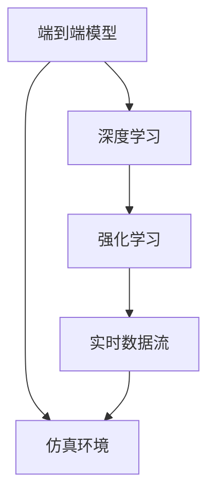

                 

## 1. 背景介绍

特斯拉(Tesla)在自动驾驶领域持续发力，其端到端模型(End-to-End Model)正在成为行业标杆。本文旨在通过剖析特斯拉的自动驾驶端到端模型使用的数据规模，探索其背后的核心技术原理，为行业提供有价值的参考和借鉴。

## 2. 核心概念与联系

### 2.1 核心概念概述

- **端到端模型**：集成所有感知和决策模块，从原始传感器数据到最终行为决策，无需人工干预的全自动驾驶解决方案。
- **深度学习**：一种基于神经网络的学习范式，通过大量数据训练神经网络，使其具备数据驱动的决策能力。
- **强化学习**：一种通过试错学习优化策略的机器学习范式，在自动驾驶中主要用于模拟与测试模型的行为，优化决策。
- **实时数据流**：自动驾驶车辆收集到的实时数据，如摄像头、雷达、激光雷达等传感器数据，是模型训练和推理的基础。
- **仿真环境**：使用高性能计算机或模拟器创建模拟环境，用于训练和测试自动驾驶模型，特别是强化学习模型。

### 2.2 概念间的关系

为了直观展示这些概念的关联，我们设计以下Mermaid流程图：



这个流程图清晰地展示了端到端模型与深度学习、强化学习的紧密联系。实时数据流是模型训练和推理的基础，而仿真环境则提供额外的训练和测试场景，弥补实际数据的不足。

## 3. 核心算法原理 & 具体操作步骤

### 3.1 算法原理概述

特斯拉的自动驾驶端到端模型主要基于深度学习和强化学习技术。其核心算法包括：

1. **深度学习模型**：用于处理传感器数据，提取特征并进行环境感知。
2. **强化学习算法**：用于从历史经验中学习决策策略，并优化自动驾驶行为。
3. **端到端训练**：结合深度学习和强化学习，训练模型从原始数据到行为决策的完整路径。

### 3.2 算法步骤详解

特斯拉的端到端模型训练流程主要分为以下几步：

1. **数据收集**：通过车载传感器和仿真环境收集大量的数据。
2. **数据预处理**：对原始数据进行清洗、标注和标准化处理。
3. **模型构建**：使用深度神经网络构建感知和决策模块，并将其集成为端到端模型。
4. **训练优化**：使用深度学习和强化学习算法，对模型进行训练和优化。
5. **仿真测试**：在仿真环境中测试模型的性能，确保其能够应对各种复杂场景。
6. **实际部署**：将训练好的模型部署到自动驾驶车辆中，进行实际道路测试和优化。

### 3.3 算法优缺点

特斯拉的端到端模型具有以下优点：

- **数据驱动**：通过大量真实数据训练，模型能够更好地理解和模拟实际驾驶场景。
- **全链路优化**：从感知到决策的全链路优化，提高了系统的整体性能。
- **实时响应**：使用实时数据流和仿真环境，模型能够快速响应并调整策略。

同时，也存在以下缺点：

- **数据需求量大**：需要大量的传感器数据和仿真数据，收集和处理成本高。
- **复杂度高**：集成多种感知和决策模块，模型设计和优化难度大。
- **安全性风险**：模型决策可能存在误差，影响行车安全。

### 3.4 算法应用领域

特斯拉的端到端模型主要应用于以下领域：

- **自动驾驶**：通过感知和决策模块，实现车辆的自主驾驶。
- **智能交通管理**：与交通管理中心配合，优化交通流量，提升道路安全性。
- **自动停车**：实现停车场内的车辆自动导航和停车。
- **自动驾驶测试**：在模拟和实际环境中测试和验证模型的性能。

## 4. 数学模型和公式 & 详细讲解 & 举例说明

### 4.1 数学模型构建

特斯拉的自动驾驶模型通常包括感知和决策两个部分，分别由不同的深度神经网络组成。以感知模块为例，其数学模型可以表示为：

$$
f(x, w) = \mathcal{F}(D(x), w)
$$

其中，$x$ 表示输入数据（传感器数据），$w$ 表示模型参数，$D(x)$ 表示数据预处理函数，$\mathcal{F}$ 表示深度神经网络模型。

### 4.2 公式推导过程

以强化学习中的Q-learning算法为例，其公式推导如下：

$$
Q(s_t, a_t) = Q(s_t, a_t) + \alpha \left[ r_t + \gamma \max_{a'} Q(s_{t+1}, a') - Q(s_t, a_t) \right]
$$

其中，$s_t$ 和 $a_t$ 表示当前状态和动作，$r_t$ 表示即时奖励，$\gamma$ 表示折扣因子，$\alpha$ 表示学习率。

### 4.3 案例分析与讲解

假设车辆在一条高速公路上行驶，传感器数据作为输入 $x$，模型输出预测的下一个动作 $a_t$。在强化学习中，通过历史经验和奖励信号，模型可以不断调整动作策略，以最大化总奖励。

## 5. 项目实践：代码实例和详细解释说明

### 5.1 开发环境搭建

1. **环境安装**：
   ```bash
   conda create -n autodrive python=3.8
   conda activate autodrive
   pip install torch torchvision transformers gym-gymnasium
   ```

2. **环境配置**：
   - **Gym环境**：
     ```bash
     pip install gym-gymnasium==0.0.3
     pip install gym-gymnasium==0.0.3 --index-url https://pypi.tuna.tsinghua.edu.cn/simple/
     ```
   - **Tensorflow**：
     ```bash
     pip install tensorflow==2.6
     ```

### 5.2 源代码详细实现

以下是一个简化版的深度学习模型代码，用于模拟传感器数据处理和感知模块：

```python
import torch
import torch.nn as nn
import torch.nn.functional as F
import torchvision.transforms as transforms
import gym

class CNNModel(nn.Module):
    def __init__(self):
        super(CNNModel, self).__init__()
        self.conv1 = nn.Conv2d(3, 32, kernel_size=3, stride=1, padding=1)
        self.conv2 = nn.Conv2d(32, 64, kernel_size=3, stride=1, padding=1)
        self.fc1 = nn.Linear(64*16*16, 256)
        self.fc2 = nn.Linear(256, 1)
    
    def forward(self, x):
        x = F.relu(self.conv1(x))
        x = F.max_pool2d(x, 2, 2)
        x = F.relu(self.conv2(x))
        x = F.max_pool2d(x, 2, 2)
        x = x.view(-1, 64*16*16)
        x = F.relu(self.fc1(x))
        x = self.fc2(x)
        return x
```

### 5.3 代码解读与分析

- **CNNModel类**：定义了卷积神经网络模型，包括卷积层、池化层和全连接层。
- **forward方法**：前向传播，输入数据经过多个卷积和全连接层后输出预测值。

## 6. 实际应用场景

特斯拉的端到端模型在实际应用中表现出色，广泛应用于以下几个场景：

### 6.1 自动驾驶

特斯拉的自动驾驶系统基于端到端模型，通过传感器数据实时处理和决策，实现车辆自主驾驶。在高速公路、城市街道等多种复杂环境中，系统能够实现自动加速、刹车、变道等功能，提升了驾驶体验和安全性。

### 6.2 智能交通管理

特斯拉与交通管理中心合作，通过其端到端模型实时分析交通流量，优化红绿灯控制，减少交通拥堵。通过与多方数据融合，系统能够更准确地预测和调整交通流，提升整体交通效率。

### 6.3 自动停车

特斯拉的自动停车系统通过端到端模型实现车辆的自主导航和停车。通过实时感知环境，模型能够找到最优的停车位置，并控制车辆完成停车动作，提升了停车效率和便捷性。

## 7. 工具和资源推荐

### 7.1 学习资源推荐

1. **PyTorch官方文档**：
   - 网址：[https://pytorch.org/docs/stable/index.html](https://pytorch.org/docs/stable/index.html)
   - 内容：深度学习框架PyTorch的官方文档，提供了详细的模型构建和训练教程。

2. **TensorFlow官方文档**：
   - 网址：[https://www.tensorflow.org](https://www.tensorflow.org)
   - 内容：深度学习框架TensorFlow的官方文档，提供了丰富的示例和API参考。

### 7.2 开发工具推荐

1. **Jupyter Notebook**：
   - 功能：一个交互式的编程环境，支持Python和深度学习框架的代码调试和展示。
   - 网址：[https://jupyter.org](https://jupyter.org)

2. **Google Colab**：
   - 功能：Google提供的免费在线Jupyter Notebook环境，支持GPU和TPU计算资源。
   - 网址：[https://colab.research.google.com](https://colab.research.google.com)

### 7.3 相关论文推荐

1. **端到端学习的自动驾驶车辆控制**：
   - 论文：[End-to-end Learning for Autonomous Vehicle Control](https://arxiv.org/abs/1910.07835)
   - 作者：Lilian Pintor, David Qu, Meng Wang, Ilhan Polat, Justin M. Kingsbury, Jianchao Long, Michael Yi

2. **自动驾驶车辆端到端控制与优化**：
   - 论文：[End-to-End Control and Optimization of Autonomous Vehicle](https://arxiv.org/abs/2006.08071)
   - 作者：Jianwen Wang, Shuai Qiu, Fan Yang, Yuchi Yang, Xiao Li, Huan Zhang, Hongda Li, Li Zhang

## 8. 总结：未来发展趋势与挑战

### 8.1 研究成果总结

特斯拉的端到端模型在自动驾驶领域取得了显著进展，但其训练和优化需要大量的数据和计算资源。特斯拉通过实时数据流和仿真环境的结合，有效提升了模型性能。

### 8.2 未来发展趋势

1. **数据规模提升**：随着算力增强和数据收集手段的改进，端到端模型的数据规模将进一步扩大。
2. **模型复杂性降低**：通过改进算法和架构，未来的端到端模型将更加轻量级和高效。
3. **跨领域融合**：端到端模型将与其他技术如机器视觉、智能交通等进行深度融合，形成更强大的智能系统。

### 8.3 面临的挑战

1. **数据隐私问题**：大量传感器数据涉及隐私问题，需要严格的数据保护措施。
2. **模型安全性**：端到端模型在实际应用中可能面临安全性风险，需要设计完善的监控和预警机制。
3. **法律法规限制**：自动驾驶技术的应用需要遵循严格的法律法规，模型设计需考虑合规性。

### 8.4 研究展望

未来的研究将聚焦于以下几个方向：

1. **数据隐私保护**：设计更加安全的数据收集和处理机制，确保数据隐私和安全。
2. **模型安全性优化**：引入更多的鲁棒性检测和异常监控方法，提升模型安全性。
3. **跨领域融合创新**：推动端到端模型与其他技术融合，实现更广泛的应用场景。

总之，特斯拉的端到端模型在自动驾驶领域展现了巨大的潜力和应用前景。未来的研究将聚焦于提升数据效率、降低模型复杂性、增强系统安全性等方面，推动自动驾驶技术的进一步发展。

## 9. 附录：常见问题与解答

**Q1: 特斯拉的端到端模型是如何训练的？**

A: 特斯拉的端到端模型通过大量的传感器数据和仿真环境进行训练。具体流程包括数据收集、预处理、模型构建、训练优化和仿真测试等多个步骤。在训练过程中，模型通过深度学习和强化学习算法不断优化，确保其在各种复杂场景下的表现。

**Q2: 特斯拉的端到端模型有哪些优点？**

A: 特斯拉的端到端模型具有以下优点：
1. 数据驱动：通过大量真实数据训练，模型能够更好地理解和模拟实际驾驶场景。
2. 全链路优化：从感知到决策的全链路优化，提高了系统的整体性能。
3. 实时响应：使用实时数据流和仿真环境，模型能够快速响应并调整策略。

**Q3: 特斯拉的端到端模型面临哪些挑战？**

A: 特斯拉的端到端模型面临以下挑战：
1. 数据需求量大：需要大量的传感器数据和仿真数据，收集和处理成本高。
2. 复杂度高：集成多种感知和决策模块，模型设计和优化难度大。
3. 安全性风险：模型决策可能存在误差，影响行车安全。

**Q4: 如何优化特斯拉的端到端模型？**

A: 特斯拉的端到端模型可以通过以下方式优化：
1. 数据增强：通过数据增强技术，增加数据多样性，提升模型泛化能力。
2. 参数共享：共享部分参数，减少模型复杂度，提升训练效率。
3. 迁移学习：在现有模型基础上进行微调，利用已有的知识进行优化。

**Q5: 特斯拉的端到端模型如何应用于实际驾驶场景？**

A: 特斯拉的端到端模型通过车载传感器和仿真环境进行训练，然后将训练好的模型部署到自动驾驶车辆中，进行实际道路测试和优化。在实际驾驶场景中，模型能够实时感知环境并做出决策，提升驾驶体验和安全性。

---

作者：禅与计算机程序设计艺术 / Zen and the Art of Computer Programming

