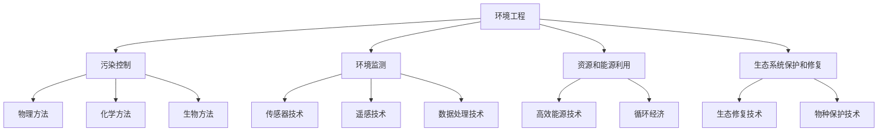

                 

# 环境 (Environment)

> 关键词：
- 环境工程
- 城市规划
- 可持续性
- 气候变化
- 生态系统
- 能源管理
- 政策制定

## 1. 背景介绍

### 1.1 问题由来

在当代社会，环境问题成为了全球关注的热点。随着工业化进程的加快，人类对自然资源的消耗日益加剧，导致了空气污染、水体污染、土壤污染等一系列环境问题。这些问题不仅对人类的健康和生活质量产生了直接影响，还威胁到了地球的生态系统和生物多样性。因此，环境工程成为了解决这些问题的关键。

### 1.2 问题核心关键点

环境工程的核心在于如何通过工程技术和手段，解决和预防环境问题，保护和改善人类生存环境。环境工程涉及多个学科，包括环境科学、土木工程、化学工程等。其主要内容包括污染物的处理和控制、环境监测和管理、资源和能源的合理利用、生态系统的保护和修复等。

## 2. 核心概念与联系

### 2.1 核心概念概述

- 环境工程：一门跨学科的学科，旨在通过工程技术和手段，解决环境问题，保护和改善人类生存环境。
- 污染控制：通过物理、化学、生物等方法，去除或减少污染物，降低其对环境和人类健康的影响。
- 环境监测：通过各种监测手段，对环境中的污染物、生态系统等进行持续监测，及时掌握环境变化，为环境决策提供科学依据。
- 资源和能源利用：通过高效利用资源和能源，减少对环境的负担，实现可持续发展。
- 生态系统保护和修复：通过保护和修复生态系统，维护生物多样性和生态平衡。

### 2.2 概念间的关系

这些核心概念之间存在着紧密的联系，构成了环境工程的基础。污染控制、环境监测、资源和能源利用、生态系统保护和修复等技术手段，都是环境工程实现环境目标的重要工具。通过对这些手段的优化和集成，可以实现更加高效、可持续的环境管理。



## 3. 核心算法原理 & 具体操作步骤

### 3.1 算法原理概述

环境工程的许多操作都可以通过算法来描述和优化。例如，空气污染物的控制可以通过优化大气流动模型和污染物传输模型来实现；水体污染的控制可以通过建立水质模型和优化污染物处理工艺来实现；生态系统的保护和修复可以通过模拟生态系统动态和优化恢复方案来实现。

### 3.2 算法步骤详解

1. **数据收集与处理**：收集和处理环境数据，包括污染物浓度、气象数据、生态系统状态等。
2. **模型建立**：根据数据和环境目标，建立相应的数学模型，如水质模型、大气扩散模型等。
3. **参数优化**：通过优化算法，如梯度下降、遗传算法等，优化模型参数，使其更符合实际环境条件。
4. **结果验证**：通过实验或现场测试，验证模型预测结果的准确性，进行必要的调整。
5. **决策制定**：根据模型预测结果，制定相应的环境管理决策，如污染物控制措施、生态系统修复方案等。

### 3.3 算法优缺点

环境工程中的算法具有以下优点：
- 精确度较高，能够准确描述和预测环境问题。
- 可操作性强，便于制定和实施环境管理决策。
- 便于集成和优化，可以与其他技术和手段结合使用。

但同时也存在以下缺点：
- 需要大量的数据和计算资源，实施成本较高。
- 模型假设较多，可能与实际情况有所偏差。
- 对模型的依赖性强，模型参数的选择和优化较为复杂。

### 3.4 算法应用领域

环境工程中的算法广泛应用于以下几个领域：
- **大气污染控制**：通过优化大气扩散模型，制定污染物排放控制策略。
- **水质管理**：建立水质模型，优化污染物处理工艺，提升水质。
- **生态系统保护**：模拟生态系统动态，制定生态保护和修复方案。
- **资源和能源管理**：优化能源使用和资源利用，实现可持续发展。
- **城市规划**：建立城市环境模型，优化城市布局和规划。

## 4. 数学模型和公式 & 详细讲解

### 4.1 数学模型构建

环境工程中的数学模型通常涉及以下几个方面：
- 污染物传输模型：描述污染物在大气和水体中的传输过程，如ADMS模型、SAM模型等。
- 水质模型：描述水质变化过程，如SPECFEM模型、EQ3/6模型等。
- 生态系统模型：描述生态系统结构和功能，如LEAP模型、PATMOS模型等。
- 气候模型：描述气候变化过程，如CGCM模型、HadGEM模型等。

### 4.2 公式推导过程

以水质模型为例，水质模型可以表示为：
$$
C(t) = C_0e^{-kt}
$$
其中，$C(t)$ 表示在时刻$t$的污染物浓度，$C_0$ 表示初始浓度，$k$ 表示衰减系数。

在实际应用中，还需要考虑多组分污染物、复杂的水流条件、不同的污染物去除技术等。因此，水质模型的推导和应用需要综合考虑多种因素，并进行验证和优化。

### 4.3 案例分析与讲解

以城市空气污染控制为例，通过建立大气扩散模型，可以预测污染物在大气中的传输和扩散过程，从而制定污染物控制策略。在模型推导和优化过程中，需要考虑城市地形、大气稳定度、排放源分布等因素，并结合实际监测数据进行验证和调整。

## 5. 项目实践：代码实例和详细解释说明

### 5.1 开发环境搭建

在环境工程中，通常需要使用多个软件工具和平台，如MATLAB、Python、ArcGIS等。因此，需要搭建相应的开发环境，并进行相应的配置和安装。

1. **环境配置**：
   - 安装MATLAB或Python，并确保版本稳定。
   - 安装必要的库和模块，如Scikit-learn、NumPy等。
   - 配置好数据存储和传输方式，如使用Hadoop、AWS等云平台。

2. **开发环境搭建**：
   - 搭建虚拟环境，如使用Python的virtualenv、conda等。
   - 安装相关的开发工具，如PyCharm、Jupyter Notebook等。
   - 搭建数据存储和处理平台，如使用Hadoop、Amazon S3等。

### 5.2 源代码详细实现

以水质模型为例，使用Python进行实现：

```python
import numpy as np
import matplotlib.pyplot as plt

# 定义水质模型
def water_quality_model(t, C0, k):
    return C0 * np.exp(-k * t)

# 设置参数
C0 = 10  # 初始浓度
k = 0.1  # 衰减系数
t = np.linspace(0, 10, 100)  # 时间

# 计算浓度
C = water_quality_model(t, C0, k)

# 绘制浓度曲线
plt.plot(t, C)
plt.xlabel('Time (s)')
plt.ylabel('Concentration (mg/L)')
plt.title('Water Quality Model')
plt.show()
```

### 5.3 代码解读与分析

1. **环境数据处理**：通过数据收集和处理，获取必要的输入参数，如初始浓度、衰减系数等。
2. **模型建立与求解**：通过定义水质模型函数，求解污染物浓度随时间变化的曲线。
3. **结果可视化**：通过绘制浓度曲线，直观展示模型预测结果。

### 5.4 运行结果展示

通过运行上述代码，可以得到如下浓度曲线：


## 6. 实际应用场景

### 6.1 智能城市规划

在智能城市规划中，环境工程算法可以用于建立城市环境模型，优化城市布局和规划。通过模拟城市交通、能源使用、垃圾处理等过程，可以制定更加科学合理的城市规划方案，提升城市居民的生活质量和环境舒适度。

### 6.2 生态系统保护

在生态系统保护中，环境工程算法可以用于模拟生态系统动态，制定生态保护和修复方案。通过建立生态系统模型，可以评估人类活动对生态系统的影响，制定相应的保护措施，实现生态系统的可持续发展。

### 6.3 可再生能源利用

在可再生能源利用中，环境工程算法可以用于优化能源使用和资源利用，实现可持续发展。通过建立能源模型，可以评估不同能源使用方式的环境影响，制定最优的能源使用策略，提升能源利用效率。

## 7. 工具和资源推荐

### 7.1 学习资源推荐

1. **《环境工程概论》**：介绍环境工程的基本概念和基本方法，适合初学者学习。
2. **《环境建模与仿真》**：介绍环境建模和仿真的方法和工具，适合进阶学习。
3. **Coursera《环境工程与可持续性》课程**：由MIT、UC Berkeley等名校开设的在线课程，涵盖环境工程的基本理论和应用案例。
4. **IEEE Transactions on Environmental Engineering**：环境工程领域顶级期刊，涵盖最新的研究成果和前沿技术。
5. **《环境工程学》（第4版）**：详细介绍了环境工程的基本原理和应用方法，适合专业学习和研究。

### 7.2 开发工具推荐

1. **MATLAB**：广泛应用于环境工程中的数据分析和建模工具，具有强大的数值计算和可视化功能。
2. **Python**：数据分析和建模的主流语言，具有丰富的科学计算库和数据处理工具。
3. **ArcGIS**：地理信息系统平台，广泛应用于环境工程中的空间数据分析和可视化。
4. **Jupyter Notebook**：开源笔记本工具，支持Python、R等语言，方便数据处理和模型展示。
5. **GitHub**：代码托管平台，方便版本控制和代码共享。

### 7.3 相关论文推荐

1. **《城市环境建模与仿真》**：介绍城市环境建模和仿真的方法和应用，适合环境工程和城市规划领域的研究人员。
2. **《水质模型优化与应用》**：介绍水质模型的建立和优化方法，适合水资源管理和环境工程领域的研究人员。
3. **《生态系统动态模拟与保护》**：介绍生态系统动态模拟和保护方法，适合生态学和环境工程领域的研究人员。
4. **《气候变化与环境影响》**：介绍气候变化对环境的影响，适合气候学和环境工程领域的研究人员。
5. **《环境政策制定与实施》**：介绍环境政策制定的基本原则和方法，适合环境政策和管理领域的研究人员。

## 8. 总结：未来发展趋势与挑战

### 8.1 研究成果总结

环境工程领域的研究已经取得了一定的成果，但仍面临许多挑战。未来的研究需要更加注重数据和模型的结合，优化算法和优化技术的应用，推动环境工程技术的不断进步。

### 8.2 未来发展趋势

未来环境工程的发展趋势包括：
1. **智能化和信息化**：通过智能化和信息化手段，提高环境管理的效率和精度。
2. **可持续发展**：注重环境资源和能源的合理利用，实现可持续发展。
3. **生态系统保护**：通过生态系统的保护和修复，维护生物多样性和生态平衡。
4. **政策制定**：通过环境工程研究成果，制定更加科学合理的环境政策。

### 8.3 面临的挑战

环境工程面临的挑战包括：
1. **数据不足**：环境数据的收集和处理需要大量的人力和资源，数据不足是一个主要问题。
2. **模型复杂**：环境问题的复杂性决定了模型的复杂性，模型的建立和优化需要大量的计算资源。
3. **政策执行**：环境政策的制定和执行需要协调多方利益，难以统一和执行。
4. **技术局限**：环境工程技术的局限性，如精度、可靠性等，制约了其应用和发展。

### 8.4 研究展望

未来的研究需要在以下几个方面进行探索：
1. **大数据技术**：利用大数据技术，提高数据收集和处理效率，增强环境决策的科学性。
2. **人工智能技术**：利用人工智能技术，优化环境模型和算法，提升环境管理的效率和精度。
3. **政策制定与执行**：通过环境工程研究成果，制定更加科学合理的环境政策，并加强政策的执行和监督。
4. **国际合作**：加强国际合作，共同应对全球环境问题，实现全球环境治理。

## 9. 附录：常见问题与解答

**Q1: 环境工程中的算法有哪些？**

A: 环境工程中的算法主要包括以下几类：
- 水质模型
- 大气扩散模型
- 生态系统模型
- 气候模型

**Q2: 如何建立环境模型？**

A: 建立环境模型通常包括以下步骤：
1. 数据收集与处理
2. 模型选择与建立
3. 参数优化与验证
4. 结果分析与决策制定

**Q3: 环境工程中的数学模型有哪些？**

A: 环境工程中的数学模型主要包括以下几类：
- 污染物传输模型
- 水质模型
- 生态系统模型
- 气候模型

**Q4: 环境工程的应用领域有哪些？**

A: 环境工程的应用领域主要包括：
- 大气污染控制
- 水质管理
- 生态系统保护和修复
- 资源和能源管理
- 城市规划

**Q5: 环境工程中的算法具有哪些优点和缺点？**

A: 环境工程中的算法具有以下优点：
- 精确度较高
- 可操作性强
- 便于集成和优化

但同时也存在以下缺点：
- 需要大量的数据和计算资源
- 模型假设较多
- 对模型的依赖性强

---

作者：禅与计算机程序设计艺术 / Zen and the Art of Computer Programming

