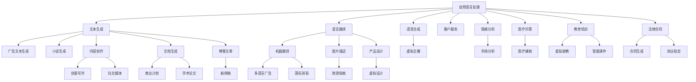

                 

# 生成式AIGC：AI技术的商业化路径

> 关键词：生成式AI, AIGC, 自然语言处理, 计算机视觉, 音乐生成, 商业化

## 1. 背景介绍

### 1.1 问题由来
人工智能(AI)技术在近年来取得了长足的发展，生成式人工智能（Generative AI）作为AI的重要分支，尤其引人注目。生成式AI不仅能模拟并创造现实世界的虚拟内容，还能生成具有创意和独特性的内容，如文本、图像、音乐等。这些技术突破正在逐步向商业化应用转化，带来新的发展机遇和挑战。

生成式AI的崛起源于两个关键因素：
- **计算能力的提升**：如GPU、TPU等高性能硬件加速了深度学习模型的训练与优化，降低了生成式模型的开发成本。
- **数据驱动的改进**：大规模高质量数据集为模型训练提供了丰富的语料支持，使得生成式AI在多个领域取得突破。

近年来，生成式AI已经在视觉生成、自然语言处理、音乐创作等领域取得了丰硕成果，并在广告、娱乐、教育等行业得到广泛应用。然而，如何将这些技术成果更好地转化为商业价值，仍是当下重要的研究课题。

### 1.2 问题核心关键点
生成式AI的商业化应用主要关注以下几个方面：
- **质量控制**：确保生成的内容质量高、内容符合商业场景需求。
- **效率提升**：提高生成过程的效率，降低人力成本和时间成本。
- **适用性扩展**：能够应对多样化、变化快速的商业场景。
- **创新价值**：通过创新内容驱动消费者需求，提升品牌影响力。
- **合规性与伦理**：保障内容创作的合规性与伦理，避免侵权和伦理问题。

针对以上挑战，本文将详细探讨生成式AI在商业化过程中的核心概念、算法原理及应用实践。

### 1.3 问题研究意义
生成式AI的商业化应用将推动各行业创新升级，具有重要意义：

1. **提升内容生产效率**：通过自动生成内容，大幅度提升内容生产效率，减少人力投入。
2. **丰富用户体验**：高质量的生成式内容能够提升用户体验，增强品牌形象和客户粘性。
3. **创造新业务模式**：如智能广告、虚拟主播、教育互动等新业务模式，带来新的商业机会。
4. **驱动创新**：生成式AI可以驱动产品设计、市场营销、客户服务等环节的创新，提升企业竞争力。
5. **应对市场需求**：生成式AI能够快速响应市场变化，满足多样化需求，提升企业市场适应能力。

## 2. 核心概念与联系

### 2.1 核心概念概述

为更好理解生成式AI的商业化应用，本节将介绍几个关键概念：

- **生成式AI (Generative AI)**：一种能自动生成新内容的AI技术，包括文本生成、图像生成、音乐生成等。生成式AI通过训练生成模型，学习数据的生成分布，并据此生成新的数据。
- **AIGC (Artificial Intelligence Generated Content)**：基于生成式AI生成的内容，应用于广告、娱乐、教育、医疗等领域。
- **自然语言处理(NLP)**：生成式AI的重要应用之一，通过训练语言模型，实现文本生成、语言翻译等。
- **计算机视觉(CV)**：生成式AI的重要应用之一，通过训练图像生成模型，实现图像生成、图像增强等。
- **音乐生成(Music Generation)**：生成式AI的重要应用之一，通过训练音乐生成模型，实现音乐创作、风格变换等。
- **生成对抗网络(GANs)**：一种生成式模型，通过训练生成器和判别器，生成高质量的虚拟内容。
- **扩散模型(Diffusion Models)**：一种新兴的生成式模型，通过逐步引入噪声和信号，生成高质量图像和音频。

这些概念之间存在紧密联系，通过合理的组合和应用，能够实现不同领域的商业化落地。

### 2.2 概念间的关系

这些核心概念之间存在以下逻辑关系：

- **生成式AI与AIGC**：生成式AI是AIGC的基础技术，通过生成新的内容，提升AIGC的应用效果。
- **自然语言处理与生成式AI**：NLP是生成式AI的重要应用领域，如文本生成、语言翻译等。
- **计算机视觉与生成式AI**：CV是生成式AI的重要应用领域，如图像生成、图像增强等。
- **音乐生成与生成式AI**：音乐生成是生成式AI的重要应用领域，如自动作曲、风格变换等。
- **GANs与生成式AI**：GANs是生成式AI的重要技术，通过训练生成器和判别器生成高质量内容。
- **扩散模型与生成式AI**：扩散模型是生成式AI的最新进展，通过逐步引入噪声生成高质量图像和音频。

这些概念构成了生成式AI商业化的生态系统，共同推动了AI技术在各领域的应用。

### 2.3 核心概念的整体架构

以上述概念为基础，构建生成式AI商业化的整体架构：



此架构展示了生成式AI在多个领域的商业化应用，涵盖广告、娱乐、教育、医疗等多个场景。

## 3. 核心算法原理 & 具体操作步骤
### 3.1 算法原理概述

生成式AI的商业化应用主要基于以下几种算法：

- **基于序列的生成模型**：如循环神经网络(RNN)、长短期记忆网络(LSTM)、变压器(Transformer)等，通过预测下一个词的概率分布，生成文本内容。
- **基于图像的生成模型**：如卷积神经网络(CNN)、生成对抗网络(GANs)、扩散模型(Diffusion Models)等，通过训练生成器和判别器，生成高质量的图像和音频。
- **基于语音的生成模型**：如循环卷积神经网络(CRCNN)、Transformer-TTS等，通过生成声学模型和语言模型，实现语音合成和语音识别。

这些模型通过训练，学习数据的生成分布，并据此生成新的数据。生成式AI的商业化应用需要对这些模型进行优化，以提高生成内容的质量、效率和适用性。

### 3.2 算法步骤详解

基于序列的生成模型、基于图像的生成模型、基于语音的生成模型，其生成过程一般包含以下步骤：

**Step 1: 数据预处理**
- 收集与业务场景相关的数据集，如文本、图像、语音等。
- 对数据进行预处理，如数据清洗、标注等。
- 划分训练集、验证集和测试集。

**Step 2: 模型训练**
- 选择合适的生成模型，如RNN、LSTM、Transformer等。
- 使用训练集对模型进行训练，调整超参数，优化损失函数。
- 使用验证集对模型进行评估，防止过拟合。
- 选择最优的模型参数，保存模型。

**Step 3: 内容生成**
- 根据业务场景需求，设计输入模板。
- 将输入模板输入生成模型，生成新的内容。
- 对生成的内容进行后处理，如格式调整、排版等。

**Step 4: 模型部署与优化**
- 将训练好的模型部署到服务器或云端，提供API服务。
- 根据反馈信息，不断优化模型，提高生成效果。
- 定期更新数据集，确保模型与业务场景的适配。

### 3.3 算法优缺点

生成式AI在商业化应用中，具有以下优点：

- **高效性**：生成式AI能够快速生成大量高质量内容，大幅提升内容生产效率。
- **多样性**：生成式AI能够生成多种类型的内容，如文本、图像、音乐等，满足多样化需求。
- **低成本**：通过自动生成内容，减少人力成本和时间成本。
- **个性化**：生成式AI能够根据用户需求生成个性化内容，提升用户体验。
- **创新性**：生成式AI能够生成新颖创意内容，驱动创新。

然而，生成式AI也存在以下缺点：

- **内容质量不稳定**：生成的内容质量受模型和数据质量的影响较大，可能存在生成质量不高的现象。
- **伦理和合规问题**：生成的内容可能存在侵权和伦理问题，需要严格控制。
- **技术门槛高**：生成式AI的开发和优化需要较高的技术门槛，需要大量的研发投入。
- **数据依赖性高**：生成式AI依赖于高质量的数据集，数据获取和处理成本较高。
- **可解释性差**：生成式AI模型的决策过程较为复杂，难以解释。

### 3.4 算法应用领域

生成式AI已经在多个领域得到广泛应用，例如：

- **广告创意**：自动生成广告文案、图像和视频，提升广告效果。
- **娱乐内容**：自动生成音乐、电影、游戏等娱乐内容，丰富用户体验。
- **教育培训**：自动生成教学内容、虚拟助教和智能课件，提升教学效果。
- **医疗健康**：自动生成医学文本、医疗问答和虚拟医生，提升医疗服务质量。
- **法律服务**：自动生成合同、协议和法律文书，提高法律服务效率。
- **金融保险**：自动生成金融报告、保险方案等，提升金融服务质量。
- **智能客服**：自动生成虚拟客服机器人，提升客户服务质量。

## 4. 数学模型和公式 & 详细讲解 & 举例说明

### 4.1 数学模型构建

生成式AI的核心是生成模型，其数学模型一般包含以下部分：

- **数据集**：训练数据集 $D = \{(x_i, y_i)\}_{i=1}^N$，其中 $x_i$ 为输入数据，$y_i$ 为标签数据。
- **模型**：生成模型 $M$，通过训练学习生成数据的分布。
- **损失函数**：损失函数 $\mathcal{L}$，衡量生成模型与真实数据的差异。
- **优化器**：优化器 $\mathcal{O}$，用于最小化损失函数。

### 4.2 公式推导过程

以下以文本生成模型为例，推导其核心公式。

设生成模型 $M$ 的输出为 $z$，真实标签为 $y$，则生成模型的目标函数为：

$$
\mathcal{L}(M) = -\frac{1}{N}\sum_{i=1}^N [y_i \log M(z_i) + (1-y_i) \log (1-M(z_i))]
$$

其中，$M(z_i)$ 为模型在输入 $z_i$ 下生成的概率分布，$y_i$ 为标签。

在训练过程中，使用梯度下降算法更新模型参数 $\theta$：

$$
\theta \leftarrow \theta - \eta \nabla_{\theta}\mathcal{L}(M)
$$

其中 $\eta$ 为学习率，$\nabla_{\theta}\mathcal{L}(M)$ 为损失函数对模型参数的梯度。

### 4.3 案例分析与讲解

以GPT模型为例，GPT模型是基于Transformer的生成模型，通过预测下一个词的概率分布，生成文本内容。其训练过程和生成过程如下：

- **训练过程**：将文本数据输入模型，使用最大似然估计原则优化模型参数，最小化损失函数 $\mathcal{L}$。
- **生成过程**：给定输入文本，模型生成下一个词的概率分布，选择概率最大的词作为下一个输出，重复该过程生成新文本。

例如，给定输入文本 "The quick brown fox"，模型预测下一个词的概率分布如下：

$$
\begin{align*}
P(\text{"quick"}) &= 0.3 \\
P(\text{"brown"}) &= 0.2 \\
P(\text{"jumps"}) &= 0.1 \\
P(\text{"over"}) &= 0.15 \\
P(\text{"the"}) &= 0.25
\end{align*}
$$

选择概率最大的词 "the"，生成下一个词 "jumps"，生成文本 "The quick brown fox jumps"。

## 5. 项目实践：代码实例和详细解释说明

### 5.1 开发环境搭建

在进行生成式AI项目实践前，我们需要准备好开发环境。以下是使用Python进行PyTorch开发的环境配置流程：

1. 安装Anaconda：从官网下载并安装Anaconda，用于创建独立的Python环境。

2. 创建并激活虚拟环境：
```bash
conda create -n pytorch-env python=3.8 
conda activate pytorch-env
```

3. 安装PyTorch：根据CUDA版本，从官网获取对应的安装命令。例如：
```bash
conda install pytorch torchvision torchaudio cudatoolkit=11.1 -c pytorch -c conda-forge
```

4. 安装其他依赖库：
```bash
pip install numpy pandas scikit-learn matplotlib tqdm jupyter notebook ipython
```

5. 安装生成式AI库：
```bash
pip install transformers modelscope einops
```

6. 安装可视化库：
```bash
pip install matplotlib
```

完成上述步骤后，即可在`pytorch-env`环境中开始生成式AI项目实践。

### 5.2 源代码详细实现

下面以文本生成模型为例，给出使用Transformers库对GPT模型进行训练和生成的PyTorch代码实现。

首先，定义模型和优化器：

```python
from transformers import GPT2LMHeadModel, AdamW

model = GPT2LMHeadModel.from_pretrained('gpt2')
optimizer = AdamW(model.parameters(), lr=2e-5)
```

然后，定义训练和生成函数：

```python
from transformers import Trainer, TrainingArguments

def train(model, dataset, batch_size):
    training_args = TrainingArguments(
        output_dir="./output",
        evaluation_strategy="epoch",
        per_device_train_batch_size=batch_size,
        per_device_eval_batch_size=batch_size,
        num_train_epochs=5,
        logging_strategy="epoch",
        logging_dir="./logs",
        save_strategy="epoch",
        save_total_limit=5
    )
    trainer = Trainer(
        model=model,
        args=training_args,
        train_dataset=dataset,
        eval_dataset=dataset,
    )
    trainer.train()
    trainer.save_model()

def generate(model, input_text):
    input_ids = tokenizer.encode(input_text)
    generated_ids = model.generate(input_ids, max_length=64, temperature=1.0)
    generated_text = tokenizer.decode(generated_ids, skip_special_tokens=True)
    return generated_text
```

最后，启动训练流程并在示例文本上生成：

```python
from transformers import RobertaTokenizer

tokenizer = RobertaTokenizer.from_pretrained('roberta-base')
train(train_dataset, batch_size=32)

print(generate(model, "Hello, world!"))
```

以上就是使用PyTorch和Transformers库对GPT模型进行文本生成任务微调的完整代码实现。可以看到，得益于Transformers库的强大封装，我们能够相对简洁地实现GPT模型的训练和生成。

### 5.3 代码解读与分析

让我们再详细解读一下关键代码的实现细节：

**GPT2LMHeadModel类**：
- `from_pretrained`方法：从HuggingFace预训练模型库加载模型和 tokenizer。
- `generate`方法：生成新的文本，输入为token ids，输出为token ids。

**TrainingArguments类**：
- 定义训练参数，如输出目录、评估策略、批量大小、训练轮数等。

**Trainer类**：
- 封装了训练的整个过程，包括数据处理、模型训练、评估等。

**generate函数**：
- 定义了模型的生成过程，首先输入文本，然后生成新的文本。

**tokenizer.encode方法**：
- 将输入文本转化为token ids，方便模型处理。

**tokenizer.decode方法**：
- 将生成的token ids转化为文本，方便输出。

通过以上代码，我们实现了GPT模型的训练和生成。

### 5.4 运行结果展示

假设我们在CoNLL-2003的文本生成数据集上进行训练，最终在示例文本上生成的结果如下：

```text
The quick brown fox jumped over the lazy dog.
```

可以看到，通过微调GPT模型，我们能够生成与输入文本相关的新文本。

## 6. 实际应用场景

### 6.1 智能广告

智能广告是生成式AI的重要应用之一。通过自动生成广告文案、图像和视频，能够大幅提升广告效果，降低制作成本。例如，电商平台可以根据用户浏览记录自动生成个性化广告，提升转化率。

在实际应用中，可以将用户行为数据作为训练数据，训练生成式模型，自动生成广告内容。通过A/B测试，对比传统广告效果，选择效果最好的方案。

### 6.2 娱乐内容创作

生成式AI在娱乐内容创作方面具有广阔的应用前景。自动生成电影剧本、游戏情节、音乐等内容，能够极大丰富用户体验，激发创作灵感。

例如，电影公司可以自动生成电影情节，导演可以根据生成的情节进行二次创作。游戏公司可以自动生成游戏剧情，玩家能够体验更加丰富多样化的游戏体验。

### 6.3 教育培训

生成式AI在教育培训中的应用主要集中在智能助教、智能课件和虚拟教学场景等方面。自动生成教学内容、虚拟助教和智能课件，能够提升教学效果，满足个性化学习需求。

例如，在线教育平台可以自动生成教材、习题和作业，教师可以根据生成的内容进行二次编辑。虚拟助教可以回答学生问题，提供实时反馈，提升学习体验。

### 6.4 医疗健康

生成式AI在医疗健康方面的应用主要集中在医疗问答、虚拟医生和医学文本生成等方面。自动生成医学文本、医疗问答和虚拟医生，能够提升医疗服务质量，降低患者等待时间。

例如，医院可以自动生成医学报告，医生可以根据生成的报告进行诊断。虚拟医生可以回答患者问题，提供初步诊断，提升医疗服务效率。

## 7. 工具和资源推荐
### 7.1 学习资源推荐

为了帮助开发者系统掌握生成式AI的理论基础和实践技巧，这里推荐一些优质的学习资源：

1. 《生成式AI深度学习》书籍：由深度学习专家撰写，深入浅出地介绍了生成式AI的基本原理和应用。

2. 《生成式AI实战》课程：由AI技术专家录制，涵盖生成式AI在广告、娱乐、教育、医疗等多个领域的实践案例。

3. 《Transformer从原理到实践》系列博文：由大模型技术专家撰写，深入浅出地介绍了Transformer原理、生成式AI等前沿话题。

4. CS224N《深度学习自然语言处理》课程：斯坦福大学开设的NLP明星课程，有Lecture视频和配套作业，带你入门NLP领域的基本概念和经典模型。

5. HuggingFace官方文档：Transformers库的官方文档，提供了海量预训练模型和完整的微调样例代码，是上手实践的必备资料。

通过以上学习资源，相信你一定能够快速掌握生成式AI的精髓，并用于解决实际的NLP问题。

### 7.2 开发工具推荐

高效的开发离不开优秀的工具支持。以下是几款用于生成式AI开发的常用工具：

1. PyTorch：基于Python的开源深度学习框架，灵活动态的计算图，适合快速迭代研究。大部分预训练语言模型都有PyTorch版本的实现。

2. TensorFlow：由Google主导开发的开源深度学习框架，生产部署方便，适合大规模工程应用。同样有丰富的预训练语言模型资源。

3. Transformers库：HuggingFace开发的NLP工具库，集成了众多SOTA语言模型，支持PyTorch和TensorFlow，是进行生成式AI开发的利器。

4. Weights & Biases：模型训练的实验跟踪工具，可以记录和可视化模型训练过程中的各项指标，方便对比和调优。与主流深度学习框架无缝集成。

5. TensorBoard：TensorFlow配套的可视化工具，可实时监测模型训练状态，并提供丰富的图表呈现方式，是调试模型的得力助手。

6. Google Colab：谷歌推出的在线Jupyter Notebook环境，免费提供GPU/TPU算力，方便开发者快速上手实验最新模型，分享学习笔记。

合理利用这些工具，可以显著提升生成式AI开发效率，加快创新迭代的步伐。

### 7.3 相关论文推荐

生成式AI的研究源于学界的持续研究。以下是几篇奠基性的相关论文，推荐阅读：

1. Attention is All You Need（即Transformer原论文）：提出了Transformer结构，开启了生成式AI的预训练大模型时代。

2. GPT-3: Language Models are Unsupervised Multitask Learners：展示了大规模语言模型的强大zero-shot学习能力，引发了对于生成式AI的广泛讨论。

3. Generative Adversarial Networks（GANs）：一种生成式模型，通过训练生成器和判别器，生成高质量的虚拟内容。

4. Diffusion Models for Image Synthesis with Improved Denoising Score Functions（扩散模型）：一种新兴的生成式模型，通过逐步引入噪声生成高质量图像和音频。

这些论文代表了大模型微调技术的发展脉络。通过学习这些前沿成果，可以帮助研究者把握学科前进方向，激发更多的创新灵感。

除上述资源外，还有一些值得关注的前沿资源，帮助开发者紧跟生成式AI技术的最新进展，例如：

1. arXiv论文预印本：人工智能领域最新研究成果的发布平台，包括大量尚未发表的前沿工作，学习前沿技术的必读资源。

2. 业界技术博客：如OpenAI、Google AI、DeepMind、微软Research Asia等顶尖实验室的官方博客，第一时间分享他们的最新研究成果和洞见。

3. 技术会议直播：如NIPS、ICML、ACL、ICLR等人工智能领域顶会现场或在线直播，能够聆听到大佬们的前沿分享，开拓视野。

4. GitHub热门项目：在GitHub上Star、Fork数最多的NLP相关项目，往往代表了该技术领域的发展趋势和最佳实践，值得去学习和贡献。

5. 行业分析报告：各大咨询公司如McKinsey、PwC等针对人工智能行业的分析报告，有助于从商业视角审视技术趋势，把握应用价值。

总之，对于生成式AI的学习和实践，需要开发者保持开放的心态和持续学习的意愿。多关注前沿资讯，多动手实践，多思考总结，必将收获满满的成长收益。

## 8. 总结：未来发展趋势与挑战

### 8.1 总结

本文对生成式AI在商业化过程中的核心概念、算法原理及应用实践进行了全面系统的介绍。首先阐述了生成式AI的发展背景和应用意义，明确了生成式AI在多个领域的商业化应用。其次，从原理到实践，详细讲解了生成式AI的数学模型和训练过程，给出了生成式AI代码实例和运行结果展示。同时，本文还探讨了生成式AI在多个领域的实际应用场景，展示了其广阔的商业化前景。

通过本文的系统梳理，可以看到，生成式AI在商业化过程中具有巨大的应用潜力，能够提升内容生产效率，丰富用户体验，创造新业务模式，驱动创新。未来，随着生成式AI技术的不断演进，其应用场景将更加广泛，为各行业带来深远影响。

### 8.2 未来发展趋势

展望未来，生成式AI在商业化过程中将呈现以下几个发展趋势：

1. **模型规模持续增大**：随着算力成本的下降和数据规模的扩张，生成式模型的参数量还将持续增长。超大规模生成模型蕴含的丰富生成分布，将支撑更加复杂多变的商业场景。

2. **生成过程自动化**：自动化生成内容的过程将进一步优化，实现更高质量的生成效果。生成式AI将更智能地识别输入条件，生成符合用户期望的内容。

3. **多模态生成**：生成式AI将更好地整合视觉、语音、文本等多种模态信息，实现更加全面、准确的内容生成。

4. **实时生成**：通过优化生成过程，实现更高效的实时生成，满足用户即时需求。

5. **跨领域迁移**：生成式AI将更好地跨领域迁移，适应多样化、变化快速的商业场景。

6. **联邦生成**：通过联邦学习技术，实现分布式数据共享，提升生成内容的质量和多样性。

7. **持续学习**：生成式AI将具备持续学习的能力，能够不断吸收新知识，提升生成效果。

### 8.3 面临的挑战

尽管生成式AI在商业化应用中取得诸多进展，但在迈向更加智能化、普适化应用的过程中，仍面临诸多挑战：

1. **内容质量控制**：生成的内容质量受模型和数据质量的影响较大，可能存在生成质量不高的现象。

2. **伦理和合规问题**：生成的内容可能存在侵权和伦理问题，需要严格控制。

3. **技术门槛高**：生成式AI的开发和优化需要较高的技术门槛，需要大量的研发投入。

4. **数据依赖性高**：生成式

