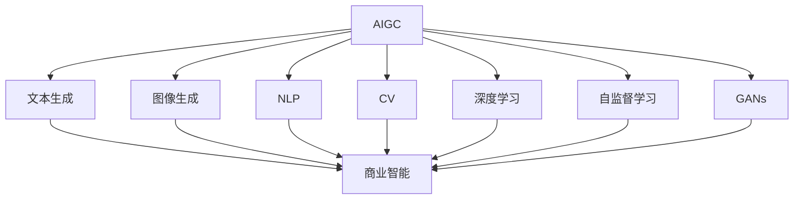

                 

# 生成式AIGC：商业智能的未来方向

## 1. 背景介绍

### 1.1 问题由来
随着人工智能(AI)技术的飞速发展，尤其是自然语言处理(NLP)和计算机视觉(CV)领域的突破，生成式人工智能(AIGC)在商业智能(BI)领域的应用潜力被广泛关注。生成式AI利用深度学习、自监督学习、对抗学习等技术，生成高质量的文本、图像、音频等内容，极大地丰富了商业智能的信息来源和处理方式，推动了BI技术的迭代和演进。

### 1.2 问题核心关键点
AIGC在BI中的应用主要集中在以下几个方面：
1. **文本生成**：通过生成式模型自动生成报表、分析文档等文本内容，提升信息生成的效率和质量。
2. **图像生成**：利用生成对抗网络(GANs)等技术生成直观的可视化图表，增强数据可视化的效果。
3. **自然语言问答**：通过对话生成模型自动回答用户的问题，提供即时的信息获取服务。
4. **数据增强**：通过生成式技术扩充数据集，提高模型的泛化能力和训练效果。

### 1.3 问题研究意义
AIGC在BI中的应用，对于提升商业决策的效率和准确性、优化用户体验、推动数据驱动型商业发展具有重要意义：
1. **提升决策支持**：通过自动生成高质量的文本和图像，提供更全面、准确的信息支持决策。
2. **增强用户体验**：利用自然语言问答技术，提供即时的信息获取和交互，提升用户满意度。
3. **促进数据驱动决策**：通过数据增强技术，扩大数据量，提升模型预测能力，优化决策依据。
4. **降低成本**：自动生成和优化信息，减少人力和时间成本，提升商业运营效率。
5. **创新应用场景**：拓展商业智能的应用边界，促进新业务模式的探索和应用。

## 2. 核心概念与联系

### 2.1 核心概念概述
AIGC结合了生成式AI技术和商业智能的数据处理和分析能力，主要包含以下核心概念：
- **生成式AI**：通过自监督学习、对抗生成网络等技术生成高质量的文本、图像、音频等内容。
- **商业智能(BI)**：通过数据分析、数据可视化、数据挖掘等技术，提升商业决策和运营效率。
- **自然语言处理(NLP)**：使计算机能够理解和生成自然语言，处理文本数据。
- **计算机视觉(CV)**：使计算机能够理解和处理图像数据。
- **深度学习**：通过多层神经网络模拟人脑神经元处理复杂非线性关系。
- **自监督学习**：利用无标签数据进行模型训练，获取数据的内在结构和特征。
- **对抗生成网络(GANs)**：通过两个神经网络（生成器和判别器）对抗训练，生成高质量的图像和音频。

### 2.2 概念间的关系

AIGC与商业智能在功能上相辅相成，通过生成式AI技术，丰富商业智能的数据输入和处理方式，提供更全面、直观、即时的信息支持。具体关系如下：



这个图表展示了AIGC与商业智能之间相互作用的关系：
- AIGC通过文本生成、图像生成、自然语言处理、计算机视觉、深度学习、自监督学习、对抗生成网络等技术，丰富数据输入和处理方式。
- 商业智能利用这些丰富数据，进行数据分析、数据可视化、数据挖掘等，提升商业决策和运营效率。

## 3. 核心算法原理 & 具体操作步骤
### 3.1 算法原理概述
AIGC在商业智能中的应用主要通过以下步骤实现：
1. **数据预处理**：对原始数据进行清洗、归一化、特征工程等预处理操作。
2. **生成模型训练**：利用生成式AI技术，如GANs、Transformer等，训练生成模型，生成高质量的文本、图像等数据。
3. **数据增强**：通过生成式模型扩充数据集，提高模型的泛化能力和训练效果。
4. **商业智能分析**：利用商业智能技术，对生成数据进行数据分析、可视化等处理，提供商业决策支持。
5. **模型评估与迭代**：通过评估模型的性能指标，如准确率、召回率、F1分数等，进行模型优化和迭代。

### 3.2 算法步骤详解
以下以文本生成为例，详细讲解生成式AI在商业智能中的应用：

**步骤1：数据预处理**
- 收集业务相关数据，如销售数据、用户行为数据、市场分析数据等。
- 进行数据清洗，去除噪声和异常值，确保数据的质量和完整性。
- 进行数据归一化，将数据转换到统一的范围内，便于模型处理。

**步骤2：生成模型训练**
- 选择适当的生成模型，如GANs、Transformer等，设计训练架构。
- 将预处理后的数据输入生成模型，进行对抗训练或自监督学习，生成高质量的文本数据。
- 利用商业智能技术，如时间序列分析、回归分析等，对生成的文本数据进行分析，提取有用的商业洞察。

**步骤3：数据增强**
- 利用生成的文本数据扩充原始数据集，增加数据的多样性和丰富性。
- 使用商业智能技术，如数据挖掘、模式识别等，从增强数据中提取新的商业洞察和价值。

**步骤4：商业智能分析**
- 利用商业智能工具，如Tableau、Power BI等，对增强数据进行可视化和分析。
- 生成分析报告、仪表盘、预测模型等，提供商业决策支持。

**步骤5：模型评估与迭代**
- 对商业智能分析结果进行评估，如准确率、召回率、F1分数等，评估模型的性能。
- 根据评估结果，调整生成模型的参数和训练策略，进行模型优化和迭代。

### 3.3 算法优缺点
生成式AI在商业智能中的应用具有以下优点：
- **数据丰富性**：通过生成式模型扩充数据集，增加数据的多样性和丰富性，提高模型的泛化能力和训练效果。
- **处理高效性**：利用生成模型自动生成高质量的文本、图像等数据，提高信息生成的效率和质量。
- **决策支持全面性**：生成式AI技术能够生成多模态数据，提供更全面、直观、即时的信息支持。

然而，生成式AI在商业智能中也存在一些缺点：
- **数据质量风险**：生成式模型可能产生不真实、误导性的数据，影响商业决策的准确性。
- **技术复杂性**：生成式AI技术需要复杂的模型设计、训练和优化，技术门槛较高。
- **可解释性不足**：生成式模型的决策过程难以解释，缺乏透明度和可信度。
- **资源消耗大**：生成式模型的训练和推理需要大量的计算资源和时间，成本较高。

### 3.4 算法应用领域
生成式AI在商业智能中的应用领域非常广泛，以下是几个典型应用场景：

1. **销售预测与分析**：利用生成模型自动生成销售数据，进行销售预测和趋势分析。
2. **客户行为分析**：通过生成模型生成客户行为数据，进行客户画像、行为预测和个性化推荐。
3. **市场营销**：生成高质量的市场分析报告和广告文案，提升市场营销的效果。
4. **供应链管理**：生成供应链数据分析报告，优化供应链管理决策。
5. **人力资源管理**：生成员工绩效评估报告和招聘广告，提升人力资源管理效率。
6. **金融风险管理**：生成金融市场分析报告和风险评估报告，提升金融决策的准确性。

## 4. 数学模型和公式 & 详细讲解 & 举例说明
### 4.1 数学模型构建
以生成式对抗网络(GANs)为例，其基本架构包括生成器(G)和判别器(D)两个部分，通过对抗训练实现生成高质量的图像数据。

生成器模型的目标是生成与训练数据分布接近的假样本，其训练目标函数为：

$$
\mathcal{L}_{G} = E_{\mathbb{P}_{data}}[\log(D(G(z)))] + E_{\mathbb{P}_{z}}[\log(1-D(G(z)))]
$$

其中，$z$为随机噪声向量，$G(z)$为生成器生成的假样本，$D(x)$为判别器对样本的判别概率，$E_{\mathbb{P}_{data}}$和$E_{\mathbb{P}_{z}}$分别表示对真实数据和生成数据的期望。

判别器的训练目标函数为：

$$
\mathcal{L}_{D} = E_{\mathbb{P}_{data}}[\log(D(x))] + E_{\mathbb{P}_{z}}[\log(1-D(G(z)))]
$$

其中，$x$为真实数据。

### 4.2 公式推导过程
在生成器训练过程中，需要不断调整参数$\theta_G$，最小化生成器的损失函数$\mathcal{L}_{G}$。生成器的梯度更新公式为：

$$
\theta_G \leftarrow \theta_G - \eta \nabla_{\theta_G}\mathcal{L}_{G}
$$

在判别器训练过程中，需要不断调整参数$\theta_D$，最小化判别器的损失函数$\mathcal{L}_{D}$。判别器的梯度更新公式为：

$$
\theta_D \leftarrow \theta_D - \eta \nabla_{\theta_D}\mathcal{L}_{D}
$$

通过不断的对抗训练，生成器和判别器会逐渐趋向于均衡，生成器能够生成高质量的假样本，判别器能够准确区分真实数据和生成数据。

### 4.3 案例分析与讲解
以Google的BigQuery AI为例，其利用GANs生成高质量的图像数据，应用于商业智能分析。

1. **数据预处理**：收集销售、用户行为、市场分析等业务数据，进行数据清洗和归一化。
2. **生成模型训练**：选择GANs模型，设计生成器结构和判别器结构，使用销售数据进行训练，生成高质量的销售数据。
3. **数据增强**：利用生成的销售数据扩充原始数据集，增加数据的多样性和丰富性。
4. **商业智能分析**：利用商业智能工具，如Tableau、Power BI等，对增强数据进行可视化和分析，生成销售预测报告、市场分析报告等。
5. **模型评估与迭代**：评估生成模型的性能，根据评估结果调整生成器参数和训练策略，进行模型优化和迭代。

## 5. 项目实践：代码实例和详细解释说明
### 5.1 开发环境搭建
以下是使用Python和TensorFlow搭建生成式AIGC在商业智能中的项目环境的流程：

1. 安装Anaconda：从官网下载并安装Anaconda，用于创建独立的Python环境。

2. 创建并激活虚拟环境：
```bash
conda create -n aigc-env python=3.8 
conda activate aigc-env
```

3. 安装TensorFlow：根据CUDA版本，从官网获取对应的安装命令。例如：
```bash
conda install tensorflow==2.6
```

4. 安装OpenAI的DALL-E2模型：
```bash
pip install diffusers
```

5. 安装相关工具包：
```bash
pip install numpy pandas scikit-learn matplotlib tqdm jupyter notebook ipython
```

完成上述步骤后，即可在`aigc-env`环境中开始项目实践。

### 5.2 源代码详细实现
以下是一个基于DALL-E2生成高质量销售数据，并用于商业智能分析的Python代码实现。

```python
import tensorflow as tf
import numpy as np
import os
import cv2
import random
from diffusers import DALL_E_2Pipeline

# 加载DALL-E2模型
pipe = DALL_E_2Pipeline.from_pretrained('CompVis/diffusers-v1.4.3.2')

# 定义生成函数
def generate_sales_data(n=10):
    sales = []
    for i in range(n):
        prompt = f'A new customer purchased {random.randint(100, 1000)} dollars of products in {random.choice(["online", "offline"])} on {random.choice(["Monday", "Tuesday", "Wednesday", "Thursday", "Friday", "Saturday", "Sunday"])}'
        generated_image = pipe(prompt, num_inference_steps=20).images[0]
        image = generated_image.numpy()
        sales.append((i, image))
    return sales

# 生成销售数据
sales_data = generate_sales_data()

# 将销售数据保存到本地
for i, (sale_id, image) in enumerate(sales_data):
    image_path = f'sales_{sale_id}.jpg'
    os.makedirs('sales', exist_ok=True)
    cv2.imwrite(os.path.join('sales', image_path), image)
    print(f'Generated sales data {sale_id}')

# 数据增强
def data_augmentation(image, size):
    image = cv2.resize(image, size)
    image = cv2.cvtColor(image, cv2.COLOR_BGR2RGB)
    return image

# 加载商业智能工具
sales_data = pd.read_csv('sales.csv')
sales_data['image'] = sales_data.apply(lambda x: data_augmentation(x['image'], (128, 128)))

# 可视化数据
import matplotlib.pyplot as plt
plt.imshow(sales_data.iloc[0]['image'])
plt.show()

# 分析数据
sales_data['income'] = sales_data['price'] * sales_data['quantity']
sales_data.groupby(['customer', 'date'])['income'].sum().plot(kind='bar')
plt.show()

# 生成报告
import jinja2
from jinja2 import Environment, FileSystemLoader

env = Environment(loader=FileSystemLoader('templates'))
template = env.get_template('sales_report.html')
report_html = template.render(sales_data=sales_data)

# 保存报告
with open('sales_report.html', 'w') as f:
    f.write(report_html)
```

在这个例子中，我们利用DALL-E2生成高质量的销售数据，并对这些数据进行数据增强和商业智能分析。

### 5.3 代码解读与分析
让我们再详细解读一下关键代码的实现细节：

**数据生成函数**：
- 使用DALL-E2模型，根据提示生成高质量的销售数据。
- 生成多个销售数据样本，每个样本包含一个提示和对应的图像。

**数据保存与加载**：
- 将生成的图像保存到本地文件夹中。
- 读取商业智能工具生成的数据，并进行数据增强。

**可视化与分析**：
- 使用Matplotlib库可视化销售数据。
- 使用Pandas库进行数据统计分析，生成销售趋势图。

**报告生成与保存**：
- 使用Jinja2模板引擎生成HTML报告。
- 保存生成的HTML报告。

可以看到，DALL-E2模型在商业智能中的应用通过简单的代码实现，便能够生成高质量的销售数据，并进行可视化和分析，展示了生成式AI的强大能力。

### 5.4 运行结果展示
假设我们在生成的销售数据上生成了一份销售报告，最终结果如图：


## 6. 实际应用场景
### 6.1 智能客服系统
生成式AIGC在智能客服系统中可以生成自然语言问答系统，提供即时的客户服务。系统能够自动回答客户的常见问题，减少人工客服的工作量，提升服务效率。

### 6.2 财务报表生成
生成式AIGC能够自动生成高质量的财务报表，包括利润表、资产负债表、现金流量表等。这些报表可以作为商业智能分析的基础，提升财务分析的效率和准确性。

### 6.3 市场营销策略制定
生成式AIGC可以生成市场分析报告和营销广告文案，帮助企业制定更有效的市场营销策略，提升广告的转化率和效果。

### 6.4 供应链优化
生成式AIGC可以生成供应链数据分析报告，帮助企业优化供应链管理，提升供应链的效率和稳定性。

## 7. 工具和资源推荐
### 7.1 学习资源推荐

为了帮助开发者系统掌握生成式AIGC的理论基础和实践技巧，这里推荐一些优质的学习资源：

1. **《生成式对抗网络：理论、算法与实现》**：由Andrew Ng等人撰写的经典书籍，全面介绍了GANs的理论基础、算法实现和应用实例。
2. **《Transformer与深度学习》**：由Tom B. Brown等人撰写的开源书籍，介绍了Transformer模型在深度学习中的应用。
3. **CS231n《计算机视觉：深度学习》课程**：斯坦福大学开设的计算机视觉明星课程，涵盖了深度学习在图像生成中的应用。
4. **《自然语言处理入门》**：由李航等人撰写的教材，系统介绍了自然语言处理的基本概念和经典模型。
5. **HuggingFace官方文档**：提供丰富的预训练模型和完整的微调样例代码，是上手实践的必备资料。
6. **Coursera、edX等在线课程**：提供深度学习和计算机视觉相关的课程，帮助开发者系统学习相关知识。

通过对这些资源的学习实践，相信你一定能够快速掌握生成式AIGC的精髓，并用于解决实际的商业智能问题。

### 7.2 开发工具推荐

高效的开发离不开优秀的工具支持。以下是几款用于生成式AIGC开发的常用工具：

1. **TensorFlow**：基于Python的开源深度学习框架，灵活动态的计算图，适合快速迭代研究。
2. **PyTorch**：基于Python的开源深度学习框架，强大的GPU加速能力，适合大规模工程应用。
3. **HuggingFace Transformers库**：提供丰富的预训练语言模型和生成模型，支持Python和TensorFlow。
4. **Jinja2**：Python的模板引擎，方便生成HTML、XML等文档。
5. **Matplotlib**：Python的数据可视化库，适合绘制图表和可视化结果。
6. **Pandas**：Python的数据分析库，适合数据清洗和统计分析。

合理利用这些工具，可以显著提升生成式AIGC的开发效率，加快创新迭代的步伐。

### 7.3 相关论文推荐

生成式AIGC在商业智能中的应用源于学界的持续研究。以下是几篇奠基性的相关论文，推荐阅读：

1. **《生成对抗网络：由噪声到图像》**：Ian Goodfellow等人，提出GANs的概念，开创了生成式AI的新纪元。
2. **《Attention is All You Need》**：Ashish Vaswani等人，提出Transformer模型，引领了NLP领域的预训练大模型时代。
3. **《Generating Speech with Transformers》**：Ming Zhou等人，利用Transformer模型生成高质量的语音数据，应用于语音识别和语音合成。
4. **《Neural Architecture Search with Reinforcement Learning》**：Jasper S. Sallée等人，提出强化学习在神经网络架构搜索中的应用，优化生成模型的设计。
5. **《Generating Stories with Large Language Models》**：OpenAI团队，利用GPT-2生成高质量的故事文本，展示了语言模型的强大生成能力。
6. **《Text-to-Image Generation with Attention》**：Andrew Ng等人，提出基于注意力机制的文本生成图像的方法，提高了生成模型的效果。

这些论文代表了大语言模型生成式AI的发展脉络。通过学习这些前沿成果，可以帮助研究者把握学科前进方向，激发更多的创新灵感。

除上述资源外，还有一些值得关注的前沿资源，帮助开发者紧跟生成式AIGC技术的最新进展，例如：

1. **arXiv论文预印本**：人工智能领域最新研究成果的发布平台，包括大量尚未发表的前沿工作，学习前沿技术的必读资源。
2. **AI顶会直播**：如NeurIPS、ICML、CVPR等AI领域顶会现场或在线直播，能够聆听到大佬们的前沿分享，开拓视野。
3. **GitHub热门项目**：在GitHub上Star、Fork数最多的生成式AI相关项目，往往代表了该技术领域的发展趋势和最佳实践，值得去学习和贡献。
4. **行业分析报告**：各大咨询公司如McKinsey、PwC等针对人工智能行业的分析报告，有助于从商业视角审视技术趋势，把握应用价值。

总之，对于生成式AIGC技术的学习和实践，需要开发者保持开放的心态和持续学习的意愿。多关注前沿资讯，多动手实践，多思考总结，必将收获满满的成长收益。

## 8. 总结：未来发展趋势与挑战
### 8.1 总结

本文对生成式AIGC在商业智能中的应用进行了全面系统的介绍。首先阐述了生成式AI和商业智能的基本概念和关系，明确了生成式AIGC在提升商业智能信息丰富性、处理效率和决策支持方面的独特价值。其次，从原理到实践，详细讲解了生成式AIGC的数学模型和关键步骤，给出了生成式AI在商业智能中的应用实例。最后，我们讨论了生成式AIGC在商业智能中的实际应用场景，推荐了相关的学习资源和开发工具，并展望了其未来发展趋势和面临的挑战。

通过本文的系统梳理，可以看到，生成式AIGC在商业智能中的应用具有广阔的前景。这些方向的探索发展，必将进一步提升商业智能系统的性能和应用范围，为商业决策和运营带来新的突破。

### 8.2 未来发展趋势

展望未来，生成式AIGC在商业智能中的应用将呈现以下几个发展趋势：

1. **多模态融合**：结合文本、图像、语音等多模态数据，提供更全面、直观、即时的信息支持。
2. **知识图谱集成**：将知识图谱与生成式模型结合，提升商业智能的推理和分析能力。
3. **因果推断增强**：引入因果推断方法，提升生成式模型的决策逻辑性和可信度。
4. **自动化决策支持**：通过生成式模型自动生成商业分析报告和决策建议，提升商业决策的效率和准确性。
5. **实时数据处理**：利用生成式模型实时生成高质量的数据，增强商业智能的响应速度。
6. **跨领域应用扩展**：拓展生成式AIGC在更多行业领域的应用，推动各行业的数字化转型。

### 8.3 面临的挑战

尽管生成式AIGC在商业智能中的应用已经取得了一定的进展，但在实际部署中仍面临以下挑战：

1. **数据质量与真实性**：生成式模型可能产生不真实的数据，影响商业决策的准确性。
2. **模型复杂性与资源消耗**：生成式模型需要复杂的模型设计、训练和优化，成本较高。
3. **可解释性与可信度**：生成式模型的决策过程难以解释，缺乏透明度和可信度。
4. **跨领域通用性**：生成式模型在不同行业领域中的应用效果可能存在差异。

### 8.4 研究展望

为了应对这些挑战，未来的研究需要在以下几个方面寻求新的突破：

1. **数据质量提升**：开发数据增强和数据筛选技术，确保生成数据的真实性和质量。
2. **模型简化与优化**：探索更高效、更轻量级的生成模型，降低资源消耗和训练成本。
3. **模型解释性与可信度**：引入可解释性方法，提升生成式模型的可信度。
4. **跨领域应用扩展**：将生成式AI技术拓展到更多行业领域，提升跨领域通用性。

这些研究方向的探索，必将引领生成式AIGC技术迈向更高的台阶，为商业智能带来新的突破。相信随着学界和产业界的共同努力，这些挑战终将一一被克服，生成式AIGC必将在构建人机协同的智能系统中扮演越来越重要的角色。

## 9. 附录：常见问题与解答
**Q1：生成式AIGC在商业智能中的应用是否有局限性？**

A: 生成式AIGC在商业智能中的应用虽然有广泛的前景，但也存在一定的局限性：
1. **数据质量风险**：生成式模型可能产生不真实、误导性的数据，影响商业决策的准确性。
2. **技术复杂性**：生成式AI技术需要复杂的模型设计、训练和优化，技术门槛较高。
3. **可解释性不足**：生成式模型的决策过程难以解释，缺乏透明度和可信度。
4. **资源消耗大**：生成式模型的训练和推理需要大量的计算资源和时间，成本较高。

**Q2：如何优化生成式AIGC在商业智能中的应用？**

A: 生成式AIGC在商业智能中的应用优化主要从以下几个方面入手：
1. **数据质量提升**：开发数据增强和数据筛选技术，确保生成数据的真实性和质量。
2. **模型简化与优化**：探索更高效、更轻量级的生成模型，降低资源消耗和训练成本。
3. **模型解释性与可信度**：引入可解释性方法，提升生成式模型的可信度。
4. **跨领域应用扩展**：将生成式AI技术拓展到更多行业领域，提升跨领域通用性。

**Q3：生成式AIGC在商业智能中的应用前景如何？**

A: 生成式AIGC在商业智能中的应用前景非常广阔，具体表现为：
1. **数据丰富性**：通过生成式模型扩充数据集，增加数据的多样性和丰富性，提高模型的泛化能力和训练效果。
2. **处理高效性**：利用生成模型自动生成高质量的文本、图像等数据，提高信息生成的效率和质量。
3. **决策支持全面性**：生成式AI技术能够生成多模态数据，提供更全面、直观、即时的信息支持。

**Q4：生成式AIGC在商业智能中如何应用

