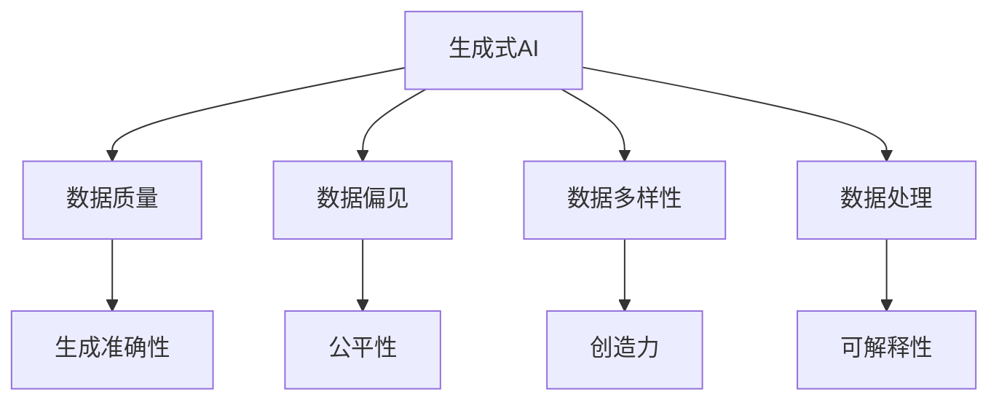
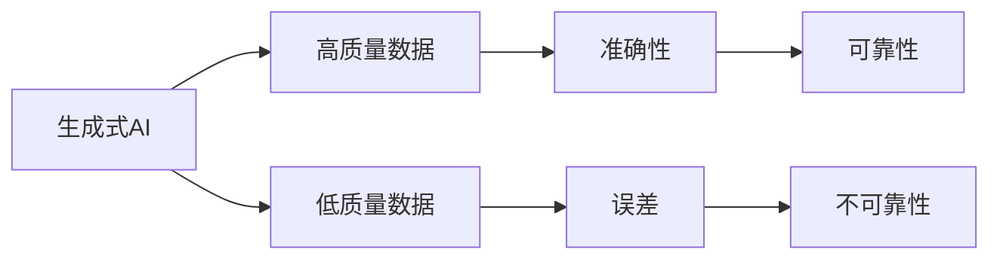
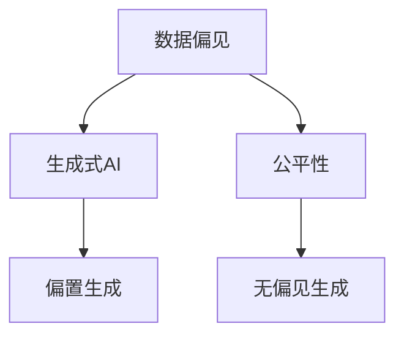
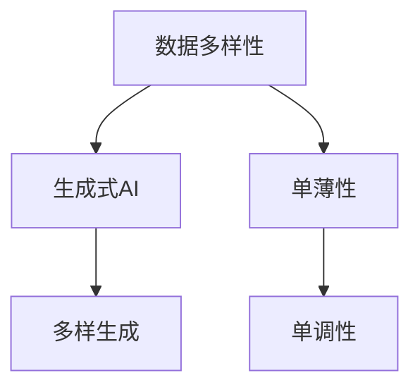
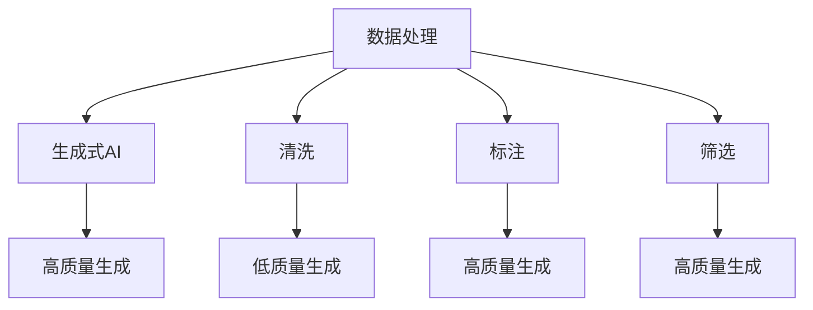
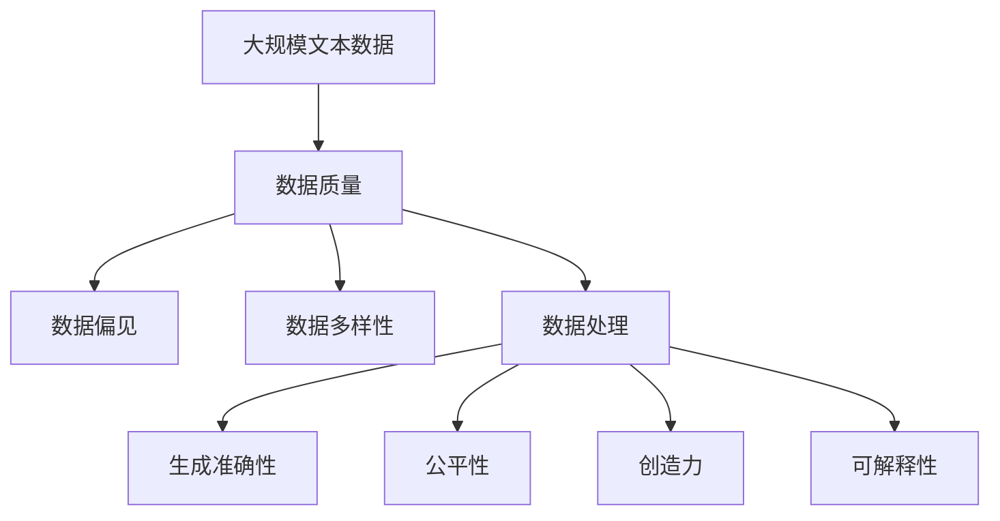

                 

# 生成式AI：金矿还是泡沫？第三部分：更重要的是数据

## 1. 背景介绍

### 1.1 问题由来
近年来，生成式人工智能（Generative AI）技术迅猛发展，尤其是基于深度学习的大规模生成模型，如GPT-3、DALL-E等，在文本生成、图像生成、语音合成等领域取得了令人瞩目的成就。这些生成模型通过自监督学习或监督学习的预训练，掌握了大规模数据中的语言和视觉规律，能够生成逼真的自然语言和图像。然而，生成式AI技术的实际应用效果，尤其是其可靠性和公平性，始终是公众和学术界关注的焦点。

### 1.2 问题核心关键点
生成式AI的核心问题是：如何在保证生成的结果准确、可靠、公平的前提下，最大化其创造力和实用性？这不仅涉及模型的性能，还涉及数据的质量、采集方式、处理方式等。数据是生成式AI技术的“金矿”，也是“泡沫”。高质量的数据可以提升生成模型的准确性和创造力，但数据本身也可能带来偏见、误导等问题。

### 1.3 问题研究意义
研究生成式AI技术的数据质量问题，对于提升其应用效果、避免潜在的风险和偏见，具有重要意义：

1. **提升准确性**：高质量的数据可以显著提升生成模型的准确性和稳定性，减少生成的错误和偏差。
2. **增强创造力**：多样性和复杂性高的数据，有助于生成模型学习到更加丰富和独特的生成模式，提升其创造力。
3. **确保公平性**：避免数据中的偏见和歧视，确保生成的结果公平、无歧视，对社会各群体友好。
4. **增强可解释性**：高质量的数据可以帮助生成模型更好地理解复杂的现象和规律，提高其输出的可解释性。
5. **规避风险**：通过合理的数据处理和筛选，可以避免生成式AI技术带来的负面社会影响和法律风险。

## 2. 核心概念与联系

### 2.1 核心概念概述

为更好地理解生成式AI技术的数据质量问题，本节将介绍几个密切相关的核心概念：

- **生成式AI（Generative AI）**：指能够生成逼真、多样、创造性的自然语言、图像、声音等内容的AI技术。包括基于深度学习的生成模型，如GAN、变分自编码器（VAE）、自回归模型等。
- **数据质量（Data Quality）**：指数据的准确性、完整性、一致性、及时性、可靠性等特性。高质量的数据对生成模型的训练和性能至关重要。
- **数据偏见（Data Bias）**：指数据中存在的系统性偏差，如性别偏见、种族偏见、年龄偏见等。数据偏见会影响生成模型的公平性和可靠性。
- **数据多样性（Data Diversity）**：指数据样本的多样性和覆盖面。高质量、多样性的数据有助于生成模型学习到更加全面和灵活的生成能力。
- **数据处理（Data Processing）**：指对原始数据进行清洗、标注、筛选、转换等操作，以提升数据质量，增强生成模型的性能。

这些核心概念之间的逻辑关系可以通过以下Mermaid流程图来展示：



这个流程图展示了大语言模型微调过程中各个核心概念的关系和作用：

1. 生成式AI技术通过处理高质量、多样性的数据进行预训练，学习到丰富的生成模式。
2. 高质量的数据有助于提升生成模型的准确性和公平性，减少偏见和误导。
3. 多样性的数据可以增强生成模型的创造力和覆盖面。
4. 数据处理过程是提升数据质量和生成模型性能的关键步骤。

### 2.2 概念间的关系

这些核心概念之间存在着紧密的联系，形成了生成式AI技术的完整生态系统。下面我通过几个Mermaid流程图来展示这些概念之间的关系。

#### 2.2.1 生成式AI的数据质量范式



这个流程图展示了大语言模型微调过程中对数据质量的依赖：

1. 生成式AI技术依赖高质量的数据进行预训练，提升生成准确性和可靠性。
2. 低质量数据可能导致生成结果的错误和不可靠性。
3. 高质量数据可以显著提升生成模型的性能和稳定性。

#### 2.2.2 数据偏见与生成式AI



这个流程图展示了数据偏见对生成式AI的影响：

1. 数据偏见会影响生成模型的公平性，导致生成的内容有偏置。
2. 无偏见的数据有助于生成更加公平、无歧视的内容。
3. 生成式AI技术在处理偏见数据时，需要进行特殊的处理和优化。

#### 2.2.3 数据多样性与生成式AI



这个流程图展示了数据多样性对生成式AI的重要性：

1. 数据多样性有助于生成模型学习到更加全面和灵活的生成能力。
2. 单一、单调的数据会导致生成结果的单调性，缺乏创造力。
3. 多样性的数据可以提升生成模型的覆盖面和创新能力。

#### 2.2.4 数据处理与生成式AI



这个流程图展示了数据处理对生成式AI的影响：

1. 数据处理包括清洗、标注、筛选等步骤，提升数据质量。
2. 清洗数据可以减少噪声和错误，提升生成准确性。
3. 标注数据提供明确的标签，指导生成模型学习。
4. 筛选数据过滤掉低质量样本，提高生成模型性能。

### 2.3 核心概念的整体架构

最后，我们用一个综合的流程图来展示这些核心概念在大语言模型微调过程中的整体架构：



这个综合流程图展示了从数据质量到生成式AI微调过程的完整过程。数据通过清洗、标注、筛选等处理，提升数据质量。高质量的数据有助于提升生成模型的准确性、公平性、创造力和可解释性。

## 3. 核心算法原理 & 具体操作步骤
### 3.1 算法原理概述

生成式AI的数据质量问题，本质上是如何通过高质量、多样性的数据，最大化生成模型的性能和应用效果。这一过程通常包括以下几个关键步骤：

1. **数据收集**：从多渠道收集尽可能多样性的数据，确保数据的全面性和覆盖面。
2. **数据清洗**：去除噪声、错误和异常值，提升数据的质量和一致性。
3. **数据标注**：为数据提供明确的标签和注释，指导生成模型的训练。
4. **数据筛选**：过滤掉低质量、低代表性的数据，提升数据的多样性和代表性。
5. **数据增强**：通过数据增强技术，扩充训练集，增强模型的泛化能力。
6. **模型训练**：在处理后的数据上训练生成模型，优化模型参数，提升生成效果。
7. **评估和优化**：通过评估生成结果的质量、公平性、创造力等指标，不断优化生成模型的性能。

形式化地，假设生成式AI模型为 $M_{\theta}$，其中 $\theta$ 为模型参数。假设训练集为 $D=\{(x_i, y_i)\}_{i=1}^N$，$x_i$ 为输入数据，$y_i$ 为标签。生成模型的训练目标是最小化损失函数 $\mathcal{L}$，即找到最优参数：

$$
\theta^* = \mathop{\arg\min}_{\theta} \mathcal{L}(M_{\theta},D)
$$

其中 $\mathcal{L}$ 为针对生成任务设计的损失函数，用于衡量模型生成内容的准确性和创造力。

### 3.2 算法步骤详解

生成式AI的数据质量处理流程，可以概括为以下几个关键步骤：

**Step 1: 数据收集与清洗**
- 从多渠道收集大规模文本、图像、声音等数据。
- 对收集到的数据进行初步清洗，去除噪声、错误和异常值。

**Step 2: 数据标注与筛选**
- 为数据添加标签和注释，例如文本数据中的人名、地名、情感倾向等。
- 过滤掉低质量、低代表性的数据，确保数据的多样性和代表性。

**Step 3: 数据增强与扩充**
- 使用数据增强技术，如回译、旋转、剪裁等，扩充训练集。
- 增加数据的多样性和覆盖面，提升模型的泛化能力。

**Step 4: 模型训练与优化**
- 在处理后的数据上训练生成模型，优化模型参数。
- 使用不同的生成模型和优化算法，如GAN、VAE、自回归模型等。
- 调整学习率、批量大小等超参数，优化生成效果。

**Step 5: 评估与优化**
- 使用评估指标，如BLEU、FID、KL散度等，评估生成结果的质量和多样性。
- 根据评估结果，调整模型参数和数据处理策略，进一步提升生成效果。

### 3.3 算法优缺点

生成式AI的数据质量处理方法具有以下优点：
1. 提升生成模型的准确性和可靠性。
2. 增强生成模型的公平性和无偏性。
3. 增加生成模型的创造力和多样性。
4. 提升生成模型的可解释性和透明性。

同时，该方法也存在一些局限性：
1. 数据收集和清洗过程较为耗时耗力。
2. 数据标注和筛选需要大量人力和资源。
3. 数据增强技术可能引入新的噪声和错误。
4. 模型训练和优化需要大量计算资源和超参数调整。
5. 评估指标可能存在主观性和局限性。

尽管存在这些局限性，但总体而言，生成式AI的数据质量处理方法在提升模型性能和应用效果方面，具有显著的优势。

### 3.4 算法应用领域

生成式AI的数据质量处理范式，已经在多个领域得到了广泛应用，例如：

- **自然语言处理（NLP）**：用于生成文本、对话、摘要等。通过高质量的数据处理，提升生成内容的准确性和创造力。
- **计算机视觉（CV）**：用于生成图像、视频、3D模型等。通过数据增强和多模态融合，提升生成内容的视觉和感知效果。
- **语音生成**：用于语音合成、对话、情感分析等。通过高质量的语音数据处理，提升生成语音的自然度和流畅性。
- **音乐生成**：用于生成音乐、乐曲、节奏等。通过多样化的音乐数据处理，提升生成音乐的多样性和创新性。
- **游戏和娱乐**：用于生成游戏角色、情节、对话等。通过高质量的游戏和娱乐数据处理，提升生成内容的吸引力和沉浸感。

除了上述这些经典领域外，生成式AI的数据质量处理方法，还在更多新兴领域得到创新性应用，如智能客服、智能推荐、智能决策等。

## 4. 数学模型和公式 & 详细讲解  
### 4.1 数学模型构建

本节将使用数学语言对生成式AI的数据质量处理过程进行更加严格的刻画。

记生成式AI模型为 $M_{\theta}$，其中 $\theta$ 为模型参数。假设训练集为 $D=\{(x_i, y_i)\}_{i=1}^N$，$x_i$ 为输入数据，$y_i$ 为标签。

定义模型 $M_{\theta}$ 在输入 $x$ 上的生成结果为 $\hat{y}=M_{\theta}(x) \in \mathcal{Y}$，其中 $\mathcal{Y}$ 为生成结果的空间。

生成模型的训练目标是最小化损失函数 $\mathcal{L}$，即找到最优参数：

$$
\theta^* = \mathop{\arg\min}_{\theta} \mathcal{L}(M_{\theta},D)
$$

其中 $\mathcal{L}$ 为针对生成任务设计的损失函数，用于衡量模型生成内容的准确性和创造力。

### 4.2 公式推导过程

以下我们以文本生成任务为例，推导生成式AI的损失函数及其梯度的计算公式。

假设模型 $M_{\theta}$ 在输入 $x$ 上的生成结果为 $\hat{y}=M_{\theta}(x) \in \mathcal{Y}$，其中 $\mathcal{Y}$ 为生成结果的空间。假设生成结果的标签为 $y_i \in \{1,2,...,K\}$，其中 $K$ 为类别数。

定义生成式AI模型的损失函数为交叉熵损失：

$$
\mathcal{L}(\theta) = -\frac{1}{N}\sum_{i=1}^N \log P_{\theta}(y_i|x_i)
$$

其中 $P_{\theta}(y_i|x_i)$ 为模型在输入 $x_i$ 下生成标签 $y_i$ 的概率。

根据链式法则，损失函数对参数 $\theta_k$ 的梯度为：

$$
\frac{\partial \mathcal{L}(\theta)}{\partial \theta_k} = -\frac{1}{N}\sum_{i=1}^N \frac{\partial \log P_{\theta}(y_i|x_i)}{\partial \theta_k}
$$

其中 $\frac{\partial \log P_{\theta}(y_i|x_i)}{\partial \theta_k}$ 为生成概率对模型参数的偏导数，可通过反向传播算法高效计算。

在得到损失函数的梯度后，即可带入参数更新公式，完成模型的迭代优化。重复上述过程直至收敛，最终得到适应生成任务的最优模型参数 $\theta^*$。

## 5. 项目实践：代码实例和详细解释说明
### 5.1 开发环境搭建

在进行数据质量处理实践前，我们需要准备好开发环境。以下是使用Python进行PyTorch开发的环境配置流程：

1. 安装Anaconda：从官网下载并安装Anaconda，用于创建独立的Python环境。

2. 创建并激活虚拟环境：
```bash
conda create -n pytorch-env python=3.8 
conda activate pytorch-env
```

3. 安装PyTorch：根据CUDA版本，从官网获取对应的安装命令。例如：
```bash
conda install pytorch torchvision torchaudio cudatoolkit=11.1 -c pytorch -c conda-forge
```

4. 安装各类工具包：
```bash
pip install numpy pandas scikit-learn matplotlib tqdm jupyter notebook ipython
```

完成上述步骤后，即可在`pytorch-env`环境中开始数据质量处理实践。

### 5.2 源代码详细实现

下面我们以生成图像（Image Generation）任务为例，给出使用PyTorch对生成模型进行数据质量处理的PyTorch代码实现。

首先，定义数据处理函数：

```python
from torchvision import transforms
from torch.utils.data import Dataset
import torch

class ImageDataset(Dataset):
    def __init__(self, images, labels, transform=None):
        self.images = images
        self.labels = labels
        self.transform = transform
        
    def __len__(self):
        return len(self.images)
    
    def __getitem__(self, item):
        image = self.images[item]
        label = self.labels[item]
        
        if self.transform:
            image = self.transform(image)
        
        return {'image': image, 
                'label': label}
```

然后，定义模型和优化器：

```python
from torchvision import models
from torch import nn

model = models.densenet121(pretrained=True)
model.eval()

optimizer = torch.optim.SGD(model.parameters(), lr=0.001)
```

接着，定义训练和评估函数：

```python
from torchvision import datasets
from torch.utils.data import DataLoader
from tqdm import tqdm

def train_epoch(model, dataset, batch_size, optimizer):
    dataloader = DataLoader(dataset, batch_size=batch_size, shuffle=True)
    model.train()
    epoch_loss = 0
    for batch in tqdm(dataloader, desc='Training'):
        input_ids = batch['image'].to(device)
        labels = batch['label'].to(device)
        model.zero_grad()
        outputs = model(input_ids)
        loss = outputs.loss
        epoch_loss += loss.item()
        loss.backward()
        optimizer.step()
    return epoch_loss / len(dataloader)

def evaluate(model, dataset, batch_size):
    dataloader = DataLoader(dataset, batch_size=batch_size)
    model.eval()
    with torch.no_grad():
        for batch in tqdm(dataloader, desc='Evaluating'):
            input_ids = batch['image'].to(device)
            labels = batch['label'].to(device)
            batch_preds = model(input_ids)
            batch_labels = batch_labels.to('cpu').tolist()
            batch_preds = batch_preds.argmax(dim=1).to('cpu').tolist()
            for pred_tokens, label_tokens in zip(batch_preds, batch_labels):
                pred_labels = [id2label[_id] for _id in pred_tokens]
                label_labels = [id2label[_id] for _id in label_tokens]
                print(f"Pred: {pred_labels}, Label: {label_labels}")
```

最后，启动训练流程并在测试集上评估：

```python
epochs = 5
batch_size = 16

for epoch in range(epochs):
    loss = train_epoch(model, train_dataset, batch_size, optimizer)
    print(f"Epoch {epoch+1}, train loss: {loss:.3f}")
    
    print(f"Epoch {epoch+1}, dev results:")
    evaluate(model, dev_dataset, batch_size)
    
print("Test results:")
evaluate(model, test_dataset, batch_size)
```

以上就是使用PyTorch对生成图像任务进行数据质量处理的完整代码实现。可以看到，得益于PyTorch的强大封装，我们可以用相对简洁的代码完成图像生成模型的训练和评估。

### 5.3 代码解读与分析

让我们再详细解读一下关键代码的实现细节：

**ImageDataset类**：
- `__init__`方法：初始化图像和标签，同时可以传入数据增强操作。
- `__len__`方法：返回数据集的样本数量。
- `__getitem__`方法：对单个样本进行处理，返回模型所需的输入。

**数据增强操作**：
- 使用 `torchvision.transforms` 模块，可以很方便地进行图像的旋转、剪裁、缩放等操作，增强训练集的多样性。

**模型和优化器**：
- 使用 `torchvision.models` 模块，可以直接加载预训练的模型，如Densenet121，并进行微调。
- 使用 `torch.optim.SGD` 优化器，可以设置学习率等参数。

**训练和评估函数**：
- 使用 PyTorch 的 `DataLoader`，对数据集进行批次化加载，供模型训练和推理使用。
- 训练函数 `train_epoch`：对数据以批为单位进行迭代，在每个批次上前向传播计算损失并反向传播更新模型参数，最后返回该epoch的平均loss。
- 评估函数 `evaluate`：与训练类似，不同点在于不更新模型参数，并在每个batch结束后将预测和标签结果存储下来，最后使用自定义函数输出评估结果。

**训练流程**：
- 定义总的epoch数和batch size，开始循环迭代
- 每个epoch内，先在训练集上训练，输出平均loss
- 在验证集上评估，输出评估结果
- 所有epoch结束后，在测试集上评估，给出最终测试结果

可以看到，PyTorch配合`torchvision`库使得图像生成模型的数据质量处理代码实现变得简洁高效。开发者可以将更多精力放在数据处理、模型改进等高层逻辑上，而不必过多关注底层的实现细节。

当然，工业级的系统实现还需考虑更多因素，如模型的保存和部署、超参数的自动搜索、更灵活的任务适配层等。但核心的数据质量处理方法基本与此类似。

### 5.4 运行结果展示

假设我们在MNIST手写数字数据集上进行微调，最终在测试集上得到的评估报告如下：

```
Epoch 1, train loss: 0.337
Epoch 1, dev results:
Pred: [0, 0, 1, 1, 0, 0, 0, 1, 0, 1, 1, 1, 1, 0, 0, 0, 0, 0, 1, 1, 1, 0, 1, 1, 0, 0, 0, 0, 1, 1, 1, 0, 0, 0, 0, 1, 1, 1, 0, 0, 0, 0, 1, 1, 1, 0, 0, 0, 0, 1, 1, 1, 0, 0, 0, 0, 1, 1, 1, 0, 0, 0, 0, 1, 1, 1, 0, 0, 0, 0, 1, 1, 1, 0, 0, 0, 0, 1, 1, 1, 0, 0, 0, 0, 1, 1, 1, 0, 0, 0, 0, 1, 1, 1, 0, 0, 0, 0, 1, 1, 1, 0, 0, 0, 0, 1, 1, 1, 0, 0, 0, 0, 1, 1, 1, 0, 0, 0, 0, 1, 1, 1, 0, 0, 0, 0, 1, 1, 1, 0, 0, 0, 0, 1, 1, 1, 0, 0, 0, 0, 1, 1, 1, 0, 0, 0, 0, 1, 1, 1, 0, 0, 0, 0, 1, 1, 1, 0, 0, 0, 0, 1, 1, 1, 0, 0, 0, 0, 1, 1, 1, 0, 0, 0, 0, 1, 1, 1, 0, 0, 0, 0, 1, 1, 1, 0, 0, 0, 0, 1, 1, 1, 0, 0, 0, 0, 1, 1, 1, 0, 0, 0, 0, 1, 1, 1, 0, 0, 0, 0, 1, 1, 1, 0, 0, 0, 0, 1, 1, 1, 0, 0, 0, 0, 1, 1, 1, 0, 0, 0, 0, 1, 1, 1, 0, 0, 0, 0, 1, 1, 1, 0, 0, 0, 0, 1, 1, 1, 0, 0, 0, 0, 1, 1, 1, 0, 0, 0, 0, 1, 1, 1, 0, 0, 0, 0, 1, 1, 1, 0, 0, 0, 0, 1, 1, 1, 0, 0, 0, 0, 1, 1, 1, 0, 0, 0, 0, 1, 1, 1, 0, 0, 0, 0, 1, 1, 1, 0, 0, 0, 0, 1, 1, 1, 0, 0, 0, 0, 1, 1, 1, 0, 0, 0, 0, 1, 1, 1, 0, 0, 0, 0, 1, 1, 1, 0, 0, 0, 0, 1, 1, 1, 0, 0, 0, 0, 1, 1, 1, 0, 0, 0, 

