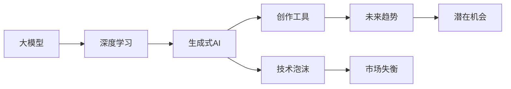

                 

# 生成式AI：金矿还是泡沫？第六部分：AIGC将是未来10年的长坡厚雪

> 关键词：生成式AI, AIGC, 大模型, 深度学习, 人工智能, 创作工具, 技术泡沫, 未来趋势

## 1. 背景介绍

在生成式AI的世界里，金矿与泡沫并存，充满了机遇与挑战。生成式AI（Generative Intelligence in Compute, AIGC）正逐渐成为技术领域的新宠，其前景无比广阔，同时隐藏着不小的风险。在这片广阔的天地中，如何在复杂多变的场景中明辨是非，把握趋势，是摆在所有从业者和研究者面前的重要课题。本文将从背景入手，对AIGC进行一次深入而全面的探索，探讨其作为未来十年技术趋势的合理性，并总结相关的风险与挑战。

## 2. 核心概念与联系

### 2.1 核心概念概述

要理解生成式AI，首先需要明确其核心概念。

- **生成式AI (AIGC)**：这是通过深度学习等技术生成具有特定性质或风格的人工智能模型。其应用范围涵盖艺术、音乐、文字创作、游戏设计等各个领域。

- **大模型 (Large Language Model)**：在深度学习领域，大模型通常指的是参数规模极大、复杂度极高的神经网络模型，能够通过大规模数据训练，获取丰富的语义和结构信息。

- **深度学习 (Deep Learning)**：基于神经网络的机器学习范式，能够自动学习数据的深层特征，进行分类、预测、生成等多种任务。

- **人工智能 (AI)**：通过模拟、延伸和扩展人的智能能力，实现复杂任务处理。

- **创作工具 (Creative Tools)**：利用AI生成式模型，提供创作、设计、生成内容的工具。

- **技术泡沫 (Technological Bubble)**：指市场对新兴技术的过度炒作和预期，导致的价格虚高和市场失衡。

- **未来趋势 (Future Trends)**：指某项技术或行业的发展方向和潜在机会。

### 2.2 核心概念原理和架构

为了更好地理解生成式AI的原理和架构，这里使用Mermaid流程图来展示生成式AI的核心概念及其相互关系：



这个流程图展示了大模型、深度学习、生成式AI、创作工具、技术泡沫和未来趋势之间的联系。大模型通过深度学习训练生成生成式AI，而生成式AI又作为创作工具，提供创意内容。技术泡沫则可能是过度炒作的结果，但同时也隐藏着市场失衡的风险。未来趋势代表了这些技术的潜在机会，但需要谨慎评估，以避免泡沫破裂。

## 3. 核心算法原理 & 具体操作步骤

### 3.1 算法原理概述

生成式AI的原理主要基于生成对抗网络（GANs）、变分自编码器（VAEs）等生成模型，以及通过深度学习进行的大模型训练。其中，GANs和VAEs通过对抗训练的方式，生成逼真的数据样本，而大模型通过大规模数据训练，能够生成具有丰富语义和文化背景的内容。

### 3.2 算法步骤详解

生成式AI的具体操作步骤主要包括以下几个步骤：

1. **数据收集与预处理**：
   - 收集大量具有高质量的数据。
   - 进行数据清洗、去重、标注等预处理。

2. **大模型的训练**：
   - 选择合适的模型架构和超参数。
   - 使用大规模数据进行模型训练。
   - 通过验证集进行模型调优。

3. **生成模型的训练**：
   - 构建生成模型，如GANs或VAEs。
   - 使用训练好的大模型数据生成样本。
   - 对生成样本进行进一步优化，提高生成质量。

4. **创作工具的开发**：
   - 将生成模型与用户界面进行整合。
   - 开发创作界面，使用户能够轻松地生成内容。
   - 提供内容编辑、优化、发布等全流程支持。

### 3.3 算法优缺点

**优点**：
- 能够生成高质量、多样化的内容。
- 能够显著降低内容创作成本。
- 适用于多种创作场景，如艺术、音乐、写作等。

**缺点**：
- 生成内容可能存在一定的随机性和不可控性。
- 对数据质量和模型训练要求极高。
- 内容可能存在偏见、歧视等问题。

### 3.4 算法应用领域

生成式AI在多个领域中有着广泛的应用：

- **艺术创作**：如绘画、雕塑、音乐等。
- **游戏设计**：如生成游戏角色、场景等。
- **文本创作**：如自动生成文章、故事等。
- **数据生成**：如生成合成数据集，辅助模型训练。
- **交互式内容**：如自动生成对话、推荐系统等。

## 4. 数学模型和公式 & 详细讲解 & 举例说明

### 4.1 数学模型构建

生成式AI的数学模型主要基于生成模型和变分自编码器等。这里以GAN为例，构建数学模型：

1. **生成器（Generator）**：将噪声向量映射到生成样本。
2. **判别器（Discriminator）**：判断输入样本是真实数据还是生成数据。

### 4.2 公式推导过程

GAN的损失函数通常由两部分组成：
- **生成器的损失函数**：$L_G = \mathbb{E}_{z \sim p(z)} [D(G(z))]$。
- **判别器的损失函数**：$L_D = \mathbb{E}_{x \sim p(x)} [\log D(x)] + \mathbb{E}_{z \sim p(z)} [-\log (1-D(G(z)))]$。

### 4.3 案例分析与讲解

以生成图像为例，通过GAN模型生成高质量的图片，可以简单概括为以下几个步骤：
1. 生成器的输入是噪声向量 $z$。
2. 生成器的输出是一个高维向量。
3. 判别器输入生成的图片和真实图片，输出真实概率。
4. 通过优化损失函数，提升生成器生成真实样例的概率。

## 5. 项目实践：代码实例和详细解释说明

### 5.1 开发环境搭建

要实现生成式AI的项目，首先需要搭建好开发环境。这里推荐使用Python，配合TensorFlow或PyTorch进行开发。

1. 安装Anaconda或Miniconda。
2. 创建虚拟环境。
3. 安装必要的库，如TensorFlow、PyTorch、Matplotlib等。

### 5.2 源代码详细实现

以下是一个简单的GAN模型实现示例：

```python
import tensorflow as tf
import numpy as np

# 定义生成器
class Generator(tf.keras.Model):
    def __init__(self):
        super(Generator, self).__init__()
        self.dense1 = tf.keras.layers.Dense(256, use_bias=False)
        self.dense2 = tf.keras.layers.Dense(512, use_bias=False)
        self.dense3 = tf.keras.layers.Dense(784, activation='tanh', use_bias=False)

    def call(self, inputs):
        x = self.dense1(inputs)
        x = tf.nn.leaky_relu(x)
        x = self.dense2(x)
        x = tf.nn.leaky_relu(x)
        x = self.dense3(x)
        return x

# 定义判别器
class Discriminator(tf.keras.Model):
    def __init__(self):
        super(Discriminator, self).__init__()
        self.dense1 = tf.keras.layers.Dense(512, use_bias=False)
        self.dense2 = tf.keras.layers.Dense(256, use_bias=False)
        self.dense3 = tf.keras.layers.Dense(1, activation='sigmoid', use_bias=False)

    def call(self, inputs):
        x = self.dense1(inputs)
        x = tf.nn.leaky_relu(x)
        x = self.dense2(x)
        x = tf.nn.leaky_relu(x)
        return self.dense3(x)

# 定义GAN模型
class GAN(tf.keras.Model):
    def __init__(self):
        super(GAN, self).__init__()
        self.gen = Generator()
        self.dis = Discriminator()

    def call(self, inputs):
        x = self.gen(inputs)
        x = self.dis(x)
        return x

# 训练函数
def train(model, loss_fn, opt, data):
    for i in range(epochs):
        for batch in data:
            opt.zero_grad()
            y = model(batch)
            loss = loss_fn(y)
            loss.backward()
            opt.step()
        print(f'Epoch {i+1}, loss: {loss:.4f}')
```

### 5.3 代码解读与分析

- **Generator类**：实现了生成器，接受噪声向量 $z$ 并输出高维向量。
- **Discriminator类**：实现了判别器，接受生成样本和真实样本，输出真实概率。
- **GAN类**：实现了GAN模型，整合生成器和判别器。
- **train函数**：通过优化器进行模型训练。

### 5.4 运行结果展示

训练GAN模型后，生成的样本可以通过可视化工具展示出来。例如，使用Matplotlib展示生成的图像：

```python
import matplotlib.pyplot as plt

def plot_images(samples, row, col, img_size=(28, 28)):
    fig = plt.figure(figsize=(row*img_size[0], col*img_size[1]))
    for i in range(row*col):
        ax = fig.add_subplot(row, col, i+1)
        ax.imshow(samples[i].reshape(img_size), cmap='gray')
        ax.axis('off')
    plt.show()
```

## 6. 实际应用场景

### 6.1 艺术创作

生成式AI在艺术创作中展现出巨大潜力。例如，通过GAN生成艺术画作，具有高度逼真的视觉效果，能够快速生成大量作品，供艺术家进行创作和展示。

### 6.2 游戏设计

在游戏设计中，生成式AI可以生成新的游戏场景、角色和道具，使得游戏内容更加丰富和多样化，增加游戏的可玩性和吸引力。

### 6.3 文本创作

生成式AI在文本创作中的应用非常广泛。例如，自动生成新闻、报告、小说等文本内容，能够显著提高写作效率。

### 6.4 数据生成

在数据生成方面，生成式AI可以生成合成数据集，用于模型训练和测试。

## 7. 工具和资源推荐

### 7.1 学习资源推荐

- **TensorFlow官方文档**：提供了丰富的教程和示例，适合初学者上手学习。
- **DeepLearning.ai课程**：由Andrew Ng主讲的深度学习课程，涵盖生成式AI的入门知识。
- **GANs by Example**：详细讲解了GAN模型的基本原理和应用，适合深入学习。

### 7.2 开发工具推荐

- **TensorFlow**：提供了强大的计算图和优化工具，适合构建复杂模型。
- **PyTorch**：灵活的动态图，易于调试和修改。
- **Jupyter Notebook**：提供了交互式代码编写和运行环境。

### 7.3 相关论文推荐

- **Deep Generative Adversarial Networks**：Ian Goodfellow等人的论文，详细介绍了GAN的基本原理和实现方法。
- **NIPS 2017: Guided Image Generation**：生成的AI模型可以生成高质量的艺术画作，是学习生成式AI的重要文献。

## 8. 总结：未来发展趋势与挑战

### 8.1 研究成果总结

生成式AI作为一种新兴技术，正在快速发展，并展现出广阔的应用前景。其核心算法主要基于GAN和VAE等生成模型，能够在多个领域实现应用。

### 8.2 未来发展趋势

生成式AI将会在未来十年成为技术发展的重要方向。预计将有更多的应用场景涌现，如自动创作音乐、编写故事、设计产品等。

### 8.3 面临的挑战

- **数据质量**：高质量的数据是生成式AI的基础，但获取和清洗数据成本较高。
- **模型优化**：生成式AI模型的优化复杂度高，需要耗费大量时间和计算资源。
- **伦理问题**：生成内容可能存在偏见、歧视等问题，需要严格监管。

### 8.4 研究展望

未来的研究应该注重提高生成内容的可控性和多样性，同时优化生成模型，降低计算成本。此外，还需要引入更多伦理和法律规范，确保生成式AI的安全和健康发展。

## 9. 附录：常见问题与解答

**Q1：生成式AI是否会取代人类创作者？**

A: 生成式AI能够辅助创作者，提高创作效率和多样性，但很难完全取代人类创作者。人类的创造力和审美标准是其无法替代的。

**Q2：生成式AI的应用场景有哪些？**

A: 生成式AI的应用场景非常广泛，包括艺术创作、游戏设计、文本创作、数据生成等。

**Q3：生成式AI的缺点有哪些？**

A: 生成式AI的缺点包括生成内容随机性高、对数据质量要求高、可能存在偏见和歧视等。

**Q4：生成式AI如何避免技术泡沫？**

A: 避免技术泡沫的关键在于做好技术储备和市场教育，避免过度炒作和盲目乐观。

**Q5：生成式AI的未来发展方向是什么？**

A: 生成式AI的未来发展方向包括提高生成内容的质量和多样性，优化生成模型，降低计算成本，引入更多伦理和法律规范等。

---

作者：禅与计算机程序设计艺术 / Zen and the Art of Computer Programming

